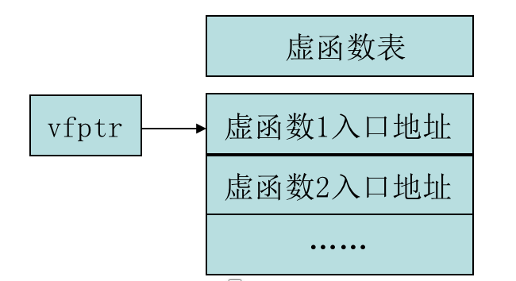

## 1.多态
多态性是面对象设计语言的基本特征之一。仅仅是将数据和函数捆绑在一起，进行类的封装，使用一些简单的继承还不能算是真正应用了面向对象的设计思想。**多态性是面向对象的精髓**。

多态性可以简单概括为：
- 一个接口
- 多种方法

其实函数重载就是一种简单的多态，一个函数名（调用借口）对应着几个不同的函数原型（方法）

比如：

- 警车鸣笛，普通人反应一般，逃犯听见会大惊失色。警车鸣笛（同一种行为），导致普通人和逃犯不同反应(多种形态)。
- 再如，指令“画出昆虫的图片”，对蚂蚁和对蜘蛛这2种昆虫画出的是不同的图片。

> 通常是指对于同一个消息、同一种调用，在不同的场合，不同的情况下，执行不同的行为 


设计多态的主要目的是：定义一个祖先类（基类），并定义一些**虚函数**(`virtual`)接口，但是这个函数接口中并不给出具体的实现，或者说只给出一些简单的实现，具体工作留给后代（派生类）去实现。

```cpp
#include <iostream>
using namespace std;
//基类
class CWorm {
public:
    //虚函数，希望派生来定义适合其自身的版本
    virtual void Draw() {
        cout << "CWorm::Draw()" << endl;
    }
    virtual void Draw1() {
        cout << "CWorm::Draw1()" << endl;
    }
};
// 定义一个派生类继承CWorm
class CAnt:public CWorm {
public:
    void Draw() {
        cout << "CAnt::Draw()" << endl;
    }
};
class CSpider:public CWorm {
public:
    void Draw() {
        cout<<"CSpider::Draw()"<<endl;
    }
};
//以类作为函数参数传递
void display(CWorm *p) {
    p->Draw();
}

int main() {
    CWorm *pWorm;
    CAnt ant;
    CSpider spider;
    pWorm = &ant;
    pWorm -> Draw();  //CAnt::Draw()
    pWorm=&spider;
    pWorm->Draw();  //CSpider::Draw()
    //优先调用派生类的方法，派生类没有才会调用基类的方法
    pWorm->Draw1(); //CWorm::Draw1()

    display(pWorm); //CSpider::Draw()
    display(new CWorm);  //CWorm::Draw()
    //也可以传递派生类
    display(new CAnt);   //CAnt::Draw()
    return 0;
}
```

## 2.多态与虚函数

多态性通俗地说就是指**同一个操作作用于不同的对象机会产生不同的响应**。

多态性分为**静态多态性和**动态多态性**，

*其中函数重载和运算符重载属于静态多态性*

*C++是依靠虚函数来实现动态多态的*

### 2.1静态联编（静态绑定）

程序调用函数时，具体应该使用哪个代码块是由编译器决定的。以函数重载为例，`C++`编译器根据传递给函数的参数和函数名决定具体要使用哪一个函数，称为联编（`binding`）。

编译器可以在编译过程中完成这种联编，在编译过程中进行的联编叫**静态联编**（`static binding`）或早期联编（`early binding`）。

### 2.2 动态联编

在一些场合下，编译器无法在编译过程中完成联编，必须**在程序运行时完成**选择，因此编译器必须提供一套”动态联编“的机制，也叫作晚起联编，C++通过虚函数来实现动态联编。

### 2.3虚函数的声明和定义

虚函数的定义主要在成员函数原型前加一个关键字`virtual`即可。

如果一个基类的成员函数定义为虚函数，那么，它在所有派生类中也保持为虚函数；即使在派生类中省略了`virtual`关键字，也仍然是虚函数。

派生类可以根据自身的需要对虚函数重新定义。宠幸一的格式有一定要求；
- 与基类的虚函数有相同的参数个数
- 与基类的虚函数有相同的参数类型
- 与基类的虚函数有相同的返回类型

```cpp
class Base {
public:
    virtual int func(int x) {
        cout << "This is Base class" << endl;
        return x;
    }
};
class Subclass : public Base {
public:
    //返回类型不同，error
    virtual float func(int x) {
        cout << "this is Sub class" << endl;
        float y = x;
        return y;
    }
};
void test(Base & x) {
    cout << "x" << x.func((5)) << endl;
}
int main() {
    Base bc;
    Subclass sc;
    test(bc);
    test(sc);
    return 0;
}
```

上面程序`Subclass`继承了`Base`，实现了`Base`的虚函数`func`，但是返回类型不同，因此报错：`virtual function 'func' has a different return type ('float') than the function it overrides`

```cpp
class Base {
public:
    virtual int func(int x) {
        cout << "This is Base class ";
        return x;
    }
};
class Subclass : public Base {
public:
    //此处虚函数和基类的虚函数不是完全相同，既不构成覆盖，又不构成重载，但是可以编译成功。
    //C++认为派生类中的虚函数是重定义函数，是隐藏的，失去了虚特性。在调用的工程中始终调用的是基类的虚函数
    virtual int func(int x) {
        cout << "this is Sub class ";
        int y = x;
        return y;
    }
};
void test(Base & x) {
    cout << "x = " << x.func((5)) << endl;
}
int main() {
    Base bc;
    Subclass sc;
    test(bc);  // x = This is Base class 5
    test(sc);  // x = this is Sub class 5
    return 0;
}
```

对于派生类而言，基类的虚函数被派生类的虚函数隐藏了，如果用派生类的对象直接去调用则只存在派生类的虚函数。对于通过多态（基类指针或引用指向派生类之后）去调用虚函数，则始终是调用的基类的虚函数，此时派生类的虚函数被隐藏了。也就是说：相对基类而言，派生类的虚函数被隐藏，相对派生类而言，基类的虚函数被隐藏。**只跟调用的对象有关，跟指向的内容没关**。

#### 构造函数为什么不能为虚函数？

- 1.创建一个对象必须明确指出它的类型，否则无法创建，一个对象创建成功后编译器获得它的实际类型，然后去调用它对应的函数。如果构造函数设置为虚函数后，会形成一个死锁，因为虚函数在运行时才能确定其调用哪个类型的函数，而具体哪个哪一个类型是编译器通过对象的类型确定的，但是此时对象还未创建完成也无法获得对象的真实类型。

**虚函数必须通过具体的实例对象决定调用对应的函数，当将构造函数定义为虚函数时，此时无法生成具体的实例对象（因为不知道调用哪一个构造函数）**

**无法生成具体的实例对象就无法调用虚函数，无法调用虚函数就无法生成具体的对象，因此陷入死锁**

- 2.虚函数对应一张虚函数表，这个虚函数表是存储在对象的内存空间的，如果构造函数是虚函数就需要通过虚函数表来调用，可是对象还没有实例化，也就是内存空间还没有，找不到虚函数表，所以构造函数是不能声明为虚函数的。

```cpp
#include <iostream>
using namespace std;

class A {
    A() {}
};
class B : public A {
    B():A() {}
}
int main() {
    B b;
    B * pb = &b;
    return 0;
}
```

构造B类的对象时，

1. 根据继承的性质，构造函数执行顺序是：`A()--> B()`

2. 根据虚函数的性质，如果`A`的构造函数为虚函数，且`B`类也给出了构造函数，则应该只执行B类的构造函数，不再执行`A`类的构造函数。这样`A`就不能构造了。

3. 这样1和2就发生了矛盾.


#### 为什么需要虚函数

先来看下面这一段代码

```cpp
#include <iostream>
using namespace std;

class Base {
public:
    //virtual
    void disp()  ////基类base中的普通成员函数disp
    {
        cout << "hello base" << endl;
    }
};
class child1 : public Base//派生类child1从base派生而来
{
public:
    void disp() ////派生类child1中定义的disp函数将base类中定义的disp函数隐藏
    {
        cout << "hello child1" << endl;
    }
};

class child2 : public  Base {//派生类child2从base派生而来
public:
    void disp() { //派生类child2中定义的disp函数同样会隐藏base类中定义的disp函数
        cout << "hello child2" << endl;
    }
};
void display(Base* pb) //display函数，以base指针为参数
{
    pb->disp();
}
```

可以通过对象名或者指针调用类中的函数

```cpp
int main() {

    //创建一个基类pBase,初始化为NULL，创建一个Base类对象obj_base
    Base *pBase = NULL,obj_base;  
    obj_base.disp();//通过对象名调用disp函数
    pBase = &obj_base;//使用obj_base的地址为pBase赋值
    pBase->disp();

    //创建一child1类指针pChild1，初始化为NULL,创建一child1类对象obj_child1
    child1 * pChild1 = NULL,obj_child1;
    obj_child1.disp();
    pChild1 = & obj_child1;
    pChild1->disp();

    child2 *pChild2 = NULL,obj_child2;
    obj_child2.disp();
    pChild2 = & obj_child2;
    pChild2->disp();
    return 0;
}
```
运行结果：

```cpp
hello base
hello base
hello base
hello child1
hello child1
hello child2
hello child2
```

测试在`void base::disp()`函数前加和不加`virtual`时下列指针式输出的不同.

加`virtual`

```cpp
virtual
void disp()  ////基类base中的普通成员函数disp
{
    cout << "hello base" << endl;
}


    //使用obj_child1的地址为pBase赋值
    pBase = & obj_child2;
    //通过指针pBase调用disp函数
    pBase->disp(); 
    cout << "-------------" << endl;
    //函数调用
    display(&obj_base);
    display(&obj_child1);
    display(&obj_child2);
```
使用虚函数时，运行结果：
```cpp
hello child2
-------------
hello base
hello child1
hello child2
-------------
hello base
hello child1
hello child2
```

不加`virtual`

```cpp
// virtual
void disp()  ////基类base中的普通成员函数disp
{
    cout << "hello base" << endl;
}


    //使用obj_child1的地址为pBase赋值
    pBase = & obj_child2;
    //通过指针pBase调用disp函数
    pBase->disp(); 
    cout << "-------------" << endl;
    //函数调用
    display(&obj_base);
    display(&obj_child1);
    display(&obj_child2);
    cout << "-------------" << endl;
    //指针方式调用
    pBase = &obj_base;
    (*pBase).disp();
    (*pChild1).disp();
    (*pChild2).disp();
```
不使用虚函数时，运行结果：
```cpp
hello base
-------------
hello base
hello base
hello base
-------------
hello base
hello child1
hello child2
```

通过指针访问`disp()`：

- 不加`virtual`时，具体调用哪个版本的`disp()`只取决于指针本身的类型，和指针所指对象的类型无关。
- 而加`virtual`时，具体调用哪个版本的`disp()`不再取决于指针本身的类型，而是取决于指针所指对象的类型。

### 2.4虚函数的访问

对虚函数的访问方式不同，程序具体调用哪个函数可能也会有所不同。

首先定义一个基类
```cpp
#include <iostream>
using namespace std;
class base		//基类定义
{ public:
	virtual void disp()	//虚函数
	{
		cout << "hello, base" << endl;
	}
};
class child : public base//派生类定义
{ public:
	void disp()	//虚函数的覆盖(对普通函数来说，是隐藏)
	{
		cout << "hello, child" << endl;
	}
};
```
如果父类没有`virtual`关键字，则此时对于子类对象而言，基类的`disp`是被子类的`disp`函数隐藏的，即使基类此时的 `disp`函数带有参数，也不能直接用子类对象去访问父类的`disp`函数。此时必须使用`子类对象.基类名::disp`的形式访问

#### 对象名访问

和普通函数一样，虚函数一样可以通过对象名来调用，此时编译器采用的是静态联编。

通过对象名访问虚函数时, 调用哪个类的函数取决于**定义对象名的类型**。对象类型是基类时，就调用基类的函数；对象类型是子类时，就调用子类的函数。如：
```cpp
obj_base.disp();  //调用基类虚函数
obj_child.disp(); //调用子类虚函数
```
在子类中还可以使用作用域运算符来指定调用哪个类的函数。如：
```cpp
obj_child.base::disp(); //调用基类虚函数
obj_child.child::disp();//调用子类虚函数
```

代码示例

```cpp
#include <iostream>
using namespace std;

class base
{
public:
	virtual void disp()
	{
		cout << "hello,base" << endl;
	}
};

class child:public base
{
public:
	void disp()
	{
		cout << "hello,child" << endl;
	}
};

int main()
{
	base obj_base;					//创建基类对象obj_base
	child obj_child;				//创建派生类对象obj_child

	obj_base.disp();				//通过对象名调用虚函数
	obj_child.disp();				//通过对象名调用虚函数

    cout << "--------" << endl;
	obj_base = obj_child;
	obj_base.disp();  //hello,base

    cout << "--------" << endl;
	obj_child.base::disp();			//通过类名加作用域限定符指明要调用的版本
	obj_child.child::disp();		//通过类名加作用域限定符指明要调用的版本

	return 0;
}
```

结果：

```
hello,base
hello,child
--------
hello,base
--------
hello,base
hello,child
```
#### 指针访问

使用指针访问**非虚函数**时，编译器根据指针本身的类型决定要调用哪个函数，而不是根据指针指向的对象类型；

使用指针访问**虚函数**时，编译器根据**指针所指对象的类型决定**要调用哪个函数(动态联编)，而与指针本身的类型无关。

**使用指针访问是虚函数调用的最主要形式**。

```cpp
#include <iostream>
using namespace std;

class base {
public:
    virtual void disp() {
        cout << "hello base" << endl;
    }
    void print() {
        cout << "base::print()" << endl;
    }
};

class child:public base {
public:
    void disp() {
        cout << "hello child" << endl;
    }
    void print() {
        cout << "child::print()" << endl;
    }
};
int main() {
    base obj_base;
    base* pBase = &obj_base;
    pBase->disp();  //hello base

    child obj_child;
    child* pChild = &obj_child;
    pChild->disp();  //hello child

    cout << "-----------" << endl;

    pBase = pChild;
    pBase->disp();  //hello child

    pChild = (child *)&obj_base;//反向转换，使用基类对象地址为派生类指针赋值
    pChild->disp();  //hello base

    //使用类名加作用域限定符指明要调用的版本, 静态联编
    pChild->base::disp();	//hello base

    return 0;
}
```

#### 引用访问

使用引用访问虚函数，与使用指针访问虚函数类似

不同的是，引用一经声明后，**引用变量本身无论如何改变，其调用的函数就不会再改变**，始终指向其开始定义时的函数。因此在使用上有一定限制，但这在一定程度上提高了代码的安全性，特别体现在函数参数传递等场合中，可以将引用理解成一种“受限制的指针”

```cpp
#include <iostream>
using namespace std;

class base {
public:
    virtual void disp() {
        cout << "hello base" << endl;
    }
};

class child:public base {
public:
    void disp() {
        cout << "hello child" << endl;
    }
};
int main() {
    base obj_base;
    //声明基类引用，用基类对象初始化
    base& rBase1 = obj_base;
    //基类引用 调用虚函数：基类中的disp版本
    rBase1.disp(); //hello base

    //创建派生类对象
    child obj_child;
    //声明基类引用，用派生类对象初始化
    base& rBase2 = obj_child;
    rBase2.disp(); //hello child

    //引用一经声明后，其调用的函数就不会再改变了
    rBase1 = obj_child; //引用本身不可以改变，这里将obj_child赋值给了rBase1，而rBase1执行obj_base，相当于obj_base = obj_child;
    rBase1.disp();  //hello base  //还是调用原来的虚函数，基类版本

    rBase2 = obj_base;  //同上
    rBase2.disp(); //hello child

    return 0;
}
```

#### 类成员函数中访问

在类内的成员函数中访问该类层次中的虚函数，要使用`this`指针。具体见下列代码注释

```cpp
#include <iostream>
using namespace std;

class base 
{
public:
    virtual void disp() {
        cout << "hello base" << endl;
    }
    //在类的成员函数中调用虚函数
    void call_base_1() {
        this->disp();  //直接调用disp()
    }
    void call_base_2() {
        // base::disp(); //去掉base::再试试
        disp();
    }
};

class child:public base 
{
public:
    void disp() {
        cout << "hello child" << endl;
    }
    void call_child_1() {
        disp();  ////等价于this->disp();
    }
};

int main()
{
	base obj_Base;		//声明一个基类对象
	child obj_Child;		//声明一个派生类对象
    //基类对象调用非虚函数call_base_1()
	obj_Base.call_base_1();	//hello base
   
   //派生类对象调用非虚函数call_child_1()
   obj_Child.call_child_1(); //hello child

    //声明一基类指针，并用基类对象地址为其初始化
    base* pBase = &obj_Base;
    //使用基类指针在成员函数内调用虚函数
    pBase->call_base_1(); //hello base
    pBase->call_base_2(); //hello base

    //用派生类对象地址为基类指针初始化
    pBase = &obj_Child;
    pBase->call_base_1(); //hello child
    pBase->call_base_2(); //加base:: hello base 不加base::  hello child

    // pBase->call_child_1(); //error: no member named 'call_child_1' in 'base'
	return 0;
}
```

#### 在构造函数或者析构函数中访问

构造函数和析构函数是特殊的成员函数，在其中访问虚函数时，`C++`采用静态联编，即在构造函数或析构函数内，即使是使用“`this->虚函数名`”的形式来调用，编译器仍将其解释为静态联编的“`本类名::虚函数名`”。也就是它们所调用的虚函数是自己类中定义的函数，如果在自己的类中没有实现该函数，则调用的是基类中的虚函数。但**绝不会调用任何在派生类中重定义的虚函数**。 

```cpp
#include <iostream>
using namespace std;
class Base0 {
public:
    Base0() {}
    virtual void func1() 
    {
        cout<<"this is base0 func1()"<<endl;
    }
    virtual void func2() {
        cout<<"this is base0 func2()"<<endl;
    }
    ~Base0(){};
};
class Base1 : public Base0
{
public:
    Base1() {
        func1();
    }
    //没有重写覆盖该虚函数，则调用父类Base0中的func1()方法
    // virtual void func1() {
    //     cout<<"this is base0 func1()"<<endl;
    // }
        cout<<"this is base1 func2()"<<endl;
    }
    ~Base1() {
        func2();
    }
};
class Subclass : public Base1
{
public:
    // Subclass() {
    //     func1();
    // }
    //始终不会被调用
    virtual void func1()
    {
        cout<<"this is subclass func1()"<<endl;
    }
    virtual void func2() {
        cout << "this is subclass func2()" << endl;
    }
    ~Subclass(){}
 };
 int main() {
     Subclass sc;
     return 0;
 }
```
结果：

```cpp
this is base0 func1()
this is base1 func2()
```

上面程序的分析：
继承方式为：   `Subclass` ----(继承)----> `Base1`----(继承)----> `Base0`

(其中，`Base0`中有两个虚函数，`func1(),func2()`;  `Base1`中只重写覆盖了父类`Base0`的`func2()`,其构造函数调用`fun1()`方法，类`Subclass`中重写覆盖了`func1()`和`func2()`方法。)

当实例化子类对象`Subclass`的`sc`时，调用默认构造函数，先调用父类`Base1`的构造函数，而该构造函数中调用了`fun1()`方法，因为在其自身的类中没有重写覆盖`func1()`方法，则调用父类`Base0`的`func1()`方法，输出`this is base0 func1()`。

当程序结束，对象`sc`要被释放时，调用默认的析构函数`~Subclass()`，自动调用父类`Base1`的析构函数，该析构函数中调用`func2()`方法，而`Base1`中重写覆盖了`func2()`方法，所以调用自己类中的`func2()`方法，输出`this is base1 func2()`。

### 2.5 虚函数表`vftable`

如果类中包含有虚成员函数，在用该类实例化对象时，对象的第一个成员将是一个指向虚函数表(`vftable)`的指针(`vfptr`)。**虚函数表记录运行过程中实际应该调用的虚函数的入口地址**。



```cpp
#include <iostream>
using namespace std;

class base
{
public:
    virtual void disp() {
        cout << "hello base" << endl;
    }
};
class child:public base
{
public:
    void disp() {
        cout << "hello child" << endl;
    }
};

int main() {
    base obj_base;
    base *pBase = &obj_base;
    pBase->disp();  //hello base

    child obj_child;
    child* pChild = &obj_child;
    pChild->disp(); //hello child

    //将派生类指针赋值给基类指针
    //依然调用派生类的虚函数
    pBase = pChild;
    pBase->disp(); //hello child
    //使用派生类指针调用虚函数，只取决于赋值对象

    //使用类名加作用域限定符指明要调用的版本, 静态联编
    pChild->base::disp(); //hello base
    return 0;
}
```

#### 求包含虚函数的类的`sizeof`

包含有虚函数的类，在用`sizeof`求类对象所占用的内存空间的时候，因为此时对象有个**指向虚函数表的指针**，所以结果应该多四个字节，但是当同一个类中有多个虚函数的时候，也只有4个字节。**当另一个类虚基继承时，又会多`4`个字节**。如果派生类中又自己定义了新的虚函数，则又多4个字节。
```cpp
class A
{
    int i; 
    void f(){} 
    virtual void run(){} 
    virtual void run1(){}
    virtual void run2(){}
};
class B : virtual public A
{
    virtual void run(){} 
    virtual void run1(){}
};
```
其中 `sizeof(A) = 8`;(`int i`占`4`个字节，`run()`是`virtual`，会有一个指向虚函数表的指针，占`4`个字节，此时虽然`run1`和`run2`也都是`virtual`但是已经有一个虚函数表，则不再创建。所以为`8`)

`sizeof(B) = 12`;(继承来的`int i`占`4`个字节，虚继承，会创建虚表，占`4`个字节，`run()`是`virtual`，占`4`个字节，此时虽然`run1`也是`virtual`，但是已经存在虚函数表，则不在创建，所以为`12`) 

```cpp
class A
{
    int i; 
    void f(){} 
    virtual void run(){} 
    virtual void run1(){}
    virtual void run2(){}
};
class B : virtual public A
{
    virtual void run(){} 
    virtual void run1(){}
    virtual void run3(){}
};
```
其中 `sizeof(A) = 8`;(`int i`占`4`个字节，`run()`是`virtual`，会有一个指向虚函数表的指针，占`4`个字节，此时虽然`run1`和`run2`也都是`virtual`但是已经有一个虚函数表，则不再创建。所以为`8`)

`sizeof(B) = 16`;(继承来的`int` `i`占`4`个字节，虚继承，会创建虚表，占`4`个字节，`run()`和`run1()`都是基类已经存在的虚函数，此时覆盖基类虚函数，占`4`个字节，此时`run3`是新定义的`virtual`，则又多了`4`个字节，所以为`16`) 


## 3.纯虚函数

当在基类中无法为虚函数提供任何有实际意义的定义时，可以将该虚函数声明为**纯虚函数**，它的实现留给该基类的派生类去做。

### 3.1 纯虚函数的声明和定义

纯虚函数是一种特殊的虚函数，其格式一般如下： 
```
class 类名 
{ 
virtual 类型 函数名 (参数表)=0; 
… 
}; 
```
**纯虚函数不能被直接调用，仅提供一个与派生类一致的接口**。

```cpp
#include <iostream>
using namespace std;

class A {
public:
    virtual void disp() = 0;  //纯虚函数，类A作为抽象类
};
class B : public A
{
public:
    //必须重写disp()
    virtual void disp()//此处virtual可省略，继承
    {
        cout << "this is fron B" << endl;
    }
};
class C : public B 
{
public:
    virtual void disp()
    {
        cout << "this is from C" << endl;
    }
};
void display(A *a)			//display函数，以A类指针对参数
{
	a->disp();
}
int main() {
    B *pB = new B;//正确。但如果删除B类中disp()的定义就会编译出错, 因为删除后，B就还包含纯虚函数。
    C *pC = new C;			//正确。如果删除C类中的disp()的定义，但保留B中的定义，依然正确，因为B中的disp()不是纯虚函数了
    //但如果B, C类中都没有disp()的定义，就会编译出错，因为C还是纯虚函数。

    //取决于为指针赋值的数据类型
    display(pB);    //this is from B
    display(pC);    //this is from C
    return 0;
}
```

### 4.抽象类

一个类可以包含多个纯虚函数。只要类中含有一个纯虚函数，该类便为**抽象类**。一个抽象类只能作为基类来派生新类，**不能创建抽象类的对象**，如果代码中的`A`类便是抽象类，创建`A`类的对象是非法的，如：

`A a;  //错误：A为抽象类`

但可声明一个指向抽象类的指针，如：
```
A* a=NULL;
A* a=new B;
```
应注意：“`A* a=new A;`”非法，因为该语句试图创建`A`的对象。


```cpp
//抽象类
#include <iostream>
#include <cmath>
using namespace std;

#define PI 3.1415926	//宏定义

class Figure		//图形基类定义
{
public:
	virtual float Area() =0;	//纯虚函数，因此Figure类是抽象类，无法声明其对象
	virtual void DispName() =0;	
};

class Circle:public Figure		//在抽象类Figure的基础上派生Circle圆类
{
private:				//private成员列表
	float radius;		//半径
public:
	Circle(float r = 0)		//构造函数
	{
		radius = r;
	}
	virtual void DispName()	//覆盖实现了虚函数DispName，此处virtual去掉没有影响
	{
		cout << "圆:" << endl;
 	}
	virtual float Area()		//覆盖实现了虚函数Area,用来计算圆的面积，
	{			//virtual去掉同样没有影响
	
		return PI * radius * radius;
	}
};

class Rectangle:public Figure		//在抽象类Figure的基础上派生Rectangle矩形类
{
private:
	float x;			//两个边长x和y
	float y;
public:
	Rectangle(float xp = 0, float yp = 0)//构造函数
	{
		x = xp;
		y = yp;
	}
	virtual void DispName()	//覆盖实现了虚函数DispName，此处virtual去掉没有影响
	{
		cout << "矩形:" << endl;
	}
	virtual float Area()		//覆盖实现了虚函数Area,用来计算矩形面积，
	{			//virtual去掉同样没有影响
	
		return x * y;
	}
};

class Triangle:public Figure	//在抽象类Figure的基础上派生Triangle三角形类
{
private:			//三角形的三个边长
	float x;
	float y;
	float z;
public:
	Triangle(float xp = 0, float yp = 0, float zp = 0)//构造函数
	{
		x = xp;
		y = yp;
		z = zp;
	}
	virtual void DispName()	//覆盖实现了虚函数DispName，此处virtual去掉没有影响
	{
		cout << "三角形:" << endl;
	}
	virtual float Area()		//覆盖实现了虚函数Area,用来计算三角形面积，
	{			//virtual去掉同样没有影响
	
		float p = (x + y + z) / 2;
		return sqrt(p * (p - x) * (p - y) * (p - z));
	}
};

int main()
{
//	Figure f;				//错误, 抽象类不能实例化
//	Figure *pF = new Figure();		//错误, 抽象类不能使用new分配内存空间
	Figure *pF = NULL;	//虽然不能创建Figure类对象，但可声明Figure型的指针
	
	Circle c(3);			//声明一个圆对象，半径为3。
	Rectangle r(1.2f, 3.6f);		//声明一个矩形对象，其边长分别为1.2和3.6
	Triangle t(6, 7, 8);			//声明一个三角形对象，其边长分别为6、7和8
	//上面3句正确，可以这样实例化，因为Circle, Rectangle和Triangle不再是抽象类了,
	//其基类的2个虚函数DispName()和Area()都已经有定义了。
	//如果删除其中任何一个定义, 就会编译出错。
	
	pF = &c;				//用圆对象c的地址为pF赋值
	pF->DispName();			//调用DispName时，对应着Circle类中的版本
	cout << pF->Area() << endl;		//调用Area时，对应着Circle类中的版本
	cout << endl;
	
	pF = &r;				//用矩形对象r的地址为pF赋值
	pF->DispName();			//调用DispName时，对应着Rectangle类中的版本
	cout << pF->Area() << endl;		//调用Area时，对应着Rectangle类中的版本
	cout << endl;
	
	pF = &t;				//用三角形对象t的地址为pF赋值
	pF->DispName();			//调用DispName时，对应着Triangle类中的版本
	cout << pF->Area() << endl;		//调用Area时，对应着Triangle类中的版本
	cout << endl;

	return 0;
}
```
结果：
```
圆:
28.2743

矩形:
4.32

三角形:
20.3332
```

和普通的虚函数不同，在派生类中一般要对基类中纯虚函数进行重定义，或者在派生类中再次将该虚函数声明为纯虚函数。这说明，**抽象类的派生类也可以是抽象类**，只有在派生类中给出了基类中所有纯虚函数的实现时，该派生类便不再是抽象类。和纯虚函数一样，抽象类只起到提供统一接口的作用。

#### 抽象类的第二种形式

对一个类来说，如果只定义了`protected`型的构造函数而没有提供`public`构造函数，无论是在外部还是在派生类中作为其对象成员都不能创建该类的对象，但可以由其派生出新的类，这种能派生新类，却不能创建自己对象的类是另一种形式的抽象类，在示例代码中便定义了一个构造函数为`protected`型的类。

```cpp
//只定义了protected类型构造函数的类也是抽象类
#include <iostream>
using namespace std;
class Base 
{
private:
    int x;
protected:
    Base(int xp = 0) ////构造函数声明为protected型
    :x(xp)
    {}
public:
	void disp()
	{
		cout << "x is " << x << endl;
	}
};
class Child : public Base
{
public:
//	Base b;		//错误，在派生类中不能创建Base类对象
    Child(int xpp):Base(xpp) {  //但派生类中可调用protected构造函数

    }
};
int main() 
{
    // Base b;//错误，在外部不能创建Base类对象
    Child c(1);
    c.disp();  //x is 1
    return 0;
}
```

#### 使用`static`成员函数为包含`private`构造函数的类创建对象

前面讲了构造函数可以为`public`型、也可以为`protected`型。其实，构造函数也可以是`private`型的。

此时，不能直接在外部函数和派生类中使用“`类名+对象名`”的形式来创建该类对象，但可以通过类的`static`函数成员来创建类的实例。

与此类似，也可以使用`static`成员函数为包含`protected`型构造函数的类创建对象

```cpp
//使用static成员函数为包含private构造函数的类创建对象
#include <iostream>
using namespace std;

class Example	//类定义
{ 
private:
	int x;
	Example(int xp)	//类的构造函数定义为private型
	{
		x = xp;
	}

public:
	static Example* CreateObject(int xp)//static函数，不用创建对象便可调用
	{
		return new Example(xp);	//申请动态内存
	} 

	static void DeleteObject(Example* pE)//static函数，不用创建对象便可调用
	{
		delete pE;	//释放申请到的内存资源
	}

	void disp()	//成员函数
	{
		cout << "x is " << x << endl;
	}
};

int main()
{
//	Example e;	//错误, Example的构造函数是private类型, 不能访问
//	Example *pe = new Example();
//错误, Example的构造函数是private类型, 不能new
	Example *ppe = NULL;	//正确

	//使用类名访问static函数创建对象，返回指向动态内存的指针
	Example * pE = Example::CreateObject(5);

	//功能访问
	pE->disp();
	
	//释放资源
	Example::DeleteObject(pE);
	
	return 0;
}
```
**单例设计模式**

内存中只能有一份对象

单件设计模式：类在内存中只能有1个实例

实现步骤：

- 1.将构造函数私有化。
- 2.在类中定义一个静态的指针对象（可为私有，可为公有），并在类外初始化为空
- 3.定义一个返回值为类指针的静态成员函数，如果`2`中的指针对象为空，则初始化对象，以后再有对象调用该静态成员函数的时候，不再初始化对象，而是直接返回对象，保证类在内存中只有一个实例。

Example：

```cpp
#include<iostream>
using namespace std;
class CA
{
private:
		static CA *pA;
		int x;
		int y;
		CA(int x = 0, int y = 0)
		{
			this->x = x;
			this->y = y;
			cout << "构造函数被调用" << this << endl;
		}	
public:
		static CA* GetInstance(int x = 0, int y = 0)
		{
			if(pA == NULL)
			{
				pA = new CA(x, y);
			}
			return pA;
		}
		void disp() const
		{
			cout << "(" << this->x << "," << this->y << ")" << endl;
		}
};
CA* CA::pA = NULL;//静态成员要在外面初始化
void main()
{
		CA *p1 = CA::GetInstance(3, 4);
		CA *p2 = CA::GetInstance(2, 1);
		CA *p3 = CA::GetInstance(6, 2);
		cout << p1 << endl;
		cout << p2 << endl;
		cout << p3 << endl;
		p1->disp();
		p2->disp();
		p3->disp();
}
//此时p1、p2、p3是同一个，输出来的值相等，所以调用disp都输出同样的内容
```
