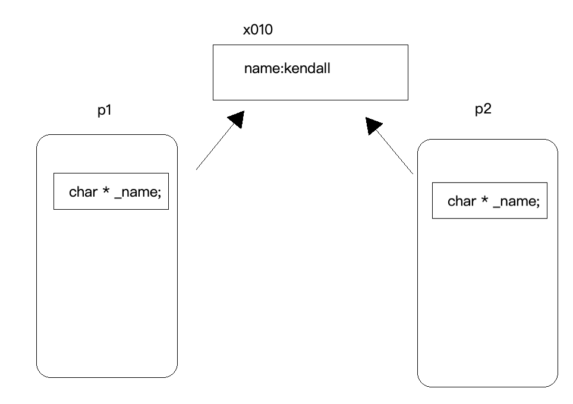
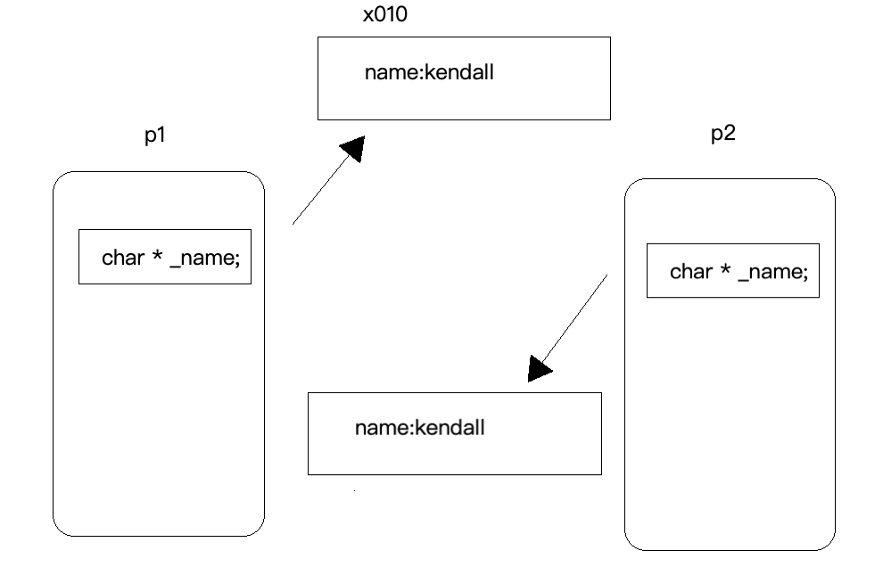
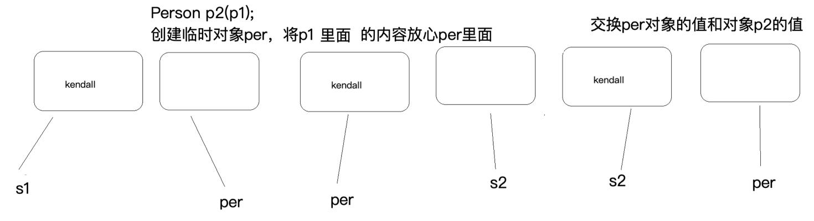

浅拷贝：又称值拷贝，将源对象的值拷贝到目标拷贝对象中去，本质上来说源对象和目标拷贝对象共用一份实体，只是所引用的变量名不同，地址其实还是相同的。举个简单的例子：你的小名叫kendall，大名叫Kge，当别人叫你西西或者沫沫的时候你都会答应，这两个名字虽然不相同，但是都指的是你。

先来看看下面这个程序
```js
#include <iostream>
#include <string>
using std::cout;
using std::endl;

class Person {
public:
    Person(const char * name = "")
    :_name(new char[strlen(name) + 1])
    {
        strcpy(_name,name);
    }
    //拷贝构造函数
    Person(const Person & p) {
        _name = p._name;
    }
    Person & operator = (const Person & p) {
        if(this != &p) {
            this->_name = p._name;
        }
        return *this;
    }
    //析构函数
    ~Person() {
        if(_name) {
            delete[] _name;
            _name = NULL;
        }
    }
    void show() {
        cout << "name = " << _name << endl;
    }

private:
    char * _name;
};

void test1() {
    Person p1("kendall");
    Person p2(p1);
    p2.show();
}

int main() {

    test1();

    return 0;
}
```
运行结果报错：
```
name = kendall
a.out(5620,0x10be7c5c0) malloc: *** error for object 0x7fd8d6400690: pointer being freed was not allocated
a.out(5620,0x10be7c5c0) malloc: *** set a breakpoint in malloc_error_break to debug
Abort trap: 6
```
其实这个程序是存在什么问题呢？我们想一下，创建p2的时候程序必然会去调用拷贝构造函数，这时候拷贝构造仅仅只是完成了值拷贝，导致两个指针指向了同一块内存区域。随着程序的运行结束，又去调用析构函数，先是s2去调用析构函数，释放了它所指向的内存区域，接着s1又去调析构函数，这时候析构函数企图释放一块已经被释放的内存区域，程序将会崩溃。s1和s2的关系是这样的。



所以程序会崩溃是应该的。那这个问题应该怎么去解决呢？这就引出了深拷贝。

深拷贝，拷贝时先开辟出和源对象大小一样的空间，然后将源对象里的内容拷贝到目标拷贝对象中去，这样两个指针就指向了不同的内存位置，并且里面的内容还是一样的，这样不但达到了我们想要的目的，还不会出现问题，两个指针先后去调用析构函数，分别释放自己所指向的位置。即为每次增加一个指针，便申请一块新的内存，并让这个指针指向新的内存，深拷贝情况下，不会出现重复释放同一块内存的错误。

深拷贝实际上是这样的：



下面为深拷贝的拷贝构造函数和赋值运算符的重载传统实现：
```js
class Person {
public:
    Person(const char * name = "")
    :_name(new char[strlen(name) + 1])
    {
        strcpy(_name,name);
    }
    //拷贝构造函数
    Person(const Person & p) {
        this->_name = new char[strlen(p._name) + 1];
        strcpy(this->_name,p._name);
    }
    //赋值运算符重载函数
    Person & operator = (const Person & p) {

        if(this != &p) {

            this->_name = new char[strlen(p._name) + 1];
            strcpy(this->_name,p._name);
        }
        return *this;
    }
    //析构函数
    ~Person() {
        if(_name) {
            delete[] _name;
            _name = NULL;
        }
    }
    void show() {
        cout << "name = " << _name << endl;
    }

private:
    char * _name;
};
void test1() {
    Person p1("kendall");
    Person p2(p1);
    p2.show();
}

int main() {

    test1();
    return 0;
}
```

这里的拷贝构造函数我们很容易理解，先开辟出和源对象一样大的内存区域，然后将需要拷贝的数据复制给目标拷贝对象。

那这里的赋值运算符的重载是怎样做的呢？

一开始p2构造出来后，我们把p1的内容放到p2里面去，这里就会存在一个问题，如果p2的内存比p1的大就会直接将p1拷贝给p2，但是如果p2的内存比p1的小那是不是不能直接拷贝了呢？在这里我们有一种解决方案：
- 第一步：先释放旧空间p2
- 第二步：先开辟一段与p1一样大的空间来
- 将p1赋值给p2

这种方法解决了我们的指针悬挂问题，通过不断的开空间让不同的指针指向不同的内存，以防止同一块内存被释放两次的问题 ，还有一种深拷贝的现代写法：

```js
    Person( Person & p)
    :_name(NULL) //首先初始化为NULL，否则释放空指针会出错
    {
        //调用构造函数，完成
        Person per(p._name);
        //调用per和目标拷贝对象所指向的内容
        auto tmp = this->_name;
        this->_name = per._name;
        per._name = tmp;
    }
    //赋值运算符重载
    Person& operator = ( Person & p) {
        if(this != &p) { //不让自己给自己赋值
            Person per(p._name);
            auto tmp = this->_name;
            this->_name = per._name;
            per._name = tmp;
        }
        return  *this;
    }

/////////////// 测试函数
void test1() {
    Person p1("kendall");
    Person p2(p1);

    Person p3;
    p3 = p1;  //调用赋值运算法重载函数
    p2.show();
    p3.show();
}
```

拷贝构造的实现分析：
- 先创建一个类对象per，此时程序调用函数开辟一段和p1一样大的空间。
- 将p1里面的内容(kendall)方式per指向的这段空间中
- 交换per和p2对象里的内容



赋值运算符的重载实现过程与上述拷贝构造完全相同。

先创建p3对象（调用构造函数），`p3=p1`;（调用拷贝构造，再调用赋值运算符的重载）。为什么又去调用了拷贝构造呢？为什么？？？很简单，因为在这个赋值运算符的重载的参数里创建了一个临时对象，为什么说它是一个临时对象，因为出了赋值运算符重载的作用域它就被析构掉了。这种方法的过程就是通过传参创建一个临时对象，通过调用拷贝构造来完成空间的开辟并且拷贝源对象里的数据。然后再交换目标对象和临时对象的值，赋值运算符重载函数被调用完之后，临时对象被析构。

总结一下：这种现代方式本质上来说就是我自己不想开空间，让临时对象去开空间并完成拷贝，最后只要让我指向临时对象所指向的内容，再让临时对象指向我原先的所在的区域。最后临时对象被析构掉。


参考：https://blog.csdn.net/qq_39344902/article/details/79798297