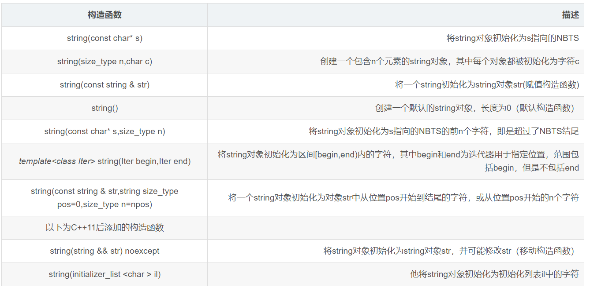

## 1.Srting容器基本概念

`C`风格字符串(以空字符结尾的字符数组)太过复杂难于掌握，不适合大程序的开发，所以`C++`标准库定义了一种`string`类，定义在头文件`<string>`。

### 1.1 `String`和`c`风格字符串对比：

- `Char*`是一个指针，`String`是一个类
- `string`封装了`char*`，管理这个字符串，是一个`char*`型的容器。
- `String`封装了很多实用的成员方法,比如查找`find`，拷贝`copy`，删除`delete` 替换`replace`，插入`insert`
- 不用考虑内存释放和越界 `string`管理`char*`所分配的内存。每一次`string`的复制，取值都由`string`类负责维护，不用担心复制越界和取值越界等。

### 1.2` string`和`c-style`字符串转换；

```cpp
//string 转 char*
string str = "kendall";
const char* cstr = str.c_str();
//char* 转 string 
char* s = "kendall";
string sstr(s);
```

 在`c++`中存在一个从`const char*`到`string`的隐式类型转换，却不存在从一个`string`对象到`C_string`的自动类型转换。对于`string`类型的字符串，可以通过c_str()函数返回string对象对应的`C_string`.

 ### 1.3 string 的构造函数



注：NBTS 是以空字符串结束的字符串，也就是传统的C字符串。

## 2.sting 示例

```cpp
void stringFunc()
{
	string one("this is kendall");
	cout << "one = " << one << endl;
	
	string two(20,'&');  //打印20个&
	cout << "two = " << two <<endl;

	// 将 one 复制给 three
	string three(one);
	cout << "three = " << three << endl;
	//thre 和 one 的地址是一样的
	cout << "one的地址： " << &one << endl;
	cout << "three的地址：" << &three << endl;

	//修改one
	one += " K Ge";
	cout << "修改one之后 one = " << one << endl;
	cout << "修改one之后 three = " << three << endl;
	//thre 和 one 的地址是不一样了（写时复制）
	cout << "one的地址： " << &one << endl;
	cout << "three的地址：" << &three << endl;

	string four = two + three;
	cout << "four = " << four << endl;

	char alls[] = "All's well that ends well";
	string five(alls,sizeof(alls));
	cout << "five = " << five << endl;

	string six(alls+6,alls+10);  //写去第6到第10位
	cout << "six = " << six << endl;  //six = well

	string seven(&five[6],&five[20]);
	cout << "seven = " << seven <<endl;

	string eight(five,7,16);
	cout << "eight = " << eight << endl;
}
```

运行结果：

```
one = this is kendall
two = &&&&&&&&&&&&&&&&&&&&
three = this is kendall
one的地址： 0x7fff5704e640
three的地址：0x7fff5704e680
修改one之后 one = this is kendall K Ge
修改one之后 three = this is kendall
one的地址： 0x7fff5704e640
three的地址：0x7fff5704e680
four = &&&&&&&&&&&&&&&&&&&&this is kendall
five = All's well that ends well
six = well
seven = well that ends
eight = ell that ends we
```
说明：`four = two + three;` `string`类中重载了`=`和`+`操作符。

## 3。使用字符串


`string`类可以使用第一个表格中的九种方式构造`string`对象、重载`<<`和`[]`符号来显示`string`对象、使用`getline(cin,a);`将数据读取和附加到`string`对象上、重载了`=`给`string`对象赋值、重载`+`将两个`string`对象连接起来。

下面重点介绍find()方法，用于查找字符串中给定的子字符串。

### 3.1 string 查找和替换

```cpp
int find(conststring& str, int pos = 0) const; //查找str第一次出现位置,从pos开始查找

int find(constchar* s, int pos = 0) const;  //查找s第一次出现位置,从pos开始查找

int find(constchar* s, int pos, int n) const;  //从pos位置查找s的前n个字符第一次位置

int find(constchar c, int pos = 0) const;  //查找字符c第一次出现位置

int rfind(conststring& str, int pos = npos) const;//查找str最后一次位置,从pos开始查找

int rfind(constchar* s, int pos = npos) const;//查找s最后一次出现位置,从pos开始查找

int rfind(constchar* s, int pos, int n) const;//从pos查找s的前n个字符最后一次位置

int rfind(constchar c, int pos = 0) const; //查找字符c最后一次出现位置

string& replace(int pos, int n, conststring& str); //替换从pos开始n个字符为字符串str

string& replace(int pos, int n, constchar* s); //替换从pos开始的n个字符为字符串s

```

其中`string`类还提供了好多的其他变形方法，`rfind()`方法查找字符串最后一次出现的位置；`find_first_of()`方法在字符串中任一字符首先出现的位置。`find_last_of()`方法是在字符串中查找子字符串中每一个字符最后出现的位置。

### 3.2 string比较操作

`compare`函数在`>`时返回` 1`，`<`时返回 `-1`，`==`时返回 `0`。比较区分大小写，比较时参考字典顺序，排越前面的越小。
大写的`A`比小写的`a`小。

```cpp
int compare(conststring&s) const;//与字符串s比较
int compare(constchar *s) const;//与字符串s比较
```

### 3.3  string 子串

```cpp
//返回由pos开始的n个字符组成的字符串
string substr(int pos = 0, int n = npos) const;
```

### 3.4 string 插入和删除操作

```cpp
string& insert(int pos, constchar* s); //插入字符串
string& insert(int pos, conststring& str); //插入字符串
string& insert(int pos, int n, char c);//在指定位置插入n个字符c
string& erase(int pos, int n = npos);//删除从Pos开始的n个字符 
```


