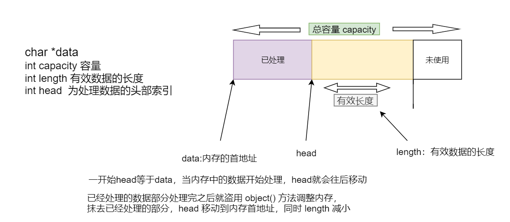

## 1.内存管理与 buffer 的封装

我们需要插入一个 `io_buf` 类，主要用来封装`buffer`的基本结构，然后用`buf_pool`来管理全部的`buffer`集合。

### 1.1 io_buf 内存块设计

`io_buf`的属性包括：

- 容量`capacity`
- 有效数据长度`length`
- 指向未处理的数据首地址（索引）head
- 当前内存块的首地址`data`
- `io_buf`指针 `next`,使用多个`io_buf`,采用链表的形式进行管理

`io_buf`类的方法：

- `pop(int len)`,len表示已经处理的数据长度
- `clear()` 清空当前内存，注意这里不是`free`掉物理内存，而是指针清空，`lenght = head = 0;`
- `adject()` 将`head`重置，将有效数据前置到`data`指针下
- `copy(io_buf *other)` 将`other`的有效数据拷贝到自身中（复制）



- io_buf.h

```cpp
#pragma once

// 设计一个 buffer内存块的数据结构

class io_buf 
{
public:
	//========== 成员方法

	//构造函数，传入一个buf的大小
	io_buf(int size);

	//处理数据
	void pop(int len);  

	//清空数据
	void clear();

	//调整数据，经已经处理的数据抹去，将未处理的数据移动至buf首地址
	void adjust();

	//将other的有效数据复制到拷贝到自身中
	void copy(const io_buf *other);
	
	//========== 成员变量

	//当前buf的首地址
	char * data;
	//当前buf的总容量
	int capacity;
	//未处理数据的索引位置
	int head;
	//未处理数据（有效数据的长度）
	int length;
	// 指向下一个io_buf的指针
	io_buf *next;
};
```

- io_buf.cpp

```cpp
#include <io_buf.h>
#include <iostream>
#include <stdio.h>
#include <string.h>

//构造函数，传入一个buf的大小
io_buf::io_buf(int size){
	//进行初始化
	data = new char[size];
	capacity = 0;
	head = 0;
	length = 0;
	next = NULL;
}

//处理数据
void io_buf::pop(int len){
	head += len;
	length -= len;
}

//清空数据
void io_buf::clear(){
	head = 0;
	length = 0;
}

//调整数据，经已经处理的数据抹去，将未处理的数据移动至buf首地址
void io_buf::adjust(){
	if(head != 0) {
		if(length != 0) {
			//  void *memmove(void *dest, const void *src, size_t n);
			//从src 移动到 dest ,注意第二个参数不是head,而是data+head,指向head索引位置的指针
			// 注意：src和dest所指内存区域可以重叠，但复制后dest内容会被更改。函数返回指向dest的指针。
			memmove(data,data+head,length);
		}
	}
}

//将other的有效数据复制到拷贝到自身中 具体见下图
void io_buf::copy(const io_buf *other){
	//void *mempcpy(void *dest, const void *src, size_t n);
	//函数的功能是拷贝src所指的内存内容前n个字节到dest所指的地址上。
	mempcpy(data,other->data+other->head,other->length);
	head = 0;
	length = other->length;
}
```


这里主要要注意`io_buf`的两个索引值`length`和`head`，一个是当前`buffe`r的有效内存长度，haed则为可用的有效长度首数据位置。 `capacity`是`io_buf`的总容量空间大小。

​	所以每次`pop()`则是弹出已经处理了多少，那么buffer剩下的内存就接下来需要处理的。

​	然而`adjust()`则是从新重置`io_buf`,将所有数据都重新变成未处理状态。

​	`clear()`则是将`length`和`head`清`0`，这里没有提供`delete`真是删除物理内存的方法，因为这里的buffer设计是不需要清理的，接下来是用一个`buf_pool`来管理全部未被使用的`io_buf`集合。而且`buf_pool`的管理的内存是程序开始预开辟的，不会做清理工作.

### 1.2 buf_pool 内存池设计与实现

使用`k-v`格式来存储内存池中的内存块。其中：、
- `key`: 刻度值
- `value`：当前刻度下所挂载的`io_buf`链表


**`buf_pool`中的属性**：

- 内存池的数据句柄`map`
	- `key`:内存块刻度
	- `value`:当前刻度下所挂载的`io_buf`链表

- 内存池的总大小`total_num`

**`buf_pool`中的方法**：

- 构造函数 `buf_pool()`,初始化全部内存，将全部刻度的内存一次性`new`出来.

- 开辟`io_buf`,这不是一个`new`操作，而是从`map`中选取一个合适的`io_buf`返回。
  
- 将一个已经使用完的`io_buf`重置放回`buf_pool`中。

为了保证在内存池类创建的对象全局唯一，因此需要使用单例模式。

单例模式涉及到一个单一的类，该类负责创建自己的对象，同时确保只有单个对象被创建。这个类提供了一种访问其唯一的对象的方式，可以直接访问，不需要实例化该类的对象。

>简单步骤：
>
>将构造函数和析构函数私有化，然后在类内部自己实现方法来创建对象。

- buf_pool.h

#### `pthread_once()`函数详解

> 补充：`pthread_once()`函数详解			
> 在多线程环境中，有些事执行一次，通常当初始化应用程序时，可以比较容易地将其放在`main`函数中,但是当写一个库时，就不能再`main`里面初始化了，可以用静态初始化，但使用一次初始化（`pthread_once`）会比较容易些。
> 
> `int pthread_once(pthread_once_t *once_control, void (*init_routine) (void))；`
> 
> 功能：本函数使用初值为`PTHREAD_ONCE_INIT`的`once_control`变量保证`init_routine()`函数在本进程执行序列中仅执行一次。
> 
> 在多线程编程环境下，尽管`pthread_once()`调用会出现在多个线程中，`init_routine()`函数仅执行一次，究竟在哪个线程中执行是不定的，是由内核调度来决定。
> 
> `Linux Threads`使用互斥锁和条件变量保证由`pthread_once()`指定的函数执行且仅执行一次，而`once_control`表示是否执行过。
>
> 如果`once_control`的初值不是`PTHREAD_ONCE_INIT`（`Linux Threads`定义为`0`），`pthread_once()` 的行为就会不正常。
>
> 在`LinuxThreads`中，实际"一次性函数"的执行状态有三种：`NEVER（0）`、`IN_PROGRESS (1)`、`DONE (2)`，如果`once`初值设为`1`，则由于所有`pthread_once()`都必须等待其中一个激发"已执行一次"信号，因此所有`pthread_once ()`都会陷入永久的等待中；如果设为`2`，则表示该函数已执行过一次，从而所有`pthread_once()`都会立即返回`0`。


```cpp
#pragma once

#include <ext/hash_map>
#include <io_buf.h>
#include <pthread.h>

//自定义map类型
typedef __gnu_cxx::hash_map<int,io_buf> pool_t;

class buf_pool 
{
public:
	//初始化单例对象，（创建一个唯一对象）
	static void init() {
		_instance = new buf_pool();		
	}
	//提供一个静态方法获取_instance（buf_pool对象）方法
	static buf_pool * instance() {
		
		//调用init，保证init方法在进程的生命周期中只执行一次
		//int pthread_once(pthread_once_t *once_control, void (*init_routine) (void))；
		pthread_once(_once,init);
		return _instance;
	}

	//====== 主要方法 ====== 

	//1 从内存池中申请一个内存块 N 为需要申请的内存大小
	io_buf *alloc_buf(int N);
	io_buf *alloc_buf();  //不指定大小就为默认的4kb

	//2 重置一个io_buf内存块，放回buf_pool中
	void revert(io_buf * buffer);

	//这里封装一个内存刻度定制的方法，方便申请开辟内存块，cap:刻度值，num:数目
	void make_io_buf_list(in cap,int num);
	 
private:
	// ===== 创建单例模式 ===========

	//构造函数
	buf_pool();
	buf_pool(const buf_pool&);

	//析构函数
	~buf_pool();

	//创建单例对象，保证创建的对象唯一
	static buf_pool *_instance;

	// ======= buf_pool 的属性 ===========
	//存放io_buf的map句柄
	pool_t _pool;

	//为了保证单例模式自动释放并保证线程安全
	//使用pthread_t_once 保证单例的一个方法只能执行一次
	static pthread_once_t *_once;

	// 当前内存的总大小，单位是kb
	u_int64_t _total_mem;
}
```