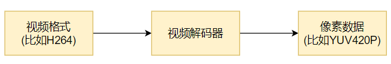
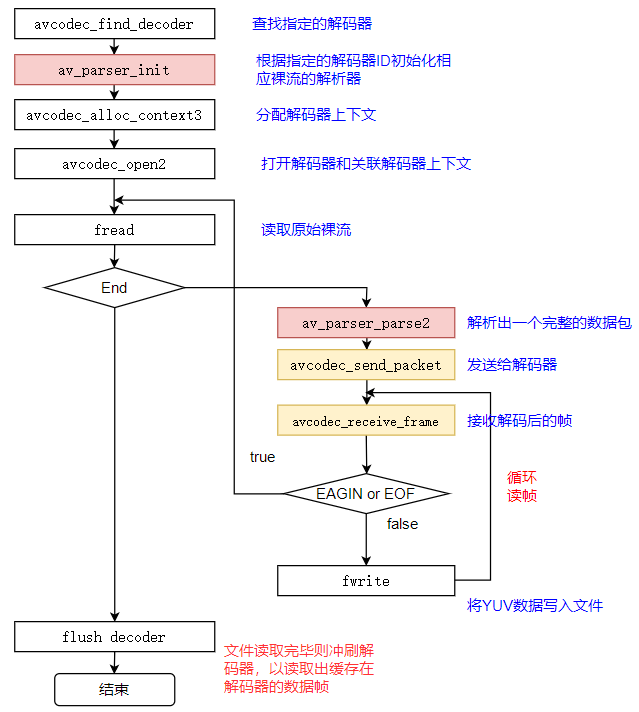
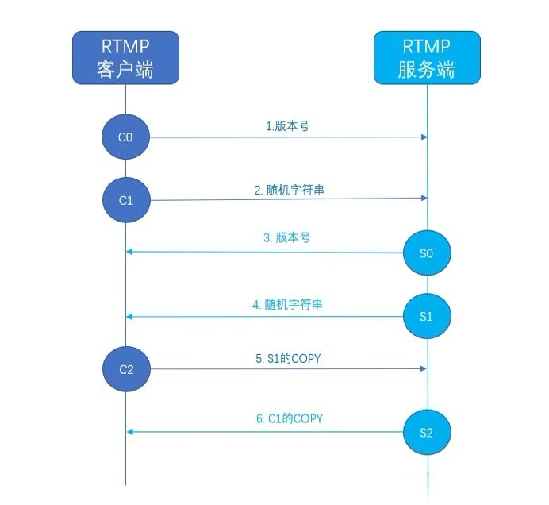

## 1.项目介绍
本项目是我们学校大数据学院、机电学院和植保学院一起合作的课题项目，将摄像头安置在机器人身上让机器人在农田你行走，从而实现对农田环境的实时监控。我主要负责的是流媒传输和视频解码部分。因为前期只能是本地模拟，所以我就将移动设备来模拟摄像头，`PC`端作为接受设备。为了方面实验分析所以使用`Android` 调试桥 `adb` 来实现移动设备与`PC`之间的通信交互。这个项目实现的大致流程是：移动设备实时采集视频流，然后编码为`H264`,通过安卓端的`Client`套接字，借助于`adb reverse`搭建的反向代理传送到`PC server`端，然后`PC server`收到视频流之后通过解码器模块，把`H264`视频解码为`YUV`,然后再将`YUV`传给渲染器模块，渲染器负责将`YUV`显示到屏幕,这就是整个视频实时同步的流程。	


在视频解码方面使用的是`ffmpeg`,整个项目使用的是`C++`编写，流媒体数据实时传输采用的是`RTMP`协议

启动流程：
1. 将`scrcpy-server`推送到手机（这里可以借用`adb push`命令来实现）
2. 启动反向代理（`adb reverse`），
3. `pc`端启动一个`socket server`来监听反向代理的端口
4. 启动安卓端`scrcpy-server`（	`adb shell app_process`），之后会建立一个`socket client`去连接`adb reverse`建立的端口，
5. `PC`接收`scrcpy-server`的连接，并与安卓端进行`socket`通信

**遇到的技术难点**：

收到移动端的视频要立即解码显示，避免任何不必要的缓冲，这就需要自己来编写视频的解码和显示，已有的轮子无法满足我们的需求（`VLC`等）。

此外，因为考虑到农田环境大部分都是在偏远野外，很大可能会出现网络不稳定的情况，为此我在动态网络中流媒体数据实时传输方面做了一定的研究，并在研一上半年完成发表了一篇北大核心论文，题目是《面向农业监视的流媒体传输机制研究》。


然后在项目中实现了低延迟传输，我们测试了`720P`的视频流传输平均时延在`300ms`以。为了保证流媒体数据传输的实时性，我们决定采用`RTMP`协议。所以目前我在课题组中的主要工作是针对`RTMP`协议的研究。

在完成这个项目过程中，掌握音视频相关知识，比如`ffmpeg`的数据结构，`ffmpeg`的内存模型，还有音视频的解码流程。提高了`C++`的编程能力，同时锻炼独立解决问题的能力。

## 2.abd 相关

### 2.1 什么是 `ADB`

`ADB`的全称为Android Debug Bridge，就是**安卓调试桥接**，简单点说，它是`Android`系统 	提供的一套工具，通过它，我们可以在电脑上建立一个连接到手机的通道，然后可以在电脑上向手机发送一些指令，完成一些我们需要做的工作。

### 2.2 `adb` 的工作方式

启动一个 `adb` 客户端时，这个客户端首先检查是否有已运行的服务器进程。如果没有，它将启动服务器进程。当服务器启动时，它与本地 `TCP` 端口 `5037` 绑定，并侦听从 `adb` 客户端发送的命令——所有 `adb` 客户端均使用端口 `5037` 与 `adb` 服务器通信。

### 2.3 什么是反向代理

- **正向代理**：客户端想要访问一个服务器，但是它可能无法直接访问这台服务器，这时候这可找一台可以访问目标服务器的另外一台服务器，而这台服务器就被当做是代理人的角色 ，称之为代理服务器，于是客户端把请求发给代理服务器，由代理服务器获得目标服务器的数据并返回给客户端。客户端是清楚目标服务器的地址的，而目标服务器是不清楚来自客户端，它只知道来自哪个代理服务器，所以正向代理可以屏蔽或隐藏客户端的信息。

- **反向代理**：从上面的正向代理，你会大概知道代理服务器是为客户端作代理人，它是站在客户端这边的。其实反向代理就是代理服务器为服务器作代理人，站在服务器这边，它就是对外屏蔽了服务器的信息，常用的场景就是多台服务器分布式部署，像一些大的网站，由于访问人数很多，就需要多台服务器来解决人数多的问题，这时这些服务器就由一个反向代理服务器来代理，客户端发来请求，先由反向代理服务器，然后按一定的规则分发到明确的服务器，而客户端不知道是哪台服务器。

## 3.Qt相关

> https://blog.csdn.net/lizun7852/article/details/88738192?spm=1001.2014.3001.5501

### 3.1 QT 信号槽机制的优缺点 
- 1）QT信号槽机制的引用精简了程序员的代码量 (不用写回调函数)
- 2）QT的信号可以对应多个槽（但他们的调用顺序随机），也可以多个槽映射一个信号 
- 3）QT的信号槽的建立和解除绑定十分自由 
- 4）信号槽同真正的回调函数比起来时间的耗损还是很大的，所有在嵌入式实时系统中应当慎用 
- 5）信号槽的参数限定很多例如不能携带模板类参数，不能出现宏定义等等

### 3.2 多线程情况下, Qt 中的信号槽分别在什么线程中执行, 如何控制? 

可以通过connect函数的第五个参数来控制, 信号槽执行时所在的线程 

- 1)自动连接(AutoConnection)，默认的连接方式，如果信号与槽，也就是发送者与接受者在同一线程，等同于直接连接；如果发送者与接受者处在不同线程，等同于队列连接。
- 2)直接连接(DirectConnection)，当信号发射时，槽函数立即直接调用。无论槽函数所属对象在哪个线程，槽函数总在发送者所在线程执行，即槽函数和信号发送者在同一线程
- 3)队列连接(QueuedConnection)，当控制权回到接受者所在线程的事件循环时，槽函数被调用。槽函数在接受者所在线程执行，即槽函数与信号接受者在同一线程


## 4音视频相关

### 4.1视频播放的流程

视频播放的流程需要经过几个步骤：解协议，解封装，解码音视频，音视频同步。如果播放的是本地文件就不需要解协议。他们的过程如下图所示：


- 解协议：就是将流媒体协议的数据，解析为标准的相应的**封装格式数据**，音视频在网络上传播的时候，常常采用各种流媒体协议，比如：HTTP，RTMP，或者MMS等。这些协议在传输音视频数据的同时，也会传输一些信令数据，这些信令数据包括对播放的控制（播放，暂停，停止），或者对网络状态的描述等等，解协议的过程中会出去信令数据而只是保留音视频数据，例如采用`RTMP`协议传输的数据，经过解协议操作后，输出`FLV`格式的数据。

- 解封装：就是将输入的封装格式的数据，分离成为音频流压缩编码数据和视频流压缩编码数据。封装格式的种类很多，例如` MP4，TS，AVI`等等，它的作用是将已经压缩编码的视频数据和音频数据按照一定的格式放到一起。例如：`FLV`格式的数据经过解封装后，输出`H264`编码的视频码流和`AAC`编码的音频码流。

- 解码：就是将视频/音频压缩编码数据，解码称为非压缩的视频/音频原始数据。音频的压缩编码标准包含`AAC,MP3,AC-3`等等，视频的压缩编码标准包含`H264,MPEG2,VC-1`等等。解码是整个系统中最重要也是最复杂的一个环节。通过解码，压缩编码的视频数据输出成为非压缩的颜色数据，例如`YUV420P,RGB`等等；压缩编码的音频数据输出成为非压缩的音频抽样数据，例如`PCM`数据。

- 音视频同步：就是根据解封装模块处理过程中获取的参数信息，同步解码出来的音频和视频数据，并将音视频数据送至系统的显卡和声卡播放出来。

> 考虑流媒体数据的实时性，项目中主要对`RTMP`协议进行研究。

### ffmpeg数据结构

[ffmpeg数据结构](音视频开发/ffmpeg/01ffmpeg数据结构)

### FFmpeg 内存模型

[ffmpeg内存模型](音视频开发/ffmpeg/02ffmpeg内存模型.md)

### FFmpeg 解封装过程

[ffmpeg解封装(解复用)](ffmpeg/03ffmpeg解封装(解复用).md.md)

### 音频解码

[ffmpeg音频解码](/音视频开发/ffmpeg/05ffmpeg音频解码.md)

### 视频解码

视频解码过程如下图所示：

⼀般解出来的是420p

 

**FFmpeg流程**

 

**关键函数说明**：

- avcodec_find_decoder：根据指定的AVCodecID查找注册的解码器。
- av_parser_init：初始化AVCodecParserContext。
- avcodec_alloc_context3：为AVCodecContext分配内存。
- avcodec_open2：打开解码器。
- av_parser_parse2：解析获得⼀个Packet。
- avcodec_send_packet：将AVPacket压缩数据给解码器。
- avcodec_receive_frame：获取到解码后的AVFrame数据。
- av_get_bytes_per_sample: 获取每个sample中的字节数。

**关键数据结构说明**：

`AVCodecParser`：⽤于解析输⼊的数据流并把它分成⼀帧⼀帧的压缩编码数据。⽐较形象的说法就是把⻓⻓的⼀段连续的数据“切割”成⼀段段的数据。

⽐如`H264 aac_parse`
```cpp
 AVCodecParser ff_h264_parser = {
 	.codec_ids = { AV_CODEC_ID_H264 },
 	.priv_data_size = sizeof(H264ParseContext),
 	.parser_init = init,
 	.parser_parse = h264_parse,
 	.parser_close = h264_close,
 	.split = h264_split,
 };
 ```
从`AVCodecParser`结构的实例化我们可以看出来，不同编码类型的`parser`是和`CODE_ID`进⾏绑定的。所以也就可以解释

```cpp
parser = av_parser_init(AV_CODEC_ID_H264);
```
可以通过`CODE_ID`查找到对应的码流 `parser`

### H264 格式

### YUV 格式

https://blog.csdn.net/iva_brother/article/details/84036877

### AAC 格式

[AAC_ADTS格式分析](/音视频开发/ffmpeg/04AAC_ADTS格式分析.md)


### 介绍一下`RTMP`协议

`RTMP`是应用层协议，底层依靠的是`TCP`协议。因为多媒体传输是一个持续的过程，所以一般需要更为可靠的握手来保证连接的可靠性。`RTMP`协议在`TCP`三次握手的基础上，自己定义了**六次握手**，如下图：



`RTMP`协议中规定了握手过程就是图上这样的：

- 客户端发送版本号`C0`和生成的随机字符串`C1`

- 服务端收到`C0`后，如果支持客户端的版本，则发送自己支持的版本号`S0`，否则不发送

- 服务端收到`C1`后则发送自己生成的随机字符串`S1`

- 客户端收到`S1`后，则发送`S1`的拷贝`C2`

- 服务端收到`C1`后，则发送`C1`的拷贝`S2`

- 客户端收到`S2`后，进行校验，通过后才发送控制信息和真实音视频等数据

- 服务端收到`C2`后，进行校验，通过后才发送控制信息和真实音视频等数据

[RTMP抓包分析过程](https://zhuanlan.zhihu.com/p/157429042)


[RTMP规范简单分析](https://blog.csdn.net/leixiaohua1020/article/details/11694129)

[RTMP流媒体播放过程](https://blog.csdn.net/leixiaohua1020/article/details/11704355)


