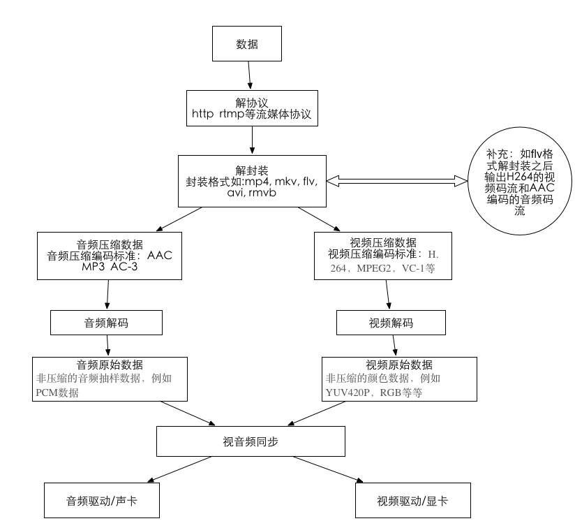

## 项目介绍

## 视频播放的流程

视频播放的流程需要经过几个步骤：解协议，解封装，解码音视频，音视频同步。如果播放的是本地文件就不需要解协议。他们的过程如下图所示：

- **解协议**：<u>就是将流媒体协议的数据，解析为标准的相应的**封装格式数据**，</u>音视频在网络上传播的时候，常常采用各种流媒体协议，比如：HTTP，RTMP，或者MMS等。这些协议在传输音视频数据的同时，也会传输一些信令数据，这些信令数据包括对播放的控制（播放，暂停，停止），或者对网络状态的描述等等，解协议的过程中会除去信令数据而只是保留音视频数据，<u>例如采用`RTMP`协议传输的数据，经过解协议操作后，输出`FLV`格式的数据。</u>

- **解封装**：<u>就是将输入的封装格式的数据，分离成为音频流压缩编码数据和视频流压缩编码数据。封装格式的种类很多，例如` MP4，TS，AVI`等等，它的作用是将已经压缩编码的视频数据和音频数据按照一定的格式放到一起。例如：`FLV`格式的数据经过解封装后，输出`H264`编码的视频码流和`AAC`编码的音频码流。</u>

- **解码**：<u>就是将视频/音频压缩编码数据，解码称为非压缩的视频/音频原始数据。</u>音频的压缩编码标准包含`AAC,MP3,AC-3`等等，视频的压缩编码标准包含`H264,MPEG2,VC-1`等等。解码是整个系统中最重要也是最复杂的一个环节。<u>通过解码，压缩编码的视频数据输出成为非压缩的颜色数据，例如`YUV420P,RGB`等等；压缩编码的音频数据输出成为非压缩的音频抽样数据，例如`PCM`数据。</u>

- **音视频同步**：<u>就是根据解封装模块处理过程中获取的参数信息，同步解码出来的音频和视频数据，并将音视频数据送至系统的显卡和声卡播放出来。</u>

## FFmpeg数据结构

FFmpeg的数据结构有很多，大致分成四种：
- (1)解协议：`AVIOContext`，`URLProtocol`，`URLContext`主要存储视音频使用的协议的类型以及状态。

- (2)解封装：`AVFormatContext`主要存储视音频封装格式中包含的信息

- (3)解码：`AVStream`，`AVCodecContext`，`AVCodec`。`AVStream`就是存储音视频流，然后`AVCodecContext`就根据哪种音视频流找到对应的解码器`AVCodec`。

- (4)存数据：`AVPacket`存储解码前数据，`AVFrame`存储解码后数据

### 迟延怎么处理

延时会产生在：

- 音视频数据的前处理；

- 音视频数据的编解码；

- 音视频数据的网络传输；

- 为了防止抖动业务代码中的缓冲区，包括推流服务、转码服务、播放器的缓存等；

- 音视频的渲染播放；

当然上面会产生延时的地方对于最终的延时影响权重是不一样的，其中数据的前处理、编解码、渲染对于延时影响比较小，而网络传输和业务代码的缓存对于延时影响非常大。所以优化也要结合你的需求有重点进行。

> 关键词：音视频数据处理前，编解码，网络传输，防抖缓冲，渲染            
> 网络传输对迟延的影响很大

- 优化思路1：调整推流端和播放端的缓冲区大小，对于 25fps 的视频流，如果我们缓存 25 帧的数据，就会在播放时产生 1s 的延时。所以我们要动态调整我们的缓冲区，对于推流上行区我们如果带宽不够就会产生网络阻塞，这时发送端的数据就会积累，最终延时不断累加，导致延时变大。我们此时就需要有一套机制来**能够预测带宽**，降低发送码率，减低当前发送数据量，减少网络阻塞，等网络好的时候再继续增大数据发送量，增大码率。

> 动态推流调整缓冲区 --> 带宽不够 --> 网络堵塞 --> 迟延变大 --> 预测带宽 --> 降低发送量，降低码率

> 论文定义一种基于视频切片的QoE「体验质量」效用模型,综合考虑切片质量、切片码率切换以及中断之间的相互影响,描述在切片播放过程中的视频质量波动。在定义的QoE效用模型.的基础上,论文提出一种基于QoE的自适应码率切换方法,将视频质量作为优化目标,利用马尔科夫网络模型和视频切片大小信息准确预测未来切片传输过程,获得使长时用户体验最优的码率决策。

对于播放端的缓存，当网络不好产生的延时比较大时，我们需要通过丢帧和加速播放方式快速消耗掉播放缓冲区的数据，从而消除累计的延时。

- 优化思路2：优化网络传输，如果实时性要求很高的场景，你如果选用基于TCP承载的网络传输协议，无论你怎么优化，也很难降低延时。因为TCP会进行三次握手，而且它会对每一次发送的数据进行确认，还要对丢包进行重传，所以这些限制很不适合降低延时。我们要优化传输协议，我们可以将基于TCP的RTMP、HLS协议切换到基于UDP的RTP、QUIC协议上，或者自己开发基于UDP的私有协议栈，这样我们就可以对一些TCP延时大的功能进行裁剪和修改，对于一些不关重要的数据进行丢弃，优先保障重要数据的传输。其中国内B站、虎牙直播，在线k12教育等都进行了类似的处理；

> 将 TCP 的 RTMP 协议 切换到 基于 UDP 的 RTP 协议

前段时间我们课题做了个项目就是采用了自动切换网络传输协议的措施来降低延时，摄像头的视频一般要推送到云服务器上，然后才能进行大规模的转发和分发。这是因为摄像头毕竟是嵌入式设备，并发量非常有限，能同时推送的视频路数也就一两路，如何想无限制进行分发和允许多客户端同时观看，就需要先让摄像头的视频上传到云服务端上，再进行大规模的分发和转发，这也是视频监控的基本玩法。但是我们摄像头以前只支持TCP长链接方式向服务器推流，这样当网络不好就会丢包重传，延时也逐渐积累增大。甚至网络非常不好时，延时会达到几十秒，用户体验很不好。

措施：

我们流媒体服务端会收集播放器的延时数据和丢包，然后当达到一定条件，我们通过信令服务器进行传输协议切换，重新让摄像头推流。将TCP推流改成UDP推流，我们在流媒体服务器端重新实现组包和增加丢帧策略，降低播放端延时，效果最后也得到了客户的满意。

> 自动切换网络传输协议，推送到云服务器才转发和分发，推送路数少，无限制分发，视频-->云服务-->分发和转发 --> TCP 长连接 --> 丢包重传

> 收集延时数据和对包 --> 信令服务器切换传输协议 --> TCP 改成 UDP --> 实现组包和对包策略

> https://blog.csdn.net/Anne033/article/details/108094889

### RTMP协议

RTMP协议是应用层协议，是要靠底层可靠的传输层协议（通常是TCP）来保证信息传输的可靠性的。在基于传输层协议的链接建立完成后，RTMP协议也要客户端和服务器通过“握手”来建立基于传输层链接之上的RTMP Connection链接

要建立一个有效的RTMP Connection链接，首先要“握手”:客户端要向服务器发送C0,C1,C2（按序）三个chunk，服务器向客户端发送S0,S1,S2（按序）三个chunk，然后才能进行有效的信息传输。RTMP协议本身并没有规定这6个Message的具体传输顺序，但RTMP协议的实现者需要保证这几点：

客户端要等收到S1之后才能发送C2
客户端要等收到S2之后才能发送其他信息（控制信息和真实音视频等数据）
服务端要等到收到C0之后发送S1
服务端必须等到收到C1之后才能发送S2
服务端必须等到收到C2之后才能发送其他信息（控制信息和真实音视频等数据）
如果每次发送一个握手chunk的话握手顺序会是这样：

### RTMP协议和RTSP协议的区别

一、RTMP协议：

1、是流媒体协议

2、RTMP是Adobe的私有协议，没有完全公开

3、RTMP协议一般传输的是flv、f4v格式流

4、RTMP协议一般在TCP的一个通道传输命令和数据

二、RTSP协议：

1、是流媒体协议

2、RTSP协议是公有协议，有专门的机构维护

3、RTSP协议一般传输的是ts、mp4格式流

4、RTSP协议一般需要2-3个通道，命令和数据通道分离

### RTP 协议

RTP（Real-timeTransportProtocol）是用于Internet上针对多媒体数据流的一种传输协议。RTP被定义为在一对一或一对多的传输情况下工作，其目的是提供时间信息和实现流同步。RTP通常使用UDP来传送数据，但RTP也可以在TCP或ATM等其他协议之上工作。当应用程序开始一个RTP会话时将使用两个端口：一个给RTP，一个给RTCP。RTP本身并不能为按顺序传送数据包提供可靠的传送机制，也不提供流量控制或拥塞控制，它依靠RTCP提供这些服务。通常RTP算法并不作为一个独立的网络层来实现，而是作为应用程序代码的一部分。实时传输控制协议RTCP。RTCP(Real-timeTransportControlProtocol)和RTP一起提供流量控制和拥塞控制服务。在RTP会话期间，各参与者周期性地传送RTCP包。RTCP包中含有已发送的数据包的数量、丢失的数据包的数量等统计资料，因此，服务器可以利用这些信息动态地改变传输速率，甚至改变有效载荷类型。RTP和RTCP配合使用，它们能以有效的反馈和最小的开销使传输效率最佳化，因而特别适合传送网上的实时数据。

https://www.cnblogs.com/yulang314/p/3725581.html

http://www.360doc.com/content/18/0729/15/32446372_774191283.shtml

