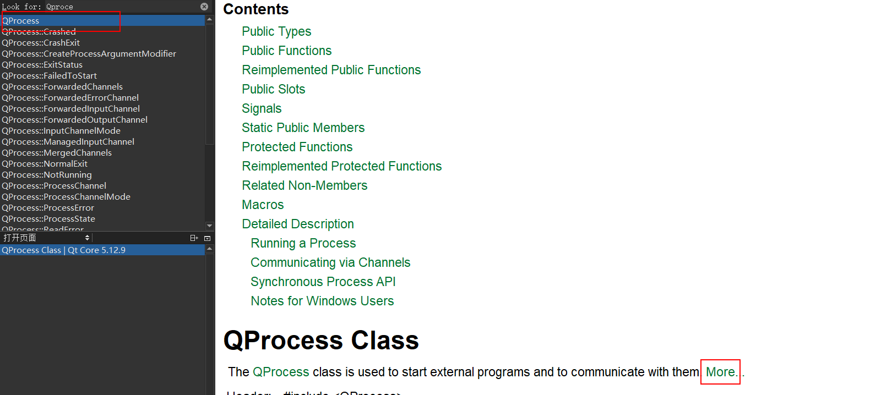
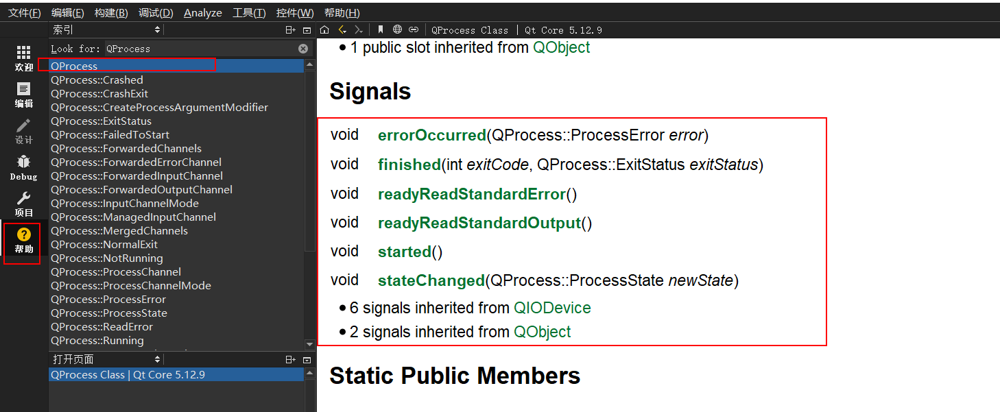
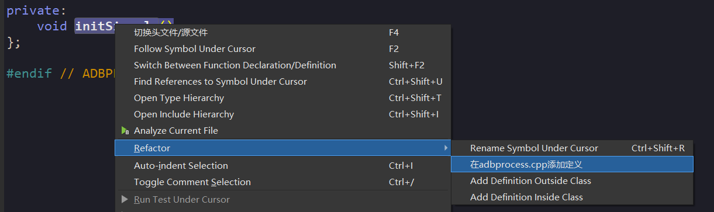
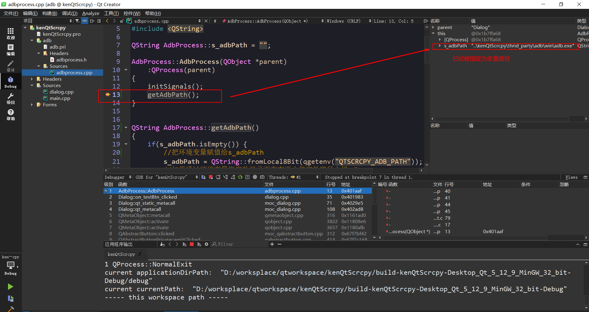

## 1.Android 调试桥

`Android` 调试桥 (`adb`) 是一个通用命令行工具，其允许您与模拟器实例或连接的 `Android` 设备进行通信。它可为各种设备操作提供便利，如安装和调试应用，并提供对 `Unix shell`（可用来在模拟器或连接的设备上运行各种命令）的访问。该工具作为一个客户端-服务器程序，包括三个组件：

- `adb`客户端，该组件发送命令。`adb`客户端在开发计算机上运行。我们可以通过从命令行运行`adb`客户端来发送命令。
- `adb`服务器，该组件管理客户端和后台程序之间的通信。`adb`服务器在开发计算机上作为后台进程运行。
- `adbd`服务器，该组件在设备上运行命令。`adbd`服务器在每个模拟器或设备实例上作为后台进程运行。

更详细的介绍请查看：

>https://developer.android.com/studio/command-line/adb

>https://github.com/mzlogin/awesome-adb

## ADB 安装

以下是 `ADB` 和 `Fastboot` 的谷歌官方下载链接：

`ADB`和`Fastboot for Windows`

> https://dl.google.com/android/repository/platform-tools-latest-windows.zip

`ADB`和`Fastboot for Mac`

> https://dl.google.com/android/repository/platform-tools-latest-darwin.zip


下载 `adb` 后解压即可使用

## 2.ADB 工作原理

启动一个 `adb` 客户端时，此客户端首先检查是否有已运行的 `adb` 服务器进程。如果没有，它将启动服务器进程。当服务器启动时，它与本地 `TCP` 端口 `5037` 绑定，并侦听从 `adb` 客户端发送的命令—所有 `adb `客户端均使用端口 `5037` 与 `adb` 服务器通信。


## 3.启用 adb 调试

> 在安卓手机上-> 设置 --> 关于手机 --> 版本号（点击7次启动开发者模式） --> 系统更新 --> 开发者选项 --> 启动仅充电情况下允许 `ADB` 调试。

- 启动 `ADB` 服务

```
 ./adb start-server
```

- 查看已经连接设备

```
/platform-tools_r31.0.0-windows/platform-tools$ ./adb devices
```
- 关闭 `ADB` 服务
  
```
$ ./adb kill-server
```

- 查看`5037`端口有没有被占用

```
netstat -ano | findstr 5037
taskkill /pid 5037 /f
```

- 上传文件到手机上
```
adb push 'C:\Users\ThinkPad\Desktop\aaa.txt' /sdcard/aaa.txt
```

- 使用 shell 命令

```bash
 adb shell ls

 adb shell
 ls
```

- 使用 USB 电缆将设备连接到主计算机。

- 设置目标设备以侦听端口 5555 上的 TCP/IP 连接。

  `$ adb tcpip 5555`

- 从目标设备断开 USB 电缆连接。

- 查找 Android 设备的 IP 地址。例如，在 Nexus 设备上，您可以通过访问 Settings > About tablet（或 About phone) > Status > IP address 查找 IP 地址。或者，在 Android Wear 设备上，您可以通过访问 Settings > Wi-Fi Settings > Advanced > IP address 查找 IP 地址。

- 连接至设备，通过 IP 地址识别此设备。

  `$ adb connect device_ip_address`

```
adb connect 192.168.0.103:5555
already connected to 192.168.0.103:5555

adb devices
List of devices attached
192.168.0.103:5555      device

adb -s 192.168.0.103:5555 push 'C:\Users\ThinkPad\Desktop\aaa.txt' /sdcarda/aaa.txt
```

- 断开连接

```
adb disconnect 192.168.0.103:5555
```

## 3.Qt 开发

新建项目 --> 选择 Qt Widgets Application --> base clas 选择 QDialog --> 

### 3.1 QProcess 简单用法

adb属于web进程，所以需要使用Qt提供的`QProcess`,可以在Qt的帮助中查看。



点击more之后直接复制
```cpp
QObject *parent;
...
QString program = "./path/to/Qt/examples/widgets/analogclock";
QStringList arguments;
arguments << "-style" << "fusion";

QProcess *myProcess = new QProcess(parent);
myProcess->start(program, arguments); //启动一个进程，传递进程名称和进程参数
```

在界面上添加一个按钮

--> 点击 dialog.ui 拖 push Button到界面，然后右下角设置 Object name 和 text

调价响应事件，将上面的demo复制到响应事件中去


```cpp
#include <QProcess>
#include "dialog.h"
#include "ui_dialog.h"

Dialog::Dialog(QWidget *parent)
    : QDialog(parent)
    , ui(new Ui::Dialog)
{
    ui->setupUi(this);
}

Dialog::~Dialog()
{
    delete ui;
}

//响应事件部分
void Dialog::on_testBtn_clicked()
{
//    QObject *parent;
    //需要打开的软件，这里暂时用记事本
    QString program = "notepad";
    QStringList arguments;
    arguments << "C:\\Users\\ThinkPad\\Desktop\\aaa.txt";  //需要打开的文件

    QProcess *myProcess = new QProcess(this);
//    myProcess->start(program, arguments); //启动一个进程，传递进程名称和进程参数
//    myProcess->start(program,Q_NULLPTR); //先不传递参数测试
    myProcess->start(program, arguments);
}

```

### 3.2 编写自己的 `AdbProcess.h`

新建一个 adb 文件夹， 在文件加下建立一个`adb.pri`文件,在项目的pro文件中添加子模块，和头文件目录

```
# 子模块
include($$PWD/adb/adb.pri)

# 包含目录
INCLUDEPATH += \
        $$PWD/adb 
```

保存之后qt项目会自动出现一个adb模块，

接下来在 adb  下进行开发

新建一个类，AdbProcess, 用这个类来封装 Process ,所以需要继承 Process


adbprocess.h
```cpp
#ifndef ADBPROCESS_H
#define ADBPROCESS_H
#include <QProcess>


class AdbProcess: public QProcess
{
public:
    //    explicit QProcess(QObject *parent = nullptr);
    AdbProcess(QObject *parent = nullptr);
};

#endif // ADBPROCESS_H
```

adbprocess.cpp

```cpp
#include "adbprocess.h"

AdbProcess::AdbProcess(QObject *parent)
    :QProcess(parent)
{

}

```

进程测试：

```cpp
//#include <QProcess>
#include "adbprocess.h"

#include "dialog.h"
#include "ui_dialog.h"

Dialog::Dialog(QWidget *parent)
    : QDialog(parent)
    , ui(new Ui::Dialog)
{
    ui->setupUi(this);
}

Dialog::~Dialog()
{
    delete ui;
}

//响应事件部分
void Dialog::on_testBtn_clicked()
{
//    QObject *parent;
    //需要打开的软件，这里暂时用记事本
    QString program = "notepad";
    QStringList arguments;
    arguments << "C:\\Users\\ThinkPad\\Desktop\\aaa.txt";  //需要打开的文件

    AdbProcess *myProcess = new AdbProcess(this);
    myProcess->start(program, arguments);
}
```

发现能打开记事本，说明封装的类没问题。


### 3.3 封装 adb 操作，

将 adb 文件放在工程目录下，


测试`adb.exe`

```cpp
//#include <QProcess>
#include "adbprocess.h"

#include "dialog.h"
#include "ui_dialog.h"

Dialog::Dialog(QWidget *parent)
    : QDialog(parent)
    , ui(new Ui::Dialog)
{
    ui->setupUi(this);
}

Dialog::~Dialog()
{
    delete ui;
}

//响应事件部分
void Dialog::on_testBtn_clicked()
{
//    thrid_party\adb\win
    QString program = "..\\thrid_party\adb\win\adb.exe";
    QStringList arguments;
    arguments << "C:\\Users\\ThinkPad\\Desktop\\aaa.txt";  //需要打开的文件

    AdbProcess *myProcess = new AdbProcess(this);
    myProcess->start(program, Q_NULLPTR);  //暂时不传递参数
}
```
测试运行发现没有反应，查看Qprocess的执行结果，可以通过查看信号接口来查看。

查看 `QProcess` 有哪些信号接口



```
//发送错误
void 
errorOccurred(QProcess::ProcessError error)  
//完成
void 
finished(int exitCode, QProcess::ExitStatus exitStatus)
//标准错误和标准错误
void 
readyReadStandardError()
//标准输出
void 
readyReadStandardOutput()
//启动成功
void 
started()
```

测试这些接口的使用，



adbprocess.cpp

```cpp
#include "adbprocess.h"
#include <QDebug>  //打印输出

AdbProcess::AdbProcess(QObject *parent)
    :QProcess(parent)
{
    initSignals();
}

void AdbProcess::initSignals()
{
    //将错误的信号连接到lambar表达式中
    //发生错误
    connect(this, &QProcess::errorOccurred,this,[this](QProcess::ProcessError error) {
//        if (QProcess::FailedToStart == error) {
//            emit adbProcessResult(AER_ERROR_MISSING_BINARY);
//        } else {
//            emit adbProcessResult(AER_ERROR_START);
//        }
        //使用qDebug输出
        qDebug() << error;
    } );

    //完成
    connect(this, static_cast<void(QProcess::*)(int, QProcess::ExitStatus)>(&QProcess::finished),
          this, [this](int exitCode, QProcess::ExitStatus exitStatus){
//        if (QProcess::NormalExit == exitStatus && 0 == exitCode) {
//            emit adbProcessResult(AER_SUCCESS_EXEC);
//        } else {
//            emit adbProcessResult(AER_ERROR_EXEC);
//        }
        qDebug() << exitCode << exitStatus;
    });

    //标准错误
    connect(this, &QProcess::readyReadStandardError, this, [this](){
//        m_errorOutput = QString::fromLocal8Bit(readAllStandardError()).trimmed();
//        qDebug() << m_errorOutput;
        qDebug() << readAllStandardError();
    });


    //标准输出
    connect(this, &QProcess::readyReadStandardOutput, this, [this](){
//        m_standardOutput= QString::fromLocal8Bit(readAllStandardOutput()).trimmed();
//        qDebug() << m_standardOutput;
        qDebug() << readAllStandardOutput();
    });
    //开始连接
    connect(this, &QProcess::started, this,[this](){
//        emit adbProcessResult(AER_SUCCESS_START);
        qDebug() << "started";
    });
}

```

运行测试
```
QProcess::FailedToStart
```

原因是找不到文件，因此需要获取工作目录
```cpp
    //获取运行程序的工作目录和程序所在目录
    qDebug() << "current applicationDirPath: " << QCoreApplication::applicationDirPath();
    qDebug() << "current currentPath: " << QDir::currentPath();
    qDebug() << "----- this workspace path -----";
```
完整程序：

```cpp
//#include <QProcess>
#include "adbprocess.h"
#include <QDebug>
#include <QDir>

#include "dialog.h"
#include "ui_dialog.h"

Dialog::Dialog(QWidget *parent)
    : QDialog(parent)
    , ui(new Ui::Dialog)
{
    ui->setupUi(this);
}

Dialog::~Dialog()
{
    delete ui;
}

//响应事件部分
void Dialog::on_testBtn_clicked()
{

    //获取运行程序的工作目录和程序所在目录
    qDebug() << "current applicationDirPath: " << QCoreApplication::applicationDirPath();
    qDebug() << "current currentPath: " << QDir::currentPath();
    qDebug() << "----- this workspace path -----";

//    thrid_party\adb\win
    QString program = "..\\thrid_party\adb\win\adb.exe";
    // QString program = "..\\kenQtScrcpy\\thrid_party\adb\win\adb.exe";
    QStringList arguments;
    arguments << "C:\\Users\\ThinkPad\\Desktop\\aaa.txt";  //需要打开的文件

    AdbProcess *myProcess = new AdbProcess(this);
    myProcess->start(program, Q_NULLPTR);  //暂时不传递参数
}

```

运行结果：
```
D:/worksplace/qtworkspace/kenQtScrcpy/build-kenQtScrcpy-Desktop_Qt_5_12_9_MinGW_32_bit-Debug
```

所以更改运行`adb.exe`的目录
```cpp
QString program = "..\\kenQtScrcpy\\thrid_party\adb\win\adb.exe";
```

## 2.第二节

由于adb随时更换目录，所以设置一个灵活的目录配置。

```cpp
//使用静态变量保存adb的路径
static QString s_adbPath;

QString AdbProcess::s_adbPath = "";
```

```
//定义个函数获取adb路径
static Qstring getAdbPath();

Qstring AdbProcess::getAdbPath()
{
    
}
```

使用Qt的环境环境变量设置

main函数里面
```cpp
//使用qt环境变量设置路径
qputenv("QTSCRCPY_ADB_PATH","..\\kenQtScrcpy\\thrid_party\\adb\\win\\adb.exe")
```

从环境变量获取adb路径，

adbProcess.cpp

```cpp
#include <QFileInfo>
#include <QCoreApplication>
#include <QString>

QString AdbProcess::getAdbPath()
{
    if(s_adbPath.isEmpty()) {
        //把环境变量赋值给s_adbPath
        s_adbPath = QString::fromLocal8Bit(qgetenv("QTSCRCPY_ADB_PATH"));
        //如果通过环境变量指定的目录不存在再去指定的路径中找adb
        QFileInfo fileInfo(s_adbPath);
        //如果s_adbPath为空或者找不到这个文件
        if(s_adbPath.isEmpty() || !fileInfo.isFile() ) {
            //将路径设置为当前所在目录
            s_adbPath = QCoreApplication::applicationDirPath() + "/adb";
        }
    }
    return s_adbPath;
}
```

完整代码

main 

```cpp
#include "dialog.h"

#include <QApplication>

int main(int argc, char *argv[])
{
    //使用qt环境变量设置路径
    qputenv("QTSCRCPY_ADB_PATH","..\\kenQtScrcpy\\thrid_party\\adb\\win\\adb.exe");

    QApplication a(argc, argv);
    Dialog w;
    w.show();
    return a.exec();
}
```

adbProcess.cpp

```cpp

#include "adbprocess.h"
#include <QDebug>  //打印输出
#include <QFileInfo>
#include <QCoreApplication>
#include <QString>

QString AdbProcess::s_adbPath = "";

AdbProcess::AdbProcess(QObject *parent)
    :QProcess(parent)
{
    initSignals();
    getAdbPath();
}


QString AdbProcess::getAdbPath()
{
    if(s_adbPath.isEmpty()) {
        //把环境变量赋值给s_adbPath
        s_adbPath = QString::fromLocal8Bit(qgetenv("QTSCRCPY_ADB_PATH"));
        //如果通过环境变量指定的目录不存在再去指定的路径中找adb
        QFileInfo fileInfo(s_adbPath);
        //如果s_adbPath为空或者找不到这个文件
        if(s_adbPath.isEmpty() || !fileInfo.isFile() ) {
            //将路径设置为当前所在目录
            s_adbPath = QCoreApplication::applicationDirPath() + "/adb";
        }
    }
    return s_adbPath;
}

void AdbProcess::initSignals()
{
    //将错误的信号连接到lambar表达式中
    //发生错误
    connect(this, &QProcess::errorOccurred,this,[this](QProcess::ProcessError error) {
//        if (QProcess::FailedToStart == error) {
//            emit adbProcessResult(AER_ERROR_MISSING_BINARY);
//        } else {
//            emit adbProcessResult(AER_ERROR_START);
//        }
        //使用qDebug输出
        qDebug() << error;
    } );

    //完成
    connect(this, static_cast<void(QProcess::*)(int, QProcess::ExitStatus)>(&QProcess::finished),
          this, [this](int exitCode, QProcess::ExitStatus exitStatus){
//        if (QProcess::NormalExit == exitStatus && 0 == exitCode) {
//            emit adbProcessResult(AER_SUCCESS_EXEC);
//        } else {
//            emit adbProcessResult(AER_ERROR_EXEC);
//        }
        qDebug() << exitCode << exitStatus;
    });

    //标准错误
    connect(this, &QProcess::readyReadStandardError, this, [this](){
//        m_errorOutput = QString::fromLocal8Bit(readAllStandardError()).trimmed();
//        qDebug() << m_errorOutput;
        qDebug() << readAllStandardError();
    });


    //标准输出
    connect(this, &QProcess::readyReadStandardOutput, this, [this](){
//        m_standardOutput= QString::fromLocal8Bit(readAllStandardOutput()).trimmed();
//        qDebug() << m_standardOutput;
        qDebug() << readAllStandardOutput();
    });
    //开始连接
    connect(this, &QProcess::started, this,[this](){
//        emit adbProcessResult(AER_SUCCESS_START);
        qDebug() << "started";
    });
}

```

dialog.cpp

```cpp
//#include <QProcess>
#include "adbprocess.h"
#include <QDebug>
#include <QDir>

#include "dialog.h"
#include "ui_dialog.h"

Dialog::Dialog(QWidget *parent)
    : QDialog(parent)
    , ui(new Ui::Dialog)
{
    ui->setupUi(this);
}

Dialog::~Dialog()
{
    delete ui;
}

//响应事件部分
void Dialog::on_testBtn_clicked()
{

    //获取运行程序的工作目录和程序所在目录
    qDebug() << "current applicationDirPath: " << QCoreApplication::applicationDirPath();
    qDebug() << "current currentPath: " << QDir::currentPath();
    qDebug() << "----- this workspace path -----";

//    thrid_party\adb\win
    QString program = "..\\kenQtScrcpy\\thrid_party\\adb\\win\\adb.exe";
    QStringList arguments;
    arguments << "C:\\Users\\ThinkPad\\Desktop\\aaa.txt";  //需要打开的文件

    AdbProcess *myProcess = new AdbProcess(this);
    myProcess->start(program, Q_NULLPTR);  //暂时不传递参数
}
 
```


调试执行




------

## 4.封装函数

第一个函数 

adbProcess.h

```cpp
public:
    //第一个参数是序列号，第二个是传递给adb的具体命令
    void execute(const QString& serial, const QStringList& args);
```

adbProcess.cpp

```cpp
void AdbProcess::execute(const QString &serial, const QStringList &args)
{
    QStringList adbArgs;
    //在仅有一个设备连接的时候序列号是可以省略的
    //所以需要判断序列号不为空的时候才传递参数
    if(serial.isEmpty()) {
        adbArgs << "-s" << serial;
    }
    adbArgs << args;
    //带你输出
    qDebug() << getAdbPath() << adbArgs.join(" ");
    //启动adb进程
    start(getAdbPath(),adbArgs);
}
```

dialog.cpp

```cpp
//响应事件部分
void Dialog::on_testBtn_clicked()
{

    QStringList arguments;
    arguments << "devices";  //输入命令

    AdbProcess *myProcess = new AdbProcess(this);
    //void AdbProcess::execute(const QString &serial, const QStringList &args)
    myProcess->execute("", arguments);   //只有一台设备连接，不需要插入序列号


    //不使用环境变量测试

    //输入命令
//    QStringList argument;
//    argument << "devices"; //输入命令

//    QString program = "..\\kenQtScrcpy\\thrid_party\\adb\\win\\adb.exe";

//    AdbProcess * myProcess = new AdbProcess(this);
//    myProcess->start(program,argument);
}
```

启动测试


由于我们每次启动进程的时候不可能都成功，我们应该输出响应的信号能更好的判断。


一些错误信号：

```cpp
    enum ProcessError {
        FailedToStart, //### file not found, resource error
        Crashed,
        Timedout,
        ReadError,
        WriteError,
        UnknownError
    };
```

对这些信号进行处理


首先定义状态

adbProcess.h
```cpp
public:
	//给一些错误提示
    enum ADB_EXEC_RESULT {
        AER_SUCCESS_START,          // 启动成功
        AER_ERROR_START,            // 启动失败
        AER_SUCCESS_EXEC,           // 执行成功
        AER_ERROR_EXEC,             // 执行失败
        AER_ERROR_MISSING_BINARY,   // 找不到r二进制文件
    };

//定义自己的信号显示
signals:
    void adbProcessResult(ADB_EXEC_RESULT processResult);

```

然后去adbProcess.cpp中实现显示信号提示

发生错误
```cpp
    //发生错误
    connect(this, &QProcess::errorOccurred,this,[this](QProcess::ProcessError error) {
        if (QProcess::FailedToStart == error) {  //代表找不到二进制文件
            emit adbProcessResult(AER_ERROR_MISSING_BINARY);
        } else {  //代表启动失败
            emit adbProcessResult(AER_ERROR_START);
        }
        //使用qDebug输出
        qDebug() << error;
    } );


```
启动成功

```cpp
    connect(this, static_cast<void(QProcess::*)(int, QProcess::ExitStatus)>(&QProcess::finished),
          this, [this](int exitCode, QProcess::ExitStatus exitStatus){
        if (QProcess::NormalExit == exitStatus && 0 == exitCode) {
            emit adbProcessResult(AER_SUCCESS_EXEC);  //启动成功
        } else {
            emit adbProcessResult(AER_ERROR_EXEC);
        }
        qDebug() << exitCode << exitStatus;
    });
```

dialog.cpp
```cpp
void Dialog::on_testBtn_clicked()
{

    QStringList arguments;
    arguments << "devices";  //输入命令

    AdbProcess *myProcess = new AdbProcess(this);
    
    //连接自己设置的信号
    connect(myProcess,&AdbProcess::adbProcessResult,this,[this](AdbProcess::ADB_EXEC_RESULT processResult){
        qDebug() << ">>>>>>>>>" << processResult;
    }); 
    
    //void AdbProcess::execute(const QString &serial, const QStringList &args)
    myProcess->execute("", arguments);   //只有一台设备连接，不需要插入序列号
}
```

如果使用Qt的信号槽需要在类里面添加宏定义

```cpp
    //信号槽添加宏
    Q_OBJECT
public:
```
 
然后需要qmake一下


测试启动成功

--------
## 第三节

封装其他重用接口


 

