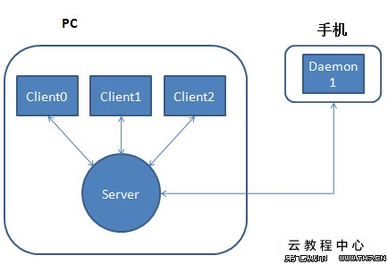

## 1.Android 调试桥

`Android` 调试桥 (`adb`) 是一个通用命令行工具，其允许您与模拟器实例或连接的 `Android` 设备进行通信。它可为各种设备操作提供便利，如安装和调试应用，并提供对 `Unix shell`（可用来在模拟器或连接的设备上运行各种命令）的访问。该工具作为一个客户端-服务器程序，包括三个组件：

- `adb`客户端，该组件发送命令。`adb`客户端在开发计算机上运行。我们可以通过从命令行运行`adb`客户端来发送命令。
- `adb`服务器，该组件管理客户端和后台程序之间的通信。`adb`服务器在开发计算机上作为后台进程运行。
- `adbd`服务器，该组件在设备上运行命令。`adbd`服务器在每个模拟器或设备实例上作为后台进程运行。

更详细的介绍请查看：

>https://developer.android.com/studio/command-line/adb

>https://github.com/mzlogin/awesome-adb

## ADB 安装

以下是 `ADB` 和 `Fastboot` 的谷歌官方下载链接：

`ADB`和`Fastboot for Windows`

> https://dl.google.com/android/repository/platform-tools-latest-windows.zip

`ADB`和`Fastboot for Mac`

> https://dl.google.com/android/repository/platform-tools-latest-darwin.zip


下载 `adb` 后解压即可使用

## 2.ADB 工作原理

启动一个 `adb` 客户端时，此客户端首先检查是否有已运行的 `adb` 服务器进程。如果没有，它将启动服务器进程。当服务器启动时，它与本地 `TCP` 端口 `5037` 绑定，并侦听从 `adb` 客户端发送的命令—所有 `adb `客户端均使用端口 `5037` 与 `adb` 服务器通信。




## 3.启用 adb 调试

> 在安卓手机上-> 设置 --> 关于手机 --> 版本号（点击7次启动开发者模式） --> 系统更新 --> 开发者选项 --> 启动仅充电情况下允许 `ADB` 调试。

- 启动 `ADB` 服务

```
 ./adb start-server
```

- 查看已经连接设备

```
/platform-tools_r31.0.0-windows/platform-tools$ ./adb devices
```
- 关闭 `ADB` 服务
  
```
$ ./adb kill-server
```

- 查看`5037`端口有没有被占用

```
netstat -ano | findstr 5037
taskkill /pid 5037 /f
```

- 上传文件到手机上
```
adb push 'C:\Users\ThinkPad\Desktop\aaa.txt' /sdcard/aaa.txt
```

- 使用 shell 命令

```bash
 adb shell ls

 adb shell
 ls
```

- 使用 USB 电缆将设备连接到主计算机。

- 设置目标设备以侦听端口 5555 上的 TCP/IP 连接。

  `$ adb tcpip 5555`

- 从目标设备断开 USB 电缆连接。

- 查找 Android 设备的 IP 地址。例如，在 Nexus 设备上，您可以通过访问 Settings > About tablet（或 About phone) > Status > IP address 查找 IP 地址。或者，在 Android Wear 设备上，您可以通过访问 Settings > Wi-Fi Settings > Advanced > IP address 查找 IP 地址。

- 连接至设备，通过 IP 地址识别此设备。

  `$ adb connect device_ip_address`

```
adb connect 192.168.0.103:5555
already connected to 192.168.0.103:5555

adb devices
List of devices attached
192.168.0.103:5555      device

adb -s 192.168.0.103:5555 push 'C:\Users\ThinkPad\Desktop\aaa.txt' /sdcarda/aaa.txt
```

- 断开连接

```
adb disconnect 192.168.0.103:5555
```

## 3.Qt 开发

新建项目 --> 选择 Qt Widgets Application --> QDialog --> 


查看监听的端口


```
 netstat -ano | findstr 15376
  TCP    127.0.0.1:5037         0.0.0.0:0              LISTENING       15376
  TCP    127.0.0.1:65209        127.0.0.1:65210        ESTABLISHED     15376
  TCP    127.0.0.1:65210        127.0.0.1:65209        ESTABLISHED     15376
  TCP    127.0.0.1:65211        127.0.0.1:65212        ESTABLISHED     15376
  TCP    127.0.0.1:65212        127.0.0.1:65211        ESTABLISHED     15376

```

