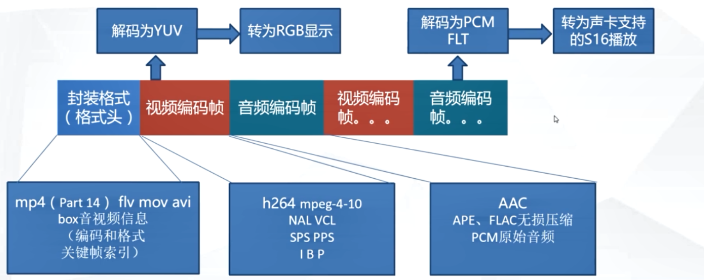

## 1.项目前期

ffmpeg +  Qt

ffmpeg视频处理的原理和实现

qt界面设计和opengl绘制视频
	
	实现一个重构OpenGL类来实现视频的绘制，会非常高效，能提高2-3倍的效率

视频经度播放的控制

ffmpeg音频处理的原理的实现

使用Qt的音频播放控件实现音频播放

使用多线程互斥技术重构音视频同步
	通过判断每一帧视频的播放进制和音频播放的pds值的实现

## 1.音视频的基础知识

- 封装：从文件中吧音视频读出来，
- 解码：把音视频数据解压出来
- 重采样：视频需要转换成显卡支持的格式才能播放，音频也需要转化成声卡支持的格式才能播放
- 
- 像素格式：视频需要做像素格式的转换

------

- 1.1 MPEG-4

是一套用于音频、视频信息的压缩编码标准

- H264：压缩算法

### 1.1 常用的封装格式

AVI：压缩标准可任意选择

FLV：ts 流媒体格式

ASF：可以用来做点播

mp4: ffmpeg 定义好的封装格式

### 1.2 常用的编码格式

视频：H264,wmv,XviD,mjpeg（每一帧都是独立的，没有依赖）

音频：aac MP3 ape flac

### 1.4 封装格式和编码格式

- 封装格式: 存入封装的视频压缩方式、音频压缩方式、帧率是多少，对应关键帧的索引（加快查找seek速度）

每种视频格式都有自己对应的封装头，对于 mp4 来说，它是用 box 来存放音视频信息（编码和格式 关键帧索引），box 里面还会存放 box。

音视频帧：音频帧和视编码频帧一般不会同步，但是也不会相差太远，因为音频的话可以一秒钟25帧。但是视频很难做到一秒钟25帧。音频的数据是根据采样率来定的。所以音频帧的帧率和视频帧的帧率是不一样的。

视频编码帧：一般都是基于 H264 这种压缩算法，也就是说这视频帧里面又包含了 H254 的编码规则，然后对于 H264 这一阵数据又包含 NAL（网络提取层）和 VCL（视频编码层），还包括视频的关键帧，比如说是I帧，B帧。P帧，或者这一帧是SPS（序列参数集，比如说关键帧goup一组的大小）还是PPS（比如图像的宽高）

假如说视频已经解封装了，就是说根据封装格式把这一阵读出来，解码为YUV，H264 算法解码出来的都是YUV格式，但是YUV数据是没法显示的，需要通过转换成 RGB 显示，（这部分转换的开销是非常大的，所以CPU需要做好优化）这个解码出来的数据是非常大的，一分钟可能就几个G了，这部分如果考虑做缓冲的时候需要考虑好。

把图像从一个压缩过的H264编码格式解码成YUV格式再转成RGB，这里解码有两种方式
- 软解码：利用CPU进行软解，比硬解码的性能强，但是CPU的频率会非常高，好点会非常大，因此会导致法发热，但是兼容性很强，目前大部分是基于软解码，
- 硬解码：直接固话号的电路，直接运行，应为是基于硬件，所以解码的性能是固定好的，但是兼容性不好

视频编码帧：音频部分包含 AAC，APE，FLAC无损压缩，PCM原始音频，

音频编码出来后需要解码，比如说AAC一般都是解码成PCM，用一个float 来存储音频的样本，因为这样可以方便做浮点运算，方便做编码和解码，float有4个字节，32位，但是普通显卡不支持32位，一般只支持16位，所以这时候需要进程重采样，转成声卡支持的16位播放，让所有的声卡都支持。然后进行播放

### 1.4 像素格式

指的是原始数据或者是解码之后的数据，就是直接显示的数据，

像素格式的参数：

BGRA RGBA ARGB32 RGB32 YUV420  	

YUV --> RGB

R = Y + 1.4075*(V-128)

G = Y - 0.3455*(U-128) - 0.7169*(V-128)

B = Y + 1.779 * (U - 128)

#### RGB  图像存放的格式

但是为了提高算法的效率可能会对每一行做对齐操作，每一行可能会在后面补，比如说补到4对齐（4x4），第二行就可能从12开始。所以在像素格式复制的时候可能需要一行一行复制，但是这样效率低一点。

#### YUV 格式

Y 表示明亮度。也就是灰度值

U V 表示色值

### 1.5 PCM 音频参数

- 采样率
- 通道
- 样本大小（格式）
- 