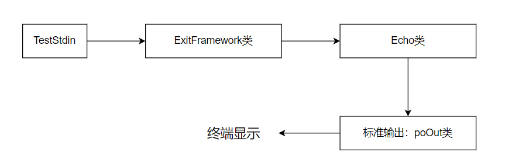

## 使用Zinx编写测试

### 使用标准输入

zinx框架的使用步骤

1. ZinxKernel::ZinxKernelInit() 初始化框架

2. 写类继承AZinxHandler，重写虚函数，在函数中对参数进行处理		

3. 写类继承Ichannel，重写虚函数完成数据收发，重写		

4. 添加步骤3类创建的对象到框架中
5. 运行框架

```cpp
#include <zinx.h>
#include <iostream>
using namespace std;

/*
1. ZinxKernel::ZinxKernelInit() 初始化框架
2. 写类继承AZinxHandler，重写虚函数，在函数中对参数进行处理
（比如将参数内容打印到标准输出）
3. 写类继承Ichannel，重写虚函数完成数据收发，重写
GetInputNextStage 函数，返回第二步创建类的对象
4. 添加步骤3类创建的对象到框架中
5. 运行框架
*/

//2.写功能处理类
class Echo : public AZinxHandler
{
	// 通过 AZinxHandler 继承，下面来个是纯虚函数，所以AZinxHandler 是抽象类
	//信息处理函数，当有需要一个环节继续处理时，应该创建新的信息对象（堆对象）并返回指针
	virtual IZinxMsg * InternelHandle(IZinxMsg & _oInput) override
	{
		//标准输出一般是字符串类型，但是_oInput不是字符串，可以使用宏

		//回显到标准输出,把输入进来的回显，但是不用管输入的是什么
		/*定义动态类型转换后的引用类型，若转换失败则执行返回NULL*/
		GET_REF2DATA(BytesMsg, input, _oInput);  //宏  定义一个BytesMsg类型的input,把_oInput字节流拷贝到input

		//把数据输出到标准输出，可以直接用cout
		cout << input.szData << endl;
		return nullptr;
	}
	//获取下一个处理环节函数
	virtual AZinxHandler * GetNextHandler(IZinxMsg & _oNextMsg) override
	{
		return nullptr;
	}
} * poEcho = new Echo(); //定义的时候就定义一个Echo对象

//3.写通道类
//一般地，用户应该根据处理的文件（信息源）不同而创建通道类的子类或选用合适的实用类（已经提供的通道类子类）来完成系统级文件IO
//class Ichannel :public AZinxHandler
class TestStdin : public Ichannel
{
	// 通过 Ichannel 继承
	virtual bool Init() override
	{
		return true;  //改成true初始化成功
	}
	virtual bool ReadFd(std::string & _input) override
	{
		//把标准输入读入到_input
		cin >> _input;
		return true;  //写入成功
	}
	virtual bool WriteFd(std::string & _output) override
	{
		//标准输入时单向的，所以不支持写
		return false;
	}
	virtual void Fini() override
	{
	}
	//告诉框架这个是哪个fd的通道
	virtual int GetFd() override
	{
		//标准输入是0，标准输出是1，错误是2
		return 0;
	}
	virtual std::string GetChannelInfo() override
	{
		return "stdin";
	}
	//数据交给谁来处理
	virtual AZinxHandler * GetInputNextStage(BytesMsg & _oInput) override
	{
		//读到的数据就交给poEcho来处理
		return poEcho;
	}
}; 

int main() {
	//1.初始化框架
	ZinxKernel::ZinxKernelInit();

	//4. 添加步骤3类创建的对象到框架中
	//将通道对象添加到框架

	//new 一个对象
	TestStdin * poStdin = new TestStdin();
	ZinxKernel::Zinx_Add_Channel(*poStdin);

	//5.运行框架
	ZinxKernel::Zinx_Run();

	//去初始化，在进程退出前建议调用该函数，回收相关资源,好的编程习惯都加上这句
	ZinxKernel::ZinxKernelFini();

	return 0;
}
```

### 使用框架输出
```cpp
#include <zinx.h>
#include <iostream>
using namespace std;


//创建标准输出通道
class TestStdout : public Ichannel
{
	// 通过 Ichannel 继承
	virtual bool Init() override
	{
		return true;
	}
	virtual bool ReadFd(std::string & _input) override
	{
		return false;
	}
	virtual bool WriteFd(std::string & _output) override
	{
		cout << _output << endl;
		return true;
	}
	virtual void Fini() override
	{
	}
	virtual int GetFd() override
	{
		//标准输入是0，标准输出是1，错误是2
		return 1;
	}
	virtual std::string GetChannelInfo() override
	{
		return "stdout";
	}
	virtual AZinxHandler * GetInputNextStage(BytesMsg & _oInput) override
	{
		return nullptr;
	}
} * poOut = new TestStdout();

//写功能处理
class Echo : public AZinxHandler
{
	virtual IZinxMsg * InternelHandle(IZinxMsg & _oInput) override
	{
		//然后_oInput
		GET_REF2DATA(BytesMsg, input, _oInput);
		//cout << input.szData << endl;
		//使用框架的标准输出
		ZinxKernel::Zinx_SendOut(input.szData, *poOut);  //使用标准输出通道,需要插件标准输出通道
		return nullptr;
	}
	virtual AZinxHandler * GetNextHandler(IZinxMsg & _oNextMsg) override
	{
		return nullptr;
	}
} * poEcho = new Echo();

//3.写通道类
class TestStdin : public Ichannel
{
	// 通过 Ichannel 继承
	virtual bool Init() override
	{
		return true;
	}
	virtual bool ReadFd(std::string & _input) override
	{
		cin >> _input;
		return true;  //写入成功
	}
	virtual bool WriteFd(std::string & _output) override
	{
		return false;
	}
	virtual void Fini() override
	{
	}
	virtual int GetFd() override
	{
		//标准输入是0，标准输出是1，错误是2
		return 0;
	}
	virtual std::string GetChannelInfo() override
	{
		return "stdin";
	}
	virtual AZinxHandler * GetInputNextStage(BytesMsg & _oInput) override
	{
		//把读到的数据交给poEcho来处理
		return poEcho;
	}
};

int main()
{
	//1.初始化
	ZinxKernel::ZinxKernelInit();

	//4.将通道添加到框架
	TestStdin * poStdin = new TestStdin();
	ZinxKernel::Zinx_Add_Channel(*poStdin); //标准输入
	ZinxKernel::Zinx_Add_Channel(*poOut);  //标准输出

	//5.运行框架
	ZinxKernel::Zinx_Run();


	//去初始化
	ZinxKernel::ZinxKernelFini();

	return 0;
}
```
流程
```
+----------------+               +------------------+
| console input  +-------------> |TestStdin::ReadFd |
+----------------+               +--------+---------+
                                          |
                                          |
                                          |
                                          v
                                +---------+----------+
                                |Echo::InternelHandle|
                                +---------+----------+
                                          |
                                          |
                                          |
                                          |
                                          v
+---------------+               +---------+----------+
| console output+<--------------+TestSTDOut：：WriteFd |
+---------------+               +--------------------+
```

标准输入回显标准输出的编写思路
1. 创建三个类：标准输入类，回显类，标准输出类
2. 重写标准输入类的读取函数
3. 重写回显类处理函数
4. 重写标准输出类的写出函数
5. 创建以上三个类的全局对象（堆对象），添加通道对象到框架
（kernel）
6. 运行框架

### 用例2-退出程序

需求：在官方用例的基础上增加功能：当用户输入exit四个字母时，不做回显，直接退出程序

