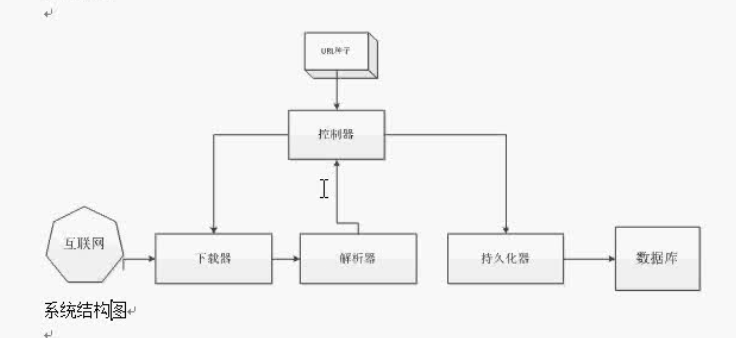
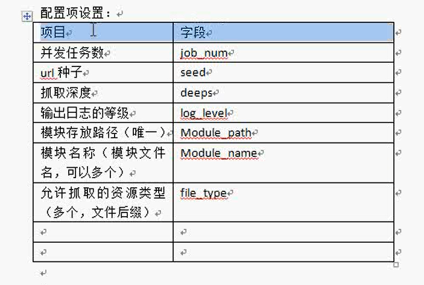
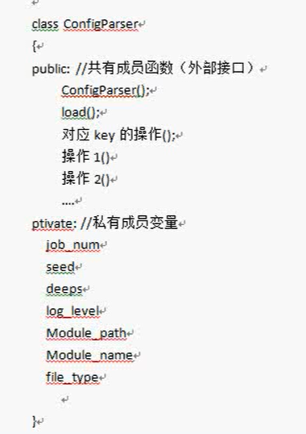
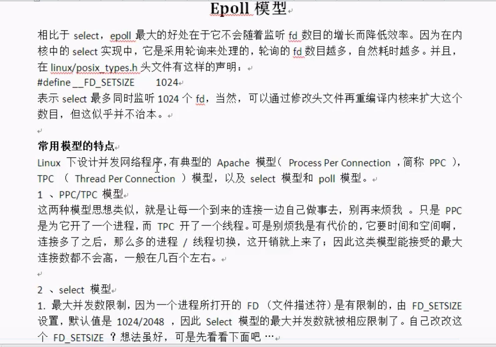
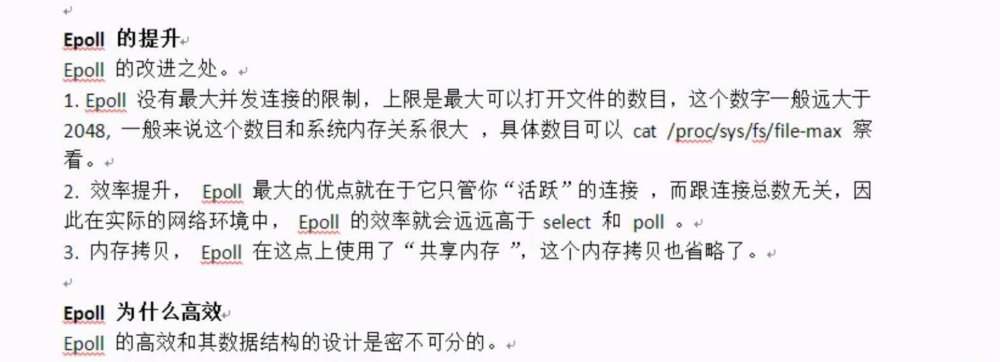
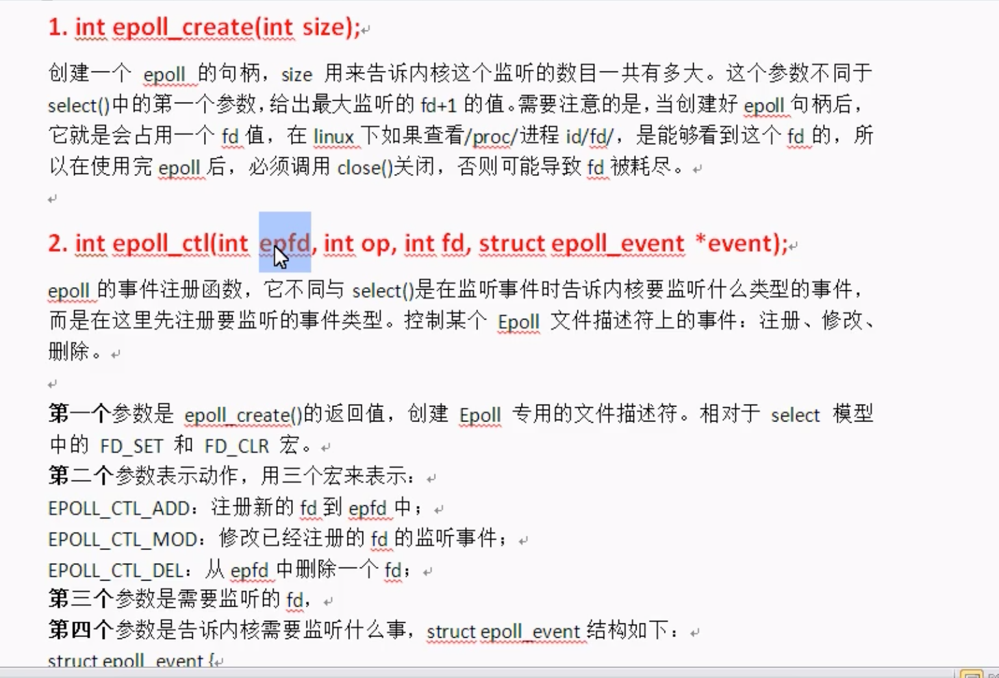
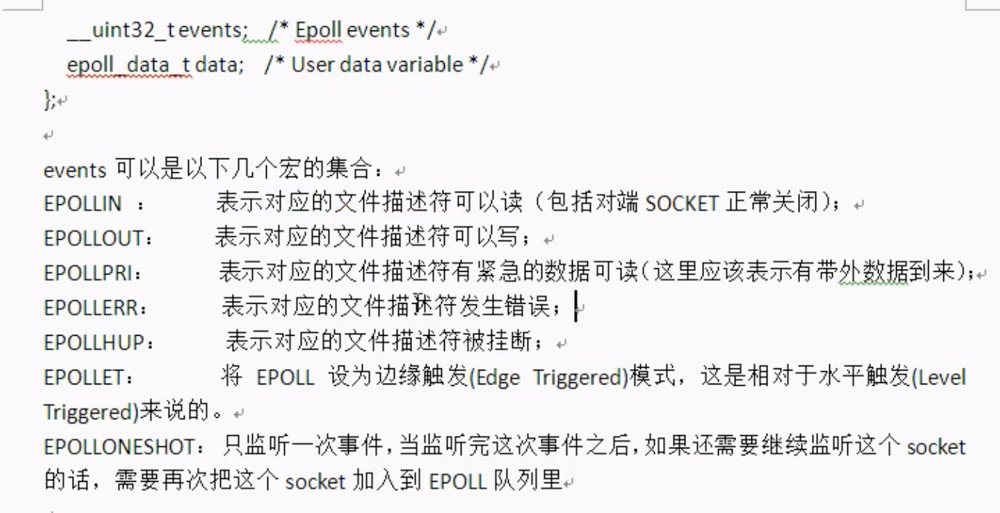
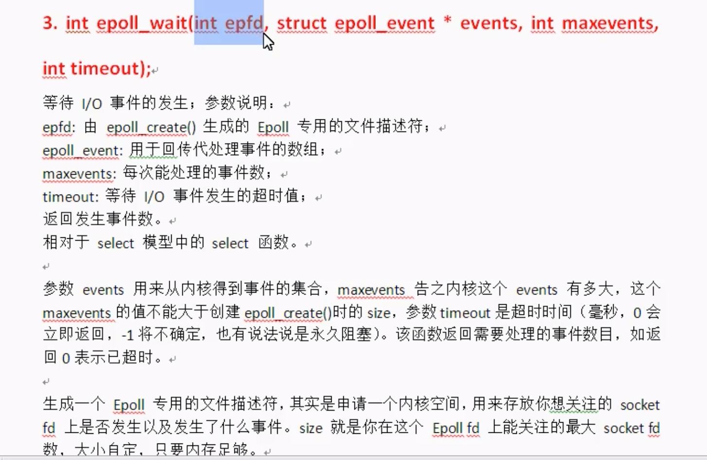
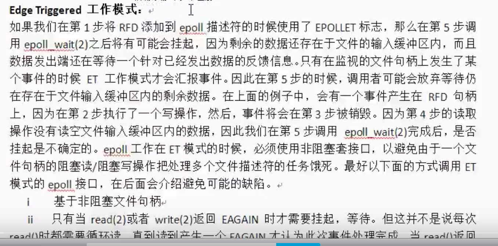
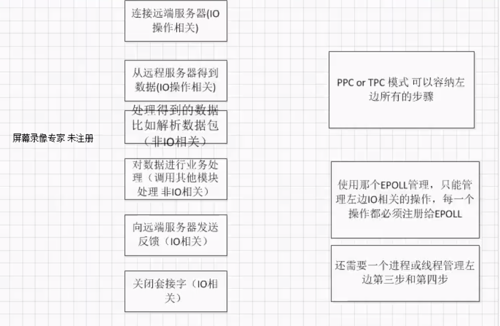

## 设计处理流程

用文件系统做数据库，可以用Hadoop

也叫数据的持久化

1.得到爬取种子（URL）

2.根据种子下载资源

3.提取页面，提取跟多的url

4.对页面做持久化操作

5.根据提取的url再进行下载操作

6.重复第二步到第五步

## 系统设计

## 控制器

输入配置文件，输出控制指令，控制其他模块的指令

控制模块由三部分组成

- 配置文件处理模块，从配置文件中读取配置项，提供配置项的提取接口，
- URL维护模块，负责维护URL库，提供如下功能：
  - 输入新的url
  - 输出一个未被抓取的url
  - 负责维护url的抓取状态
- 任务调度模块，多任务执行
  - 负责协调控制器的流程
  - 负责调用其他系统模块完成工作
- url列表

## 下载器设计

输入待抓取得url，输出抓取得页面

## 解析器

把页面的url解析出来，

只有一个HTML解析模块

### 持久化器

把数据持久化保存的文件系统上

页面保存模块

图片保存模块

视频流模块

音乐流模块

## 控制器

- 配置文件解析模块

## 概要设计

### 配置文件解析模块

配置文件是以文件形式保存程序运行时必要的参数，减少输入时的繁琐过程，文件类型是文本文件，内容一般以键值对形式出现。

配置文件规则

`key=value`

配置项设置

#### 模块详细设计

操作：

1.操作配置文件

2.得到配置文件选项的值（键值）

3.初始化

配置文件类

- confparser.h

为了让每个模块都能访问，设置成单例

> 接下来是实现...

技术点：

1.按行读取fgets

2.分割字符串

3.消除注释,遇到”#“就去掉

4.消除空格

### URL 维护模块

> 实际上内存的的小数据库，维护一个队列

url格式：http://www.baidu.com/code/index.html

结构：域名IP地址，路径，文件名

处理流程回顾：（结合上面的图）

一开始有一个url种子，然后控制器读取出来，

读取之后到控制器模块内部，

从配置文件里得到种子，先给URL维护模块，放到URL列表中去，第二步再把URL传给下载模块，当下载模块把这个页面抓取之后，会给控制器模块一个状态，这个状态会会写到URL列表中对应的数据。然后记录当前资源是否下载成功，可以和修改状态合并为当前URL处理状态state：0代表为抓取，1代表抓取成功，-1代表赚取失败

> 对URL维护模块细化

下面是数据结构内部设计

**对这个数据结构进行优化**

需要一个URL库保存所有的URL，不过是否被抓取，

设计一个URL队列，保存指向URL列表中具体URL的指针，当一个新的URL来的时候，先放到URL库中，然后用一个指针执行这个位置并把指针保存到URL处理队列，当我们想要抓取URL的时候从URL处理队列的队首拿出一个来，然后我们对这个指针进行操作即可，处理完之后就让其出队。

接下来设计URL维护模块算法

第一个类

第二个类，URL管理器

通过URL去查找url库里面是不是存在了，这时候我们需要设置一个url 哈希值转换，为了提高查找的效率，添加一个map

### 任务调度模块

> 程序的入口

在任务调度模块里面需要一个日志工具

任务调度模块，程序主流程

继续分解复杂步骤

对页面进行处理。

启动处理任务

其他辅助功能，

1.输出帮助信息，

### epoll

#### 多路复用框架

- 为什么使用epoll而不是用select

默认模式

高速模式

select的问题：
* 文件句柄数量受限制，最大才2028个

### 在这个系统中使用 epoll

关于页面的下载，是直接在socket上封装的，在抓取任务的时候，先调用build_connect连接server，之后返回的句柄会注册到epoll中去，

对页面的解析过程一样占用CPU资源，所以也需要epoll参与，

## 插件框架设计

## 下载器设计

分成两部分

- socket功能框架

- http协议处理模块

功能：想远端服务器发起请求，把页面抓取下来

HTTP主要操作：操作get指令

页面解析处理流程
1. 得到下载的页面
2. 得到页面对应的url结构体(用于当前页面的深度，是否已经达到最大深度)
3. 使用正则表达式提取页面中所有的url列表
4. 处理url中的相对路径
5. 一个细节：把当前页面深度加一，生成并填充url结构体，
6. 把得到的url列表会写到管理器中，（生成列表数据，以返回值形式上层代码）

## 持久化器

处理流程

- 得到页面的数据流或在内存缓冲区中的数据
- 得到当前页面的URL描述结构体
- 生辰保存目录（目录已存在和未存在的处理情况）
- 把文件按照指定模式写入磁盘系统
- 向主处理流程发送一个反馈，表示当前页面处理进度

后续工作：单元测试用cunit工具

把软件做成系统服务，需要shell脚本

继承测试

## 项目实施

## 项目简历

url 是怎么管理的

关于主控模块

工作流程，epoll，多线程是怎么实现的，kselect这个库，有没有用到线程同步的技术，怎么得到url（dns解析）

现阶段不要求

下载模块，socket，socket工作细节，tcp，udp，用哪种方式实现的，用tcp，

HTTP，对HTTP头进行分析，用字符串解析出来，按行读取，找头的属性值，找到http头的每个属性，然后从后边把这个值提取出来，用到了哪个值，用到了文件的类型（Accept：text/html)，状态码，判断页面是否下载成功。其他的说忘了。

#### 关于页面解析

就是一行正则表达式做匹配，（网上查的）

#### 持久化模块

按照网站目录结构在本地存储，

看你会问这个地方会引发出的问题，文件是怎么存储的，（标准库还是系统调用）

标准库是有缓冲的，（可以说用的是Hadoop，但是要会说）

什么是守护进程，设置守护继承的步骤。分别用什么函数，第一步创建子进程，然后脱离父子关系，然后杀死父进程，然后变成孤儿进程之后会怎样，再归为一号进程，用了哪些函数，

Linux动态库做什么，实现了一种简单的插件模式，因为我想以后想支持更多的文件，每一种文件格式都有一种处理方式，为了更快扩展，用了这个插件，程序里面自动做了自动匹配，遇到哪种文件，我就自动去调用哪个模块。

那么实现机制是什么？

一个功能一个模块，方便扩展，

怎么去实现的呢？

用一个结构体来描述，而且结构体有函数指针

那这些模块怎么去管理

有一个模块管理器，维护这些模块的结构体。主要指导这个模块的编号就能找到这个模块。

项目中用到的开源库：

libevent，
