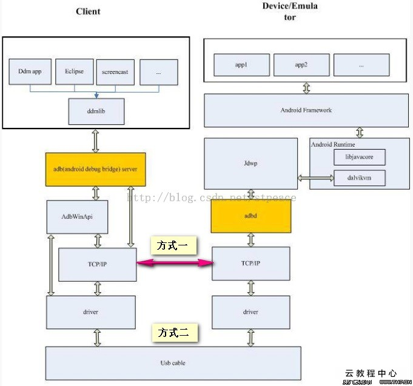
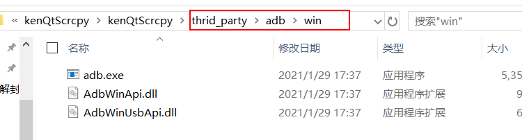
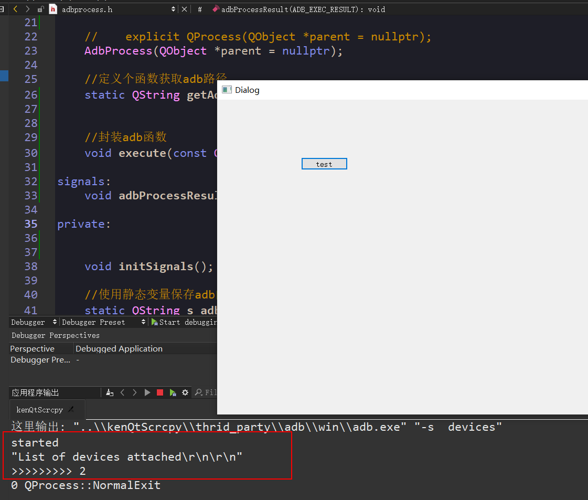

## 1.Android 调试桥

`Android` 调试桥 (`adb`) 是一个通用命令行工具，其允许您与模拟器实例或连接的 `Android` 设备进行通信。它可为各种设备操作提供便利，如安装和调试应用，并提供对 `Unix shell`（可用来在模拟器或连接的设备上运行各种命令）的访问。该工具作为一个客户端-服务器程序，包括三个组件：

- `adb`客户端，该组件发送命令。`adb`客户端在开发计算机上运行。我们可以通过从命令行运行`adb`客户端来发送命令。
- `adb`服务器，该组件管理客户端和后台程序之间的通信。`adb`服务器在开发计算机上作为后台进程运行。
- `adbd`服务器，该组件在设备上运行命令。`adbd`服务器在每个模拟器或设备实例上作为后台进程运行。

更详细的介绍请查看：

> https://developer.android.com/studio/command-line/adb

> https://github.com/mzlogin/awesome-adb

## ADB 安装

以下是 `ADB` 和 `Fastboot` 的谷歌官方下载链接：

`ADB`和`Fastboot for Windows`

> https://dl.google.com/android/repository/platform-tools-latest-windows.zip

`ADB`和`Fastboot for Mac`

> https://dl.google.com/android/repository/platform-tools-latest-darwin.zip


下载 `adb` 后解压即可使用

## 2.ADB 工作原理

启动一个 `adb` 客户端时，此客户端首先检查是否有已运行的 `adb` 服务器进程。如果没有，它将启动服务器进程。当服务器启动时，它与本地 `TCP` 端口 `5037` 绑定，并侦听从 `adb` 客户端发送的命令—所有 `adb `客户端均使用端口 `5037` 与 `adb` 服务器通信。




## 3.启用 adb 调试

> 在安卓手机上-> 设置 --> 关于手机 --> 版本号（点击7次启动开发者模式） --> 系统更新 --> 开发者选项 --> 启动仅充电情况下允许 `ADB` 调试。

- 启动 `ADB` 服务

```
 ./adb start-server
```

- 查看已经连接设备

```
/platform-tools_r31.0.0-windows/platform-tools$ ./adb devices
```
- 关闭 `ADB` 服务
  
```
$ ./adb kill-server
```

- 查看`5037`端口有没有被占用

```
netstat -ano | findstr 5037
taskkill /pid 5037 /f
```

- 上传文件到手机上
```
adb push 'C:\Users\ThinkPad\Desktop\aaa.txt' /sdcard/aaa.txt
```

- 使用 shell 命令

```bash
 adb shell ls

 adb shell
 ls
```

- 使用 USB 电缆将设备连接到主计算机。

- 设置目标设备以侦听端口 5555 上的 TCP/IP 连接。

  `$ adb tcpip 5555`

- 从目标设备断开 USB 电缆连接。

- 查找 Android 设备的 IP 地址。例如，在 Nexus 设备上，您可以通过访问 Settings > About tablet（或 About phone) > Status > IP address 查找 IP 地址。或者，在 Android Wear 设备上，您可以通过访问 Settings > Wi-Fi Settings > Advanced > IP address 查找 IP 地址。

- 连接至设备，通过 IP 地址识别此设备。

  `$ adb connect device_ip_address`

```
adb connect 192.168.0.103:5555
already connected to 192.168.0.103:5555

adb devices
List of devices attached
192.168.0.103:5555      device

adb -s 192.168.0.103:5555 push 'C:\Users\ThinkPad\Desktop\aaa.txt' /sdcarda/aaa.txt
```

- 断开连接

```
adb disconnect 192.168.0.103:5555
```

## 3.Qt 开发

新建项目 --> 选择 Qt Widgets Application --> base clas 选择 QDialog --> 

### 3.1 QProcess 简单用法

adb属于web进程，所以需要使用Qt提供的`QProcess`,可以在Qt的帮助中查看。


点击more之后直接复制

```cpp
QObject *parent;
...
QString program = "./path/to/Qt/examples/widgets/analogclock";
QStringList arguments;
arguments << "-style" << "fusion";

QProcess *myProcess = new QProcess(parent);
myProcess->start(program, arguments); //启动一个进程，传递进程名称和进程参数
```

在界面上添加一个按钮

--> 点击 dialog.ui 拖 push Button到界面，然后右下角设置 Object name 和 text

调价响应事件，将上面的demo复制到响应事件中去


```cpp
#include <QProcess>
#include "dialog.h"
#include "ui_dialog.h"

Dialog::Dialog(QWidget *parent)
    : QDialog(parent)
    , ui(new Ui::Dialog)
{
    ui->setupUi(this);
}

Dialog::~Dialog()
{
    delete ui;
}

//响应事件部分
void Dialog::on_testBtn_clicked()
{
//    QObject *parent;
    //需要打开的软件，这里暂时用记事本
    QString program = "notepad";
    QStringList arguments;
    arguments << "C:\\Users\\ThinkPad\\Desktop\\aaa.txt";  //需要打开的文件

    QProcess *myProcess = new QProcess(this);
//    myProcess->start(program, arguments); //启动一个进程，传递进程名称和进程参数
//    myProcess->start(program,Q_NULLPTR); //先不传递参数测试
    myProcess->start(program, arguments);
}

```

### 3.2 编写自己的 `AdbProcess.h`

新建一个 adb 文件夹， 在文件加下建立一个`adb.pri`文件,在项目的pro文件中添加子模块，和头文件目录

```
# 子模块
include($$PWD/adb/adb.pri)

# 包含目录
INCLUDEPATH += \
        $$PWD/adb 
```

保存之后qt项目会自动出现一个adb模块，

接下来在 adb  下进行开发

新建一个类，AdbProcess, 用这个类来封装 Process ,所以需要继承 Process


adbprocess.h
```cpp
#ifndef ADBPROCESS_H
#define ADBPROCESS_H
#include <QProcess>


class AdbProcess: public QProcess
{
public:
    //    explicit QProcess(QObject *parent = nullptr);
    AdbProcess(QObject *parent = nullptr);
};

#endif // ADBPROCESS_H
```

adbprocess.cpp

```cpp
#include "adbprocess.h"

AdbProcess::AdbProcess(QObject *parent)
    :QProcess(parent)
{

}

```

进程测试：

```cpp
//#include <QProcess>
#include "adbprocess.h"

#include "dialog.h"
#include "ui_dialog.h"

Dialog::Dialog(QWidget *parent)
    : QDialog(parent)
    , ui(new Ui::Dialog)
{
    ui->setupUi(this);
}

Dialog::~Dialog()
{
    delete ui;
}

//响应事件部分
void Dialog::on_testBtn_clicked()
{
//    QObject *parent;
    //需要打开的软件，这里暂时用记事本
    QString program = "notepad";
    QStringList arguments;
    arguments << "C:\\Users\\ThinkPad\\Desktop\\aaa.txt";  //需要打开的文件

    AdbProcess *myProcess = new AdbProcess(this);
    myProcess->start(program, arguments);
}
```

发现能打开记事本，说明封装的类没问题。


### 3.3 封装 adb 操作，

将 adb 文件放在工程目录下，



测试`adb.exe`

```cpp
//#include <QProcess>
#include "adbprocess.h"

#include "dialog.h"
#include "ui_dialog.h"

Dialog::Dialog(QWidget *parent)
    : QDialog(parent)
    , ui(new Ui::Dialog)
{
    ui->setupUi(this);
}

Dialog::~Dialog()
{
    delete ui;
}

//响应事件部分
void Dialog::on_testBtn_clicked()
{
//    thrid_party\adb\win
    QString program = "..\\thrid_party\adb\win\adb.exe";
    QStringList arguments;
    arguments << "C:\\Users\\ThinkPad\\Desktop\\aaa.txt";  //需要打开的文件

    AdbProcess *myProcess = new AdbProcess(this);
    myProcess->start(program, Q_NULLPTR);  //暂时不传递参数
}
```
测试运行发现没有反应，查看Qprocess的执行结果，可以通过查看信号接口来查看。

查看 `QProcess` 有哪些信号接口


```
//发送错误
void 
errorOccurred(QProcess::ProcessError error)  
//完成
void 
finished(int exitCode, QProcess::ExitStatus exitStatus)
//标准错误和标准错误
void 
readyReadStandardError()
//标准输出
void 
readyReadStandardOutput()
//启动成功
void 
started()
```

测试这些接口的使用，


adbprocess.cpp

```cpp
#include "adbprocess.h"
#include <QDebug>  //打印输出

AdbProcess::AdbProcess(QObject *parent)
    :QProcess(parent)
{
    initSignals();
}

void AdbProcess::initSignals()
{
    //将错误的信号连接到lambar表达式中
    //发生错误
    connect(this, &QProcess::errorOccurred,this,[this](QProcess::ProcessError error) {
//        if (QProcess::FailedToStart == error) {
//            emit adbProcessResult(AER_ERROR_MISSING_BINARY);
//        } else {
//            emit adbProcessResult(AER_ERROR_START);
//        }
        //使用qDebug输出
        qDebug() << error;
    } );

    //完成
    connect(this, static_cast<void(QProcess::*)(int, QProcess::ExitStatus)>(&QProcess::finished),
          this, [this](int exitCode, QProcess::ExitStatus exitStatus){
//        if (QProcess::NormalExit == exitStatus && 0 == exitCode) {
//            emit adbProcessResult(AER_SUCCESS_EXEC);
//        } else {
//            emit adbProcessResult(AER_ERROR_EXEC);
//        }
        qDebug() << exitCode << exitStatus;
    });

    //标准错误
    connect(this, &QProcess::readyReadStandardError, this, [this](){
//        m_errorOutput = QString::fromLocal8Bit(readAllStandardError()).trimmed();
//        qDebug() << m_errorOutput;
        qDebug() << readAllStandardError();
    });


    //标准输出
    connect(this, &QProcess::readyReadStandardOutput, this, [this](){
//        m_standardOutput= QString::fromLocal8Bit(readAllStandardOutput()).trimmed();
//        qDebug() << m_standardOutput;
        qDebug() << readAllStandardOutput();
    });
    //开始连接
    connect(this, &QProcess::started, this,[this](){
//        emit adbProcessResult(AER_SUCCESS_START);
        qDebug() << "started";
    });
}

```

运行测试
```
QProcess::FailedToStart
```

原因是找不到文件，因此需要获取工作目录
```cpp
    //获取运行程序的工作目录和程序所在目录
    qDebug() << "current applicationDirPath: " << QCoreApplication::applicationDirPath();
    qDebug() << "current currentPath: " << QDir::currentPath();
    qDebug() << "----- this workspace path -----";
```
完整程序：

```cpp
//#include <QProcess>
#include "adbprocess.h"
#include <QDebug>
#include <QDir>

#include "dialog.h"
#include "ui_dialog.h"

Dialog::Dialog(QWidget *parent)
    : QDialog(parent)
    , ui(new Ui::Dialog)
{
    ui->setupUi(this);
}

Dialog::~Dialog()
{
    delete ui;
}

//响应事件部分
void Dialog::on_testBtn_clicked()
{

    //获取运行程序的工作目录和程序所在目录
    qDebug() << "current applicationDirPath: " << QCoreApplication::applicationDirPath();
    qDebug() << "current currentPath: " << QDir::currentPath();
    qDebug() << "----- this workspace path -----";

//    thrid_party\adb\win
    QString program = "..\\thrid_party\adb\win\adb.exe";
    // QString program = "..\\kenQtScrcpy\\thrid_party\adb\win\adb.exe";
    QStringList arguments;
    arguments << "C:\\Users\\ThinkPad\\Desktop\\aaa.txt";  //需要打开的文件

    AdbProcess *myProcess = new AdbProcess(this);
    myProcess->start(program, Q_NULLPTR);  //暂时不传递参数
}

```

运行结果：
```
D:/worksplace/qtworkspace/kenQtScrcpy/build-kenQtScrcpy-Desktop_Qt_5_12_9_MinGW_32_bit-Debug
```

所以更改运行`adb.exe`的目录
```cpp
QString program = "..\\kenQtScrcpy\\thrid_party\adb\win\adb.exe";
```

## 2.第二节

由于adb随时更换目录，所以设置一个灵活的目录配置。

```cpp
//使用静态变量保存adb的路径
static QString s_adbPath;

QString AdbProcess::s_adbPath = "";
```

```
//定义个函数获取adb路径
static Qstring getAdbPath();

Qstring AdbProcess::getAdbPath()
{
    
}
```

使用Qt的环境环境变量设置

main函数里面
```cpp
//使用qt环境变量设置路径
qputenv("QTSCRCPY_ADB_PATH","..\\kenQtScrcpy\\thrid_party\\adb\\win\\adb.exe")
```

从环境变量获取adb路径，

adbProcess.cpp

```cpp
#include <QFileInfo>
#include <QCoreApplication>
#include <QString>

QString AdbProcess::getAdbPath()
{
    if(s_adbPath.isEmpty()) {
        //把环境变量赋值给s_adbPath
        s_adbPath = QString::fromLocal8Bit(qgetenv("QTSCRCPY_ADB_PATH"));
        //如果通过环境变量指定的目录不存在再去指定的路径中找adb
        QFileInfo fileInfo(s_adbPath);
        //如果s_adbPath为空或者找不到这个文件
        if(s_adbPath.isEmpty() || !fileInfo.isFile() ) {
            //将路径设置为当前所在目录
            s_adbPath = QCoreApplication::applicationDirPath() + "/adb";
        }
    }
    return s_adbPath;
}
```

完整代码

main 

```cpp
#include "dialog.h"

#include <QApplication>

int main(int argc, char *argv[])
{
    //使用qt环境变量设置路径
    qputenv("QTSCRCPY_ADB_PATH","..\\kenQtScrcpy\\thrid_party\\adb\\win\\adb.exe");

    QApplication a(argc, argv);
    Dialog w;
    w.show();
    return a.exec();
}
```

adbProcess.cpp

```cpp

#include "adbprocess.h"
#include <QDebug>  //打印输出
#include <QFileInfo>
#include <QCoreApplication>
#include <QString>

QString AdbProcess::s_adbPath = "";

AdbProcess::AdbProcess(QObject *parent)
    :QProcess(parent)
{
    initSignals();
    getAdbPath();
}


QString AdbProcess::getAdbPath()
{
    if(s_adbPath.isEmpty()) {
        //把环境变量赋值给s_adbPath
        s_adbPath = QString::fromLocal8Bit(qgetenv("QTSCRCPY_ADB_PATH"));
        //如果通过环境变量指定的目录不存在再去指定的路径中找adb
        QFileInfo fileInfo(s_adbPath);
        //如果s_adbPath为空或者找不到这个文件
        if(s_adbPath.isEmpty() || !fileInfo.isFile() ) {
            //将路径设置为当前所在目录
            s_adbPath = QCoreApplication::applicationDirPath() + "/adb";
        }
    }
    return s_adbPath;
}

void AdbProcess::initSignals()
{
    //将错误的信号连接到lambar表达式中
    //发生错误
    connect(this, &QProcess::errorOccurred,this,[this](QProcess::ProcessError error) {
//        if (QProcess::FailedToStart == error) {
//            emit adbProcessResult(AER_ERROR_MISSING_BINARY);
//        } else {
//            emit adbProcessResult(AER_ERROR_START);
//        }
        //使用qDebug输出
        qDebug() << error;
    } );

    //完成
    connect(this, static_cast<void(QProcess::*)(int, QProcess::ExitStatus)>(&QProcess::finished),
          this, [this](int exitCode, QProcess::ExitStatus exitStatus){
//        if (QProcess::NormalExit == exitStatus && 0 == exitCode) {
//            emit adbProcessResult(AER_SUCCESS_EXEC);
//        } else {
//            emit adbProcessResult(AER_ERROR_EXEC);
//        }
        qDebug() << exitCode << exitStatus;
    });

    //标准错误
    connect(this, &QProcess::readyReadStandardError, this, [this](){
//        m_errorOutput = QString::fromLocal8Bit(readAllStandardError()).trimmed();
//        qDebug() << m_errorOutput;
        qDebug() << readAllStandardError();
    });


    //标准输出
    connect(this, &QProcess::readyReadStandardOutput, this, [this](){
//        m_standardOutput= QString::fromLocal8Bit(readAllStandardOutput()).trimmed();
//        qDebug() << m_standardOutput;
        qDebug() << readAllStandardOutput();
    });
    //开始连接
    connect(this, &QProcess::started, this,[this](){
//        emit adbProcessResult(AER_SUCCESS_START);
        qDebug() << "started";
    });
}

```

dialog.cpp

```cpp
//#include <QProcess>
#include "adbprocess.h"
#include <QDebug>
#include <QDir>

#include "dialog.h"
#include "ui_dialog.h"

Dialog::Dialog(QWidget *parent)
    : QDialog(parent)
    , ui(new Ui::Dialog)
{
    ui->setupUi(this);
}

Dialog::~Dialog()
{
    delete ui;
}

//响应事件部分
void Dialog::on_testBtn_clicked()
{

    //获取运行程序的工作目录和程序所在目录
    qDebug() << "current applicationDirPath: " << QCoreApplication::applicationDirPath();
    qDebug() << "current currentPath: " << QDir::currentPath();
    qDebug() << "----- this workspace path -----";

//    thrid_party\adb\win
    QString program = "..\\kenQtScrcpy\\thrid_party\\adb\\win\\adb.exe";
    QStringList arguments;
    arguments << "C:\\Users\\ThinkPad\\Desktop\\aaa.txt";  //需要打开的文件

    AdbProcess *myProcess = new AdbProcess(this);
    myProcess->start(program, Q_NULLPTR);  //暂时不传递参数
}
 
```


调试执行


------

## 4.封装函数

第一个函数 

adbProcess.h

```cpp
public:
    //第一个参数是序列号，第二个是传递给adb的具体命令
    void execute(const QString& serial, const QStringList& args);
```

adbProcess.cpp

```cpp
void AdbProcess::execute(const QString &serial, const QStringList &args)
{
    QStringList adbArgs;
    //在仅有一个设备连接的时候序列号是可以省略的
    //所以需要判断序列号不为空的时候才传递参数
    if(serial.isEmpty()) {
        adbArgs << "-s" << serial;
    }
    adbArgs << args;
    //带你输出
    qDebug() << getAdbPath() << adbArgs.join(" ");
    //启动adb进程
    start(getAdbPath(),adbArgs);
}
```

dialog.cpp

```cpp
//响应事件部分
void Dialog::on_testBtn_clicked()
{

    QStringList arguments;
    arguments << "devices";  //输入命令

    AdbProcess *myProcess = new AdbProcess(this);
    //void AdbProcess::execute(const QString &serial, const QStringList &args)
    myProcess->execute("", arguments);   //只有一台设备连接，不需要插入序列号


    //不使用环境变量测试

    //输入命令
//    QStringList argument;
//    argument << "devices"; //输入命令

//    QString program = "..\\kenQtScrcpy\\thrid_party\\adb\\win\\adb.exe";

//    AdbProcess * myProcess = new AdbProcess(this);
//    myProcess->start(program,argument);
}
```

启动测试


由于我们每次启动进程的时候不可能都成功，我们应该输出响应的信号能更好的判断。


一些错误信号：

```cpp
    enum ProcessError {
        FailedToStart, //### file not found, resource error
        Crashed,
        Timedout,
        ReadError,
        WriteError,
        UnknownError
    };
```

对这些信号进行处理


首先定义状态

adbProcess.h
```cpp
public:
	//给一些错误提示
    enum ADB_EXEC_RESULT {
        AER_SUCCESS_START,          // 启动成功
        AER_ERROR_START,            // 启动失败
        AER_SUCCESS_EXEC,           // 执行成功
        AER_ERROR_EXEC,             // 执行失败
        AER_ERROR_MISSING_BINARY,   // 找不到r二进制文件
    };

//定义自己的信号显示
signals:
    void adbProcessResult(ADB_EXEC_RESULT processResult);

```

然后去adbProcess.cpp中实现显示信号提示

发生错误
```cpp
    //发生错误
    connect(this, &QProcess::errorOccurred,this,[this](QProcess::ProcessError error) {
        if (QProcess::FailedToStart == error) {  //代表找不到二进制文件
            emit adbProcessResult(AER_ERROR_MISSING_BINARY);
        } else {  //代表启动失败
            emit adbProcessResult(AER_ERROR_START);
        }
        //使用qDebug输出
        qDebug() << error;
    } );


```
启动成功

```cpp
    connect(this, static_cast<void(QProcess::*)(int, QProcess::ExitStatus)>(&QProcess::finished),
          this, [this](int exitCode, QProcess::ExitStatus exitStatus){
        if (QProcess::NormalExit == exitStatus && 0 == exitCode) {
            emit adbProcessResult(AER_SUCCESS_EXEC);  //启动成功
        } else {
            emit adbProcessResult(AER_ERROR_EXEC);
        }
        qDebug() << exitCode << exitStatus;
    });
```

dialog.cpp
```cpp
void Dialog::on_testBtn_clicked()
{

    QStringList arguments;
    arguments << "devices";  //输入命令

    AdbProcess *myProcess = new AdbProcess(this);
    
    //连接自己设置的信号
    connect(myProcess,&AdbProcess::adbProcessResult,this,[this](AdbProcess::ADB_EXEC_RESULT processResult){
        qDebug() << ">>>>>>>>>" << processResult;
    }); 
    
    //void AdbProcess::execute(const QString &serial, const QStringList &args)
    myProcess->execute("", arguments);   //只有一台设备连接，不需要插入序列号
}
```

如果使用Qt的信号槽需要在类里面添加宏定义

```cpp
    //信号槽添加宏
    Q_OBJECT
public:
```
 
然后需要qmake一下



测试启动成功

--------
## 第三节

封装其他重用接口

封装adb常用的命令

### 封装push 命令
adbprocess.h
```cpp
//封装push命令
//第一个参数是序列号，第二个参数是本地文件路径，第三个参数代表手机上的位置
void push(const QString& serial,const QString& local,const QString& remote);
···

adbProcess.cpp

```cpp
//push方法的封装实现
void AdbProcess::push(const QString &serial, const QString &local, const QString &remote)
{
    QStringList adbArgs;
    adbArgs << "push"; //第一个命令
    adbArgs << local;  //第二个命令本地的路径
    adbArgs << remote;  //第三个命令是手机上的路径
    //通过execute函数来执行它
    execute(serial,adbArgs);
}
```


写测试代码
dialog.cpp

```cpp
void Dialog::on_testBtn_clicked()
{

    AdbProcess *myProcess = new AdbProcess(this);

    //连接自己设置的信号
    connect(myProcess,&AdbProcess::adbProcessResult,this,[this](AdbProcess::ADB_EXEC_RESULT processResult){
        qDebug() << ">>>>>>>>>" << processResult;
    });

    //测试上传代码
    myProcess->push("","C:\\Users\\ThinkPad\\Desktop\\aaa.txt","/sdcard/aaa.txt");
}
```

### 封装 remove 命令

adbProcess.h
```cpp
//封装删除手机文件的函数
void removePath(const QString& serial,const QString & path);
```

adbProcess.cpp

```cpp
void AdbProcess::removePath(const QString &serial, const QString & path)
{
    QStringList adbArgs;
     adbArgs << "shell";
     adbArgs << "rm" ;
     adbArgs << path;
     execute(serial,adbArgs);
}
```

dialog.cpp

```cpp
myProcess->removePath("","/sdcard/aaa.txt");
```

### 打开反向代理

abdProcess.h
```cpp
    //反向代理
//第二个参数是需要反向代理安卓端的哪一个套接字，第三个参数是端口
void reverse(const QString& serial,const QString& deviceSocketName, quint16 localPort);
```

adbProcess.cpp

```cpp
//反向代理
void AdbProcess::reverse(const QString &serial, const QString &deviceSocketName, quint16 localPort)
{
    QStringList adbArgs;
    adbArgs << "reverse";
    //安卓端的预套接字名称
    adbArgs << QString("localabstract:%1").arg(deviceSocketName) ;  //填充前面的1%
    //将前面的套接字代理到tcp端口上
    adbArgs << QString("tcp:%1").arg(localPort) ;
    execute(serial,adbArgs);
}
```
 
dialog.cpp

```cpp
//将安卓端名字为scrcpy套接字代理到PC端的5037端口
myProcess->reverse("","scrcpy",5037);
```


通过命令查看是否建立成功
```
$ ./adb reverse --list
host-11 localabstract:scrcpy tcp:5037
```


### 移除反向代理

```cpp
//移除反向代理
void reverseRemove(const QString& serial,const QString& deviceSocketName);

//移除反向代理
void AdbProcess::reverseRemove(const QString &serial, const QString &deviceSocketName)
{
    QStringList adbArgs;
    adbArgs << "reverse";
    adbArgs << "--remove";
    adbArgs << QString("localabstract:%1").arg(deviceSocketName) ;
    execute(serial,adbArgs);;
}


myProcess->reverseRemove("","scrcpy");
```

测试是否移除反向代理
```
$ ./adb reverse --list
```

## 第四节

封装两个接口

adbProcess.h

```cpp
    //获取序列号，从标准输入中,需要声明一个变量保存输出
    QStringList getDevicesSerialFromStdOut();
private:
    //保存标准输出的序列号
    QString m_standardOutput = "";  //标准输出
    QString m_errorOutput = "";  //标准错误
```

adbProcess.cpp

```cpp
//获取序列号 先返回空测试
QStringList AdbProcess::getDevicesSerialFromStdOut()
{
    QStringList serial;
    return serial;
}


//需要保存标准输出和标准错误的信息
void AdbProcess::initSignals()
{
    //将错误的信号连接到lambar表达式中
    //发生错误
    connect(this, &QProcess::errorOccurred,this,[this](QProcess::ProcessError error) {
        if (QProcess::FailedToStart == error) {  //代表找不到二进制文件
            emit adbProcessResult(AER_ERROR_MISSING_BINARY);
        } else {  //代表启动失败
            emit adbProcessResult(AER_ERROR_START);
        }
        //使用qDebug输出
        qDebug() << error;
    } );

    //启动成功
    connect(this, static_cast<void(QProcess::*)(int, QProcess::ExitStatus)>(&QProcess::finished),
          this, [this](int exitCode, QProcess::ExitStatus exitStatus){
        if (QProcess::NormalExit == exitStatus && 0 == exitCode) {
            emit adbProcessResult(AER_SUCCESS_EXEC);  //启动成功
        } else {
            emit adbProcessResult(AER_ERROR_EXEC);
        }
        qDebug() << exitCode << exitStatus;
    });
//////////////////==============================> 更改
    //标准错误
    connect(this, &QProcess::readyReadStandardError, this, [this](){
        //保存标准错误
        m_errorOutput = QString::fromLocal8Bit(readAllStandardError()).trimmed();
        qDebug() << m_errorOutput;
//        qDebug() << readAllStandardError();
    });


    //标准输出
    connect(this, &QProcess::readyReadStandardOutput, this, [this](){
       //保存标准输出
        m_standardOutput= QString::fromLocal8Bit(readAllStandardOutput()).trimmed();
        qDebug() << m_standardOutput;
//        qDebug() << readAllStandardOutput();
    });

//////////////////==============================> 更改

    //开始连接
    connect(this, &QProcess::started, this,[this](){
//        emit adbProcessResult(AER_SUCCESS_START);
        qDebug() << "started";
    });
}
```

测试查看adb的输出结果，在进行分析
```cpp
//响应事件部分
void Dialog::on_testBtn_clicked()
{

    QStringList arguments;
    arguments << "devices";  //输入命令

    AdbProcess *myProcess = new AdbProcess(this);

    //连接自己设置的信号
    connect(myProcess,&AdbProcess::adbProcessResult,this,[this](AdbProcess::ADB_EXEC_RESULT processResult){
        qDebug() << ">>>>>>>>>" << processResult;
    });

    //void AdbProcess::execute(const QString &serial, const QStringList &args)

    //////////////========> 更改
    myProcess->execute("", arguments);   //只有一台设备连接，不需要插入序列号
    //////////////========> 更改

//    myProcess->push("","C:\\Users\\ThinkPad\\Desktop\\aaa.txt","/sdcard/aaa.txt");
//      myProcess->removePath("","/sdcard/aaa.txt");
    //将安卓端名字为scrcpy套接字代理到PC端的5037端口
//    myProcess->reverse("","scrcpy",5037);
    // myProcess->reverseRemove("","scrcpy");
}
```

结果：

```
//adb 输出格式：List of devices attached\r\n192.168.0.105:5555\tdevice
//如果有多个：List of devices attached\r\n192.168.0.105:5555\tdevice\r\n192.168.0.105:5555\tdevice
```

### 获取安卓的IP地址

adb获取IP地址命令
```
./adb shell ip -f inet addr show wlan0
```

```cpp
//获取移动设备IP地址
QString getDevicesIPFromStdOut();
```

```cpp
//获取移动设备IP
QString AdbProcess::getDevicesIPFromStdOut()
{
//    $ ./adb shell ip -f inet addr show wlan0
//    34: wlan0: <BROADCAST,MULTICAST,UP,LOWER_UP> mtu 1500 qdisc mq state UP group default qlen 1000
//        inet 192.168.0.105/24 brd 192.168.0.255 scope global wlan0
//           valid_lft forever preferred_lft forever

    //通过正则表达式匹配字符串
    QString ip = "";
    QString strIPExp = "inet [\\d.]*";
    QRegExp ipRegExp(strIPExp, Qt::CaseInsensitive);
    if (ipRegExp.indexIn(m_standardOutput) != -1) {
        ip = ipRegExp.cap(0);
        ip = ip.right(ip.size() - 5);
    }
    return ip;
}
```

```cpp
void Dialog::on_testBtn_clicked()
{

    QStringList arguments;
//    arguments << "devices";  //输入命令
    arguments << "shell";
    arguments <<"ip";
    arguments << "-f";
    arguments << "inet";
    arguments << "addr";
    arguments << "show";
    arguments << "wlan0";

    AdbProcess *myProcess = new AdbProcess(this);

    //连接自己设置的信号
    connect(myProcess,&AdbProcess::adbProcessResult,this,[this,myProcess](AdbProcess::ADB_EXEC_RESULT processResult){
        qDebug() << ">>>>>>>>>" << processResult;
        //当执行状态为成功的时候
        if(AdbProcess::AER_SUCCESS_EXEC == processResult) {
//            qDebug() << myProcess->getDevicesSerialFromStdOut().join("*");
            qDebug() << myProcess->getDevicesIPFromStdOut();
        }
    });

    myProcess->execute("", arguments);   //只有一台设备连接，不需要插入序列号

}
```

运行结果：
```
192.168.0.105
```

## server部分


## 第一节

新建一个server子模块
```
# 子模块
include($$PWD/adb/adb.pri)
include($$PWD/server/server.pri)

# 包含目录
INCLUDEPATH += \
        $$PWD/adb \
        $$PWD/server
```

新建一个server类
server.h
```cpp
#ifndef SERVER_H
#define SERVER_H
#include <QObject>

// adb shell /data/local/tmp/scrcpy-server.jar app_process / com.genyobile.scrcpy.Server 1000 200000 false
class server
{
    //定义枚举，服务器启动的步骤
    enum SERVER_START_STEP {
        SSS_NULL,  //空闲状态
        SSS_PUSH,   //将app-server push 到安卓手机上
        SSS_ENABLE_REVERSE,  //打开反向代理
        SSS_EXECUTE_SERVER,  //执行server-app
        SSS_RUNNING,   //server运行
    };

public:
    server();

    bool start(const QString& serial,quint16 localPort,quint16 maxSize,quint32 bitRate);
private:
   QString m_serial = "" ;
   quint16 m_localPort = 0;
   quint16 m_maxSize = 0;
   quint32 m_bitRate = 0;
};

#endif // SERVER_H
```

server.cpp

```cpp
#include "server.h"

server::server()
{
    
}
//maxSize 视频分辨率   bitRate 视频比特率
bool server::start(const QString &serial, quint16 localPort, quint16 maxSize, quint32 bitRate)
{
    m_serial = serial;
    m_localPort = localPort;
    m_maxSize = maxSize;
    m_bitRate = bitRate;
}
```

设置信号
```cpp
signals:
    //通过这个型号告诉server是成还是失败
    void serverStartResult(bool success);
    
private:
```
我们还需要一个人状态保存server执行到哪一步了

```cpp
private:
    //记录server执行到哪个状态,默认是空闲状态
    SERVER_START_STEP m_serverStartStep = SSS_NULL;
```

server.cpp

```cpp
bool server::start(const QString &serial, quint16 localPort, quint16 maxSize, quint32 bitRate)
{
    m_serial = serial;
    m_localPort = localPort;
    m_maxSize = maxSize;
    m_bitRate = bitRate;
    
    //更改状态为push
    m_serverStartStep = SSS_PUSH;
    return true;
}
```
启动状态机后，   
编写状态机函数

```cpp
//一步步执行状态机
bool startServerByStep();

////--------------------------

bool server::startServerByStep()
{
    bool stepSuccess = false;
    // push enable reverse execute server
    if(SSS_NULL != m_serverStartStep) {
        switch (m_serverStartStep) {
        case SSS_PUSH:
            //借用之前封装好的adb进程来写

            break;
        case SSS_ENABLE_REVERSE:

            break;
        default:
            break;
        }
    }
    return stepSuccess;
}
```

工作进程
```cpp
#include "adbprocess.h"
//工作进程，负责一步一步adb命令执行
AdbProcess m_workProcess;
```

需要将jar包拷贝到工作目录


首先需要获取server路径，这和adb的获取路径是一样的

```cpp
   //保存获取server路径
   QString serverPath();

//创建一个函数获取server路径
QString getServerPath();
```

获取方法的实现可以参考adb路径的获取

server.cpp

```cpp
QString server::getServerPath()
{
    if(m_serverPath.isEmpty()) {
        //从环境变量中获取
        m_serverPath = QString::fromLocal8Bit(qgetenv("QTSCRCPY_SERVER_PATH"));  //需要在main函数指定server_path
        QFileInfo fileInfo(m_serverPath);
        //如果这个是空或者fileInfo不是一个文件
        if (m_serverPath.isEmpty() || !fileInfo.isFile())  {
            //获取jar包路径
            m_serverPath = QCoreApplication::applicationDirPath() + "/scrcpy-server.jar";
        }
    }
}
```

main.cpp

```cpp
qputenv("QTSCRCPY_SERVER_PATH", "..\\..\\..\\thrid_party\\scrcpy-server.jar");
```

将server adk复制到安卓的这个目录下

```cpp
//push到安卓设备的路径
#define DEVICE_SERVER_PATH "/data/local/tmp/scrcpy-server.jar"


bool server::pushserver()
{
    //第一个参数是对应安卓设备的序列号，第二个参数
    m_workProcess.push(m_serial, getServerPath(), DEVICE_SERVER_PATH);
    return true;
}
```

获取workProcess的执行结果，我们已经封装好了信号函数`adbProcessResult` 

使用信号槽

```cpp
private slots:
    //参数和信号函数保持一致  ADB_EXEC_RESULT这个枚举是Process内部的枚举
    void onWorkProcessResult(AdbProcess::ADB_EXEC_RESULT processResult);

void server::onWorkProcessResult(AdbProcess::ADB_EXEC_RESULT processResult)
{

}
```

连接信号
```cpp
server::server()
{
    //连接信号
    connect(&m_workProcess, &AdbProcess::adbProcessResult, this, &server::onWorkProcessResult);
}
```


注意使用信号槽需要继承QObject，和声明Q_Object
```cpp
class server : public QObject
{
    //使用信号槽需要声明
    Q_OBJECT

    //定义枚举，服务器启动的步骤
    enum SERVER_START_STEP {
        SSS_NULL,  //空闲状态
        SSS_PUSH,   //将app-server push 到安卓手机上
        SSS_ENABLE_REVERSE,  //打开反向代理
        SSS_EXECUTE_SERVER,  //执行server-app
        SSS_RUNNING,   //server运行
    };

public:
    //使用信号槽需要修改构造函数
    server(QObject *parent=Q_NULLPTR);

    //启动状态机
    bool start(const QString& serial,quint16 localPort,quint16 maxSize,quint32 bitRate);

```
server.cpp

```cpp
server::server(QObject *parent)
    : QObject(parent)
{
    //连接信号
    connect(&m_workProcess, &AdbProcess::adbProcessResult, this, &server::onWorkProcessResult);
}
```

-------------
完整测试代码
server.h

```cpp
#ifndef SERVER_H
#define SERVER_H
#include <QObject>
#include "adbprocess.h"

// adb shell /data/local/tmp/scrcpy-server.jar app_process / com.genyobile.scrcpy.Server 1000 200000 false
class server : public QObject
{
    //使用信号槽需要声明
    Q_OBJECT

    //定义枚举，服务器启动的步骤
    enum SERVER_START_STEP {
        SSS_NULL,  //空闲状态
        SSS_PUSH,   //将app-server push 到安卓手机上
        SSS_ENABLE_REVERSE,  //打开反向代理
        SSS_EXECUTE_SERVER,  //执行server-app
        SSS_RUNNING,   //server运行
    };

public:
    //使用信号槽需要修改构造函数
    server(QObject *parent=Q_NULLPTR);

    //启动状态机
    bool start(const QString& serial,quint16 localPort,quint16 maxSize,quint32 bitRate);


signals:
    //通过这个型号告诉server是成还是失败
    void serverStartResult(bool success);

private slots:
    //参数和信号函数保持一致  ADB_EXEC_RESULT这个枚举是Process内部的枚举
    void onWorkProcessResult(AdbProcess::ADB_EXEC_RESULT processResult);


private:
    //一步步执行状态机
    bool startServerByStep();

    bool pushServer();

    //创建一个函数获取server路径
    QString getServerPath();

private:
   QString m_serial = "" ;
   quint16 m_localPort = 0;
   quint16 m_maxSize = 0;
   quint32 m_bitRate = 0;

   //记录server执行到哪个状态,默认是空闲状态
   SERVER_START_STEP m_serverStartStep = SSS_NULL;

   //工作进程，负责一步一步adb命令执行
   AdbProcess m_workProcess;
   //保存获取server路径
   QString m_serverPath;
};

#endif // SERVER_H

```

server.cpp
```cpp
#include "server.h"
#include <QFileInfo>
#include <QCoreApplication>


//push到安卓设备的路径
#define DEVICE_SERVER_PATH "/data/local/tmp/scrcpy-server.jar"

server::server(QObject *parent)
    : QObject(parent)
{
    //连接信号
    connect(&m_workProcess, &AdbProcess::adbProcessResult, this, &server::onWorkProcessResult);
}
//maxSize 视频分辨率   bitRate 视频比特率
bool server::start(const QString &serial, quint16 localPort, quint16 maxSize, quint32 bitRate)
{
    m_serial = serial;
    m_localPort = localPort;
    m_maxSize = maxSize;
    m_bitRate = bitRate;

    //更改状态为push
    m_serverStartStep = SSS_PUSH;
    return startServerByStep();
}

void server::onWorkProcessResult(AdbProcess::ADB_EXEC_RESULT processResult)
{

}

bool server::startServerByStep()
{
    bool stepSuccess = false;
    // push enable reverse execute server
    if(SSS_NULL != m_serverStartStep) {
        switch (m_serverStartStep) {
        case SSS_PUSH:
            //借用之前封装好的adb进程来写

            break;
        case SSS_ENABLE_REVERSE:

            break;
        default:
            break;
        }
    }
    return stepSuccess;
}

bool server::pushServer()
{
    m_workProcess.push(m_serial, getServerPath(), DEVICE_SERVER_PATH);
    return true;
}
QString server::getServerPath()
{
    if(m_serverPath.isEmpty()) {
        //从环境变量中获取
        m_serverPath = QString::fromLocal8Bit(qgetenv("QTSCRCPY_SERVER_PATH"));  //需要在main函数指定server_path
        QFileInfo fileInfo(m_serverPath);
        //如果这个是空或者fileInfo不是一个文件
        if (m_serverPath.isEmpty() || !fileInfo.isFile())  {
            //获取jar包路径
            m_serverPath = QCoreApplication::applicationDirPath() + "/scrcpy-server.jar";
        }
    }
}
```

main.cpp

```cpp
#include "dialog.h"

#include <QApplication>

int main(int argc, char *argv[])
{
    //使用qt环境变量设置路径
    qputenv("QTSCRCPY_ADB_PATH","..\\kenQtScrcpy\\thrid_party\\adb\\win\\adb.exe");
    qputenv("QTSCRCPY_SERVER_PATH", "..\\..\\..\\thrid_party\\scrcpy-server.jar");

    QApplication a(argc, argv);
    Dialog w;
    w.show();
    return a.exec();
}

```

执行qmake

在进行编译，现在将关联的信号关联到信号槽上了

```cpp
private:
    //一步步执行状态机
    bool startServerByStep();
    
    
    bool pushServer();
//////////========
    bool enableTunnelReverse();
```

```cpp

#define SOCKET_NAME "scrcpy"   //通过它连接反向代理端口

bool server::enableTunnelReverse()
{
    m_workProcess.reverse(m_serial,SOCKET_NAME,m_localPort); //第二个参数是安卓端预套接字和套接字的名称
}
```

在状态机中执行这个函数

```cpp
bool server::startServerByStep()
{
    bool stepSuccess = false;
    // push enable reverse execute server
    if(SSS_NULL != m_serverStartStep) {
        switch (m_serverStartStep) {
        case SSS_PUSH:
            //借用之前封装好的adb进程来写
            stepSuccess = pushServer();  //打开反向代理
            break;
        case SSS_ENABLE_REVERSE:
        ///////////////////////
            stepSuccess = enableTunnelReverse();  
            break;
```

执行完之后我们需要关注他们的执行结果

需要除了执行结果：

```cpp
        case SSS_ENABLE_REVERSE:
            //如果命令执行成果就执行server
            if(AdbProcess::AER_ERROR_EXEC == processResult) {
                m_serverStartStep = SSS_EXECUTE_SERVER;  //启动状态机继续执行
                startServerByStep();
                //如果执行失败就打印日志
            }else if(AdbProcess::AER_ERROR_START != processResult) {
                qCritical("adb reversse failed");
                m_serverStartStep = SSS_NULL;
                //如果打开反向代理的时候失败就得删除第一个的adk
                //需要封装函数remoteServer
            }
            break; 
```

封装remveServer函数

```cpp
    bool removServer();


bool server::removServer()
{
    //并不关心反向代理执行结果，和push不一样，push反向代理的几个状态是关联的，push结果正确才会继续执行下一步
    //直接新建abdProcess
    AdbProcess* adb = new AdbProcess();
    if(!adb) {
        return false;
    }
    connect(adb, &AdbProcess::adbProcessResult, this, [this](AdbProcess::ADB_EXEC_RESULT processResult){
        if (AdbProcess::AER_SUCCESS_START != processResult) {  //不是AER_SUCCESS_START 都认为工作已经做完了不管是成功还是失败
            sender()->deleteLater();  //后续将会自动释放掉adb
        }
    });

    adb->removePath(m_serial,DEVICE_SERVER_PATH); //第一个参数是序列号，第二个参数是安卓端的路径
    return true;
}
```

```cpp
               //需要封装函数remoteServer
                removServer();  //为了安全我们需要添加一个状态变量 判断server是否真的push到安卓的adk上了
```

添加一个状态变量判断是否push到安卓设备上,防止重复remove
```cpp
   bool m_serverCopiedToDevice = false;

void server::onWorkProcessResult(AdbProcess::ADB_EXEC_RESULT processResult)
{
    if(SSS_NULL != m_serverStartStep) { //如果状态不为空
        switch (m_serverStartStep) {
        case SSS_PUSH:
            if (AdbProcess::AER_SUCCESS_EXEC == processResult) {
                //////////////=====
                m_serverCopiedToDevice = true;
```

```cpp
bool server::removServer()
{
    //防止重复remove
    if(!m_serverCopiedToDevice) {
        return true;
    }
    m_serverCopiedToDevice = false;
```

第一步启动pushServer,如果push成功就更新一下push标记，然后存储状态机的状态，然后执行下一步，如果push失败就直接发送失败的信号，之后打开反向代理函数，如果执行成功就启动server，如果执行失败，我们需要先removeServer,然后打印错误日志，接下来执行服务，


```cpp
   AdbProcess m_serverProcess;

    bool execute();


bool server::execute()
{
//    app_process是堵塞的
    // adb shell CLASSPATH=/data/local/tmp/scrcpy-server.jar app_process / com.genymobile.scrcpy.Server 1080 2000000 false ""
    QStringList args;
    args << "shell";
    args << QString("CLASSPATH=%1").arg(DEVICE_SERVER_PATH);
    args << "app_process";
    args << "/";
    args << "com.genymobile.scrcpy.Server";  //adb的类名
    args << QString::number(m_maxSize);  //最大尺寸
    args << QString::number(m_bitRate);  //比特率
    args << "false";
    args << "";

    m_serverProcess.execute(m_serial, args);
    return true;
}
```

workProcess和serverProcess都可以放到 onWorkProcessResult 这个信号槽

```cpp
void server::onWorkProcessResult(AdbProcess::ADB_EXEC_RESULT processResult)
{
    if(sender() == &m_workProcess) {
        if(SSS_NULL != m_serverStartStep) { //如果状态不为空
            switch (m_serverStartStep) {
            case SSS_PUSH:
                if (AdbProcess::AER_SUCCESS_EXEC == processResult) {
    
                    m_serverCopiedToDevice = true;
    
                    m_serverStartStep = SSS_ENABLE_REVERSE;
                    startServerByStep();
                 //如果不是成功
                }else if (AdbProcess::AER_SUCCESS_START != processResult) {
                    qCritical("adb push failed");
                    m_serverStartStep = SSS_NULL;
                    emit serverStartResult(false);
                }
                break;
            case SSS_ENABLE_REVERSE:
                //如果命令执行成果就执行server
                if(AdbProcess::AER_ERROR_EXEC == processResult) {
                    m_serverStartStep = SSS_EXECUTE_SERVER;  //启动状态机继续执行
                    startServerByStep();
                    //如果执行失败就打印日志
                }else if(AdbProcess::AER_ERROR_START != processResult) {
                    qCritical("adb reversse failed");
                    m_serverStartStep = SSS_NULL;
                    //如果打开反向代理的时候失败就得删除第一个的adk
                    //需要封装函数remoteServer
                    removServer();  //为了安全我们需要添加一个状态变量 判断server是否真的push到安卓的adk上了
                    emit serverStartResult(false);
                }
                break;
    
    
            default:
                break;
            }
        }  
    }
    if(sender() == &m_serverProcess) {
        //如果当前不能启动服务
        if(SSS_EXECUTE_SERVER == m_serverStartStep) {
            //它是一个阻塞的命令，只会跑出AER_SUCCESS_START 然后就阻塞运行了
            if(AdbProcess::AER_SUCCESS_START == processResult) {
                //服务状态已经在运行了
                m_serverStartStep = SSS_RUNNING;
                //发送一个启动成功的信号
                emit serverStartResult(true);
            }
            //如果启动失败
            else if(AdbProcess::AER_ERROR_START == processResult) {
                //关闭反向代理
                //移除server
                removeServer();
                emit serverStartResult(false);  //打印错误日志
            }
        }
    }

}
```

同样需要加一个状态变量

```cpp
    bool disableTunnelReverse();

   bool m_enableReverse = false;


bool server::disableTunnelReverse()
{
    if (!m_enableReverse) {
        return true;
    }
    m_enableReverse = false;

    AdbProcess* adb = new AdbProcess();
    if (!adb) {
        return false;
    }
    connect(adb, &AdbProcess::adbProcessResult, this, [this](AdbProcess::ADB_EXEC_RESULT processResult){
        if (AdbProcess::AER_SUCCESS_START != processResult) {
            sender()->deleteLater();
        }
    });
    adb->reverseRemove(m_serial, SOCKET_NAME);
    return true;
}

```

在状态机里面执行

```cpp
    if(sender() == &m_serverProcess) {
        //如果当前不能启动服务
        if(SSS_EXECUTE_SERVER == m_serverStartStep) {
            //它是一个阻塞的命令，只会跑出AER_SUCCESS_START 然后就阻塞运行了
            if(AdbProcess::AER_SUCCESS_START == processResult) {
                //服务状态已经在运行了
                m_serverStartStep = SSS_RUNNING;
                //发送一个启动成功的信号
                emit serverStartResult(true);
            }
            //如果启动失败
            else if(AdbProcess::AER_ERROR_START == processResult) {
                //关闭反向代理 disable reverse
                disableTunnelReverse();
                qCritical("adb shell start server failed");
                m_serverStartStep = SSS_NULL;
                //移除server
                removeServer();
                emit serverStartResult(false);  //打印错误日志
            }
        }
    }
```


执行execute()
```cpp
bool server::startServerByStep()
{
    bool stepSuccess = false;
    // push enable reverse execute server
    if(SSS_NULL != m_serverStartStep) {
        switch (m_serverStartStep) {
        case SSS_PUSH:
            //借用之前封装好的adb进程来写
            stepSuccess = pushServer();  //打开反向代理
            break;
        case SSS_ENABLE_REVERSE:
            stepSuccess = enableTunnelReverse();
            break;
///////========================
        case SSS_EXECUTE_SERVER:
            stepSuccess = execute();
            break;
///////========================
        default:
            break;
        }
    }
    return stepSuccess;
}
```


在执行execute之前还需要做一些操作。

### 第四节

前面已经完成了PC端监听代理的端口

在 execute 之前需要监听本地端口，监听本地端口我们需要用到QTcpServer，在使用QTcpServer之前需要在配置文件中添加
```
QT       += core gui network
```

然后添加server头文件
```
#include <QTcpServer>

   QTcpServer m_serverSocket;
```

```cpp
bool server::startServerByStep()
{
    bool stepSuccess = false;
    // push enable reverse execute server
    if(SSS_NULL != m_serverStartStep) {
        switch (m_serverStartStep) {
        case SSS_PUSH:
            //借用之前封装好的adb进程来写
            stepSuccess = pushServer();  //打开反向代理
            break;
        case SSS_ENABLE_REVERSE:
            stepSuccess = enableTunnelReverse();
            break;
        case SSS_EXECUTE_SERVER:
            //setMaxPendingConnections 设置最大的链接数
            m_serverSocket.setMaxPendingConnections(1);  //目前只允许一台设备连接
            if (!m_serverSocket.listen(QHostAddress::LocalHost, m_localPort)) {
                //如果监听不成功打印错误，清空状态机 关闭反向代理 移除服务
                qCritical(QString("Could not listen on port %1").arg(m_localPort).toStdString().c_str());
                m_serverStartStep = SSS_NULL;
                disableTunnelReverse();
                removeServer();
                emit serverStartResult(false);
                return false;
            }
            stepSuccess = execute();
            break;
        default:
            break;
        }
    }
    return stepSuccess;
}
```

从socket上面或者连接

```cpp
//获取socket连接  只有当QtcpServer接收到新的连接之后才会触发这个信号
    connect(&m_serverSocket, &QTcpServer::newConnection, this, [this](){
        //获取客户端连接
           m_deviceSocket = dynamic_cast<DeviceSocket*>(m_serverSocket.nextPendingConnection());

           // devices name, size
           //如果socket有值的并且是有效的
           if (m_deviceSocket && m_deviceSocket->isValid() && readInfo(deviceName, size)) {
               disableTunnelReverse();

               //这时候removeServer的话安卓端只会做一个标记，说这个jar文件即将要删除
               //等m_serverProcess这个进程结束的时候才会被删除
               removeServer();
           } else {

           }
       });
```
这里需要定义一个成员变量来保存socket连接
```cpp
#include <QTcpSocket>

    DeviceSocket* m_deviceSocket = Q_NULLPTR;
```

还需要定义一个信号

```cpp
server::server(QObject *parent)
    : QObject(parent)
{
    //连接信号
    connect(&m_workProcess, &AdbProcess::adbProcessResult, this, &server::onWorkProcessResult);
    connect(&m_serverProcess, &AdbProcess::adbProcessResult, this, &server::onWorkProcessResult);
    //获取socket连接  只有当QtcpServer接收到新的连接之后才会触发这个信号
    connect(&m_serverSocket, &QTcpServer::newConnection, this, [this](){
        //获取客户端连接
           m_deviceSocket = m_serverSocket.nextPendingConnection();

           QString diviceName;
           QSize size;
           // devices name, size
           //如果socket有值的并且是有效的
           if (m_deviceSocket && m_deviceSocket->isValid()) {
               disableTunnelReverse();

               //这时候removeServer的话安卓端只会做一个标记，说这个jar文件即将要删除
               //等m_serverProcess这个进程结束的时候才会被删除
               removeServer();
               //提交信号已经成功连接到安卓设备上
               emit connectToResult(true,diviceName,size);
           } else {
               //连接失败需要停止服务
               stop();
               emit connectToResult(false,diviceName,size);
           }
       });
}
```

stop接口
```cpp
    void stop();


void server::stop()
{
    if (m_deviceSocket) {
        m_deviceSocket->close();
        //m_deviceSocket->deleteLater();
    }
    //杀死进程
    m_serverProcess.kill();
    //关闭反向代理
    disableTunnelReverse();
    //移除服务
    removeServer();
    m_serverSocket.close();
}
```

---->有备份吗，已经编写完server但是为进行测试


### 测试server

编写dialog.h 和dialog.cpp


需要添加一个pullBUtton接口，

```cpp
//响应事件部分
void Dialog::on_startServerBtn_clicked()
{
    //端口是27183，720P,8M
    m_server.start("",27183,720,8000000);
}

void Dialog::on_stopServerBtn_clicked()
{
    m_server.stop();
}
```

dialog.h

```cpp
private slots:
    void on_startServerBtn_clicked();

    void on_stopServerBtn_clicked();
```

server流程

server.start  保存了以后要用的成员变量，然后将状态机变量置为SSS_PUSH，

如果当前状态不是为空，就回去执行SSS_PUSH命令，pushServer是通过workProcess来执行的，还有打开反向代理也是通过workProcess执行的。

如果执行成功就继续下一步，启动服务，如果失败就执行清理操作，还有removeServer

获得和安卓端的通信socket


------------
后面的见源码


bool server::readInfo(QString &deviceName, QSize &size)


------
解码模块decoder


》》》》》》》》》》》》》》》》》》
项目模块
- adb的学习
- server通信
- ffmpeg基础
- ffmpeg解码
- -OpenGL基础
- OpenGL渲染YUV


