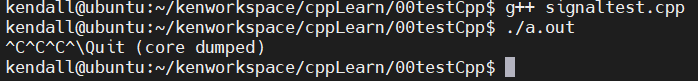

## 1.项目背景
大数据学院与资源与环境学院合作，实现一个可以根据实际用户访问量，自动扩展负载分发能力的高性能系统，用于展示资环学院的农产品研究成果。因为我们学校打算每年都会做一个农产品成果展示，和国内其他农业大学以及所有与农业相关单位展示成果，这时候就会面临大量用户同时访问的问题，本系统可以根据实际的用户访问量，自动扩展负载分发能力，支持跨可用区的双活容灾，实现无缝实时切换。

## 2.系统架构

为了增强灵活性，一个服务可以被抽象为命令字：`modid` + `cmdid` 的组合，成为一个**模块**，而这个服务往往有多个服务节点，其所有服务节点的地址集合被称为这个模块下的**路由**，节点地址简称为节点。

- `modid`：标识业务的大类，如：“直播列表相关”

- `cmdid`：标识具体服务内容，如：“批量获取直播列表”

业务代码利用`modid`,`cmdid`，就可以调用对应的远程服务系统,负载均衡调度系统包含一个`DNSService`，一个`Report Service`，以及部署于每个服务器的`LoadBalance Agent`，业务代码通过API与ELB系统进行交互。

**API** ：根据自身需要的`modid,cmdid`，向ELB系统获取节点、汇报节点调用结果；提供`C++`、`Java`、`Python`接口

**LoadBalance Agent**：运行于每个服务器上，负责为此服务器上的业务提供节点获取、节点状态汇报、路由管理、负载调度等核心功能

**DNSService** ： 运行于一台服务器上（也可以用LVS部署多实例防单点），负责`modid,cmdid`到节点路由的转换

**Report Service** ： 运行于DNSService同机服务器上，负责收集各`modid,cmdid`下各节点调用状况，可用于观察、报警

`modid,cmdid`数据由`Mysql`管理，具体 SQL 脚本在`common/sql`路径下
至于`modid,cmdid`的注册、删除可以利用Web端操作MySQL。


如图，每个服务器（虚线）部署了一台`LoadBalance Agent`，以及多个业务服务

- 1. 开发者在Web端注册、删除、修改`modid,cmdid`的路由信息，信息被写入到MySQL数据库；
- 2. 服务器上每个业务biz都把持着自己需要通信的远程服务标识`modid+cmdid`，每个biz都向本机LoadBalance Agent获取远程节点，进而可以和远程目标服务通信，此外业务模块会汇报本次的节点调用结果给LoadBalance Agent；
- 3. LoadBalance Agent负责路由管理、负载均衡等核心任务，并周期性向DNSService获取最新的路由信息，周期性把各`modid,cmdid`的各节点一段时间内的调用结果传给Report Service
- 4. DNSService监控MySQL，周期性将最新路由信息加载出来；
- 5. Report Service将各`modid,cmdid`的各节点一段时间内的调用结果写回到MySQL，方便Web端查看、报警。

## 3.reactor基础服务的实现

### 4.基于TCP创建socket


- (1)使用`socket`函数创建套接字

```c
#include <sys/types.h> /* See NOTES */
#include <sys/socket.h>
int socket(int domain, int type, int protocol);
```

- domain：哪个底层协议族？
  * `AF_INET` 这是大多数用来产生`socket`的协议，使用`TCP`或`UDP`来传输，用`IPv4`的地址
  * `AF_INET6 `与上面类似，不过是来用`IPv6`的地址
  * `AF_UNIX `本地协议，使用在`Unix`和`Linux`系统上，一般都是当客户端和服务器在同一台及其上的时候使用

- type：哪个服务？
  * `SOCK_STREAM`:（数据流，TCP）)这个协议是按照顺序的、可靠的、数据完整的基于字节流的连接。这是一个使用最多的`socket`类型，这个`socket`是使用 TCP 来进行传输。
	* `SOCK_DGRAM` :（数据报，UDP）这个协议是无连接的、固定长度的传输调用。该协议是不可靠的，使用UDP来进行它的连接。
	* `SOCK_SEQPACKET`:该协议是双线路的、可靠的连接，发送固定长度的数据包进行传输。必须把这个包完整的接受才能进行读取。
	* `SOCK_RAW`: `socket`类型提供单一的网络访问，这个`socket`类型使用ICMP公共协议。（ping、traceroute使用该协议）
	* `SOCK_RDM` 这个类型是很少使用的，在大部分的操作系统上没有实现，它是提供给数据链路层使用，不保证数据包的顺序

- `protocol`：默认为`0`，因为前两个参数已经足够确定。
- 成功：返回指向新创建的`socket`的文件描述符，失败：返回-1，设置`errno`

```c
//1 创建套接字
// int socket(int domain, int type, int protocol);
_sockfd = socket(AF_INET,SOCK_STREAM | SOCK_CLOEXEC , 0); // 0 == > IPPROTO_TCP
if(_sockfd == -1){
	fprintf(stderr,"tcp::server: socker()\n");
	exit(1);
}
```

- (2)初始化服务器地址

```c
//2 初始化服务器的地址
struct sockaddr_in server_addr;  //sockaddr_in 描述Internet套接字地址的结构
bzero(&server_addr,sizeof(server_addr)); //	清空
//设置协议
server_addr.sin_family = AF_INET;
//将Internet主机地址cp从IPv4数字点表示法转换成二进制形式(以网络字节顺序)，并将其存储在inp所指向的结构中。
// int inet_aton(const char *cp, struct in_addr *inp);
inet_aton(ip,&server_addr.sin_addr);
server_addr.sin_port = htons(port); //将端口转成大端  设置端口

//2.5 设置可以重复监听
int op = 1;
// getsockopt()和setsockopt()操作由文件描述符sockfd引用的套接字的选项。
//选项可能存在于多个协议级别;它们总是出现在最上层的socket层。
/*
 int setsockopt(int sockfd, int level, int optname, const void *optval, socklen_t optlen);
*/
if(setsockopt(_sockfd,SOL_SOCKET,SO_REUSEADDR,&op,sizeof(op)) < 0){
	fprintf(stderr, "set socketopt reuse error\n");
}
```

- (3)绑定端口

```c
#include <sys/types.h> /* See NOTES */
#include <sys/socket.h>
int bind(int sockfd, const struct sockaddr *addr, socklen_t addrlen);
```

- `sockfd`：
	* `socket`文件描述符
- `addr`:
	* 构造出IP地址加端口号
- `addrlen`:
	* `sizeof(addr)`长度
- 返回值：
	* 成功返回`0`，失败返回`-1`, 设置`errno`

服务器程序所监听的网络地址和端口号通常是固定不变的，客户端程序得知服务器程序的地址和端口号后就可以向服务器发起连接，因此服务器需要调用`bind`绑定一个固定的网络地址和端口号。

`bind()`的作用是将参数`sockfd`和`addr`绑定在一起，使`sockfd`这个用于网络通讯的文件描述符监听`addr`所描述的地址和端口号

```c
int ret = bind(_sockfd,(const struct sockaddr *)&server_addr,sizeof(server_addr)); //服务端需要绑定一个ip
if(ret < 0)
{
	fprintf(stderr, "bind error\n");
	exit(1);
}
```

- (5)监听

```c
#include <sys/types.h> /* See NOTES */
#include <sys/socket.h>
int listen(int sockfd, int backlog);
```

```
sockfd:
	socket文件描述符
backlog:
	排队建立3次握手队列和刚刚建立3次握手队列的链接数和
```

可以通过命令查看默认的`backlog`:

```bash
$ cat /proc/sys/net/ipv4/tcp_max_syn_backlog
128
```
典型的服务器程序可以同时服务于多个客户端，当有客户端发起连接时，服务器调用的`accept()`返回并接受这个连接，如果有大量的客户端发起连接而服务器来不及处理，尚未`accept`的客户端就处于连接等待状态，`listen()`声明`sockfd`处于监听状态，并且最多允许有`backlog`个客户端处于连接待状态，如果接收到更多的连接请求就忽略。`listen()`成功返回0，失败返回-1。

```c
// 4 监听
ret = listen(_sockfd,500);
if(ret == -1){
	fprintf(stderr," listen error\n");
	exit(1);
}
```

- (6)提取与读写

```c
#include <sys/types.h> 		/* See NOTES */
#include <sys/socket.h>
int accept(int sockfd, struct sockaddr *addr, socklen_t *addrlen);
```

```
sockdf:
	socket文件描述符
addr:
	传出参数，返回链接客户端地址信息，含IP地址和端口号
addrlen:
	传入传出参数（值-结果）,传入sizeof(addr)大小，函数返回时返回真正接收到地址结构体的大小
返回值：
	成功返回一个新的socket文件描述符，用于和客户端通信，失败返回-1，设置errno
```

三方握手完成后，服务器调用`accept()`接受连接，如果服务器调用`accept()`时还没有客户端的连接请求，就阻塞等待直到有客户端连接上来。`addr`是一个传出参数，`accept()`返回时传出客户端的**地址**和**端口号**。`addrlen`参数是一个传入传出参数`（value-result argument）`，传入的是调用者提供的缓冲区`addr`的长度以避免缓冲区溢出问题，传出的是客户端地址结构体的实际长度（有可能没有占满调用者提供的缓冲区）。如果给`addr`参数传`NULL`，表示不关心客户端的地址。

```c
//开始提供创建链接的服务
void tcp_server::do_accept()
{
	int connfd;
	while (true)
	{
		//提取
		//  int accept(int sockfd, struct sockaddr *addr, socklen_t *addrlen);
		connfd = accept(_sockfd,(struct sockaddr *)&_connaddr,&_addrlen);
		if(connfd == -1){ //错误
			if(errno == EINTR){
				//中断错误
				fprintf(stderr,"accept arrno == EINTR\n");
				continue;
			}
			else if(errno == EAGAIN){
				fprintf(stderr,"accept errno = EAGAIN\n");
				break;
			}
			else if(errno == EMFILE){  //报错退出
				// 建立连接过多，资源不够
				fprintf(stderr,"accept errno");
				exit(1);
			}
		}
		else{ //成功
			//TODO 添加一些心跳机制

			//TODO 添加消息队列机制
			//2 写一个回显业务
			int writed;
			const char* data = "hello Lars\n";
			do{
				writed = write(connfd, data, strlen(data)+1);
			}while(writed == -1 && errno == EINTR);  //表示非堵塞失败
			
			if(writed > 0){
				printf("write succ\n");
			}
		}
	}
```

- (7)忽略信号


> 为了避免一些喜好会终止进程，比如SIGHUP, SIGPIPE，因此在连接套接字之前需要忽略这些信号

**关于 signal() 函数的说明**：

```c
 #include <signal.h>
typedef void (*sighandler_t)(int);
sighandler_t signal(int signum, sighandler_t handler);
```

- `signum`：指明了所要处理的信号类型，它可以取除了`SIGKILL`和`SIGSTOP`外的任何一种信号。 

- `signal()`将信号符号的配置设置为`handler`, `handler`可以是`SIG_IGN`、`SIG_DFL`，也可以是程序员定义的函数(“信号处理器”)的地址。

<1> `SIG_IGN` 这个符号表示忽略该信号。 

	比如：

```c

#include <stdio.h>
#include <signal.h>
int main(int argc, char *argv[]) {
    signal(SIGINT, SIG_IGN);
    while(1);
    return 0;
}
```



> `SIGINT`信号代表由`InterruptKey`产生，通常是`CTRL +C` 或者是`DELETE` 。执行上述代码时，按下`CTRL + C`程序没有反应。这就对了，如果我们想结束该程序可以按下`CTRL +\`来结束，当我们按下`CTRL +\`组合键时，产生了`SIGQUIT`信号，此信号并没有被忽略。

<2> `SIG_DFL`: 这个符号表示恢复对信号的系统默认处理。不写此处理函数默认也是执行系统默认操作。 
　
比如：

```c
#include <stdio.h>
#include <signal.h>
int main(int argc, char *argv[]) {
    signal(SIGINT, SIG_DFL);
    while(1);
    return 0;
}
```

这时就可以按下`CTRL +C` 来终止该进程了。把`signal(SIGINT, SIG_DFL);`这句去掉，效果是一样的.

```c
//0 忽略信号，有些信号会终止进程  SIGHUP, SIGPIPE	
if(signal(SIGHUP,SIG_IGN) == SIG_ERR) {
	fprintf(stderr,"signal ignore SIGHUB\n");
}
if(signal(SIGPIPE,SIG_IGN) == SIG_ERR) {
	fprintf(stderr,"signal ignore SIGPIPE\n");
}
```

[网络编程三个重要的信号详解](https://blog.csdn.net/z_ryan/article/details/80952498)

