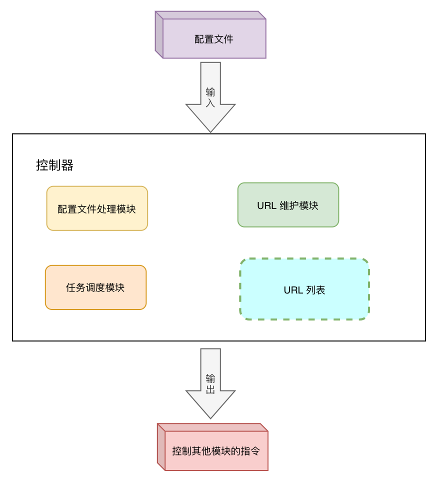
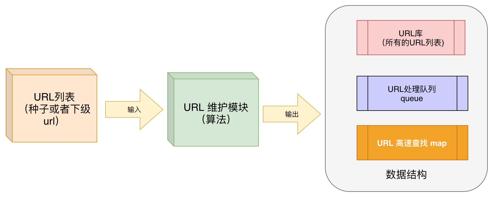

## 实习介绍

在`2019`年的时候在广州一家公司实习了半年，公司的主营业务店铺选址信息服务。为雇主更好的将自己的店铺出租出去，同时也为商家通过个性化的选址服务。我在实习期间主要负责一个爬虫系统的设计与开发。

大致流程就是：
- 从互联网中得到爬取种子，也就是`URL`
- 根据种子下载资源
- 提取页面，从页面提取更多的`url`
- 并对页面做持久化操作
- 根据提取的`url`再进行下载操作

在整个实习期间参与了这个爬虫项目整个流程的开发，从中学到了许多`Linux`系统开发技能。比如`Linux`多路复用技术，`socket`编程，多线程，守护进程和`Linux`动态库等。

并且在项目导师的指导下按时完成了实习任务。

## 项目介绍

这个项目由我和部门另一位同事也就是实习导师共同完成，本项目分成四个模块，分别是**主控模块**，**下载器模块**，**解析器模块（URL提取模块）**和**持久化模块**。


通过下载器下载页面，下载页面之后交给解析器，解析器从这个页面中把这些`URL`全都提取出来，然后通过持久化模块保存到文件系统。控制器是对这些模块进行管理控制。

### 控制器

整个系统的核心部分就是控制器模块

控制器就是输入配置文件，输出控制指令，也就是控制其他模块的指令。控制器分成三部分组成

- **配置文件处理模块**
- **`URL` 维护模块**
- **任务调度模块**


### 下载器

下载器主要是输入抓取的`url`,输出取得的页面。

分为`HTTP`协议处理模块和`socket`功能框架两部分

### 解析器（URL提取模块）

解析器就是负责把页面的 `url` 解析出来，这部分只有一个`HTML`解析模块

### 持久化器

就是把数据持久化保存到文件系统上


## 主控模块的工作流程

其中控制器就是输入配置文件，输出控制指令，也就是控制其他模块的指令。控制器分成三部分组成
- **配置文件处理模块**，从配置文件中读取配置项，提供配置项的提取接口
- **`URL` 维护模块**，负责维护`URL`库，提供如下功能：
  - 输入新的`url`
  - 输出一个未被抓取的`url`
  - 负责维护`url`的抓取转态
- **任务调度模块**，
  - 负责协调控制器的流程
  - 负责调用其他系统模块完成工作




**技术代码流程**：

1. 按行读取`fgets`

2. 分割字符串

3. 消除注释,遇到”#“就去掉

4. 消除空格

### `URL` 维护模块具体实现流程

实际上是内存的小数据库，维护一个队列

**处理流程**：

一开始有一个`url`种子，然后控制器读取出来，

读取之后到控制器模块内部，

从配置文件里得到种子，先给`URL`维护模块，放到`URL`列表中去，第二步再把`URL`传给下载模块，当下载模块把这个页面抓取之后，会返回给控制器模块一个状态，这个状态会写到`URL`列表中对应的数据。然后记录当前资源是否下载成功，可以和修改状态合并为当前`URL。

处理状态`state：0`代表为抓取，`1`代表抓取成功，`-1`代表抓取失败。

> 然后我们还对`URL`处理队列这个数据结构做了优化设计,因为需要一个`URL`库保存所有的`URL`，不管是否被抓取，

### `URL`处理队列数据结构内部设计

设计一个`URL`队列，保存指向`URL`列表中具体`URL`的指针，当一个新的`URL`来的时候，先放到`URL`库中，然后用一个指针指向这个位置并把指针保存到`URL`处理队列，当我们想要抓取`URL`的时候从`URL`处理队列的队首拿出一个来，然后我们对这个指针进行操作即可，处理完之后就让其出队。



为了确定当前`URL`在`url`库里面是不是存在了，这时候我们还需要设置一个`url`哈希值转换，为了提高查找的效率，所以在`URL`处理的数据结构中添加了一个`map`


### 说一下任务调度模块

> 任务调度模块也就是程序的入口    
> 提供一个运行框架，支持多任务管理执行    
> 可以控制程序是按照普通模式运行还是按照守护进程模式运行

这个主程序狂框架的流程是：
- 程序运行时先处理命令行参数，根据参数跳转到相应的分支或者调用对应的函数
- 检测是否按照守护进程模式运行（控制项从命令行参数中得到）
- 初始化环境，
  - 读取配置文件，提取配置文件中的参数
  - 根据守护进程的标记将当前进程转变为守护进程
  - 然后载入程序模块的动态库
- 开始程序的主处理流程
  - a.检测种子是否存在，把种子交给`URL`管理器
  - b.分析种子，通过`DNS`解析得到种子`url`的`IP`地址
  - c.根据种子`URL`种子得到第一个页面
  - d.对页面进行处理
  - e.从`URL`管理器中提取一个`url`
  - f.启动一个处理服务（这里需要先检测是否达到最大任务数量，这个功能封装到一个独立的函数中）
  - g.监控任务处理数量，如果任务维护池中有空闲任务，那么重复 `e` 操作
  - 最后回收资源，准备结束程序或者当前任务

### 怎么提取`URL`的

> 见上面，分析`URL`种子,通过`DNS`解析得到种子`url`的`IP`地址，然后可以得到一个页面。


## 项目中怎么使用`epoll`和多线程

比如，我们解析页面的过程：
- 连接远程服务器
- 从远程服务器中得到数据
- 处理得到的数据，比如说数据包
- 然后对数据进行业务处理
- 向远程服务器发送反馈
- 最后关闭套接字

使用`Epoll`只能关于与`IO`相关的操作，每一个操作都必须注册给`Epoll`还需要。

这里的第三步和第四步：处理得到的数据 和 对数据进行业务处理，不是与`IO`相关的。所以需要线程来管理（使用`thread`这个库）

> [使用C++ 标准库 thread类 实现多线程并行处理
](https://blog.csdn.net/weixin_44010117/article/details/107522672)

### 介绍`Epoll`

#### 为什么使用`epoll`而不是`select`

相比于`select`，`epoll`最大的好处就是它不会随着监听的`fd`数目的增长而降低效率。因为在内核的`select`实现中，它是采用轮询来处理的，轮询的`fd`数目越多，自然耗时就越大，并且，在`linux/posix_types.h`头文件中声明了
```
#define __FD_SETSIZE  1024
```
表示`select`最多同时监听`1024`个`fd`，当然，可以通过修改头文件再重新编译内核来扩大这个数目，但是这样似乎并不能彻底解决问题。

### 常见模型的特点

`linux`下设计并发网络程序，一般有典型的`Apache`模型（`PPC`），`select`模型和`poll`模型,还有`epoll`模型。

- **select 模型**

最大并发数限制，因为一个进程打开的`FD`（文件描述符）是有限的，由`__FD_SETSIZE`设置，默认值是`1024/2048`，因此`select`模型的最大并发数被相应限制了。

如果视图去更改这个默认值，会带来效率问题，`select`每次调用都会线性扫描全部的`FD`集合,这样效率就会呈线性下降。

还会出现 内核/用户空间 拷贝问题

- **poll 模型**

基本上效率和 `select` 是相同的。

### Epoll 的提升

- `Epoll` 没有最大并发连接的限制，上限最大可以打开文件的数目远远大于 `2048`,一般来说这个数目和系统内存关系很大，具体数目可以用`cat /proc/sys/fd/file-max`命令查看。

- `Epoll` 在效率方面有了很大的提升,`Epoll`最大的优点就在于它只管`活跃`的连接，而跟连接总数无关，因此在实际的网络环境中，`Epoll`的效率远远高于`select`和`poll`。

- 此外，`Epoll`上使用了**共享内存**，这个内存拷贝也省略了。

### Epoll 调用过程

系统调用描述
- 第一步：`epoll_create()`系统调用。此调用返回一个句柄，之后所有的使用都依靠这个句柄来标识。
- 第二步：`epoll_ctl()`系统调用。通过此调用向epoll对象中添加、删除、修改感兴趣的事件，返回0标识成功，返回-1表示失败。
- 第三部：`epoll_wait()`系统调用。通过此调用收集收集在epoll监控中已经发生的事件。

### 实现机制( epoll 怎么实现的)

> `Linux epoll`机制是通过红黑树和双向链表实现的。 首先通过epoll_create()系统调用在内核中创建一个`eventpoll`类型的句柄，其中包括红黑树根节点和双向链表头节点。然后通过`epoll_ctl()`系统调用，向`epoll`对象的红黑树结构中添加、删除、修改感兴趣的事件，返回0标识成功，返回`-1`表示失败。最后通过`epoll_wait()`系统调用判断双向链表是否为空，如果为空则阻塞。当文件描述符状态改变，`fd`上的回调函数被调用，该函数将`fd`加入到双向链表中，此时`epoll_wait`函数被唤醒，返回就绪好的事件。

当某一进程调用`epoll_create`方法时，`Linux`内核会创建一个`eventpoll`结构体，这个结构体中有两个成员与`epoll`的使用方式密切相关。`eventpoll`结构体如下所示：
```c
    struct eventpoll{
        /*红黑树的根节点，这颗树中存储着所有添加到epoll中的需要监控的事件*/
        struct rb_root  rbr;
        /*双链表中则存放着将要通过epoll_wait返回给用户的满足条件的事件*/
        struct list_head rdlist;
        ....
    };
```
每一个`epoll`对象都有一个独立的`eventpoll`结构体，用于存放通过`epoll_ctl`方法向`epoll`对象中添加进来的事件。这些事件都会挂载在红黑树中，如此，重复添加的事件就可以通过红黑树而高效的识别出来(红黑树的插入时间效率是`O(lgn)`，其中`n`为树的高度)。

而所有添加到`epoll`中的事件都会与设备(网卡)驱动程序建立回调关系，也就是说，当相应的事件发生时会调用这个回调方法。这个回调方法在内核中叫`ep_poll_callback`,它会将发生的事件添加到`rdlist`双链表中。

在`epoll`中，对于每一个事件，都会建立一个`epitem`结构体，如下所示：
```c
    struct epitem{
        struct rb_node rbn; //红黑树节点
        struct list_head rdllink;  //双向链表节点
        struct epoll_filefd ffd;  //事件句柄信息
        struct eventpoll *ep;    //指向其所属的eventpoll对象
        struct epoll_event event; //期待发生的事件类型
    }
```
当调用`epoll_wait`检查是否有事件发生时，只需要检查`eventpoll`对象中的`rdlist`双链表中是否有`epitem`元素即可。

如果`rdlist`不为空，则把发生的事件复制到用户态，同时将事件数量返回给用户。

### Epoll 事件有两种类型
- 边缘触发(edge trigger，ET)：只有有数据来，才触发，不管缓冲区中是否还有数据。
- 水平触发（level trigger，LT)：只要有数据都会触发

#### 详细解释`ET`和`LT`

- **LT 是缺省的工作方式**：并且同时支持`block`和`no-block` `socket`,在这种做法中，内核会告诉你一个文件秒速符是否就绪了，然后你可以对这个就绪的`fd`进行`IO`操作。如果你不作任何操作，内核还是会继续通知你的，所以，这种模式编程出错可能性要小一点。传统的`select/epoll`都是这种模型的代表
- **ET 高速工作方式**：只支持`no-block` `socket`，在这种模式下，当描述符从未就绪变为就绪时，内核通过`epoll`告诉你。然后它会假设你知道文件描述符已经准备就绪，并且不会再为那个文件描述符发送更多的就绪通知，直到你做了某些操作导致那个文件描述符不再是就绪状态了（比如：你在发送，接受或者接受请求，或者发送接收的数据少于一定量时导致了一个`EWOULDBLOCK`错误），但是得注意，如果一直不对 `fd` 进行 `IO` 操作(从而导致它再次变为未就绪)，内核不会发送更多的通知。


## 下载模块

分成两部分

- `socket`功能框架

- `http`协议处理模块

功能：想远端服务器发起请求，把页面抓取下来

### 怎么处理`http`

对`HTTP`头进行分析，用字符串解析出来，按行读取，找头的属性值，找到`http`头的每个属性，然后从后边把这个值提取出来，用到了哪个值，用到了文件的类型（`Accept：text/html`)，状态码，判断页面是否下载成功。其他的说忘了。

### 关于页面解析

就是一行正则表达式做匹配，（网上查的）

## 持久化模块

处理流程

- 得到页面的数据流或在内存缓冲区中的数据
- 得到当前页面的`URL`描述结构体
- 生成保存目录（也就是目录已存在和未存在的处理情况）
- 把文件按照指定写入磁盘系统
- 向主处理流程发送一个反馈，表示当前页面处理进度

## `linux`动态库做什么

实现了一种简单的插件模式，因为我想以后想支持更多的文件，每一种文件格式都有一种处理方式，为了更快扩展，用了这个插件，程序里面自动做了自动匹配，遇到哪种文件，我就自动去调用哪个模块。

一个功能一个模块，方便扩展，

#### 怎么去实现的呢？

用一个结构体来描述，而且结构体有函数指针

#### 那这些模块怎么去管理

有一个模块管理器，维护这些模块的结构体。主要指导这个模块的编号就能找到这个模块。


