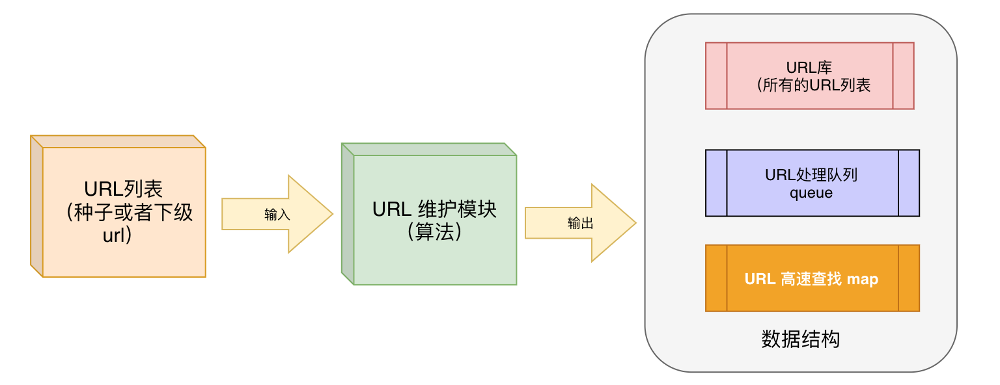

## 项目介绍

**项目模块介绍**


**调度器**

调度器负责管理待抓取的`URL`，以及去重的工作。调度器使用内存队列来管理`URL`，并进行去重。

**下载器**

下载器是爬虫的基础。下载页面之后才能进行其他后续操作。

**页面处理器**

一般来说，我们最终需要的都不是原始的`HTML`页面。我们需要对爬到的页面进行分析，转化成结构化的数据，并存储下来

**持久化器**

持久化器负责抽取结果的处理，包括计算、持久化到文件。


> https://blog.csdn.net/itcastcpp/category_2516205.html


### 项目各个子模块介绍

因为我们公司是一家初创公司，所以需要通过爬虫去 Internet 上找大量与店铺选址相关的有价值的数据，然后再进行清洗和整理。我参与的工作主要是爬虫的系统设计部分。

**爬虫系统大致的工作流程：根据URL将对应的网页下载下来，然后提取出网页中包含的URL，再根据这些新的URL下载对应的网页，周而复始**。形成一个环形。

爬虫系统的子模块都位于这个环路中，并完成某项特定的功能。

这些子模块包括：

`Fetcher`下载器：用于根据`url`下载对应的网页；

`DNS Resolver`DNS解析器：DNS的解析；

`Content Seen`：网页内容的去重；

`Extractor` URL提取模块：提取网页中的`url`或者其它的一些内容；

`URL Filter`URL过滤模块：过滤掉不需要下载的`url`；

`URL Seen`：`url`的去重；

`URL Set` URL存储：存储所有的`url`；

`URL Frontier` URL调度器：决定接下来哪些下载哪些`url`对应的网页；

### Fetcher和DNS Resolver

这两个模块是两个非常简单的独立的服务：`DNS Resolver`负责域名的解析；`Fetcher`的输入是域名解析后的`url`，返回的则是该`url`对应的网页内容。对于任何一次网页的抓取，它都需要调用这两个模块。

一开始我们的设计是将这两个模块合并到一起，但是后来成了整个系统的性能的瓶颈，因为爬虫系统是一个对性能要求很高的系统。主要原因是无论是域名解析还是抓取，都是很耗时的工作。比如抓取网页，一般的延迟都在几百毫秒级别，如果遇上慢的网站，可能要几秒甚至十几秒，这导致工作线程会长时间的处于阻塞等待的状态。如果希望`Fetcher`能够达到每秒几千个网页甚至更高的下载，就需要启动大量的工作线程。

因此，后面考虑到爬虫系统的性能，我们采用`epoll`技术将两个模块改成异步机制。另外，爬虫程序还啊要对`DNS`请求做一些优化。

> 对于`DNS`的解析结果也会缓存下来，大大降低了`DNS`解析的操作。==> 项目中如何使用 `DNS`

### Content Seen

Internet 上的一些站点常常存在着镜像网站（mirror），即两个网站的内容一样但网页对应的域名不同。这样会导致对同一份网页爬虫重复抓取多次。为了避免这种情况，对于每一份抓取到的网页，它首先需要进入`Content Seen`模块。该模块会判断网页的内容是否和已下载过的某个网页的内容一致，如果一致，则该网页不会再被送去进行下一步的处理。这样的做法能够显著的降低爬虫需要下载的网页数。

至于如果判断两个网页的内容是否一致，一般的思路是这样的：并不会去直接比较两个网页的内容，而是将网页的内容经过计算生成`FingerPrint`（信息指纹），`FingerPrint`是一个固定长度的字符串，要比网页的正文短很多。如果两个网页的`FingerPrint`一样，则认为它们内容完全相同。

### Extractor和Url Filter

`Extractor`的工作是从下载的网页中将它包含的所有`url`提取出来。这是个细致的工作，你需要考虑到所有可能的`url`的样式，比如网页中常常会包含相对路径的`url`，提取的时候需要将它转换成绝对路径。

`Url Filter`则是对提取出来的`url`再进行一次筛选。不同的应用筛选的标准是不一样的，比如对于`baidu/google`的搜索，一般不进行筛选，但是对于垂直搜索或者定向抓取的应用，那么它可能只需要满足某个条件的`url`，比如不需要图片的`url`，比如只需要某个特定网站的`url`等等。`Url Filter`是一个和应用密切相关的模块。

### Url Seen

`Url Seen`用来做`url`去重。关于`url`去重之后会介绍，这里就不再详谈了。

对于一个大的爬虫系统，它可能已经有百亿或者千亿的`url`，新来一个`url`如何能快速的判断`url`是否已经出现过非常关键。因为大的爬虫系统可能一秒钟就会下载几千个网页，一个网页一般能够抽取出几十个`url`，而每个`url`都需要执行去重操作，可想每秒需要执行大量的去重操作。因此`Url Seen`是整个爬虫系统中非常有技术含量的一个部分。（`Content Seen`其实也存在这个问题）

### Url Set

当`url`经过前面的一系列处理后就会被放入到`Url Set`中等待被调度抓取。因为`url`的数量很大，所以只有一小部分可能被放在内存中，而大部分则会写入到硬盘。`Url Set`的实现就是一些文件存储。

### URL Frontier

`URL Frontier`之所以放在最后，是因为它可以说是整个爬虫系统的引擎和驱动，组织和调用其它的模块。

当爬虫启动的时候，`Froniter`内部会有一些种子`url`，它先将种子`url`送入`Fetcher`进行抓取，然后将抓取下来的网页送入`Extractor`提取新的`url`，再将新的`url`通过`url seen`去重后放入到`Url Set`中；而当`Froniter`内部的`url`都已经抓取完毕后，它又从`Url Set`中提取那些新的没有被抓取过的`url`，周而复始。


`Frontier`的调度实现有很多种，这里只介绍最常见的一种实现方法,也是我们采用的方法。

在此之前，需要先解释一点，尽管在介绍`Fetcher`的时候我们说，好的`Fetcher`每秒能够下载百千个网页，但是对于某个特定的目标网站，比如`www.lepu.com`，爬虫系统对它的抓取是非常慢速的，十几秒才会抓取一次，为了保证目标网站不至于被爬虫给抓垮。
`Frontier`内部对于每个域名有一个对应的`FIFO`队列，这个队列保存了该域名下的`url`。`Frontier`每次都会从某个队列中拿出一个`url`进行抓取。队列会保存上一次被`Frontier`调用的时间，如果该时间距离现在已经超过了一定值，那么该队列才可以再次被调用。

`Frontier`内部同时可能拥有成千上万个这样的队列，它会轮询的获取一个可以被调用的队列，然后从该队列中`pull`一个`url`进行抓取。而一旦所有队列中的`url`被消耗到一定程度，`Frontier`又会从`Url Set`中提取一批新的`url`放入对应的队列。

### 分布式

当单机版的爬虫性能不能满足要求的时候，就应该考虑用多台机器组成分布式的爬虫系统。分布式的爬虫架构其实要比想象的简单得多，一个朴素的做法是：假设有`N`台机器，每台机器上有运行了一个完整的爬虫系统，每台机器的爬虫在从`Extractor`模块获得新的`url`之后，根据`url`的域名进行`hash`然后取模N得到结果`n`，然后该`url`会被放入第`n`台机器的`Url Set`中。这样，不同网站的`url`会被放在不同的机器上处理。

*当时我们设计之处的目标是把爬虫程序放到路由器这样的设备上也可以正常、稳定的运行，因为不需要在设备上存放没用的信息，所有的有用页面通过`socket`通信被存放到指定的服务器中。但当我离开公司的时候，这个方案已经没有人再提到了，因为我们发现这样的做法，我们没有硬件支持，而且影响了路由器的运行速度。*


https://www.pianshen.com/article/8423557212/


## 一些问题

### 项目中哪里使用到守护进程

**在任务调度模块**

任务调度模块也就是程序的入口

提供一个运行框架，支持多任务管理执行

可以控制程序是按照普通模式运行还是按照守护进程模式运行

这个框架的流程是：

- 程序运行时先处理命令行参数，根据参数跳转到相应的分支或者调用对应的函数
- 检测是否按照守护进程模式运行（控制项从命令行参数中得到）
- 然后初始化环境，
  - 读取配置文件，提取配置文件中的参数
  - 根据守护进程的标记将当前进程转变为守护进程
  - 然后载入程序模块的动态库
- 然后开始程序的主处理流程，处理`URL`那些

> 我们用一个函数来封装守护进程相关代码，同时使用命令行参数控制我们的爬虫是否以守护进程的方式运行。

> https://yincheng.blog.csdn.net/article/details/38964179

### 项目中如何使用 DNS

当爬虫程序从`HTML`页面上提取`URL`时，一般情况下，应该有很多都是这个站点内部的`URL`。那么当这个站点里的某个`URL`请求过`DNS`以后，就应该采用某种数据结构把这个值保存起来。以后再发现这个站点内的`URL`后，就把域名部分的`IP`取出给这个`URL`，从而减少不必要的`DNS`请求。这样可以大大加快抓取页面的速度，提高效率。

**优化`DNS`请求的方式**

对于同一个站点内部的页面应该设一个数据结构以保存，并且方便查找。这样，当爬虫系统得到了一个新的`URL`以后，可以快速的转换地址格式并进行连接。

> https://yincheng.blog.csdn.net/article/details/38964369

可能会让[介绍DNS是什么](寻offer总结/计算机网络/计算机网络01?id=dns-是什么)

### 爬虫系统是怎么处理 `URL` 的

在这里，爬虫系统要处理的`URL`是指使用超文本传输协议`HTTP`的`URL`，其端口号默认是`80`。第三部分是`Web`服务器上资源的具体地址，即相对路径。一般来说，在`Web`页面上提取出来的`URL`，如果是这个站点内部的，那么很多都是相对地址，而且可能要进行`URL`编码，所以要采用过滤技术，把这些不规范的`URL`进行解码，规范化。

**进行URL的调度**：

爬虫程序在分析页面时，会提取出来各种`URL`，比如，这个站点内的，或这个站点外的，甚至失效的`URL`。那么，对于这些不同的`URL`，它们的优先级应该是各不相同的，哪一个的`DNS`请求已经获得到并可以立即进行连接？哪一个是失效的、错误的，应该立即丢弃掉？或者哪一个是从高优先级空间中得到的，应该无条件的，以高优先的状态进行连接，都是需要进行合理，稳妥，高效的调度。

**解决方案**：

首先，我们这里所有的`URL`都应该是优先级清晰的。否则，所有`URL`调度将因为没有级别权重、优先顺序而变的混乱不堪。其次，应该设置合适的存储空间，不能把所有的`URL`都堆积到一块，那样既谈不到优先级清晰，更不要说快速提取。那么，解决方案如下：

- 采用URL的多级存储架构。 
- 给每一级结构都分配不同的调度优先级。
- 各个级别的结构之间进行合适的数据通信。

> https://yincheng.blog.csdn.net/article/details/38964439

> 爬虫系统要处理的URL是HTTP协议的url，其端口号是80，第三部分就是资源在服务器上的地址，也就是相对路径。一般来说，从也买能上提取出来的url如果是站点内部的url，那么很多都是相对地址，所以我们需要使用一些过滤技术对这些url进行编码，规范化。     
> 而且还需要对这些url进行调度处理，因为从页面中提出来的url是各种各样的，有站点内部的，站点外部的，有效的，无效的。所以我们要对这些url进行优先级设计，给他们设置级别权重。就比如哪些是DNS已经获得到可以直接建立链接的，那些事无效或者错误需要丢弃的。另外，我们还设置合适的存储空间，就是避免把所有的url堆积到一块。我们采用的方法是：
> - 采用URL的多级存储结构。 
> - 并且给每一级结构都分配不同的调度优先级。
> - *各个级别的结构之间进行合适的数据通信*。

#### 介绍 URL 格式

构造一个完整URL例子：

`http://www.aspxfans.com:8080/news/index.asp?boardID=5&ID=24618&page=1#r_70732423`

一个完整的URL包括：**协议部分、域名部分、端口部分、虚拟目录部分、文件名部分、参数部分、锚部分**

1.**协议部分**：该`URL`的协议部分为“`http：`”，这代表网页使用的是`HTTP`协议。在`Internet`中可以使用多种协议，如`HTTP`，`FTP`等等本例中使用的是`HTTP`协议。在”`HTTP`”后面的“`//`”为分隔符

2.**域名部分**：该`URL`的域名部分为“`www.aspxfans.com`”。一个URL中，也可以使用IP地址作为域名使用

3.**端口部分**：跟在域名后面的是端口，域名和端口之间使用“:”作为分隔符。端口不是一个`URL`必须的部分，如果省略端口部分，将采用默认端口

4.**虚拟目录部分**：从域名后的第一个“`/`”开始到最后一个“`/`”为止，是虚拟目录部分。虚拟目录也不是一个URL必须的部分。本例中的虚拟目录是“`/news/`”

5.**文件名部分**：从域名后的最后一个“`/`”开始到“`？`”为止，是文件名部分，如果没有“`?`”,则是从域名后的最后一个“`/`”开始到“`#`”为止，是文件部分，如果没有“`？`”和“`#`”，那么从域名后的最后一个“/”开始到结束，都是文件名部分。本例中的文件名是“`index.asp`”。文件名部分也不是一个URL必须的部分，如果省略该部分，则使用默认的文件名

7.**参数部分**：从“？”开始到“#”为止之间的部分为参数部分，又称搜索部分、查询部分。本例中的参数部分为“`boardID=5&ID=24618&page=1`”。参数可以允许有多个参数，参数与参数之间用“&”作为分隔符。

6.**锚部分**：`HTTP`请求不包括锚部分，从“#”开始到最后，都是锚部分。本例中的锚部分是“`r_70732423`“。锚部分也不是一个URL必须的部分。

锚点作用：打开用户页面时滚动到该锚点位置。如：一个html页面中有一段代码，该`url`的h`ash`为`r_70732423`

```html
<div name='r_70732423'>...</div>
```
打开上面`url`，用户页面时滚动到`name=’r_70732423’`

### URL 队列处理



我们是指一个`URL`处理队列对所有的URL进行管理。

实现前面`DNS`的无重复有效请求，那么在这个部分里设置一个`Nsite`类，实现这样的功能：**当一个站点请求过`DNS`后，就把返回的`IP`保存到这个类里，那么再有这个站点内的`URL`出现（域名部分相同），就可以使用这个`IP`，而不必重复请求**。

为了从一个`URL`中很快的找到其对应的`Nsite`(站点位置）还应该设置一个`hash`表，里面存放着所有`Nsite`站点，这样，一个`URL`可以通过采用计算其域名的哈希值就快速的找到对应的站点`Nsite`。如：
```cpp
NamedSite *namedSiteList；
namedSiteList = new NamedSite[内存中的站点数]；
```
如果这个站点没有请求过`DNS`，那么就加到一个循环队列`dnssite`中，随时等待`main( )`中对其提出调度。如果有就转移到`IPSite`中，如果这个`IPSite`已经加到了`okSite`，那么，就把`URL`打到`tab`中。随时等待`main( )`调度抓取。


### 怎么处理`http`

对`HTTP`头进行分析，用字符串解析出来，按行读取，找头的属性值，找到`http`头的每个属性，然后从后边把这个值提取出来，我们只要用到了两个值，分别是：**文件的类型**（`Accept：text/html`)，**状态码**，判断页面是否下载成功。其他的说忘了。

[介绍一下 HTTP 的状态码](/寻offer总结/计算机网络/计算机网络01?id=http常见状态码)


## 关于页面解析

就是一行正则表达式做匹配，（网上查的）

### 关于 HTML 的处理

`HTTP`协议支持文本和二进制文件传输。最常见的`html`格式的页面即文本，图片、音乐等为二进制文件。我们要对这两类文件加以区分并分别处理。

### 怎么处理二进制数据

**使用`base64`传输二进制数据**

用`http`传输二进制的数据时，需要将二进制做一下转化，例如传输的int类型，将`int`类型之间转为`char`以后，丢失掉了长度的信息，如数字`123456`，本来只有`4`个字节，但是转化成文本的“`123456`”是有`7`个字节。在`int`类型的时候固然好办，但是一个数组的时候，经过转化以后，在转化回来就很麻烦了。

同时对于一些数字，二进制传输`Server`是没法处理的。如`int 1`,二进制数据是`0x00000001`，按字节传输的时候，`client`能够正常发送，但是`libevent`收到以后，在抛给`libevent_http`层是，会把数据截断，前两位`0x00`是字符串的停止符。
所以，只能用`base64`来解决这个问题。`base64`将二进制的内容转化成一组有意义的字符串，然后传输，`server`在`decode`。

### 关于页面的存储

在爬虫系统中数据的流量相当大，要处理的数据内容不仅包括爬虫系统的各种数据结构空间，而且包括从外部节点中得到的各种数据，比如HTTP请求，HTML页面，ROBOT.TXT等等。如果对这些内容处理不当，那么不仅造成空间的冗余浪费，使爬虫程序效率降低，而且还可能会使系统崩溃。所以，要有合适的空间分配策略。

**空间分配与管理方案**

在内存中使用缓冲空间，以快速的得到、存储数据。

统一各种请求的结构，应该合理利用并在每次用完后进行回收。比如，ROBOT.TXT文件，HTTP请求头及相应的应答。这种方式，在站点数目数量相当庞大的情况下，非常有必要。

在页面的抓取部分和保存部分之间设置合适的接口，直接进行数据交换，从而使系统不必分配更多的空间来缓冲数据。数据缓冲功能由保存部分内部实现。


### 怎么使用设计线程池

**使用线程池解决多任务抓取问题**

> 一旦有一个抓取请求开始，就创建一个新的线程，由该线程执行任务，任务执行完毕之后，线程就退出。这就是"即时创建，即时销毁"的策略。尽管与创建进程相比，创建线程的时间已经大大的缩短，但是如果提交给线程的任务是执行时间较短，而且执行次数非常频繁，那么服务器就将处于一个不停的创建线程和销毁线程的状态。这笔开销是不可忽略的，尤其是线程执行的时间非常非常短的情况。

线程池就是为了解决上述问题的，**它的实现原理是这样的**：

在应用程序启动之后，就马上创建一定数量的线程，放入空闲的队列中。这些线程都是处于阻塞状态，这些线程只占一点内存，不占用`CPU`。当任务到来后，线程池将选择一个空闲的线程，将任务传入此线程中运行。当所有的线程都处在处理任务的时候，线程池将自动创建一定的数量的新线程，用于处理更多的任务。执行任务完成之后线程并不退出，而是继续在线程池中等待下一次任务。当大部分线程处于阻塞状态时，线程池将自动销毁一部分的线程，回收系统资源。

下面是通过一个线程池的实现，来解决多任务抓取问题。

处理流程如下：

程序启动之前，初始化线程池，启动线程池中的线程，由于还没有任务到来，线程池中的所有线程都处在阻塞状态，当一有任务到达就从线程池中取出一个空闲线程处理，如果所有的线程都处于工作状态，就添加到队列，进行排队。如果队列中的任务个数大于队列的所能容纳的最大数量，那就不能添加任务到队列中，只能等待队列不满才能添加任务到队列中。


### 为什么使用 Epoll

由于要实现爬虫程序的快速抓取，如果采用阻塞型的`I/O`方式，那么系统可能会很长时间都处于等待内核相应的状态，这样爬取的效率就会大大降低.。如果使用非阻塞`I/O`，那么就要一直调用应用进程，反复与内核进行轮询。为了实现出发送出系统调用的请求，没有必要一直返回进行查询，最合适的就是采用`Epoll`函数，对系统调用实行轮询，也就是`I/O`复用模式。

`epoll`是`Linux`内核为处理大批量文件描述符而作了改进的`poll`，是`Linux`下多路复用IO接口`select/poll`的增强版本，它能显著提高程序在大量并发连接中只有少量活跃的情况下的系统`CPU`利用率。

> [I/O多路复用](https://blog.csdn.net/qq_34827674/article/details/115619261)    
> [深入揭秘 epoll 是如何实现 IO 多路复用的](https://zhuanlan.zhihu.com/p/361750240 )     


#### 常见`I/O`模型的特点

`linux`下设计并发网络程序，一般有典型的`Apache`模型（`PPC`），`select`模型和`poll`模型,还有`epoll`模型。

- **select 模型**

最大并发数限制，因为一个进程打开的`FD`（文件描述符）是有限的，由`__FD_SETSIZE`设置，默认值是`1024/2048`，因此`select`模型的最大并发数被相应限制了。

如果视图去更改这个默认值，会带来效率问题，`select`每次调用都会线性扫描全部的`FD`集合,这样效率就会呈线性下降。

还会出现 内核/用户空间 拷贝问题

- **poll 模型**

基本上效率和 `select` 是相同的。

#### Epoll 的提升

- `Epoll` 没有最大并发连接的限制，上限最大可以打开文件的数目远远大于 `2048`,一般来说这个数目和系统内存关系很大，具体数目可以用`cat /proc/sys/fd/file-max`命令查看。

- `Epoll` 在效率方面有了很大的提升,`Epoll`最大的优点就在于它只管`活跃`的连接，而跟连接总数无关，因此在实际的网络环境中，`Epoll`的效率远远高于`select`和`poll`。

- 此外，`Epoll`上使用了**共享内存**，这个内存拷贝也省略了。

#### Epoll 调用过程

系统调用描述
- 第一步：`epoll_create()`系统调用。此调用返回一个句柄，之后所有的使用都依靠这个句柄来标识。
- 第二步：`epoll_ctl()`系统调用。通过此调用向epoll对象中添加、删除、修改感兴趣的事件，返回0标识成功，返回-1表示失败。
- 第三部：`epoll_wait()`系统调用。通过此调用收集收集在epoll监控中已经发生的事件。

#### 实现机制( epoll 怎么实现的)

> `Linux epoll`机制是通过红黑树和双向链表实现的。 首先通过epoll_create()系统调用在内核中创建一个`eventpoll`类型的句柄，其中包括红黑树根节点和双向链表头节点。然后通过`epoll_ctl()`系统调用，向`epoll`对象的红黑树结构中添加、删除、修改感兴趣的事件，返回0标识成功，返回`-1`表示失败。最后通过`epoll_wait()`系统调用判断双向链表是否为空，如果为空则阻塞。当文件描述符状态改变，`fd`上的回调函数被调用，该函数将`fd`加入到双向链表中，此时`epoll_wait`函数被唤醒，返回就绪好的事件。

当某一进程调用`epoll_create`方法时，`Linux`内核会创建一个`eventpoll`结构体，这个结构体中有两个成员与`epoll`的使用方式密切相关。`eventpoll`结构体如下所示：
```c
    struct eventpoll{
        /*红黑树的根节点，这颗树中存储着所有添加到epoll中的需要监控的事件*/
        struct rb_root  rbr;
        /*双链表中则存放着将要通过epoll_wait返回给用户的满足条件的事件*/
        struct list_head rdlist;
        ....
    };
```
每一个`epoll`对象都有一个独立的`eventpoll`结构体，用于存放通过`epoll_ctl`方法向`epoll`对象中添加进来的事件。这些事件都会挂载在红黑树中，如此，重复添加的事件就可以通过红黑树而高效的识别出来(红黑树的插入时间效率是`O(lgn)`，其中`n`为树的高度)。

而所有添加到`epoll`中的事件都会与设备(网卡)驱动程序建立回调关系，也就是说，当相应的事件发生时会调用这个回调方法。这个回调方法在内核中叫`ep_poll_callback`,它会将发生的事件添加到`rdlist`双链表中。

在`epoll`中，对于每一个事件，都会建立一个`epitem`结构体，如下所示：
```c
    struct epitem{
        struct rb_node rbn; //红黑树节点
        struct list_head rdllink;  //双向链表节点
        struct epoll_filefd ffd;  //事件句柄信息
        struct eventpoll *ep;    //指向其所属的eventpoll对象
        struct epoll_event event; //期待发生的事件类型
    }
```
当调用`epoll_wait`检查是否有事件发生时，只需要检查`eventpoll`对象中的`rdlist`双链表中是否有`epitem`元素即可。

如果`rdlist`不为空，则把发生的事件复制到用户态，同时将事件数量返回给用户。

#### Epoll 事件有两种类型

- 边缘触发(edge trigger，ET)：只有有数据来，才触发，不管缓冲区中是否还有数据。

- 水平触发（level trigger，LT)：只要有数据都会触发

#### 详细解释`ET`和`LT`

- **LT 是缺省的工作方式**：并且同时支持`block`和`no-block` `socket`,在这种做法中，内核会告诉你一个文件秒速符是否就绪了，然后你可以对这个就绪的`fd`进行`IO`操作。如果你不作任何操作，内核还是会继续通知你的，所以，这种模式编程出错可能性要小一点。传统的`select/epoll`都是这种模型的代表

- **ET 高速工作方式**：只支持`no-block` `socket`，在这种模式下，当描述符从未就绪变为就绪时，内核通过`epoll`告诉你。然后它会假设你知道文件描述符已经准备就绪，并且不会再为那个文件描述符发送更多的就绪通知，直到你做了某些操作导致那个文件描述符不再是就绪状态了（比如：你在发送，接受或者接受请求，或者发送接收的数据少于一定量时导致了一个`EWOULDBLOCK`错误），但是得注意，如果一直不对 `fd` 进行 `IO` 操作(从而导致它再次变为未就绪)，内核不会发送更多的通知。


### 爬虫socket处理

通常，请求数据的应用程序叫做客户端`Client`，而为请求服务叫做服务器`Server`。基本上说，首先，服务器监听一个端口，并且等待来自客户端的连接。之后客户端创建一个，并且尝试连接服务器。接着，服务器接受了来自客户端的连接，并且开始交换数据。一旦所有的数据都已经通过`socket`连接传输完毕，那么任意一方都可以关闭连接了。

**我们的爬虫程序只需要`client`端就够了**。

### 怎么定制规则扩展为垂直爬虫

在垂直搜索的索引建立之前，我们需要到垂直网站上抓取资源并做一定的处理。垂直搜索与通用搜索不同之处在于，通用搜索不需要理会网站哪些资源是需要的，哪些是不需要的，一并抓取并将其文本部分做索引。而垂直搜索里，我们的目标网站往往在某一领域具有其专业性，其整体网站的结构相当规范(否则用户体验也是个灾难，想想东一篇文章西一篇文章基本没人会喜欢)，并且垂直搜索往往只需要其中一部分具有垂直性的资源，所以垂直爬虫相比通用爬虫更加精确。


**垂直爬虫爬取资源步骤**：

- 首先选定需要抓取的目标网站，输入数据库的站源表sitelist，然后url crawler会读取出来存入map，并提出对应站点的正则解析规则。
- 然后根据事先制定的url列表页正则表达式，url crawler到列表页爬取列表并提取出来存入资源url表urllist，当中涉及一些列表页分页功能，具体视每个网站分页url规则而定。
- 从数据库的资源url表读出urls及其资源页的爬取规则，存入一个同步的队列中(一般做法会将url做md5处理，用于去重，以免重复爬取相同url，浪费资源)，多线程下的每个爬虫程序将从此队列读取urls(若队列为空线程将进入等待)，然后爬取每个资源页并保持页面。
- 最后根据爬取到的页面，进行进一步的处理。


