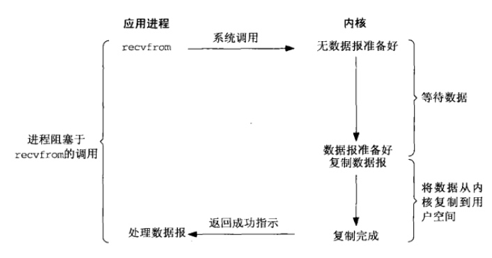

网络`IO`涉及用户空间和内核空间，一般会经历两个阶段：

- 一阶段：等待数据准备就绪，即等待网络数据被`copy`到内核缓冲区（wait for data）
- 二阶段：将数据从内核缓冲区`copy`到用户缓冲区（copy data from kernel to user）

上述数据准备就绪可理解为`socket`中有数据到来，根据以上两阶段的不同，出现多种网络`IO`模型.

## 1. 一些重要概念
### 1.1 同步、异步
函数或方法被调用的时候，调用者是否能得到最终结果。直接得到最终结果的，就是同步调用，不直接得到最终结果的，就是异步调用。

### 1.2 阻塞、非阻塞
函数或方法调用的时候，是否立即返回，立即返回就是非阻塞调用，不立即返回就是阻塞调用。

同步、异步，与阻塞、给阻塞不相关，同步、异步强调的是，是否得到最终的结果，阻塞、非阻塞强调是时间，是否等待。

同步与异步区别在于：调用者是否得到了想要的最终结果。 同步就是一直要执行到返回最终结果； 异步就是直接返回了，但是返回的不是最终结果。调用者不能通过这种调用得到结果，需要通过被调用者的其它方 式通知调用者，来取回最终结果。 

阻塞与非阻塞的区别在于，调用者是否还能干其他事。 阻塞，调用者就只能干等； 非阻塞，调用者可以先去忙会别的，不用一直等。

## 2.阻塞`IO`（Blocking IO）

`linux`中`socket`默认`blocking`，从下图可以看出，用户进程全程阻塞直到两阶段完成，也就是，一阶段等待数据会阻塞，二阶段将数据从内核`copy`到用户空间也会阻塞，只有`copy`完数据后内核返回，用户进程才会解除阻塞状态，重新运行。

## 3.非阻塞IO (Non-blocking IO)

可使用`fcntl`将`socket`设置为`NON-BLOCKING(fcntl(fd, F_SETFL, O_NONBLOCK);)`，使其变为**非阻塞**。如下图，用户进程`recvfrom`时，如果没有数据，则直接返回，因此一阶段不会阻塞用户进程。但是，用户进程需要不断的询问内核数据是否准备好（会造成`CPU`空转浪费资源，因此很少使用）。当数据准备好时，用户进程会阻塞直到数据从内核空间`copy`到用户空间完成（二阶段），内核返回结果。

结论：**非阻塞IO一阶段不阻塞，二阶段阻塞**。

进程调用`recvfrom`操作，如果`IO`设备没有准备好，立即返回`ERROR`，进程不阻塞。用户可以再次发起系统调用（可以轮询）。如果内核已经准备好，就阻塞，然后复制数据到用户空间。

第一阶段数据没有准备好，可以先忙别的，等会再来看看，检查数据是否准备好了的过程是非阻塞的。第二阶段是阻塞的，即内核空间和用户空间之间复制数据是阻塞的。

## 4.IO 复用模型

这里在调用`recv`前先调用`select`或者`poll`，这`2`个系统调用都可以在内核准备好数据(网络数据到达内核)时告知用户进程，这个时候再调用`recv`一定是有数据的。因此这一过程中它是阻塞于`select`或`poll`，而没有阻塞于`recv`，有人将非阻塞`IO`定义成在读写操作时没有阻塞于系统调用的`IO`操作(不包括数据从内核复制到用户空间时的阻塞，因为这相对于网络`IO`来说确实很短暂)，如果按这样理解，这种`IO`模型也能称之为非阻塞`IO`模型，但是按`POSIX`来看，它也是同步`I`O，那么也和楼上一样称之为同步非阻塞`IO`吧。

> `POSIX`(可移植操作系统接口)把同步`IO`操作定义为导致进程阻塞直到`IO`完成的操作，反之则是异步`IO`。

## 5.信号驱动IO模型

通过调用sigaction注册信号函数，等内核数据准备好的时候系统中断当前程序，执行信号函数(在这里面调用recv)。D同学让舍管阿姨等有水的时候通知他(注册信号函数)，没多久D同学得知有水了，跑去装水。是不是很像异步IO？很遗憾，它还是同步IO(省不了装水的时间啊)。

## 6.异步IO模型

调用`aio_read`，让内核等数据准备好，并且复制到用户进程空间后执行事先指定好的函数。E同学让舍管阿姨将杯子装满水后通知他。整个过程E同学都可以做别的事情(没有`recv`)，这才是真正的异步IO。

**总结**：

一般来讲：阻塞`IO`模型、非阻塞`IO`模型、`IO`复用模型(select/`poll/epoll`)、信号驱动`IO`模型都属于同步`IO`，因为阶段2是阻塞的(尽管时间很短)。只有异步`IO`模型是符合`POSIX`异步`IO`操作含义的，不管在阶段1还是阶段`2`都可以干别的事。

> [参考](https://www.cnblogs.com/euphie/p/6376508.html)

