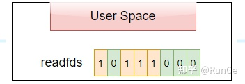
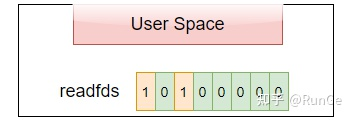
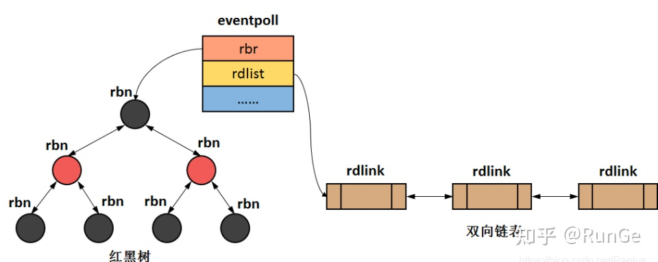

## 1.什么是IO多路复用技术？

简单点说就是单个线程/进程可监听多个文件描述符，通过减少运行的进程，有效的减少上下文切换的消耗。

## 2.为什么需要IO多路复用技术

为实现高性能服务器。上篇文章我们介绍了网络`IO`模型，阻塞`IO`的`recvfrom`接口会阻塞直到有数据`copy`完成，如果是单线程的话会导致主线程被阻塞，即整个程序永远锁死。当然可以通过多线程解决，即一个连接分配一个线程来处理，但是如果是百万连接情况，总不能创建百万个线程，毕竟操作系统资源有限。因此就有了`IO`多路复用技术来解决单线程监听多个网络连接的情况。

主要IO多路复用技术有：`select`，`poll`和`epoll`，注意这些系统调用本身都是阻塞的，其所监听的socket设置为`non-blocking`。`select`同`poll`原理差不多。

## 3.select

- select 原型

```cpp
// 原型
int select(int numfds, fd_set *readfds, fd_set *writefds, fd_set *exceptfds, struct timeval *timeout);
/*
 * 参数含义如下
 * numfds:   需要监听的最大文件描述符 + 1
 * readfds:  需监听的读文件描述符(fd)集合
 * writefds:  需监听的写文件描述符(fd)集合
 * exceptfds: 需监听的异常文件描述符(fd)集合
 * timeout:  
 *   1. NULL则永远等待，直到信号或文件描述符准备好；
 *  2. 0: 从不等待，测试所有执行的fd立即返回
 *  3. >0: 等待timeout时间，还没有fd准备好，立即返回
 *
 * return：返回三个fd集合(readfds, writefds, exceptfds)中fd总数；
 */
// fd处理函数
FD_ZERO(fd_set *set);   // 清除fd_set
FD_SET(int fd, fd_set *set); // 将fd加入set，被监听
FD_CLR(int fd, fd_set *set); // 将fd从set中移除
FD_ISSET(int fd, fd_set *set); // 测试set中的fd是否准备好， 测试某个位是否被置为。
```

### 3.1 select工作流程

假设`fd_set`为一个`1`字节（`== 8 bit`），每一个bit对应一个文件描述符，通过`FD_SET`将`readfds`中`3`，`4`，`5`，`7` 文件描述符设为`1`，表示对这四个文件描述符的读事件感兴趣，如下图：



调用`select`，将`readfds copy`到内核空间，并轮询感兴趣的fd，因为需要监听的最大文件描述符为7，因此`select`的第一个参数为`8`，内核只需要关心`<8`的文件描述符即可，此时文件描述符`5`，`7`有读事件到来（没有数据到来则s`elect`阻塞），内核将对应位置为`1`并将结果返回用户空间，这时用户的`readfds`变成了下图：



用户空间遍历`readfds`，通过F`D_ISSET`对应的`fd`是否置位，
如果置位则调用`read`读取数据。

**优点**：可以监听多个文件描述符

**缺点**：

最大可监听文件描述符有上限，由`fd_set`决定（一般为1024）
需要将`fd_set`在用户态和内核态之间进行`copy`，开销大
无法精确知道哪些fd准备就绪，需要遍历`fd_set`并通过`FD_ISSET`来检测，时间复杂度为`O(n)`

### 3.2 Linux 2.6 内核中select实现

```cpp
// unistd.h 系统调用编号
#define __NR_select 82 
```

`select`为系统调用，其系统调用的编号为 `82`，用户态执行系统调用会触发`0x80`中断，并将其编号，以及相关参数传入内核空间，内核态根据其系统调用编号在`sys_call_table`找到对应接口`sys_select`。

### 3.3 `fd_set`数据结构与用户态内核态之间的`copy`

```cpp
typedef struct {
    unsigned long fds_bits [__FDSET_LONGS];
} __kernel_fd_set;

typedef __kernel_fd_set fd_set;

/* 内核态 --> 用户态
* __copy_to_user: copy a block of data into user space, with less checking.
* @to: Destination address, in user space.
* @from: Source address, in kernel space.
* @n: Number of bytes to copy
*/
static inline unsigned long
__copy_to_user(void __user *to, const void *from, unsigned long n){
    return __copy_to_user_ll(to, from, n);
}
/* 用户态 --> 内核态
* __copy_from_user: copy a block of data from user space, with less checking.
* @to: Destination address, in kernle space.
* @from: Source address, in data space.
* @n: Number of bytes to copy
*/
static inline unsigned long
__copy_from_user(void *to, const void __user *from, unsigned long n){
    return __copy_from_user_ll(to, from, n);
}
```

### 3.4 `sys_select`系统调用实现

```cpp
// poll.h
typedef struct {
    unsigned long *in, *out, *ex;  // 需要关注的fds
    unsigned long *res_in, *res_out, *res_ex;  // 保存结果
} fd_set_bits;
// select.c
asmlinkage long
sys_select(int n, fd_set __user *inp, fd_set __user *outp, fd_set __user *exp, struct timeval __user *tvp) {
    fd_set_bits fds;
    // get_fd_set 会调用__copy_from_user接口将用户态关心的fds(inp, outp, exp)copy到内核空间fds中
    get_fd_set(n, inp, fds.in);
    get_fd_set(n, outp, fds.out);
    get_fd_set(n, exp, fds.ex);
    // 清空结果
    zero_fd_set(n, fds.res_in);
    zero_fd_set(n, fds.res_out);
    zero_fd_set(n, fds.res_ex);
    // 真正select, 会poll fds中需要关注的fd，如果有事件到达则保存至结果字段
    ret = do_select(n, &fds, &timeout);
    // set_fd_set 会调用__copy_to_user接口将事件结果从内核空间 fds copy到用户空间
    set_fd_set(n, inp, fds.res_in);
    set_fd_set(n, outp, fds.res_out);
    set_fd_set(n, exp, fds.res_ex);
}
```

### 3.5 `select`实例

```cpp
int main(){
    // 创建服务器绑定端口进行监听
    int sockfd = socket(AF_INET, SOCK_STREAM, 0);
    bind(sockfd, ...);
    listen(sockfd, ...);
    fd_set rfds, rset;
    FD_ZERO(&rfds);             // 清空rfds, rfds保存需要监听的fd
    FD_SET(sockfd, &rfds);      // 将sockfd加入rfds集合中
    int max_fd = sockfd;        // 最新生成的sockfd 为最大fd
    while (1) {
        rset = rfds;  // 将需要监听的rfds copy到rset中
        // nready表示有事件触发的socket fd 数量
        int nready = select(max_fd + 1, &rset, NULL, NULL, NULL); 
        if (FD_ISSET(sockfd, &rset)) {  // 检测sockfd是否有事件到来, 即是否有客户端连接
            struct sockaddr_in client_addr;
            memset(&client_addr, 0, sizeof(struct sockaddr_in));
            socklen_t client_len = sizeof(client_addr);
              // accept客户端，连接成功后分配clientfd
            int clientfd = accept(sockfd, (struct sockaddr*)&client_addr, &client_len);
            FD_SET(clientfd, &rfds);    // 将clientfd加入rfds集合中
            // 处理完一个fd，则更新nready值，直到为0则表示全部处理完，然后退出
            if (--nready == 0) continue;
        }
        // 遍历所有的文件描述符, 因此select时间复杂度为O(n)
        for (i = sockfd + 1; i <= max_fd; i ++) {
            if (FD_ISSET(i, &rset)) {
                char buffer[BUFFER_LENGTH]= {0};
                int ret = recv(i, buffer, BUFFER_LENGTH, 0);
                ... // 进行出数据处理
                // 更新nready
                if (--nready == 0) break;
            }
        }
    }
    return 0;
}
```


## 4. poll

`poll`不做详细介绍，因为其跟`select`实现方式差不多，效率也差不多；区别在于

**没有最大可监听`fd`限制，因为其底层通过链表实现**；

`poll`没有将可读可写错误三种状态分开，且通过`revents`来设置某些事件是否触发;

```cpp
struct pollfd {
 int fd;
 short events; //要求查询的事件掩码（关注的事件）
 short revents; //返回的事件掩码  可重用
};
int poll (struct pollfd *ufds, unsigned int nfds, int timeout);
/*
 * ufds: 要监控的fd集合
 * nfds: fd数量
 * timeout: < 0 一直等待； == 0 立即返回；
 */
```

### 4.1 poll实例

```cpp
struct pollfd fds[POLL_SIZE] = {0};
    fds[0].fd = sockfd; // 设置监控fd
    fds[0].events = POLLIN; // 设置监控事件
    int max_fd = 0, i = 0;
    for (i = 1;i < POLL_SIZE;i ++) {
      fds[i].fd = -1;
  }
 while (1) {
        // 同select，返回准备就绪的fd数量
        // 不同于select的是，poll没有将可读可写错误三种状态分开，且通过revents来设置某些事件是否触发
        int nready = poll(fds, max_fd+1, 5);
        if (nready <= 0) continue;
        if ((fds[0].revents & POLLIN) == POLLIN) {
            int clientfd = accept(sockfd, ...);
            fds[clientfd].fd = clientfd;
            fds[clientfd].events = POLLIN;
            if (--nready == 0) continue;
        }
        for (i = sockfd + 1;i <= max_fd;i ++) {
            if (fds[i].revents & (POLLIN|POLLERR)) {
                char buffer[BUFFER_LENGTH] = {0};
                int ret = recv(i, buffer, BUFFER_LENGTH, 0);
                if (--nready == 0) break;
            }
        }
    }
```

## 5. epoll

### 5.1 `epoll`数据结构

比`select`，`poll`更加高效的`IO`多路复用技术。

首先介绍内核中实现`epoll`的两个数据结构：

红黑树：也即`interest list`，用于存放所有监听的`fd`；（增删改时间复杂度都为`logn`）

双向链表：也即`ready list`，存放所有有IO事件到来的`fd`（其共用红黑树的节点）




这两个数据结构都在`eventpool`中，如下

```cpp
struct eventpool {
    // 红黑树根节点，存储所有通过epoll_ctl添加进来的fd
   struct rb_root  rbr;
   // 双链表存放有事件触发的fd，通过epoll_wait返回给用户
    struct list_head rdllist;
    ...
};
```

### 5,2 `epoll`工作原理和流程

接下来会介绍`epoll`的三个重要接口：`epoll_create`, `epoll_ctl`, `epoll_wait`，并直接从`linux`内核实现中窥视其具体实现，进而彻底捋清楚`epoll`的工作原理和流程。

#### 5.2.1 `epoll_create`
首先思考一个问题，`eventpool`数据结构是何时被创建的呢？请带着问题看代码：

```c
// unistd.h 系统调用编号
#define __NR_epoll_create  254

// eventpoll.c
// epoll_create为系统调用，最终会到这里
SYSCALL_DEFINE1(epoll_create, int, size)
{
  // 这就是为啥大家经常听到的，epoll_create的参数只有>0 和 <=0的区别
 if (size <= 0)
  return -EINVAL;
 return sys_epoll_create1(0); // 接着调用epoll_create1
}

/*
 * Open an eventpoll file descriptor. 
 */
SYSCALL_DEFINE1(epoll_create1, int, flags)
{
 int error, fd;
 struct eventpoll *ep = NULL;
 struct file *file;
 error = ep_alloc(&ep);
  ...
  return fd;
}

//创建eventpoll结构体，并初始化rdllist和rbr等数据结构
static int ep_alloc(struct eventpoll **pep)
{
 struct eventpoll *ep;
  ep = kzalloc(sizeof(*ep), GFP_KERNEL)
 init_waitqueue_head(&ep->wq);
 init_waitqueue_head(&ep->poll_wait);
 INIT_LIST_HEAD(&ep->rdllist);
 ep->rbr = RB_ROOT;
  *pep = ep;
  ...
}
```

因此`epoll_create`的工作就是创建`eventpoll`结构体，并对其内部数据结构进行初始化，到这里我们可以理解为`epoll`的初始化工作结束，接下来介绍第二个重要接口`epoll_ctl`

#### 5.2.2 epoll_ctl

这里同样给大家抛出一个问题，`fd`是如何被添加到`eventpoll`中的红黑树里面的呢？以及如何更新和删除？依旧带着问题看代码，看完代码，我们再来下结论

```c
// unistd.h 系统调用编号 同样epoll_ctl也是一个系统调用
#define __NR_ctl 255
  
// eventpool.h
// 以下是epoll_ctl的三个有效操作
/* Valid opcodes to issue to sys_epoll_ctl() */
#define EPOLL_CTL_ADD 1
#define EPOLL_CTL_DEL 2
#define EPOLL_CTL_MOD 3
// epoll_event数据结构
struct epoll_event {
 __u32 events;
 __u64 data;
} EPOLL_PACKED

// 每一个被添加到epoll中的fd，都会对应一个epitem
struct epitem {
   struct rb_node rbn;  // 红黑树节点
    struct list_head  rdllink; // 双向链表节点
    struct epoll_filefd  ffd; // 事件句柄信息
    struct eventpoll *ep;  // 所属的eventpoll
    struct epoll_event event;  //期待发生的事件类型
};


/* 这是官方注释，也解答了epoll_ctl的主要功能
 * The following function implements the controller interface for
 * the eventpoll file that enables the insertion/removal/change of
 * file descriptors inside the interest set.
 */
 /*
 * 可以看出epoll_ctl需要传入4个参数
 * @epfd int 通过epoll_create创建的fd
 * @op int 操作类型
 * @fd int 需要操作的sockfd
 * @event struct epoll_event 用于用户态内核态之间传递数据
 */
SYSCALL_DEFINE4(epoll_ctl, int, epfd, int, op, int, fd,
  struct epoll_event __user *, event)
{
 // 如果op不是EPOLL_CTL_DEL删除操作，就把event从用户空间copy到内核空间，保存在epds中
 if (ep_op_has_event(op) &&
     copy_from_user(&epds, event, sizeof(struct epoll_event)))
  goto error_return;
 // 需要进行一些加锁操作
 switch (op) {  // 根据不同的op进行相应的操作
 case EPOLL_CTL_ADD:
    ep_insert(ep, &epds, tfile, fd); // 插入, 会构造一个epitem结构，并加入红黑树中
  break;
 case EPOLL_CTL_DEL:
  ep_remove(ep, epi);  // 删除
  break;
 case EPOLL_CTL_MOD:
    ep_modify(ep, epi, &epds);  // 修改
  break;
 }
  ...
}
```

`epoll_ctl`包含插入，删除和更新三个操作，其中插入是使用`socket fd`及其关注的事件构造`epitem`结构体，并插入到`eventpoll`中，同时会给内核中断处理程序注册一个回调函数，告诉内核，如果这个句柄的中断到了，就把它放到准备就绪`list`链表中。删除就是将`socket fd`对应的节点从`eventpoll`中删除，更新就是修改`socket fd`相关的信息，比如更改其所监听的事件等。

所有添加到`epoll`中的事件都会与设备(网卡)驱动程序建立回调关系，即，每当事件发生时，会调用对应的回调函数(内核中对应为`ep_poll_callback`)，将发生的事件添加到`rdlist`双链表中

#### 5.2.3 epoll_wait

最后一个重要接口是`epoll_wait`, 既然`sockfd`以及其所关心的事件等信息已经添加到了`eventpoll`中，那么当`socket`对应的事件到来是，是如何通知`eventpoll`将`socket fd`对应的节点加入到就绪链表中，并如何通知用户态进行数据读取呢？
```c
// epoll_wait 系统调用
SYSCALL_DEFINE4(epoll_wait, int, epfd, struct epoll_event __user *, events,
  int, maxevents, int, timeout)
{
  // 调用ep_poll
  ep_poll(ep, events, maxevents, timeout);
}

/** 官方注释很清晰
 * ep_poll - Retrieves ready events, and delivers them to the caller supplied
 *           event buffer. 获取准备好的事件，并将其copy到调用者提供的event buffer中
 *
 * @ep: Pointer to the eventpoll context.指向eventpoll
 * @events: Pointer to the userspace buffer where the ready events should be
 *          stored. 指向用户空间中就绪事件存放的buffer中
 * @maxevents: Size (in terms of number of events) of the caller event buffer.
 * @timeout: Maximum timeout for the ready events fetch operation, in
 *           milliseconds. If the @timeout is zero, the function will not block,
 *           while if the @timeout is less than zero, the function will block
 *           until at least one event has been retrieved (or an error
 *           occurred).
 *
 * Returns: Returns the number of ready events which have been fetched, or an
 *          error code, in case of error.
 */
static int ep_poll(struct eventpoll *ep, struct epoll_event __user *events,
     int maxevents, long timeout)
{
  ep_send_events(ep, events, maxevents);
}
```

`epoll_wait`为阻塞的接口，如果就绪列表中有事件到来，就会将就绪事件`copy`到用户空间（通过`epoll_event`结构体），并返回事件的数量。没有数据就`sleep`，等到`timeout`时间到了即使没有数据也返回。

### 5.3 总结下用户如何使用epoll的接口，以及对应参数含义

```c
// 成功则返回epoll实例的fd. 失败返回-1
// epoll_create参数只有>0 和<0的区别
int epoll_create(int size);

// 控制fd函数, epfd表示应用程序使用的epoll fd；即epoll_create返回的
// op控制参数，有三种：EPOLL_CTL_ADD(添加) EPOLL_CTL_MOD(修改) EPOLL_CTL_DEL(删除)
// fd表示要被操作的fd，而epoll_event则表示与fd绑定的消息结构。
int epoll_ctl(int epfd, int op, int fd, struct epoll_event *event);

// 例如将fd1添加到epoll实例中
struct epoll_event ev;
ev.events = EPOLLIN | EPOLLOUT;
ev.data.ptr = (void*)socket_data;
epoll_ctl(epfd, EPOLL_CTL_MOD, fd1, &ev);

// 获取ready list
// timeout == 0:
// 不论ready list是否为空，epoll_wait都会被立即唤醒；
// timeout > 0: 
// 1. 有进程的signal信号到达 2. 最近一次epoll_wait被调用起，经过timeout ms 3. ready list 不为空
// timeout == -1:
// 1. 有进程的signal信号到达 2. ready list不为空
// 将内核中就绪的事件copy到events中
int epoll_wait(int epfd, struct epoll_event * events, int maxevents, int timeout);
```

源码中`epoll`实现较为复杂，之后会单独用一个篇文章来介绍一个大佬手撸的一个简单`epoll`实现帮助大家理解。

### 5.4 `epoll`的`LT`和`ET`模式

我们假定`recvbuff`中有数据为`1`，无数据为`0`

水平触发`LT`(`Level Trigger`)：一直触发，`recvbuff`为`1`(有数据)则一直触发，直到`recvbuff`为`0`(无数据)

边缘触发`ET`(`Edge Trigger`): `recvbuff`从`0`到`1`时，就触发一次。每次有新的数据包到达时`epoll wait`才会唤醒，因此没有处理完的数据会残留在缓冲区；直到下一次客户端有新的数据包到达时，`epoll_wait`才会再次被唤醒。

### 5.5 `epoll`实例

```c
    int epoll_fd = epoll_create(EPOLL_SIZE);
    struct epoll_event ev, events[EPOLL_SIZE] = {0};
    ev.events = EPOLLIN;  // 默认LT
    ev.data.fd = sockfd;
    // 把sockfd带着ev加入到epoll_fd中(红黑树)
    // sockfd为key，ev为value
    epoll_ctl(epoll_fd, EPOLL_CTL_ADD, sockfd, &ev);
    while (1) {
    // nready 就绪fd数量，就绪fd存储再events中
        int nready = epoll_wait(epoll_fd, events, EPOLL_SIZE, -1);
        int i = 0;
        // 遍历就绪队列nready;
        for (i = 0;i < nready;i ++) {
            if (events[i].data.fd == sockfd) {  // 有客户端连接到来
                int clientfd = accept(sockfd, (struct sockaddr*)&client_addr, &client_len);
                ev.events = EPOLLIN | EPOLLET;
                ev.data.fd = clientfd;
                // 将clientfd 加入到epoll_fd中
                epoll_ctl(epoll_fd, EPOLL_CTL_ADD, clientfd, &ev);
            } else {  // 客户端有数据到来
                int clientfd = events[i].data.fd;
                char buffer[BUFFER_LENGTH] = {0};
                int ret = recv(clientfd, buffer, BUFFER_LENGTH, 0);
               // 数据处理
            }
        }
```

## 6.`epoll`与`poll`，`select`对比

`select`：无差别轮询，当`IO`事件发生，将所有监听的`fds`传给内核，内核遍历所有`fds`，并将标记有事件的`fd`，遍历完将所有fd返回给应用程序，应用程序需要遍历整个数组才能知道哪些`fd`发生了事件，时间复杂度为`O(n)`，还有`fds`从用户态`copy`到内核态的开销。基于数组，监听`fd`有大小限制。

`poll`：与`select`无本质区别，但没有最大连接数限制，因其基于链表存储。

`epoll`: 采用回调机制，当有事件到来时加入到就绪链表中，内核无序主动遍历所有监听的`socket`是否有事件到来，并且只需把有事件触发的`fd copy`到用户空间，无需`copy`所有`fd`，用户空间也只需遍历有事件到来的`fd`进行相关操作，且没有最大并发连接数限制。

> `Redis`中采用单线程`epoll`，`nginx`采用多进程`epoll`


[参考](https://zhuanlan.zhihu.com/p/357057264)

