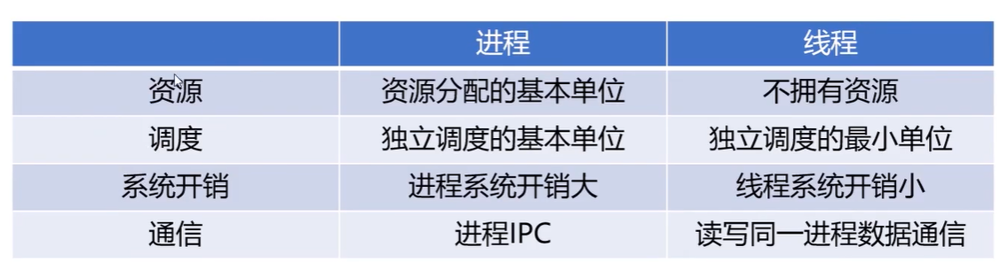
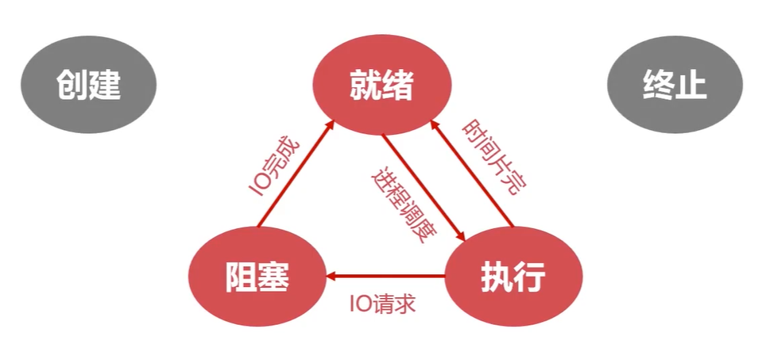

## 1.进程

进程是系统进行资源分配和调度的基本单位。

### 1.1进程的实体
- 主存中的进程形态
- 进程和线程

#### 1.1.1 主存中的进程形态

- 标识符：标记一个进程，用于区别其他进程，比如说进程ID
- 进程的状态：比如说运行态，堵塞态，有专门的区域存储进程状态
- 程序计数器： 指向进程即将要执行的下一条指令地址
- 内存指针，值得是程序代码或者数据相关的指针
- 上下文区域：进程执行的时候存储器存储的数据
- IO状态信息：被进程IO操作所占用的文件列表，进程中所有的信息都是以文件的形式存在的，比如说操作磁盘，文件，内存都是以文件的形式存储在IO状态信息里面
- 记账信息：存储处理器处理时间，时钟数总和等。

上面这些都是进程中的一个重要的区域

- **进程的控制块**（PCB）：用于描述和控制进程运行的通用数据结构，每个进程都有进程控制块
- PCB还用于记录当前状态和控制进程运行的全部信息
- PCB使得进程是能够独立运行的基本单位，每个进程都依赖于进程控制块去被操作系统调度

#### 1.1.2 进程与线程
- 进程（Process）：是系统进行资源分配和调度的基本单位

- 线程（Thread）：线程是操作系统进行运行调度的最小单温

一个进程里面可能有多个线程在执行，一个进程可以并发执行多个线程，每个线程执行多个不同的任务。

进程的线程共享进程资源

### 1.1进程管理的无状态模型

进程在操作系统中是有多个状态的：就绪，阻塞，执行，创建，终止。

- 就绪状态
  - 当进程被分配到除了CPU以外所有必要的资源后就处于就绪状态。
  - 只要获得CPU的使用权，就可以独立运行。
  - 其他资源准备好，只差CPU资源的状态就称为就绪状态
  - 在系统中多个处于就绪状态的进程通常排成一个队列

- 执行状态
  - 进程获得CPU资源，其程序正在执行就被称为执行状态
  - 在单处理机中(1核)，在某个时刻只有一个进程正在执行

- 阻塞状态
  - 当进程因为某种原因，比如其他设备未就绪而无法继续执行
  - 从未放弃CPU的状态被称为阻塞状态。

以上三种状态的切换

- 创建状态
  - 创建状态分为两步
  - 第一步分配PCB，第二部插入就绪队列
  - 创建进程时拥有PCB但是其他资源尚未就绪的状态称为创建态

- 终止状态
  - 终止状态分为两步
  - 第一步是系统清理，第二步是归还PCB
  - 进程结束由系统清理或者归还PCB的状态为终止状态

#

