## 1.进程管理

进程是系统进行资源分配和调度的基本单位。

### 1.1进程的实体
- 主存中的进程形态
- 进程和线程

#### 1.1.1 主存中的进程形态

- 标识符：标记一个进程，用于区别其他进程，比如说进程ID
- 进程的状态：比如说运行态，堵塞态，有专门的区域存储进程状态
- 程序计数器： 指向进程即将要执行的下一条指令地址
- 内存指针，值得是程序代码或者数据相关的指针
- 上下文区域：进程执行的时候存储器存储的数据
- IO状态信息：被进程IO操作所占用的文件列表，进程中所有的信息都是以文件的形式存在的，比如说操作磁盘，文件，内存都是以文件的形式存储在IO状态信息里面
- 记账信息：存储处理器处理时间，时钟数总和等。

上面这些都是进程中的一个重要的区域

- **进程的控制块**（PCB）：用于描述和控制进程运行的通用数据结构，每个进程都有进程控制块
- PCB还用于记录当前状态和控制进程运行的全部信息
- PCB使得进程是能够独立运行的基本单位，每个进程都依赖于进程控制块去被操作系统调度

#### 1.1.2 进程与线程
- 进程（Process）：是系统进行资源分配和调度的基本单位

- 线程（Thread）：线程是操作系统进行运行调度的最小单温

一个进程里面可能有多个线程在执行，一个进程可以并发执行多个线程，每个线程执行多个不同的任务。

进程的线程共享进程资源


### 1.1进程管理的无状态模型

进程在操作系统中是有多个状态的：就绪，阻塞，执行，创建，终止。

- 就绪状态
  - 当进程被分配到除了CPU以外所有必要的资源后就处于就绪状态。
  - 只要获得CPU的使用权，就可以独立运行。
  - 其他资源准备好，只差CPU资源的状态就称为就绪状态
  - 在系统中多个处于就绪状态的进程通常排成一个队列


- 执行状态
  - 进程获得CPU资源，其程序正在执行就被称为执行状态
  - 在单处理机中(1核)，在某个时刻只有一个进程正在执行

- 阻塞状态
  - 当进程因为某种原因，比如其他设备未就绪而无法继续执行
  - 从未放弃CPU的状态被称为阻塞状态。

以上三种状态的切换


- 创建状态
  - 创建状态分为两步
  - 第一步分配PCB，第二部插入就绪队列
  - 创建进程时拥有PCB但是其他资源尚未就绪的状态称为创建态

- 终止状态
  - 终止状态分为两步
  - 第一步是系统清理，第二步是归还PCB
  - 进程结束由系统清理或者归还PCB的状态为终止状态


### 1.2 进程间的同步

### 1.2.1 生产者消费者模型

有几个生产进程往一个缓冲区里面生产产品，同时有若干个进程从缓冲区中取走产品，这就是生产者消费者模型。

- 生产者往缓冲区 +1
- 消费者往缓冲区 -1

但是这个在计算机中是有问题的，缓冲是在cache上的，操作缓冲区需要三个步骤：
- register = count
- register = register+1
- count = register

两者并发执行的时候就会出错。

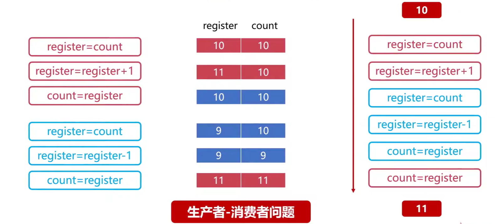

```cpp
#include <iostream>
#include <pthread.h>
#include <stdio.h>
#include <stdlib.h>
#include <vector>
using namespace std;
pthread_mutex_t mutex = PTHREAD_MUTEX_INITIALIZER;

int num = 0;

void *producer(void* )
{
	int times = 10000000;
	while (times--)
	{
		// printf("--------------\n");
		num += 1;
	}
}
void *comsumer(void* )
{
	int times = 10000000;
	while (times--)
	{
		// printf("1111111111111111111111\n");
		num -= 1;
	}
}
int main()
{
	cout << "start in main function\n" << endl;

	//创建连个线程模拟两个进程
	pthread_t thread1,thread2;
	pthread_create(&thread1,NULL,&producer,NULL);
	pthread_create(&thread2,NULL,&comsumer,NULL);
	pthread_join(thread1,NULL);
	pthread_join(thread2,NULL);
	// cout << "print in main function num = " << num << endl;
	printf("Print in main function num = %d\n",num);

	return 0;
}
//g++ 00test.cpp -lpthread
```

结果：

```
kendall@ubuntu:~/kenworkspace/cppLearn/00testCpp$ ./a.out
start in main function

Print in main function num = -1339132
kendall@ubuntu:~/kenworkspace/cppLearn/00testCpp$ ./a.out
start in main function

Print in main function num = -4278548
kendall@ubuntu:~/kenworkspace/cppLearn/00testCpp$ ./a.out
start in main function

Print in main function num = -104962
kendall@ubuntu:~/kenworkspace/cppLearn/00testCpp$ ./a.out
start in main function

Print in main function num = 5835642

。。。
```

这里的num就是缓冲区，这就出现了临界资源问题，发生这个问题的原因是进程之间没有通信。所以就需要进程之间的同步。

- 进程间同步的原则：
  - 空闲让进，资源无占用，允许使用
  - 忙则等待，资源有占用，请求进程等待
  - 有限等待，保证有限等待时间能够使用资源
  - 让权等待：等待时，进程需要让出CPU

- 进程同步使用的方法
  - 消息队列
  - 共享存储
  - 信号量

- 线程同步的方式
  - 互斥量
  - 读写锁
  - 自旋锁
  - 条件变量

## 2.linux进程管理

### 2.1相关概念

- 进程的类型
  - 前台进程：前台进程就是具有终端，可以和用户交互的进程
  - 后天进程，基本不和用户进程交互，优先级比前台低， 将需要执行的命令以 & 符号结束
  - 守护进程：特殊的后台进程，很多守护进程是在系统启动的时候就已经启动了，一直运行到系统关闭

- 进程的标记
  - 进程ID进程唯一标识符）：非负整数
  - 进程的状态标记

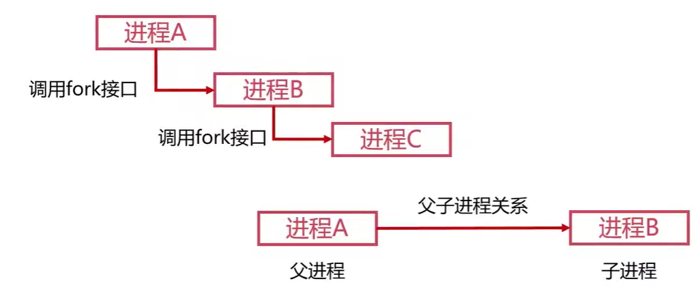

进程的父子关系可以通过 pstree 命令查看。

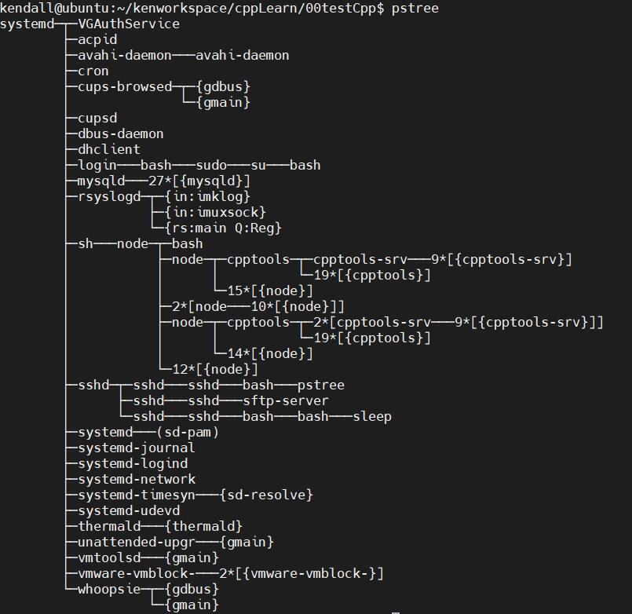

**进程的状态标记**：

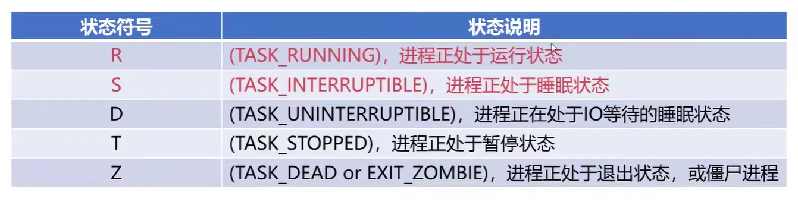

查看某个进程的状态

ps -aux | grep 进程号

### 2.2 作业管理的进程调度

#### 2.2.1 进程调度

进程调度是指计算机通过决策决定哪个就绪程序进程可以获得CPU使用权

**进程调度的机制**
- 就绪队列的排队机制

将就绪进程按照一定方式排成队列，以便调度程序可以最快找到就绪进程

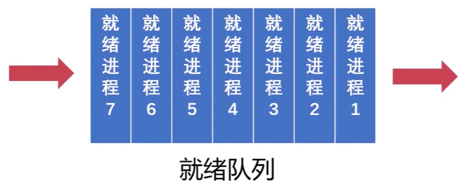

- 选择运行程序的委派机制

调度程序以一定的策略选择就绪进程，将 CPU 资源分配给它

- 新老进程的上下文切换机制

保存当前进程的上下文信息，将新进程的上下文调度到CPU里面


但是进程调度的时候，老进程还没运行完的话怎么办呢？

- 非抢占式调度

一旦将 CPU 分配给了某个进程就让该进程一直使用下去，调度不能进程占用使用的处理器，只有这个进程完成了工作才让出处理器

- 抢占式调度

允许调度程序以一定的策略暂停当前的进程，

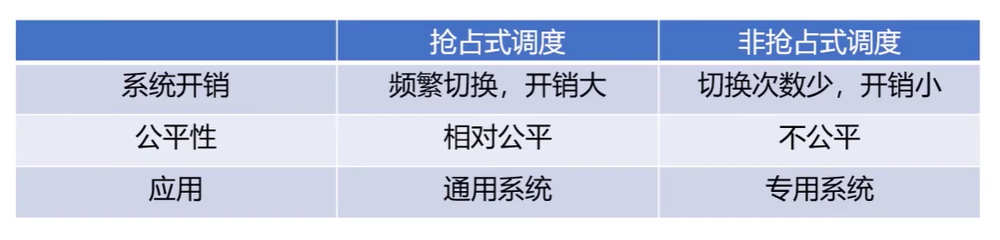

#### 2.2.2 进程调度的算法

- 先来先服调度务算法

- 短进程优先的调度算法

调度程序优先选择在就绪队列中估计运行时间最短的进程，不利于长作业运行的执行。

- 高优先权调度算法

优先权高的先处理，也就是紧迫的任务先处理，

- 时间片轮转调度算法

  - 先来先服务原则排序就绪进程，每次从对头去除待执行的进程，分配一个时间片执行。
  - 相对公平但是不能及时用户响应


## 3.作业管理

### 3.1 作业管理之思索

多个进程相互等待的过程就是死锁。

- 死锁的产生
  -  竞争资源
  -  进程调度顺序不当

- 四个必要天剑
  - 互斥条件：某个资源只能由一个进程使用，其他进程需要使用只能等待
  - 请求保持条件：进程至少保留一个资源并请求新的资源，新资源被占用，请求被阻塞，被阻塞的资源又不释放自己保持的资源
  - 不可剥夺条件：进程获得的资源为完成使用前不能被剥夺，获得的资源只能由进程自身释放
  - 环路等待条件：形成环形链

- 死锁的处理

**A.预防死锁的方法**

（1）破坏请求保持条件，系统规定进程运行之前，一次性申请所有需要的资源，进程在运行期间不得提出新的资源申请。

（2)破坏不可剥夺条件：当一个进程请求新的资源得不到满足的时候，必须释放占有的资源。进程运行时占有的资源可以被释放，意味着可以被剥夺。

（3）破坏环路等待条件：可用资源现行排序，申请必须按照递增申请，让申请不形成环路

**B.银行家算法**

以银行借贷系统分配策略为基础的算法，可以用来避免死锁。

需要三个表：

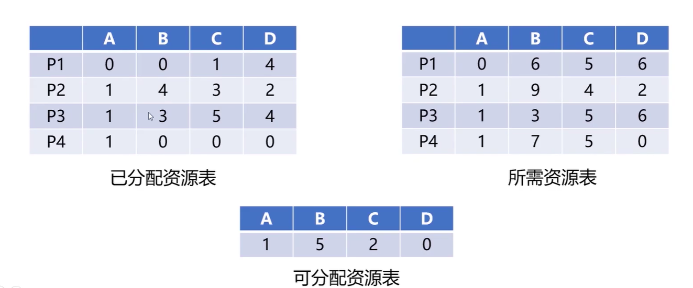

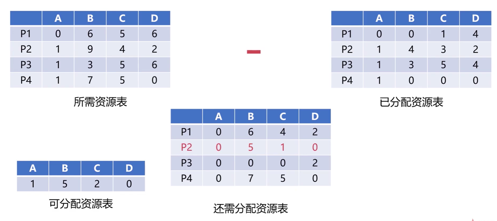

通过上面对比可以发现，系统只能满足 P2 的资源，因此把所有的资源都优先分发给 P2 ，等 P2 执行完之后释放资源在继续分发给其他的进程。

### 3.2 内存分配与回收
  
#### 3.2.1内存分配

- 内存分配的过程
  - 单一连续分配简单的内存分配方式
  - 只能在的单用户、单进程的操作系统中使用

- 内存回收的过程
  - 固定分区是支持多道程序的最简单存储分配方式
  - 内存空间被划分为若干固定大小的区域
  - 每个分区只提供一个程序使用，互不干扰

- 动态分区分配
  - 根据进程实际需要，动态分配内存空间
  - 动态分区空闲链表的数据结构

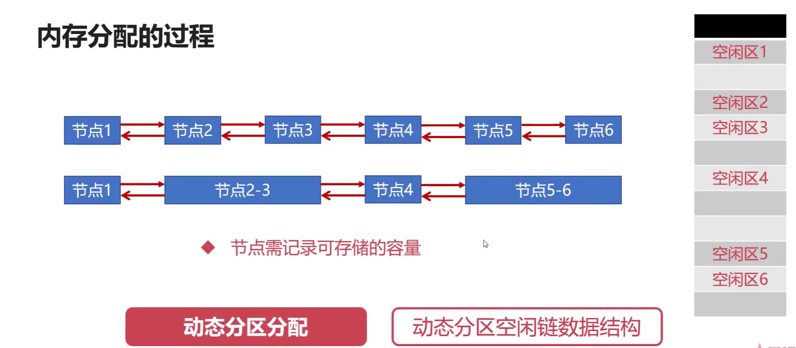

- 首次适应算法（FF算法）
  - 分配聂村时从开始顺序查找适应的内存区
  - 若没有适应的内存区，则该分配失败
  - 每次都是从头部开始的，头部的地址不断被划分


- 最佳适应算法（BF算法）
  - 最佳适应算法要求空闲区链表按照容量大小排序
  - 遍历空闲区链表找到最佳合适空闲区


- 快速适应算法（QF算法）
  - 快速适应算法要求有多个空闲区链表
  - 每个空闲区链表存储一种容量的空闲区


#### 3.2.2内存回收

内存回收有四种情况

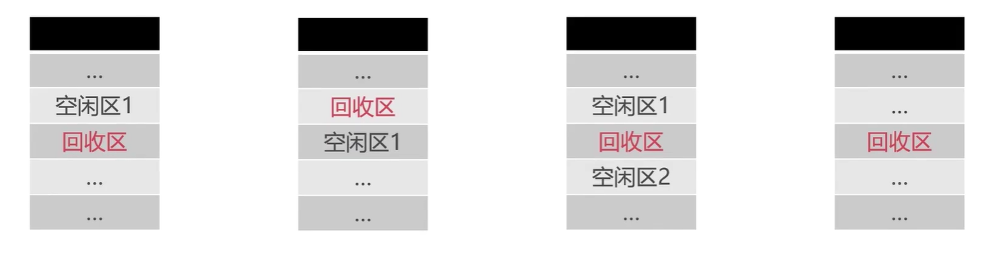

第一种不需要新建空链表节点，只需要把空闲区1增大为空闲区域即可

第二种将回收区与空闲区合并，新的空闲区使用回收区的地址

第三种将空闲区1、空闲区2和回收区合并，新的空闲区使用空闲区1地址。

内存回收的过程

- 为回收创建新的空闲节点
- 然后插入到相应的空闲区链表中

### 3.3 段页式存储管理

操作系统是怎么存储进程的空间的？

#### 3.3.1 页式存储管理
- 将进程逻辑空间等分成若干个大小的页面
- 相应的把物理内存空间分成与页面大小的物理块
- 以页面为单位把进程空间装进物理内存中分散的物理块

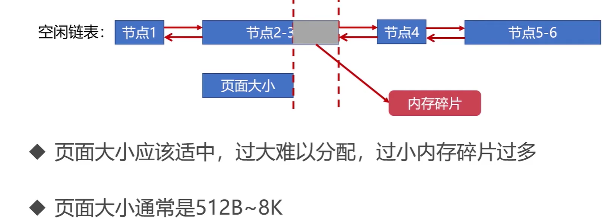

页表：记录进程逻辑空间和物理空间的映射

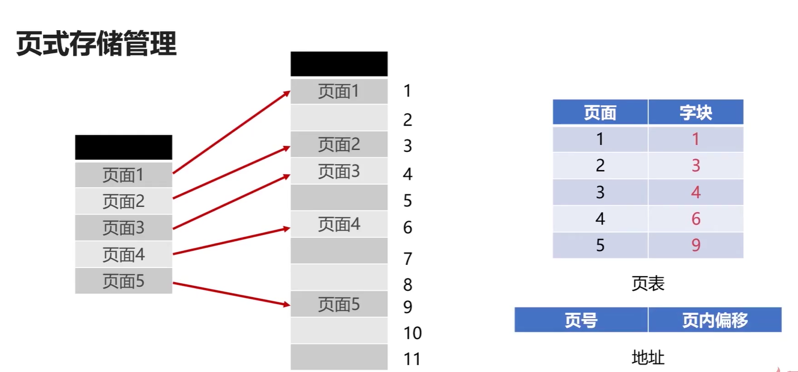


- 将进程逻辑空间等分成若干大小的页面
- 相应的吧物理内存空间分成与页面大小的物理块
- 以页面为单位把进程空间装进物理内存中分散的物理块

#### 3.3.2 段式存储管理

- 将进程逻辑空间划分成若干段（非等分）
- 段的长度由连续逻辑的长度决定

#### 3.3.3 段页式存储管理

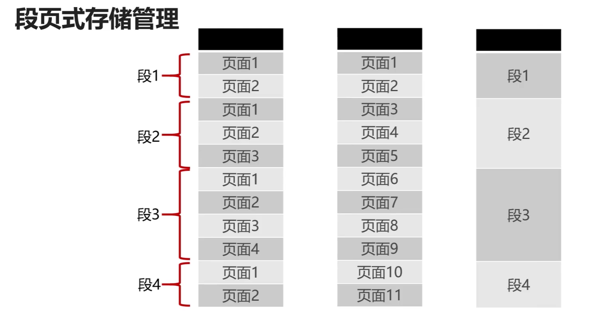


