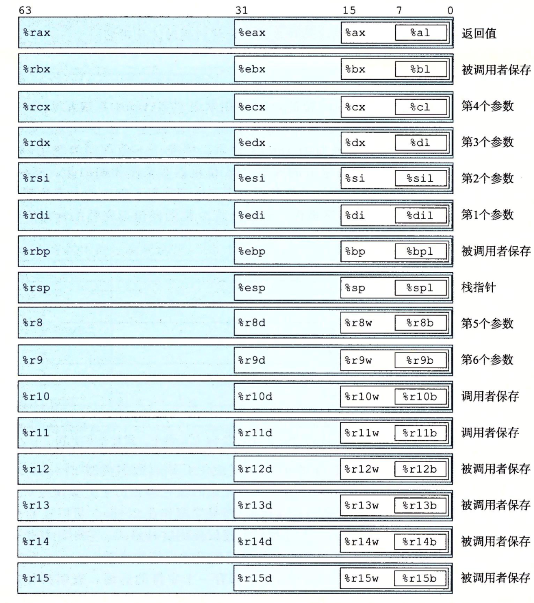
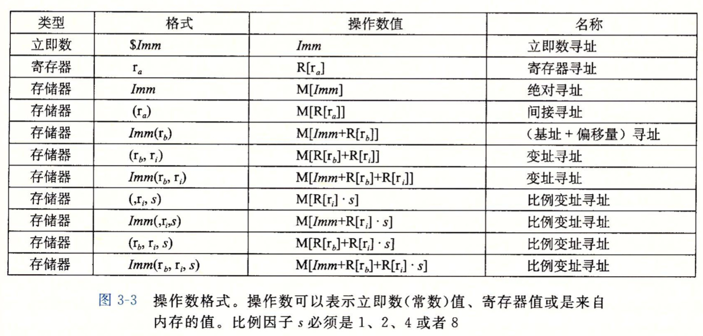

一点点啃《深入理解计算机系统》

## 历史观点
Intel处理器系列又称x86,经过很长时间的不断发展，最终架构成`x86-64`

Intel系列处理器的每个后继处理器的设计都是向后兼容的——较早版本上编译的代码可以在较新的处理器上运行。

## 程序编码
假设两个程序`p1.c`,`p2.c`,进行编译：
```
linux>gcc -Og -o p p1.c p2.c
```
其中：
- `-Og`告诉编译器使用会生成符合原始C代码整体结构的机器代码的优先等级，使用较高级别优化产生的代码会严重变形，以至于产生的机器代码和初始源代码之间的关系非常难以理解。
  
## 机器级代码
有两种抽象对机器级编程来说很重要
- 指令集体系结构（ISA）：定义机器级程序的格式和行为，让每条指令**像是**按顺序执行的。
- 虚拟地址：将主存（由动态随机存储器DRAM构成）和I/O设备抽象成一个非常大的字节数组。

在汇编语言中一些对C语言程序员隐藏的处理器状态都是可见的：

- 程序计数器 —— （通常称为"PC"， 在`x86-64`中用`%rip`表示）给出将要执行的下一条指令在内存中的地址.
- 整数寄存器（通用目的寄存器） —— 存储地址或整数数据
- 条件码寄存器 —— 保存着最近执行的算术或逻辑指令的状态信息,用来实现`if`或者`while`语句等。(控制条件变化)
- 向量寄存器 —— 存放整数或浮点数值

C语言提供一种可以在内存中声明和分配各种数据类型的对象的模型，但是机器代码只是简单的将内存看成一个很大的、按自己寻址的数组。汇编只强调C语言指针类型这个概念，不区分有符号和无符号整数，甚至区分指针和整数。

> x86=64的虚拟地址是由64位的字来表示的，这些地址的高16位必须设置为0，所以一个地址实际上能够指定的是 2<sup>48</sup> 或 256TB。           
> 操作系统负责将虚拟地址翻译成物理地址

一条指令只能执行一个基本操作，比如相加，相乘，存储器和寄存器的传送数据等。

查看C语言产生的汇编代码
```
linux> gcc -Og -S mstore.c
```
产生一个mstore.s的汇编文件，一般它还会调用**汇编器**产生目标代码文件。

机器执行的程序只是一个字节序列，它是对一系列指令的编码，机器对源程序一无所知。对于这些字节序列，从某个位置开始，连续或单个字节(块)可以被解码成一条指令，或者这么理解，指令被编码成一个或多个连续的字节，根据起始字节定位并解码就能得到这一小段字节指的是哪个指令。

## 数据格式

由于计算机发展是从16位到32位再到64位的，Intel用 **字** 来表示16位数据类型。相应的：32位——双字，64——四字。

C语言数据类型对应的x86-64表示；


一般而言，指令后面都会跟着一个后缀，表明操作数的大小。浮点数和整数使用的是完全不同的指令和寄存器。

数据传送指定有四个变种：
- move(传送字节)
- movw(传送字)
- movl(传送双字)
- movq(传送四字)

## 访问信息
一个`x86-64`的中央处理单元(CPU)包含一组16个存储64位值的通用目的寄存器。这些寄存器用来存储**整数数据**和**指针**。



指令可以对这16个寄存器的低位字节存放的大小不同的有效数据进行操作。这些寄存器可以向前兼容，就是64位可以存储32位，16位和8位的数据，但是32位无法存储64位的数据，如果是大寄存器存小数据，那么只能存在低位中，高位有相对应的填充措施。

当指令以寄存器作为目标时，对于小于生成8字节结果的指令，寄存器中剩下的字节怎么处理（高位的数据填充）
- 1.生成1字节和2字节的指令保持其他高位不变；
- 2.生成4字节(2字)的指令会把高位填充为0。

> **对于所有的寄存器来说，最特别的就是%rsp，它用来指明运行时栈的结束位置。**

## 操作数指示符

大多数指令有一个或多个操作数，指示出执行一个操作中要使用的数据值，以及防止结果的目的位置。操作数的可能性分为三类：
- 立即数：表示常数值
- 寄存器：表示某个寄存器的内容
- 内存引用：根据有效地址访问内存位置



在这张表里，只有前两个得到的是直接的值，其余都要翻译成内存地址来进行寻址操作然后取值。

## 数据传送指令
把许多不同的指令划分成指令类，每一类执行相同的操作，只是操作数的大小不同。


最后一条指令是处理64位**立即数**数据的。

x86-64对于MOV指令加了一个限制，就是不能直接把一个值从内存的某个位置复制到另一个位置，而必须使用寄存器作为中介。MOV指令的后缀表明了操作数据的大小，也就是寄存器的大小，不管这个寄存器是源数据还是目的地址，都必须符合指令指定的大小。MOV指令只会更新目的操作数指定的寄存器字节或内存位置(就是只更新指定的低位字节)，高位字节有其他的设置，但是有一个例外，就是movl指令，当它把寄存器作为目的地址时，会把高32位设为0。


常规的movq指令只能以表示32位补码的数字的立即数作为源数据利用符号扩展放到64位寄存器里去；`movabsq`能以任意64位立即数值作为源数据，并且只能以寄存器作为目的地址。

有两类指令，适用于把较小(位长)的源数据复制到较大(位长)的目的地时使用，MOVZ使用0扩展位长；MOVS使用符号扩展位长，就是复制源数据的最高有效位。然后它们的后两个都是位长，第一个指定了源数据的大小，第二个指定了目的的大小。


