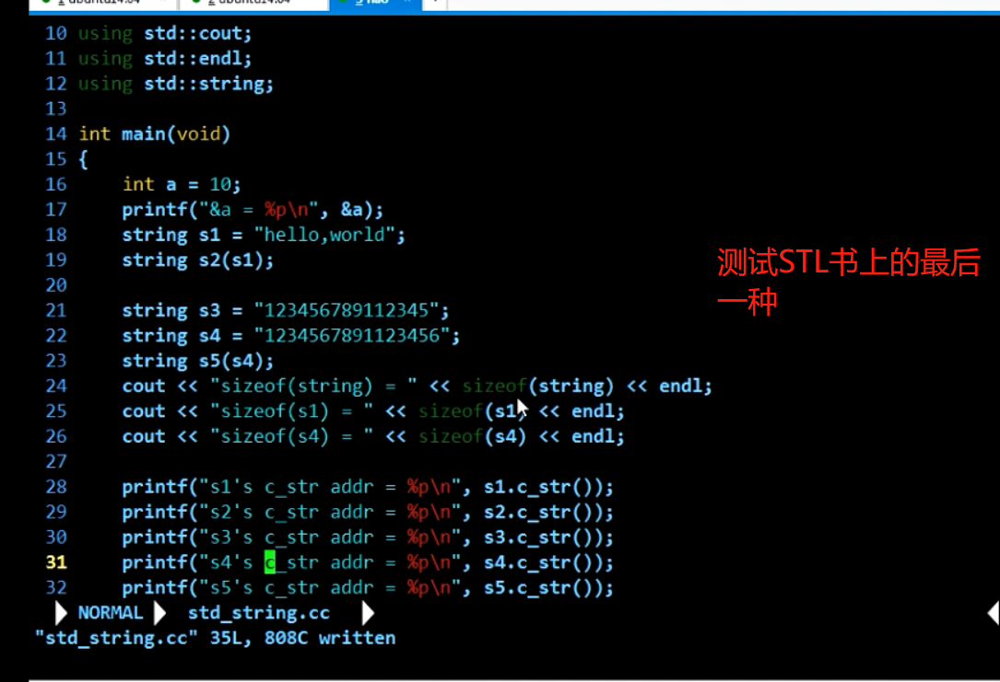

## 1.运算符重载
看知乎写的和PPT，还有完善特殊运算符重载和类型重载

> 推荐以普通函数
		`+  -  *  /   ==`

> 友元（非成员）函数
		`>>  <<`

> 推荐以成员函数形式重载
		`+=  -= *=  /=`

## 2.实现单例模式的自动释放

### 2.1 嵌套类+静态对象

```cpp
#include <iostream>
#include <stdio.h>
using std::cout;
using std::endl;

class Singleton
{
public:
	static Singleton * getInstance()
	{
		if(_pInstance == NULL){
			_pInstance = new Singleton();
		}
		return _pInstance;
	}
private:
	Singleton() { cout << "Singleton()" << endl; }
	~Singleton() { cout << "~Singleton()" << endl;  }

private:
	static Singleton * _pInstance;
};

Singleton * Singleton::_pInstance = NULL;

int main()
{
	//下面两个属于同一个对象
	Singleton *p1 = Singleton::getInstance();
	Singleton *p2 = Singleton::getInstance();
	
	printf("&p1 = %p\n",p1);
	printf("p2 = %p\n",p2);

	//回收
	// Singleton::detroy(); //有可能你会忘掉
	return 0;
}
```

实现一个自动释放回收的单例模式

一般情况下，单例对象在整个程序执行期间，都是存在的，直到程序退出;

有些内存泄漏检测程序(valgrind)会认为单例对象就是内存泄漏;

```cpp
#include <iostream>
#include <stdio.h>
using std::cout;
using std::endl;

//单例对象的自动释放
//1.方法一：嵌套类 + 静态对象

class Singleton
{
	//定义一个嵌套类，专门为Singleton提供服务
	class AutoRelease
	{
	public:
		AutoRelease() {
			cout << "AutoRelase()" << endl;
		}
		~AutoRelease()
		{
			if(_pInstance){  //如果_pInstance还存在就释放掉
				delete _pInstance;
				cout << "~AutoRelease()" << endl;
			}
		}
	};
public:
	static Singleton * getInstance()
	{
		if(_pInstance == NULL){
			_pInstance = new Singleton();
		}
		return _pInstance;
	}
private:
	Singleton() { cout << "Singleton()" << endl; }
	~Singleton() { cout << "~Singleton()" << endl;  }

private:
	static Singleton * _pInstance;
	static AutoRelease _ar;
};

//静态成员必须初始化
Singleton * Singleton::_pInstance = NULL;
Singleton::AutoRelease Singleton::_ar;

int main()
{
	//下面两个属于同一个对象
	Singleton *p1 = Singleton::getInstance();
	Singleton *p2 = Singleton::getInstance();
	
	printf("p1 = %p\n",p1);
	printf("p2 = %p\n",p2);

	//回收
	// Singleton::detroy(); //有可能你会忘掉
	return 0;
}
```

但是上面的自动单例模式还是有问题的。
```cpp
	static Singleton * getInstance()
```
在多线程情况下不是线程安全的

可以考虑采用饱汉模式保证线程安全

```cpp
#include <iostream>
#include <stdio.h>
using std::cout;
using std::endl;

//单例对象的自动释放
//1.方法一：嵌套类 + 静态对象

class Singleton
{
	//定义一个嵌套类，专门为Singleton提供服务
	class AutoRelease
	{
	public:
		AutoRelease() {
			cout << "AutoRelase()" << endl;
		}
		~AutoRelease()
		{
			if(_pInstance){  //如果_pInstance还存在就释放掉
				delete _pInstance;
				cout << "~AutoRelease()" << endl;
			}
		}
	};
public:
	static Singleton * getInstance()
	{  //在多线程情况下不是线程安全的
		//1.第一种解决方案 加锁 mutex.lock();
		if(_pInstance == NULL){
			_pInstance = new Singleton();
		}
		return _pInstance;
	}
private:
	Singleton() { cout << "Singleton()" << endl; }
	~Singleton() { cout << "~Singleton()" << endl;  }

private:
	static Singleton * _pInstance;
	static AutoRelease _ar;
};

//静态成员必须初始化
// Singleton * Singleton::_pInstance = NULL;//饿汉模式，懒汉模式
// --> 懒加载 (只在需要的时候创建单例对象)

// 饱汉模式 (多线程安全的)
Singleton * Singleton::_pInstance = getInstance();
Singleton::AutoRelease Singleton::_ar;

int main()
{
	//下面两个属于同一个对象
	Singleton *p1 = Singleton::getInstance();
	Singleton *p2 = Singleton::getInstance();
	
	printf("p1 = %p\n",p1);
	printf("p2 = %p\n",p2);

	//回收
	// Singleton::detroy(); //有可能你会忘掉
	return 0;
}
```

### 2.2 使用 atexit函数来单例模式实现自动释放

- 关于 atexit方法

```c
#include <stdlib.h>
int atexit(void (*function)(void));
```

进程正常退出的时候会被调用

测试：

```cpp
#include <iostream>
#include <stdlib.h>
using namespace std;

void dispaly()
{
	cout << "display()" << endl;
}

int main()
{
	cout << ">> main start " << endl;

	atexit(dispaly);

	cout << ">> main exit " << endl;
	return 0;
}
```
结果：

```
>> main start
>> main exit
display()
```

但是上面的方法不能保证线程安全

### 2.3 使用pthread_once

在多线程情况下只执行一次，这种方法实现能保证多线程是安全的

```cpp
#include <iostream>
#include <stdlib.h>
#include <pthread.h>
#include <stdio.h>
using std::cout;
using std::endl;

// 使用 pthread_once + atexit

class Singleton
{
	
public:
	static Singleton * getInstance()
	{ 
		
		//保证多线程下是线程安全的
		pthread_once(&_once,init);
		return _pInstance;
	}
	//定义一个初始化函数让多线程下之执行一次
	static void init ()
	{
		_pInstance = new Singleton();
		atexit(destory);
	}

	//销毁函数
	static void destory()
	{
		if(_pInstance)
			delete _pInstance;
	}
private:
	Singleton() { cout << "Singleton()" << endl; }
	~Singleton() { cout << "~Singleton()" << endl;  }

private:
	static Singleton * _pInstance;
	static pthread_once_t _once;
};

//静态成员必须初始化
Singleton * Singleton::_pInstance = NULL;
pthread_once_t Singleton::_once = PTHREAD_ONCE_INIT;

int main()
{
	//下面两个属于同一个对象
	Singleton *p1 = Singleton::getInstance();
	Singleton *p2 = Singleton::getInstance();
	
	printf("p1 = %p\n",p1);
	printf("p2 = %p\n",p2);

	//回收
	// Singleton::detroy(); //有可能你会忘掉
	return 0;
}
```

执行：

```
 g++ 03aotuRealseSinleton.cpp -lpthread
```

## 3.写时复制技术

写时复用计数添加了引用计数，记录当前有多少个字符串指向这个地址空间。

在复制的时候效率是很快的，只需要改变引用计数就可以了，时间复杂度是O(1),

```cpp
#include <stdio.h>
#include <iostream>
#include <string>

using namespace std;

int main()
{
	string s1 = "hello world!";
	string s2 = s1;
	cout << "sizeof(s1) = " << sizeof(s1) <<endl;

	cout << "s1 = " << s1 << endl;
	cout << "s2 = " << s2 << endl;

	//s1和s2的地址是一样的
	printf("&s1 = %p\n",s1.c_str());
	printf("&s1 = %p\n",s2.c_str());

	s1[0] = 'X';

	cout << "----------- 执行s1[0] = 'X' 后 ----------" << endl;
	cout << "s1 = " << s1 << endl;
	cout << "s2 = " << s2 << endl;

	printf("&s1 = %p\n",s1.c_str());
	printf("&s1 = %p\n",s2.c_str());

	return 0;
}
```
执行结果：
```
sizeof(s1) = 32
s1 = hello world!
s2 = hello world!
&s1 = 0x7ffd155d45b0  //注释掉更改操作
&s1 = 0x7ffd155d45d0
----------- 执行s1[0] = 'X' 后 ----------
s1 = Xello world!
s2 = hello world!
&s1 = 0x7fffc879f890
&s1 = 0x7fffc879f8b0
```

只有在修改的时候才会复制出来，才会开辟新的空间。

### 3.1自己实现一个写时复用机制 string

引用计数放在那里呢？

如果直接放在私有成员里面会有什么问题？

	这样每个s都有一个refcount,使用复制构造函数复制的时候,s2复制的时候是不能改变s1的内容的，而且这个引用计数不唯一。创建一个对象就有一个
	使用静态也不行
	只能和字符串放在一起，

> 复制构造函数，static，Effective STL70页看引用计数放在哪里



推荐一个开源库 folly 去github看

博客：ttp://www.kohn.com.cn/wordpress/?p=245


