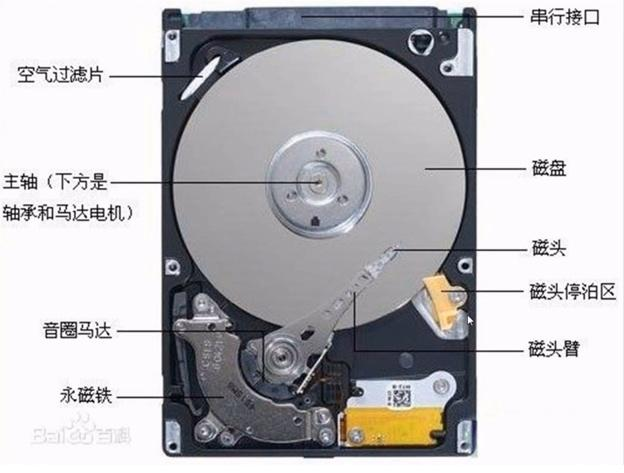

## 1.文件在磁盘中的存储
### 1.1 硬盘的工作原理



生产厂家一般会在磁盘上部署上很多磁性材料（磁力），每个磁力都会存储一个比特的，由于磁力是带有磁性的材料，分为N级和S级，磁头也是带有磁性的，通过磁头可以感受到磁力

### 1.3 文件系统索引节点

查看inode：

```
$ stat test.c
  File: 'test.c'
  Size: 217             Blocks: 8          IO Block: 4096   regular file
Device: 801h/2049d      Inode: 2376573     Links: 1
Access: (0664/-rw-rw-r--)  Uid: ( 1000/ kendall)   Gid: ( 1000/ kendall)
Access: 2021-03-28 21:48:13.593371400 -0700
Modify: 2021-03-28 21:48:13.597371423 -0700
Change: 2021-03-28 21:48:13.597371423 -0700
 Birth: -
kendall@ubuntu:~/kenwor
```

