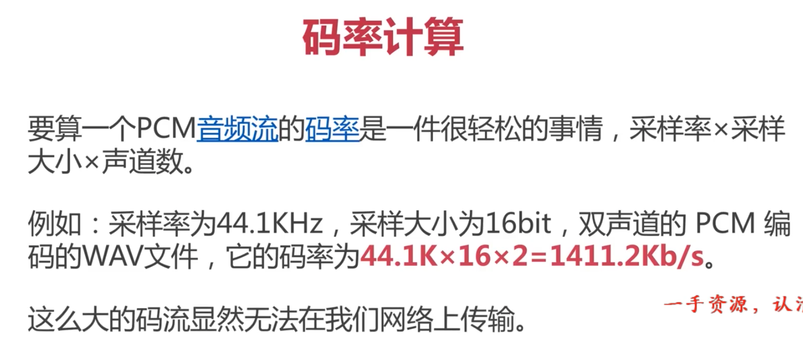
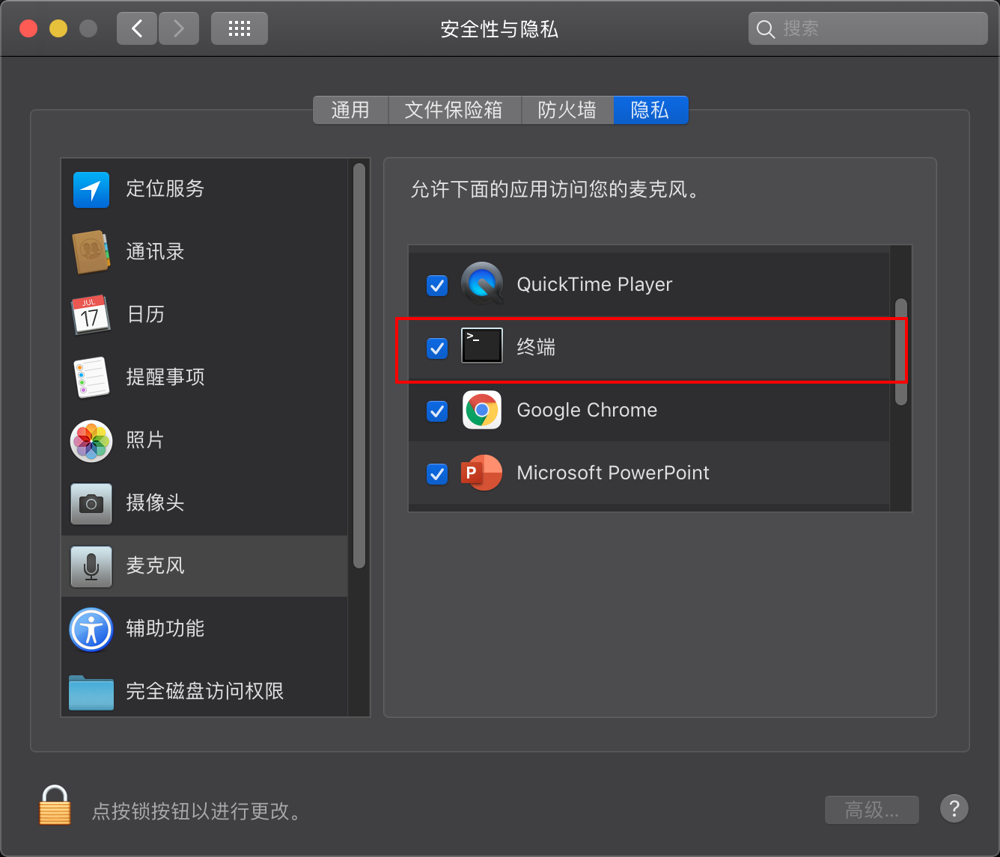
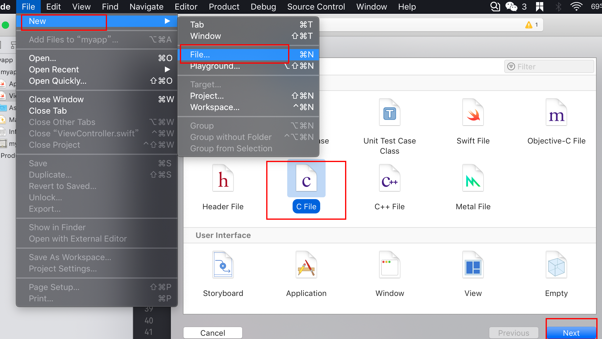
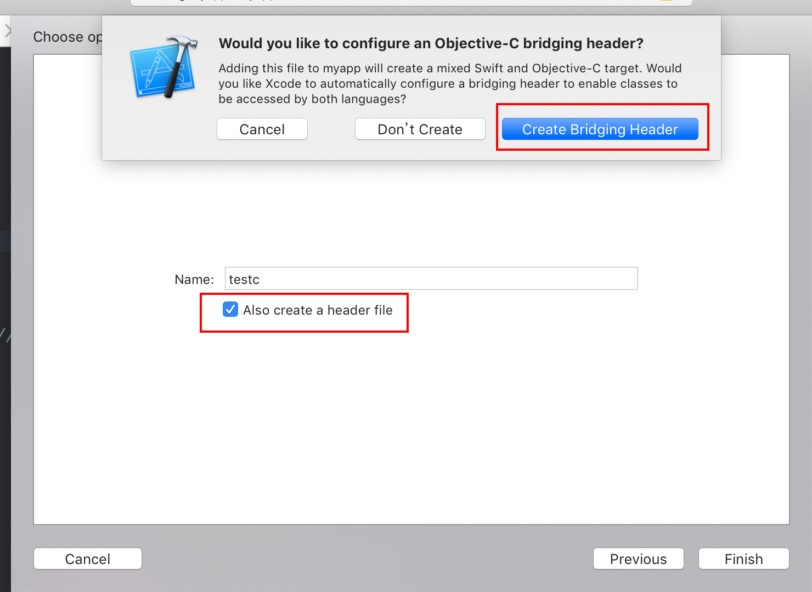
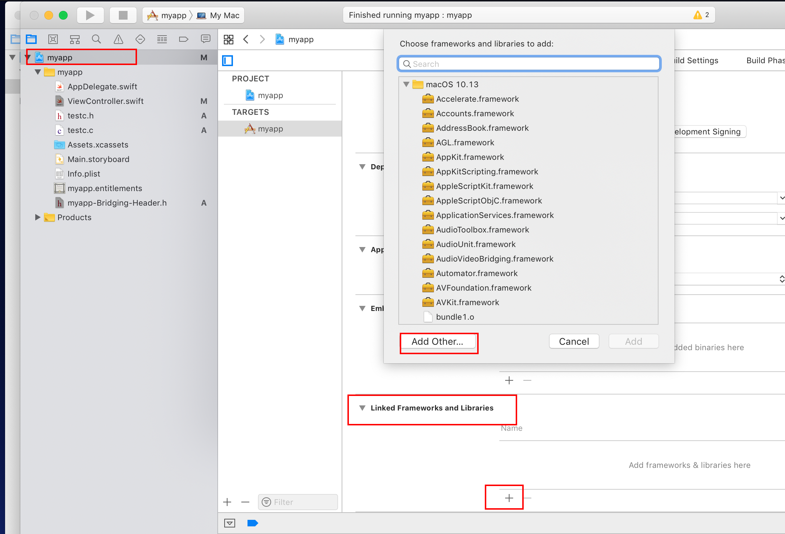
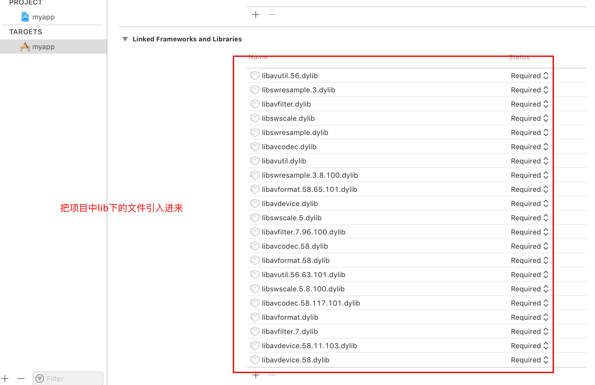
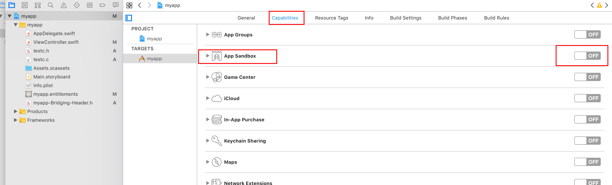
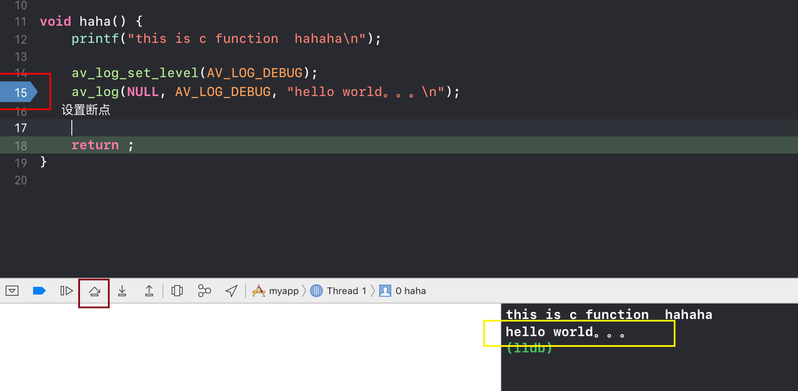
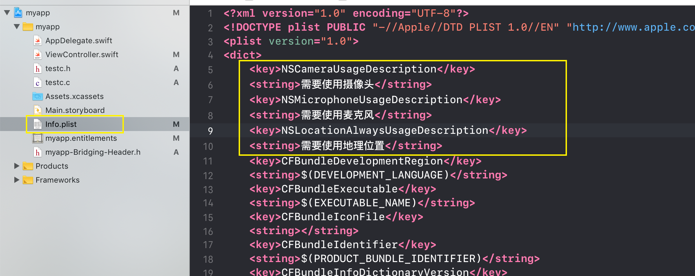
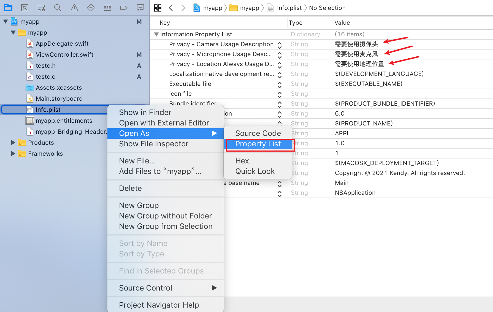

## 前期准备

下载ffmpeg
http://www.ffmpeg.org/download.html

点击download Snapshot进行下载

编译ffmpeg
```
./configure --prefix=/usr/local/ffmpeg --enable-debug=3 --disable-static --enable-shared
```

如果报错
```
nasm/yasm not found or too old. Use --disable-x86asm for a crippled build.

If you think configure made a mistake, make sure you are using the latest
version from Git.  If the latest version fails, report the problem to the
ffmpeg-user@ffmpeg.org mailing list or IRC #ffmpeg on irc.freenode.net.
Include the log file "ffbuild/config.log" produced by configure as this will help
solve the problem.
```

下载安装yasm编译器：
(http://www.tortall.net/projects/yasm/releases/yasm-1.3.0.tar.gz)

解压：把下载下来的压缩包进行解压

切换路径： cd yasm-1.3.0

执行配置： ./configure

编译：make

安装：make install（提示：Permission denied，就执行sudo make install）

重新编译ffmpeg
```
./configure --prefix=/usr/local/ffmpeg --enable-debug=3 --disable-static --enable-shared

make -j 4

sudo make install
```

基本概念




wav Header


采集音频
```
/Users/kendy/Desktop/WorkDataSplace/ffmpegTest/workspace
kendallMac:workspace kendy$ ffmpeg -f avfoundation -i :0 out.wav
```
如果报错找不到输入设备就去设置




安装xcode 创建项目 Cacoa APP项目
开始编写mac app
```swift
//
//  ViewController.swift
//  myapp
//
//  Created by Kendy on 2021/1/21.
//  Copyright © 2021 Kendy. All rights reserved.
//

import Cocoa

class ViewController: NSViewController {

    override func viewDidLoad() {
        super.viewDidLoad()

        // Do any additional setup after loading the view.
        //设置窗口大小
        self.view.setFrameSize(NSSize(width: 320, height: 240))
        
        
        //设置按钮
        let btn = NSButton.init(title: "button",target: nil,action: nil)
        //设置按钮的参数
        btn.title = "hello"
        btn.frame = NSRect(x: 320/2-40, y: 240/2-15, width: 80,height: 30)
        btn.bezelStyle = .rounded
        btn.setButtonType(.pushOnPushOff)
        //设置回调函数
        btn.target = self
        btn.action = #selector(myfunc)
//        将按钮放置在窗口中
        self.view.addSubview(btn)
        
        
    }
    @objc
    func myfunc() {
        print("hello world")
    }

    override var representedObject: Any? {
        didSet {
        // Update the view, if already loaded.
        }
    }
}
```

使用swift调用c函数

创建一个c文件




testc.c
```c
#include "testc.h"

void haha() {
    printf("this is c function  hahaha\n");
    
    return ;
}
```

testc.h
```c
#ifndef testc_h
#define testc_h

#include <stdio.h>

void haha(void);

#endif /* testc_h */
```

在桥接文件中添加c函数
myapp-Bridging-Header.h
```c
#import "testc.h"
```

引入ffmpeg库文件进行开发
```
kendallMac:myapp kendy$ pwd
/Users/kendy/Desktop/WorkDataSplace/xcodeWorkSplace/myapp/myapp
$ cp -r /usr/local/ffmpeg/include include
$ cp -r /usr/local/ffmpeg/lib lib
```

添加库文件到项目中，点击项目名->general




添加头文件


 关掉App Sandbox

 


- 测试是否能成功

testc.c
```c
#include "testc.h"

void haha() {
    printf("this is c function  hahaha\n");
    
    av_log_set_level(AV_LOG_DEBUG);
    av_log(NULL, AV_LOG_DEBUG, "hello world。。。\n");
    
    
    return ;
}
```

testc.h
```
#ifndef testc_h
#define testc_h

#include <stdio.h>

#include "libavutil/avutil.h"

void haha(void);

#endif /* testc_h */
```


出现上述执行结果说明已经库已经执行成功了

## 打开音频设备

流程：

> 打开输入输出设备 --> 数据包 --> 输出文件

步骤：


```c
  //
//  testc.c
//  myapp
//
//  Created by Kendy on 2021/1/22.
//  Copyright © 2021 Kendy. All rights reserved.
//

#include "stdio.h"
#include "testc.h"

void haha() {
    printf("this is c function  hahaha\n");
    
    int ret = 0;
    char errors[1024];
    //ctx
    AVFormatContext *fmt_ctx = NULL;
    AVDictionary *options = NULL;
    
    //[[video device]:[audio device]]
    char *devicename = ":0";
    
    
    
    //1 注册所有的设备
    avdevice_register_all();
    
    //2 get format
    AVInputFormat *iformat = av_find_input_format("avfoundation");
    
    //3 打开设备
    //如果打开成功就返回0
    //open device
//    int avformat_open_input(AVFormatContext **ps, const char *url, ff_const59 AVInputFormat *fmt, AVDictionary **options);
    if((ret = avformat_open_input(&fmt_ctx, devicename, iformat, &options)) < 0 ){
        av_strerror(ret, errors, 1024);
        fprintf(stderr, "Failed to open audio device, [%d]%s\n", ret, errors);
        return;
    }
    
    av_log_set_level(AV_LOG_DEBUG);
    av_log(NULL, AV_LOG_DEBUG, " 运行到这里 AV_LOG_DEBUG。。。\n");
    
      
    return ;
}

```
testc.h

```c
#define testc_h

#include <stdio.h>

#include "libavutil/avutil.h"
#include "libavdevice/avdevice.h"
#include "libavformat/avformat.h"
 

void haha(void);

#endif /* testc_h */

```


报错：
```
this is c function  hahaha
2021-01-22 13:17:44.476903+0800 myapp[52929:1237377] [] CMIOUnitFigBaseObjectImpl.c:246:CMIOUnitCreateFromDescription Invalid paramater
2021-01-22 13:17:44.527064+0800 myapp[52929:1237377] [] CMIO_Unit_Input_HAL.cpp:985:GetPropertyInfo CMIOUInputBase::GetPropertyInfo failed for ID 102, Error: -67456
```
因为xcode没有打开设备的权限



添加代码：
```
    <key>NSCameraUsageDescription</key>
    <string>需要使用摄像头</string>
    <key>NSMicrophoneUsageDescription</key>
    <string>需要使用麦克风</string>
    <key>NSLocationAlwaysUsageDescription</key>
    <string>需要使用地理位置</string>
```

查看是否添加成功



```
sudo sqlite3 /Users/kendy/Library/Application\ Support/com.apple.TCC/TCC.db "INSERT or REPLACE INTO access VALUES('kTCCServiceCamera','com.apple.dt.Xcode',0,1,1,NULL,NULL,NULL,'UNUSED',NULL,0,1577993260);"
```

采集音频数据代码：

```cpp
  //
//  testc.c
//  myapp
//
//  Created by Kendy on 2021/1/22.
//  Copyright © 2021 Kendy. All rights reserved.
//

#include "stdio.h"
#include "testc.h"

void haha() {
    printf("this is c function  hahaha\n");
    
    int ret = 0;
    char errors[1024];
    
    //ctx
    AVFormatContext *fmt_ctx = NULL;
    AVDictionary *options = NULL;
    
    //[[video device]:[audio device]]
    char *devicename = ":0";
    
    
    
    //1 注册所有的设备
    avdevice_register_all();
    
    //2 get format
    AVInputFormat *iformat = av_find_input_format("avfoundation");
    
    //3 打开设备
    //如果打开成功就返回0
    //open device
//    int avformat_open_input(AVFormatContext **ps, const char *url, ff_const59 AVInputFormat *fmt, AVDictionary **options);
    if((ret = avformat_open_input(&fmt_ctx, devicename, iformat, &options)) < 0 ){
        av_strerror(ret, errors, 1024);
        fprintf(stderr, "Failed to open audio device, [%d]%s\n", ret, errors);
        return;
    }
    
    int count = 0;
    
    //pakcet
    AVPacket pkt;

    //读数据
    //先进行初始化
    av_init_packet(&pkt);
    while((ret = av_read_frame(fmt_ctx, &pkt) && count++< 500) == 0) {
        printf("----- pkt size is %d ----\n",pkt.size);
    }
//    printf("ret = %d\n",ret);
//    printf("----- pkt size is %d ----\n",pkt.size);
    av_packet_unref(&pkt);
    
    av_log_set_level(AV_LOG_DEBUG);
    av_log(NULL, AV_LOG_DEBUG, " 运行到这里 AV_LOG_DEBUG。。。\n");
    
      
    return ;
}
```

对代码进行优化

