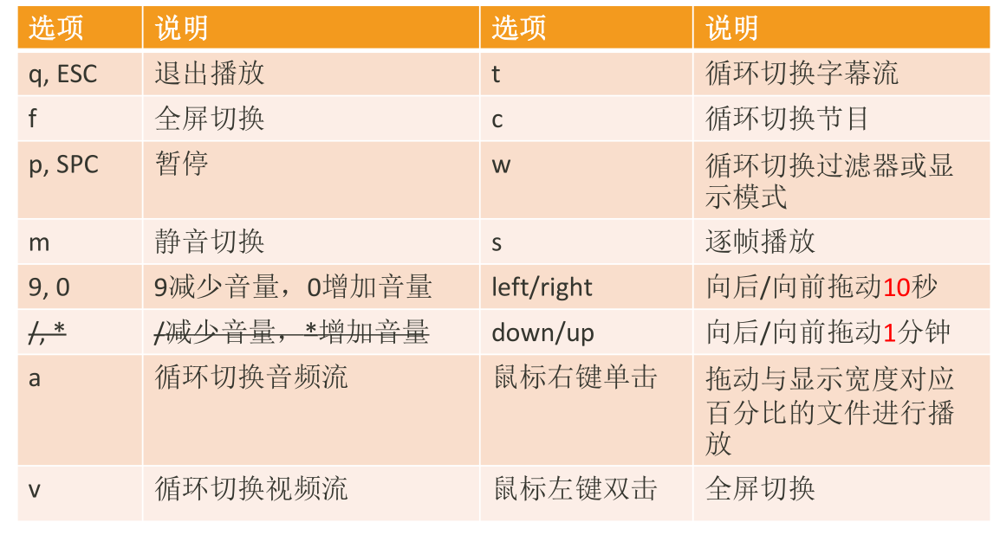

## ffmpeg基础

ffmpeg:音视频解码器

ffplay:媒体播放器

ffprobe:多媒体流分析器

### ffmpeg常看帮助文档命令

```
查看基本信息： ffmpeg -h    1
高级信息：ffmpeg -h long	2
所有信息：ffmpeg -h full	3

3包括2包括1

ffplay -h 
ffprobe -h
```

### ffmpeg音视频处理流程

```
ffmpeg -i test_1920x1080.mp4 -acodec copy -vcodec libx264 -s 1280x720 test_1280x720.flv


# -acodec copy 音频编码器采用的是copy方式
# -vcodec libx264 视频编码器采用的是x264
s 1280x720 对视频进行处理，转成1280x720分辨率
```


### ffmpeg命令分类查询

 

`-filters 加水印那些时候用`

查看具体分类所支持的参数
```
语法：ffmepg -h type=name

比如：ffmpeg -h muxer=flv
ffmpeg -h filter=atempo (atempo调整音频播放速率)
ffmpeg -h encoder=libx264
```
### ffplay播放控制



```
 ffplay -volume 10 mult.ts  # 设置初始音量为10
 然后可以用a切换音频流，
 用v切换视频流
 用c是切换整个节目，包括音频和视频
 ```

 ### ffplay命令

 ```
-x width 强制显示宽带。
-y height 强制显示高度。

ffplay -volume 10 -x 800 -y 600 test_1920x1080.mp4

 -video_size size 帧尺寸 设置显示帧存储(WxH格式)，仅适用于类似
原始YUV等没有包含帧大小(WxH)的视频。

 -pixel_format format 格式设置像素格式。

 比如: ffplay -pixel_format yuv420p -video_size 320x240 -framerate 5 yuv420p_320x240.yuv

 -fs 以全屏模式启动。
 -an 禁用音频（不播放声音）
 -vn 禁用视频（不播放视频）
 -sn 禁用字幕（不显示字幕）
 -ss pos 根据设置的秒进行定位拖动，注意时间单位：比如'55' 55
seconds, '12:03:45' ,12 hours, 03 minutes and 45 seconds, '23.189' 23.189
second

ffplay -volume 10 -x 800 -y 600 test_1920x1080.mp4 -ss 2:03:30
ffplay -volume 10 -x 800 -y 600 test_1920x1080.mp4 -ss 355s


 -t duration 设置播放视频/音频长度，时间单位如 -ss选项

ffplay -volume 10 -x 800 -y 600 test_1920x1080.mp4 -ss 355s -t 5
# 5秒后就暂停
 ```

 