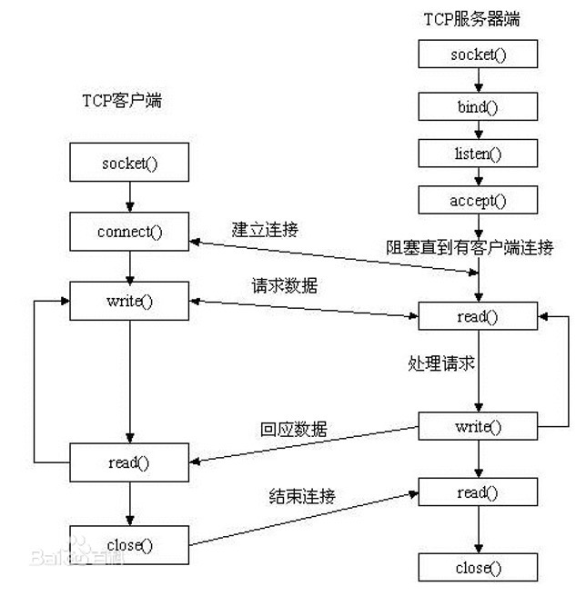
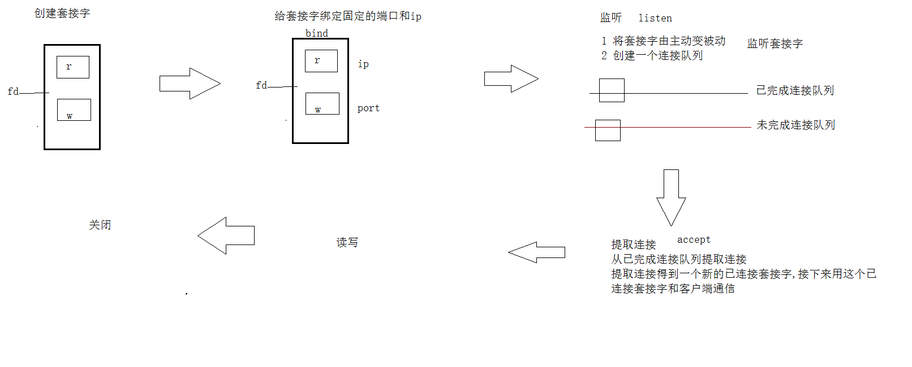
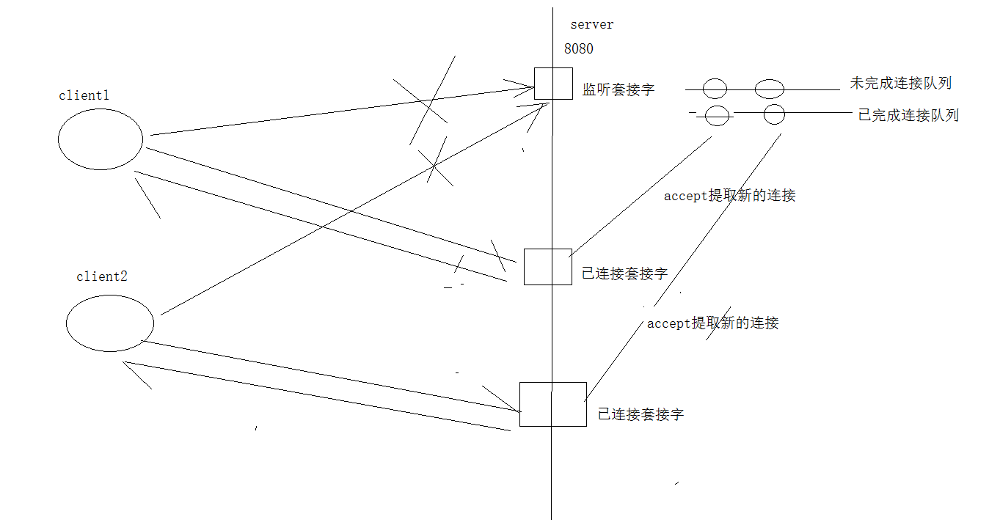

## 字节序

- 网络字节序和主机字节序的转换函数
  
```c
#include <arpa/inet.h>

uint32_t htonl(uint32_t hostlong);
uint16_t htons(uint16_t hostshort);
uint32_t ntohl(uint32_t netlong);
uint16_t ntohs(uint16_t netshort);
```
h表示host，n表示network，l表示32位长整数，s表示16位短整数。

如果主机是小端字节序，这些函数将参数做相应的大小端转换然后返回，如果主机是大端字节序，这些函数不做转换，将参数原封不动地返回


```c
#include <arpa/inet.h>
#include <stdio.h>

int main(int argc, char *argv[])
{
    char buf[4]={192,168,1,2};
    int num = *(int *)buf;
    int sum = htonl(num);  //转成大端的
    unsigned char *p = &sum;

    printf("%d %d %d %d\n",*p,*(p+1),*(p+2),*(p+3));
 
    unsigned short a = 0x0102;
    unsigned short b = htons(a);

    printf("%x\n",b);

    return 0;
}

```

### IP地址转换函数
```c
	#include <arpa/inet.h>
	int inet_pton(int af, const char *src, void *dst);
	const char *inet_ntop(int af, const void *src, char *dst, socklen_t size);

```

支持IPv4和IPv6

其中`inet_pton`和`inet_ntop`不仅可以转换IPv4的`in_addr`，还可以转换IPv6的`in6_addr`

```c
#include <arpa/inet.h>
#include <stdio.h>

int main() {

    char buf[] = "192.168.1.2";

// int inet_pton(int af, const char *src, void *dst);
    //转成大端存到num中
    unsigned int num = 0;
    inet_pton(AF_INET,buf,&num);
    unsigned char * p = (unsigned char *)&num;
	printf("大端数据：%d %d %d %d\n",*p,*(p+1),*(p+2),*(p+3));  //大端数据：192 168 1 2

    //将大端数据转成点分十进制

    char ip[16] = "";
    printf("点分十进制：%s\n",inet_ntop(AF_INET,&num,ip,16)); //点分十进制：192.168.1.2
    return 0;
}
```

## socket函数编程

写一个客户端，然后用`NetAssis`模拟服务端，进行通信。

```c
创建套接字API
#include <sys/socket.h>
int socket(int domain, int type, int protocol);
创建套接字
参数:
domain:AF_INET
type: SOCK_STREAM 流式套接字 用于tcp通信
protocol: 0
成功返回文件描述符,失败返回-1
/// =================
连接服务器
#include <sys/socket.h>
 int connect(intsockfd , const struct sockaddr *addr,
                   socklen_t addrlen);
功能: 连接服务器

sockfd:  socket套接字
addr:  ipv4套接字结构体的地址
addrlen: ipv4套接字结构体的长度
```

client.c

```c
#include <stdio.h>
#include <unistd.h>
#include <arpa/inet.h>
#include <sys/socket.h>

//模拟客户端和服务器之间的通信
int main() {

    // 创建套接字
    int sock_fd;
    sock_fd = socket(AF_INET,SOCK_STREAM,0);  //协议，流式套接字，tcp通信

    //连接服务器
    struct sockaddr_in addr;
    addr.sin_family = AF_INET;  //协议
    addr.sin_port = htons(8080);  //转成大端
    //将点分十进制转成32位
    inet_pton(AF_INET,"192.168.100.3",&addr.sin_addr.s_addr);
    connect(sock_fd,(struct sockaddr *)&addr,sizeof(addr));
    //读写数据
    char buf[1024] = "";
    while(1) {
        int n = read(STDIN_FILENO,buf,sizeof(buf));
        //发送数据给服务器
        write(sock_fd,buf,sizeof(buf));

        //从服务端获取数据
        n = read(sock_fd,buf,sizeof(buf));
        write(STDOUT_FILENO,buf,n);
        printf("\n");
        
    }
    //关闭
    close(sock_fd);

    return 0;
}
```

## TCP通信
- 对于服务器，通信流程一般如下
```
调用 socket 函数创建 socket（侦听socket）
调用 bind 函数 将 socket绑定到某个ip和端口的二元组上
调用 listen 函数 开启侦听
当有客户端请求连接上来后，调用 accept 函数接受连接，产生一个新的 socket（客户端 socket）
基于新产生的 socket 调用 send 或 recv 函数开始与客户端进行数据交流
通信结束后，调用 close 函数关闭侦听 socket
```

- 对于客户端，通信流程如下：
```
调用 socket函数创建客户端 socket
调用 connect 函数尝试连接服务器
连接成功以后调用 send 或 recv 函数开始与服务器进行数据交流
通信结束后，调用 close 函数关闭侦听socket
```


流程图：





编写服务端

需要用到的API
```c
bind绑定
给套接字绑定固定的端口和ip
#include <sys/socket.h>
  int bind(int sockfd, const struct sockaddr *addr,
                socklen_t addrlen);

sockfd: 套接字
addr: ipv4套接字结构体地址
addrlen: ipv4套接字结构体的大小
返回值:
成功返回0 失败返回;-1

 listen
#include <sys/socket.h>
int listen(int sockfd, int backlog);
参数:
    sockfd : 套接字
    backlog :  已完成连接队列和未完成连接队里数之和的最大值  128
    
 accept
#include <sys/socket.h>
 int accept(int socket, struct sockaddr *restrict address,
           socklen_t *restrict address_len);
如果连接队列没有新的连接,accept会阻塞

功能: 从已完成连接队列提取新的连接
参数:
    socket : 套接字
    address : 获取的客户端的的ip和端口信息  iPv4套接字结构体地址
    address_len: iPv4套接字结构体的大小的地址
socklen_t len = sizeof(struct sockaddr );

返回值:  新的已连接套接字的文件描述符
```

