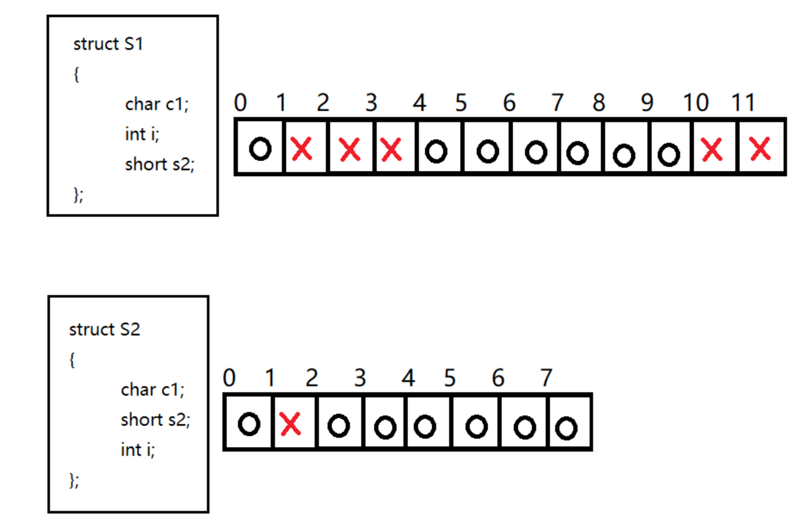
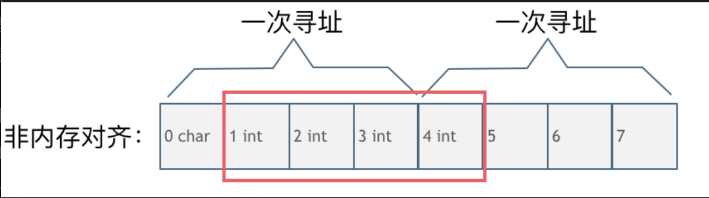

## main函数执行之前和执行之后有什么区别?

首先我们来看一段代码

```cpp
#include <iostream>
using namespace std;
class A {
public:
    A() {
        cout << "this is A Contructor" << endl;
    }
    ~A() {
        cout << "this is A distructor" << endl;
    }
};

A a;

int main() {
    cout << "this is main" << endl;
    return 0;
}
```

程序输出：

```
this is A Contructor
this is main
this is A distructor
```
会发现最终打印的不仅仅是`this is main`这句话

以前我总以为所有的代码都是在`main`函数执行之后才会执行的,但其实不是这样的，`main`函数只不过是提供了一个函数的入口而已，在`main`函数中的代码在执行之前，编译器会生成`_main`函数，这时候会进行所有全局对象的构造以及初始化工作。简单的说就是静态变量、全局变量和全局对象的分配是在`main`函数之前完成的，所以`C++`中并非所有的动作都是由于`main`函数引起的。

同样在`main()`函数执行后,程序退出，这时候对全局变量和全局对象进行销毁操作，所以在`main()`函数之后还会执行相应的代码

还可以使用`ateit()`函数，使`main()`函数之后可以执行其他函数。

```cpp
void fun1() {
    cout << "this is fun1" << endl;
}
void fun2() {
    cout << "this is fun2" << endl;
}
int main() {
    atexit(fun1);
    atexit(fun2);
    cout << "this is main" << endl;
    return 0;
}
```

执行结果：
```
this is main
this is fun2
this is fun1
```

## 结构体的内存对齐

**内存对齐是一种用空间换时间以提高效率的方式**。

**为什么会有内存对齐**？

主要是两个原因

- 平台原因：不是所有的硬件平台都能访问任意内存地址上的任意数据，某些硬件平台只能在某些地址处取某些特定类型的数据，否则抛出硬件异常。为了同一个程序可以在多平台运行，需要内存对齐。

- 硬件原因：经过内存对齐后，`CPU`访问内存的速度大大提升。

可以看一下这段C++代码输出的各个数据类型大小是多少？
```cpp
struct node{
   int num;
   char cha;
}st;
int main() {
    int a[100];
    char b[100];
    cout << sizeof(int) << endl;
    cout << sizeof(char) << endl;
    cout << sizeof(a) << endl;
    cout << sizeof(b) << endl;
    cout << sizeof(st) << endl;
}
```
看一下和自己想的结果一样么， 我们来逐一分析一下。

其输出的结果依次为：
```
4
1
400
100
8
```
此时会发现，和单纯计算字节数的话是有一些误差的。

这就是因为内存对齐的原因。

**来看一下内存对齐和非内存对齐产生的效果区别**。

`CPU`读取内存不是一次读取单个字节，而是一块一块的来读取内存，块的大小可以是`2，4，8，16`个字节，具体取多少个字节取决于硬件。

假设`CPU`把内存划分为`4`字节大小的块，要读取一个`4`字节大小的`int`型数据，来看一下这两种情况下`CPU`的工作量：

第一种就是内存对齐的情况，如图



一字节的`char`占用了四个字节，空了三个字节的内存地址，`int`数据从地址`4`开始。

此时，直接将地址`4，5，6，7`处的四个字节数据读取到即可。

第二种是没有内存对齐的情况如图：



`char`型的数据和`int`型的数据挨在一起，这个`int`数据从地址`1`开始，那么`CPU`想要读这个数据的话,来看看需要几步操作：

因为`CPU`是四个字节四个字节来寻址，

首先`CPU`读取`0，1，2，3`处的四个字节数据

然后`CPU`读取`4，5，6，7`处的四个字节数据

最后还要合并地址`1，2，3，4`处四个字节的数据才是本次操作需要的`int`数据

此时**一共需要两次寻址，一次合并的操作**。

大家可能会发现内存对齐岂不是浪费的内存资源么？

是这样的，但事实上，相对来说计算机内存资源一般都是充足的，我们更希望的是提高运行速度。

编译器一般都会做内存对齐的优化操作，也就是说当考虑程序真正占用的内存大小的时候，也需要认识到内存对齐的影响。

## 指针和引用的区别

* 指针是一个新的变量，指向另一个变量的地址，我们可以通过访问这个地址来修改另一个变量；而引用是一个别名，对引用的操作就是对变量的本身进行操作
* 指针可以有多级，引用只有一级
* 传参的时候，使用指针的话需要解引用才能对参数进行修改，而使用引用可以直接对参数进行修改
* 指针的大小一般是4个字节，引用的大小取决于被引用对象的大小
* 指针可以为空，引用不可以。
* 引用一旦进行初始化之后，不会再改变其指向；但指针可以

```cpp
void test(int *p) {
    int a = 1;
    p = &a;
    cout << "p = " << p << endl;  // p = 0x7ffeef7836f4  指针指向的是一个变量的地址
    cout << "*p = " << *p << endl; // *p = 1  

    int &b = a;  //b只是a的别名,引用必须初始化，不能为空
    cout << "b = a = " <<  b << endl; //b = a = 1
    // 更改b，a也会更改，对引用的操作就是对变量的本身进行操作
    b = 2;
    cout << "a = " << a << endl; //a = 2
}

int main() {
    int *p = NULL;  //指针可以为空
    test(p);
    return 0;
}
```
《[**点击查看 C++引用详细介绍**](/C++随记/03C++中引用理解和应用.md)》


## 有没有了解过(复制)拷贝构造函数
1.1 拷贝构造函数是一种特殊的构造函数，函数名称必须和类的名称一致，它只有一个参数，参数类型是本类的引用。

1.2 它的作用是用来复制对象，使用这个对象的实例来初始化这个对象的另一个实例

1.3 复制构造函数被调用的三种情况：
- 当用一个对象去初始化同类的另一个对象时，复制构造函数会被调用
```cpp
Complex c2(c1);
Complex c2 = c1;
```
- 函数的返回值是类A的对象时，则类A的复制构造函数会被调用
- 当函数的参数为类的对象时，复制构造函数会被调用
```cpp
#include<iostream>
using namespace std;
class A{
public:
    A(){};
    A(A & a){
        cout<<"Copy constructor called"<<endl;
    }
};
//函数的参数为类A的对象a
void Func(A a){ }
int main(){
    A a;
    Func(a);
    return 0;
}
```
程序的输出结果为：      
`Copy constructor called`           
这是因为 Func 函数的形参 a 在初始化时调用了复制构造函数。

1.4 此外，拷贝构造函数默认为**浅拷贝**，浅拷贝是指当前类进行等号赋值时，它能够完成静态成员的值复制。当数据成员中没有指针时，浅拷贝是可行的。但是当数据成员中有指针时，如果采用简单的浅拷贝，那么这两个类中的指针将指向同一个地址，对象即将结束时，两个类会分别调用析构函数，导致指针悬挂现象。所以这时必须采用深拷贝，在堆内存中另外申请空间来储存数据，防止指针悬挂现象。

1.5 还有就是，拷贝构造函数必须是引用传递，不能是值传递，这是为了防止递归引用。

> 这时候大概率会问深拷贝和浅拷贝。深拷贝与浅拷贝可以参考我的[另一篇文章](/C++随记/C++深拷贝和浅拷贝.md)

## 说一下深拷贝和浅拷贝

- 浅拷贝将源对象的值拷贝到目标对象中去，也就是说源对象和目标对象使用的还是同一个实体，只是他们的变量名不同，但是它们的地址是相同的。
- 深拷贝在拷贝时先开辟出和源对象大小一样的空间，然后将源对象里的内容拷贝到目标拷贝对象中去，这样两个指针就指向了不同的内存位置，并且里面的内容还是一样的。在拷贝构造函数中深拷贝可以解决指针悬挂问题。

## 堆和栈有什么区别

* 栈，栈由系统自动分配，存储的是一些临时变量，包括局部变量，返回值，参数，返回地址等等。栈空间是有存储大小的，如果超过这个大小将会出现栈溢出。
* 堆，是一个比较大的内存空间，主要用来动态分配内存，这一部分通常由程序员进行分配和释放。如果在程序结束的时候还未释放，就会被操作系统回收。
* 堆的生长空间向上，地址越来越大，栈的生长空间向下，地址越来越小

### 堆快一点还是栈快一点？

栈快一点。因为操作系统会在底层对栈提供支持，会分配专门的寄存器存放栈的地址，栈的入栈出栈操作也十分简单，并且有专门的指令执行，所以栈的效率比较高也比较快。而堆的操作是由`C/C++`函数库提供的，堆在分配和释放时都要调用函数（`malloc,free`)，比如分配时会到堆空间去寻找足够大小的空间（因为多次分配释放后会造成内存碎片），这些都会花费一定的时间。并且获取堆的内容需要两次访问，第一次访问指针，第二次根据指针保存的地址访问内存，因此堆比较慢。

## C ++内存管理(内存分区) **重点**

在操作系统中，不同应用程序之间的内存时相互独立的，一般不能互相进行访问。

一个引用程序的内存一般分成四个区：

- 栈区：栈区存储的是一些临时变量，包括局部变量，返回值，参数，返回地址等等。栈空间是有存储大小的，如果超过这个大小将会出现栈溢出。
- 堆区：堆区是一个比较大的内存空间，主要用来动态分配内存，这一部分通常由程序员进行分配和释放。如果在程序结束的时候还未释放，就会被操作系统回收。
- 数据区：数据区主要存放的是全局变量、常量和静态变量。数据区又可以分为全局区和静态区(常量区)
- 代码区：代码区存储的就是可执行的代码，这个区域的属性是只读的。


编写一段代码来了解内存四区的底层结构

```cpp
#include<stdio.h>
int main()
{
 int a = 0;
 int b = 0;
 char c='0';
 printf("变量int a的地址是：%d\n变量int b的地址是：%d\n变量char c的地址是：%d\n", &a, &b, &c);
}
```

运行结果

```
变量int a的地址是：-332826852
变量int b的地址是：-332826856
变量char c的地址是：-332826857
```

可以发现`a b c` 的地址是连续的，由于`int`是4个字节，所以`a`和`b`之间间隔为4，`char`是一个字节，所以`b`与`c`间隔为1。此外，它们的地址是从`a`到`c`减少的，这是因为栈的存储结构是**先进后出**。


然后我们加上静态变量`d`和全局变量`e`。

```cpp
#include<stdio.h>
int e = 0;
int main()
{
    int a = 0;
    int b = 0;
    char c='0';
    static int d = 0;
    printf("变量int a的地址是：%d\n变量int b的地址是：%d\n变量char c的地址是：%d\n", &a, &b, &c);
    printf("静态变量static int d的地址是：%d\n" ,&d);
    printf("全局变量int e的地址是：%d\n", &e);
    return 0;
}
```

运行结果：

```
变量int a的地址是：-481331432
变量int b的地址是：-481331436
变量char c的地址是：-481331437
静态变量static int d的地址是：208703516
全局变量int e的地址是：208703512
```
变量 `d` 为静态变量，运行代码后从结果上得知，静态变量 `d`的地址与一般变量 `a`、`b`、`c` 的地址并不存在连续，他们两个的内存地址是分开的。那接下来在此建一个全局变量，通过上述内容得知，全局变量与静态变量都应该存储在静态区.

而且可知**栈区、数据区都是使用栈结构对数据进行存储**。

堆并没有和栈一样的结构，也没有栈一样的先进后出，需要人为的对的内存进行分配使用。

```cpp
#include<stdio.h>
#include<string.h>
#include <malloc.h>
int main()
{
 char *p1 = (char *)malloc(1024*1000000);
 strcpy(p1, "这里是堆区");
 printf("%s\n", p1);
}
```

上面的代码使用了`malloc`开辟了一块大小为`1024*1000000`的空间，这个大小如果在栈区就会出现栈溢出的现象，而堆没有，因为堆本身就是大容量。

然后注意`p1`存储的是开辟的内存空间的地址。

### 内存泄露的定义，如何检测与避免？

内存泄露是指在动态分配内存的过程中，忘记释放掉分配的内存或者因为某些原因导致内存无法释放。如果严重的话会导致系统崩溃发生。

- 比如在一个函数中使用`malloc`函数开辟了`100`个单位的内存空间，并没有释放，如果这个函数频繁地被调用，久而久之就会出现严重的后果，所以在使用完之后应该加上`free`进行释放。

- 如果使用`fopen`打开一个文件，使用完之后没有使用`fclose`进行关闭也会导致内存泄漏。

- 还有没有被初始化的指针也会造成内存泄漏，因为指针未初始化的话它的执行是不可控的。包括错误的释放。比如

```cpp
int *p;  //指针未初始化

int pp = p;
free(pp); //错误释放，这里导致指针p出现指针悬挂现象
```

- 没有将基类的析构函数定义为虚函数，当基类指针指向子类对象时，如果基类的析构函数不是`virtual`，那么子类的析构函数将不会被调用，子类的资源没有正确释放，因此造成内存泄露


避免方法：

1. `malloc/free`要配套使用
2. 使用智能指针；
3. 将基类的析构函数设为虚函数；

### `new/delete` 与 `malloc/free` 的异同

他们都用于动态申请内存和释放。

- `new/delete` 是`C++`的运算符,`malloc/free`是`C/C++`标准库函数，
- 在`C++`中分别使用`new` 和 `delete`来分配和释放内存。`new` 和 `delete`**是运算符，不是函数**。`new/delete`相对于`malloc/free`除了分配和释放内存之外还做了其他很多事情。
  - `new` 相对于 `malloc` 会额外的做一些初始化工作，
  - `delete` 相对于 `free` 多做一些清理工作。
  - 比如说使用`new`生成一个对象时，系统会调用这个类的构造函数，使用`delete`删除一个对象时，系统会调用这个类的析构函数。


```cpp
class A
{
 public:
     A()
     {
        cont<<"A()构造函数被调用"<<endl;
     }
     ~A()
     {
        cont<<"~A()构造函数被调用"<<endl;
     }
}

//在 main 主函数中，加入如下代码

A* pa = new A();  //类 A 的构造函数被调用
delete pa;        //类 A 的析构函数被调用
```

- `new`是封装了`malloc`，直接`free`不会报错，但是这只是释放内存，而不会析构对象。

### new和delete是如何实现的？

- `new`的实现过程是：首先调用名为**operator new**的标准库函数，分配足够大的原始为类型化的内存，以保存指定类型的一个对象；接下来运行该类型的一个构造函数，用指定初始化构造对象；最后返回指向新分配并构造后的的对象的指针
- `delete`的实现过程：对指针指向的对象运行适当的析构函数；然后通过调用名为**operator delete**的标准库函数释放该对象所用内存


### `delete`和`delete[]`的区别

* `delete`只会调用一次析构函数，而`delete[]`会调用每个成员的析构函数

* 用`new`分配的内存用`delete`释放，用`new[]`分配的内存用`delete[]`释放

假如说使用`new int[10]`来开辟一个内存空间，针对这种简单类型，使用`new`分配后不管是数组还是非数组形式释放都是可以的。他们的效果是一样的，**因为分配简单类型内存的时候，内存大小已经确定，系统可以记忆并且进行管理，在析构时，系统不会调用析构函数**。它直接通过指针可以获取实际分配的内存空间，哪怕是一个数组内存空间。

```cpp
int *a = new int[10];
delete a;        //方式1
delete[] a;     //方式2

int *a = new int[10];
delete a;
delete[] a;
```

但是如果针对类`class`，两种方式就出现差异了。

```cpp
class A
{
private:
    char *m_cBuffer;
    int m_nLen;

public:
    A(){ m_cBuffer = new char[m_nLen]; }
    ~A() { delete [] m_cBuffer; }
};

A *a = new A[10];
delete a;         
//仅释放了a指针指向的(首地址)全部内存空间 
//但是只调用了a[0]对象的析构函数 
//剩下的从a[1]到a[9]这9个用户自行分配的m_cBuffer对应内存空间将不能释放 从而造成内存泄漏
delete[] a;      
//调用使用类对象的析构函数释放用户自己分配内存空间并且释放了a指针指向的全部内存空间
```

所以在用这些类生成对象数组的时候，建议用 `delete[]` 来释放。

### malloc申请的存储空间能用delete释放吗

不能，`malloc /free`主要为了兼容`C`，`new`和`delete` 完全可以取代malloc /free的。

`malloc /free`的操作对象都是必须明确大小的，而且不能用在动态类上。

`new` 和`delete`会自动进行类型检查和大小，`malloc/free`不能执行构造函数与析构函数，所以动态对象它是不行的。

当然从理论上说使用`malloc`申请的内存是可以通过`delete`释放的。不过一般不这样写的。而且也不能保证每个`C++`的运行时都能正常。

##  说一下`C++`里的智能指针

 `C++`里面的四个智能指针，`auto_ptr`，`unique_ptr`，`shared_ptr`，`weak_ptr`，其中后三个是c++11支持，并且第一个已经被`c++11`弃用。

 使用原因：智能指针的作用是管理一个指针，因为在程序设计中动态分配的堆内存没有正确释放或无法释放，导致资源浪费，程序运行速度变慢等问题。使用智能指针可以很大程度上的避免这个问题，因为智能指针是一个类，当超出了类的实例对象的作用域时，会自动调用对象的析构函数，析构函数会自动释放资源。所以智能指针的作用原理就是在函数结束时自动释放内存空间，不需要手动释放内存空间。

- `auto_ptr`：采用所有权模式。`p2`剥夺了`p1`的所有权，但是当程序运行时访问`p1`将会报错。所以`auto_ptr`的缺点是：存在潜在的内存崩溃问题。

- `unique_ptr`：实现独占式模式，保证同一时间内只有一个智能指针可以指向该对象。它对于避免资源泄露(例如“以`new`创建对象后因为发生异常而忘记调用`delete`”)特别有用，可以通过标准库的`move()`函数实现指针转移。

- `shared_ptr`：实现共享式拥有概念。多个智能指针可以指向相同对象，该对象和其相关资源会在“最后一个引用被销毁”时候释放。从名字`share`就可以看出了资源可以被多个指针共享，它使用计数机制来表明资源被几个指针共享。

- `weak_ptr`：是一种不控制对象生命周期的智能指针, `weak_ptr` 设计的目的是为配合 `shared_ptr` 而引入的一种智能指针来协助 `shared_ptr` 工作, 它只可以从一个 `shared_ptr` 或另一个 `weak_ptr` 对象构造, 它的构造和析构不会引起引用记数的增加或减少。

更详细的C++智能指针分析见《[C++智能指针](/C++随记/07C++智能指针)》

### 智能指针出现循环引用怎么解决？

弱指针用于专门解决shared_ptr循环引用的问题，weak_ptr不会修改引用计数，即其存在与否并不影响对象的引用计数器。循环引用就是：两个对象互相使用一个shared_ptr成员变量指向对方。弱引用并不对对象的内存进行管理，在功能上类似于普通指针，然而一个比较大的区别是，弱引用能检测到所管理的对象是否已经被释放，从而避免访问非法内存。

## C++中的重载和重写的区别：

* 重载（overload）是指函数名相同，参数列表不同的函数实现方法。它们的返回值可以不同，但返回值不可以作为区分不同重载函数的标志。
* 重写（overwide）是指函数名相同，参数列表相同，只有方法体不相同的实现方法。一般用于子类继承父类时对父类方法的重写。子类的同名方法屏蔽了父类方法的现象称为隐藏。

## 一个函数或者可执行文件的生成过程或者编译过程是怎样的

预处理，编译，汇编，链接

* 预处理： 对预处理命令进行替换等预处理操作
* 编译：代码优化和生成汇编代码
* 汇编：将汇编代码转化为机器语言
* 链接：将目标文件彼此链接起来

### hello.c 程序的编译过程


以下是一个 hello.c 程序：

```c
#include <stdio.h>

int main()
{
    printf("hello, world\n");
    return 0;
}


```

在 Unix 系统上，由编译器把源文件转换为目标文件。

```bash
gcc -o hello hello.c
```

这个过程大致如下：


- 预处理阶段：处理以 # 开头的预处理命令；
- 编译阶段：翻译成汇编文件；
- 汇编阶段：将汇编文件翻译成可重定位目标文件；
- 链接阶段：将可重定位目标文件和 printf.o 等单独预编译好的目标文件进行合并，得到最终的可执行目标文件。

#### 静态链接

静态链接器以一组可重定位目标文件为输入，生成一个完全链接的可执行目标文件作为输出。链接器主要完成以下两个任务：

- 符号解析：每个符号对应于一个函数、一个全局变量或一个静态变量，符号解析的目的是将每个符号引用与一个符号定义关联起来。
- 重定位：链接器通过把每个符号定义与一个内存位置关联起来，然后修改所有对这些符号的引用，使得它们指向这个内存位置。


#### 目标文件

- 可执行目标文件：可以直接在内存中执行；
- 可重定位目标文件：可与其它可重定位目标文件在链接阶段合并，创建一个可执行目标文件；
- 共享目标文件：这是一种特殊的可重定位目标文件，可以在运行时被动态加载进内存并链接；

#### 动态链接

静态库有以下两个问题：

- 当静态库更新时那么整个程序都要重新进行链接；
- 对于 printf 这种标准函数库，如果每个程序都要有代码，这会极大浪费资源。

共享库是为了解决静态库的这两个问题而设计的，在 Linux 系统中通常用 .so 后缀来表示，Windows 系统上它们被称为 DLL。它具有以下特点：

- 在给定的文件系统中一个库只有一个文件，所有引用该库的可执行目标文件都共享这个文件，它不会被复制到引用它的可执行文件中；
- 在内存中，一个共享库的 .text 节（已编译程序的机器代码）的一个副本可以被不同的正在运行的进程共享。


**源代码－－>预处理－－>编译－－>优化－－>汇编－－>链接-->可执行文件**

1)   预处理

读取c源程序，对其中的伪指令（以#开头的指令）和特殊符号进行处理。包括宏定义替换、条件编译指令、头文件包含指令、特殊符号。 预编译程序所完成的基本上是对源程序的“替代”工作。经过此种替代，生成一个没有宏定义、没有条件编译指令、没有特殊符号的输出文件。.i预处理后的c文件，.ii预处理后的C++文件。

2)   编译阶段

编译程序所要作得工作就是通过词法分析和语法分析，在确认所有的指令都符合语法规则之后，将其翻译成等价的中间代码表示或汇编代码。.s文件

3)   汇编过程

汇编过程实际上指把汇编语言代码翻译成目标机器指令的过程。对于被翻译系统处理的每一个C语言源程序，都将最终经过这一处理而得到相应的目标文件。目标文件中所存放的也就是与源程序等效的目标的机器语言代码。.o目标文件

4)   链接阶段

链接程序的主要工作就是将有关的目标文件彼此相连接，也即将在一个文件中引用的符号同该符号在另外一个文件中的定义连接起来，使得所有的这些目标文件成为一个能够诶操作系统装入执行的统一整体。

## C++模板是什么，你知道底层怎么实现的?

1) 编译器并不是把函数模板处理成能够处理任意类的函数;编译器从函数模板通过具体类型产生不同 的函数;编译器会对函数模板进行两次编译:在声明的地方对模板代码本身进行编译，在调用的地方对 参数替换后的代码进行编译。

2) 这是因为函数模板要被实例化后才能成为真正的函数，在使用函数模板的源文件中包含函数模板的 头文件，如果该头文件中只有声明，没有定义，那编译器无法实例化该模板，最终导致链接错误。

#### 模板会写吗？写一个比较大小的模板函数

```cpp
#include<iostream> 

using namespace std; 
template<typename type1,typename type2>//函数模板 

type1 Max(type1 a,type2 b) 

 { 

   return a > b ? a : b; 

} 

void main() 

 { 

  cout<<"Max = "<<Max(5.5,'a')<<endl; 

} 
```

## define 和const的联系与区别（编译阶段、安全性、内存占用等）

**联系**：它们都是定义常量的一种方法。

**区别**：

* `define`定义的常量没有类型，只是进行了简单的替换，可能会有多个拷贝，占用的内存空间大，`const`定义的常量是有类型的，存放在静态存储区，只有一个拷贝，占用的内存空间小。
* `define`定义的常量是在预处理阶段进行替换，而`const`在编译阶段确定它的值。
* `define`不会进行类型安全检查，而`const`会进行类型安全检查，安全性更高。
* `const`可以定义函数而`define`不可以。

### 在C\+\+中const的用法（定义，用途）

* const修饰类的成员变量时，表示常量不能被修改
* const修饰类的成员函数，表示该函数不会修改类中的数据成员，不会调用其他非const的成员函数

## C++中的static用法和意义

static的意思是静态的，可以用来修饰变量，函数和类成员。

* 变量：被static修饰的变量就是静态变量，它会在程序运行过程中一直存在，会被放在静态存储区。局部静态变量的作用域在函数体中，全局静态变量的作用域在这个文件里。

* 函数：被static修饰的函数就是静态函数，静态函数只能在本文件中使用，不能被其他文件调用，也不会和其他文件中的同名函数冲突。

* 类：而在类中，被static修饰的成员变量是类静态成员，这个静态成员会被类的多个对象共用。被static修饰的成员函数也属于静态成员，不是属于某个对象的，访问这个静态函数不需要引用对象名，而是通过引用类名来访问。

> 【note】静态成员函数要访问非静态成员时，要用过对象来引用。局部静态变量在函数调用结束后也不会被回收，会一直在程序内存中，直到该函数再次被调用，它的值还是保持上一次调用结束后的值。

> 注意和const的区别。const强调值不能被修改，而static强调唯一的拷贝，对所有类的对象都共用。

### 定义和声明的区别

* 声明是告诉编译器变量的类型和名字，不会为变量分配空间

* 定义就是对这个变量和函数进行内存分配和初始化。需要分配空间，同一个变量可以被声明多次，但是只能被定义一次

### `typdef`和`define`区别

`#define`是预处理命令，在预处理是执行简单的替换，不做正确性的检查

`typedef`是在编译时处理的，它是在自己的作用域内给已经存在的类型一个别名


## `C`和`C++`的区别

包括但不限于：

* `C`是面向过程的语言，`C++`是面向对象的语言，`C++`有“**封装，继承和多态**”的特性。封装隐藏了实现细节，使得代码模块化。继承通过子类继承父类的方法和属性，实现了代码重用。多态则是“一个接口，多个实现”，通过子类重写父类的虚函数，实现了接口重用。
* `C`和`C++`内存管理的方法不一样，`C`使用`malloc/free`，`C++`除此之外还用`new/delete`
* 标准`C++`中的字符串类取代了标准`C`函数库头文件中的字符数组处理函数（`C`中没有字符串类型）。
* `C++`中用来做控制态输入输出的`iostream`类库替代了标准`C`中的`stdio`函数库。
* 在`C++`中，允许有相同的函数名，不过它们的参数类型不能完全相同，这样这些函数就可以相互区别开来。而这在`C`语言中是不允许的。也就是`C++`可以重载，`C`语言不允许。
* `C++`语言中，允许变量定义语句在程序中的任何地方，只要在是使用它之前就可以；而`C`语言中，必须要在函数开头部分。而且`C++`允许重复定义变量，`C`语言也是做不到这一点的
* 在`C++`中，除了值和指针之外，新增了引用。引用型变量是其他变量的一个别名，我们可以认为他们只是名字不相同，其他都是相同的。
* `C++`相对与`C`增加了一些关键字，如：`bool、using、dynamic_cast、namespace`等等
* `C++`中的`try/catch/throw`异常处理机制取代了标准`C`中的`setjmp()`和`longjmp()`函数。

### 介绍面向对象的三大特性，并且举例说明每一个

面向对象的三大特性是：封装，继承和多态。

* **封装**隐藏了类的实现细节和成员数据，实现了代码模块化，并且类可以把自己的数据和方法只让可信的类或者对象操作，例如：将公共的数据或方法使用`public`修饰，而不希望被访问的数据或方法采用`private`修饰。

* **继承**使得子类可以复用父类的成员和方法，实现了代码重用；
  * 常见的继承有三种方式：

  1. 实现继承：指使用基类的属性和方法而无需额外编码的能力
  2. 接口继承：指仅使用属性和方法的名称、但是子类必须提供实现的能力
  3. 可视继承：指子窗体（类）使用基窗体（类）的外观和实现代码的能力（C++里好像不怎么用）
   
例如，将人定义为一个抽象类，拥有姓名、性别、年龄等公共属性，吃饭、睡觉、走路等公共方法，在定义一个具体的人时，就可以继承这个抽象类，既保留了公共属性和方法，也可以在此基础上扩展跳舞、唱歌等特有方法

* **多态**则是“一个接口，多个实现”，通过子类重写父类的虚函数，实现了接口重用。如父类的指针指向子类的对象。

### 多态的实现

**C++ 多态包括编译时多态和运行时多态，编译时多态体现在函数重载和模板上，运行时多态体现在虚函数上。**

#### 实现多态的过程

**（1）**编译器在发现基类中有虚函数时，会自动为每个含有虚函数的类生成一份虚表，该表是一个一维数组，虚表里保存了虚函数的入口地址

**（2）**编译器会在每个对象的前四个字节中保存一个虚表指针，即**vptr**(虚表指针)，指向对象所属类的虚表。在构造时，根据对象的类型去初始化虚指针vptr，从而让vptr指向正确的虚表，从而在调用虚函数时，能找到正确的函数

**（3）**所谓的合适时机，在派生类定义对象时，程序运行会自动调用构造函数，在构造函数中创建虚表并对虚表初始化。在构造子类对象时，会先调用父类的构造函数，此时，编译器只“看到了”父类，并为父类对象初始化虚表指针，令它指向父类的虚表；当调用子类的构造函数时，为子类对象初始化虚表指针，令它指向子类的虚表

**（4）**当派生类对基类的虚函数没有重写时，派生类的虚表指针指向的是基类的虚表；当派生类对基类的虚函数重写时，派生类的虚表指针指向的是自身的虚表；当派生类中有自己的虚函数时，在自己的虚表中将此虚函数地址添加在后面

这样指向派生类的基类指针在运行时，就可以根据派生类对虚函数重写情况动态的进行调用，从而实现多态性。


#### C++虚函数相关（虚函数表，虚函数指针），虚函数的实现原理（热门，重要）

虚函数：在基类的函数前加上`virtual`关键字，在派生类中重写该函数，运行时将会根据对象的实际类型来调用相应的函数。如果对象类型是派生类，就调用派生类的函数；如果对象类型是基类，就调用基类的函数.

`C++`的虚函数是实现多态的机制。它是通过虚函数表实现的，虚函数表是每个类中存放虚函数地址的指针数组，类的实例在调用函数时会在虚函数表中寻找函数地址进行调用，如果子类覆盖了父类的函数，则子类的虚函数表会指向子类实现的函数地址，否则指向父类的函数地址。一个类的所有实例都共享同一张虚函数表。

详见：[C++虚函数表剖析](https://blog.csdn.net/lihao21/article/details/50688337)

* 如果多重继承和多继承的话，子类的虚函数表长什么样子？
  多重继承的情况下越是祖先的父类的虚函数更靠前，多继承的情况下越是靠近子类名称的类的虚函数在虚函数表中更靠前。详见：https://blog.csdn.net/qq_36359022/article/details/81870219

### 实现编译器处理虚函数表应该如何处理

编译器处理虚函数的方法是：
如果类中有虚函数，就将虚函数的地址记录在类的虚函数表中。派生类在继承基类的时候，如果有重写基类的虚函数，就将虚函数表中相应的函数指针设置为派生类的函数地址，否则指向基类的函数地址。
为每个类的实例添加一个虚表指针（vptr），虚表指针指向类的虚函数表。实例在调用虚函数的时候，通过这个虚函数表指针找到类中的虚函数表，找到相应的函数进行调用。
详见：[虚函数的作用及其底层实现机制](https://blog.csdn.net/iFuMI/article/details/51088091)

### 基类的析构函数一般写成虚函数的原因

首先析构函数可以为虚函数，当析构一个指向子类的父类指针时，编译器可以根据虚函数表寻找到子类的析构函数进行调用，从而正确释放子类对象的资源。

如果析构函数不被声明成虚函数，则编译器实施静态绑定，在删除指向子类的父类指针时，只会调用父类的析构函数而不调用子类析构函数，这样就会造成子类对象析构不完全造成内存泄漏。

### 构造函数为什么一般不定义为虚函数

1）因为创建一个对象时需要确定对象的类型，而虚函数是在运行时确定其类型的。而在构造一个对象时，**由于对象还未创建成功，编译器无法知道对象的实际类型**，是类本身还是类的派生类等等

2）虚函数的调用需要虚函数表指针，而该指针存放在对象的内存空间中；若构造函数声明为虚函数，那么由于对象还未创建，还没有内存空间，更没有虚函数表地址用来调用虚函数即构造函数了

#### 构造函数或者析构函数中调用虚函数会怎样

在构造函数中调用虚函数，由于当前对象还没有构造完成，此时调用的虚函数指向的是基类的函数实现方式。

在析构函数中调用虚函数，此时调用的是子类的函数实现方式。

### 纯虚函数

纯虚函数是只有声明没有实现的虚函数，是对子类的约束，是接口继承

包含纯虚函数的类是抽象类，它不能被实例化，只有实现了这个纯虚函数的子类才能生成对象

使用场景：当这个类本身产生一个实例没有意义的情况下，把这个类的函数实现为纯虚函数，比如动物可以派生出老虎兔子，但是实例化一个动物对象就没有意义。并且可以规定派生的子类必须重写某些函数的情况下可以写成纯虚函数。

### 虚函数和纯虚函数区别？

- 虚函数是为了实现动态编联产生的，目的是通过基类类型的指针指向不同对象时，自动调用相应的、和基类同名的函数（使用同一种调用形式，既能调用派生类又能调用基类的同名函数）。虚函数需要在基类中加上virtual修饰符修饰，因为virtual会被隐式继承，所以子类中相同函数都是虚函数。当一个成员函数被声明为虚函数之后，其派生类中同名函数自动成为虚函数，在派生类中重新定义此函数时要求函数名、返回值类型、参数个数和类型全部与基类函数相同。

- 纯虚函数只是相当于一个接口名，但含有纯虚函数的类不能够实例化。


纯虚函数首先是虚函数，其次它没有函数体，取而代之的是用“=0”。

既然是虚函数，它的函数指针会被存在虚函数表中，由于纯虚函数并没有具体的函数体，因此它在虚函数表中的值就为0，而具有函数体的虚函数则是函数的具体地址。

一个类中如果有纯虚函数的话，称其为抽象类。抽象类不能用于实例化对象，否则会报错。抽象类一般用于定义一些公有的方法。子类继承抽象类也必须实现其中的纯虚函数才能实例化对象。

举个例子：

```C++
#include <iostream>
using namespace std;

class Base
{
public:
	virtual void fun1()
	{
		cout << "普通虚函数" << endl;
	}
	virtual void fun2() = 0;
	virtual ~Base() {}
};

class Son : public Base
{
public:
	virtual void fun2() 
	{
		cout << "子类实现的纯虚函数" << endl;
	}
};

int main()
{
	Base* b = new Son;
	b->fun1(); //普通虚函数
	b->fun2(); //子类实现的纯虚函数
	return 0;
}
```

### 静态绑定和动态绑定的介绍

[C++中的静态绑定和动态绑定](https://www.cnblogs.com/lizhenghn/p/3657717.html)

静态绑定也就是将该对象相关的属性或函数绑定为它的静态类型，也就是它在声明的类型，在编译的时候就确定。在调用的时候编译器会寻找它声明的类型进行访问。

动态绑定就是将该对象相关的属性或函数绑定为它的动态类型，具体的属性或函数在运行期确定，通常通过虚函数实现动态绑定。

### (**超重要**)构造函数为什么不能为虚函数？析构函数为什么要虚函数？

1、 **从存储空间角度，**虚函数相应一个指向vtable虚函数表的指针，这大家都知道，但是这个指向vtable的指针事实上是存储在对象的内存空间的。

问题出来了，假设构造函数是虚的，就须要通过 vtable来调用，但是对象还没有实例化，也就是内存空间还没有，怎么找vtable呢？所以构造函数不能是虚函数。

2、 **从使用角度，**虚函数主要用于在信息不全的情况下，能使重载的函数得到相应的调用。

构造函数本身就是要初始化实例，那使用虚函数也没有实际意义呀。

所以构造函数没有必要是虚函数。虚函数的作用在于通过父类的指针或者引用来调用它的时候可以变成调用子类的那个成员函数。而构造函数是在创建对象时自己主动调用的，不可能通过父类的指针或者引用去调用，因此也就规定构造函数不能是虚函数。

3、**构造函数不须要是虚函数，也不同意是虚函数，**由于创建一个对象时我们总是要明白指定对象的类型，虽然我们可能通过实验室的基类的指针或引用去訪问它但析构却不一定，我们往往通过基类的指针来销毁对象。这时候假设析构函数不是虚函数，就不能正确识别对象类型从而不能正确调用析构函数。

4、**从实现上看**，**vbtl在构造函数调用后才建立，因而构造函数不可能成为虚函数从实际含义上看，在调用构造函数时还不能确定对象的真实类型（由于子类会调父类的构造函数）；并且构造函数的作用是提供初始化，在对象生命期仅仅运行一次，不是对象的动态行为，也没有必要成为虚函数。

5、当一个构造函数被调用时，它做的首要的事情之中的一个是初始化它的VPTR。

因此，它仅仅能知道它是“当前”类的，而全然忽视这个对象后面是否还有继承者。当编译器为这个构造函数产生代码时，它是为这个类的构造函数产生代码——既不是为基类，也不是为它的派生类（由于类不知道谁继承它）。所以它使用的VPTR必须是对于这个类的VTABLE。

并且，仅仅要它是最后的构造函数调用，那么在这个对象的生命期内，VPTR将保持被初始化为指向这个VTABLE, 但假设接着另一个更晚派生的构造函数被调用，这个构造函数又将设置VPTR指向它的 VTABLE，等.直到最后的构造函数结束。

VPTR的状态是由被最后调用的构造函数确定的。这就是为什么构造函数调用是从基类到更加派生类顺序的还有一个理由。可是，当这一系列构造函数调用正发生时，每一个构造函数都已经设置VPTR指向它自己的VTABLE。假设函数调用使用虚机制，它将仅仅产生通过它自己的VTABLE的调用，而不是最后的VTABLE（全部构造函数被调用后才会有最后的VTABLE）。

因为构造函数本来就是为了明确初始化对象成员才产生的，然而virtual function主要是为了再不完全了解细节的情况下也能正确处理对象。另外，virtual函数是在不同类型的对象产生不同的动作，现在对象还没有产生，如何使用virtual函数来完成你想完成的动作。

> 直接的讲，C++中基类采用virtual虚析构函数是为了防止内存泄漏。

具体地说，如果派生类中申请了内存空间，并在其析构函数中对这些内存空间进行释放。假设基类中采用的是非虚析构函数，当删除基类指针指向的派生类对象时就不会触发动态绑定，因而只会调用基类的析构函数，而不会调用派生类的析构函数。那么在这种情况下，派生类中申请的空间就得不到释放从而产生内存泄漏。

所以，为了防止这种情况的发生，C++中基类的析构函数应采用virtual虚析构函数。

### 析构函数的作用，如何起作用？

构造函数只是起初始化值的作用，但实例化一个对象的时候，可以通过实例去传递参数，从主函数传递到其他的函数里面，这样就使其他的函数里面有值了。
规则，只要你一实例化对象，系统自动回调用一个构造函数就是你不写，编译器也自动调用一次。

析构函数与构造函数的作用相反，用于撤销对象的一些特殊任务处理，可以是释放对象分配的内存空间；特点：析构函数与构造函数同名，但该函数前面加~。
析构函数没有参数，也没有返回值，而且不能重载，在一个类中只能有一个析构函数。 当撤销对象时，编译器也会自动调用析构函数。

每一个类必须有一个析构函数，用户可以自定义析构函数，也可以是编译器自动生成默认的析构函数。一般析构函数定义为类的公有成员。

### 构造函数和析构函数可以调用虚函数吗，为什么
在C++中，提倡不在构造函数和析构函数中调用虚函数；

构造函数和析构函数调用虚函数时都不使用动态联编，如果在构造函数或析构函数中调用虚函数，则运行的是为构造函数或析构函数自身类型定义的版本；

因为父类对象会在子类之前进行构造，此时子类部分的数据成员还未初始化，因此调用子类的虚函数时不安全的，故而C++不会进行动态联编；

析构函数是用来销毁一个对象的，在销毁一个对象时，先调用子类的析构函数，然后再调用基类的析构函数。所以在调用基类的析构函数时，派生类对象的数据成员已经销毁，这个时候再调用子类的虚函数没有任何意义。

### 构造函数、析构函数的执行顺序？构造函数和拷贝构造的内部都干了啥？
1) 构造函数顺序

① 基类构造函数。如果有多个基类，则构造函数的调用顺序是某类在类派生表中出现的顺序，而不是它们在成员初始化表中的顺序。

② 成员类对象构造函数。如果有多个成员类对象则构造函数的调用顺序是对象在类中被声明的顺序，而不是它们出现在成员初始化表中的顺序。

③ 派生类构造函数。

2) 析构函数顺序

① 调用派生类的析构函数；

② 调用成员类对象的析构函数；

③ 调用基类的析构函数。

### 虚析构函数的作用，父类的析构函数是否要设置为虚函数？
C++中基类采用virtual虚析构函数是为了防止内存泄漏。
具体地说，如果派生类中申请了内存空间，并在其析构函数中对这些内存空间进行释放。

假设基类中采用的是非虚析构函数，当删除基类指针指向的派生类对象时就不会触发动态绑定，因而只会调用基类的析构函数，而不会调用派生类的析构函数。

那么在这种情况下，派生类中申请的空间就得不到释放从而产生内存泄漏。

所以，为了防止这种情况的发生，C++中基类的析构函数应采用virtual虚析构函数。

纯虚析构函数一定得定义，因为每一个派生类析构函数会被编译器加以扩张，以静态调用的方式调用其每一个虚基类以及上一层基类的析构函数。
因此，缺乏任何一个基类析构函数的定义，就会导致链接失败，最好不要把虚析构函数定义为纯虚析构函数。

### 构造函数析构函数可否抛出异常

C++只会析构已经完成的对象，对象只有在其构造函数执行完毕才算是完全构造妥当。在构造函数中发生异常，控制权转出构造函数之外。
因此，在对象b的构造函数中发生异常，对象b的析构函数不会被调用。因此会造成内存泄漏。

用auto_ptr对象来取代指针类成员，便对构造函数做了强化，免除了抛出异常时发生资源泄漏的危机，不再需要在析构函数中手动释放资源；

如果控制权基于异常的因素离开析构函数，而此时正有另一个异常处于作用状态，C++会调用terminate函数让程序结束；

如果异常从析构函数抛出，而且没有在当地进行捕捉，那个析构函数便是执行不全的。如果析构函数执行不全，就是没有完成他应该执行的每一件事情。

81、构造函数一般不定义为虚函数的原因
（1）创建一个对象时需要确定对象的类型，而虚函数是在运行时动态确定其类型的。在构造一个对象时，由于对象还未创建成功，编译器无法知道对象的实际类型

（2）虚函数的调用需要虚函数表指针vptr，而该指针存放在对象的内存空间中，若构造函数声明为虚函数，那么由于对象还未创建，还没有内存空间，更没有虚函数表vtable地址用来调用虚构造函数了

（3）虚函数的作用在于通过父类的指针或者引用调用它的时候能够变成调用子类的那个成员函数。而构造函数是在创建对象时自动调用的，不可能通过父类或者引用去调用，因此就规定构造函数不能是虚函数

（4）析构函数一般都要声明为虚函数，这个应该是老生常谈了，这里不再赘述

> 《为什么C++不能有虚构造函数，却可以有虚析构函数》：https://dwz.cn/lnfW9H6m

### 类什么时候会析构？
对象生命周期结束，被销毁时；

delete指向对象的指针时，或delete指向对象的基类类型指针，而其基类虚构函数是虚函数时；

对象i是对象o的成员，o的析构函数被调用时，对象i的析构函数也被调用。

### 构造函数或者析构函数中可以调用虚函数吗
简要结论：

从语法上讲，调用完全没有问题。
但是从效果上看，往往不能达到需要的目的。

>《Effective C++》的解释是： 派生类对象构造期间进入基类的构造函数时，对象类型变成了基类类型，而不是派生类类型。 同样，进入基类析构函数时，对象也是基类类型。

举个例子：
```cpp
#include<iostream>
using namespace std;

class Base
{
public:
    Base()
    {
       Function();
    }

    virtual void Function()
    {
        cout << "Base::Fuction" << endl;
    }
	~Base()
	{
		Function();
	}
};

class A : public Base
{
public:
    A()
    {
      Function();
    }

    virtual void Function()
    {
        cout << "A::Function" << endl;
    }
	~A()
	{
		Function();
	}
};

int main()
{
    Base* a = new Base;
	delete a;
	cout << "-------------------------" <<endl;
	Base* b = new A;//语句1
	delete b;
}
//输出结果
//Base::Fuction
//Base::Fuction
//-------------------------
//Base::Fuction
//A::Function
//Base::Fuction
```

语句1讲道理应该体现多态性，执行类A中的构造和析构函数，从实验结果来看，语句1并没有体现，执行流程是先构造基类，所以先调用基类的构造函数，构造完成再执行A自己的构造函数，析构时也是调用基类的析构函数，也就是说构造和析构中调用虚函数并不能达到目的，应该避免

>《构造函数或者析构函数中调用虚函数会怎么样？》：https://dwz.cn/TaJTJONX

#### 哪些函数不能是虚函数？把你知道的都说一说

1)  构造函数，构造函数初始化对象，派生类必须知道基类函数干了什么，才能进行构造；当有虚函数时，每一个类有一个虚表，每一个对象有一个虚表指针，虚表指针在构造函数中初始化；

2)  内联函数，内联函数表示在编译阶段进行函数体的替换操作，而虚函数意味着在运行期间进行类型确定，所以内联函数不能是虚函数；

3)  静态函数，静态函数不属于对象属于类，静态成员函数没有this指针，因此静态函数设置为虚函数没有任何意义。

4)  友元函数，友元函数不属于类的成员函数，不能被继承。对于没有继承特性的函数没有虚函数的说法。

5)  普通函数，普通函数不属于类的成员函数，不具有继承特性，因此普通函数没有虚函数。

### 静态函数能定义为虚函数吗？常函数呢？说说你的理解

1、static成员不属于任何类对象或类实例，所以即使给此函数加上virutal也是没有任何意义的。

2、静态与非静态成员函数之间有一个主要的区别，那就是静态成员函数没有this指针。

虚函数依靠vptr和vtable来处理。vptr是一个指针，在类的构造函数中创建生成，并且只能用this指针来访问它，因为它是类的一个成员，并且vptr指向保存虚函数地址的vtable.对于静态成员函数，它没有this指针，所以无法访问vptr。

这就是为何static函数不能为virtual，虚函数的调用关系：this -> vptr -> vtable ->virtual function

### C++中struct和class的区别
相同点

两者都拥有成员函数、公有和私有部分
任何可以使用class完成的工作，同样可以使用struct完成
不同点

两者中如果不对成员不指定公私有，struct默认是公有的，class则默认是私有的

class默认是private继承，而struct模式是public继承

#### C++和C的struct区别

`C`语言中：`struct`是用户自定义数据类型（UDT）；C++中struct是抽象数据类型（ADT），支持成员函数的定义，（C++中的struct能继承，能实现多态）

`C`中`struct`是没有权限的设置的，且`struct`中只能是一些变量的集合体，可以封装数据却不可以隐藏数据，而且成员不可以是函数

`C++`中，struct增加了访问权限，且可以和类一样有成员函数，成员默认访问说明符为public（为了与C兼容）

`struct`作为类的一种特例是用来自定义数据结构的。一个结构标记声明后，在C中必须在结构标记前加上struct，才能做结构类型名（除：`typedef struct class{};`）;C++中结构体标记（结构体名）可以直接作为结构体类型名使用，此外结构体`struct`在`C++`中被当作类的一种特例

>《struct结构在C和C++中的区别》：https://blog.csdn.net/mm_hh/article/details/70456240

## 说一说strcpy、sprintf与memcpy这三个函数的不同之处

1)  操作对象不同

①   strcpy的两个操作对象均为字符串 

②   sprintf的操作源对象可以是多种数据类型，目的操作对象是字符串 

③   memcpy的两个对象就是两个任意可操作的内存地址，并不限于何种数据类型。

2)  执行效率不同

memcpy最高，strcpy次之，sprintf的效率最低。

3)  实现功能不同

①   strcpy主要实现字符串变量间的拷贝 

②   sprintf主要实现其他数据类型格式到字符串的转化 

③   memcpy主要是内存块间的拷贝。

### strcpy函数和strncpy函数的区别？哪个函数更安全？

1)  函数原型

~~~cpp
char* strcpy(char* strDest, const char* strSrc)
char* strncpy(char* strDest, const char* strSrc, int pos)

~~~

2)  strcpy函数: 如果参数 dest 所指的内存空间不够大，可能会造成缓冲溢出(buffer Overflow)的错误情况，在编写程序时请特别留意，或者用strncpy()来取代。 
 strncpy函数：用来复制源字符串的前n个字符，src 和 dest 所指的内存区域不能重叠，且 dest 必须有足够的空间放置n个字符。 

3)  如果目标长>指定长>源长，则将源长全部拷贝到目标长，自动加上’\0’ 
 如果指定长<源长，则将源长中按指定长度拷贝到目标字符串，不包括’\0’ 
 如果指定长>目标长，运行时错误 ；

## C++ 11有哪些新特性

- `nullptr`替代 `NULL`
- 引入了 `auto` 和 `decltype` 这两个关键字实现了类型推导 基于范围的 `for` 循环`for(auto& i : res){}` 类和结构体的中初始化列表
- `Lambda` 表达式(匿名函数) `std::forward_list`(单向链表)
- 右值引用和`move`语义
- 新的智能指针 `unique_ptr`和`shared_ptr`

## 说一下C++左值引用和右值引用

`C++11`正是通过引入右值引用来优化性能，具体来说是通过移动语义来避免无谓拷贝的问题，通过move语义来将临时生成的左值中的资源无代价的转移到另外一个对象中去，通过完美转发来解决不能按照参数实际类型来转发的问题（同时，完美转发获得的一个好处是可以实现移动语义）。

在C++11中所有的值必属于左值、右值两者之一，右值又可以细分为纯右值、将亡值。在C++11中可以取地址的、有名字的就是左值，反之，不能取地址的、没有名字的就是右值（将亡值或纯右值）。举个例子，i`nt a = b+c`, `a` 就是左值，其有变量名为a，通过&a可以获取该变量的地址；表达式`b+c`、函数`int func()`的返回值是右值，在其被赋值给某一变量前，我们不能通过变量名找到它，＆(b+c)这样的操作则不会通过编译。

`C++11`对`C++98`中的右值进行了扩充。在C++11中右值又分为纯右值（`prvalue，Pure Rvalue`）和将亡值（`xvalue，eXpiring Value`）。其中纯右值的概念等同于我们在C++98标准中右值的概念，指的是临时变量和不跟对象关联的字面量值；将亡值则是`C++11`新增的跟右值引用相关的表达式，这样表达式通常是将要被移动的对象（移为他用），比如返回右值引用T&&的函数返回值、`std::move`的返回值，或者转换为T&&的类型转换函数的返回值。将亡值可以理解为通过“盗取”其他变量内存空间的方式获取到的值。在确保其他变量不再被使用、或即将被销毁时，通过“盗取”的方式可以避免内存空间的释放和分配，能够延长变量值的生命期。

左值引用就是对一个左值进行引用的类型。右值引用就是对一个右值进行引用的类型，事实上，由于右值通常不具有名字，我们也只能通过引用的方式找到它的存在。右值引用和左值引用都是属于引用类型。无论是声明一个左值引用还是右值引用，都必须立即进行初始化。而其原因可以理解为是引用类型本身自己并不拥有所绑定对象的内存，只是该对象的一个别名。左值引用是具名变量值的别名，而右值引用则是不具名（匿名）变量的别名。左值引用通常也不能绑定到右值，但常量左值引用是个“万能”的引用类型。它可以接受非常量左值、常量左值、右值对其进行初始化。不过常量左值所引用的右值在它的“余生”中只能是只读的。相对地，非常量左值只能接受非常量左值对其进行初始化。

右值值引用通常不能绑定到任何的左值，要想绑定一个左值到右值引用，通常需要std::move()将左值强制转换为右值。

**左值和右值**

- 左值：表示的是可以获取地址的表达式，它能出现在赋值语句的左边，对该表达式进行赋值。但是修饰符const的出现使得可以声明如下的标识符，它可以取得地址，但是没办法对其进行赋值

`const int& a = 10;`

- 右值：表示无法获取地址的对象，有常量值、函数返回值、lambda表达式等。无法获取地址，但不表示其不可改变，当定义了右值的右值引用时就可以更改右值。

**左值引用和右值引用**

- 左值引用：传统的C++中引用被称为左值引用

- 右值引用：C++11中增加了右值引用，右值引用关联到右值时，右值被存储到特定位置，右值引用指向该特定位置，也就是说，右值虽然无法获取地址，但是右值引用是可以获取地址的，该地址表示临时对象的存储位置

**这里主要说一下右值引用的特点**：

特点1：通过右值引用的声明，右值又“重获新生”，其生命周期与右值引用类型变量的生命周期一样长，只要该变量还活着，该右值临时量将会一直存活下去

特点2：右值引用独立于左值和右值。意思是右值引用类型的变量可能是左值也可能是右值

特点3：T&& t在发生自动类型推断的时候，它是左值还是右值取决于它的初始化。
举个例子：
```cpp
#include <bits/stdc++.h>
using namespace std;

template<typename T>
void fun(T&& t)
{
	cout << t << endl;
}

int getInt()
{
	return 5;
}

int main() {
	
	int a = 10;
	int& b = a;  //b是左值引用
	int& c = 10;  //错误，c是左值不能使用右值初始化
	int&& d = 10;  //正确，右值引用用右值初始化
	int&& e = a;  //错误，e是右值引用不能使用左值初始化
	const int& f = a; //正确，左值常引用相当于是万能型，可以用左值或者右值初始化
	const int& g = 10;//正确，左值常引用相当于是万能型，可以用左值或者右值初始化
	const int&& h = 10; //正确，右值常引用
	const int& aa = h;//正确
	int& i = getInt();  //错误，i是左值引用不能使用临时变量（右值）初始化
	int&& j = getInt();  //正确，函数返回值是右值
	fun(10); //此时fun函数的参数t是右值
	fun(a); //此时fun函数的参数t是左值
	return 0;
}
```
> 《c++右值引用以及使用》：https://www.cnblogs.com/likaiming/p/9045642.html

> 《从4行代码看右值引用》：https://www.cnblogs.com/likaiming/p/9029908.**html**

## 成员函数里memset(this,0,sizeof(*this))会发生什么

1)  有时候类里面定义了很多int,char,struct等c语言里的那些类型的变量，我习惯在构造函数中将它们初始化为0，但是一句句的写太麻烦，所以直接就memset(this, 0, sizeof *this);将整个对象的内存全部置为0。对于这种情形可以很好的工作，但是下面几种情形是不可以这么使用的；

2)  类含有虚函数表：这么做会破坏虚函数表，后续对虚函数的调用都将出现异常；

3)  类中含有C++类型的对象：例如，类中定义了一个list的对象，由于在构造函数体的代码执行之前就对list对象完成了初始化，假设list在它的构造函数里分配了内存，那么我们这么一做就破坏了list对象的内存。

## 你知道回调函数吗？它的作用？

1)  当发生某种事件时，系统或其他函数将会自动调用你定义的一段函数；

2)  回调函数就相当于一个中断处理函数，由系统在符合你设定的条件时自动调用。为此，你需要做三件事：1，声明；2，定义；3，设置触发条件，就是在你的函数中把你的回调函数名称转化为地址作为一个参数，以便于系统调用；

3)  回调函数就是一个通过函数指针调用的函数。如果你把函数的指针（地址）作为参数传递给另一个函数，当这个指针被用为调用它所指向的函数时，我们就说这是回调函数；

4)  因为可以把调用者与被调用者分开。调用者不关心谁是被调用者，所有它需知道的，只是存在一个具有某种特定原型、某些限制条件（如返回值为int）的被调用函数。

## C++如何解决头文件重复问题

http://c.biancheng.net/view/7636.html

