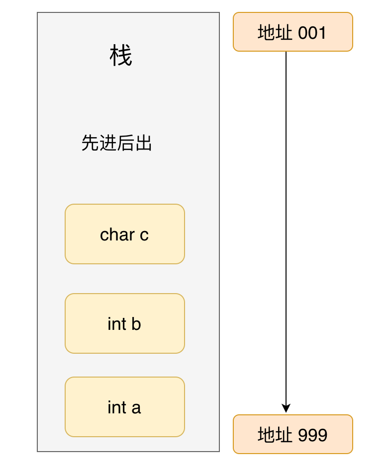

> 这部分为引导式面试方式整理      
> 建议通过浏览器上面的`<-  ->`两个按钮控制各个关联的跳转


## `C`和`C++`的区别

包括但不限于：

* `C`是面向过程的语言，`C++`是面向对象的语言，所以`C++`也就具有面向对象的三大特性。分别是“**封装，继承和多态**”  ==> [介绍面向对象的三大特性，并且举例说明每一个](/寻offer总结/Cpp基础/Cpp知识点02?id=介绍面向对象的三大特性，并且举例说明每一个)

* `C`和`C++`内存管理的方法不同。`C`使用`malloc/free`，`C++`除此之外还用`new/delete`。==> [malloc/free和new/delete的区别](/寻offer总结/Cpp基础/Cpp知识点02?id=newdelete-与-mallocfree-的异同)

* `C`中的结构体`struct`和`C++`的类的也是有区别的。
* `C++支`持函数重载，`C`不支持函数重载。
* `C++`中有引用，而`C`没有。
* 内外链接区别
* 关键字
* 其他

### 介绍面向对象的三大特性，并且举例说明每一个

面向对象的三大特性是：封装，继承和多态。

* **封装**：隐藏了类的实现细节和成员数据，实现了代码模块化，并且类可以把自己的数据和方法只让可信的类或者对象操作，例如：将公共的数据或方法使用`public`修饰，而不希望被访问的数据或方法采用`private`修饰。

* **继承**：让子类可以继承父类的成员和方法，实现了代码重用；
  * 常见的继承有三种方式：

  1. 实现继承：指使用基类的属性和方法，子类不需要额外实现
  2. 接口继承：指仅仅使用属性和方法的名称、但是子类必须提供实现的能力
  3. 可视继承：指子窗体（类）使用基窗体（类）的外观和实现代码的能力（C++里好像不怎么用）
   
  例如，将人定义为一个抽象类，拥有姓名、性别、年龄等公共属性，吃饭、睡觉、走路等公共方法，在定义一个具体的人时，就可以继承这个抽象类，既保留了公共属性和方法，也可以在此基础上扩展跳舞、唱歌等特有方法

* **多态**：是“一个接口，多个实现”，通过子类重写父类的虚函数，实现了接口重用。如父类的指针指向子类的对象。C++多态包括编译时多态和运行时多态，编译时多态体现在函数重载和模板上，运行时多态体现在虚函数上。**虚函数是实现多态的机制**。==>[多态的实现](/寻offer总结/Cpp基础/Cpp知识点02?id=多态的实现) ==>[C++虚函数相关](/寻offer总结/Cpp基础/Cpp知识点02?id=c虚函数相关，虚函数的实现原理（热门，重要）)

### 多态的实现

**C++多态包括编译时多态和运行时多态，编译时多态体现在函数重载和模板上，运行时多态体现在虚函数上。**

#### 实现多态的过程

**（1）**编译器在发现基类中有虚函数时，会自动为每个含有虚函数的类生成一份虚表，该表是一个一维数组，虚表里保存了虚函数的入口地址

**（2）**编译器会在每个对象的前四个字节中保存一个虚表指针，即**vptr**(虚表指针)，指向对象所属类的虚表。在构造时，根据对象的类型去初始化虚指针vptr，从而让vptr指向正确的虚表，从而在调用虚函数时，能找到正确的函数

**（3）**所谓的合适时机，在派生类定义对象时，程序运行会自动调用构造函数，在构造函数中创建虚表并对虚表初始化。在构造子类对象时，会先调用父类的构造函数，此时，编译器只“看到了”父类，并为父类对象初始化虚表指针，令它指向父类的虚表；当调用子类的构造函数时，为子类对象初始化虚表指针，令它指向子类的虚表

**（4）**当派生类对基类的虚函数没有重写时，派生类的虚表指针指向的是基类的虚表；当派生类对基类的虚函数重写时，派生类的虚表指针指向的是自身的虚表；当派生类中有自己的虚函数时，在自己的虚表中将此虚函数地址添加在后面

这样指向派生类的基类指针在运行时，就可以根据派生类对虚函数重写情况动态的进行调用，从而实现多态性。

### C++虚函数相关，虚函数的实现原理（热门，重要）

虚函数：在基类的函数前加上`virtual`关键字，在派生类中重写该函数，运行时将会根据对象的实际类型来调用相应的函数。如果对象类型是派生类，就调用派生类的函数；如果对象类型是基类，就调用基类的函数.

`C++`的虚函数是实现多态的机制。它是通过虚函数表实现的，虚函数表是每个类中存放虚函数地址的指针数组，类的实例在调用函数时会在虚函数表中寻找函数地址进行调用，如果子类覆盖了父类的函数，则子类的虚函数表会指向子类实现的函数地址，否则指向父类的函数地址。一个类的所有实例都共享同一张虚函数表。

详见：[C++虚函数表剖析](https://blog.csdn.net/lihao21/article/details/50688337)

* 如果多重继承和多继承的话，子类的虚函数表长什么样子？
  多重继承的情况下越是祖先的父类的虚函数更靠前，多继承的情况下越是靠近子类名称的类的虚函数在虚函数表中更靠前。详见：https://blog.csdn.net/qq_36359022/article/details/81870219

## C ++内存管理(内存分区) **重点**

在操作系统中，不同应用程序之间的内存时相互独立的，一般不能互相进行访问。

一个引用程序的内存一般分成四个区：

- 栈区：栈区存储的是一些临时变量，包括局部变量，返回值，参数，返回地址等等。栈空间是有存储大小的，如果超过这个大小将会出现栈溢出。
- 堆区：堆区是一个比较大的内存空间，主要用来动态分配内存，这一部分通常由程序员进行分配和释放。如果在程序结束的时候还未释放，就会被操作系统回收。
- 数据区：数据区主要存放的是全局变量、常量和静态变量。数据区又可以分为全局区和静态区(常量区)
- 代码区：代码区存储的就是可执行的代码，这个区域的属性是只读的。


编写一段代码来了解内存四区的底层结构

```cpp
#include<stdio.h>
int main()
{
 int a = 0;
 int b = 0;
 char c='0';
 printf("变量int a的地址是：%d\n变量int b的地址是：%d\n变量char c的地址是：%d\n", &a, &b, &c);
}
```

运行结果

```
变量int a的地址是：-332826852
变量int b的地址是：-332826856
变量char c的地址是：-332826857
```

可以发现`a b c` 的地址是连续的，由于`int`是4个字节，所以`a`和`b`之间间隔为4，`char`是一个字节，所以`b`与`c`间隔为1。此外，它们的地址是从`a`到`c`减少的，这是因为栈的存储结构是**先进后出**。



然后我们加上静态变量`d`和全局变量`e`。

```cpp
#include<stdio.h>
int e = 0;
int main()
{
    int a = 0;
    int b = 0;
    char c='0';
    static int d = 0;
    printf("变量int a的地址是：%d\n变量int b的地址是：%d\n变量char c的地址是：%d\n", &a, &b, &c);
    printf("静态变量static int d的地址是：%d\n" ,&d);
    printf("全局变量int e的地址是：%d\n", &e);
    return 0;
}
```

运行结果：

```
变量int a的地址是：-481331432
变量int b的地址是：-481331436
变量char c的地址是：-481331437
静态变量static int d的地址是：208703516
全局变量int e的地址是：208703512
```
变量 `d` 为静态变量，运行代码后从结果上得知，静态变量 `d`的地址与一般变量 `a`、`b`、`c` 的地址并不存在连续，他们两个的内存地址是分开的。那接下来在此建一个全局变量，通过上述内容得知，全局变量与静态变量都应该存储在静态区.

而且可知**栈区、数据区都是使用栈结构对数据进行存储**。

堆并没有和栈一样的结构，也没有栈一样的先进后出，需要人为的对的内存进行分配使用。

```cpp
#include<stdio.h>
#include<string.h>
#include <malloc.h>
int main()
{
 char *p1 = (char *)malloc(1024*1000000);
 strcpy(p1, "这里是堆区");
 printf("%s\n", p1);
}
```

上面的代码使用了`malloc`开辟了一块大小为`1024*1000000`的空间，这个大小如果在栈区就会出现栈溢出的现象，而堆没有，因为堆本身就是大容量。

然后注意`p1`存储的是开辟的内存空间的地址。

### 内存泄露的定义，如何检测与避免？

内存泄露是指在动态分配内存的过程中，忘记释放掉分配的内存或者因为某些原因导致内存无法释放。如果严重的话会导致系统崩溃发生。

- 比如在一个函数中使用`malloc`函数开辟了`100`个单位的内存空间，并没有释放，如果这个函数频繁地被调用，久而久之就会出现严重的后果，所以在使用完之后应该加上`free`进行释放。

- 如果使用`fopen`打开一个文件，使用完之后没有使用`fclose`进行关闭也会导致内存泄漏。

- 还有没有被初始化的指针也会造成内存泄漏，因为指针未初始化的话它的执行是不可控的。包括错误的释放。比如

```cpp
int *p;  //指针未初始化

int pp = p;
free(pp); //错误释放，这里导致指针p出现指针悬挂现象
```

- 没有将基类的析构函数定义为虚函数，当基类指针指向子类对象时，如果基类的析构函数不是`virtual`，那么子类的析构函数将不会被调用，子类的资源没有正确释放，因此造成内存泄露


避免方法：

1. `malloc/free`要配套使用
2. 使用智能指针；
3. 将基类的析构函数设为虚函数；

### `new/delete` 与 `malloc/free` 的异同

他们都用于动态申请内存和释放。

- `new/delete` 是`C++`的运算符,`malloc/free`是`C/C++`标准库函数，
- 在`C++`中分别使用`new` 和 `delete`来分配和释放内存。`new` 和 `delete`**是运算符，不是函数**。`new/delete`相对于`malloc/free`除了分配和释放内存之外还做了其他很多事情。
  - `new` 相对于 `malloc` 会额外的做一些初始化工作，
  - `delete` 相对于 `free` 多做一些清理工作。
  - 比如说使用`new`生成一个对象时，系统会调用这个类的构造函数，使用`delete`删除一个对象时，系统会调用这个类的析构函数。


```cpp
class A
{
 public:
     A()
     {
        cont<<"A()构造函数被调用"<<endl;
     }
     ~A()
     {
        cont<<"~A()构造函数被调用"<<endl;
     }
}

//在 main 主函数中，加入如下代码

A* pa = new A();  //类 A 的构造函数被调用
delete pa;        //类 A 的析构函数被调用
```

- `new`是封装了`malloc`，直接`free`不会报错，但是这只是释放内存，而不会析构对象。

### new和delete是如何实现的？

- `new`的实现过程是：首先调用名为**operator new**的标准库函数，分配足够大的原始为类型化的内存，以保存指定类型的一个对象；接下来运行该类型的一个构造函数，用指定初始化构造对象；最后返回指向新分配并构造后的的对象的指针
- `delete`的实现过程：对指针指向的对象运行适当的析构函数；然后通过调用名为**operator delete**的标准库函数释放该对象所用内存


### `delete`和`delete[]`的区别

* `delete`只会调用一次析构函数，而`delete[]`会调用每个成员的析构函数

* 用`new`分配的内存用`delete`释放，用`new[]`分配的内存用`delete[]`释放

假如说使用`new int[10]`来开辟一个内存空间，针对这种简单类型，使用`new`分配后不管是数组还是非数组形式释放都是可以的。他们的效果是一样的，**因为分配简单类型内存的时候，内存大小已经确定，系统可以记忆并且进行管理，在析构时，系统不会调用析构函数**。它直接通过指针可以获取实际分配的内存空间，哪怕是一个数组内存空间。

```cpp
int *a = new int[10];
delete a;        //方式1
delete[] a;     //方式2

int *a = new int[10];
delete a;
delete[] a;
```

但是如果针对类`class`，两种方式就出现差异了。

```cpp
class A
{
private:
    char *m_cBuffer;
    int m_nLen;

public:
    A(){ m_cBuffer = new char[m_nLen]; }
    ~A() { delete [] m_cBuffer; }
};

A *a = new A[10];
delete a;         
//仅释放了a指针指向的(首地址)全部内存空间 
//但是只调用了a[0]对象的析构函数 
//剩下的从a[1]到a[9]这9个用户自行分配的m_cBuffer对应内存空间将不能释放 从而造成内存泄漏
delete[] a;      
//调用使用类对象的析构函数释放用户自己分配内存空间并且释放了a指针指向的全部内存空间
```

所以在用这些类生成对象数组的时候，建议用 `delete[]` 来释放。

### malloc申请的存储空间能用delete释放吗

不能，`malloc /free`主要为了兼容`C`，`new`和`delete` 完全可以取代malloc /free的。

`malloc /free`的操作对象都是必须明确大小的，而且不能用在动态类上。

`new` 和`delete`会自动进行类型检查和大小，`malloc/free`不能执行构造函数与析构函数，所以动态对象它是不行的。

当然从理论上说使用`malloc`申请的内存是可以通过`delete`释放的。不过一般不这样写的。而且也不能保证每个`C++`的运行时都能正常。