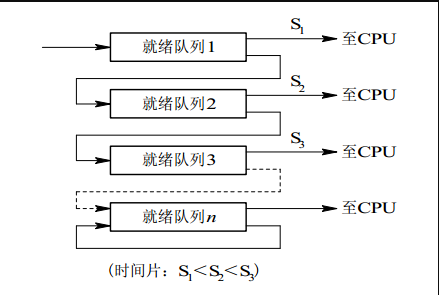

> 以下内容均是以口述形式编辑

## 进程、线程、协程
- 进程: 直观的说，就是保存在硬盘中的程序在运行以后，会在内存空间形成一个独立的内存体，**这个内存体有自己独立的内存空间**。简单的说就是假如运行一个可执行程序，那么进程就是这个运行起来的执行程序了。另外，进程是**资源调度**的基本单位，操作系统会**以进程为单位**进行分配资源，比如说`CPU`时间片，内存等资源。**进程是资源分配的最小单位**。

- 刚刚说到系统运行一个可执行程序就是进程，那么线程就是这个执行程序的基本单位，也可以说是**轻量级的进程**，线程是操作系统进行CPU调度的最小单位。然后每个进程都有一个唯一的主进程，主线程和进程是相互依存的，主线程结束进程也会终止。

- 进程和线程属于包含关系，没有线程的进程可以看做是单线程的，如果一个进程内有多个线程，则执行过程不是一个线程完成的，而是多个线程共同完成的；线程是进程的一部分。另外线程可以共享它对应进程的系统资源。

- 在系统开销方面，每个进程都有独立的代码和数据空间（也就是程序的上下文），程序之间的切换会有较大的开销；线程因为是轻量级的进程，同一类线程可以共享代码和数据空间，所以每个线程都有自己独立的运行栈和程序计数器（PC），因此线程之间切换的开销较小。

- 协程：**协程是一种用户态的轻量级线程**，协程的调度完全由用户控制，协程拥有自己的寄存器上下文和栈，协程在调度切换的时候，将寄存器上下文保存在其他地方，在需要切换回来的时候恢复之前保存的寄存器上下文和栈，这种直接去操作栈而不是不是函数调用，也不是多线程执行，所以省去了线程切换的开销，效率很高，并且不需要多线程间的锁机制，不会发生变量写冲突。


### 进程的基本状态以及它们的转化

- 就绪状态：其他资源准备好，只差CPU资源的状态就称为就绪状态，只要获得CPU的使用权，就可以独立运行。
- 执行状态：进程获得CPU资源，程序正在处理器上执行，在单处理机中(1核)，在某个时刻最多只能有一个进程正在执行
- 阻塞状态：当进程因为某种原因，比如其他设备未就绪而无法继续执行，但是并没有放弃CPU的使用权。
- 创建状态：创建进程时拥有PCB但是其他资源尚未就绪的状态。创建状态成为两步：第一步分配PCB，第二步插入就绪队列。
    > - **进程的控制块**（PCB）：用于描述和控制进程运行的通用数据结构，每个进程都有进程控制块
    > - PCB还用于记录当前状态和控制进程运行的全部信息
    > - PCB使得进程是能够独立运行的基本单位，每个进程都依赖于进程控制块去被操作系统调度
- 终止状态: 进程结束由系统清理或者归还PCB的状态，分成两步：第一步是系统清理，第二步是归还 PCB。


当一个进程获取 CPU 时，就会**从就绪状态转成执行状态**，当一个进程被剥夺 CPU 时，比如系统分配的时间片被用完，或者出现优先级更高的进程，就会**由运行状态变成就绪状态**，当一个运行进程由于某事件被阻时，比如申请资源被占用、启动 I/O 传输未完成，状态就会由 **执行变成阻塞**，当所有的等待事件发生时，比如得到申请资源、I/O 参数完成，状态就由 **阻塞变成就绪**。


### Linux理论上最多可以创建多少个进程？一个进程可以创建多少线程，和什么有关

理论上，一个进程可用虚拟空间是`2G`，默认情况下，线程的栈的大小是`1MB`，所以理论上最多只能创建`2048`个线程。如果要创建多于`2048`的话，必须修改编译器的设置。

因此，一个进程可以创建的线程数由可用虚拟空间和线程的栈的大小共同决定，只要虚拟空间足够，那么新线程的建立就会成功。如果需要创建超过`2K`以上的线程，减小你线程栈的大小就可以实现了，虽然在一般情况下，你不需要那么多的线程。过多的线程将会导致大量的时间浪费在线程切换上，给程序运行效率带来负面影响。

### 进程之前为什么需要通信
当我的程序是多进程的时候，进程间基本都会涉及数据的共享。

只有进程间进行通信才可以实现进程间数据的共享，也就是说**进程间通信的目的就是实现进程间数据的共享**。

### 进程之间的通信方法有哪几种（重点）

进程之间的通信有六种：分别是**管道**，**消息队列**，**共享内存**，**套接字**，**信号量**，**信号**。

* **管道**：管道的话分为两种，一种是无名管道一种是有名管道，也就是操作系统在进程之间会建立一个管道，然后通过这个管道实现进程之间数据的交换，比如说在`Linux`系统中，打一个`ls | grep 1`,就是将`ls`这个进程的结果作为`grep 1`这个进程的输入,实现了进程间的通信。这就是管道了，*具体管道是什么，如果需要讲的话可以等等再介绍*

* **消息队列**：消息队列的话就是内核给我们创建的一个消息队列，操作系统中的多个进程都可以操作这个消息队列，可以往里面发送消息，也可以从里面接收消息，那这就是消息队列。

* **共享内存**：因为在操作系统中，进程间的内存空间是相互独立的，也就是说一个进程不能反问另外的进程空间，共享内存就允许多个不相关的进程访问同一片物理内存，它实现的原理就是把这一片物理内存映射到进程的页表里面去，使得不同进程可以通过页表来访问同一块物理内存。共享内存是两个进程之间共享和传递数据最快的方式，但是共享内存也存在一些缺点，它未提供同步机制，需要借助其他的机制管理访问，以避免并发访问所带来的问题。使用共享内存的话可以分为四个步骤，第一个是向操作系统申请共享内存，第二步是把共享内存连接到进程空间中区，只有连接到进程空间中去进程才能通过页表访问共享内存，第三步就是使用共享内存，第四步就是把共享内存删除或者脱离进程空间。


* **套接字**：套接字实现进程通信的方式非常常见，比如说简单的访问`MySQL`数据库就是通过`3306`端口,我访问数据库的这个进程和数据库的进程，本身这两个进程之间的通信就是通过`3306`这个端口建立起的`tcp`套接字进程通信的，当然如果是本机访问`MySQL`的话不会走`tcp`套接字，而是走`Linux`底层的套接字。

* **信号量**：信号量可以说是类似一个计数器，它控制的是多个进程对一个共享资源的访问，就是说这个资源最多能被多少个进程进行访问。其实信号量的话只有**等待**和**发送**两种操作，其中等待就是让计数器的值减一或者说是挂起进程，发送就是让计数器的值加一也可以说是将进程恢复运行。

* **信号**：信号的方式就是进程在运行的时候，一个进程向另一个进程发送一个信号，这个进程就可以处理这个信号。其实信号可以在任何时候发送另一个进程，就是不管那个进程有没有在运行的状态，如果它不在运行状态的话，这个信号就会被内核保存起来一直到那个进程恢复到运行状态并传递给它为止。在`Linux`系统中我们可以通过`kill -l`来列出系统中所有的信号。


### 进程同步方式

信号量和管程机制

* **信号量**：信号量可以说是类似一个计数器，它控制的是多个进程对一个共享资源的访问，就是说这个资源最多能被多少个进程进行访问。其实信号量的话只有**等待**和**发送**两种操作，其中等待就是让计数器的值减一或者说是挂起进程，发送就是让计数器的值加一也可以说是将进程恢复运行。

* **管程**: 信号量机制功能强大，但使用时对信号量的操作分散，而且难以控制，读写和维护都很困难。因此后来又提出了一种集中式同步进程——管程。其基本思想是将共享变量和对它们的操作集中在一个模块中，操作系统或并发程序就由这样的模块构成。这样模块之间联系清晰，便于维护和修改，可以保证正确性。 

* **优缺点**： 

  * 1）信号量（Semaphore）及PV操作
  
   优：PV操作能够实现对临界区的管理要求；实现简单；允许使用它的代码休眠，持有锁的时间可相对较长。 

   缺：信号量机制必须有公共内存，不能用于分布式操作系统，这是它最大的弱点。信号量机制功能强大，但使用时对信号量的操作分散，而且难以控制，读写和维护都很困难。加重了程序员的编码负担；核心操作P-V分散在各用户程序的代码中，不易控制和管理；一旦错误，后果严重，且不易发现和纠正。 

  * 管程
  
   优： 集中式同步进程——管程。其基本思想是将共享变量和对它们的操作集中在一个模块中，操作系统或并发程序就由这样的模块构成。这样模块之间联系清晰，便于维护和修改，易于保证正确性。 

   缺：如果一个分布式系统具有多个CPU，并且每个CPU拥有自己的私有内存，它们通过一个局域网相连，那么这些原语将失效。而管程在少数几种编程语言之外又无法使用，并且，这些原语均未提供机器间的信息交换方法。 


### 线程同步的方式

实现线程间同步的方法：

**互斥量，自旋锁，读写锁，条件变量**

- **互斥量**：比如说有两个线程，线程1和线程2，分别充当生产者与消费者的角色，那么这两个线程就很有可能同时去操作临界资源，如果同时去操作临界资源的话就会引起线程同步问题，互斥量的话就是来解决这个问题，当一个线程，比如说线程1在操作临界资源的时候，它就会阻止另外的线程去访问这个临界资源。其实引发线程同步问题的最根本原因是这两个线程的指令是交叉执行的，互斥量能够保证指令执行的原子性，也就是说先执行完线程1的指令再执行线程2的指令，或者先执行完线程2的指令再执行线程1的指令。保证他们之间不会出现交叉执行的情况。互斥量也成为互斥锁，它要么处于加锁状态要么处于解锁状态。保证资源访问的串行。操作系统提供的API是`pthread_mutex_t`。

- **自旋锁**：其实自旋锁和互斥锁的原理是一样的，都是在使用临界资源之前加一个锁，阻止其他线程对它进行访问，完成之后再把锁给释放掉，保证临界资源的串行访问。但是它和互斥锁还是存在差别的，使用自旋锁的线程会一直循环反复检查锁的变量是否可用，因此它不会让出CPU，会处于忙等待的状态。其实自旋锁还是有很多好处的，它避免了进程或者线程上下文切换的开销，如果锁使用的时间不是很长的话，使用自旋锁的代价也是很小的，同时在操作系统内部很多地方使用的是自旋锁而不是互斥量的。这里还要提一点就是自旋锁不适合在单核`CPU`中使用。因为自旋锁在等待的时候并不会释放`CPU`，而是死循环地去等待。会引起其他的进程或者线程无法去执行。操作系统提供的API是`pthread_spinock_t`。

- **读写锁**: 读写锁和互斥锁还有自旋锁是类似的，但是做了一些改进，基于临界资源的考量，因为在开发环境中，临界资源很可能会出现多读少写的特性，就比如有一个数据库存储的是历史订单信息，而这些订单我们一般只是去查询很少去改变它，这个存储历史订单的数据库就属于多读少写的临界资源，如果在读写的时候也给它加锁，这样的话效率会很低的。读写锁的话是一种特殊的自旋锁，它允许多个读者同时读取临界资源，但是不允许多个写操作同时访问这个资源。在操作系统中提供的API是`thread_rwlock_t`，读锁是通过`thread_rwlock_rdlock`来加的，写锁是通过`thread_rwlock_wdlock`来加的.


- **条件变量**：条件变量是一种先对复杂的线程同步方法，它允许线程睡眠，在满足一定条件的时候再唤醒线程，就是当满足条件时，可以向这个线程发送信号，唤醒这个线程。因为在生产者和消费者模型中是存在问题的，举个例子，比如当缓冲区小于或者等于0时，这时候应该不允许消费者继续消费，消费者必须等待，当缓冲区满的时候，这个时候应该不允许生产者往里面生成数据了，生产者必须处于等待状态。条件变量呢就是对这个问题进行了约束，当缓冲区为0的时候，如果有生产者生产一个产品，那么就要唤醒可能等待的消费者；当缓冲区满的时候，如果有消费者消费了产品，就需要唤醒其他可能在等待的生产者。操作系统提供的`API`是`pthread_cont_t`来定义的,等待是通过`pthread_cont_wait`定义的，,唤醒是通过`pthread_cont_notify`定义的。


### 进程调度方法

https://blog.csdn.net/u011080472/article/details/51217754

https://blog.csdn.net/leex_brave/article/details/51638300

* **先来先服务** （FCFS first come first serve）: 非抢占式的调度算法，按照请求的顺序进行调度。有利于长作业，但不利于短作业，因为短作业必须一直等待前面的长作业执行完毕才能执行，而长作业又需要执行很长时间，造成了短作业等待时间过长

* **短作业优先** shortest job first（SJF）: 非抢占式的调度算法，按估计运行时间最短的顺序进行调度。具有很好的性能，降低平均等待时间，提高吞吐量。但是不利于长作业，长作业可能一直处于等待状态，出现饥饿现象；完全未考虑作业的优先紧迫程度，不能用于实时系统。
  
* **最短剩余时间优先**: 这个算法首先按照作业的服务时间挑选最短的作业运行，在这个作业运行期间，一旦有新作业到达系统，并且该新作业的服务时间比当前运行作业的剩余服务时间短，就发生抢占；否则，当前作业继续运行。这个算法确保一旦新的短作业或短进程进入系统，能够很快得到处理。

* **高响应比优先调度算法**（Highest Reponse Ratio First, HRRF）: 是非抢占式的，主要用于作业调度。基本思想：每次进行作业调度时，先计算后备作业队列中每个作业的响应比，挑选最高的作业投入系统运行。`响应比 = （等待时间 + 服务时间） / 服务时间 = 等待时间 / 服务时间 + 1`。因为每次都需要计算响应比，所以比较耗费系统资源。

* **时间片轮转** : 用于分时系统的进程调度。基本思想：系统将CPU处理时间划分为若干个时间片（q），进程按照到达先后顺序排列。每次调度选择队首的进程，执行完1个时间片q后，计时器发出时钟中断请求，该进程移至队尾。以后每次调度都是如此。该算法能在给定的时间内响应所有用户的而请求，达到分时系统的目的。

* **多级反馈队列**(Multilevel Feedback Queue) : 一个进程需要执行 `100` 个时间片，如果采用时间片轮转调度算法，那么需要交换 `100` 次。多级队列是为这种需要连续执行多个时间片的进程考虑，它设置了多个队列，每个队列时间片大小都不同，例如 `1,2,4,8,..`。进程在第一个队列没执行完，就会被移到下一个队列。这种方式下，之前的进程只需要交换 7 次。每个队列优先权也不同，最上面的优先权最高。因此只有上一个队列没有进程在排队，才能调度当前队列上的进程。可以将这种调度算法看成是时间片轮转调度算法和优先级调度算法的结合。



### 线程的实现方式

进程的概念包含两个特点：

- **资源所有权**：一个进程包括一个存放进程映像的虚拟地址空间；一个进程总是拥有对资源的控制或所有权。操作系统提供保护功能，以防止进程之间发生不必要的与资源相关的冲突。
- **调度/执行**：一个进程沿着可以通过一个或多个程序的执行路径执行。其执行过程可能与其他进程的执行过程交替进行。因此，一个进程具有一个执行状态和一个被分配的优先级，它是一个可被操作系统调度和分派的实体。


既然上述两个特点是独立的，为区分这两个特点，分派的单位通常称为**线程**，而拥有资源所有权的单位通常仍称为**进程**。

线程的实现可以分为：**用户级线程**和**内核级线程**。

- **用户级线程**指不需要内核支持而在用户程序中实现的线程，其不依赖于操作系统核心，应用进程利用线程库提供创建、同步、调度和管理线程的函数来控制用户线程。不需要用户态/核心态切换，速度快，操作系统内核不知道多线程的存在，因此一个线程阻塞将使得整个进程（包括它的所有线程）阻塞。由于这里的处理器时间片分配是以进程为基本单位，所以每个线程执行的时间相对减少。
- **内核级线程**：由操作系统内核创建和撤销。内核维护进程及线程的上下文信息以及线程切换。一个内核线程由于I/O操作而阻塞，不会影响其它线程的运行。


两者的区别：

1）内核级线程是OS内核可感知的，而用户级线程是`OS`内核不可感知的。

2）用户级线程的创建、撤消和调度不需要`OS`内核的支持，是在语言（如Java）这一级处理的；而内核支持线程的创建、撤消和调度都需OS内核提供支持，而且与进程的创建、撤消和调度大体是相同的。

3）用户级线程执行系统调用指令时将导致其所属进程被中断，而内核支持线程执行系统调用指令时，只导致该线程被中断。

4）在只有用户级线程的系统内，`CPU`调度还是以进程为单位，处于运行状态的进程中的多个线程，由用户程序控制线程的轮换运行；在有内核支持线程的系统内，`CPU`调度则以线程为单位，由OS的线程调度程序负责线程的调度。

5）用户级线程的程序实体是运行在用户态下的程序，而内核支持线程的程序实体则是可以运行在任何状态下的程序。

### 什么时候用多进程，什么时候用多线程

https://blog.csdn.net/yu876876/article/details/82810178

* 频繁修改：需要频繁创建和销毁的优先使用**多线程**
* 计算量：需要大量计算的优先使用**多线程**  因为需要消耗大量CPU资源且切换频繁，所以多线程好一点
* 相关性：任务间相关性比较强的用**多线程**，相关性比较弱的用多进程。因为线程之间的数据共享和同步比较简单。
* 多分布：可能要扩展到多机分布的用**多进程**，多核分布的用**多线程**。

但是实际中更常见的是进程加线程的结合方式，并不是非此即彼的。

### 孤儿进程和僵尸进程分别是什么，怎么形成的？

https://www.cnblogs.com/Anker/p/3271773.html

* 孤儿进程是父进程退出后它的子进程还在执行，这时候这些子进程就成为孤儿进程。孤儿进程会被init进程收养并完成状态收集。
* 僵尸进程是指子进程完成并退出后父进程没有使用`wait()`或者`waitpid()`对它们进行状态收集，这些子进程的进程描述符仍然会留在系统中。这些子进程就成为僵尸进程。

### 如何避免僵尸进程？

- 通过signal(SIGCHLD, SIG_IGN)通知内核对子进程的结束不关心，由内核回收。如果不想让父进程挂起，可以在父进程中加入一条语句：signal(SIGCHLD,SIG_IGN);表示父进程忽略SIGCHLD信号，该信号是子进程退出的时候向父进程发送的。

- 父进程调用wait/waitpid等函数等待子进程结束，如果尚无子进程退出wait会导致父进程阻塞。waitpid可以通过传递WNOHANG使父进程不阻塞立即返回。

- 如果父进程很忙可以用signal注册信号处理函数，在信号处理函数调用wait/waitpid等待子进程退出。

- 通过两次调用fork。父进程首先调用fork创建一个子进程然后waitpid等待子进程退出，子进程再fork一个孙进程后退出。这样子进程退出后会被父进程等待回收，而对于孙子进程其父进程已经退出所以孙进程成为一个孤儿进程，孤儿进程由init进程接管，孙进程结束后，init会等待回收。

第一种方法忽略SIGCHLD信号，这常用于并发服务器的性能的一个技巧因为并发服务器常常fork很多子进程，子进程终结之后需要服务器进程去wait清理资源。如果将此信号的处理方式设为忽略，可让内核把僵尸子进程转交给init进程去处理，省去了大量僵尸进程占用系统资源。

> 《Linux系统下创建守护进程(Daemon)》：https://blog.csdn.net/linkedin_35878439/article/details/81288889

> 《01_fork()的使用》：https://blog.csdn.net/WUZHU2017/article/details/81636851

## 用户态和内核态的区别

内核态与用户态是操作系统的两种运行级别,当程序运行在3级特权级上时，就可以称之为运行在用户态，因为这是最低特权级，是普通的用户进程运行的特权级，大部分用户直接面对的程序都是运行在用户态；反之，当程序运行在0级特权级上时，就可以称之为运行在内核态。运行在用户态下的程序不能直接访问操作系统内核数据结构和程序。当我们在系统中执行一个程序时，大部分时间是运行在用户态下的，在其需要操作系统帮助完成某些它没有权力和能力完成的工作时就会切换到内核态。

**这两种状态的主要差别是**： 

（1）处于用户态执行时，进程所能访问的内存空间和对象受到限制，其所处于占有的处理机是可被抢占的 ； 

（2）而处于核心态执行中的进程，则能访问所有的内存空间和对象，且所占有的处理机是不允许被抢占的。

通常来说，以下三种情况会导致用户态到内核态的切换：

1）系统调用

这是用户态进程主动要求切换到内核态的一种方式，用户态进程通过系统调用申请使用操作系统提供的服务程序完成工作，比如前例中fork()实际上就是执行了一个创建新进程的系统调用。而系统调用的机制其核心还是使用了操作系统为用户特别开放的一个中断来实现，例如Linux的int 80h中断。

2）异常

当CPU在执行运行在用户态下的程序时，发生了某些事先不可知的异常，这时会触发由当前运行进程切换到处理此异常的内核相关程序中，也就转到了内核态，比如缺页异常。

3）外围设备的中断

当外围设备完成用户请求的操作后，会向CPU发出相应的中断信号，这时CPU会暂停执行下一条即将要执行的指令转而去执行与中断信号对应的处理程序，如果先前执行的指令是用户态下的程序，那么这个转换的过程自然也就发生了由用户态到内核态的切换。比如硬盘读写操作完成，系统会切换到硬盘读写的中断处理程序中执行后续操作等。

这3种方式是系统在运行时由用户态转到内核态的最主要方式，其中系统调用可以认为是用户进程主动发起的，异常和外围设备中断则是被动的。


## 内存池、进程池、线程池

由于在实际应用当做，分配内存、创建进程、线程都会设计到一些系统调用，系统调用需要导致程序从用户态切换到内核态，是非常耗时的操作。因此，当程序中需要频繁的进行内存申请释放，进程、线程创建销毁等操作时，通常会使用内存池、进程池、线程池技术来提升程序的性能。


**线程池**：线程池的原理很简单，类似于操作系统中的缓冲区的概念，它的流程如下：先启动若干数量的线程，并让这些线程都处于睡眠状态，当需要一个开辟一个线程去做具体的工作时，就会唤醒线程池中的某一个睡眠线程，让它去做具体工作，当工作完成后，线程又处于睡眠状态，而不是将线程销毁。


进程池与线程池同理。


**内存池**：内存池是指程序预先从操作系统申请一块足够大内存，此后，当程序中需要申请内存的时候，不是直接向操作系统申请，而是直接从内存池中获取；同理，当程序释放内存的时候，并不真正将内存返回给操作系统，而是返回内存池。当程序退出(或者特定时间)时，内存池才将之前申请的真正内存释放。

## 在执行malloc申请内存的时候，操作系统是怎么做的？/内存分配的原理说一下/malloc函数底层是怎么实现的？/进程是怎么分配内存的？

https://blog.csdn.net/yusiguyuan/article/details/39496057

从操作系统层面上看，`malloc`是通过两个系统调用来实现的： `brk`和`mmap`

* `brk`是将进程数据段(.data)的最高地址指针向高处移动，这一步可以扩大进程在运行时的堆大小
* `mmap`是在进程的虚拟地址空间中寻找一块空闲的虚拟内存，这一步可以获得一块可以操作的堆内存。

通常，分配的内存小于`128k`时，使用`brk`调用来获得虚拟内存，大于`128k`时就使用`mmap`来获得虚拟内存。

进程先通过这两个系统调用获取或者扩大进程的虚拟内存，获得相应的虚拟地址，在访问这些虚拟地址的时候，通过缺页中断，让内核分配相应的物理内存，这样内存分配才算完成。

## 逻辑地址VS物理地址

Eg:编译时只需确定变量`x`存放的相对地址是`100` ( 也就是说相对于进程在内存中的起始地址而言的地 址)。`CPU`想要找到x在内存中的实际存放位置，只需要用进程的起始地址`+100`即可。 相对地址又称**逻辑地址**，绝对地址又称**物理地址**。

## 服务器高并发的解决方案

1. 应用数据与静态资源分离
   将静态资源（图片，视频，js，css等）单独保存到专门的静态资源服务器中，在客户端访问的时候从静态资源服务器中返回静态资源，从主服务器中返回应用数据。

2. 客户端缓存
   因为效率最高，消耗资源最小的就是纯静态的html页面，所以可以把网站上的页面尽可能用静态的来实现，在页面过期或者有数据更新之后再将页面重新缓存。或者先生成静态页面，然后用ajax异步请求获取动态数据。

3. 集群和分布式
   （集群是所有的服务器都有相同的功能，请求哪台都可以，主要起分流作用）<br>
   （分布式是将不同的业务放到不同的服务器中，处理一个请求可能需要使用到多台服务器，起到加快请求处理的速度。）<br>
   可以使用服务器集群和分布式架构，使得原本属于一个服务器的计算压力分散到多个服务器上。同时加快请求处理的速度。

4. 反向代理
   在访问服务器的时候，服务器通过别的服务器获取资源或结果返回给客户端。


## 操作系统的内存管理说一下

> https://zhuanlan.zhihu.com/p/141602175

操作系统的内存管理包括物理内存管理和虚拟内存管理

* 物理内存管理包括交换与覆盖，分页管理，分段管理和段页式管理等；
* 虚拟内存管理包括虚拟内存的概念，页面置换算法，页面分配策略等；

>（面试官这样问的时候，其实是希望你能讲讲虚拟内存）

## 虚拟内存的了解

> https://www.cnblogs.com/Przz/p/6876988.html

在运行一个进程的时候，它所需要的内存空间可能大于系统的物理内存容量。通常一个进程会有4G的空间，但是物理内存并没有这么大，所以这些空间都是虚拟内存，它的地址都是逻辑地址，每次在访问的时候都需要映射成物理地址。<br>

当进程访问某个逻辑地址的时候，会去查看页表，如果页表中没有相应的物理地址，说明内存中没有这页的数据，发生缺页异常，这时候进程需要把数据从磁盘拷贝到物理内存中。如果物理内存已经满了，就需要覆盖已有的页，如果这个页曾经被修改过，那么还要把它写回磁盘。

### 常见内存分配方式有哪些？

**内存分配方式**

（1） 从静态存储区域分配。内存在程序编译的时候就已经分配好，这块内存在程序的整个运行期间都存在。例如全局变量，static变量。

（2） 在栈上创建。在执行函数时，函数内局部变量的存储单元都可以在栈上创建，函数执行结束时这些存储单元自动被释放。栈内存分配运算内置于处理器的指令集中，效率很高，但是分配的内存容量有限。

（3） 从堆上分配，亦称动态内存分配。程序在运行的时候用malloc或new申请任意多少的内存，程序员自己负责在何时用free或delete释放内存。动态内存的生存期由我们决定，使用非常灵活，但问题也最多。

### 常见内存分配内存错误

（1）内存分配未成功，却使用了它。

编程新手常犯这种错误，因为他们没有意识到内存分配会不成功。常用解决办法是，在使用内存之前检查指针是否为NULL。如果指针p是函数的参数，那么在函数的入口处用assert(p!=NULL)进行检查。如果是用malloc或new来申请内存，应该用if(p==NULL) 或if(p!=NULL)进行防错处理。

（2）内存分配虽然成功，但是尚未初始化就引用它。

犯这种错误主要有两个起因：一是没有初始化的观念；二是误以为内存的缺省初值全为零，导致引用初值错误（例如数组）。内存的缺省初值究竟是什么并没有统一的标准，尽管有些时候为零值，我们宁可信其无不可信其有。所以无论用何种方式创建数组，都别忘了赋初值，即便是赋零值也不可省略，不要嫌麻烦。

（3）内存分配成功并且已经初始化，但操作越过了内存的边界。

例如在使用数组时经常发生下标“多1”或者“少1”的操作。特别是在for循环语句中，循环次数很容易搞错，导致数组操作越界。

（4）忘记了释放内存，造成内存泄露。

含有这种错误的函数每被调用一次就丢失一块内存。刚开始时系统的内存充足，你看不到错误。终有一次程序突然挂掉，系统出现提示：内存耗尽。动态内存的申请与释放必须配对，程序中malloc与free的使用次数一定要相同，否则肯定有错误（new/delete同理）。

（5）释放了内存却继续使用它。常见于以下有三种情况：

程序中的对象调用关系过于复杂，实在难以搞清楚某个对象究竟是否已经释放了内存，此时应该重新设计数据结构，从根本上解决对象管理的混乱局面。

函数的return语句写错了，注意不要返回指向“栈内存”的“指针”或者“引用”，因为该内存在函数体结束时被自动销毁。

使用free或delete释放了内存后，没有将指针设置为NULL。导致产生“野指针”。

> 《内存分配方式及常见错误》：https://www.cnblogs.com/skynet/archive/2010/12/03/1895045.html

## 介绍一下几种典型的锁

**读写锁**

多个读者可以同时进行读
写者必须互斥（只允许一个写者写，也不能读者写者同时进行）
写者优先于读者（一旦有写者，则后续读者必须等待，唤醒时优先考虑写者）

**互斥锁**

一次只能一个线程拥有互斥锁，其他线程只有等待

互斥锁是在抢锁失败的情况下主动放弃CPU进入睡眠状态直到锁的状态改变时再唤醒，而操作系统负责线程调度，为了实现锁的状态发生改变时唤醒阻塞的线程或者进程，需要把锁交给操作系统管理，所以互斥锁在加锁操作时涉及上下文的切换。互斥锁实际的效率还是可以让人接受的，加锁的时间大概100ns左右，而实际上互斥锁的一种可能的实现是先自旋一段时间，当自旋的时间超过阀值之后再将线程投入睡眠中，因此在并发运算中使用互斥锁（每次占用锁的时间很短）的效果可能不亚于使用自旋锁

**条件变量**

互斥锁一个明显的缺点是他只有两种状态：锁定和非锁定。而条件变量通过允许线程阻塞和等待另一个线程发送信号的方法弥补了互斥锁的不足，他常和互斥锁一起使用，以免出现竞态条件。当条件不满足时，线程往往解开相应的互斥锁并阻塞线程然后等待条件发生变化。一旦其他的某个线程改变了条件变量，他将通知相应的条件变量唤醒一个或多个正被此条件变量阻塞的线程。总的来说互斥锁是线程间互斥的机制，条件变量则是同步机制。

**自旋锁**

如果进线程无法取得锁，进线程不会立刻放弃CPU时间片，而是一直循环尝试获取锁，直到获取为止。如果别的线程长时期占有锁那么自旋就是在浪费CPU做无用功，但是自旋锁一般应用于加锁时间很短的场景，这个时候效率比较高。

>《互斥锁、读写锁、自旋锁、条件变量的特点总结》：https://blog.csdn.net/RUN32875094/article/details/80169978

###  死锁产生的必要条件（怎么检测死锁，解决死锁问题）

（1） 互斥：一个资源每次只能被一个进程使用。<br>
（2） 占有并请求：一个进程因请求资源而阻塞时，对已获得的资源保持不放。<br>
（3） 不可剥夺:进程已获得的资源，在末使用完之前，不能强行剥夺。<br>
（4） 循环等待:若干进程之间形成一种头尾相接的循环等待资源关系。<br>

产生死锁的原因主要是：<br>
（1） 因为系统资源不足。<br>
（2） 进程运行推进的顺序不合适。<br>
（3） 资源分配不当等。<br>

### 死锁的恢复

1. 重新启动：是最简单、最常用的死锁消除方法，但代价很大，因为在此之前所有进程已经完成的计算工作都将付之东流，不仅包括死锁的全部进程，也包括未参与死锁的全部进程。<br>
2. 终止进程(process termination)：终止参与死锁的进程并回收它们所占资源。<br>
   (1) 一次性全部终止；<br>
   (2) 逐步终止(优先级，代价函数)
3. 剥夺资源(resource preemption):剥夺死锁进程所占有的全部或者部分资源。<br>
   (1) 逐步剥夺：一次剥夺死锁进程所占有的一个或一组资源，如果死锁尚未解除再继续剥夺，直至死锁解除为止。<br>
   (2) 一次剥夺：一次性地剥夺死锁进程所占有的全部资源。<br>
4. 进程回退(rollback):让参与死锁的进程回退到以前没有发生死锁的某个点处，并由此点开始继续执行，希望进程交叉执行时不再发生死锁。但是系统开销很大：<br>
   (1) 要实现“回退”，必须“记住”以前某一点处的现场，而现场随着进程推进而动态变化，需要花费大量时间和空间。<br>
   (2) 一个回退的进程应当“挽回”它在回退点之间所造成的影响，如修改某一文件，给其它进程发送消息等，这些在实现时是难以做到的<br>

### 如果要你实现一个mutex互斥锁你要怎么实现？

https://blog.csdn.net/kid551/article/details/84338619

实现mutex最重要的就是实现它的lock()方法和unlock()方法。我们保存一个全局变量flag，flag=1表明该锁已经锁住，flag=0表明锁没有锁住。
实现lock()时，使用一个while循环不断检测flag是否等于1，如果等于1就一直循环。然后将flag设置为1；unlock()方法就将flag置为0；

```C++
static int flag=0;

void lock(){
  while(TestAndSet(&flag,1)==1);
  //flag=1;
}
void unlock(){
  flag=0;
}
```

因为while有可能被重入，所以可以用TestandSet()方法。

```C++
int TestAndSet(int *ptr, int new) {
    int old = *ptr;
    *ptr = new;
    return old;
}
```

### 死锁避免

在程序运行时避免发生死锁

1.**安全状态**


图 a 的第二列 Has 表示已拥有的资源数，第三列 Max 表示总共需要的资源数，Free 表示还有可以使用的资源数。从图 a 开始出发，先让 B 拥有所需的所有资源（图 b），运行结束后释放 B，此时 Free 变为 5（图 c）；接着以同样的方式运行 C 和 A，使得所有进程都能成功运行，因此可以称图 a 所示的状态时安全的。

**定义**：如果没有死锁发生，并且即使所有进程突然请求对资源的最大需求，也仍然存在某种调度次序能够使得每一个进程运行完毕，则称该状态是安全的。

安全状态的检测与死锁的检测类似，因为安全状态必须要求不能发生死锁。下面的银行家算法与死锁检测算法非常类似，可以结合着做参考对比。

2.**单个资源的银行家算法**

一个小城镇的银行家，他向一群客户分别承诺了一定的贷款额度，算法要做的是判断对请求的满足是否会进入不安全状态，如果是，就拒绝请求；否则予以分配。


上图 c 为不安全状态，因此算法会拒绝之前的请求，从而避免进入图 c 中的状态。

3.**多个资源的银行家算法**

上图中有五个进程，四个资源。左边的图表示已经分配的资源，右边的图表示还需要分配的资源。最右边的 E、P 以及 A 分别表示：总资源、已分配资源以及可用资源，注意这三个为向量，而不是具体数值，例如 `A=(1020)`，表示 4 个资源分别还剩下 `1/0/2/0`。

4.**检查一个状态是否安全的算法如下：**

查找右边的矩阵是否存在一行小于等于向量 A。如果不存在这样的行，那么系统将会发生死锁，状态是不安全的。<br>
假若找到这样一行，将该进程标记为终止，并将其已分配资源加到 A 中。<br>
重复以上两步，直到所有进程都标记为终止，则状态时安全的。
如果一个状态不是安全的，需要拒绝进入这个状态。