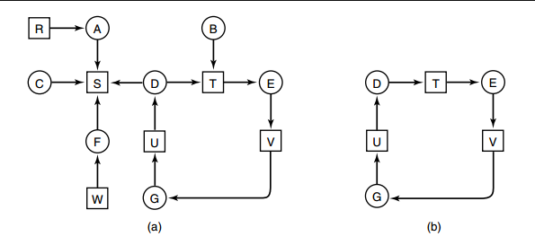

## 介绍一下几种典型的锁

> https://blog.csdn.net/qq_34827674/article/details/108608566


**读写锁**

多个读者可以同时进行读
写者必须互斥（只允许一个写者写，也不能读者写者同时进行）
写者优先于读者（一旦有写者，则后续读者必须等待，唤醒时优先考虑写者）

> 读写锁的实现:https://www.cnblogs.com/i80386/p/4478021.html

**互斥锁**

一次只能一个线程拥有互斥锁，其他线程只有等待

互斥锁是在抢锁失败的情况下主动放弃CPU进入睡眠状态直到锁的状态改变时再唤醒，而操作系统负责线程调度，为了实现锁的状态发生改变时唤醒阻塞的线程或者进程，需要把锁交给操作系统管理，所以互斥锁在加锁操作时涉及上下文的切换。互斥锁实际的效率还是可以让人接受的，加锁的时间大概100ns左右，而实际上互斥锁的一种可能的实现是先自旋一段时间，当自旋的时间超过阀值之后再将线程投入睡眠中，因此在并发运算中使用互斥锁（每次占用锁的时间很短）的效果可能不亚于使用自旋锁

**条件变量**

互斥锁一个明显的缺点是他只有两种状态：锁定和非锁定。而条件变量通过允许线程阻塞和等待另一个线程发送信号的方法弥补了互斥锁的不足，他常和互斥锁一起使用，以免出现竞态条件。当条件不满足时，线程往往解开相应的互斥锁并阻塞线程然后等待条件发生变化。一旦其他的某个线程改变了条件变量，他将通知相应的条件变量唤醒一个或多个正被此条件变量阻塞的线程。总的来说互斥锁是线程间互斥的机制，条件变量则是同步机制。

**自旋锁**

如果进线程无法取得锁，进线程不会立刻放弃CPU时间片，而是一直循环尝试获取锁，直到获取为止。如果别的线程长时期占有锁那么自旋就是在浪费CPU做无用功，但是自旋锁一般应用于加锁时间很短的场景，这个时候效率比较高。

>《互斥锁、读写锁、自旋锁、条件变量的特点总结》：https://blog.csdn.net/RUN32875094/article/details/80169978

###  死锁产生的必要条件（怎么检测死锁，解决死锁问题）

（1） 互斥：一个资源每次只能被一个进程使用。<br>
（2） 占有并请求：一个进程因请求资源而阻塞时，对已获得的资源保持不放。<br>
（3） 不可剥夺:进程已获得的资源，在末使用完之前，不能强行剥夺。<br>
（4） 循环等待:若干进程之间形成一种头尾相接的循环等待资源关系。<br>

产生死锁的原因主要是：<br>
（1） 因为系统资源不足。<br>
（2） 进程运行推进的顺序不合适。<br>
（3） 资源分配不当等。<br>

### 死锁的恢复

1. 重新启动：是最简单、最常用的死锁消除方法，但代价很大，因为在此之前所有进程已经完成的计算工作都将付之东流，不仅包括死锁的全部进程，也包括未参与死锁的全部进程。<br>
2. 终止进程(process termination)：终止参与死锁的进程并回收它们所占资源。<br>
   (1) 一次性全部终止；<br>
   (2) 逐步终止(优先级，代价函数)
3. 剥夺资源(resource preemption):剥夺死锁进程所占有的全部或者部分资源。<br>
   (1) 逐步剥夺：一次剥夺死锁进程所占有的一个或一组资源，如果死锁尚未解除再继续剥夺，直至死锁解除为止。<br>
   (2) 一次剥夺：一次性地剥夺死锁进程所占有的全部资源。<br>
4. 进程回退(rollback):让参与死锁的进程回退到以前没有发生死锁的某个点处，并由此点开始继续执行，希望进程交叉执行时不再发生死锁。但是系统开销很大：<br>
   (1) 要实现“回退”，必须“记住”以前某一点处的现场，而现场随着进程推进而动态变化，需要花费大量时间和空间。<br>
   (2) 一个回退的进程应当“挽回”它在回退点之间所造成的影响，如修改某一文件，给其它进程发送消息等，这些在实现时是难以做到的<br>

### 如果要你实现一个mutex互斥锁你要怎么实现？

https://blog.csdn.net/kid551/article/details/84338619

实现mutex最重要的就是实现它的lock()方法和unlock()方法。我们保存一个全局变量flag，flag=1表明该锁已经锁住，flag=0表明锁没有锁住。
实现lock()时，使用一个while循环不断检测flag是否等于1，如果等于1就一直循环。然后将flag设置为1；unlock()方法就将flag置为0；

```C++
static int flag=0;

void lock(){
  while(TestAndSet(&flag,1)==1);
  //flag=1;
}
void unlock(){
  flag=0;
}
```

因为while有可能被重入，所以可以用TestandSet()方法。

```C++
int TestAndSet(int *ptr, int new) {
    int old = *ptr;
    *ptr = new;
    return old;
}
```

### 死锁避免

在程序运行时避免发生死锁

1.**安全状态**


图 a 的第二列 Has 表示已拥有的资源数，第三列 Max 表示总共需要的资源数，Free 表示还有可以使用的资源数。从图 a 开始出发，先让 B 拥有所需的所有资源（图 b），运行结束后释放 B，此时 Free 变为 5（图 c）；接着以同样的方式运行 C 和 A，使得所有进程都能成功运行，因此可以称图 a 所示的状态时安全的。

**定义**：如果没有死锁发生，并且即使所有进程突然请求对资源的最大需求，也仍然存在某种调度次序能够使得每一个进程运行完毕，则称该状态是安全的。

安全状态的检测与死锁的检测类似，因为安全状态必须要求不能发生死锁。下面的银行家算法与死锁检测算法非常类似，可以结合着做参考对比。

2.**单个资源的银行家算法**

一个小城镇的银行家，他向一群客户分别承诺了一定的贷款额度，算法要做的是判断对请求的满足是否会进入不安全状态，如果是，就拒绝请求；否则予以分配。


上图 c 为不安全状态，因此算法会拒绝之前的请求，从而避免进入图 c 中的状态。

3.**多个资源的银行家算法**

上图中有五个进程，四个资源。左边的图表示已经分配的资源，右边的图表示还需要分配的资源。最右边的 E、P 以及 A 分别表示：总资源、已分配资源以及可用资源，注意这三个为向量，而不是具体数值，例如 `A=(1020)`，表示 4 个资源分别还剩下 `1/0/2/0`。

4.**检查一个状态是否安全的算法如下：**

查找右边的矩阵是否存在一行小于等于向量 A。如果不存在这样的行，那么系统将会发生死锁，状态是不安全的。<br>
假若找到这样一行，将该进程标记为终止，并将其已分配资源加到 A 中。<br>
重复以上两步，直到所有进程都标记为终止，则状态时安全的。
如果一个状态不是安全的，需要拒绝进入这个状态。


#### 死锁相关问题大总结，超全！

**死锁是指两个（多个）线程相互等待对方数据的过程，死锁的产生会导致程序卡死，不解锁程序将永远无法进行下去。**

##### 1、死锁产生原因

举个例子：两个线程A和B，两个数据1和2。线程A在执行过程中，首先对资源1加锁，然后再去给资源2加锁，但是由于线程的切换，导致线程A没能给资源2加锁。线程切换到B后，线程B先对资源2加锁，然后再去给资源1加锁，由于资源1已经被线程A加锁，因此线程B无法加锁成功，当线程切换为A时，A也无法成功对资源2加锁，由此就造成了线程AB双方相互对一个已加锁资源的等待，死锁产生。

理论上认为死锁产生有以下四个必要条件，缺一不可：

1. **互斥条件**：进程对所需求的资源具有排他性，若有其他进程请求该资源，请求进程只能等待。

  2. **不剥夺条件**：进程在所获得的资源未释放前，不能被其他进程强行夺走，只能自己释放。
  3. **请求和保持条件**：进程当前所拥有的资源在进程请求其他新资源时，由该进程继续占有。
  4. **循环等待条件**：存在一种进程资源循环等待链，链中每个进程已获得的资源同时被链中下一个进程所请求。

##### 2、死锁演示

通过代码的形式进行演示，需要两个线程和两个互斥量。

```C++
#include <iostream>
#include <vector>
#include <list>
#include <thread>
#include <mutex>  //引入互斥量头文件
using namespace std;

class A {
public:
	//插入消息，模拟消息不断产生
	void insertMsg() {
		for (int i = 0; i < 100; i++) {
			cout << "插入一条消息:" << i << endl;
			my_mutex1.lock(); //语句1
			my_mutex2.lock(); //语句2
			Msg.push_back(i);
			my_mutex2.unlock();
			my_mutex1.unlock();
		}
	}
	//读取消息
	void readMsg() {
		int MsgCom;
		for (int i = 0; i < 100; i++) {
			MsgCom = MsgLULProc(i);
			if (MsgLULProc(MsgCom)) {
				//读出消息了
				cout << "消息已读出" << MsgCom << endl;
			}
			else {
				//消息暂时为空
				cout << "消息为空" << endl;
			}
		}
	}
	//加解锁代码
	bool MsgLULProc(int &command) {
		int curMsg;
		my_mutex2.lock();   //语句3
		my_mutex1.lock();   //语句4
		if (!Msg.empty()) {
			//读取消息，读完删除
			command = Msg.front();
			Msg.pop_front();
			
			my_mutex1.unlock();
			my_mutex2.unlock();
			return true;
		}
		my_mutex1.unlock();
		my_mutex2.unlock();
		return false;
	}
private:
	std::list<int> Msg;  //消息变量
	std::mutex my_mutex1; //互斥量对象1
	std::mutex my_mutex2; //互斥量对象2
};

int main() {
	A a;
	//创建一个插入消息线程
	std::thread insertTd(&A::insertMsg, &a); //这里要传入引用保证是同一个对象
	//创建一个读取消息线程
	std::thread readTd(&A::readMsg, &a); //这里要传入引用保证是同一个对象
	insertTd.join();
	readTd.join();
	return 0;
}

```

语句1和语句2表示线程A先锁资源1，再锁资源2，语句3和语句4表示线程B先锁资源2再锁资源1，具备死锁产生的条件。

##### 3、死锁的解决方案

**保证上锁的顺序一致。**


##### 4、死锁必要条件

- 互斥条件：进程对所需求的资源具有排他性，若有其他进程请求该资源，请求进程只能等待。
- 不剥夺条件：进程在所获得的资源未释放前，不能被其他进程强行夺走，只能自己释放
- 请求和保持条件：进程当前所拥有的资源在进程请求其他新资源时，由该进程继续占有。
- 循环等待条件：存在一种进程资源循环等待链，链中每个进程已获得的资源同时被链中下一个进程所请求。

##### 5、处理方法

主要有以下四种方法：

- 鸵鸟策略
- 死锁检测与死锁恢复
- 死锁预防
- 死锁避免

**鸵鸟策略**

把头埋在沙子里，假装根本没发生问题。

因为解决死锁问题的代价很高，因此鸵鸟策略这种不采取任务措施的方案会获得更高的性能。

当发生死锁时不会对用户造成多大影响，或发生死锁的概率很低，可以采用鸵鸟策略。

大多数操作系统，包括 Unix，Linux 和 Windows，处理死锁问题的办法仅仅是忽略它。

**死锁检测与死锁恢复**

不试图阻止死锁，而是当检测到死锁发生时，采取措施进行恢复。

1、每种类型一个资源的死锁检测



上图为资源分配图，其中方框表示资源，圆圈表示进程。资源指向进程表示该资源已经分配给该进程，进程指向资源表示进程请求获取该资源。

图 a 可以抽取出环，如图 b，它满足了环路等待条件，因此会发生死锁。

每种类型一个资源的死锁检测算法是通过检测有向图是否存在环来实现，从一个节点出发进行深度优先搜索，对访问过的节点进行标记，如果访问了已经标记的节点，就表示有向图存在环，也就是检测到死锁的发生。

2、每种类型多个资源的死锁检测


上图中，有三个进程四个资源，每个数据代表的含义如下：

- E 向量：资源总量
- A 向量：资源剩余量
- C 矩阵：每个进程所拥有的资源数量，每一行都代表一个进程拥有资源的数量
- R 矩阵：每个进程请求的资源数量

进程 P<sub>1</sub> 和 P<sub>2</sub> 所请求的资源都得不到满足，只有进程 P<sub>3</sub> 可以，让 P<sub>3</sub> 执行，之后释放 P<sub>3</sub> 拥有的资源，此时 A = (2 2 2 0)。P<sub>2</sub> 可以执行，执行后释放 P<sub>2</sub> 拥有的资源，A = (4 2 2 1) 。P<sub>1</sub> 也可以执行。所有进程都可以顺利执行，没有死锁。

算法总结如下：

每个进程最开始时都不被标记，执行过程有可能被标记。当算法结束时，任何没有被标记的进程都是死锁进程。

1. 寻找一个没有标记的进程 P<sub>i</sub>，它所请求的资源小于等于 A。
2. 如果找到了这样一个进程，那么将 C 矩阵的第 i 行向量加到 A 中，标记该进程，并转回 1。
3. 如果没有这样一个进程，算法终止。


##### 6、死锁恢复

- 利用抢占恢复
- 利用回滚恢复
- 通过杀死进程恢复

##### 7、死锁预防

在程序运行之前预防发生死锁。

1. 破坏互斥条件

例如假脱机打印机技术允许若干个进程同时输出，唯一真正请求物理打印机的进程是打印机守护进程。

2. 破坏请求和保持条件

一种实现方式是规定所有进程在开始执行前请求所需要的全部资源。

3. 破坏不剥夺条件

允许抢占资源

4. 破坏循环请求等待

给资源统一编号，进程只能按编号顺序来请求资源。

##### 8、死锁避免

在程序运行时避免发生死锁。

1. **安全状态**


图 a 的第二列 Has 表示已拥有的资源数，第三列 Max 表示总共需要的资源数，Free 表示还有可以使用的资源数。从图 a 开始出发，先让 B 拥有所需的所有资源（图 b），运行结束后释放 B，此时 Free 变为 5（图 c）；接着以同样的方式运行 C 和 A，使得所有进程都能成功运行，因此可以称图 a 所示的状态时安全的。

定义：如果没有死锁发生，并且即使所有进程突然请求对资源的最大需求，也仍然存在某种调度次序能够使得每一个进程运行完毕，则称该状态是安全的。

安全状态的检测与死锁的检测类似，因为安全状态必须要求不能发生死锁。下面的银行家算法与死锁检测算法非常类似，可以结合着做参考对比。

2. **单个资源的银行家算法**

一个小城镇的银行家，他向一群客户分别承诺了一定的贷款额度，算法要做的是判断对请求的满足是否会进入不安全状态，如果是，就拒绝请求；否则予以分配。


上图 c 为不安全状态，因此算法会拒绝之前的请求，从而避免进入图 c 中的状态。

3. **多个资源的银行家算法**


上图中有五个进程，四个资源。左边的图表示已经分配的资源，右边的图表示还需要分配的资源。最右边的 E、P 以及 A 分别表示：总资源、已分配资源以及可用资源，注意这三个为向量，而不是具体数值，例如 A=(1020)，表示 4 个资源分别还剩下 1/0/2/0。

4、**检查一个状态是否安全的算法如下**：

- 查找右边的矩阵是否存在一行小于等于向量 A。如果不存在这样的行，那么系统将会发生死锁，状态是不安全的。
- 假若找到这样一行，将该进程标记为终止，并将其已分配资源加到 A 中。
- 重复以上两步，直到所有进程都标记为终止，则状态时安全的。

如果一个状态不是安全的，需要拒绝进入这个状态。


## 哲学家就餐问题和读者写者问题

https://blog.csdn.net/qq_34827674/article/details/107469945


## 读者写者实现