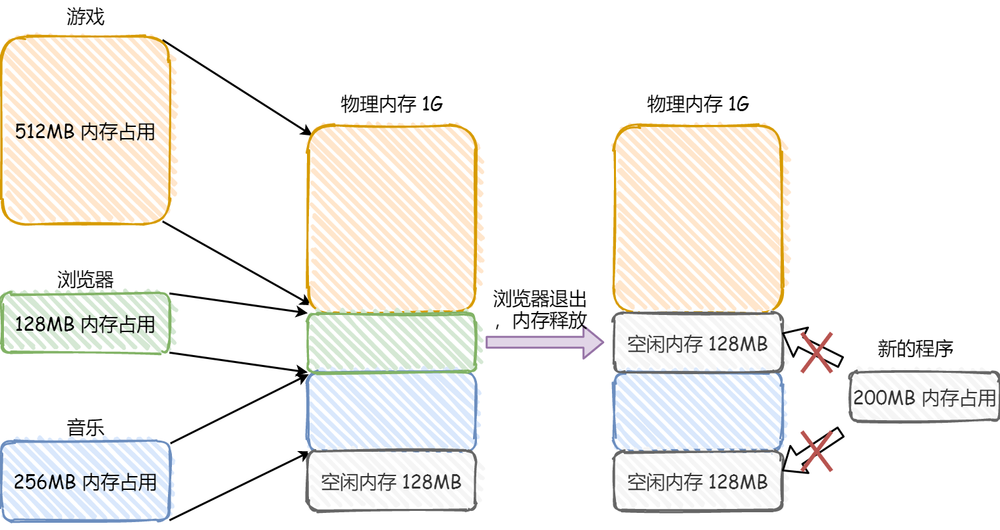
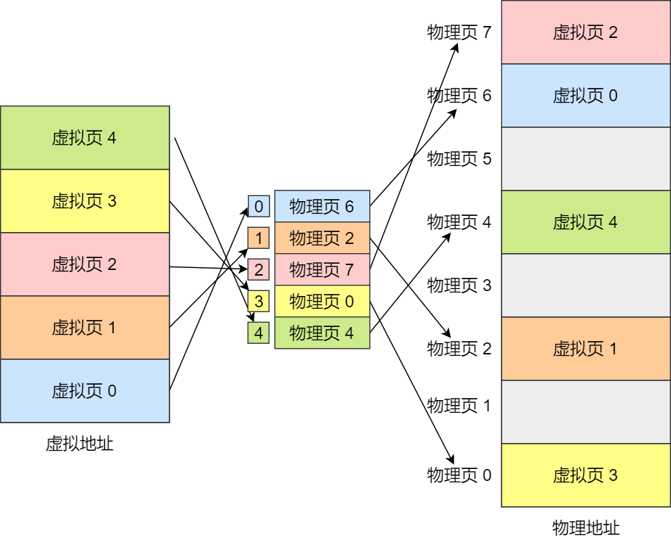
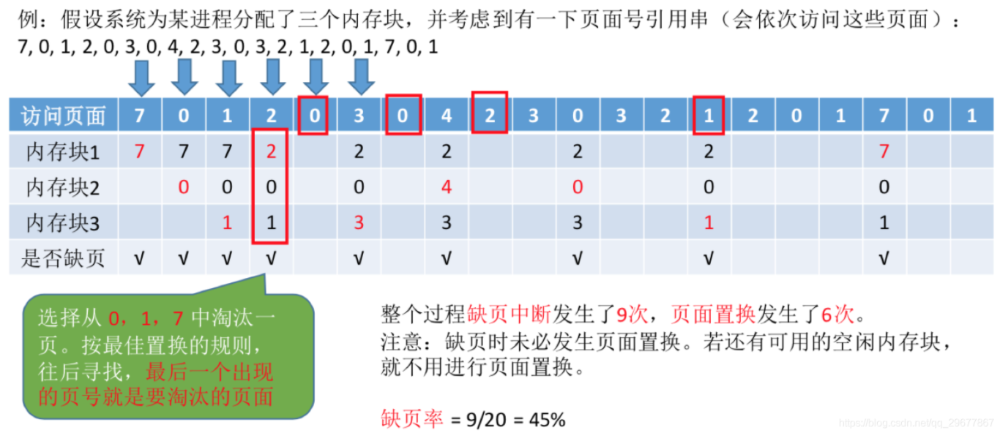
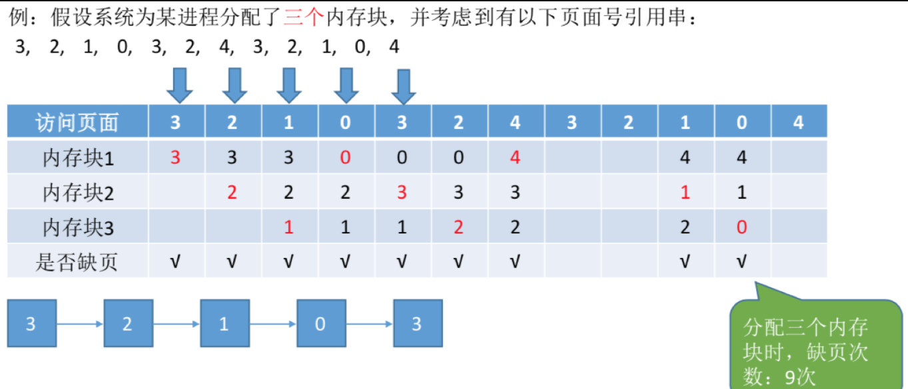
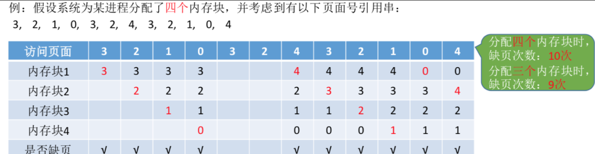
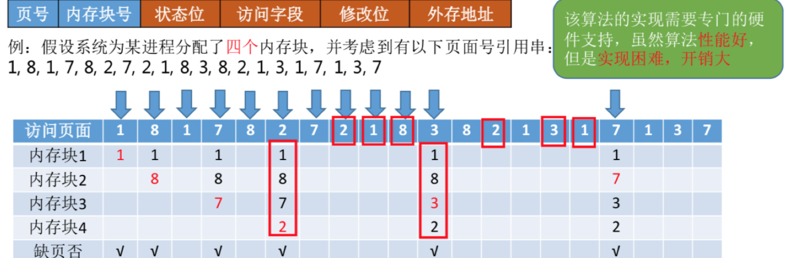
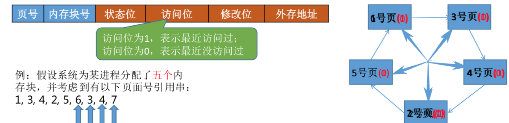
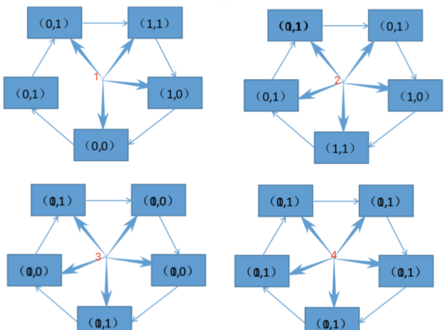

## 虚拟内存

**虚拟内存的目的是为了让物理内存扩充成更大的逻辑内存，从而让程序获得更多的可用内存。**

如果`CPU`直接去操作操作系统的内存，也就是物理内存，在这种情况下，要想在内存中同时运行多个程序是不可能的，就比如如果一个程序要向在`002`这个位置上写入一个新的值，那么就会覆盖掉上一个程序在相同位置上的所有内容，所以同时运行两个程序是根本行不通的，这两个程序会立刻崩溃。

操作系统为每一个进程分配一套独立的**虚拟地址**，各个程序操作自己的地址，互不干涉，但是这样每个进程不能直接访问物理地址。

操作系统就是提供一种这样的机制，**将不同进程的虚拟地址和不同内存的物理地址映射起来。**

如果程序要访问虚拟地址的时候，由操作系统转换成不同的物理地址，这样不同的进程运行的时候，写入的是不同的物理地址，这样就不会冲突了。

## 操作系统是如何管理虚拟地址与物理地址之间的关系？

> - 我们程序所使用的内存地址叫做**虚拟内存地址**（Virtual Memory Address）
> - 实际存在硬件里面的空间地址叫**物理内存地址**（Physical Memory Address）。

主要有两种方式，分别是**内存分段**和**内存分页**

### 内存分段

程序是由若干个逻辑分段组成的，比如有 代码分段、数据分段、栈段、堆段。**不同的段是有不同的属性的，所以就用分段（Segmentation）的形式把这些段分离出来。**

### 内存分页

分段的好处就是能产生连续的内存空间，但是会出现**内存碎片**和**内存交换的空间太大**的问题。

要解决这些问题，那么就要想出能少出现一些内存碎片的办法。另外，当需要进行内存交换的时候，让需要交换写入或者从磁盘装载的数据更少一点，这样就可以解决问题了。这个办法，也就是**内存分页**（Paging）。

分页是**把整个虚拟和物理内存空间切成一段段固定尺寸的大小**。这样一个连续并且尺寸固定的内存空间，我们叫**页**（`Page`）。在 `Linux` 下，每一页的大小为 `4KB`。

虚拟地址与物理地址之间通过**页表**来映射，如下图：

页表实际上存储在 `CPU` 的内存管理单元（`MMU`） 中，于是 `CPU` 就可以直接通过 `MMU`，找出要实际要访问的物理内存地址。

而当进程访问的虚拟地址在页表中查不到时，系统会产生一个缺页异常，进入系统内核空间分配物理内存、更新进程页表，最后再返回用户空间，恢复进程的运行。

### 分段机制下，虚拟地址和物理地址是如何映射的？

分段机制下的虚拟地址由两部分组成，**段选择因子**和**段内偏移量**。

- **段选择因子**就保存在段寄存器里面。段选择因子里面最重要的是**段号**，用作段表的索引。段表里面保存的是这个段的基地址、段的界限和特权等级等。

- 虚拟地址中的**段内偏移量**应该位于 `0` 和段界限之间，如果段内偏移量是合法的，就将段基地址加上段内偏移量得到物理内存地址。

所以，虚拟地址是通过段表与物理地址进行映射的，分段机制会把程序的虚拟地址分成 `4` 个段，每个段在段表中有一个项，在这一项找到段的基地址，再加上偏移量，于是就能找到物理内存中的地址，如下图：

如果要访问段 `3` 中偏移量 `500` 的虚拟地址，我们可以计算出物理地址为，段 `3` 基地址 `7000 + 偏移量 500 = 7500`。

分段的办法很好，解决了程序本身不需要关心具体的物理内存地址的问题，但它也有一些不足之处：

- 第一个就是内存碎片的问题。
- 第二个就是内存交换的效率低的问题。

### 分段为什么会产生内存碎片的问题？

举个例子，假设有 `1G` 的物理内存，用户执行了多个程序，其中：

- 游戏占用了 512MB 内存
- 浏览器占用了 128MB 内存
- 音乐占用了 256 MB 内存。

这个时候，如果我们关闭了浏览器，则空闲内存还有 `1024 - 512 - 256 = 256MB`。

如果这个 `256MB` 不是连续的，被分成了两段 `128 MB` 内存，这就会导致没有空间再打开一个 `200MB` 的程序。

这里的内存碎片的问题共有两处地方：

- 外部内存碎片，也就是产生了多个不连续的小物理内存，导致新的程序无法被装载；
- 内部内存碎片，程序所有的内存都被装载到了物理内存，但是这个程序有部分的内存可能并不是很常使用，这也会导致内存的浪费；

### 分段怎么解决内存碎片问题

针对**外部内存碎片**和**内部内存碎片**两种不同内存碎片问题，解决的方式会有所不同。

解决外部内存碎片的问题就是**内存交换**。

可以把音乐程序占用的那 `256MB` 内存写到硬盘上，然后再从硬盘上读回来到内存里。不过再读回的时候，我们不能装载回原来的位置，而是紧紧跟着那已经被占用了的 `512MB` 内存后面。这样就能空缺出连续的 `256MB` 空间，于是新的 `200MB` 程序就可以装载进来。

这个内存交换空间，在 `Linux` 系统里，也就是我们常看到的 `Swap` 空间，这块空间是从硬盘划分出来的，用于内存与硬盘的空间交换。

### 分段为什么会导致内存交换效率低的问题？

对于多进程的系统来说，用分段的方式，内存碎片是很容易产生的，产生了内存碎片，那不得不重新 `Swap` 内存区域，这个过程会产生性能瓶颈。

因为硬盘的访问速度要比内存慢太多了，每一次内存交换，我们都需要把一大段连续的内存数据写到硬盘上。

所以，如果内存交换的时候，交换的是一个占内存空间很大的程序，这样整个机器都会显得卡顿。

为了解决内存分段的内存碎片和内存交换效率低的问题，就出现了内存分页。

### 分页是怎么解决分段的内存碎片、内存交换效率低的问题？

由于内存空间都是预先划分好的，也就不会像分段会产生间隙非常小的内存，这正是分段会产生内存碎片的原因。而采用了分页，那么释放的内存都是以页为单位释放的，也就不会产生无法给进程使用的小内存。

如果内存空间不够，操作系统会把其他正在运行的进程中的「**最近没被使用**」的内存页面给释放掉，也就是暂时写在硬盘上，称为换出（**Swap Out**）。一旦需要的时候，再加载进来，称为换入（**Swap In**）。所以，一次性写入磁盘的也只有少数的一个页或者几个页，不会花太多时间，内存交换的效率就相对比较高。

更进一步地，分页的方式使得我们在加载程序的时候，不再需要一次性都把程序加载到物理内存中。我们完全可以在进行虚拟内存和物理内存的页之间的映射之后，并不真的把页加载到物理内存里，而是只有在程序运行中，需要用到对应虚拟内存页里面的指令和数据时，再加载到物理内存里面去。

### 分页机制下，虚拟地址和物理地址是如何映射的？

在分页机制下，虚拟地址分为两部分，页号和页内偏移。页号作为页表的索引，页表包含物理页每页所在物理内存的基地址，这个基地址与页内偏移的组合就形成了物理内存地址，见下图。

对于一个内存地址转换，其实就是这样三个步骤：

- 把虚拟内存地址，切分成页号和偏移量；
- 根据页号，从页表里面，查询对应的物理页号；
- 直接拿物理页号，加上前面的偏移量，就得到了物理内存地址。

虚拟内存中的页通过页表映射为物理内存中的页，如下图：

### 简单的分页有什么缺陷吗？

有空间上的缺陷。

因为操作系统是可以同时运行非常多的进程的，那这不就意味着页表会非常的庞大。

在 32 位的环境下，虚拟地址空间共有 4GB，假设一个页的大小是 4KB（2^12），那么就需要大约 100 万 （2^20） 个页，每个「页表项」需要 4 个字节大小来存储，那么整个 4GB 空间的映射就需要有 4MB 的内存来存储页表。

这 4MB 大小的页表，看起来也不是很大。但是要知道每个进程都是有自己的虚拟地址空间的，也就说都有自己的页表。

那么，100 个进程的话，就需要 400MB 的内存来存储页表，这是非常大的内存了，更别说 64 位的环境了。

### 什么是多级页表

要解决简单的分页的空间缺陷问题，就需要采用的是一种叫作多级页表（`Multi-Level Page Table`）的解决方案。

在前面我们知道了，对于单页表的实现方式，在 32 位和页大小 4KB 的环境下，一个进程的页表需要装下 100 多万个「页表项」，并且每个页表项是占用 4 字节大小的，于是相当于每个页表需占用 4MB 大小的空间。

我们把这个 100 多万个「页表项」的单级页表再分页，将页表（一级页表）分为 1024 个页表（二级页表），每个表（二级页表）中包含 1024 个「页表项」，形成二级分页。如下图所示：

> 你可能会问，分了二级表，映射 4GB 地址空间就需要 4KB（一级页表）+ 4MB（二级页表）的内存，这样占用空间不是更大了吗？
>
> 当然如果 4GB 的虚拟地址全部都映射到了物理内存上的话，二级分页占用空间确实是更大了，但是，我们往往不会为一个进程分配那么多内存。

## 虚拟内存页面置换算法

### 1、最佳置换法(OPT)

最佳置换算法(OPT，Optimal) :每次选择淘汰的页面将是以后永不使用，或者在最长时间内不再被访问的页面，这样可以保证最低的缺页率。

最佳置换算法可以保证最低的缺页率，但实际上，只有在进程执行的过程中才能知道接下来会访问到的是哪个页面。操作系统无法提前预判页面访问序列。因此，最佳置换算法是无法实现的

### 2、先进先出置换算法(FIFO)

先进先出置换算法(FIFO) :每次选择淘汰的页面是最早进入内存的页面
实现方法:把调入内存的页面根据调入的先后顺序排成一个队列，需要换出页面时选择队头页面队列的最大长度取决于系统为进程分配了多少个内存块。

Belady异常—当为进程分配的物理块数增大时，缺页次数不减反增的异常现象。

只有FIFO算法会产生Belady异常，而LRU和OPT算法永远不会出现Belady异常。另外，FIFO算法虽然实现简单，但是该算法与进程实际运行时的规律不适应，因为先进入的页面也有可能最经常被访问。因此，算法性能差

FIFO的性能较差，因为较早调入的页往往是经常被访问的页，这些页在FIFO算法下被反复调入和调出，并且有Belady现象。所谓Belady现象是指：采用FIFO算法时，如果对—个进程未分配它所要求的全部页面，有时就会出现分配的页面数增多但缺页率反而提高的异常现象。

### 3、最近最久未使用置换算法(LRU)

最近最久未使用置换算法(LRU，least recently used) :每次淘汰的页面是最近最久未使用的页面
实现方法:赋予每个页面对应的页表项中，用访问字段记录该页面自.上次被访问以来所经历的时间t(该算法的实现需要专门的硬件支持，虽然算法性能好，但是实现困难，开销大)。当需要淘汰一个页面时，选择现有页面中t值最大的，即最近最久未使用的页面。

LRU性能较好，但需要寄存器和栈的硬件支持。LRU是堆栈类算法，理论上可以证明，堆栈类算法不可能出现Belady异常。

在手动做题时，若需要淘汰页面，可以逆向检查此时在内存中的几个页面号。在逆向扫描过程中最后一个出现的页号就是要淘汰的页面。

### 4、时钟置换算法(CLOCK)

最佳置换算法性OPT能最好，但无法实现；先进先出置换算法实现简单，但算法性能差；最近最久未使用置换算法性能好，是最接近OPT算法性能的，但是实现起来需要专门的硬件支持，算法开销大。

所以操作系统的设计者尝试了很多算法，试图用比较小的开销接近LRU的性能，这类算法都是CLOCK算法的变体，因为算法要循环扫描缓冲区像时钟一样转动。所以叫clock算法。

时钟置换算法是一种性能和开销较均衡的算法，又称CLOCK算法，或最近未用算法(NRU，Not Recently Used)

简单的CLOCK算法实现方法:为每个页面设置一个访问位，再将内存中的页面都通过链接指针链接成一个循环队列。当某页被访问时，其访问位置为1。当需要淘汰-一个页面时，只需检查页的访问位。如果是0，就选择该页换出;如果是1，则将它置为0，暂不换出，继续检查下一个页面，若第- - ~轮扫描中所有页面都是1，则将这些页面的访问位依次置为0后，再进行第二轮扫描(第二轮扫描中一定会有访问位为0的页面，因此简单的CLOCK算法选择–个淘汰页面最多会经过两轮扫描)

### 5、改进型的时钟置换算法

简单的时钟置换算法仅考虑到一个页面最近是否被访问过。事实上，如果被淘汰的页面没有被修改过,就不需要执行I/O操作写回外存。只有被淘汰的页面被修改过时，才需要写回外存。

因此，除了考虑一个页面最近有没有被访问过之外，操作系统还应考虑页面有没有被修改过。在其他条件都相同时，应优先淘汰没有修改过的页面，避免I/O操作。这就是改进型的时钟置换算法的思想。修改位=0，表示页面没有被修改过;修改位=1，表示页面被修改过。

为方便讨论，用(访问位，修改位)的形式表示各页面状态。如(1, 1)表示一个页面近期被访问过，且被修改过。

改进型的Clock算法需要综合考虑某一内存页面的访问位和修改位来判断是否置换该页面。在实际编写算法过程中，同样可以用一个等长的整型数组来标识每个内存块的修改状态。访问位A和修改位M可以组成一下四种类型的页面。

算法规则:将所有可能被置换的页面排成–个循环队列

> 第一轮:从当前位置开始扫描到第一个(A =0, M = 0)的帧用于替换。表示该页面最近既未被访问，又未被修改，是最佳淘汰页
> 第二轮:若第一轮扫描失败，则重新扫描，查找第一个(A =1, M = 0)的帧用于替换。本轮将所有扫描过的帧访问位设为0。表示该页面最近未被访问，但已被修改，并不是很好的淘汰页。
> 第三轮:若第二轮扫描失败，则重新扫描，查找第一个(A =0, M = 1)的帧用于替换。本轮扫描不修改任何标志位。表示该页面最近已被访问，但未被修改，该页有可能再被访问。
> 第四轮:若第三轮扫描失败，则重新扫描，查找第一个A =1, M = 1)的帧用于替换。表示该页最近已被访问且被修改，该页可能再被访问。

由于第二轮已将所有帧的访问位设为0，因此经过第三轮、第四轮扫描一定会有一个帧被选中，因此改进型CLOCK置换算法选择- -个淘汰页面最多会进行四轮扫描

算法规则：将所有可能被置换的页面排成一个循环队列
第一轮:从当前位置开始扫描到第-一个(0, 0)的帧用于替换。本轮扫描不修改任何标志位。(第一优先级:最近没访问，且没修改的页面)
第二轮:若第一轮扫描失败，则重新扫描，查找第一个(0, 1)的帧用于替换。本轮将所有扫描过的帧访问位设为0
(第二优先级: 最近没访问，但修改过的页面)
第三轮:若第二轮扫描失败，则重新扫描，查找第一个(0, 0)的帧用于替换。本轮扫描不修改任何标志位(第三优先级:最近访问过，但没修改的页面)
第四轮:若第三轮扫描失败，则重新扫描，查找第一个(0, 1)的帧用于替换。(第四优先级:最近访问过，且修改过的页面)
由于第二轮已将所有帧的访问位设为0，因此经过第三轮、第四轮扫描一定会有一个帧被选中，因此改进型CLOCK置换算法选择一个淘汰页面最多会进行四轮扫描

### 6、总结

|                         | 算法规则                                                     | 优缺点                                          |
| ----------------------- | ------------------------------------------------------------ | ----------------------------------------------- |
| OPT                     | 优先淘汰最长时间内不会被访问的页面                           | 缺页率最小，性能最好;但无法实现                 |
| FIFO                    | 优先淘汰最先进入内存的页面                                   | 实现简单;但性能很差，可能出现Belady异常         |
| LRU                     | 优先淘汰最近最久没访问的页面                                 | 性能很好;但需要硬件支持，算法开销大             |
| CLOCK (NRU)             | 循环扫描各页面 第一轮淘汰访问位=0的，并将扫描过的页面访问位改为1。若第-轮没选中，则进行第二轮扫描。 | 实现简单，算法开销小;但未考虑页面是否被修改过。 |
| 改进型CLOCK (改进型NRU) | 若用(访问位，修改位)的形式表述，则 第一轮:淘汰(0,0) 第二轮:淘汰(O,1)，并将扫描过的页面访问位都置为0 第三轮:淘汰(O, 0) 第四轮:淘汰(0, 1) | 算法开销较小，性能也不错                        |

## 虚拟技术你了解吗？

虚拟技术把一个物理实体转换为多个逻辑实体。

主要有两种虚拟技术：时（时间）分复用技术和空（空间）分复用技术。

多进程与多线程：多个进程能在同一个处理器上并发执行使用了时分复用技术，让每个进程轮流占用处理器，每次只执行一小个时间片并快速切换。

虚拟内存使用了空分复用技术，它将物理内存抽象为地址空间，每个进程都有各自的地址空间。地址空间的页被映射到物理内存，地址空间的页并不需要全部在物理内存中，当使用到一个没有在物理内存的页时，执行页面置换算法，将该页置换到内存中。

## 说一下你理解中的内存？有什么作用呢？

### 内存的覆盖是什么？有什么特点？

由于程序运行时并非任何时候都要访问程序及数据的各个部分（尤其是大程序），因此可以把用户空间分成为一个固定区和若干个覆盖区。将经常活跃的部分放在固定区，其余部分按照调用关系分段，首先将那些即将要访问的段放入覆盖区，其他段放在外存中，在需要调用前，系统将其调入覆盖区，替换覆盖区中原有的段。

覆盖技术的特点：是打破了必须将一个进程的全部信息装入内存后才能运行的限制，但当同时运行程序的代码量大于主存时仍不能运行，再而，大家要注意到，内存中能够更新的地方只有覆盖区的段，不在覆盖区的段会常驻内存。

### 内存交换是什么？有什么特点？

**交换(对换)技术的设计思想**：内存空间紧张时，系统将内存中某些进程暂时换出外存，把外存中某些已具备运行条件的进程换入内存(进程在内存与磁盘间动态调度)

换入：把准备好竞争CPU运行的程序从辅存移到内存。
换出：把处于等待状态（或CPU调度原则下被剥夺运行权力）的程序从内存移到辅存，把内存空间腾出来。

### 什么时候会进行内存的交换？

内存交换通常在许多进程运行且内存吃紧时进行，而系统负荷降低就暂停。例如:在发现许多进程运行时经常发生缺页，就说明内存紧张，此时可以换出一些进程;如果缺页率明显下降，就可以暂停换出。

