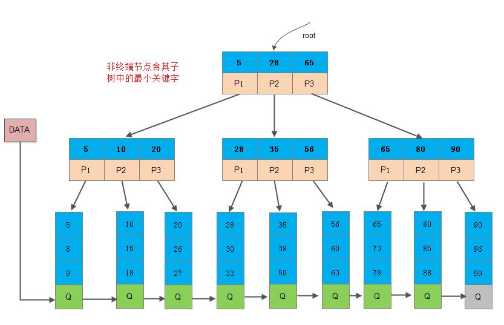

## 数据存储引擎

存储引擎是`MYSQL`的核心技术，不同的存储引擎使用不同的存储机制、索引技巧、锁定水平并最终提供不同的功能和能力。常见的引擎分为三种：**InnoDB存储引擎（MYSQL默认的事务性引擎）、MyISAM存储引擎、Memory存储引擎**。

* InnoDB ： `InnoDB`是`mysql`的默认引擎，支持事务和外键，支持容灾恢复。适合更新频繁和多并发的表  行级锁

* MyISAM ： 插入和查询速度比较快，支持大文件，但是不支持事务，适合在`web`和数据仓库场景下使用  表级锁

* MEMORY ： `memory`将表中的数据保存在内存里，适合数据比较小而且频繁访问的场景

## `MySQL`的索引

### 为什么要用索引

假设有一张存储了10万个数据（每条数据包含姓名、年龄、身份证号等信息）的表，若没有索引，要想查找姓名为"张三”的身份信息，需要从上到下依次对表中的所有数据进行扫描，找到所有名为张三的数据，这也叫全表查询。

可以看出，全表查询的效率非常低，需要逐条对比，因此就需要通过对每条数据建立索引，从而直接通过索引快速查询到数据信息，大大提高了查询效率。

###  索引的底层实现（重点）

**数据库的索引是使用B+树来实现的**。

（为什么要用B+树，为什么不用红黑树和B树）<br>

B+树是一种特殊的平衡多路树，是B树的优化改进版本，它把所有的数据都存放在叶节点上，中间节点保存的是索引。这样一来相对于B树来说，减少了数据对中间节点的空间占用，使得中间节点可以存放更多的指针，使得树变得更矮，深度更小，从而减少查询的磁盘IO次数，提高查询效率。另一个是由于叶节点之间有指针连接，所以可以进行范围查询，方便区间访问。

而红黑树是二叉树，它的深度相对B+树来说更大，更大的深度意味着查找次数更多，更频繁的磁盘IO，所以红黑树更适合在内存中进行查找。

### B树和B+树的区别



这都是由于B+树和B具有不同的存储结构所造成的区别，以一个m阶树为例。

1. **关键字的数量不同**；B+树中分支结点有m个关键字，它的孩子结点也有m个，其关键字只是起到了一个索引的作用，但是B树虽然也有m个子结点，但是其只拥有m-1个关键字。
2. **存储的位置不同**；B+树中的数据都存储在叶子结点上，也就是其所有叶子结点的数据组合起来就是完整的数据，但是B树的数据存储在每一个结点中，并不仅仅存储在叶子结点上。
3. **分支结点的构造不同**；B+树的分支结点仅仅存储着关键字信息和孩子节点的指针（这里的指针指的是磁盘块的偏移量），也就是说内部结点仅仅包含着索引信息。
4. **查询不同**；B树在找到具体的数值以后，则结束，而B+树则需要通过索引找到叶子结点中的数据才结束，也就是说B+树的搜索过程中走了一条从根结点到叶子结点的路径。

B+树优点：由于B+树的数据都存储在叶子结点中，分支结点均为索引，方便查询，只需要扫一遍叶子结点即可，但是B树因为其分支结点同样存储着数据，我们要找到具体的数据，需要进行一次中序遍历按序来查找，所以B+树更加适合在区间查询的情况，所以通常B+树用于数据库索引，而B树则常用于文件索引。

## Mysql的优化（高频，索引优化，性能优化）

高频访问：

* 分表分库：将数据库表进行水平拆分，减少表的长度
* 增加缓存： 在web和DB(数据库)之间加上一层缓存层
* 增加数据库的索引：在合适的字段加上索引，解决高频访问的问题

并发优化：

* 主从读写分离：只在主服务器上写，从服务器上读
* 负载均衡集群：通过集群或者分布式的方式解决并发压力

## 数据库SQL优化总结

1.对查询进行优化，要尽量避免全表扫描，首先应考虑在 `where` 及 `order by `涉及的列上建立索引。

2.应尽量避免在 `where` 子句中对字段进行 `null` 值判断，否则将导致引擎放弃使用索引而进行全表扫描，备注、描述、评论之类的可以设置为 NULL，其他的，最好不要使用`NULL`。

3.应尽量**避免在 where 子句中对字段进行表达式操作**，这将导致引擎放弃使用索引而进行全表扫描。如：

```sql
select id from t where num/2 = 100
```
应改为:
```sql
select id from t where num = 100*2
```
4.任何地方都不要使用 `select * from t` ，用具体的字段列表代替`“*”`，不要返回用不到的任何字段。

5.尽量避免使用游标，因为游标的效率较差，如果游标操作的数据超过1万行，那么就应该考虑改写。

6.不要在 where 子句中的“=”左边进行函数、算术运算或其他表达式运算，否则系统将可能无法正确使用索引。

[参考这里吧](/数据库/数据库SQL优化总结)

## 乐观锁与悲观锁解释一下

一般的数据库都会支持并发操作，在并发操作中为了避免数据冲突，所以需要对数据上锁，乐观锁和悲观锁就是两种不同的上锁方式。

悲观锁假设数据在并发操作中一定会发生冲突，所以在数据开始读取的时候就把数据锁住。而乐观锁则假设数据一般情况下不会发生冲突，所以在数据提交更新的时候，才会检测数据是否有冲突。

悲观锁（Pessimistic Lock） ：适用于多写的应用类型

乐观锁（Optimistic Lock）：适用于多读的应用类型

### 乐观锁与悲观锁是怎么实现的

悲观锁有行级锁和页级锁两种形式。行级锁对正在使用的单条数据进行锁定，事务完成后释放该行数据，而页级锁则对整张表进行锁定，事务正在对该表进行访问的时候不允许其他事务并行访问。

悲观锁要求在整个过程中一直与数据库有一条连接，因为上一个事务完成后才能让下一个事务执行，这个过程是串行的。

乐观锁有三种常用的实现形式：

* 一种是在执行事务时把整个数据都拷贝到应用中，在数据更新提交的时候比较数据库中的数据与新数据，如果两个数据一摸一样则表示没有冲突可以直接提交，如果有冲突就要交给业务逻辑去解决。
* 一种是使用版本号来对数据进行标记，数据每发生一次修改，版本号就增加1。某条数据在提交的时候，如果数据库中的版本号与自己的一致，就说明数据没有发生修改，否则就认为是过期数据需要处理。
* 最后一种采用时间戳对数据最后修改的时间进行标记。与上一种类似。


## 事务的四大特性（ACID）
1、原子性（Atomicity）： 事务开始后的所有操作要么全部完成，要么全部不完成，不能只完成一部分。事务执行过程中发生错误，会回滚已有操作并恢复到事务开始前的状态。

2、一致性（Consistency）： 事务开始前和结束后，数据库的完整性没有被破坏。比如：A向B转账1000元，A的账户中会减少1000元，而B的账户中会增加1000元。

3、隔离性（Isolation）： 多个事务并发执行时，同一时间只允许一个事务请求同一数据，不同的事务之间不会互相干扰。如：A在从一张银行卡取款的过程中，其他人不能向这张银行卡转账。

4、持久性（Durability）： 事务完成之后，事务对数据库的所有更改应该保存在数据库中，不能回滚。

### 数据库事务隔离级别

事务就是访问数据库进行的一组数据操作，所有操作必须成功，否则就会回滚所有操作导致失败。

### 什么是脏读，不可重复读和幻读（事务并发的三大问题）

详见[数据库的事务隔离级别总结](https://blog.csdn.net/fuzhongmin05/article/details/91126936)

* 脏读：脏读是指一个事务在处理过程中读取了另一个还没提交的事务的数据。

  > 比如A向B转账100，A的账户减少了100，而B的账户还没来得及修改，此时一个并发的事务访问到了B的账户，就是脏读

* 不可重复读：不可重复读是对于数据库中的某一个字段，一个事务多次查询却返回了不同的值，这是由于在查询的间隔中，该字段被另一个事务修改并提交了。

  > 比如A第一次查询自己的账户有1000元，此时另一个事务给A的账户增加了1000元，所以A再次读取他的账户得到了2000的结果，跟第一次读取的不一样。
  > 不可重复读与脏读的不同之处在于，脏读是读取了另一个事务没有提交的脏数据，不可重复读是读取了已经提交的数据，实际上并不是一个异常现象。

* 幻读：事务多次读取同一个范围的时候，查询结果的记录数不一样，这是由于在查询的间隔中，另一个事务新增或删除了数据。

  > 比如A公司一共有100个人，第一次查询总人数得到100条记录，此时另一个事务新增了一个人，所以下一次查询得到101条记录。
  > 不可重复度和幻读的不同之处在于，幻读是多次读取的结果行数不同，不可重复度是读取结果的值不同。

避免不可重复读需要锁行，避免幻读则需要锁表。

脏读，不可重复读和幻读都是数据库的读一致性问题，是在并行的过程中出现的问题，必须采用一定的隔离级别解决。
详见[脏读、不可重复读和幻读的区别](https://www.cnblogs.com/Hakuna-Matata/p/7772794.html)

### 数据库的隔离级别，mysql和Oracle的隔离级别分别是什么（重点）

详见[数据库的事务隔离级别总结](https://blog.csdn.net/fuzhongmin05/article/details/91126936)和[数据库隔离级别](https://blog.csdn.net/fg2006/article/details/6937413)

为了保证数据库事务一致性，解决脏读，不可重复读和幻读的问题，数据库的隔离级别一共有四种隔离级别：

* 读未提交 Read Uncommitted: 最低级别的隔离，不能解决以上问题
* 读已提交 Read committed:   可以避免脏读的发生 
* 可重复读 Reapeatable read:  确保事务可以多次从一个字段中读取相同的值，在该事务执行期间，禁止其他事务对此字段的更新，可以避免脏读和不可重复读。 通过行锁来实现 
* 串行化 Serializaion  最严格的事务隔离机制，要求所有事务被串行执行，可以避免以上所有问题。 通过锁表来实现

`Oracle`的默认隔离级别是**读已提交**，实现了四种隔离级别中的读已提交和串行化隔离级别

`MySQL`的默认隔离级别是**可重复读**，并且实现了所有四种隔离级别

## MCVV（多版本并发控制）实现机制

`MCVV`是一种多版本并发控制机制，通过保存数据在某个时间点的快照来实现的。不同的存储引擎的MCVV实现是不同的，典型的有乐观（Optimistic）并发控制和悲观（pessimistic）并发控制。

`InnoDB`的`MCVV`，是通过在每行记录后面保存两个隐藏的列来实现的。这两个列，一个保存了行的创建时间，一个保存行的删除时间。这里时间指的并不是实际的时间值，而是系统版本号。每开始一个新的事务，系统版本号都会自动递增。事务开始时刻的系统版本号会作为事务版本号，用来和查询到的每行记录的版本号进行比较。在可重复读(repeatable read)隔离级别下，输入`SELECT`查找语句时，`InnoDB`只查找版本早于当前事务版本的数据行。保存这两个额外的系统版本号，使大多数读操作都可以不用加锁。这样设计使得读数据操作简单，性能好。不足之处就是每行记录都需要额外的存储空间，需要更多的行检查和维护工作。

## 数据库的范式


* **第一范式(确保每列保持原子性)**<br>
  第一范式是最基本的范式。如果数据库表中的所有字段值都是不可分解的原子值，就说明该数据库表满足了第一范式。

>比如 学生 选课（包括很多课程） 就不符合第一范式

* **第二范式(确保表中的每列都和主键相关)**<br>
  在满足第一范式的前提下，（主要针对联合主键而言）第二范式需要确保数据库表中的每一列都和主键的所有成员直接相关，由整个主键才能唯一确定，而不能只与主键的某一部分相关或者不相关。 

>比如一张学生信息表，由主键（学号）可以唯一确定一个学生的姓名，班级，年龄等信息。但是主键 （学号，班级） 与列 姓名，班主任，教室 就不符合第二范式，因为班主任跟部分主键（班级）是依赖关系

* **第三范式(确保非主键的列没有传递依赖)**<br>
  在满足第二范式的前提下，第三范式需要确保数据表中的每一列数据都和主键直接相关，而不能间接相关。非主键的列不能确定其他列，列与列之间不能出现传递依赖。

>比如一张学生信息表，主键是（学号）列包括 姓名，班级，班主任 就不符合第三范式，因为非主键的列中 班主任 依赖于 班级

* **BCNF范式（确保主键之间没有传递依赖）**<br>
  主键有可能是由多个属性组合成的复合主键，那么多个主键之间不能有传递依赖。也就是复合主键之间谁也不能决定谁，相互之间没有关系。

## 说一下 MySQL 执行一条查询语句的内部执行过程？

* 连接器：客户端先通过连接器连接到 MySQL 服务器。
* 缓存：连接器权限验证通过之后，先查询是否有查询缓存，如果有缓存（之前执行过此语句）则直接返回缓存数据，如果没有缓存则进入分析器。
* 分析器：分析器会对查询语句进行语法分析和词法分析，判断 SQL 语法是否正确，如果查询语法错误会直接返回给客户端错误信息，如果语法正确则进入优化器。
* 优化器：优化器是对查询语句进行优化处理，例如一个表里面有多个索引，优化器会判别哪个索引性能更好。
* 执行器：优化器执行完就进入执行器，执行器就开始执行语句进行查询比对了，直到查询到满足条件的所有数据，然后进行返回。

