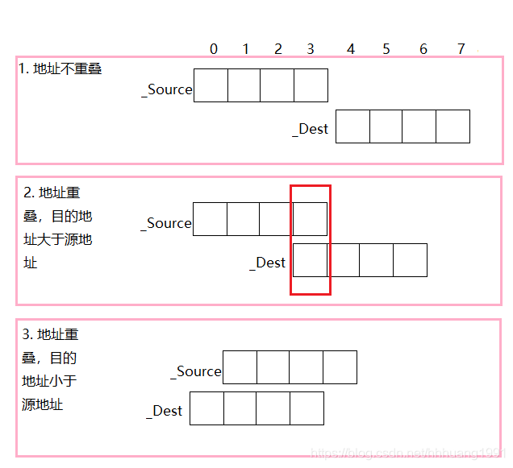

## 写一个单例模式

```cpp
class Singleton
{
public:
    static Singleton& Instance()
    {
        static Singleton singleton;
        return singleton;
    }
private:
    Singleton() { };
};
```

### 写一个线程安全版的单例模式

```cpp
class Singleton{
  private:
    static Singleton* instance;
    Singleton(){
      // initialize
    }
  public:
    static Singleton* getInstance(){
      if(instance==nullptr) instance=new Singleton();
      return instance;
    }
};
```
[点击查看详细：理解单例模式](/C++随记/06C++单例模式.md)

## 不使用临时变量实现`swap`函数

异或运算符`^`也称`XOR`运算符，它的规则是若参加运算的两个二进位同号，则结果为0（假）；异号为1（真）。即`0 ^ 0 = 0`, `0 ^ 1 = 1`, `1 ^ 0 = 1`, `1 ^ 1 = 0`。

```cpp
void swap(int& a,int& b){
  a=a^b;
  b=a^b;
  a=a^b;
}
```

## 实现一个`strcpy`函数

一个完美的答案应该要考虑：

> 将字符串`src`复制给`dest`

```cpp
#include <iostream>
#include <vector>
#include <string>
using namespace std;

char * myStrcpy(char *dest,const char* str )
{
    if (dest == NULL || str == NULL) {
        return NULL;
    }
    if(dest == str) {
        return dest;
    }
    int i=0;
    while(str[i] != '\0') {
        dest[i] = str[i];
        ++i;
    }
    dest[i] = '\0';

    return dest;
}

int main() {

    char str[] = "hello";
    char dest[6];
    myStrcp(dest,str);
    char *p = dest;
    while (*p!='\0') {
        cout << *p++;
    }
    cout << endl;
    return 0;
}
```


### 为什么要返回`char*`类型
为了实现链式连接。返回内容为指向目标内存的地址指针，这样可以在需要字符指针的函数中使用`strcpy`,例如`strlen(strcpy(str1, str2))`。

### 源地址和目标地址出现内存重叠时，如何保证复制的正确性

调用`c`运行库`strcpy`函数，发现即使是内存重叠，也能正常复制，但是上面的实现就不行。说明，`c`运行库中`strcpy`函数实现，还加入了检查内存重叠的机制，下面是参考代码：

```cpp
//my_memcpy实现重叠内存转移
char* my_memcpy(char* dest, const char* src, int count)
{
    //检查传入参数的有效性
    assert(NULL != dest);
    assert(NULL != src);
    if (NULL == dest || NULL == src)
         return NULL;
    char* ret = dest;
    /**
    dest和 src 的内存地址有三种排列组合：
    1. dest和 src 没有发生重叠；
    2. dest和 src 地址重叠，且 dest的地址大于 src 的地址；
    3. dest和 src 地址重叠，dest 的地址小于 src 的地址；
    第一种情况和第三种情况，直接从低位字节开始复制，即可；
    第二种情况，必须从高位字节开始复制，才能保证复制正确。
    */
    //源地址和目的地址重叠，高字节向低字节拷贝  (第二种)
    if (dest> src && dest < src + count )
    {
         dest = dest + count - 1;
         src = src + count - 1;
         while(count--)
         {
             *dest-- = *src--;
         }
    }else //源地址和目的地址不重叠，低字节向高字节拷贝 （第一和第三种）
    {
         while(count--)
         {
             *dest++ = *src++;
         }
    }
    return ret;
}

int main() {
    char str1[] = "kendall";
    char str2[] = "sunny";
    cout << myStrcpy(str2,str1) << endl;  //把str1复制给str2， kendall
    // cout << myStrcpy(str+1,str) << endl;  //error

    char str[10]="kendall"; 
    cout << my_memcpy(str+1,str,strlen(str)) << endl;  //kendall

    return 0;
}
```

### strcpy和memcpy的区别

`strcpy`和`memcpy`都是标准`C`库函数。

- `strcpy`提供了字符串的复制。即`strcpy`只用于字符串复制，并且它不仅复制字符串内容之外，还会复制字符串的结束符。`memcpy`提供了一般内存的复制。即`memcpy`对于不需要复制的内容没有限制，因此用途更广；
- `strcpy`只有两个参数，即遇到`‘\0’`结束复制，而`memcpy`是**根据第三个参数来决定复制的长度**。



## 实现 strStr()

查找 needle 在 haystack 中第一次出现的位置

```cpp
class Solution {
public:
    void getNext(string &s,vector<int> next) {
        //初始化
        int j = 0;
        next[0] = 0;
        for(int i=1;i<s.size();++i) {
            while(j>0 && s[j] != s[i]) //不相等，需要回退
            {
                j = next[j - 1]; //从j-1对应的回退值开始回退
            }
            //如果值相等就++
            if(s[i] == s[j]) {
                ++j;
            }
            //保存前缀数组
            next[i] = j;
        }
    }
    int strStr(string haystack, string needle) {
        //如果模式串为空，那么就返回0
        if(needle.size() == 0) return 0;
        //定义一个next数组
        vector<int> next(needle.size());
        getNext(needle,next);
        int j = 0;
        for(int i=0;i<haystack.size();++i) {
            while(j>0 && haystack[i] != needle[j]) {
                j = next[j-1]; //这里找j前一位的对应的回退位置
            }
            if(haystack[i] == needle[j]) {
                ++j;
            }
            if(j == needle.size()) {
                return (i - needle.size() + 1);
            }
        }
        return -1;
    }
};
```

## 实现一个函数确定主机字节序

> 怎么用程序判断一个系统是大端字节序还是小端字节序


- 高位字节在低地址，低位字节在高地址，*（从低到高）*大端字节序。
- 高位字节在高地址，低位字节在低地址，*（从高到低）*小端字节序。

思路：网络字节序是大端的，也就是高位字节先传输。而`int--char`的强制转换，是将低地址的数值强制赋给`char`，利用这个准则可以判断系统是大端序还是小端序.

```cpp
#include <iostream>
using namespace std;

int main() {
	
	int a = 0x1234;
	char c = static_cast<char>(a);  //强制转并赋值给c
	if(c == 0x12)
		 cout << "big endian" << endl;
	if(c == 0x34)
		cout << "little endian" << endl;

	return 0;
}
```

此外，**利用union函数也可以做出判断**

`union`有一个特点，联合(`union`)变量的所有成员共享同一块存储区/内存，因此联合变量每个时刻里只能保存它的某一个成员的值。就是因为这个特点，`union`的长度就是它最大变量的长度。

```cpp
void test2() {
	union {
		char c;
		int n;
	}un;
	un.n = 0x01000002;
	//以十六进制输出
	printf("%X\n",un.c);
}
```
`un`的长度是4个字节，也就是最大成员n的长度，这一点可以用`sizeof`去验证。        
然后我们赋值给`un.n`令它的值是`0x010000002`，此时union的内存地址中只存有`un.n`的值，`un.c`并没有赋值，但是un.n和un.c的起始地址是一样的。      
我们用`printf`以`16`进制的格式输出`s.c`，这个时候就是s的起始地址的第一个字节的内容，在我的平台上输出结果是2，表示低地址存的是整数值的低位，那么我的平台字节序是小端表示的。

## 设计一个`LRU`

### LRU怎么设计

[最近最久未使用页面置换算法](/寻offer总结/操作系统/操作系统03?id=最近最久未使用的置换算法)

方法：使用 哈希表+双向链表

```cpp
LRUCache cache = new LRUCache(2);  //2 是缓存容量
cache.push(1,1);
cache.push(2,2);
cache.get(1);   //返回 1
cache.push(3,3);  //会先删掉(2,2),再插入（3，3）
```

先假设一个缓冲容量为 2 的LRU缓存。这里双向链表的 `tail` 方向是最近使用的元素。


- 首先执行`cache.push(1,1);`: 此时链表加入节点 1 ，哈希表也加入一个节点，并且指向链表的第一个节点。


- 执行`cache.push(2,2);`


- `cache.get(1);`: 因为访问了节点 1 ，所以节点 1 移动到尾部。


- `cache.push(3,3);`: 由于容量达到了上线，我们先进行删除操作，先删除`node 2`,再插入`node 3`。


```cpp
#include <iostream>
#include <cstdio>
#include <list>
#include <unordered_map>

using namespace std;

class LRUCache {
public:
    LRUCache(int capacity)
        : cap(capacity) {}

    // 先找hash table，如有，复制到头部，再删除原有位置元素
    int get(int key)
    {
        auto it = mp.find(key);  //返回的是迭代器
        // 如果找不到就直接返回
        if (it == mp.end()) return -1;

        // 获取value的值
        auto target_it = it->second;  
        // 定义一个pair对保存key,value
        pair<int, int> n {target_it->first, target_it->second};
        cache.push_front(n);
        cache.erase(target_it);  //删除
        mp.erase(key);
        //添加
        mp.emplace(key, cache.begin());

        return n.second;
    }

    // 先通过哈希表检查cache里是否已存在相同key， 有则删除，不管有没有都要把新 key 和 value 对放至头部, 如超出容量则再弹出末尾
    void put(int key, int value)
    {
        // unordered_map<int, list<pair<int, int>>::iterator>::iterator it= mp.find(key);
        auto it = mp.find(key);
        //如果找到了
        if (it != mp.end()) {
            //缓冲中先删除这个节点
            cache.erase(it->second);
            // 哈希表中删除这个key
            mp.erase(key);
        }

        //然后再插入到队头
        // list<pair<int,int>>::iterator target_it = it->second;
        pair<int, int> n {key, value};
        cache.push_front(n);
        mp.emplace(key, cache.begin());

        // 如果容量已经超出上限了，删除队尾元素
        if (cache.size() > cap) {
            mp.erase(cache.back().first);
            cache.pop_back();
        }
    }

    // 打印
    void show()
    {
        for (auto kv : cache) {
            // printf("%d:%d, ", kv.first, kv.second);
            cout << kv.first << ":" << kv.second << "  ";
        }
        // printf("  mp size: %zu\n", mp.size());
        cout << "   mp_size = " << mp.size() << endl;
    }
    
private:
    int cap = 0; //缓存容量
    list<pair<int, int>> cache;  //双向链表
    unordered_map<int, list<pair<int, int>>::iterator> mp;
};

int main() {
    LRUCache *lru = new LRUCache(2);
    // lru->cache[0] = {0,1};
    lru->put(1,1);
    lru->put(2,2);

    lru->show();
    int ret = lru->get(1);
    cout << "get(1) : " << ret << endl;
    lru->show();
    return 0;
}
```

[leetcode题目](https://leetcode-cn.com/problems/lru-cache-lcci/submissions/)

```cpp
class LRUCache {
public:
    LRUCache(int capacity) 
    : cap(capacity)
    {

    }
    
    //查找一个元素，先查找hash table,如果有就复制到表头，然后再删除原来的位置
    int get(int key) {
        unordered_map<int,list<pair<int,int>>::iterator >::iterator it = mp.find(key);
        // 如果找不到就直接返回
        if(it == mp.end()) {
            return -1;
        }

        // 如果找到就将其复制到表头再删除原有的位置
        // 获取value值
        auto target_it = it->second;  //mp里的value是pair对
        // 获取链表里面的每个节点的键值对
        pair<int,int> n = {target_it->first,target_it->second};
        
        //先插入到表头
        cache.push_front(n);
        //删除原来的位置
        cache.erase(target_it);
        mp.erase(key);
        //插入开始位置的key
        mp.emplace(key,cache.begin());


        return n.second;
    }
    //写入数据
    // 先通过哈希表检查cache里是否已存在相同key， 有则删除，
    //不管有没有都要把新 key 和 value 对放至头部, 如超出容量则再弹出末尾
    void put(int key, int value) {
        auto it = mp.find(key);
        //如果找到了，需要放到队头
        if(it != mp.end()) {
            //缓冲区中先删除这个节点
            cache.erase(it->second);
            mp.erase(key);
        }

        //然后插入到队头
        pair<int,int> n{key,value};
        cache.push_front(n);
        mp.emplace(key,cache.begin());

        // 如果容量已经超出上限了，删除队尾元素
        if (cache.size() > cap) {
            mp.erase(cache.back().first);
            cache.pop_back();
        }
    }
private:
    //缓存容量
    int cap = 0;
    //双向链表
    list<pair<int,int>> cache;  
    //哈希表 unorder_map是有序的，map是无序的
    unordered_map<int,list<pair<int,int>>::iterator> mp;
};

/**
 * Your LRUCache object will be instantiated and called as such:
 * LRUCache* obj = new LRUCache(capacity);
 * int param_1 = obj->get(key);
 * obj->put(key,value);
 */
```

[牛客题目](https://www.nowcoder.com/practice/e3769a5f49894d49b871c09cadd13a61?tpId=117&tqId=37804&rp=1&ru=%2Factivity%2Foj&qru=%2Fta%2Fjob-code-high%2Fquestion-ranking&tab=answerKey)

```cpp
class Solution {
public:
    /**
     * lru design
     * @param operators int整型vector<vector<>> the ops
     * @param k int整型 the k
     * @return int整型vector
     */
    vector<int> LRU(vector<vector<int> >& operators, int k) {
        cap = k;  //缓冲区的长度
        vector<int> ans;
        for(auto &nums : operators) {  //nums是每个数组
            if(nums[0] == 1) {
                set(nums[1],nums[2]);
            }else {  //获取
                ans.push_back(get(nums[1]));
            }
        }
        return ans;
    }
    //获取
    //先查找哈希表，如果没有就结束，有就复制到头部，再删除原有位置元素
    int get(int key) {
        
        auto it = mp.find(key);
        //如果在哈希表中找不到，那就直接返回找不到
        if(it == mp.end()) {
            return -1;
        }
        
        //如果存在
        
         //value的值
        auto target_it = it->second;
        //定义一个pari对
        pair<int,int> n{target_it->first,target_it->second};
        //缓冲区中先插入
        cache.push_front(n);
        //删除
        cache.erase(target_it);
        mp.erase(key);
        //哈希表中插入
        mp.emplace(key,cache.begin());
        
        
        return n.second;
    }
    //插入
    //首先查找，如果有就删除，然后不管有没有都在队头插入
    void set(int key,int value) {
        auto it = mp.find(key);
        
        //如果有就删除
        if(it != mp.end()) {
            cache.erase(it->second);
            mp.erase(key);
        }
        //然后再队头插入
        pair<int, int> n{key,value};
        cache.push_front(n);
        mp.emplace(key,cache.begin());
        
        //如果有容量已经到达上限，就弹出队尾
        if(cap < cache.size()) {
            mp.erase(cache.back().first);
            cache.pop_back();
        }
    }
    
private:
    int cap = 0;
    list<pair<int, int>> cache;
    unordered_map<int, list<pair<int, int>>::iterator > mp;
};
```

## 手撕一个简单地socket通信
- client

```cpp
//client.c
#include <unistd.h>
#include <stdio.h>
#include <arpa/inet.h>
#include <sys/socket.h>

int main() {

    //1 创建套接字
    int sock_fd;
    // int socket(int domain, int type, int progcctocol);  //成功：返回文件描述符
    sock_fd = socket(AF_INET,SOCK_STREAM,0);

    //2 连接服务器
    // int connect(int sockfd, const struct sockaddr *addr, socklen_t addrlen);
    struct sockaddr_in addr; 
    addr.sin_family = AF_INET;  //设置协议
    addr.sin_port = htons(8000); //将端口转成大端  设置端口
    // int inet_pton(int af, const char *src, void *dst);
    // 该功能将字符串src转换为af地址族中的网络地址结构
    inet_pton(AF_INET,"192.168.100.11",&addr.sin_addr.s_addr);
    connect(sock_fd,(struct sockaddr *)&addr,sizeof(addr));  //将addr强制转换
    
    //3 读写数据
    char buf[1024] = "";
    while(1) 
    {
        //获取数据
        int n = read(STDIN_FILENO,buf,sizeof(buf));
        // 发送数据给服务器写出来
        write(sock_fd,buf,n);
        //获取服务端的数据
        n = read(sock_fd,buf,sizeof(buf));
        write(STDOUT_FILENO,buf,n);
        printf("\n");
    }

    //4 关闭
    close(sock_fd);
    return 0 ;
}
```

- server

```cpp
//server.c
#include <stdio.h>
#include <stdlib.h>
#include <string.h>
#include <arpa/inet.h>
#include <sys/socket.h>
#include <unistd.h>

int main() 
{
    //1 创建套接字（监听套接字）
    int lfd = socket(AF_INET,SOCK_STREAM,0);
    
    //2 绑定
    // int bind(int sockfd, const struct sockaddr *addr, addrlen); 成功返回0
    struct sockaddr_in addr;
    addr.sin_family = AF_INET;
    addr.sin_port = htons(8000);
    inet_pton(AF_INET,"192.168.100.11",&addr.sin_addr.s_addr); //ip转成network形式
    int ret = bind(lfd,(struct sockaddr *)&addr,sizeof(addr)); //服务端需要绑定一个ip
    if(ret < 0)
    {
        perror("bind error");
        exit(0);
    }
    //3 监听
    // int listen(int sockfd, int backlog);
    listen(lfd,128);

    //4 提取
    // int accept(int sockfd, struct sockaddr *addr, socklen_t *addrlen); 返回文件描述符
    struct sockaddr_in cliaddr;
    socklen_t len = sizeof(cliaddr);

    //(已连接套接字)
    int cfd = accept(lfd,(struct sockaddr *)&cliaddr,&len);
    char buf_ip[16] = "";
    printf("new client ip=%s port=%d\n",inet_ntop(AF_INET,&cliaddr.sin_addr.s_addr,buf_ip,16),
            ntohs(cliaddr.sin_port));
    
    // 5 读写
    char buf[1024] = "";
    while (1)
    {
        bzero(buf,sizeof(buf));  //初始化
        int n = 0;
        //获取客户端的数据
        n = read(cfd,buf,sizeof(buf));
        if(n == 0) //如果返回0,说明对方关闭了
        {
            printf("client close,ip = %s,port = %d\n",inet_ntop(AF_INET,&cliaddr.sin_addr.s_addr,buf_ip,16),
                ntohs(cliaddr.sin_port));
            break;
        }
        printf("%s\n",buf);  //打印读取到的数据
    }
    //关闭
    close(lfd);
    close(cfd);
    

    return 0;
}
```