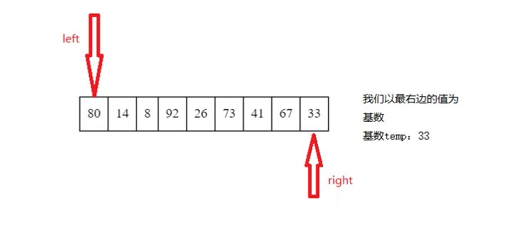
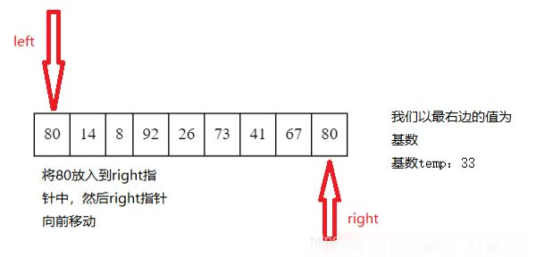
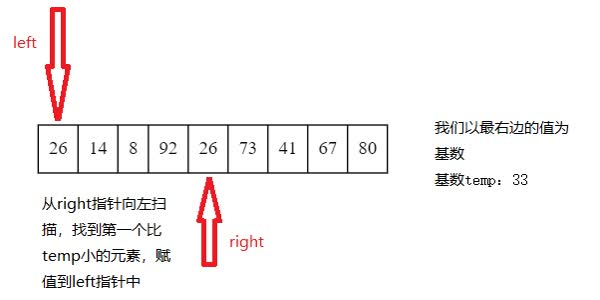

## 常见的排序算法

### 快速排序

[leetcode 912](https://leetcode-cn.com/problems/sort-an-array/)

**思想**：给要排序的数组设置一个基准数据，假如说是把最右边的数据设为基准数据，然后根据这个数据从左向右进行比较，



- 1.从左向右找，比较left指针的元素是否大于temp这个基准数据,如果大于，则将该值赋值到`right`指针中,然后将`right--`



- 2.然后从`right`指针开始遍历找到第一个比`temp`小的元素，赋值到`right`中，然后`left++`



- 3.然后再从`left`指针开始向右遍历第一个比temp大的，再赋值到`right`元素，反复这种操作，直到`left`和`right`指针重合,将`temp`值放入其中。

- 4.其中少了一步92赋值的步骤，思路大致如此

这样我们就可以利用temp分成左右两组，左边的值一定小于 或等于`temp`，右边的值一定大于或等于`temp`

然后再将左右两组数据按照`1，2，3`的步骤执行，直到左右数组长度小于`2`的时候，也就是一开始`left`和`right`指针就相同的情况，结束循环。


```cpp
class Solution {
public:
    vector<int> sortArray(vector<int>& nums) {
        int left = 0,right = nums.size() - 1;
        quickSort(nums,left,right);
        return nums;
    }
    void quickSort(vector<int>& nums,int left,int right) {
        if(left < right) { //相等就不用动了
            //排序基准元素,返回排序号的位置
            int index = partition(nums,left,right);
            //排序左边
            quickSort(nums,left,index - 1);
            quickSort(nums,index + 1,right);
        }
    }
    int partition(vector<int> &nums,int left,int right) {
        //选择基准
        int pivot = nums[left];
        while(left < right) {
            // 从右往左
            while(left< right && nums[right] >= pivot) {
                --right;
            }
            //填坑
            nums[left] = nums[right];
            //从右往左
            while(left < right && nums[left] <= pivot) {
                ++left;
            }
            //填坑
            nums[right] = nums[left];
        }
        //把基准放到合适的位置
        //这时候left = right
        nums[left] = pivot;
        return left;
    }
};
```

基准随机化的代码,注意只是修改一小部分

```cpp
class Solution {
public:
    vector<int> sortArray(vector<int>& nums) {
        int left = 0,right = nums.size() - 1;
        quickSort(nums,left,right);
        return nums;
    }
    void quickSort(vector<int>& nums,int left,int right) {
        if(left < right) { //相等就不用动了
            //排序基准元素,返回排序号的位置
            int index = partition(nums,left,right);
            //排序左边
            quickSort(nums,left,index - 1);
            quickSort(nums,index + 1,right);
        }
    }
    int partition(vector<int> &nums,int left,int right) {
        //选择基准
        // int pivot = nums[left];
        swap( nums[left], nums[rand() % (right - left + 1) + left] );
        // swap(nums[left],pivot);
        int pivot = nums[left];
        while(left < right) {
            // 从右往左
            while(left< right && nums[right] >= pivot) {
                --right;
            }
            //填坑
            nums[left] = nums[right];
            //从右往左
            while(left < right && nums[left] <= pivot) {
                ++left;
            }
            //填坑
            nums[right] = nums[left];
        }
        //把基准放到合适的位置
        //这时候left = right
        nums[left] = pivot;
        return left;
    }
};
```

### 归并排序

思想：归并排序采用的是分治法思想，

- 首相是将 `n` 个元素分治成 `n/2` 个元素的子序列
- 用合并排序算法对两个子序列进行排序
- 合并两个已经排序好的子序列
- 递归以上的三个步骤，直到全部排好序

动图演示：


```cpp
void mergeSort(vector<int> &nums,vector<int> &copy,int left,int right) 
    {
        if(left >= right) return ;  //如果left和right指向同一个元素了就不用排序了

        //取出mid位置
        int mid = left + (right - left) / 2;
        //定义前后两段的开始和结束为止
        int low1 = left,high1 = mid;
        int low2 = mid + 1,high2 = right;
        //copy数组的索引
        int index = left;

        //归并排序左边
        mergeSort(nums,copy,low1,high1);
        //归并排序右边
        mergeSort(nums,copy,low2,high2);

        //合并排序两部分
        while(low1 <= high1 && low2 <= high2) {
            copy[index++] = nums[low1] < nums[low2] ? nums[low1++]:nums[low2++];
        }
        //如果剩下左边，就直接把左边加在后面
        while(low1 <= high1) {
            copy[index++] = nums[low1++];
        }
        //如果剩下右边，就直接把右边加在后面
        while(low2 <= high2) {
            copy[index++] = nums[low2++];
        }
        //将copy拷贝回nums
        // nums.assign(copy.begin(), copy.end());
    }

void mergeTest() {
    vector<int> nums = { -5,-10,6,5,12,96,1,2,3 };
    vector<int> copy(nums);
    mergeSort(nums, copy, 0, nums.size() - 1);
    //将copy拷贝回nums
    nums.assign(copy.begin(), copy.end());
    for_each(nums.begin(), nums.end(), [](const auto& a) {cout << a << " "; });
    cout << endl;
}
```

### 插入排序

```cpp
void insertion_sort(vector<int> &nums, int n) {
    for (int i = 0; i < n; ++i) {
        for (int j = i; j > 0 && nums[j] < nums[j-1]; --j) {
           swap(nums[j], nums[j-1]);
		} 
	}
}
```

### 冒泡排序

```cpp
void bubble_sort(vector<int> &nums, int n) {
    bool swapped;
    for (int i = 1; i < n; ++i) {
		swapped = false;
		for (int j = 1; j < n - i + 1; ++j) {
			if (nums[j] < nums[j-1]) {
				swap(nums[j], nums[j-1]);
				swapped = true;
			} 
		}
		if (!swapped) {
			break;
		} 
	}
}
```

### 选择排序

```cpp
void selection_sort(vector<int> &nums, int n) {
    int mid;
    for (int i = 0; i < n - 1; ++i) {
    	mid = i;
		for (int j = i + 1; j < n; ++j) {
			if (nums[j] < nums[mid]) {
				mid = j; 
			}
		}
    	swap(nums[mid], nums[i]);
    }
}
```

### 测试mian

```cpp
int main() 
{
	vector<int> nums = {1,3,5,7,2,6,4,8,9,2,8,7,6,0,3,5,9,4,1,0};

	//调用自己实现的排序函数
	quick_sort(nums,0,nums.size() - 1);
    //归并排序忽略
	insertion_sort(nums, nums.size());
	bubble_sort(nums, nums.size());
    selection_sort(nums, nums.size());
	for(int i=0;i<nums.size();++i)
	{
		cout << nums[i] << ' ';
	}
	cout << endl;
    return  0;

}
```

> https://blog.csdn.net/Three3333333/article/details/115030669


