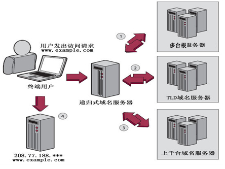
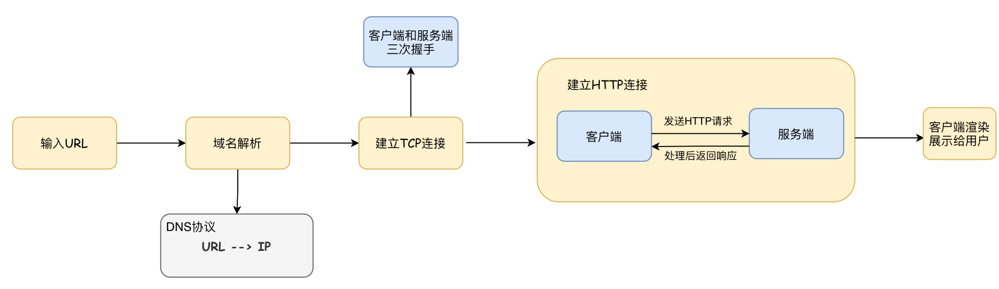
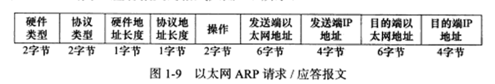

## OSI与TCP/IP各层结构与功能

- OSI的分层(7层)：物理层、数据链路层、网络层、传输层、会话层、表示层、应用层
- TCP/IP(4层)：网络接口层、网际层、运输层、应用层
- 五层协议(5层)：物理层、数据链路层、网络层、运输层、应用层

每一层的作用：
- 物理层：底层数据传输，如网线；网卡标准。 （比特`Bit`）

- 数据链路层：定义数据的基本格式，如何传输，如何标识；如网卡`MAC`地址。（帧Frame）

- 网络层：定义`IP`编址，定义路由功能；如不同设备的数据转发。（包PackeT）

- 传输层：端到端传输数据的基本功能；如 TCP、UDP。（段 Segments）

- 会话层：控制应用程序之间会话能力；如不同软件数据分发给不同软件。

- 表示层：数据格式标识，基本压缩加密功能。

- 应用层：各种应用软件，包括 Web 应用。

## 一次完整的HTTP请求过程包括哪些内容？

- 建立起客户机和服务器连接。
- 建立连接后，客户机发送一个请求给服务器。
- 服务器收到请求给予响应信息。
- 客户端浏览器将返回的内容解析并呈现，断开连接。


## DNS 是什么

DNS（Domain Name System）是域名解析系统，就是在因特网上作为域名和IP地址相互映射的分布式数据库系统，能够使用户更方便的去访问互联网，而不用去记住一连串的`IP`地址。

通过主机名最终得到这个主机名对应的IP地址，这个过程就做**域名解析**

通俗的说就是我们更习惯去记住一个网站的名字而不是这个网站的IP地址，比如`www.baidu.com`,而不是记住它的`ip`地址，比如：`167.23.10.2`。

## DNS 的工作原理

将主机域名转换为`ip`地址，属于**应用层协议**，使用`UDP`传输。


`DNS`解析有两种方式：**递归查询**和**迭代查询**

一、主机 向 本地域名服务器的查询一般都是采用**递归查询**。<br>
二、本地域名服务器 向 根域名服务器的查询的**迭代查询**。


### `DNS`解析过程

如下图所示，详细阐述`DNS`解析流程。



- 客户机提出域名解析请求，并将该请求发送给本地的域名服务器。

- 当本地的域名服务器收到请求后，就先查询本地的缓存，如果有该纪录项，则本地的域名服务器就直接把查询的结果返回。
  
- 如果没有，就到互联网中根服务器去查找，获取`.com`的顶级域名服务器

- 然后在`.com`的顶级域名服务器中进行查找，比如说获取`google.com`的授权域名服务器

- 在`google.com`的授权域名服务器中查找主机`www.google.com`的`IP`地址，最后将`IP`地址返回给计算机。

- 计算机获得`www.google.com`的`IP`地址后，用户就可以访问这个网站了。

## 为什么域名解析用`UDP`协议？

因为`UDP`快啊！`UDP`的`DNS`协议只要一个请求、一个应答就好了。

而使用基于`TCP`的`DNS`协议要三次握手、发送数据以及应答、四次挥手，但是`UDP`协议传输内容不能超过`512`节。

不过客户端向`DNS`服务器查询域名，一般返回的内容都不超过`512`字节，所以用`UDP`传输即可。

一般`DNS`区域传送用的是`TCP`协议

## 为什么 DNS 区域传送用TCP协议

> 区域传送是指将一个区域文件复制到多个`DNS`服务器的过程<br>
> `DNS`主从复制，就是将主`DNS`服务器的解析库复制传送至从`DNS`服务器，进而从服务器就可以进行正向、反向解析了.

因为`TCP`协议可靠性好啊！

以为你要从主`DNS`上复制内容，肯定要保证可靠性啊，`UDP`是不保证传输的可靠性的。

还有，`TCP`协议的传输内容比较大，`UDP`要求传输的内容不能超过`512`字节，如果同步的数据超过`512`那肯定不行呀。

所以用`TCP`协议比较好。

## `HTTP`长连接和短连接的区别

在`HTTP/1.0`中默认使用短连接。也就是说，客户端和服务器每进行一次`HTTP`操作，就建立一次连接，任务结束就中断连接。

而从`HTTP/1.1`起，默认使用长连接，用以保持连接特性。

## 什么是TCP粘包/拆包？发生的原因？

一个完整的业务可能会被`TCP`拆分成多个包进行发送，也有可能把多个小的包封装成一个大的数据包发送，这个就是`TCP`的拆包和粘包问题。

### 粘包和拆包原因

（1）要发送的数据小于`TCP`发送缓冲区的大小，`TCP`将多次写入缓冲区的数据一次发送出去，将会发生粘包；

（2）接收数据端的应用层没有及时读取接收缓冲区中的数据，将发生粘包；

（3）要发送的数据大于`TCP`发送缓冲区剩余空间大小，将会发生拆包；

（4）待发送数据大于`MSS`（最大报文长度），`TCP`在传输前将进行拆包。即`TCP报文长度-TCP头部长度>MSS`。


### 粘包和拆包解决策略

由于底层的`TCP`无法理解上层的业务数据，所以在底层是无法保证数据包不被拆分和重组的，这个问题只能通过上层的应用协议栈设计来解决

- 消息定长。发送端将每个数据包封装为固定长度（不够的可以通过补`0`填充），这样接收端每次接收缓冲区中读取固定长度的数据就自然而然的把每个数据包拆分开来。
- 设置消息边界。服务端从网络流中按消息边界分离出消息内容。在包尾增加回车换行符进行分割，例如`FTP`协议。
- 将消息分为消息头和消息体，消息头中包含表示消息总长度（或者消息体长度）的字段。
- 使用其它复杂的协议，如`RTMP`协议等。

> 可以参考：https://blog.csdn.net/ailunlee/article/details/95944377

## 为什么服务器要设置缓存?如何实现的？

**原因**

- 缓解服务器压力；
- 降低客户端获取资源的延迟：缓存通常位于内存中，读取缓存的速度更快。并且缓存服务器在地理位置上也有可能比源服务器来得近，例如浏览器缓存。

**实现方法**

- 让代理服务器进行缓存；
- 让客户端浏览器进行缓存。

## HTTP请求方法你知道多少？

客户端发送的   **请求报文** 第一行为请求行，包含了方法字段。

根据 HTTP 标准，HTTP 请求可以使用多种请求方法。

`HTTP1.0` 定义了三种请求方法： `GET`, `POST` 和 `HEAD`方法。

`HTTP1.1` 新增了六种请求方法：`OPTIONS`、`PUT`、`PATCH`、`DELETE`、`TRACE` 和 `CONNECT` 方法。

| 序  号 | 方法    | 描述                                                         |
| :----- | :------ | :----------------------------------------------------------- |
| 1      | GET     | 请求指定的页面信息，并返回实体主体。                         |
| 2      | HEAD    | 类似于 GET 请求，只不过返回的响应中没有具体的内容，用于获取报头 |
| 3      | POST    | 向指定资源提交数据进行处理请求（例如提交表单或者上传文件）。数据被包含在请求体中。POST 请求可能会导致新的资源的建立和/或已有资源的修改。 |
| 4      | PUT     | 从客户端向服务器传送的数据取代指定的文档的内容。             |
| 5      | DELETE  | 请求服务器删除指定的页面。                                   |
| 6      | CONNECT | HTTP/1.1 协议中预留给能够将连接改为管道方式的代理服务器。    |
| 7      | OPTIONS | 允许客户端查看服务器的性能。                                 |
| 8      | TRACE   | 回显服务器收到的请求，主要用于测试或诊断。                   |
| 9      | PATCH   | 是对 PUT 方法的补充，用来对已知资源进行局部更新 。           |

## GET 和 POST 的区别

1. `get`是获取数据，`post`是修改数据

2. `get`把请求的数据放在`url`上， 以`?`分割`URL`和传输数据，参数之间以`&`相连，所以`get`不太安全。而`post`把数据放在`HTTP`的包体内（`requrest body`）

3. `get`提交的数据最大是`2k`（ 限制实际上取决于浏览器）， `post`理论上没有限制。

4. `GET`产生一个`TCP`数据包，浏览器会把`http header`和`data`一并发送出去，服务器响应`200`(返回数据); `POST`产生两个`TCP`数据包，浏览器先发送`header`，服务器响应`100 continue`，浏览器再发送`data`，服务器响应`200 ok`(返回数据)。

5. `GET`请求会被浏览器主动缓存，而`POST`不会，除非手动设置。

6. 本质区别：`GET`是幂等的，而`POST`不是幂等的

   > 这里的幂等性：幂等性是指一次和多次请求某一个资源应该具有同样的副作用。简单来说意味着对同一`URL`的多个请求应该返回同样的结果。

正因为它们有这样的区别，所以不应该且**不能用get请求做数据的增删改这些有副作用的操作**。因为`get`请求是幂等的，**在网络不好的隧道中会尝试重试**。如果用`get`请求增数据，会有**重复操作**的风险，而这种重复操作可能会导致副作用（浏览器和操作系统并不知道你会用`get`请求去做增操作）。


-------
## TCP与UDP的区别

- 1.TCP面向连接，UDP无连接。
- 2.TCP面向字节流（文件传输），UDP是面向报文的，UDP没有拥塞控制，因此网络出现拥塞不会使源主机的发送速率降低（对IP电话，实时视频会议等）。
- 3.TCP首部开销20字节，UDP的首部开销小，只有8个字节。
- 4.TCP的逻辑通信信道是全双工的可靠信道，提供可靠的服务。也就是说，通过TCP连接传送的数据，无差错，不丢失，不重复，且有序到达; UDP是不可靠信道，UDP只是尽最大努力交付，并不保证可靠交付。
- 5.每一条TCP连接只能是点到点的；UDP支持一对一，一对多，多对一和多对多的交互通信。
- 6.TCP对系统资源的要求高于UDP，所以速度也比UDP慢。
- 7.TCP数据包是没有边界的，会出现粘包的问题，UDP包是独立的，不会出现粘包问题。
- 所以在应用方面，如果强调数据的完整性和正确性用TCP，当要求性能和速度的时候，使用UDP更加合适。

## 建立TCP服务器的各个系统调用

建立TCP服务器连接的过程中主要通过以下系统调用序列来获取某些函数，这些系统调用主要包括：`socket()`，`bind()`，`listen()`，`accept()`，`send()`和`recv()`。


- socket 函数

这个函数有三个参数，第一个是指定协议族，第二个是指定`socket`的类型，第三个是指定具体的协议。

- bind 函数

服务器监听的网络地址和端口号通常是固定不变的，客户端程序需要知道服务器的地址和端口号后就可以向服务器发起连接，因此服务器需要调用`bind`绑定一个固定的网络地址和端口号。

`bind()`的作用是将参数`sockfd`（`socket`描述符）和`addr`(本地`IP`和端口号)绑定在一起，使`sockfd`这个用于网络通讯的文件描述符监听`addr`所描述的地址和端口号。

- connect 函数

客户端需要调用`connect()`连接服务器，用来与服务器建立一个`TCP`连接，实际是发起`3`次握手过程，`connect`和`bind`的参数形式一致，区别在于`bind`的参数是自己的地址，而`connect`的参数是对方的地址。`connect()`成功返回`0`，出错返回`-1`。

- listen 函数

一般服务器程序可以同时服务多个客户端，当有客户端发起连接时，服务器调用的`accept()`返回并接受这个连接，如果有大量的客户端发起连接而服务器来不及处理，尚未`accept`的客户端就处于连接等待状态，`listen()`声明`sockfd`处于监听状态，一般`Linux`系统最多允许有`128`个客户端处于连接待状态，如果接收到更多的连接请求就忽略。`listen()`成功返回`0`，失败返回`-1`。

- accept 函数

三次握手完成后，服务器调用`accept()`接受连接，如果服务器调用`accept()`时还没有客户端的连接请求，就阻塞等待直到有客户端连接上来。


- send 函数

> send(), write(), sendto()   数据发送 

主要是进行TCP类型的数据发送。

- recv 函数

> recv(), read(), recvfrom()  数据接收

主要用于TCP类型的数据接收。

- `close()`, `shutdown()` 关闭套接字

详见：[建立TCP 服务器的系统调用](计算机网络/unix网络编程学习笔记?id=_12-socket模型创建)

### `close`是一次就能直接关闭的吗，半关闭状态是怎么产生的？

使用`close()`时，只有当套接字的引用计数为`0`的时候才会终止连接，而用`shutdown()`就可以直接关闭连接。

同时在`TCP`协议中，发送关闭请求时，需要对方回复确认请求，否则不能确认，就会造成一个半关闭的状态，这个时候可以接收，不能发送。我们可以调用`shutdown()`来进行直接关闭 `shutdown`的第二个参数为`SHUT_WR`时，为半关闭。`shutdow`函数可以立即关闭进程，不用考虑套接字的引用计数。

半关闭的定义：
`TCP`提供了连接的一端在结束它的发送后，还能接收来自另一端发来的数据的能力，这就是`TCP`的半关闭。

## UDP首部格式


 用户数据报`UDP`有两个字段：数据字段和首部字段。首部字段很简单，只有`8`个字节，由四个字段组成，每个字段的长度都是两个字节。`12`字节的伪首部是为了计算检验和临时添加的。

- （1）源端口：源端口号。在需要对方回信时选用。不需要时可用全0。

- （2）目的端口：目的端口号。在终点交付报文时使用。

- （3）长度：UDP用户数据报的长度，其最小值是8（仅有首部）。

- （4）检验和：检测UDP用户数据报在传输中是否有错。有错就丢弃。

## TCP首部格式

  `TCP`虽然是面向字节流的，但`TCP`传送的数据单元却是报文段。一个`TCP`报文段分为首部和数据两部分，而`TCP`的全部功能体现在它首部中的各字段的作用。

  TCP的头部大致包括：源端口，目的端口，序号，确认号，偏移位，标志位（6个，ACK,SYN等），校验和等等


（1）序号：seq序号，占32位，用来标识从TCP源端向目的端发送的字节流，发起方发送数据时对此进行标记。

（2）确认序号：ack序号，占32位，只有ACK标志位为1时，确认序号字段才有效，ack=seq+1。

（3）标志位：共6个，即URG、ACK、PSH、RST、SYN、FIN等，具体含义如下：

    ACK：确认序号有效。

    FIN：释放一个连接。

    PSH：接收方应该尽快将这个报文交给应用层。
    RST：重置连接。

    SYN：发起一个新连接。

    URG：紧急指针（urgent pointer）有效

> 需要注意的是：    
> 不要将确认序号ack与标志位中的ACK搞混了。    
> 确认方ack=发起方seq+1，两端配对。   

> 详细参考：https://blog.csdn.net/zhangliangzi/article/details/52554439

### TCP怎么保证可靠传输的

**（校序重流拥）**

* 校验和      
  发送的数据包的二进制相加然后取反，目的是**检测数据在传输过程中的任何变化**。如果收到段的检验和有差错，`TCP`将丢弃这个报文段和不确认收到此报文段。 

* 确认应答+序列号       
  `TCP`对发送的**每一个包进行编号**，接收方**对数据包进行排序**，把有序数据传送给应用层。 

* 超时重传      
  当`TCP`发出一个报文段后，它启动一个定时器，等待目的端确认收到这个报文段。如果不能及时收到一个确认，将重发这个报文段。 

* 流量控制      
  `TCP`连接的每一方都有固定大小的缓冲空间，TCP的接收端只允许发送端发送接收端缓冲区能接纳的数据。当接收方来不及处理发送方的数据，能提示发送方降低发送的速率，防止数据包丢失。`TCP`使用的流量控制协议是可变大小的滑动窗口协议。


* 拥塞控制
  如果把窗口定的很大，发送端连续发送大量的数据，可能会造成网络的拥堵（大家都在用网，你在这狂发，吞吐量就那么大，当然会堵），甚至造成网络的瘫痪。所以`TCP`在为了防止这种情况而进行了拥塞控制。

  进行拥塞控制后可以达到：在`TCP`通信时，网络吞吐量呈现逐渐的上升，并且随着拥堵来降低吞吐量，再进入慢慢上升的过程，网络不会轻易的发生瘫痪。

> 拥塞控制有四种算法，**慢启动、拥塞避免，快速重传和快速恢复**

### 说一下`TCP`怎么进行拥塞控制的？

如果网络出现拥塞，分组将会丢失，此时发送方会继续重传，从而导致网络拥塞程度更高。因此当出现拥塞时，应当控制发送方的速率。这一点和流量控制很像，但是出发点不同。流量控制是为了让接收方能来得及接收，而拥塞控制是为了降低整个网络的拥塞程度。


`TCP` 主要通过四个算法来进行拥塞控制：**慢开始、拥塞避免、快速重传、快速恢复**。

- **慢启动**。慢启动算法的思路是当主机开始发送数据时，先以比较小的拥塞窗口进行发送，然后每次翻倍，也就是说，由小到大逐渐增加拥塞窗口的大小，而这个大小是指数增长的，即`1、2、4、8、16`
  * 为了防止拥塞窗口`cwnd`增长过大引起网络拥塞，还要另外设置一个慢启动阈值`ssthresh`状态变量，当拥塞窗口的大小超过慢启动阈值的时候（ `cwnd > ssthresh` 时），停止使用慢启动算法而改用拥塞避免算法。

- **拥塞避免**：设置慢启动阈值，一般开始都设为`65536`。拥塞避免是指当拥塞窗口大小达到这个阈值的时候，拥塞窗口的值不再指数上升，而是采用加法增加（也就是每经过一个往返时间`RTT`就把发送方的拥塞窗口大小`+1`），以此来避免拥塞。

- **快速重传**：当发送端连续收到三个重复的`ack`时，表示该数据段已经丢失，需要重发。这个时候慢启动阈值`ssth`变为原来一半，拥塞窗口`cwnd`变为`ssth+3`，然后使用`+1+1`的发（也就是每一轮`RTT+1`）

- **快速恢复**。当超过设定的时间没有收到某个报文段的`ack`时，表示网络拥塞，慢启动阈值`ssth`变为原来一半，拥塞窗口`cwnd=1`，进入慢启动阶段。

### 拥塞控制和流量控制的区别

拥塞控制是防止过多的数据注入到网络中，导致网络发生拥塞；而流量控制是防止发送方一下子发送过多的数据到接收方，导致接收方缓存放不下。两种算法都是对发送方的行为进行控制的。

### 流量控制的介绍，采用滑动窗口会有什么问题（死锁可能，糊涂窗口综合征）？

所谓流量控制就是让发送方发送速率不要过快，让接收方来得及接收。利用`TCP`报文段中的窗口大小字段来控制发送方的发送窗口不大于接收方发回的窗口大小就可以实施流量控制。

考虑一种特殊的情况，就是接收方若没有缓存足够使用，就会发送零窗口大小的报文，此时将发送方将的发送窗口设置为`0`，停止发送数据。之后接收方有足够的缓存，发送了非零窗口大小的报文，但是这个报文在中途丢失的，那么发送方的发送窗口就一直为零**导致死锁**。

解决这个问题，`TCP`为每一个连接设置一个持续计时器（`persistence timer`）。只要`TCP`的一方收到对方的零窗口通知，就启动这个计时器，周期性的发送一个零窗口探测报文段。对方就在确认这个报文的时候给出现在的窗口大小（注意：`TCP`规定，即使设置为零窗口，也必须接收以下几种报文段：零窗口探测报文段、确认报文段和携带紧急数据的报文段）。

### TCP 滑动窗口协议

`TCP`的滑动窗口用来控制接收方和发送方的发送速率，避免拥塞的发生。滑动窗口其实就是接收端的缓冲区大小，用来告诉发送方对它发送的数据有多大的缓冲空间。在接收方的滑动窗口已知的情况下，当接收方确认了连续的数据序列之后，发送方的滑动窗口向后滑动，发送下一个数据序列。

接收方会在每个`ACK`数据包中附带自己当前的接受窗口（滑动窗口）的大小，方便发送方进行控制。

详细可以参考[TCP滑动窗口](/计算机网络/TCP滑动窗口.md)

## 在浏览器中输入URL后执行的全部过程

1. 首先是域名解析，客户端使用`DNS`协议将`URL`解析为对应的`IP`地址；

2. 然后建立`TCP`连接，客户端与服务器通过三次握手建立`TCP`连接；
   
3. 接着是`http`连接，客户端向服务器发送`http`连接请求； （`http`连接无需额外连接，直接通过已经建立的`TCP`连接发送）
   
4. 服务器对客户端发来的`http`请求进行处理，并返回响应；
   
5. 客户端接收到`http`响应，将结果渲染展示给用户。



## TCP 通信过程

TCP是一种面向连接的、可靠的、基于字节流的传输层通信协议，在发送数据前，通信双方必须在彼此间建立一条连接。所谓的“连接”，其实是客户端和服务端保存的一份关于对方的信息，如`ip`地址、端口号等。  

`TCP`可以看成是一种字节流，它会处理`IP`层或以下的层的丢包、重复以及错误问题。在连接的建立过程中，双方需要交换一些连接的参数。这些参数可以放在`TCP`头部。  


一个`TCP`连接由一个`4`元组构成，分别是**两个IP地址**和**两个端口号**。一个`TCP`连接通常分为三个阶段：**连接、数据传输、退出（关闭）**。通过三次握手建立一个链接，通过四次挥手来关闭一个连接。

**当一个连接被建立或被终止时，交换的报文段只包含TCP头部，而没有数据。**

### TCP 三次握手

> 三次握手的本质是确认通信双方收发数据的能力

首先，我让信使运输一份信件给对方，对方收到了，那么他就知道了我的发件能力和他的收件能力是可以的。

于是他给我回信，我若收到了，我便知我的**发件**能力和他的**收件**能力是可以的，并且他的**发件**能力和我的**收件**能力是可以。

然而此时他还不知道他的发件能力和我的收件能力到底可不可以，于是我最后回馈一次，他若收到了，他便清楚了他的**发件**能力和我的**收件**能力是可以的。

TCP通信过程包括三个步骤：建立T`CP`连接通道，传输数据，断开TCP连接通道。如图1所示，给出了TCP通信过程的示意图。


[图片来源](https://www.cnblogs.com/bj-mr-li/p/11106390.html)

- 第一次握手：
  
客户端要向服务端发起连接请求，首先客户端随机生成一个起始序列号`ISN`(比如是`100`)，那客户端向服务端发送的报文段包含`SYN`标志位(也就是`SYN=1`)，序列号`seq=100`。
  
这时候`client`处于同步状态`SYN-SENT`。也就是可以建立连接。服务端处于监听状态`LISTEN`。

- 第二次握手

服务端收到客户端发过来的报文后，发现`SYN=1`，知道这是一个连接请求，于是将客户端的起始序列号`100`存起来，并且随机生成一个服务端的起始序列号(比如是`300`)。然后给客户端回复一段报文，回复报文包含`SYN`和`ACK`标志(也就是`SYN=1`,`ACK=1`)、序列号`seq=300`、确认号`ack=101`(*客户端发过来的序列号+1*)。

  这个时候服务端处于`SYN_RECV`接收状态。

- 第三次握手

客户端收到服务端的回复后发现`ACK=1`并且`ack=101`,于是知道服务端已经收到了序列号为`100`的那段报文；同时发现`SYN=1`，知道了服务端同意了这次连接，于是就将服务端的序列号`300`给存下来。然后客户端再回复一段报文给服务端，报文包含`ACK`标志位(`ACK=1`)、`ack=301`(*服务端序列号+1*)、`seq=101`(第一次握手时发送报文是占据一个序列号的，所以这次`seq`就从`101`开始，需要注意的是不携带数据的`ACK`报文是不占据序列号的，所以后面第一次正式发送数据时`seq`还是`101`)。当服务端收到报文后发现`ACK=1`并且`ack=301`，就知道客户端收到序列号为`300`的报文了，就这样客户端和服务端通过`TCP`建立了连接。


> 握手过程中传送的包里不包含数据，三次握手完毕后，客户端与服务器才正式开始传送数据。理想状态下，`TCP`连接一旦建立，在通信双方中的任何一方主动关闭连接之前，`TCP` 连接都将被一直保持下去。

### 为什么使用三次握手，两次握手可不可以？

三次握手是为了防止客户端的请求报文在网络滞留，客户端超时重传了请求报文，服务端建立连接，传输数据，释放连接之后，服务器又收到了客户端滞留的请求报文，建立连接一直等待客户端发送数据。

服务器对客户端的请求进行回应(第二次握手)后，就会理所当然的认为连接已建立，而如果客户端并没有收到服务器的回应呢？此时，客户端仍认为连接未建立，服务器会对已建立的连接保存必要的资源，如果大量的这种情况，服务器会崩溃。

## 四次挥手过程

> 四次挥手的目的是关闭一个连接


`TCP`断开连接通常是由一方主动，一方被动的，这里我们假设`client`主动，`server`被动

比如客户端初始化的序列号`ISA=100`，服务端初始化的序列号`ISA=300`。`TCP`连接成功后客户端总共发送了`1000`个字节的数据，服务端在客户端发`FIN`报文前总共回复了`2000`个字节的数据。

- 第一次挥手：当客户端的数据都传输完成后，客户端向服务端发出连接释放报文(当然数据没发完时也可以发送连接释放报文并停止发送数据)，释放连接报文包含`FIN`标志位(`FIN=1`)、序列号`seq=1101`(`100+1+1000`，其中的`1`是建立连接时占据的一个序列号)。需要注意的是客户端发出`FIN`报文段后只是不能发数据了，但是还可以正常收数据；另外`FIN`报文段即使不携带数据也要占据一个序列号。
  
- 第二次挥手：服务端收到客户端发的`FIN`报文后给客户端回复确认报文，确认报文包含`ACK`标志位(`ACK=1`)、确认号`ack=1102`(客户端`FIN`报文序列号`1101+1`)、序列号`seq=2300(300+2000)`。此时服务端处于**关闭等待状态**，而不是立马给客户端发`FIN`报文，这个状态还要持续一段时间，因为服务端可能还有数据没发完。

- 第三次挥手：服务端将最后数据(比如`50`个字节)发送完毕后就向客户端发出连接释放报文，报文包含`FIN`和`ACK`标志位(`FIN=1,ACK=1`)、确认号和第二次挥手一样`ack=1102`、序列号`seq=2350(2300+50)`。

- 第四次挥手：客户端收到服务端发的`FIN`报文后，向服务端发出确认报文，确认报文包含`ACK`标志位(`ACK=1`)、确认号`ack=2351`、序列号`seq=1102`。注意客户端发出确认报文后不是立马释放`TCP`连接，而是要经过`2MSL`(最长报文段寿命的`2`倍时长)后才释放`TCP`连接。而服务端一旦收到客户端发出的。


### TIME_WAIT(等待重传)的意义（为什么要等于`2MSL`）

`TIME_WAIT`是指四次挥手中客户端接收了服务端的`FIN`报文并发送`ACK`报文给服务器后，仍然需要等待`2MSL`时间的过程。虽然按道理，四个报文都发送完毕，我们可以直接进入`CLOSED`状态了，但是我们必须假象网络是不可靠的，有可以最后一个`ACK`丢失。如果客户端发送的`ACK`发生丢失，服务器会再次发送`FIN`报文给客户端，所以`TIME_WAIT`状态就是用来重发可能丢失的`ACK`报文。

### 为什么连接的时候是三次握手，关闭的时候却是四次握手？

因为当`Server`端收到`Client`端的`SYN`连接请求报文后，可以直接发送`SYN+ACK`报文。其中`ACK`报文是用来应答的，`SYN`报文是用来同步的。但是关闭连接时，当`Server`端收到`FIN`报文时，很可能并不会立即关闭`SOCKET`，所以只能先回复一个`ACK`报文，告诉`Client`端，"你发的`FIN`报文我收到了"。只有等到我`Server`端所有的报文都发送完了，我才能发送`FIN`报文，因此不能一起发送。故需要四步握手。

### 如果已经建立了连接，但是客户端突然出现故障了怎么办？

`TCP`还设有一个保活计时器，显然，客户端如果出现故障，服务器不能一直等下去，白白浪费资源。服务器每收到一次客户端的请求后都会重新复位这个计时器，时间通常是设置为`2`小时，若两小时还没有收到客户端的任何数据，服务器就会发送一个探测报文段，以后每隔75秒钟发送一次。若一连发送`10`个探测报文仍然没反应，服务器就认为客户端出了故障，接着就关闭连接。

#### 服务器出现大量`close_wait`的连接的原因以及解决方法

`close_wait`状态是在`TCP`四次挥手的时候收到`FIN`但是没有发送自己的`FIN`时出现的，服务器出现大量`close_wait`状态的原因有两种：

* 服务器内部业务处理占用了过多时间，都没能处理完业务；或者还有数据需要发送；或者服务器的业务逻辑有问题，没有执行`close()`方法
* 服务器的父进程派生出子进程，子进程继承了`socket`，收到`FIN`的时候子进程处理但父进程没有处理该信号，导致`socket`的引用不为`0`无法回收

处理方法：

* 停止应用程序
* 修改程序里的bug


-------

## ARP请求报文组成



- 硬件类型：定义物理地址的类型，它的值为`1`表示`MAC`地址
- 协议类型字段表示要映射的映射的协议地址类型，它的值 `0x800`, 表示IP地址。
- 硬件地址长度字段和协议地址长度字段，单位是字节。对`MAC`地址类说，其长度是`6`，`IPv4`地址来说，其长度为`4`.
- 操作字段支出`4`种操作字段，`ARP`请求（值为`1`）、`ARP` 应答（值为`2`）、`RARP` 请求（值为`3`）和 `RARP` 应答（值为`4`）
- 最后`4`个字段指定通信双方的以太网地址和`IP`地址,发送端填充除目的端口`IP`地址是自己，就把自己的以太网地址填进去，然后交换两个目的端地址和两个发送端地址，以构建`ARP`应答返回之。

### ARP协议工作原理

- 1.每个主机都会在自己的`ARP`缓冲区中建立一个`ARP`列表,用来表示 IP 地址和 `MAC` 地址之间的对应关系。
- 2.主机（网络接口）**新加入网络时**（也可能只是mac地址发生变化，接口重启等）， 会发送免费`ARP`报文把自己IP地址与Mac地址的映射关系广播给其他主机。
- 3.网络上的主机接收到免费`ARP`报文时，会更新自己的`ARP`缓冲区。将新的映射关系更新到自己的`ARP`表中
- 4.某个主机需要发送报文时，首先检查 `ARP` 列表中是否有对应 `IP` 地址的目的主机的 `MAC` 地址，如果有，则直接发送数据，如果没有，就向本网段的所有主机发送 `ARP` 数据包，该数据包包括的内容有：源主机 `IP` 地址，源主机 `MAC` 地址，目的主机的 `IP` 地址等。
- 5.当本网络的所有主机收到该 `ARP` 数据包时：
  - （A）首先检查数据包中的 `IP` 地址是否是自己的 `IP` 地址，如果不是，则忽略该数据包。
  - （B）如果是，则首先从数据包中取出源主机的 `IP` 和 `MAC` 地址写入到 `ARP` 列表中，如果已经存在，则覆盖。
  - （C） 然后将自己的 `MAC` 地址写入 `ARP` 响应包中，告诉源主机自己是它想要找的 `MAC` 地址。
- 6.源主机收到 `ARP` 响应包后。将目的主机的 `IP` 和 `MAC` 地址写入 `ARP` 列表，并利用此信息发送数据。如果源主机一直没有收到 `ARP` 响应数据包，表示 `ARP` 查询失败。

-----


---
## 说一下HTTP协议

`HTTP`协议工作在应用层，端口号是`80`。`HTTP`协议被用于网络中两台计算机间的通信，相比于`TCP/IP`这些底层协议，`HTTP`协议更像是高层标记型语言，浏览器根据从服务器得到的`HTTP`响应体中分别得到报文头，响应头和信息体（`HTML`正文等），之后将HTML文件解析并呈现在浏览器上。同样，我们在浏览器地址栏输入网址之后，浏览器相当于用户代理帮助我们组织好报文头，请求头和信息体（可选），之后通过网络发送到服务器，，服务器根据请求的内容准备数据。 *所以如果想要完全弄明白`HTTP`协议，你需要写一个浏览器 + 一个Web服务器，一侧来生成请求信息，一侧生成响应信息。*


### http协议与TCP的区别与联系

联系：Http协议是建立在TCP协议基础之上的，当浏览器需要从服务器获取网页数据的时候，会发出一次Http请求。Http会通过TCP建立起一个到服务器的连接通道，当本次请求需要的数据传输完毕后，Http会立即将TCP连接断开，这个过程是很短的。

区别：HTTP和TCP位于不同的网络分层。TCP是传输层的协议，定义的是数据传输和连接的规范，而HTTP是应用层的，定义的是数据的内容的规范。
建立一个TCP请求需要进行三次握手，而由于http是建立在tcp连接之上的，建立一个http请求通常包含请求和响应两个步骤。

### HTTP工作流程

一次完整的HTTP请求事务包含以下四个环节：

- 建立起客户机和服务器连接。
- 建立连接后，客户机发送一个请求给服务器。
- 服务器收到请求给予响应信息。
- 客户端浏览器将返回的内容解析并呈现，断开连接。
  
### HTTP常见状态码
```
200 ：请求成功，成功返回网页
301 ：资源（网页等）被永久转移到其它URL
302 ：资源（网页等）被临时转移到其它URL
304 ：请求未修改、命中缓存
401 ：未授权
403 ：服务器拒绝请求
404 ：请求的网页或资源不存在
500 ：内部服务器错误，无法完成请求
502 ：错误网关
503 ：请求未完成，服务器临时过载或宕机
504 ：网关超时
```

> HTTP 深入介绍清[查看我的另一篇文章](/计算机网络/理解HTTP协议.md)
    

### `http/1.0`和`http/1.1`的区别

`HTTP` 协议老的标准是 `HTTP/1.0` ，目前最通用的标准是 `HTTP/1.1` 。

`HTTP1.0 `只保持短暂的连接，浏览器的每次请求都需要与服务器建立一个 `TCP` 连接，但是最新的`http/1.0`加入了长连接，只需要在客户端给服务器发送的`http`报文头部加入`Connection:keep-alive
HTTP 1.1` 支持持久连接，默认进行持久连接，在一个 `TCP` 连接上可以传送多个 `HTTP` 请求和响应，减少了建立和关闭连接的消耗和延迟。

## `https`的请求的过程，怎么确保安全性

**SSL是传输层的协议**

`https`包括非对称加密和对称加密两个阶段，在客户端与服务器建立连接的时候使用非对称加密，连接建立以后使用的是**对称加密**。


- 1) 客户端向服务器发起HTTPS请求，连接到服务器的443端口；
- 2) 服务器端有一个密钥对，即公钥（即数字证书）和私钥，是用来进行非对称加密使用的，服务器端保存着私钥，不能将其泄露，公钥可以发送给任何人；
- 3) 服务器将自己的公钥发送给客户端；
- 4) 客户端收到服务器端的公钥之后，检查其合法性，如果发现发现公钥有问题，那么HTTPS传输就无法继续，如果公钥合格，则客户端会生成一个客户端密钥，然后用服务器的公钥对客户端密钥进行非对称加密成密文，至此，HTTPS中的第一次HTTP请求结束；
- 5) 客户端发起HTTPS中的第二个HTTP请求，将加密之后的客户端密钥发送给服务器；
- 6) 服务器接收到客户端发来的密文之后，会用自己的私钥对其进行非对称解密，解密之后的明文就是客户端密钥，然后用客户端密钥对数据进行对称加密，这样数据就变成了密文；
- 7) 然后服务器将加密后的密文发送给客户端；
- 8) 客户端收到服务器发送来的密文，用客户端密钥对其进行对称解密，得到服务器发送的数据。这样HTTPS中的第二个HTTP请求结束，整个HTTPS传输完成。

服务器第一次传给客户端的公钥其实是CA对网站信息进行加密的数字证书

客户端的对称加密密钥其实是三个随机数的哈希（1. 客户端第一次给服务端发送请求时附带的随机数 2. 服务器返回时的随机数 3. 客户端收到返回时的随机数）

### `HTTP` 和 `HTTPS`的区别

`HTTP`协议时超文本传输协议。

`HTTPS`是安全的超文本传输协议，是安全版的HTTP协议，使用安全套接字层(SSL)进行信息交换。

`HTTPS`协议主要针对解决HTTP协议以下不足：
- 1.通信使用明文（不加密），内容可能会被窃听
- 2.不验证通信方身份，应此可能遭遇伪装
- 3.无法证明报文的完整性（即准确性），所以可能已遭篡改      

> HTTP+加密+认证+完整性保护=HTTPS

`HTTP`端口 `80`,`HTTPS`端口`443`

`HTTPS`采用对称加密、`SSL`位于应用层于传输层`TCP`之间，原本数据由应用层直接交由传输层处理，现在会经过`SSL`加密再进行传输。

`HTTPS`也不是绝对安全的，针对`SSL`的中间人攻击方式主要有两类，分别是`SSL`劫持攻击和`SSL`剥离攻击。

`SSL`劫持攻击就是 `SSL`证书欺骗攻击，将自己接入到客户端和目标网站之间； 在传输过程中伪造服务器的证书，将服务器的公钥替换成自己的公钥。

## 请你来说一下数字证书是什么，里面都包含那些内容

1**）概念**：

数字证书是数字证书在一个身份和该身份的持有者所拥有的公/私钥对之间建立了一种联系，由认证中心（CA）或者认证中心的下级认证中心颁发的。根证书是认证中心与用户建立信任关系的基础。在用户使用数字证书之前必须首先下载和安装。

比如，网站`A`将自己的信息和数字证书发给客户端，客户端用`CA`的公钥对数字证书进行解密，得到签名`S`，与手动将网站的信息进行消息摘要得到的结果`S*`进行对比，如果签名一致就证明网站A可以信任。


**2）数字证书颁发过程：**

数字证书颁发过程如下：用户产生了自己的密钥对，并将公共密钥及部分个人身份信息传送给一家认证中心。认证中心在核实身份后，将执行一些必要的步骤，以确信请求确实由用户发送而来，然后，认证中心将发给用户一个数字证书，该证书内附了用户和他的密钥等信息，同时还附有对认证中心公共密钥加以确认的数字证书。当用户想证明其公开密钥的合法性时，就可以提供这一数字证书。

**3）内容：**

数字证书的格式普遍采用的是`X.509V3`国际标准，一个标准的`X.509`数字证书包含以下一些内容：

- 1、证书的版本信息；
- 2、证书的序列号，每个证书都有一个唯一的证书序列号；
- 3、证书所使用的签名算法；
- 4、证书的发行机构名称，命名规则一般采用X.500格式；
- 5、证书的有效期，通用的证书一般采用UTC时间格式；
- 6、证书所有人的名称，命名规则一般采用X.500格式；
- 7、证书所有人的公开密钥；
- 8、证书发行者对证书的签名。


## 请你说一下阻塞，非阻塞，同步，异步

- 阻塞和非阻塞：调用者在事件没有发生的时候，一直在等待事件发生，不能去处理别的任务这是阻塞。调用者在事件没有发生的时候，可以去处理别的任务这是非阻塞。
- 同步和异步：调用者必须循环自去查看事件有没有发生，这种情况是同步。调用者不用自己去查看事件有没有发生，而是等待着注册在事件上的回调函数通知自己，这种情况是异

## 介绍一下`ping`的过程，分别用到了哪些协议

详见：[`Ping`原理与`ICMP`协议](https://www.cnblogs.com/Akagi201/archive/2012/03/26/2418475.html)

`ping`是使用`ICMP`协议来进行工作的。 

`ICMP`:网络控制报文协议

* 首先，`ping`命令会构建一个`ICMP`请求数据包，然后由`ICMP`协议将这个数据包连同目的`IP`地址源`IP`地址一起交给`IP`协议。
* 然后`IP`协议就会构建一个`IP`数据报，并且在映射表中查找目的IP对应的mac地址，将其交给数据链路层。
* 然后数据链路层就会构建一个数据帧，附上源mac地址和目的mac地址发送出去。

目的主机接收到数据帧后，就会检查包上的`mac`地址与本机`mac`是否相符，如果相符，就接收并把其中的信息提取出来交给`IP`协议，`IP`协议就会将其中的信息提取出来交给`ICMP`协议。然后构建一个`ICMP`应答包，用相同的过程发送回去。


