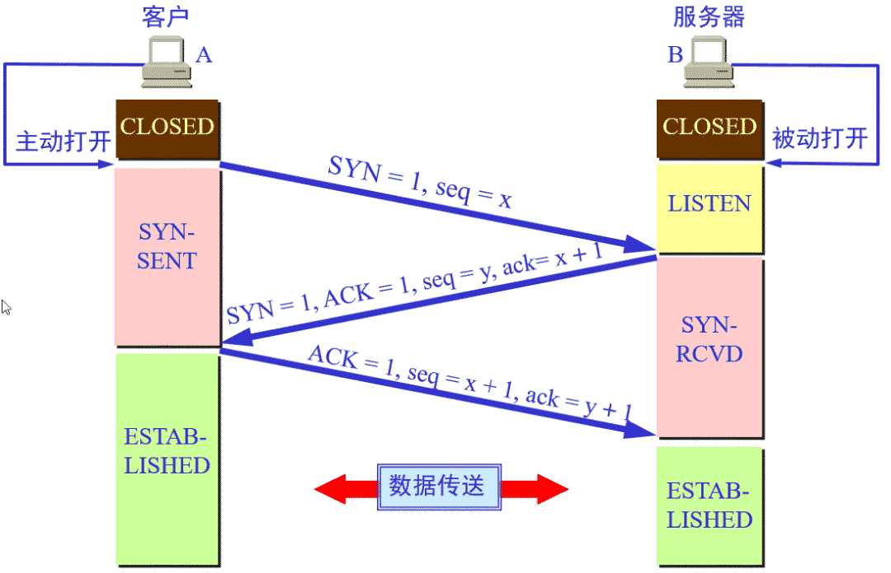
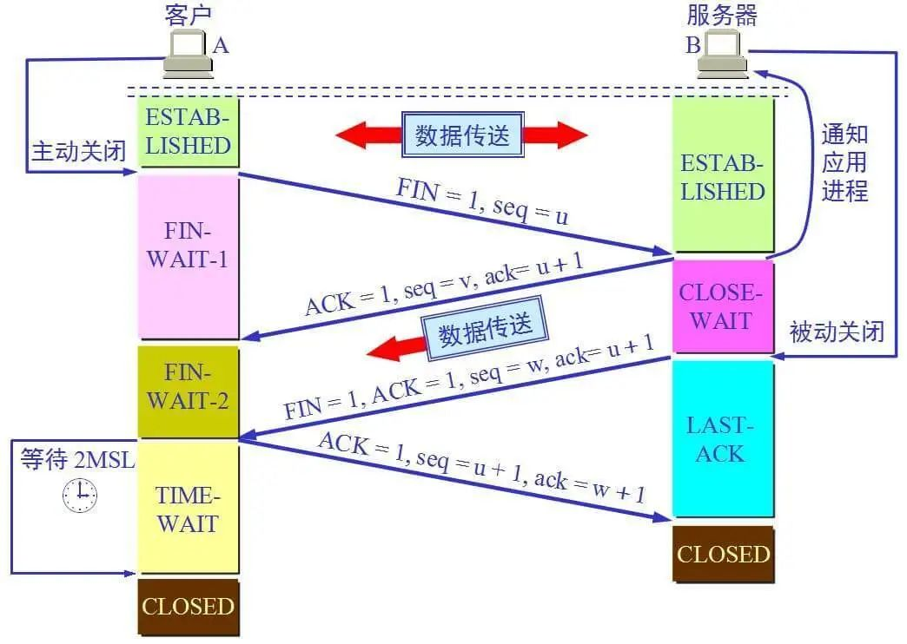

- [UDP首部格式](#udp首部格式)
- [TCP首部格式](#tcp首部格式)
- [有一个IP的服务器监听了一个端口，它的TCP的最大连接数是多少](#有一个ip的服务器监听了一个端口它的tcp的最大连接数是多少)
- [TCP与UDP的区别](#tcp与udp的区别)
- [建立`TCP`服务器的各个系统调用](#建立tcp服务器的各个系统调用)
  - [`close`是一次就能直接关闭的吗，半关闭状态是怎么产生的？](#close是一次就能直接关闭的吗半关闭状态是怎么产生的)
- [TCP怎么保证可靠传输的](#tcp怎么保证可靠传输的)
  - [说一下`TCP`怎么进行拥塞控制的？](#说一下tcp怎么进行拥塞控制的)
  - [拥塞控制和流量控制的区别](#拥塞控制和流量控制的区别)
  - [流量控制的介绍，采用滑动窗口会有什么问题](#流量控制的介绍采用滑动窗口会有什么问题)
  - [TCP 滑动窗口协议](#tcp-滑动窗口协议)
- [TCP 通信过程](#tcp-通信过程)
  - [TCP 三次握手](#tcp-三次握手)
  - [为什么使用三次握手，两次握手可不可以？](#为什么使用三次握手两次握手可不可以)
  - [ISN 是什么？](#isn-是什么)
  - [为什么客户端和服务端的初始序列号 ISN 是不相同的](#为什么客户端和服务端的初始序列号-isn-是不相同的)
    - [ISN 是固定不变的吗？](#isn-是固定不变的吗)
  - [什么是半连接队列](#什么是半连接队列)
  - [最后一个 ACK 丢失了会怎样](#最后一个-ack-丢失了会怎样)
  - [三次握手过程中，可以携带数据吗](#三次握手过程中可以携带数据吗)
  - [如何查看 TCP 状态](#如何查看-tcp-状态)
  - [四次挥手过程](#四次挥手过程)
  - [TIME_WAIT(等待重传)的意义（为什么要等于`2MSL`）](#time_wait等待重传的意义为什么要等于2msl)
    - [Time_wait状态的链接过多会怎样](#time_wait状态的链接过多会怎样)
    - [如何优化Time_wait](#如何优化time_wait)
  - [如果已经建立了连接，但是客户端突然出现故障了怎么办](#如果已经建立了连接但是客户端突然出现故障了怎么办)
  - [服务器出现大量`close_wait`的状态的原因以及解决方法](#服务器出现大量close_wait的状态的原因以及解决方法)
- [介绍一下`ping`的过程，分别用到了哪些协议](#介绍一下ping的过程分别用到了哪些协议)

## UDP首部格式

 用户数据报`UDP`有两个字段：数据字段和首部字段。首部字段很简单，只有`8`个字节，由四个部分组成，分别是：源端口号，目的端口号，长度，校验和；每个部分的长度都是两个字节。还有，`12`字节的伪首部是为了计算检验和临时添加的。

- （1）源端口：发送报文的进程的端口号。在需要对方回信时选用。不需要时可用全`0`。

- （2）目的端口：接收报文的进程的端口号。在终点交付报文时使用。

- （3）包长度：`UDP`用户数据报的长度，其最小值是`8`（仅有首部）。

- （4）检验和：检测`UDP`用户数据报在传输中是否有错。有错就丢弃。

## TCP首部格式

`TCP`虽然是面向字节流的，但`TCP`传送的数据单元却是报文段。一个`TCP`报文段分为首部和数据两部分，而`TCP`的全部功能体现在它首部中的各字段的作用。

`TCP`的头部大致包括：源端口，目的端口，序号，确认号，数据偏移，标志位（6个，ACK,SYN等），检验和等等

（1）源端口，`2`个字节；发送报文的进程的端口号

（2）目的端口，`2`个字节；接收报文的进程的端口号

（3）序号：`seq`序号，`4`个字节，用来**解决网络包乱序的问题**。

> 就是对 `TCP` 通信过程中某一个传输方向上字节流的每个字节进行编号，为了保证网络传输过程中数据通信的有序性。初始序列号由自己定，而后绪的序列号由对端的 `ACK` 决定：`SN_x = ACK_y` (`x` 的序号 `=` `y` 发给 `x` 的 `ACK`)。 

（4）确认号：`ack`序号，占`4`个字节，就是指下一次期望收到的我数据的序列号。只有当标志位中的 `ACK` 标志为 `1` 时该确认号的字段才有效。主要**用来解决不丢包的问题**。

（5）数据偏移：`4`个字节；实际代表`TCP`首部长度，最大为`60`字节。

（6）标志位：共`6`个，即`ACK`、`FIN`、`P·`、`RST`、`SYN`、`URG`等，具体含义如下： `afprsu`

    ACK：为确认序号，ACK=1 时确认号才有效；
    
    FIN：为结束序号，用于发送端提出断开连接；
    
    PSH：指示接收方立即将数据提交给应用层，而不是等待缓冲区满；
    
    RST：该位如果为1，表示TCP连接中出现异常必须强制断开连接
    
    SYN：为同步标志，用于数据同步
    
    URG：为紧急序号，URG=1 是紧急指针有效；

> 1. **ACK**：用来标识发送端有没有把数据发送给接收端，发送的时候 ACK 为 0，表示接收端还未应答，一旦接收端接收数据之后，就将 ACK 置为 1，发送端接收到之后，就知道了接收端已经接收了数据。
> 2. **FIN**：表示发送端已经达到数据末尾，也就是说双方的数据传送完成，没有数据可以传送了，发送 FIN 标志位的 TCP 数据包后，连接将被断开。这个标志的数据包也经常被用于进行端口扫描。发送端只剩最后的一段数据了，同时要告诉接收端后边没有数据可以接受了，所以用 FIN 标识一下，接收端看到这个 FIN 之后，哦！这是接受的最后的数据，接收完就关闭了；
> 3. **SYN**：表示「同步序号」，是 TCP 握手的发送的第一个数据包。用来建立 TCP 的连接。SYN 标志位和 ACK 标志位搭配使用，当连接请求的时候，SYN=1，ACK=0；连接被响应的时候，SYN=1，ACK=1；这个标志的数据包经常被用来进行端口扫描。扫描者发送一个只有 SYN 的数据包，如果对方主机响应了一个数据包回来 ，就表明这台主机存在这个端口。

> 需要注意的是：    
> 不要将确认序号`ack`与标志位中的`ACK`搞混了。    
> 确认方`ack=发起方seq+1`，两端配对。

  （7）检验和：占`2`字节，用于检验数据的完整性

## 有一个IP的服务器监听了一个端口，它的TCP的最大连接数是多少

服务器的IP地址和端口号一般是固定不变的，等待客户端的连接请求。

客户端 IP 和 端口是可变的，其理论值计算公式如下:

> 最大 TCP 连接数 = 客户端的 IP 数 * 客户端的端口数

- 对 IPv4，客户端的 IP 数最多为 2 的 32 次方，客户端的端口数最多为 2 的 16 次方，也就是服务端单机最 大 TCP 连接数，约为 2 的 48 次方。

- 当然，服务端最大并发 TCP 连接数远不能达到理论上限
  - 首先主要是**文件描述符限制**，Socket 都是文件，所以首先要通过 `ulimit` 配置文件描述符的数目;
  - 另一个是**内存限制**，每个 TCP 连接都要占用一定内存，操作系统的内存是有限的。

## TCP与UDP的区别

- 1.`TCP`面向连接，`UDP`无连接。
- 2.`TCP`面向字节流（文件传输），`UDP`是面向报文的，`UDP`没有拥塞控制，因此网络出现拥塞不会使源主机的发送速率降低（比如`IP`电话，实时视频会议等）。
- 3.`TCP`首部开销`20`字节，UDP的首部开销小，只有8个字节。
- 4.`TCP`的逻辑通信信道是全双工的可靠信道，提供可靠的服务。也就是说，通过`TCP`连接传送的数据，无差错，不丢失，不重复，且有序到达; `UDP`是不可靠信道，`UDP`只是尽最大努力交付，并不保证可靠交付。
- 5.每一条`TCP`连接只能是点到点的；`UDP`支持一对一，一对多，多对一和多对多的交互通信。
- 6.`TCP`对系统资源的要求高于`UDP`，所以速度也比`UDP`慢。
- 7.`TCP`数据包是没有边界的，会出现粘包的问题，`UDP`包是独立的，不会出现粘包问题。
- 所以在应用方面，如果强调数据的完整性和正确性用`TCP`，当要求性能和速度的时候，使用`UDP`更加合适。

## 建立`TCP`服务器的各个系统调用

建立TCP服务器连接的过程中主要通过以下系统调用序列来获取某些函数，这些系统调用主要包括：`socket()`，`bind()`，`listen()`，`accept()`，`send()`和`recv()`。

[socket编程过程](寻offer总结/linux编程/IO多路复用相关?id=服务端的-socket-编程过程)

### `close`是一次就能直接关闭的吗，半关闭状态是怎么产生的？

使用`close()`时，只有当套接字的引用计数为`0`的时候才会终止连接，而用`shutdown()`就可以直接关闭连接。

在`TCP`协议中，发送关闭请求时，需要对方回复确认请求，否则不能确认，就会造成一个半关闭的状态，这个时候可以接收，不能发送。我们可以调用`shutdown()`来进行直接关闭 ，`shutdow`函数可以立即关闭进程，不用考虑套接字的引用计数。

半关闭的定义：
`TCP`提供了连接的一端在结束它的发送后，还能接收来自另一端发来的数据的能力，这就是`TCP`的半关闭。

## TCP怎么保证可靠传输的

- **确认和重传**：接收方收到报文就会确认，发送方发送一段时间后没有收到确认就会重传。
- **数据校验**：`TCP`报文头有校验和，用于校验报文是否损坏。
- **数据合理分片和排序**：`tcp`会按最大传输单元(MTU)合理分片，接收方如果收到的数据不按顺序的时候，就会对它重新排序再交给应用层。
  - 而对于UDP：`IP`数据报如果大于1500字节，也就是大于`MTU`。这个时候就会对数据包进行分片，让每一片都少于`MTU`，由于`UDP`的特性，有些分片会被丢弃，所以导致最终无法重组数据包，导致丢弃整个UDP数据报。
- **流量控制**：当接收方来不及处理发送方的数据，能通过滑动窗口，提示发送方降低发送的速率，防止包丢失。
- **拥塞控制**：当网络拥塞时，通过拥塞窗口，减少数据的发送，防止包丢失。

> 拥塞控制有四种算法，**慢启动、拥塞避免，快速重传和快速恢复**

### 说一下`TCP`怎么进行拥塞控制的？

如果网络出现拥塞，分组将会丢失，此时发送方会继续重传，从而导致网络拥塞程度更高。因此当出现拥塞时，应当控制发送方的速率。这一点和流量控制很像，但是出发点不同。流量控制是为了让接收方能来得及接收，而拥塞控制是为了降低整个网络的拥塞程度。

`TCP` 主要通过四个算法来进行拥塞控制：**慢开始、拥塞避免、快速重传、快速恢复**。

- **慢启动**。慢启动算法的思路是当主机开始发送数据时，先以比较小的拥塞窗口进行发送，然后每次翻倍，也就是说，由小到大逐渐增加拥塞窗口的大小，而这个大小是指数增长的，即`1、2、4、8、16`
  * 为了防止拥塞窗口`cwnd`增长过大引起网络拥塞，还要另外设置一个慢启动阈值`ssthresh`状态变量，当拥塞窗口的大小超过慢启动阈值的时候（ `cwnd > ssthresh` 时），停止使用慢启动算法而改用拥塞避免算法。

- **拥塞避免**：设置慢启动阈值，一般开始都设为`65536`。拥塞避免是指当拥塞窗口大小达到这个阈值的时候，拥塞窗口的值不再指数上升，而是采用加法增加（也就是每经过一个往返时间`RTT`就把发送方的拥塞窗口大小`+1`），以此来避免拥塞。

- **快速重传**：当发送端连续收到三个重复的`ack`时，表示该数据段已经丢失，需要重发。这个时候慢启动阈值`ssth`变为原来一半，拥塞窗口`cwnd`变为`ssth+3`，然后使用`+1+1`的发（也就是每一轮`RTT`就+1）

- **快速恢复**。当超过设定的时间没有收到某个报文段的`ack`时，表示网络拥塞，慢启动阈值`ssth`变为原来一半，拥塞窗口`cwnd=1`，进入慢启动阶段。

### 拥塞控制和流量控制的区别

拥塞控制是防止过多的数据注入到网络中，导致网络发生拥塞；

而流量控制是防止发送方一下子发送过多的数据到接收方，导致接收方缓存放不下。

两种算法都是对发送方的行为进行控制的。

具体地说：

- 流量控制属于通信双方协商；拥塞控制涉及通信链路全局。

- 流量控制需要通信双方各维护一个发送窗、一个接收窗，对任意一方，接收窗大小由自身决定，发送窗大小由接收方响应的`TCP`报文段中窗口值确定；拥塞控制的拥塞窗口大小变化由试探性发送一定数据量数据探查网络状况后而自适应调整。

- `实际最终发送窗口 = min{流控发送窗口，拥塞窗口}`。

### 流量控制的介绍，采用滑动窗口会有什么问题

所谓流量控制就是让发送方发送速率不要过快，让接收方来得及接收。利用`TCP`报文段中的窗口大小字段来控制发送方的发送窗口不大于接收方接收的窗口大小就可以实施流量控制。

考虑一种特殊的情况，就是接收方若没有缓存足够使用，就会发送零窗口大小的报文，此时将发送方将的发送窗口设置为`0`，停止发送数据。之后接收方有足够的缓存，发送了非零窗口大小的报文，但是这个报文在中途丢失的，那么发送方的发送窗口就一直为零**导致死锁**。

解决这个问题，`TCP`为每一个连接设置一个持续计时器（`persistence timer`）。只要`TCP`的一方收到对方的零窗口通知，就启动这个计时器，周期性的发送一个零窗口探测报文段。对方就在确认这个报文的时候给出现在的窗口大小（注意：`TCP`规定，即使设置为零窗口，也必须接收以下几种报文段：零窗口探测报文段、确认报文段和携带紧急数据的报文段）。

### TCP 滑动窗口协议

`TCP`的滑动窗口用来控制接收方和发送方的发送速率，避免拥塞的发生。滑动窗口其实就是**接收端的缓冲区大小**，用来告诉发送方对它发送的数据有多大的缓冲空间。在接收方的滑动窗口已知的情况下，当接收方确认了一个连续的数据序列之后，发送方的滑动窗口向后滑动，发送下一个数据序列。

接收方会在每个`ACK`数据包中附带自己当前的接受窗口（滑动窗口）的大小，方便发送方进行控制。

详细可以参考[TCP滑动窗口](/计算机网络/TCP滑动窗口.md)

## TCP 通信过程

首先是通过三次握手建立连接，然后发送数据以及应答,最后通过四次挥手断开连接。

### TCP 三次握手

> 三次握手的本质是确认通信双方收发数据的能力

- 第一次握手：

客户端要向服务端发起连接请求，首先客户端随机生成一个起始序列号`ISN`(比如是`100`)，那客户端向服务端发送的报文段包含同步序号`SYN`标志位(也就是`SYN=1`)，序列号`seq=100`。

这时候`client`处于同步状态`SYN_SENT`。也就是可以建立连接。服务端处于监听状态`LISTEN`。

- 第二次握手

服务端收到客户端发过来的报文后，发现同步序号`SYN=1`，知道这是一个连接请求，于是将客户端的起始序列号`100`存起来，并且随机生成一个服务端的起始序列号(比如是`300`)。然后给客户端回复一段报文，回复报文包含`SYN`和`ACK`标志(也就是`SYN=1`,`ACK=1`)、序列号`seq=300`、确认号`ack=101`(*客户端发过来的序列号+1*)。

  这个时候服务端处于`SYN_RECV`同步接收状态。

- 第三次握手

客户端收到服务端的回复后发现`ACK=1`并且`ack=101`,于是知道服务端已经收到了序列号为`100`的那段报文；同时发现`SYN=1`，知道了服务端同意了这次连接，于是就将服务端的序列号`300`给存下来。然后客户端再回复一段报文给服务端，报文包含`ACK`标志位(`ACK=1`)、`ack=301`(*服务端序列号+1*)、`seq=101`(第一次握手时发送报文是占据一个序列号的，所以这次`seq`就从`101`开始，需要注意的是不携带数据的`ACK`报文是不占据序列号的，所以后面第一次正式发送数据时`seq`还是`101`)。当服务端收到报文后发现`ACK=1`并且`ack=301`，就知道客户端收到序列号为`300`的报文了，就这样客户端和服务端通过`TCP`建立了连接。

> 上面过程中，**第三次捂手是可以携带数据的，前两次握手不可以携带数据。**

### 为什么使用三次握手，两次握手可不可以？

- **三次握手可以阻止重复历史连接的初始化**

简单的说就是防止旧的重复连接初始化造成混乱。

因为网络环境是错综复杂的，往往并没有我们期望的一样，先发送数据包，就先到达主机。可能由于网络堵塞等一些乱七八糟的原因会使得旧的数据包先到达目标主机。

就比如一个旧的`SYN`报文比最新的`SYN`报文先到达服务端，那么服务端就会给客户端返回一个 `SYN+ACK` 报文。如果是三次握手的话，客户端收到这个报文后可以根据自己的上下文判断这是不是一个历史连接（通过序列号过期或者超时判断），如果是历史连接，客户端就会给服务端发送一个 `RST` 报文给服务端，表示终止这一次连接。当然如果不是历史连接就发送一个`ACK`报文，双方就会成功建立链接。

但是如果是两次握手，客户端就不能判断连接是否是历史连接。

- **三次握手可以同步双方的初始序列号**

当客户端发送携带[初始序号`seq`]的 `SYN`报文的时候，需要服务端回一个 `ACK` 应答报文，表示客户端的 `SYN` 报文已被服务端成功接收，那当服务端发送「初始序列号」给客户端的时候，依然也要得到客户端的应答回应，这样一来一回，才能确保双方的初始序列号能被可靠的同步。

而两次握手只能保证一方的初始序号被对方接收，不能保证双方的初始序号都能被确认接收。

- **三次握手才可以避免资源浪费**

如果只有「两次握手」，当客户端的 SYN 请求连接在网络中阻塞，客户端没有接收到 ACK 报文，就会重新发送 SYN ，由于没有第三次握手，服务器不清楚客户端是否收到了自己发送的连接的 ACK 确认号，所以没收到一个 SYN 就只能先主动建立一个连接。

那么如果服务端发送回给客户端的 ACK 报文阻塞了，那么客户端由于没有收到 ACK 确认号，就会重复多次发送 SYN 报文，那么服务器在收到请求连接报文后就会**建立多个冗余的无效连接**。造成不必要的资源浪费。

> 四次握手其实也能够可靠的同步双方的初始化序号，但由于第二步和第三步可以优化成一步，没必要两次握手来分别发送 ACK 报文 和 SYN 报文。所以就成了「三次握手」

### ISN 是什么？

`ISN` 全称是 `Initial Sequence Number`，是 TCP 发送方的字节数据编号的原点，告诉对方我要开始发送数据的初始化序列号

### 为什么客户端和服务端的初始序列号 ISN 是不相同的

如果一个已经失效的连接被重用了，但是该旧连接的历史报文还残留在网络中，如果序列号相同，那么就无法分辨出该报文是不是历史报文，如果历史报文被新的连接接收了，则会产生数据错乱。

所以，每次建立连接前重新初始化一个序列号主要是**为了通信双方能够根据序号将不属于本连接的报文段丢弃**。

另一方面是为了安全性，防止黑客伪造的相同序列号的 TCP 报文被对方接收。

#### ISN 是固定不变的吗？

`ISN` 如果是固定的，攻击者很容易猜出后续的确认序号，为了安全起见，避免被第三方猜到从而发送伪造的 RST 报文，因此 `ISN` 是动态生成的

### 什么是半连接队列

服务器第一次收到客户端的 `SYN` 之后，就会处于 `SYN_RCVD` 状态，此时双方还没有完全建立连接。服务器会把这种状态下请求连接放在一个队列里，我们把这种队列称之为半连接队列。

当然还有一个全连接队列，就是已经完成三次握手，建立起连接的就会放在全连接队列中。如果队列满了就有可能会出现丢包现象。

### 最后一个 ACK 丢失了会怎样

- **Server 端**

第三次的ACK在网络中丢失，那么Server 端该TCP连接的状态为SYN_RECV,并且会根据 TCP的超时重传机制，会等待3秒、6秒、12秒后重新发送SYN+ACK包，以便Client重新发送ACK包。

而Server重发SYN+ACK包的次数，可以通过设置`/proc/sys/net/ipv4/tcp_synack_retries`修改，默认值为5.

如果重发指定次数之后，仍然未收到 client 的ACK应答，那么一段时间后，Server自动关闭这个连接。

- **Client 端**

在linux c 中，client 一般是通过 `connect()` 函数来连接服务器的，而 `connect()`是在 TCP 的三次握手的第二次握手完成后就成功返回值。也就是说 client 在接收到 SYN+ACK 包，它的 TCP 连接状态就为 established `[ɪˈstæblɪʃt]`（已连接），表示该连接已经建立。那么如果 第三次握手中的 ACK 包丢失的情况下，Client 向 server 端发送数据，Server 端将以 RST 包响应，就能感知到 Server 的错误。

### 三次握手过程中，可以携带数据吗

第一次、第二次握手不可以携带数据，而第三次握手是可以携带数据的。

我们可以思考一个问题，假如第一次握手可以携带数据的话，如果有人要恶意攻击服务器，那他每次都在第一次握手中的 `SYN` 报文中放入大量的数据，疯狂着重复发 `SYN` 报文，这会让服务器花费大量的内存空间来缓存这些报文，这样服务器就更容易被攻击了。

对于第三次握手，此时客户端已经处于连接状态，他已经知道服务器的接收、发送能力是正常的了，所以可以携带数据是情理之中。

### 如何查看 TCP 状态

在linux系统中可以通过 `netstat -napt` 命令查看。

### 四次挥手过程

> 四次挥手的目的是关闭一个连接

当我们的应用程序不需要数据通信了，就会发起断开 `TCP` 连接。建立一个连接需要三次握手，而终止一个连接需要经过四次挥手。

假如客户端先发起关闭请求。

- 第一次挥手。客户端向服务端发送一个 FIN 报文，报文中会指定一个序号（假如`seq = u`)，这个时候客户端处于终止等待1 `FIN_WAIT_1` 状态，客户端会停止发送数据，主动关闭 TCP 连接，并等待服务端确认。

- 第二次挥手，服务端收到客户端的 FIN 报文后，就知道这是一个关闭请求。然后服务端向客户端返回一个确认报文，包含确认序号`ACK = 1`，`ack = seq + 1`,也就是`u+1`,并带上自己的序号`squ = v`,这时候服务端处于终止等待`CLOSE_WAIT` 状态，客户端进入`FIN_WAIT_2` 状态。TCP 处于半关闭状态，因为客户端不会发送数据了，不过服务器端有数据发送的话，客户端依然需要接收。

- 第三次挥手，如果服务端也想断开连接了，和客户端的第一次挥手一样，发给 FIN 报文，且指定一个序列号。也就是服务端没有数据要向客户端发送了，服务端发出**连接释放报文段**包含（`FIN=1`，`ACK=1`，序号`seq=w`，确认号`ack=u+1`），服务端进入` LAST_ACK`（最后确认）状态，等待客户端的确认。

- 第四次挥手。客户端收到服务器的 `FIN` 包后，向服务端返回确认报文（`ACK=1，ack=w+1`），这个时候客户端就进入了 `TIME_WAIT` （时间等待）状态。注意此时 `TCP` 连接还没有释放，必须经过 `2*MSL` 后，才进入 `CLOSED` 状态。而服务器端收到客户端的确认包 `ACK` 后就进入了 `CLOSED` 状态，可以看出服务器端结束 `TCP` 连接的时间要比客户端早一些。

### TIME_WAIT(等待重传)的意义（为什么要等于`2MSL`）

`TIME_WAIT`是指四次挥手中客户端接收了服务端的`FIN`报文并发送`ACK`报文给服务器后，仍然需要等待`2MSL`时间的过程。虽然按道理，四个报文都发送完毕，我们可以直接进入`CLOSED`状态了，但是我们必须假设网络是不可靠的，有可能最后一个`ACK`丢失。如果客户端发送的`ACK`发生丢失，服务器会再次发送`FIN`报文给客户端，所以`TIME_WAIT`状态就是用来重发可能丢失的`ACK`报文。`Linux` 系统停留在 `TIME_WAIT` 的时间为固定的 `60` 秒。

注意：**只有发起连接终止的一方会进入 TIME_WAIT 状态**。

#### Time_wait状态的链接过多会怎样

- 第一是内存资源占用，这个目前看来不是太严重，基本可以忽略。

- 第二是对端口资源的占用，一个 TCP 连接至少消耗一个本地端口。要知道，端口资源也是有限的，一般可以开启的端口为 32768～61000 ，*也可以通过`net.ipv4.ip_local_port_range`指定*，如果 TIME_WAIT 状态过多，会导致无法创建新连接。

#### 如何优化Time_wait

- 一个暴力的方法是通过 `sysctl` 命令，将系统值调小。这个值默认为 18000，当系统中处于 TIME_WAIT 的连接一旦超过这个值时，系统就会将所有的 TIME_WAIT 连接状态重置，并且只打印出警告信息。这个方法过于暴力，而且治标不治本，带来的问题远比解决的问题多，**不推荐使用**。

- **调低 TCP_TIMEWAIT_LEN，重新编译系统**，这个方法是一个不错的方法，缺点是需要“一点”内核方面的知识，能够重新编译内核。我想这个不是大多数人能接受的方式。

- `SO_LINGER` (停留) 的设置，我们可以通过设置套接字选项，来设置调用 `close` 或者 `shutdown` 关闭连接时的行为。不过是一个非常危险的行为，不值得提倡

- Linux 还提供了一种比较安全的方法，就是设置`net.ipv4.tcp_tw_reuse`选项，从协议角度理解如果是安全可控的，可以复用处于 TIME_WAIT 的套接字为新的连接所用。

> sysctl 命令，调低 tcp_timewait_len 重新编译，SO_LINGER，net.ipv4.tcp_tw_reuse

### 如果已经建立了连接，但是客户端突然出现故障了怎么办

`TCP` 有一个保持活跃的机制叫做 `Keep-Alive`。显然，客户端如果出现故障，服务器不能一直等下去，白白浪费资源。服务器每收到一次客户端的请求后都会重新复位这个计时器，时间通常是设置为`2`小时，若两小时还没有收到客户端的任何数据，服务器就会发送一个探测报文段，以后每隔75秒钟发送一次。若一连发送`10`个探测报文仍然没反应，服务器就认为客户端出了故障，接着就关闭连接。

### 服务器出现大量`close_wait`的状态的原因以及解决方法

`close_wait`状态是在`TCP`四次挥手的过程中，服务端收到了客户端的`FIN`，但是自己并没有返回发送 FIN 报文，这是情况就会造成服务端服务器出现大量`close_wait`状态，服务器出现大量`close_wait`状态的原因有两种：

* 服务器内部业务处理占用了过多时间，来不及处理完业务；或者还有数据需要发送；或者服务器的业务逻辑有问题，没有执行`close()`方法
* 服务器的父进程派生出子进程，子进程继承了`socket`，收到`FIN`的时候子进程处理但父进程没有处理该信号，导致`socket`的引用不为`0`无法回收

处理方法：

* 停止应用程序
* 修改程序里的bug

## 介绍一下`ping`的过程，分别用到了哪些协议

详见：[`Ping`原理与`ICMP`协议](https://www.cnblogs.com/Akagi201/archive/2012/03/26/2418475.html)

`ping`命令基于网络层的命令，是基于`ICMP`协议工作的。 

`ICMP`:网络控制报文协议

* 首先，`ping`命令会构建一个`ICMP`请求数据包，然后由`ICMP`协议将这个数据包连同目的`IP`地址源的`IP`地址一起交给`IP`协议。
* 然后`IP`协议就会构建一个`IP`数据报，并且在映射表中查找目的`IP`对应的`mac`地址，将其交给数据链路层。
* 然后数据链路层就会构建一个数据帧，附上源`mac`地址和目的`mac`地址发送出去。

* 目的主机接收到数据帧后，就会检查包上的`mac`地址与本机`mac`是否相符，如果相符，就接收并把其中的信息提取出来交给`IP`协议，`IP`协议就会将其中的信息提取出来交给`ICMP`协议。然后构建一个`ICMP`应答包，用相同的过程发送回去。

