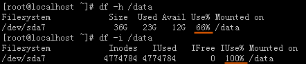
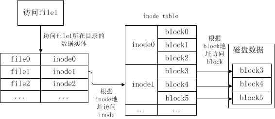

## 1.什么是 inode

文件存储在硬盘上，硬盘的最小存储单位叫做“扇区”（`Sector`）。每个扇区储存`512`字节（相当于`0.5KB`）。

操作系统在读取硬盘的时候，不会一个个扇区地读取，这样效率太低了，而是一次连续读取多个扇区，也就是一次性读取一个块，这个块是有多个扇区组成的“块”，是文件存储的最小单位。“块”的大小一般是`4kb`,也就是八个扇区(sector)组成一个块（block）。


文件数据都储存在“块”中，那么很显然，我们还必须找到一个地方储存文件的“元信息”，比如文件的创建者、文件的创建日期、文件的大小等等。这种储存文件元信息的区域就叫做`inode`，中文译名为"**索引节点**"。

**每一个文件都有对应的`inode`**，里面包含了与该文件有关的一些信息。

## 2.inode 的内容

`inode`包含文件的元信息,具体如下：

- `Size` 文件的字节数
- `Uid `文件拥有者的User ID
- `Gid` 文件的Group ID
- `Access` 文件的读、写、执行权限
- **文件的时间戳**，共有三个：
  - `Change` 指`inode`上一次变动的时间
  - `Modify` 指文件内容上一次变动的时间
  - `Access` 指文件上一次打开的时间
-` Links` 链接数，即有多少文件名指向这个`inode`
- `Inode` 文件数据`block`的位置
- `Blocks` 块数
- `IO Blocks` 块大小
- `Device` 设备号码

可以通过`stat`命令查看一个文件的`inode`信息。
```
$ stat test.c
  File: 'test.c'
  Size: 217             Blocks: 8          IO Block: 4096   regular file
Device: 801h/2049d      Inode: 2376573     Links: 1
Access: (0664/-rw-rw-r--)  Uid: ( 1000/ kendall)   Gid: ( 1000/ kendall)
Access: 2021-03-28 21:48:13.593371400 -0700
Modify: 2021-03-28 21:48:13.597371423 -0700
Change: 2021-03-28 21:48:13.597371423 -0700
 Birth: -
```

总之，除了文件名以外的所有文件信息，都存在`inode`之中。至于为什么没有文件名，下文会有详细解释。

## 3.inode的大小

`inode`也会消耗硬盘空间，所以硬盘格式化的时候，操作系统自动将硬盘分成两个区域。一个是**数据区**，存放文件数据；另一个是`inode`区（`inode table`），存放`inode`所包含的信息。

每个`inode`节点的大小，一般是`128`字节或`256`字节。`inode`节点的总数，在格式化时就会确定，一般是每`1KB`或每`2KB`就设置一个`inode`。假定在一块`1GB`的硬盘中，每个`inode`节点的大小为`128`字节，每`1KB`就设置一个`inode`，那么`inode table`的大小就会达到`128MB`，占整块硬盘的`12.8%`。

查看某个分区的`inode`总数：`$ df -i`

```
$ df -i     # Inode总数 已使用   空闲
Filesystem      Inodes  IUsed   IFree IUse% Mounted on
udev            494293    439  493854    1% /dev
tmpfs           501983    621  501362    1% /run
/dev/sda1      2559088 332227 2226861   13% /
tmpfs           501983      1  501982    1% /dev/shm
tmpfs           501983      5  501978    1% /run/lock
tmpfs           501983     17  501966    1% /sys/fs/cgroup
tmpfs           501983      5  501978    1% /run/user/1000
```

查看每个`inode`节点的大小:

```
$ sudo dumpe2fs -h /dev/sda1 | grep "Inode size"
dumpe2fs 1.42.13 (17-May-2015)
Inode size:               256
```

由于每个文件都必须有一个`inode`，因此有可能发生inode已经用光，但是硬盘还未存满的情况。这时，就无法在硬盘上创建新文件。案例>>http://zyan.cc/post/295/

------
一、发现问题：

　　在一台配置较低的Linux服务器（内存、硬盘比较小）的/data分区内创建文件时，系统提示磁盘空间不足，用df -h命令查看了一下磁盘使用情况，发现/data分区只使用了66%，还有12G的剩余空间，按理说不会出现这种问题。

二、分析问题：

　　后来用`df -i`查看了一下`/data`分区的索引节点(`inode`)，发现已经用满(`IUsed=100%`)，导致系统无法创建新目录和文件。



三、查找原因：
　　`/data/cache`目录中存在数量非常多的小字节缓存文件，占用的`Block`不多，但是占用了大量的`inode`。

四、解决方案：

1、删除`/data/cache`目录中的部分文件，释放出`/data`分区的一部分`inode`。

2、用软连接将空闲分区`/opt`中的`newcache`目录连接到`/data/cache`，使用`/opt`分区的`inode`来缓解`/data`分区inode不足的问题：

　　`ln -s /opt/newcache /data/cache`

3、更换服务器，用高配置的服务器替换低配置的服务器。

------

## 4.`inode `号码

每个`inode`都有一个号码，操作系统用`inode`号码来识别不同的文件。

**Unix/Linux系统内部不使用文件名，而使用`inode`号码来识别文件。对于系统来说，文件名只是`inode`号码便于识别的别称或者绰号**。

表面上，用户通过文件名，打开文件。实际上，系统内部这个过程分成三步：

- 首先，系统找到这个文件名对应的`inode`号码；

- 其次，通过`inode`号码，获取`inode`信息；

- 最后，根据`inode`信息，找到文件数据所在的`block`，读出数据。

查看文件对应的`Inode`号码
```
$ ls -i hello.c 
14242783 hello.c
```

## 5.目录文件

在`Linux`系统中，一切皆文件，因此目录（directory）也是一种文件。打开目录，实际上就是打开目录文件。

目录文件的结构非常简单，就是一系列目录项（dirent）的列表。每个目录项，由两部分组成：所包含文件的文件名，以及该文件名对应的`inode`号码。

`ls`命令只列出目录文件中的所有文件名，`ls -i`命令列出整个目录文件，即文件名和`inode`号码：

目录文件的读权限（r）和写权限（w），都是针对目录文件本身。由于目录文件内只有文件名和`inode`号码，所以如果只有读权限，只能获取文件名，无法获取其他信息，因为其他信息都储存在`inode`节点中，而读取`inode`节点内的信息需要目录文件的执行权限（x）。


## 6.硬链接

一般情况下，文件名和inode号码是"一一对应"关系，每个inode号码对应一个文件名。但是，Unix/Linux系统允许，多个文件名指向同一个inode号码。

这意味着，可以用不同的文件名访问同样的内容；对文件内容进行修改，会影响到所有文件名；但是，删除一个文件名，不影响另一个文件名的访问。这种情况就被称为"硬链接"（`hard link`）

ln命令可以创建硬链接：

`ln 源文件 目标文件`

运行上面这条命令以后，源文件与目标文件的`inode`号码相同，都指向同一个`inode`。`inode`信息中有一项叫做"链接数"，记录指向该`inode`的文件名总数，这时就会增加`1`。

反过来，删除一个文件名，就会使得`inode`节点中的"链接数"减`1`。当这个值减到`0`，表明没有文件名指向这个`inode`，系统就会回收这个`inode`号码，以及其所对应`block`区域。

这里顺便说一下目录文件的"链接数"。创建目录时，默认会生成两个目录项："`.`"和"`..`"。前者的`inode`号码就是当前目录的`inode`号码，等同于当前目录的"硬链接"；后者的`inode`号码就是当前目录的父目录的`inode`号码，等同于父目录的"硬链接"。所以，任何一个目录的"硬链接"总数，总是等于2加上它的子目录总数（含隐藏目录）。

## 7.软链接

除了硬链接以外，还有一种特殊情况。

文件`A`和文件`B`的`inode`号码虽然不一样，但是文件A的内容是文件`B`的路径。读取文件`A`时，系统会自动将访问者导向文件`B`。因此，无论打开哪一个文件，最终读取的都是文件`B`。这时，文件`A`就称为文件`B`的"软链接"（`soft link`）或者"符号链接（`symbolic link`）。

这意味着，文件`A`依赖于文件`B`而存在，如果删除了文件`B`，打开文件`A`就会报错："`No such file or directory`"。这是软链接与硬链接最大的不同：文件`A`指向文件`B`的文件名，而不是文件`B`的`inode`号码，文件`B`的`inode`"链接数"不会因此发生变化。

ln -s命令可以创建软链接。

`ln -s 源文文件或目录 目标文件或目录`

```
$ ln -s test.c test1.c
$ ls -li
total 4
2376574 lrwxrwxrwx 1 kendall kendall   6 Mar 29 07:09 test1.c -> test.c
2376573 -rw-rw-r-- 1 kendall kendall 217 Mar 28 21:48 test.c
```

## 8.inode的特殊作用

由于`inode`号码与文件名分离，这种机制导致了一些`Unix/Linux`系统特有的现象：
- (1) 有时，文件名包含特殊字符，无法正常删除。这时，直接删除inode节点，就能起到删除文件的作用。
- (2) 移动文件或重命名文件，只是改变文件名，不影响inode号码。
- (3) 打开一个文件以后，系统就以inode号码来识别这个文件，不再考虑文件名。因此，通常来说，系统无法从inode号码得知文件名。

第3点使得软件更新变得简单，可以在不关闭软件的情况下进行更新，不需要重启。因为系统通过`inode`号码，识别运行中的文件，不通过文件名。更新的时候，新版文件以同样的文件名，生成一个新的`inode`，不会影响到运行中的文件。等到下一次运行这个软件的时候，文件名就自动指向新版文件，旧版文件的`inode`则被回收。

## 9.操作系统读取磁盘文件的流程

操作系统读取磁盘文件的流程是这样的：
- （1）根据给定的文件的所在目录，获取该目录的数据实体，根据数据实体中的数据项，找到对应文件的`inode`；
- （2）根据文件`inode`，找到`inodeTable`；
- （3）根据`inodeTable`中的对应关系，找到对应的`block`；
- （4）读取文件。




> [参考链接](https://blog.csdn.net/xuz0917/article/details/79473562)

