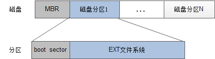

## 文件系统结构概述

首先需要了解`linux`的文件系统结构划分，`linux`的文件系统大致可以分为三部分，或者，我们可以直接理解为`linux`的物理磁盘上，存放的数据是分为三部分的。

- 第一部分是`superblock`：超级块。**这一部分主要存放的是文件系统的信息**，包括`inode/block`的总量、使用量、剩余量。还有文件系统的挂载情况，包括文件系统的挂载时间、最后一次写入数据、检验磁盘的时间。

- 第二部分是`inode`：文件节点。这里可以理解为类似于索引的概念。 
1) **对于文件来说**，`inode`**里存储的是这个文件的元数据信息**，例如文件权限、所有者、大小等，还有一个最重要的就是这个文件数据实际存储的`block`编号。 
2) **对于目录**，存储的就是这个目录的元数据（权限、所有者等信息）以及对于`block`编号。

- 第三部分是`block`：文件块。可以理解为文件实际上存储的区域。对于文件和目录，它上边存储的东西又有所不同。

这个表展示了`inode`和`block`，对于文件和目录的区别：

|     | 文件  | 目录  |
|  ----  | ----  |---- | 
| inode  | 文件元数据：权限、所有者、大小、时间等信息；对应`block`编号 | 目录元数据：权限、所有者、大小、时间等信息；对应`block`编号 |
| block  | 文件内容数据| 文件和文件对应`inode`列表 |

## 磁盘格式化
**两种格式化**：

- 物理格式化
  * 磁盘在使用前要进行分区和格式化：`MBR`中存放分区信息、开机代码
  * 出厂前厂家已经做好的工作：划分磁道、扇区
- 逻辑格式化
  * 使用格式化工具，在磁盘上安装文件系统
  * 将磁盘划分为不同的`block`
  * 将磁盘划分为不同的区段

磁盘格式化的时候会将磁盘划分成一个个分区，除此之外还会生成一个**主引导记录**（MBR）,用来存放各个分区的信息，开机代码也是存储在 MBR 中的。

往每个分区中存储数据或者读写数据时，可以根据需要安装不同的文件系统，比如说我们想安装 EXT 文件系统，可以直接使用 EXT 格式化工具对这个磁盘分区进行格式化即可，也可以理解为在这个磁盘分区上安装了文件系统。

EXT 格式化工具 只要是将磁盘分区划分成不同的`block`，然后将逻辑块的信息保存在`super block`中，

磁盘文件，需要使用的话要进行分区，使用`fdisk`，第0个地址存放的是**主引导记录**（MBR），它记录磁盘分区的信息，如果需要在某个分区上安装文件系统，需要使用对应的文件系统工具进行初始化，