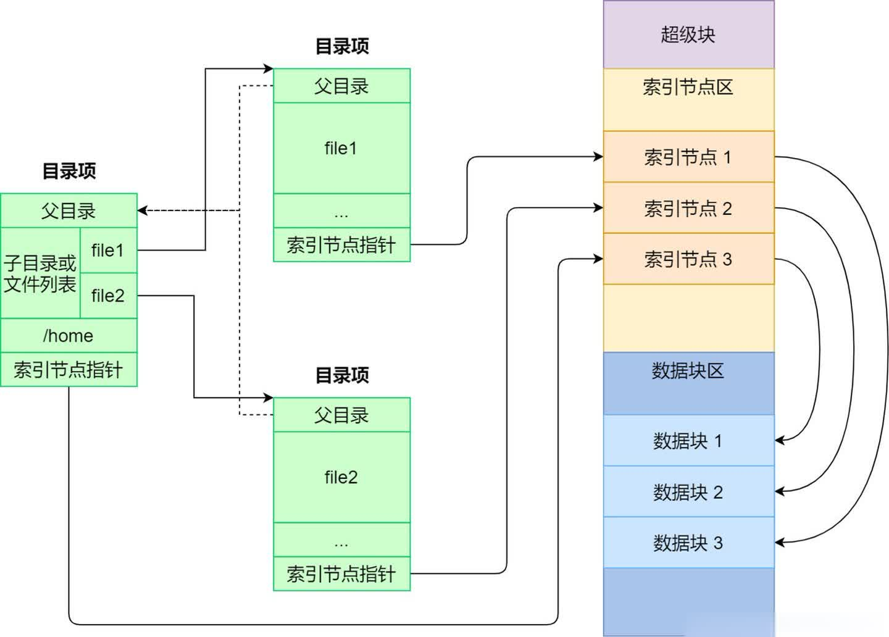
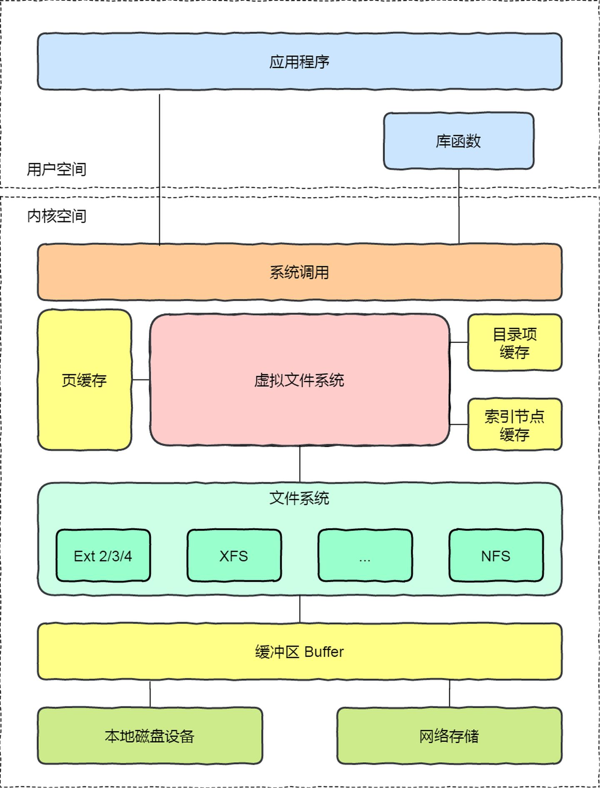
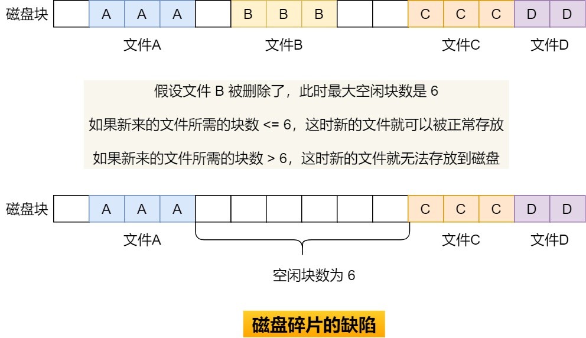
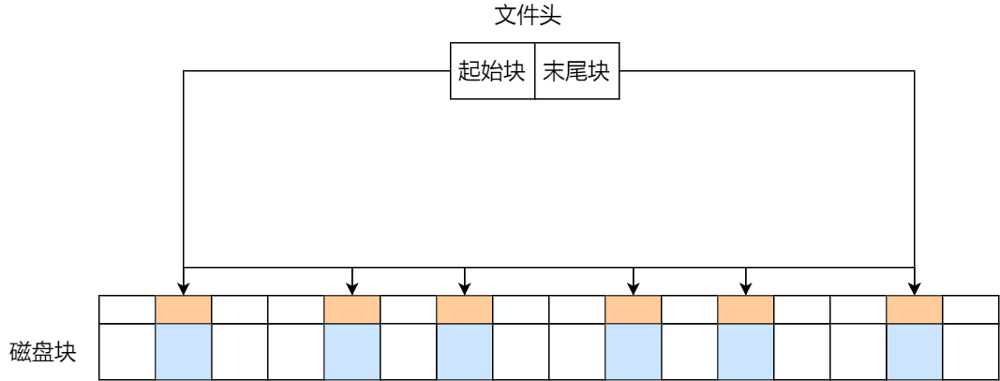
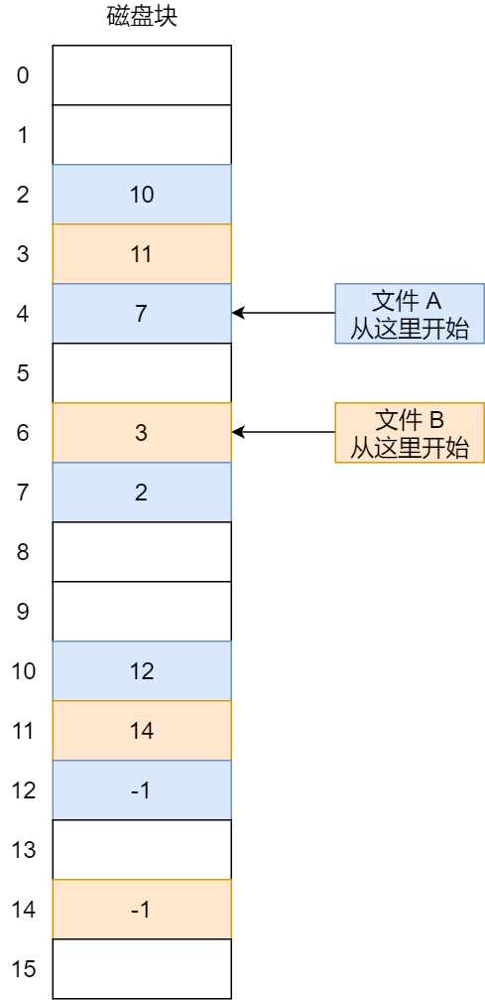
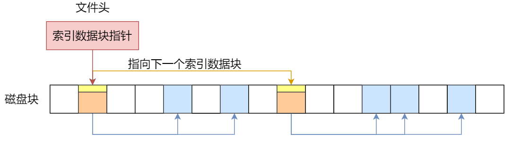

## 文件系统结构概述

文件系统是操作系统中负责管理持久数据的子系统，简单的说就是负责把用户的文件存储到磁盘中。即使计算机断电数据而不会丢失，可以持久化保存数据。

文件系统的基本数据单位是文件，它的目的是对磁盘上的文件进行组织管理，由于组织的方式不同，就会形成不同的文件系统。

在`linux`系统中,**一些皆文件**。不仅普通的文件和目录，就连块设备、管道、`socket` 等，也都是统一交给文件系统管理的。

磁盘进行格式化的时候，会被分成三个存储区域:

- 第一部分是`superblock`：超级块。**这一部分主要存放的是文件系统的信息**，包括`inode/block`的总量、使用量、剩余量。还有文件系统的挂载情况，包括文件系统的挂载时间、最后一次写入数据、检验磁盘的时间。

- 第二部分是`inode`：文件索引节点。这里可以理解为类似于索引的概念。<br>
1) **对于文件来说**，`inode`**里存储的是这个文件的元数据信息**，例如文件权限、所有者、大小等，还有一个最重要的就是这个文件数据实际存储的`block`编号(**数据在磁盘的位置**)。<br>
2) **对于目录**，存储的就是这个目录的元数据（权限、所有者等信息）以及对应`block`编号。

- 第三部分是`block`：文件块。可以理解为文件实际上存储的区域。对于文件和目录，它在上边存储的东西又有所不同。

这个表展示了`inode`和`block`，对于文件和目录的区别：

|     | 文件  | 目录  |
|  ----  | ----  |---- | 
| inode  | 文件元数据：权限、所有者、大小、时间等信息；对应`block`编号 | 目录元数据：权限、所有者、大小、时间等信息；对应`block`编号 |
| block  | 文件内容数据| 文件和文件对应`inode`列表 |

<br>

`Linux` 文件系统会为每个文件分配两个数据结构：索引节点（`index node`）和目录项（`directory entry`），它们主要用来记录文件的元信息和目录层次结构。

目录项，也就是 `dentry`，用来**记录文件的名字**、索引节点指针以及与其他目录项的层级关联关系。多个目录项关联起来，就会形成目录结构，但它与索引节点不同的是，目录项是由内核维护的一个数据结构，不存放于磁盘，而是缓存在内存。
> 注意：`Inode`没有存储文件名，文件名记录在目录项中

由于索引节点唯一标识一个文件，而目录项记录着文件的名，所以目录项和索引节点的关系是多对一，也就是说，一个文件可以有多个名字。比如，硬链接的实现就是多个目录项中的索引节点指向同一个文件。

### 文件数据是如何存储在磁盘的呢？

磁盘读写的最小单位是**扇区**，扇区的大小只有 `512B` 大小，很明显，如果每次读写都以这么小为单位，那这读写的效率会非常低。

所以，文件系统把多个扇区组成了一个逻辑块，每次读写的最小单位就是逻辑块（数据块），`Linux` 中的逻辑块大小为 `4KB`，也就是一次性读写 `8` 个扇区，这将大大提高了磁盘的读写的效率。

下面这个图就很好的展示了索引节点、目录项以及文件数据之间的关系：



索引节点是存储在硬盘上的数据，那么为了加速文件的访问，通常会把索引节点加载到内存中。

## 虚拟文件系统

文件系统的种类众多，而操作系统希望对用户提供一个统一的接口，于是在用户层与文件系统层引入了中间层，这个中间层就称为**虚拟文件系统**（Virtual File System，VFS）。

`VFS` 定义了一组所有文件系统都支持的数据结构和标准接口，这样程序员不需要了解文件系统的工作原理，只需要了解 `VFS` 提供的统一接口即可。

在 `Linux` 文件系统中，用户空间、系统调用、虚拟机文件系统、缓存、文件系统以及存储之间的关系如下图：




## 文件的使用

我们从用户角度来看文件的话，就是我们要怎么使用文件？首先，我们得通过系统调用来打开一个文件。


```c
fd = open(name, flag); # 打开文件
...
write(fd,...);         # 写数据
...
close(fd);             # 关闭文件
```

上面简单的代码是读取一个文件的过程： 

- 首先用 `open` 系统调用打开文件，`open` 的参数中包含文件的路径名和文件名。 
- 使用 `write` 写数据，其中 `write` 使用 `open` 所返回的文件描述符，并不使用文件名作为参数。 
- 使用完文件后，调用 `close` 系统调用关闭文件，避免资源的泄露。

我们打开了一个文件后，操作系统会跟踪进程打开的所有文件，所谓的跟踪呢，就是操作系统为每个进程维护一个打开文件表，文件表里的每一项代表「**文件描述符**」，所以说**文件描述符是打开文件的标识。**


操作系统在打开文件表中维护着打开文件的状态和信息： 

- 文件指针：系统跟踪上次读写位置作为当前文件位置指针，这种指针对打开文件的某个进程来说是唯一的； 

- 文件打开计数器：文件关闭时，操作系统必须重用其打开文件表条目，否则表内空间不够用。因为多个进程可能打开同一个文件，所以系统在删除打开文件条目之前，必须等待最后一个进程关闭文件，该计数器跟踪打开和关闭的数量，当该计数为 `0` 时，系统关闭文件，删除该条目；

- 文件磁盘位置：绝大多数文件操作都要求系统修改文件数据，该信息保存在内存中，以免每个操作都从磁盘中读取；

- 访问权限：每个进程打开文件都需要有一个访问模式（创建、只读、读写、添加等），该信息保存在进程的打开文件表中，以便操作系统能允许或拒绝之后的 `I/O` 请求；

在用户视角里，文件就是一个持久化的数据结构，但操作系统并不会关心你想存在磁盘上的任何的数据结构，操作系统的视角是如何把文件数据和磁盘块对应起来。

所以，用户和操作系统对文件的读写操作是有差异的，用户习惯以字节的方式读写文件，而操作系统则是以数据块来读写文件，那屏蔽掉这种差异的工作就是文件系统了。

### 读文件和写文件的过程

- 当要读取一个文件的内容时，先在 `inode` 中查找文件内容所在的所有 `block`，然后把所有 `block `的内容读出来。

- 当要进行写文件的时候，先在 `inode` 中查找需要写入数据的 `block`，然后修改`block`中对应的部分，最后再把数据块写回磁盘。


所以说，**文件系统的基本操作单位是数据块**。

## 文件的存储

文件的数据是要存储在硬盘上面的，数据在磁盘上的存放方式，就像程序在内存中存放的方式那样，有以下两种：

- 连续空间存放方式
- 非连续空间存放方式

其中，非连续空间存放方式又可以分为「**链表方式**」和「**索引方式**」。

不同的存储方式，有各自的特点，重点是要分析它们的存储效率和读写性能，接下来分别对每种存储方式说一下。

### 连续空间存放方式

连续空间存放方式顾名思义，文件存放在磁盘「连续的」物理空间中。这种模式下，文件的数据都是紧密相连，读写效率很高，因为一次磁盘寻道就可以读出整个文件。

使用连续存放的方式有一个前提，必须先知道一个文件的大小，这样文件系统才会根据文件的大小在磁盘上找到一块连续的空间分配给文件。

所以，文件头里需要指定「起始块的位置」和「长度」，有了这两个信息就可以很好的表示文件存放方式是一块连续的磁盘空间。

注意，此处说的文件头，就类似于 Linux 的 inode。


连续空间存放的方式虽然读写效率高，但是有「**磁盘空间碎片**」和「**文件长度不易扩展**」的缺陷。

如下图，如果文件 B 被删除，磁盘上就留下一块空缺，这时，如果新来的文件小于其中的一个空缺，我们就可以将其放在相应空缺里。但如果该文件的大小大于所有的空缺，但却小于空缺大小之和，则虽然磁盘上有足够的空缺，但该文件还是不能存放。当然了，我们可以通过将现有文件进行挪动来腾出空间以容纳新的文件，但是这个在磁盘挪动文件是非常耗时，所以这种方式不太现实。



另外一个缺陷是文件长度扩展不方便，例如上图中的文件 A 要想扩大一下，需要更多的磁盘空间，唯一的办法就只能是挪动的方式，前面也说了，这种方式效率是非常低的。

那么有没有更好的方式来解决上面的问题呢？答案当然有，既然连续空间存放的方式不太行，那么我们就改变存放的方式，使用非连续空间存放方式来解决这些缺陷。

### 非连续空间存放方式

非连续空间存放方式分为「链表方式」和「索引方式」。

我们先来看看链表的方式。
链表的方式存放是离散的，不用连续的，于是就可以消除磁盘碎片，可大大提高磁盘空间的利用率，同时文件的长度可以动态扩展。根据实现的方式的不同，链表可分为「隐式链表」和「显式链接」两种形式。

文件要以「隐式链表」的方式存放的话，实现的方式是文件头要包含「第一块」和「最后一块」的位置，并且每个数据块里面留出一个指针空间，用来存放下一个数据块的位置，这样一个数据块连着一个数据块，从链头开是就可以顺着指针找到所有的数据块，所以存放的方式可以是不连续的。



隐式链表的存放方式的缺点在于无法直接访问数据块，只能通过指针顺序访问文件，以及数据块指针消耗了一定的存储空间。隐式链接分配的稳定性较差，系统在运行过程中由于软件或者硬件错误导致链表中的指针丢失或损坏，会导致文件数据的丢失。

如果取出每个磁盘块的指针，把它放在内存的一个表中，就可以解决上述隐式链表的两个不足。那么，这种实现方式是「显式链接」，它指把用于链接文件各数据块的指针，显式地存放在内存的一张链接表中，该表在整个磁盘仅设置一张，每个表项中存放链接指针，指向下一个数据块号。

对于显式链接的工作方式，我们举个例子，文件 A 依次使用了磁盘块 4、7、2、10 和 12 ，文件 B 依次使用了磁盘块 6、3、11 和 14 。利用下图中的表，可以从第 4 块开始，顺着链走到最后，找到文件 A 的全部磁盘块。同样，从第 6 块开始，顺着链走到最后，也能够找出文件 B 的全部磁盘块。最后，这两个链都以一个不属于有效磁盘编号的特殊标记（如 -1 ）结束。内存中的这样一个表格称为文件分配表（File Allocation Table，FAT）。



由于查找记录的过程是在内存中进行的，因而不仅显著地提高了检索速度，而且大大减少了访问磁盘的次数。但也正是整个表都存放在内存中的关系，它的主要的缺点是不适用于大磁盘。

比如，对于 200GB 的磁盘和 1KB 大小的块，这张表需要有 2 亿项，每一项对应于这 2 亿个磁盘块中的一个块，每项如果需要 4 个字节，那这张表要占用 800MB 内存，很显然 FAT 方案对于大磁盘而言不太合适。

> 接下来，我们来看看索引的方式。

链表的方式解决了连续分配的磁盘碎片和文件动态扩展的问题，但是不能有效支持直接访问（FAT除外），索引的方式可以解决这个问题。

索引的实现是为每个文件创建一个「索引数据块」，里面存放的是指向文件数据块的指针列表，说白了就像书的目录一样，要找哪个章节的内容，看目录查就可以。

另外，文件头需要包含指向「索引数据块」的指针，这样就可以通过文件头知道索引数据块的位置，再通过索引数据块里的索引信息找到对应的数据块。

创建文件时，索引块的所有指针都设为空。当首次写入第 i 块时，先从空闲空间中取得一个块，再将其地址写到索引块的第 i 个条目。


索引的方式优点在于： - 文件的创建、增大、缩小很方便； - 不会有碎片的问题； - 支持顺序读写和随机读写；

由于索引数据也是存放在磁盘块的，如果文件很小，明明只需一块就可以存放的下，但还是需要额外分配一块来存放索引数据，所以缺陷之一就是存储索引带来的开销。

如果文件很大，大到一个索引数据块放不下索引信息，这时又要如何处理大文件的存放呢？我们可以通过组合的方式，来处理大文件的存。

先来看看链表 + 索引的组合，这种组合称为「链式索引块」，它的实现方式是在索引数据块留出一个存放下一个索引数据块的指针，于是当一个索引数据块的索引信息用完了，就可以通过指针的方式，找到下一个索引数据块的信息。那这种方式也会出现前面提到的链表方式的问题，万一某个指针损坏了，后面的数据也就会无法读取了。



还有另外一种组合方式是索引 + 索引的方式，这种组合称为「多级索引块」，实现方式是通过一个索引块来存放多个索引数据块，一层套一层索引，像极了俄罗斯套娃是吧。


参考原文链接：https://blog.csdn.net/qq_34827674/article/details/107992414