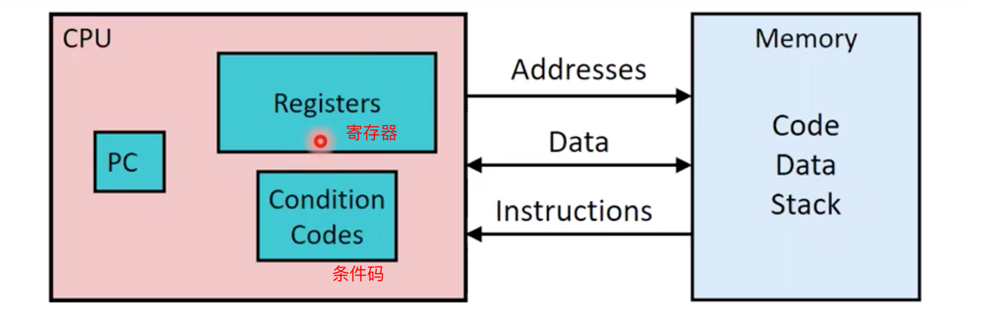
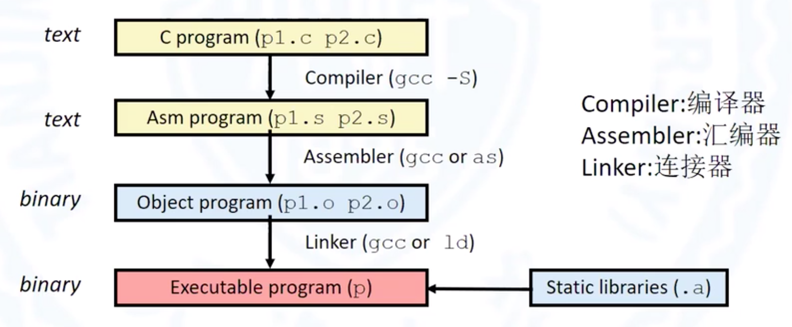
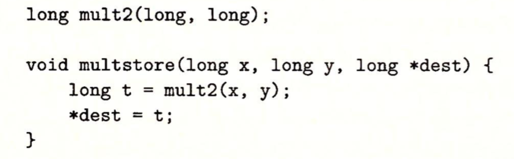
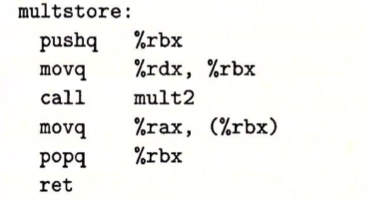
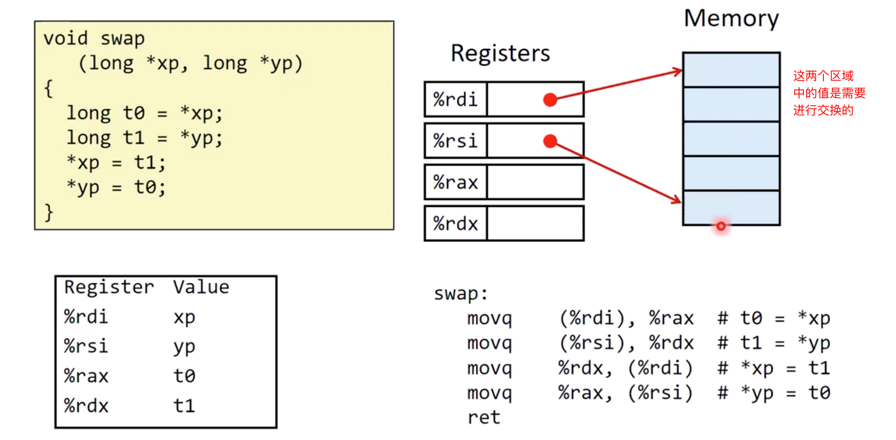
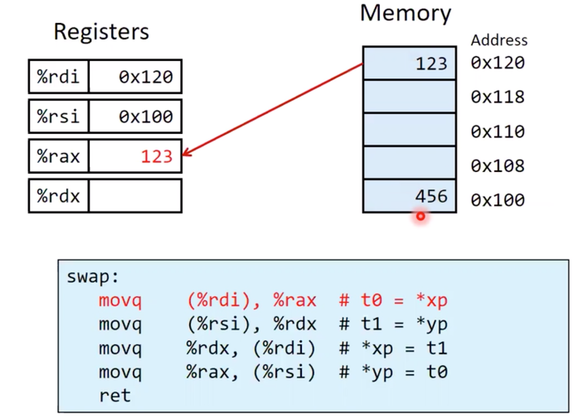
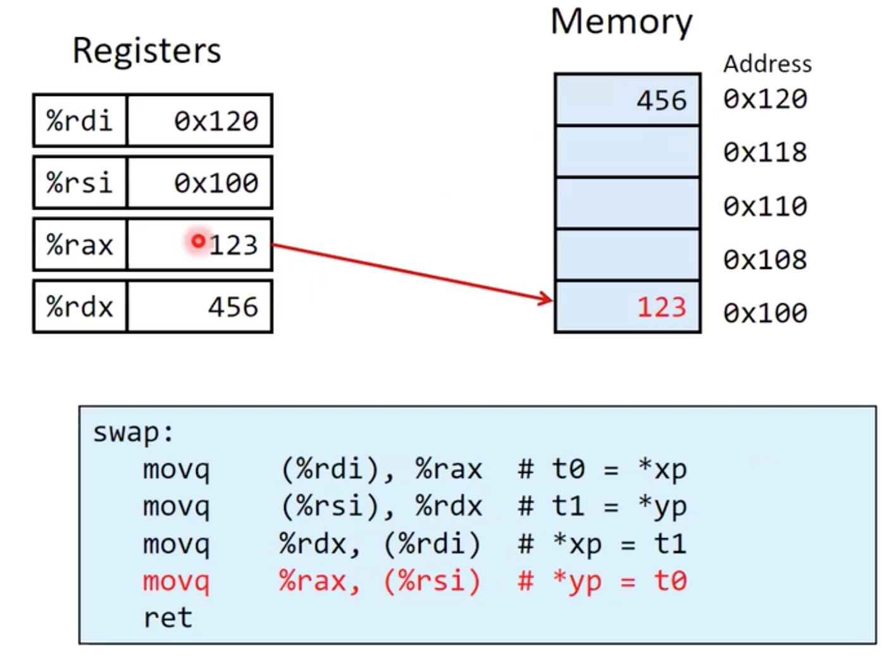
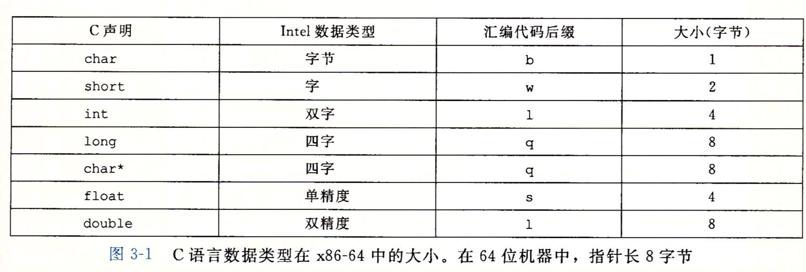

## 汇编语言
### 定义
- 体系结构（ISA：指令集体系结构）:定义了一个软件与硬件之间的接口， 也就是软件以什么样的结构才能让硬件完成相应的动作。       
比如：定义了指令集的规范，定义了寄存器的组织方法。

- 微体系结构：ISA下一层。如何去实现体系结构，也就是讨论接口在底层是如何完成实现的。         
例如：虽然x86处理器都支持x86指令集，但是不同版本的Intel不同版本的x86处理器内部可能有不同的微体系结构。

- 代码格式
  * 机器代码：基于字节级的比特率，可以被处理器直接理解和执行（对处理器友好，对人不友好）
  * 汇编代码：对机器语言文本上的注解

**创建的体系结构：**            
- Intel:x86,IA32,x86-64
- ARM:大部分的智能手机都是用ARM指令集

### 汇编语言与C语言(高级语言)的区别
#### 高级语言的特点
- 较好的抽象能力，能提供可靠的生产力
- 类型检查
- 支持跨平台

#### 汇编语言的特点
- 内存需要手动管理
- 复杂的计算依靠简单的指令组合完成
- 不具备跨平台能力
- 不具有类型。
> 汇编语言通过**汇编器**可以转化成目标平台的机器指令（字节流的形式）。
- 不存在数组，结构体等结构
- 汇编语言的运算主要是对**寄存器**或者**内存中的数据**进行操作



在CPU中程序员可以直接操作寄存器（具有较快的存储速度，即将被送入运算器中的数据将会存储到寄存器中）。程序员还能直接访问到条件码（记录前一条指令的运行状态，比如说进位，运行结果的符号位）。除此之外，还可以观测到**程序计数器**（PC：存放下一题即将加载的指令的地址，在X86-64中PC叫**RIP**）。

## 高级语言如何转成机器指令
假设现在有`p1.c`和`p2.c`两个源文件
```
linux> gcc -O1 p1.c p2.c -o p
```
- -O1:将程序代码进行编译器级别的优化
- 最后输出文件名称为P
  


`p1.c`和`p2.c` 通过**编译器**转化成汇编语言源文件（`.s`结尾）,在通过**汇编器**将汇编指令转成可重定向二进制目标文件（`.o`结尾）。最后通过**链接器**把两个`.o`文件以及会使用到的静态库进行链接，生成最终的可执行文件。
> 源码 -> 编译 -> 汇编 -> 链接 -> 可执行文件

下面看一段C语言代码转成汇编指令：
```
linux> gcc -Og -S mstore.c
```

**C语言代码 mstore.c.c**



**汇编指令**



注意，不同的编译器转化成的汇编指令可能不同。

**分析：**

```
*dest t;

转成汇编指令
movq %rax, (%rabx)   //数据移动
```
这条指令将rax 移动到了rbx所指向的内存地址中，实现了寄存器的数据像内存移动过程。

反汇编：把机器指令反向还原成汇编指令
```
linux> objdump -d mstore.o
```
还可以使用 GDB进行反汇编，GDB是调试工具，在通过`gdb mstore.o`进入控制台只会输入`x/14xb mstore`可以进行反汇编。

## 汇编语言的格式
```
[label: ] [opcode] [operand 1] [operabd ,]        
 编号       操作码     操作数1     ， 操作数2

例子：
 11     movq   $5    ,   %rax   //5赋值给rax
        addq   $5-16 ,   (%rax)
```

一个`x86-64`的中央处理单元(CPU)包含一组16个存储64位值的通用目的寄存器。这些寄存器用来存储**整数数据**和**指针**。


一个`x86-64`的中央处理单元(CPU)包含一组16个存储64位值的通用目的寄存器。这些寄存器用来存储**整数数据**和**指针**。


指令可以对这16个寄存器的低位字节存放的大小不同的有效数据进行操作。这些寄存器可以向前兼容，就是64位可以存储32位，16位和8位的数据，但是32位无法存储64位的数据，如果是大寄存器存小数据，那么只能存在低位中，高位有相对应的填充措施。

> **对于所有的寄存器来说，最特别的就是%rsp，它用来指明运行时栈的结束位置。**

## 汇编语言的指令

### 数据访问指令
助记符：`movq`          

源操作数和目的操作数复制的移动

操作数的三种形式：
- 立即数：通常是常数整数类型，例如：$0x400,$-533
- 寄存器： 例如：%rax,%r13
- 内存  例如：(%rax)  括号类似C语言的指针.
结合实例来理解
下面是将C语言实现`swap()`转成汇编语言指令。


`xp` 和 `yp` 两个参数会被存在 `rdi` 和 `rsi` 两个寄存器当中，这两个寄存器中存放的是地址而不是指针指向的值。`t0`是存在`rax`寄存器中,`t1`存在`tdx`寄存器中。



假设`rdi`的值是`0x120`,`rsi`的值是`0x100`。

`0x120`中存的是123，`0x100`存的是456，

- 执行第一条指令，把`rdi`指向的值赋值给`rax`。



- 接着把`rsi`指向的数据赋值给`rdx`


- 把`rdx`的值复制给`rdi`指向的地址中


- 把`rax`的值复制给`rsi`指向的地址中



- `ret`是过程返回指令，相当于C语言的`return`

### 内存的寻址模式
基本格式：    
D(R<sub>b</sub>,R<sub>i</sub>，S)

D：是一个基于内存地址的偏移量，可能是1，2，4，8字节

R<sub>b</sub>：内存的基地址

R<sub>i</sub>：索引寄存器，除了%rsp不能表示，其他的都可以在这里表示

S：大小，1，2，4，8

通过以下公式计算出来的值作为知己内存的访问地址
> Mem[ Reg[R<sub>b</sub>]+S * Reg[R<sub>i</sub>]+D ]

 但是会存在特殊情况，缺值：D缺失表示`D=0`，S缺失表示`S=1`

 - D和S缺失：(R<sub>b</sub>,R<sub>i</sub>） Mem[ Reg[R<sub>b</sub>]+Reg[R<sub>i</sub>] ]
- 缺失S：D(R<sub>b</sub>,R<sub>i</sub>） Mem[ Reg[R<sub>b</sub>]+Reg[R<sub>i</sub>] + D]
- 缺失D：(R<sub>b</sub>,R<sub>i</sub>,S） Mem[ Reg[R<sub>b</sub>]+S * Reg[R<sub>i</sub>]]

**例子：**


### 数据格式



 


