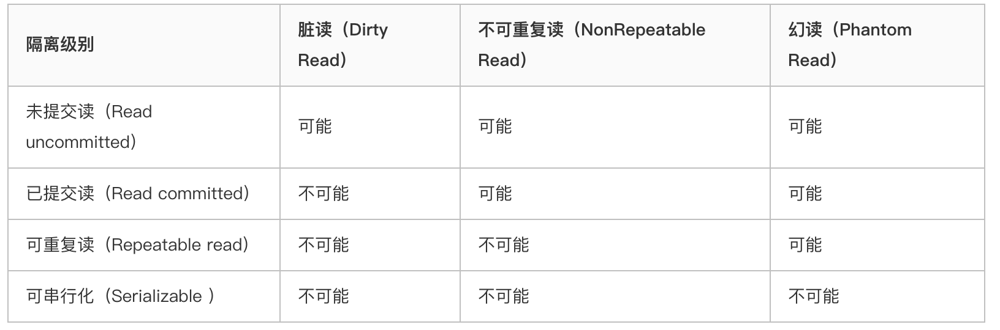
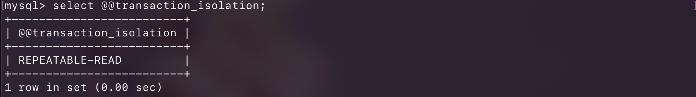
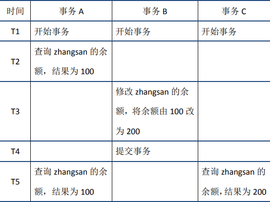
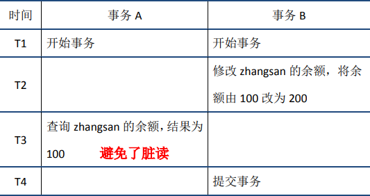
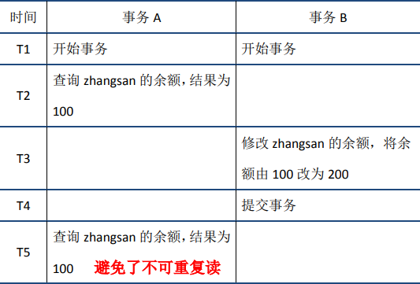
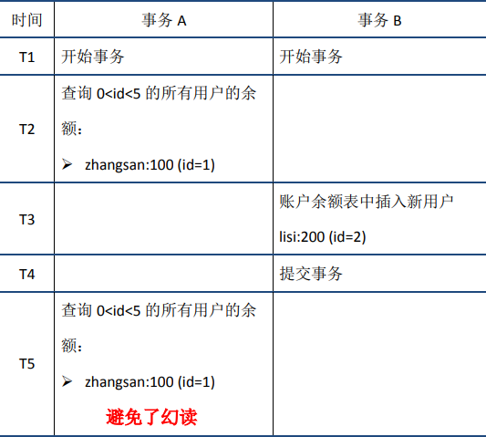

## mysql事务的基本概念
事务是MySQL等关系型数据库区别于NoSQL的重要方面，是保证数据一致性的重要手段。

事务（Transaction）是访问和更新数据库的程序执行单元，事务中可能包含一个或者多个SQL语句，这些语句要么执行，要么不执行。作为一个关系型数据库，MySQL支持事务。

### MySQL逻辑架构和存储引擎


从上图可以看出，MySQL服务器逻辑架构从上往下可以分为三层：
- 第一层：处理客户端连接，授权认证等；
- 第二层：服务器，负责查询语句的解析、优化、缓存以及内置函数的实现、存储过程等；
- 第三层：存储引擎，负责MySQL中数据的存储和提取，**MySQL中服务器不管理事务，事务是由存储引擎实现的**。MySQL支持事务的存储引擎有InnoDB、NDB Cluster等，其中InnoDB的使用最为广泛；其他存储引擎不支持事务，比如MyIsam，Memory等。

### 提交和回滚
典型的MySQL事务开启和提交操作如下。
```sql
-- 开启事务
start transaction
-- ...  # 一条或者多条SQL语句
-- 提交事务
commit
```
其中`start transaction`表示事务开始，`commit`提交事务，将执行结果写入到数据库，如果sql语句执行出现问题，会调用`rollback`，回滚所有已经执行成功的sql语句。当然，也可以在事务中直接使用`rollbak`语句进行回滚。
#### 自动提交
MySQL中默认采用的是自动提交(autocommit)模式：

```
mysql> show variables like 'autocommit';
+---------------+-------+
| Variable_name | Value |
+---------------+-------+
| autocommit    | ON    |
+---------------+-------+
```

在自动提交模式下， 如果没有`start transaction`显示地开启一个事务，那么每个sql语句都会被当做一个事务执行提交操作。
通过如下方式，可以关闭`autocommit`;需要注意的是，`autocommit`参数是针对连接的，在一个连接中修改了参数，不会对其他连接产生影响。


如果关闭了`autocommit`，则所有的sql语句都在一个事务中，知道执行了`commit`或者`rollback`，该事务结束，同时另一个事务开始了。

#### 特殊操作
在MySQL中，存在一些特殊的命令，如果在事务中执行了这些命令，会马上强制执行commit提交事务；如DDL语句(`create table/drop table/alter/table`)、`lock tables`语句等等。

不过，常用的`select`、`insert`、`update`和`delete`命令，都不会强制提交事务。

## 事务的ACID特性
ACID是衡量事务的四个特性：

### 原子性
一个事务（transaction）中的所有操作，要么全部完成，要么全部不完成，不会结束在中间某个环节。事务在执行过程中发生错误，会被回滚（Rollback）到事务开始前的状态，就像这个事务从来没有执行过一样。

#### 实现原理：undo log
在说明原子性原理之前，首先介绍一下MySQL的事务日志。MySQL的日志有很多种，如二进制日志、错误日志、查询日志、慢查询日志等，此外InnoDB存储引擎还提供了两种事务日志：`redo log`(重做日志)和`undo log`(回滚日志)。其中`redo log`用于保证事务持久性；`undo log`则是事务原子性和隔离性实现的基础。

下面说回滚日志`undo log`。实现原子性的关键，是当事务回滚时能够撤销所有已经成功执行的sql语句。InnoDB实现回滚，靠的是`undo log`：当事务对数据库进行修改时，InnoDB会生成对应的`undo log`；如果事务执行失败或调用了`rollback`，导致事务需要回滚，便可以利用`undo log`中的信息将数据回滚到修改之前的样子。

`undo log`属于逻辑日志，它记录的是sql执行相关的信息。当发生回滚时，InnoDB会根据`undo log`的内容做与之前相反的工作：对于每个`insert`，回滚时会执行`delete`；对于每个`delete`，回滚时会执行`insert`；对于每个`update`，回滚时会执行一个相反的`update`，把数据改回去。

以`update`操作为例：当事务执行`update`时，其生成的`undo log`中会包含被修改行的主键(以便知道修改了哪些行)、修改了哪些列、这些列在修改前后的值等信息，回滚时便可以使用这些信息将数据还原到`update`之前的状态。

### 持久性
持久性是指事务一旦提交，它对数据库的改变就应该是永久性的。接下来的其他操作或故障不应该对其有任何影响。

#### 实现原理：redo log
`redo log`和`undo lo`g都属于InnoDB的事务日志。下面先聊一下`redo log`存在的背景。

InnoDB作为MySQL的存储引擎，数据是存放在磁盘中的，但如果每次读写数据都需要磁盘IO，效率会很低。为此，InnoDB提供了缓存(`Buffer Pool`)，`Buffer Pool`中包含了磁盘中部分数据页的映射，作为访问数据库的缓冲：当从数据库读取数据时，会首先从`Buffer Pool`中读取，如果`Buffer Pool`中没有，则从磁盘读取后放入`Buffer Pool`；当向数据库写入数据时，会首先写入`Buffer Pool`，`Buffer Pool`中修改的数据会定期刷新到磁盘中（这一过程称为刷脏）。

`Buffer Pool`的使用大大提高了读写数据的效率，但是也带了新的问题：如果MySQL宕机，而此时`Buffer Pool`中修改的数据还没有刷新到磁盘，就会导致数据的丢失，事务的持久性无法保证。

于是，`redo log`被引入来解决这个问题：当数据修改时，除了修改`Buffer Pool`中的数据，还会在`redo log`记录这次操作；当事务提交时，会调用fsync接口对`redo log`进行刷盘。如果MySQL宕机，重启时可以读取`redo log`中的数据，对数据库进行恢复。`redo log`采用的是WAL（Write-ahead logging，预写式日志），所有修改先写入日志，再更新到`Buffer Pool`，保证了数据不会因MySQL宕机而丢失，从而满足了持久性要求。

既然`redo log`也需要在事务提交时将日志写入磁盘，为什么它比直接将`Buffer Pool`中修改的数据写入磁盘(即刷脏)要快呢？主要有以下两方面的原因：

（1）刷脏是随机IO，因为每次修改的数据位置随机，但写redo log是追加操作，属于顺序IO。

（2）刷脏是以数据页（Page）为单位的，MySQL默认页大小是16KB，一个Page上一个小修改都要整页写入；而`redo log`中只包含真正需要写入的部分，无效IO大大减少。

 #### redo log与binlog
 我们知道，在MySQL中还存在`binlog`(二进制日志)也可以记录写操作并用于数据的恢复，但二者是有着根本的不同的：

（1）作用不同：`redo log`是用于`crash recovery`的，保证MySQL宕机也不会影响持久性；`binlog`是用于`point-in-time recovery`的，保证服务器可以基于时间点恢复数据，此外`binlog`还用于主从复制。

（2）层次不同：`redo log`是InnoDB存储引擎实现的，而binlog是MySQL的服务器层(可以参考文章前面对MySQL逻辑架构的介绍)实现的，同时支持InnoDB和其他存储引擎。

（3）内容不同：`redo log`是物理日志，内容基于磁盘的`Page；binlog`的内容是二进制的，根据`binlog_format`参数的不同，可能基于sql语句、基于数据本身或者二者的混合。

（4）写入时机不同：`binlog`在事务提交时写入；`redo log`的写入时机相对多元：

前面曾提到：当事务提交时会调用fsync对`redo log`进行刷盘；这是默认情况下的策略，修改`innodb_flush_log_at_trx_commit`参数可以改变该策略，但事务的持久性将无法保证。

除了事务提交时，还有其他刷盘时机：如`master thread`每秒刷盘一次`redo log`等，这样的好处是不一定要等到`commit`时刷盘，`commit`速度大大加快。

### 隔离性
数据库允许多个并发事务同时对其数据进行读写和修改的能力，隔离性可以防止多个事务并发执行时由于交叉执行而导致数据的不一致。事务隔离分为不同级别，包括读未提交（Read uncommitted）、读提交（read committed）、可重复读（repeatable read）和串行化（Serializable）。

**事务的隔离级别**



在实际应用中，**读未提交**在并发时会导致很多问题，而性能相对于其他隔离级别提高却很有限，因此使用较少。**可串行化**强制事务串行，并发效率很低，只有当对数据一致性要求极高且可以接受没有并发时使用，因此使用也较少。因此在大多数数据库系统中，默认的隔离级别是**读已提交**(如Oracle)或**可重复读**（后文简称**RR**）。

可以通过如下命令分别查看全局隔离级别和本次会话的隔离级别：


InnoDB默认的隔离级别是RR(可重复读)。需要注意的是，在SQL标准中，RR是无法避免幻读问题的，但是InnoDB实现的RR避免了幻读问题。

> MySql 8.0 以前用的是：tx_isolation  之后的版本用是： transaction_isolation


隔离性追求的是并发情形下事务之间互不干扰。简单起见，我们主要考虑最简单的读操作和写操作(加锁读等特殊读操作会特殊说明)，那么隔离性的探讨，主要可以分为两个方面：

- (**一个事务**)写操作对(**另一个事务**)写操作的影响：锁机制保证隔离性
- (**一个事务**)写操作对(**另一个事务**)读操作的影响：MVCC保证隔离性

#### 锁机制
首先来看两个事务的写操作之间的相互影响。隔离性要求同一时刻只能有一个事务对数据进行写操作，InnoDB通过锁机制来保证这一点。

锁机制的基本原理可以概括为：事务在修改数据之前，需要先获得相应的锁；获得锁之后，事务便可以修改数据；该事务操作期间，这部分数据是锁定的，其他事务如果需要修改数据，需要等待当前事务提交或回滚后释放锁。

**行锁与表锁**

按照粒度，锁可以分为表锁、行锁以及其他位于二者之间的锁。        
表锁在操作数据时会锁定整张表，并发性能较差；           
行锁则只锁定需要操作的数据，并发性能好。        
但是由于加锁本身需要消耗资源(获得锁、检查锁、释放锁等都需要消耗资源)，因此在锁定数据较多情况下使用表锁可以节省大量资源。MySQL中不同的存储引擎支持的锁是不一样的，例如MyIsam只支持表锁，而InnoDB同时支持表锁和行锁，且出于性能考虑，绝大多数情况下使用的都是行锁。

**如何查看锁信息**

有多种方法可以查看InnoDB中锁的情况，例如：
```sql
select * from information_schema.innodb_locks; #锁的概况
-- MySql 8.0 后版本：
select * from performance_schema.data_locks;

show engine innodb status; #InnoDB整体状态，其中包括锁的情况
```
#### 脏读、不可重复读和幻读

首先来看并发情况下，读操作可能存在的三类问题：

1. 脏读 ：脏读就是指当一个事务正在访问数据，并且对数据进行了修改，而这种修改还没有提交到数据库中，这时，另外一个事务也访问这个数据，然后使用了这个数据。

        eg：
        1.Mary的原工资为1000, 财务人员将Mary的工资改为了8000(但未提交事务)
        2.Mary读取自己的工资 ,发现自己的工资变为了8000，欢天喜地！
        3.而财务发现操作有误，回滚了事务,Mary的工资又变为了1000
          像这样,Mary记取的工资数8000是一个脏数据。

 

2. 不可重复读 ：是指在一个事务内，多次读同一数据。在这个事务还没有结束时，另外一个事务也访问该同一数据。那么，在第一个事务中的两次读数据之间，由于第二个事务的修改，那么第一个事务两次读到的的数据可能是不一样的。这样在一个事务内两次读到的数据是不一样的，因此称为是不可重复读。
    e.g.
    1.在事务1中，Mary 读取了自己的工资为1000,操作并没有完成
    2.在事务2中，这时财务人员修改了Mary的工资为2000,并提交了事务.
    3.在事务1中，Mary 再次读取自己的工资时，工资变为了2000

 解决办法：如果只有在修改事务完全提交之后才可以读取数据，则可以避免该问题。

3. 幻读 : 是指当事务不是独立执行时发生的一种现象，例如第一个事务对一个表中的数据进行了修改，这种修改涉及到表中的全部数据行。同时，第二个事务也修改这个表中的数据，这种修改是向表中插入一行新数据。那么，以后就会发生操作第一个事务的用户发现表中还有没有修改的数据行，就好象发生了幻觉一样。
   e.g.
   目前工资为1000的员工有10人。
   1.事务1,读取所有工资为1000的员工。
   2.这时事务2向employee表插入了一条员工记录，工资也为1000
   3.事务1再次读取所有工资为1000的员工 共读取到了11条记录，
 
 解决办法：如果在操作事务完成数据处理之前，任何其他事务都不可以添加新数据，则可避免该问题

>不可重复读的重点是修改 :       
> 同样的条件, 你读取过的数据,再次读取出来发现值不一样了
>
>幻读的重点在于新增或者删除     
> 同样的条件, 第 1 次和第 2 次读出来的记录数不一样

#### MVCC
可重复读(RR)解决了脏读、不可重复读、幻读等问题，使用的是MVCC：MVCC全称`Multi-Version Concurrency Control`，即多版本的并发控制协议。

下面通过一个例子来理解 MVCC：   
在同一时刻，不同的事务读取到的数据可能是不同的(即多版本)——在T5时刻，事务A和事务C可以读取到不同版本的数据。



MVCC最大的优点是读不加锁，因此读写不冲突，并发性能好。InnoDB实现 MVCC，多个版本的数据可以共存，主要基于以下技术及数据结构：
- 1）隐藏列：InnoDB中每行数据都有隐藏列，隐藏列中包含了本行数据的事务id、指向`undo log`的指针等。

- 2）基于`undo log`的版本链：前面说到每行数据的隐藏列中包含了指向`undo log`的指针，而每条`undo log`也会指向更早版本的`undo log`，从而形成一条版本链。

- 3）ReadView：通过隐藏列和版本链，MySQL可以将数据恢复到指定版本；但是具体要恢复到哪个版本，则需要根据ReadView来确定。所谓ReadView，是指事务（记做事务A）在某一时刻给整个事务系统（trx_sys）打快照，之后再进行读操作时，会将读取到的数据中的事务id与trx_sys快照比较，从而判断数据对该ReadView是否可见，即对事务A是否可见。

**trx_sys**中的主要内容，以及判断是否可见的方法如下：

  - `low_limit_id`：表示生成ReadView时系统中应该分配给下一个事务的id。如果数据的事务`id` **大于** 等于`low_limit_id`，则对该ReadView**不可见**。
- `up_limit_id`：表示生成ReadView时当前系统中活跃的读写事务中最小的事务id。如果数据的事务`id` **小于** `up_limit_id`，则对该ReadView**可见**。
- `rw_trx_ids`：表示生成ReadView时当前系统中活跃的读写事务的事务`id`列表。如果数据的事务id在`low_limit_id`和`up_limit_id`之间，则需要判断事务`id`是否在`rw_trx_ids`中:    
如果在，说明生成ReadView时事务仍在活跃中，因此数据对ReadView不可见；    
如果不在，说明生成ReadView时事务已经提交了，因此数据对ReadView可见。

下面以可重复度（RR)为例，分析前面提到几个问题：

- 脏读



当事务A在T3时刻读取zhangsan的余额前，会生成ReadView，由于此时事务B没有提交仍然活跃，因此其事务id一定在ReadView的`rw_trx_ids`中，因此根据前面介绍的规则，事务B的修改对ReadView不可见。接下来，事务A根据指针指向的`undo log`查询上一版本的数据，得到zhangsan的余额为100。这样事务A就避免了脏读。

- 不可重复读



当事务A在T2时刻读取zhangsan的余额前，会生成ReadView。此时事务B分两种情况讨论，一种是如图中所示，事务已经开始但没有提交，此时其事务id在ReadView的rw_trx_ids中；一种是事务B还没有开始，此时其事务id大于等于ReadView的low_limit_id。无论是哪种情况，根据前面介绍的规则，事务B的修改对ReadView都不可见。

当事务A在T5时刻再次读取zhangsan的余额时，会根据T2时刻生成的ReadView对数据的可见性进行判断，从而判断出事务B的修改不可见；因此事务A根据指针指向的`undo log`查询上一版本的数据，得到zhangsan的余额为100，从而避免了不可重复读。

- 幻读



MVCC避免幻读的机制与避免不可重复读非常类似。

当事务A在T2时刻读取`0<id<5`的用户余额前，会生成ReadView。此时事务B分两种情况讨论，一种是如图中所示，事务已经开始但没有提交，此时其事务id在ReadView的`rw_trx_ids`中；一种是事务B还没有开始，此时其事务id大于等于ReadView的`low_limit_id`。无论是哪种情况，根据前面介绍的规则，事务B的修改对ReadView都不可见。

当事务A在T5时刻再次读取`0<id<5`的用户余额时，会根据T2时刻生成的ReadView对数据的可见性进行判断，从而判断出事务B的修改不可见。因此对于新插入的数据`lisi(id=2)`，事务A根据其指针指向的`undo log`查询上一版本的数据，发现该数据并不存在，从而避免了幻读。

#### 补充

- （1）读已提交（RC）隔离级别下的非加锁读

RC与RR一样，都使用了MVCC，其主要区别在于：

RR是在事务开始后第一次执行select前创建ReadView，直到事务提交都不会再创建。根据前面的介绍，RR可以避免脏读、不可重复读和幻读。

RC每次执行select前都会重新建立一个新的ReadView，因此如果事务A第一次select之后，事务B对数据进行了修改并提交，那么事务A第二次select时会重新建立新的ReadView，因此事务B的修改对事务A是可见的。因此RC隔离级别可以避免脏读，但是无法避免不可重复读和幻读。

- （2）加锁读与next-key lock

按照是否加锁，MySQL的读可以分为两种：

一种是非加锁读，也称作快照读、一致性读，使用普通的select语句，这种情况下使用MVCC避免了脏读、不可重复读、幻读，保证了隔离性。

另一种是加锁读，查询语句有所不同，如下所示：
```
#共享锁读取
select...lock in share mode
#排它锁读取
select...for update
```
加锁读在查询时会对查询的数据加锁（共享锁或排它锁）。由于锁的特性，当某事务对数据进行加锁读后，其他事务无法对数据进行写操作，因此可以避免脏读和不可重复读。而避免幻读，则需要通过`next-key lock`。**next-key lock是行锁的一种，实现相当于record lock(记录锁) + gap lock(间隙锁)；其特点是不仅会锁住记录本身(record lock的功能)，还会锁定一个范围(gap lock的功能)**。因此，加锁读同样可以避免脏读、不可重复读和幻读，保证隔离性。

### 一致性

一致性是指事务执行结束后，数据库的完整性约束没有被破坏，事务执行的前后都是合法的数据状态。数据库的完整性约束包括但不限于：实体完整性（如行的主键存在且唯一）、列完整性（如字段的类型、大小、长度要符合要求）、外键约束、用户自定义完整性（如转账前后，两个账户余额的和应该不变）。

#### 实现

一致性是事务追求的最终目标：前面提到的原子性、持久性和隔离性，都是为了保证数据库状态的一致性。此外，除了数据库层面的保障，一致性的实现也需要应用层面进行保障。

**实现一致性的措施包括：**

- 保证原子性、持久性和隔离性，如果这些特性无法保证，事务的一致性也无法保证
- 数据库本身提供保障，例如不允许向整形列插入字符串值、字符串长度不能超过列的限制等
- 应用层面进行保障，例如如果转账操作只扣除转账者的余额，而没有增加接收者的余额，无论数据库实现的多么完美，也无法保证状态的一致

## 总结
下面总结一下ACID特性及其实现原理：

- 原子性：语句要么全执行，要么全不执行，是事务最核心的特性，事务本身就是以原子性来定义的；实现主要基于`undo log`
- 持久性：保证事务提交后不会因为宕机等原因导致数据丢失；实现主要基于`redo log`
- 隔离性：保证事务执行尽可能不受其他事务影响；InnoDB默认的隔离级别是RR，RR的实现主要基于锁机制（包含next-key lock）、MVCC（包括数据的隐藏列、基于`undo log`的版本链、ReadView）
- 一致性：事务追求的最终目标，一致性的实现既需要数据库层面的保障，也需要应用层面的保障

> [参考这里](https://www.cnblogs.com/kismetv/p/10331633.html)