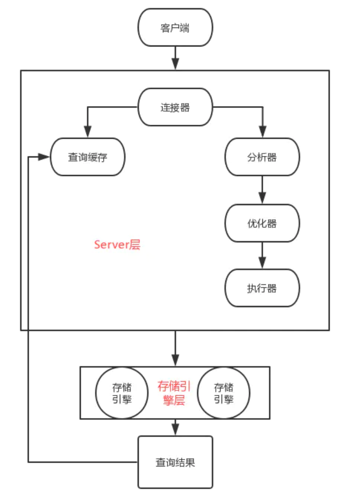
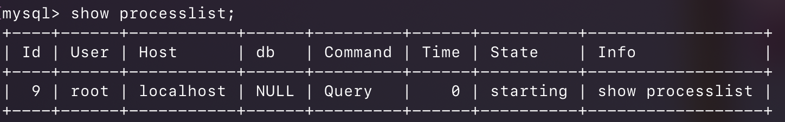

## MySQL的基本架构与SQL执行过程

**示意图：**



根据上图可以看出，MySQL可以分为 **Server层** 和 **存储引擎层** 两部分。     
Server层，也就是从连接器到执行器的部分。可以看到Server层包括连接器、查询缓存、分析器、优化器、执行器等，涵盖MySQL的大多数核心服务功能，以及所有的内置函数（如日期、时间、数学和加密函数等），所有跨存储引擎的功能都在这一层实现，比如触发器、视图等。

存储引擎层负责数据的存储和提取。其架构模式是插件式的，支持InnoDB、MyISAM、Memory等多个存储引擎。现在最常用的存储引擎是InnoDB，它从MySQL 5.5.5版本开始成为了默认存储引擎。这也说明了你create table建表的时候，如果不指定引擎类型，默认使用的就是InnoDB。当然你也可以指定存储引擎，例如`create table`语句中使用`engine=memory`, 来指定使用内存引擎创建表。

### 连接器
连接器主要和身份认证和权限相关的功能相关，就好比一个级别很高的门卫一样。                
主要负责用户登录数据库，进行用户的身份认证，包括校验账户密码，权限等操作，如果用户账户密码已通过，连接器会到权限表中查询该用户的所有权限，之后在这个连接器的权限逻辑判断都是会依赖此时读取到的权限数据，也就是说，后续只要这个连接不断开，即使管理员修改了该用户的权限，该用户也是不受影响的。

当我们要执行一条SQL语句，比如：`select * from Table where ID=1；`，这个时候首先是连接器帮我们和客户端建立连接，获取权限、位置和管理连接。连接命令为：`mysql -h$ip -P$port -u$user -p`。

接下来是进行TCP握手，Server层连接器就要开始认证你的身份，这个时候是服务器端代码使用的用户名和密码。     
**注意：**      
- 虽然密码也可以直接跟在`-p`后面写在命令行中，但这样可能会导致你的密码泄露。如果你连的是生产服务器，一定不能这么做。
- 连接时：如果用户名或密码不对，服务器端会收到“Access denied for user”的错误，客户端报错无法使用。

如果用户名密码认证通过，连接器会到权限表里面查出你拥有的权限。之后，这个连接里面的权限判断逻辑，都将依赖于此时读到的权限。这就意味着，一个用户成功建立连接后，即使你用管理员账号对这个用户的权限做了修改，也不会影响已经存在连接的权限。修改完成后，只有再新建的连接才会使用新的权限设置。

连接完成后，如果一直没有对数据库有操作，则本次连接将处于空闲。`show processlist`可以查看所有的连接，其中Command列表示的是连接状态中Command列如果为“Sleep”则表示是一个空闲连接。



客户端如果太长时间没动静，连接器就会自动将它断开。这个时间是由参数 `wait_timeout` 控制的，默认值是 8 小时。
如果在连接被断开之后，客户端再次发送请求的话，就会收到一个错误提醒： `Lost connection to MySQL server during query`。这时候如果你要继续，就需要重连，然后再执行请求了。         
数据库里面，长连接是指连接成功后，如果客户端持续有请求，则一直使用同一个连接。短连接则是指每次执行完很少的几次查询就断开连接，下次查询再重新建立一个。          
建立连接的过程通常是比较复杂的，所以我建议你在使用中要尽量减少建立连接的动作，也就是尽量使用长连接。

但是你会发现全部使用长连接后，有些时候MySql占用的内存会飙涨的很快。这是由于MySql在执行的过程中临时使用的内存是管理在连接对象里面的。这些资源会在连接断开的时候才释放。所以如果长连接累积下来，可能导致内存占用太大，被系统强行杀掉（OOM），从现象看就是MySql异常重启了。

**有两种方案可以解决这种问题：**

- 1.定期断开长连接。使用一段时间，或者程序里面判断执行过一个占用内存的大查询后，断开连接，之后要查询再重连。
- 2.如果你使用的版本是`mysql 5.7`以后的版本，可以在执行一个较大的操作后，通过执行`mysql_reset_connection`来重新初始化连接资源。这个过程不需要重连和重新做权限验证，但是会将连接恢复到刚刚创建完时的状态。

### 查询缓存
> <查询缓存(MySQL 8.0 版本后移除)>

查询缓存主要用来缓存我们所执行的 `SELECT` 语句以及该语句的结果集。

连接建立后，执行查询语句的时候，会先查询缓存，MySQL 会先校验这个 `sql` 是否执行过，以 `Key-Value` 的形式缓存在内存中，`key`就是sql语句了，`value` 就是之前的执行结果。如果缓存 `key` 被命中，就会直接返回给客户端，如果没有命中，就会执行后续的操作，完成后也会把结果缓存起来，当下次调用的时候就可以直接返回结果，执行效率就会很高。当然在真正执行缓存查询的时候还是会校验用户的权限，是否有该表的查询条件。

**大多数情况下并不建议使用查询缓存。查询缓存往往弊大于利。**

查询缓存的失效非常频繁，只要有对某个表的更新，该表的所有查询缓存都会被清空。所以很可能你费劲把结果存起来，还没有使用，就被一个更新全部清空了，尤其是对于更新压力大的数据库来说，查询缓存的命中率很低。但是也不是不能使用，假如一张静态表（系统配置表），很长时间更新一次，这种情况就比较适合使用查询缓存。

**那么如何设置Mysql不使用查询缓存？**

将Mysql参数`query_cache_type`设置成`DEMAND`，这样默认的SQL语句都不使用查询缓存。（当然这一设置只是Mysql 8.0版本之前有效，因为8.0版本后已经移除了查询缓存）

### 分析器
分析器主要是用来分析 SQL 语句是来干嘛的。

MySQL 没有命中缓存，那么就会进入分析器，分析器也会分为几步：

- 第一步，词法分析，一条 SQL 语句有多个字符串组成，首先要提取关键字，比如 `select`，提出查询的表，提出字段名，提出查询条件等等。做完这些操作后，就会进入第二步。
- 第二步，语法分析，主要就是判断你输入的 `sql` 是否正确，是否符合 `MySQL` 的语法。如果语法不对，会收到 `You have an error in your SQL syntax` 的错误提醒。

### 优化器

优化器的作用就是它认为的最优的执行方案去执行（有时候可能也不是最优），比如多个索引的时候该如何选择索引，多表查询的时候如何选择关联顺序等。

经过了分析器后，在执行之前，还需要经过优化器的处理，因为优化器是在表里面有多个索引的时候，决定使用哪个索引；或者在一个语句有多表关联（`join`）的时候，决定各个表的连接顺序。比如你执行下面这样的语句，这个语句是执行两个表的join：
```sql
mysql> select * from Table1 join Table2 using(ID)  where Table1.A=1 and Table2.B=2;
```
这条语句既可以先从表 `Table1` 里面取出`A=1`的记录的`ID`值，再根据`ID`值关联到表`Table2`，再判断`Table2`里面`B`的值是否等于2。也可以先从表`Table2`里面取出`B=2`的记录的`ID`值，再根据`ID`值关联到`Table1`，再判断`Table1`里面A的值是否等于1。虽然最终执行的结果是一样的，但是执行效率却有很大的不同。优化器就是决定选择使用哪一个方案。

### 执行器
当选择了执行方案后，MySQL 就准备开始执行了，首先执行前会校验该用户有没有权限，如果没有权限，就会返回错误信息，如果有权限，就会去调用引擎的接口，返回接口执行的结果。(在工程实现上，如果命中查询缓存，会在查询缓存返回结果的时候，做权限验证。查询也会在优化器之前调用 `precheck` 验证权限)。

至此，这个语句就执行完成了。

> 关于日志模块 后续学习到了再补充


> 以上内容均参考了网上的很多博客和书籍，并结合自己理解总结.
> [](https://www.cnblogs.com/huangjuncong/p/11318810.html)
> [](https://juejin.im/post/6844903858087395335)

