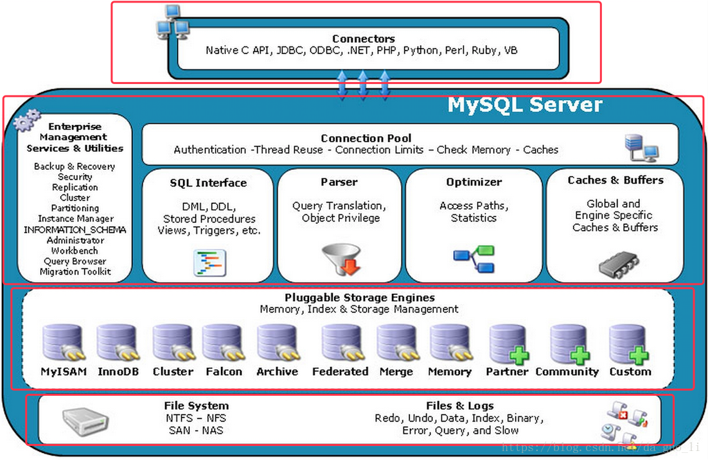
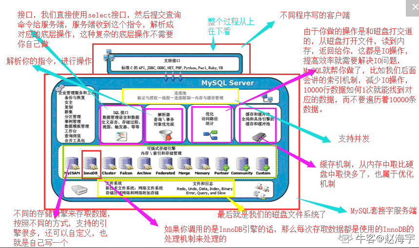

## 存储引擎的一些解释
首先确定一点，MySQL里面才有存储引擎这个概念，并不是所有的关系型数据库都有存储引擎的。

MySQL支持多种存储引擎，每种引擎有着一些自己独特的功能，用户在使用的时候，可以根据自己的业务场景来使用不同的存储引擎，其中MySQL最常用的存储引擎为：MyISAM和InnoDB。 下面我们先来看看MySQL的整个工作流程，看一下存储引擎在哪里，MySQL都做了哪些事情。

图片来源: https://blog.nowcoder.net/n/29dd1111aba247c896576fcf8e146ac3

