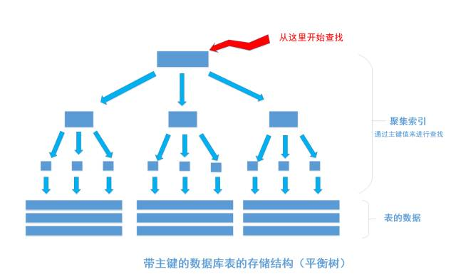
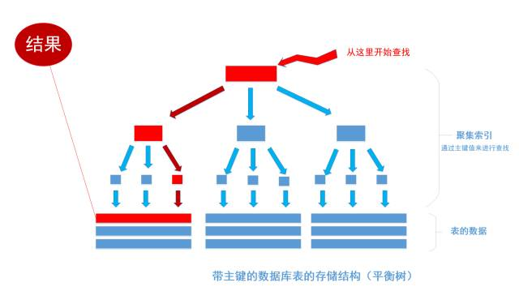

## 索引的概念
索引能快速找出在某一列中有一特定值的行。不使用索引，mysql必须从第一条记录开始查找，直到找到相关的行。如果表中查询的列有一个索引，mysql能快速到达某个位置去搜索数据文件，而不必查看所有数据。索引是对数据库中一列或多列的值进行排序的一种结构。

## 索引的创建和删除

### 索引的类型

- unique：唯一索引，不允许出现相同的值，允许为 NULL
- index：普通索引，允许出现相同值
- primary key：主键索引，不允许出现相同值
- fulltext index：全文索引，可针对值中的某个单词建立索引，但效率很低
- 组合索引：又称复合索引，将多个字段建立到一个索引里，列值的组合必须唯一

> 《阿里巴巴 Java 开发手册》中的 SQL 规范约定，唯一索引建议命名为 uk_字段名，普通索引命名为 idx_字段名

### 创建索引
- 使用alter table语句在存在的表上创建和删除索引
```
// 创建索引
alter table table_name add index(column_name);
// 删除索引
alter table table_name drop index index_name;
```
创建索引示例：
```
// 普通索引
ALTER TABLE users ADD INDEX idx_name (name);
// 唯一索引
ALTER TABLE users ADD UNIQUE uk_name (name);
// 主键索引
ALTER TABLE users ADD PRIMARY KEY (name);
```
- 使用create index语句在已存在的表上创建和删除索引
```
// 创建索引
create index index_name on table_name(column_name);
// 删除索引
drop index index_name on table_name;(内部被映射成alter table语句)
```

## 索引的一些基础知识
（1）索引可以加快数据库的检索速度。     
（2）索引会降低插入，删除，修改的速度。     
（3）索引需要占用物理和数据空间。       
（4）索引的最左匹配原则。       
（5）索引的分类：聚集索引和非聚集索引。     
（6）MySQL支持Hash索引和B+树索引。      

## 索引的原理
一般的数据库都是把**平衡树**当做数据表默认的索引数据结构，也就是`b tree`或者 `b+ tree`。重要的事情说三遍：“平衡树，平衡树，平衡树”。当然， 有的数据库也使用哈希桶作用索引的数据结构。
在我们建表的时候通常会为表加上主键，在一些关系型数据库中，如果不加主键会拒绝建表语句的执行，如果给表上了主键，那么表在磁盘上的存储结构就由整齐排列的结构转变成了树状结构，也就是上面说的「平衡树」结构，换句话说，就是整个表就变成了一个索引。没错， 整个表变成了一个索引，也就是所谓的 **聚集索引**。 这就是为什么一个表只能有一个主键， 一个表只能有一个**聚集索引**，因为主键的作用就是把「表」的数据格式转换成「索引（平衡树）」的格式放置。



上图就是带有主键的表（聚集索引）的结构图,其中树的所有结点（底部除外）的数据都是由主键字段中的数据构成，也就是通常我们指定主键的id字段。最下面部分是真正表中的数据。 假如我们执行一个SQL语句：
```
select * from table where id = 1256;
```

首先根据索引定位到1256这个值所在的叶子结点，然后再通过叶子结点取到id等于1256的数据行。 *这里不讲解平衡树的运行细节*， 但是从上图能看出，树一共有三层， 从根节点至叶节点只需要经过三次查找就能得到结果。如下图



假如一张表有一亿条数据 ，需要查找其中某一条数据，按照常规逻辑， 一条一条的去匹配的话， 最坏的情况下需要匹配一亿次才能得到结果，用大O标记法就是O(n)最坏时间复杂度，这是无法接受的，而且这一亿条数据显然不能一次性读入内存供程序使用， 因此， 这一亿次匹配在不经缓存优化的情况下就是一亿次IO开销，以现在磁盘的IO能力和CPU的运算能力， 有可能需要几个月才能得出结果 。如果把这张表转换成平衡树结构（一棵非常茂盛和节点非常多的树），假设这棵树有10层，那么只需要10次IO开销就能查找到所需要的数据， 速度以指数级别提升，用大O标记法就是`O(log n)`，n是记录总树，底数是树的分叉数，结果就是树的层次数。换言之，查找次数是以树的分叉数为底，记录总数的对数，用公式来表示就是：


用程序来表示就是`Math.Log(100000000,10)`，`100000000`是记录数，`10`是树的分叉数（真实环境下分叉数远不止10）， 结果就是查找次数，这里的结果从亿降到了个位数。因此，利用索引会使数据库查询有惊人的性能提升。


