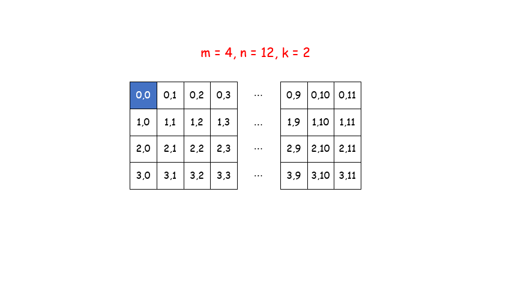
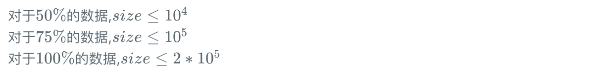

## 1.JZ50-数组中的重复数字
[题目来源](https://www.nowcoder.com/practice/623a5ac0ea5b4e5f95552655361ae0a8?tpId=13&tqId=11203&rp=1&ru=%2Fta%2Fcoding-interviews&qru=%2Fta%2Fcoding-interviews%2Fquestion-ranking&tab=answerKey)

题目描述
在一个长度为n的数组里的所有数字都在`0`到`n-1`的范围内。 数组中某些数字是重复的，但不知道有几个数字是重复的。也不知道每个数字重复几次。请找出数组中第一个重复的数字。 例如，如果输入长度为7的数组`{2,3,1,0,2,5,3}`，那么对应的输出是第一个重复的数字`2`。

返回描述：

如果数组中有重复的数字，函数返回`true`，否则返回`false`。

如果数组中有重复的数字，把重复的数字放到参数`duplication[0]`中。（`ps`:`duplication`已经初始化，可以直接赋值使用。）

**思路**:

> 搞清楚`nums[i]`和`nums[nums[i]]`，循环交换，确保数组下标0的元素是0，下标1的元素是1，找到不相等的就停下来

还可以把当前序列当成是一个下标和下标对应值是相同的数组（时间复杂度为`O(n)`,空间复杂度为`O(1)）`； 遍历数组，判断当前位的值和下标是否相等：

- 若相等，则遍历下一位；
- 若不等，则将当前位置i上的元素和`a[i]`位置上的元素比较：若它们相等，则找到了第一个相同的元素；若不等，则将它们两交换。换完之后`a[i]`位置上的值和它的下标是对应的，但i位置上的元素和下标并不一定对应；重复`2`的操作，直到当前位置i的值也为`i`，将`i`向后移一位，再重复`2`。


举例说明：`{2,3,1,0,2,5,3}`

- `0`(索引值)和`2`(索引值位置的元素)不相等，并且`2`(索引值位置的元素)和`1`(以该索引值位置的元素2为索引值的位置的元素)不相等，则交换位置，数组变为：`{1,3,2,0,2,5,3}`；
- `0`(索引值)和`1`(索引值位置的元素)仍然不相等，并且`1`(索引值位置的元素)和3(以该索引值位置的元素1为索引值的位置的元素)不相等，则交换位置，数组变为：`{3,1,2,0,2,5,3}`；
- `0`(索引值)和`3`(索引值位置的元素)仍然不相等，并且`3`(索引值位置的元素)和0(以该索引值位置的元素3为索引值的位置的元素)不相等，则交换位置，数组变为：`{0,1,2,3,2,5,3}`；
- `0`(索引值)和`0`(索引值位置的元素)相等，遍历下一个元素；
- `1`(索引值)和`1`(索引值位置的元素)相等，遍历下一个元素；
- `2`(索引值)和`2`(索引值位置的元素)相等，遍历下一个元素；
- `3`(索引值)和`3`(索引值位置的元素)相等，遍历下一个元素；
- `4`(索引值)和`2`(索引值位置的元素)不相等，但是2(索引值位置的元素)和2(以该索引值位置的元素2为索引值的位置的元素)相等，则找到了第一个重复的元素。

```cpp
class Solution {
public:
    // Parameters:
    //        numbers:     an array of integers
    //        length:      the length of array numbers
    //        duplication: (Output) the duplicated number in the array number
    // Return value:       true if the input is valid, and there are some duplications in the array number
    //                     otherwise false
    bool duplicate(int numbers[], int length, int* duplication) {
        if(numbers == NULL || length < 2) {
            return false;
        }
        for(int i=0;i<length;++i){
            if(numbers[i] == i){
                continue;
            }
            else if(numbers[i] != numbers[numbers[i]]) {
                swap(numbers[i],numbers[numbers[i]]);
            }
            else {
                *duplication = numbers[i];
                return true;
            }
        }
        return false;
    }
};

```
对应 [leetcode题](https://leetcode-cn.com/problems/find-the-duplicate-number/submissions/)

给定一个包含 n + 1 个整数的数组 nums ，其数字都在 1 到 n 之间（包括 1 和 n），可知至少存在一个重复的整数。

假设 nums 只有 一个重复的整数 ，找出 这个重复的数 。

解法一：

```cpp
class Solution {
public:
    int findDuplicate(vector<int>& nums) {
        int len = nums.size() - 1;
        sort(nums.begin(),nums.end());
        //排序之后再从两边查找
        int left = 0,right = len;
        while(left < right) {
            if(nums[left] == nums[right]) {
                return nums[left];
            }
            else if(nums[left] == nums[left + 1]) {
                return nums[left];
            }else if(nums[right] == nums[right - 1]) {
                return nums[right];
            }
            ++left;
            --right;
        }
        return 0;
    }
};

```

解法二：

```cpp
class Solution {
public:
    int findDuplicate(vector<int>& nums) {
        if(nums.size() < 2) {
            return -1;
        }
        for(int i = 0; i < nums.size();i++){
            if(nums[i]==i){
                 continue;
            }else if(nums[nums[i]] != nums[i]){
                swap(nums[nums[i]], nums[i]);
                --i;  //索引值不能变
            }else{
                return nums[i];
            }
        }
        return 0;
    }
};
```

## 2.JZ2-二维数组中的查找

[题目来源](https://www.nowcoder.com/practice/abc3fe2ce8e146608e868a70efebf62e?tpId=13&tqId=11154&rp=1&ru=%2Fta%2Fcoding-interviews&qru=%2Fta%2Fcoding-interviews%2Fquestion-ranking&tab=answerKey)

题目描述

在一个二维数组中（每个一维数组的长度相同），每一行都按照从左到右递增的顺序排序，每一列都按照从上到下递增的顺序排序。请完成一个函数，输入这样的一个二维数组和一个整数，判断数组中是否含有该整数。

示例
```
输入
7,[[1,2,8,9],[2,4,9,12],[4,7,10,13],[6,8,11,15]]

返回值
true
```

思路：找到左下角的位置，行减列增

```cpp
class Solution {
public:
    bool Find(int target, vector<vector<int> > array) {
        int ln = array[0].size()-1; //总共有多少列
        int rn = array.size() - 1;    //总共有多少行
        int line = 0;  //列
        int row = rn;  //行
        while(line <= ln && row >= 0) {
            if(target > array[row][line]){
                ++line;
            }
            else if(target < array[row][line]){
                -- row;
            }
            else{
                return true;
            }
        }
        return false;
    }
};
```

## 3.JZ6-旋转数组的最小数字

[题目来源](https://www.nowcoder.com/practice/9f3231a991af4f55b95579b44b7a01ba?tpId=13&tqId=11159&rp=1&ru=%2Fta%2Fcoding-interviews&qru=%2Fta%2Fcoding-interviews%2Fquestion-ranking&tab=answerKey)

题目描述

把一个数组最开始(有序的)的若干个元素搬到数组的末尾，我们称之为数组的旋转。
输入一个非递减排序的数组的一个旋转，输出旋转数组的最小元素。
NOTE：给出的所有元素都大于0，若数组大小为0，请返回0。

示例
```
输入：
[3,4,5,1,2]
返回值：
1
```
思路：使用二分查找

时间复杂度：二分，所以为`O(logN)`， 但是如果是`[1, 1, 1, 1]`,会退化到`O(n)`

空间复杂度：没有开辟额外空间，为`O(1)`

```cpp
class Solution {
public:
    int minNumberInRotateArray(vector<int> rotateArray) {
        if(rotateArray.size() == 0) {
            return 0;
        }
        int left = 0;
        int right = rotateArray.size() - 1;
        int mid = 0;
        while(left < right) {
            mid = (left + right)/2;
            if(rotateArray[mid] >= rotateArray[right]){
                left = mid + 1;
            }
            else {
                right = mid;
            }
        }
        return rotateArray[right];
    }
};
```

## 4.JZ65-矩阵中的路径

[题目来源](https://leetcode-cn.com/problems/ju-zhen-zhong-de-lu-jing-lcof)

```
请设计一个函数，用来判断在一个矩阵中是否存在一条包含某字符串所有字符的路径。路径可以从矩阵中的任意一格开始，每一步可以在矩阵中向左、右、上、下移动一格。如果一条路径经过了矩阵的某一格，那么该路径不能再次进入该格子。例如，在下面的3×4的矩阵中包含一条字符串“bfce”的路径（路径中的字母用加粗标出）。

[["a","b","c","e"],
["s","f","c","s"],
["a","d","e","e"]]

但矩阵中不包含字符串“abfb”的路径，因为字符串的第一个字符b占据了矩阵中的第一行第二个格子之后，路径不能再次进入这个格子。

```
示例：

```
示例 1：

输入：board = [["A","B","C","E"],["S","F","C","S"],["A","D","E","E"]], word = "ABCCED"
输出：true
```

思路：使用`dfs`+回溯，从四个方向查找，`i+1,i-1,j+1,j-1`。在进行`dfs`时，如果数组越界，或者没找到就返回`false`。

```cpp
class Solution {
public:
    bool exist(vector<vector<char>>& board, string word) {
        if(word.size() == 0) {
            return false;
        }
        for(int i=0;i<board.size();++i) {
            for(int j=0;j<board[0].size();++j) {
                //使用回溯法解题
                // 0表示字符串的第一个元素
                if(dfs(board,word,i,j,0)) return true;
            }
        }
        return false;
    }
    bool dfs(vector<vector<char>>& board, string & word,int i,int j,int w) {
        //如果数组越界，或者没找到就返回false
        if(i<0 || i>=board.size() || j<0 || j>=board[0].size() || board[i][j] != word[w]) {
            return false;
        }
        //如果已经匹配完了就返回true
        if(w == word.length() -  1) return true;
        
        char temp = board[i][j];
        // 将当前元素标记为'\0'，即一个不可能出现在word里的元素，表明当前元素不可再参与比较
        board[i][j] = '\0'; 
        //上下左右四个方向找
        if(dfs(board,word,i+1,j,w+1)
        || dfs(board,word,i-1,j,w+1)
        || dfs(board,word,i,j-1,w+1)
        || dfs(board,word,i,j+1,w+1))
        {
            // 当前元素的上下左右，如果有匹配到的，返回true
            return true;
        }

        // 将当前元素恢复其本身
        board[i][j] = temp;
        return false;
    }
};
```

[剑指offer上](https://www.nowcoder.com/practice/c61c6999eecb4b8f88a98f66b273a3cc?tpId=13&tqId=11218&rp=1&ru=%2Fta%2Fcoding-interviews&qru=%2Fta%2Fcoding-interviews%2Fquestion-ranking&tab=answerKey)的答案

```cpp
class Solution {
public:
    bool hasPath(char* matrix, int rows, int cols, char* str)
    {
        if(rows==1&&cols==1)
            if(matrix[0]==str[0]) return true;
        else
            return false;
     //matrix 一维  str目标字符串
      for(int i=0;i<rows;i++)
      {
          for(int j=0;j<cols;j++)
          {
              if(dfs(matrix,rows,cols,str,i,j,0)) return true;
          }
      }
        return false;
    }
    bool dfs(char* matrix, int rows, int cols, char* str, int x, int y,int u)
    {
        if(str[u]=='\0') return true;
        int dx[4]={-1,0,1,0},dy[4]={0,1,0,-1};
        for(int i=0;i<4;i++)
        {
            int a=x+dx[i],b=y+dy[i];
            if(a>=0&&a<rows&&b>=0&&b<cols&&matrix[a*cols+b]==str[u])
            {
                char t=matrix[a*cols+b];
                matrix[a*cols+b]='*';
                if(dfs(matrix,rows,cols,str,a,b,u+1)) return true;
                 matrix[a*cols+b]=t;
            }
        }
        return false;
    }
    
};
```

## 5.JZ66-机器人的运动范围

题目来源:[剑指offer](https://www.nowcoder.com/practice/6e5207314b5241fb83f2329e89fdecc8?tpId=13&tqId=11219&rp=1&ru=%2Fta%2Fcoding-interviews&qru=%2Fta%2Fcoding-interviews%2Fquestion-ranking&tab=answerKey) /
[leetcode](https://leetcode-cn.com/problems/ji-qi-ren-de-yun-dong-fan-wei-lcof/)

地上有一个m行n列的方格，从坐标 `[0,0]` 到坐标 `[m-1,n-1]` 。一个机器人从坐标 `[0, 0]` 的格子开始移动，每一次只能向左，右，上，下四个方向移动一格，但是不能进入行坐标和列坐标的数位之和大于`k`的格子。 例如，当`k`为`18`时，机器人能够进入方格`（35,37）`，因为`3+5+3+7 = 18`。但是，它不能进入方格`（35,38`），因为`3+5+3+8 = 19`。请问该机器人能够达到多少个格子？

示例：
```
输入：m = 2, n = 3, k = 1
输出：3

输入：m = 3, n = 1, k = 0
输出：1

提示：

1 <= n,m <= 100
0 <= k <= 20
```
使用深度优先搜索进行回溯搜索

递归只需要一行就够了，`dfs(visit,m,n,row+1,col,k) + dfs(visit,m,n,row,col+1,k);`,而且保证了`row`和`col`不会小于零了。



```cpp
class Solution {
public:
    int movingCount(int m, int n, int k) {
        if(k==0) return 1;  //只有原点满足
         // 记录该位置是否被访问过
         vector<vector<bool>> visit(m,vector<bool> (n,true));
         //使用深度优先搜索进行遍历
         return dfs(visit,m,n,0,0,k);
    }
    
    //深度优先搜索实现
    int dfs(vector<vector<bool>> &visit,int m,int n,int row,int col,int k) {
        //获取行与列的和
        int sum = getSum(row) + getSum(col);
        // 如果越界，或者和大于k，或者已被访问过了，返回0
        if(row>=m || col>=n || sum>k || !visit[row][col]) {
            return 0;
        }
        //否则就先将该位置状态设置成已经访问过
        visit[row][col] = false;
        //回溯法（递归）
        return 1 + dfs(visit,m,n,row+1,col,k) + dfs(visit,m,n,row,col+1,k);
    }
    int getSum(int num) {
        if(num<10) {
            return num;
        }
        int sum = 0;
        while(num>0) {
            sum += num % 10;  //个位数
            num = num / 10;  //十位数
        }
        return sum;
    }
};
```

## 6.JZ-调整数组顺序使奇数位于偶数前面

[题目来源](https://leetcode-cn.com/problems/diao-zheng-shu-zu-shun-xu-shi-qi-shu-wei-yu-ou-shu-qian-mian-lcof/)

输入一个整数数组，实现一个函数来调整该数组中数字的顺序，使得所有奇数位于数组的前半部分，所有偶数位于数组的后半部分。

示例：
```
输入：nums = [1,2,3,4]
输出：[1,3,2,4] 
注：[3,1,2,4] 也是正确的答案之一。

提示：

0 <= nums.length <= 50000
1 <= nums[i] <= 10000
```
解法一：使用两个数组来分别存储

```cpp
class Solution {
public:
    vector<int> exchange(vector<int>& nums) {
        int first = 0;
        int last = nums.size();
        vector<int> res(last,0);
        for(int i=0;i<nums.size();++i)
        {
            if((nums[i] % 2) == 0)  //偶数
            {
                res[--last] = nums[i];
            }
            else {
                res[first++] = nums[i];
            }
        }
        return res;
    }
};
```

解法二：使用快慢指针

- 定义快慢双指针 `fast` 和 `low` `，fast` 在前， `low` 在后 .
- `fast` 的作用是向前搜索奇数位置，`low` 的作用是指向下一个奇数应当存放的位置
- `fast` 向前移动，当它搜索到奇数时，将它和 `nums[low]` 交换，此时 `low` 向前移动一个位置 .
- 重复上述操作，直到 `fast` 指向数组末尾 .
- 
```cpp
class Solution {
public:
    vector<int> exchange(vector<int>& nums) {
        int slow=0, fast = 0;
        while(fast<nums.size()) {
            if(nums[fast] % 2 == 1) { //快指针找到的是奇数
                //慢指针来存奇数位置
                swap(nums[slow],nums[fast]);
                ++slow;;
            }
            ++fast;
        }
        return nums;
    }
};
```

## 7.JZ-顺时针打印矩阵
[题吗来源](https://leetcode-cn.com/problems/shun-shi-zhen-da-yin-ju-zhen-lcof/)

输入一个矩阵，按照从外向里以顺时针的顺序依次打印出每一个数字。

示例：
```
输入：matrix = [[1,2,3],[4,5,6],[7,8,9]]
输出：[1,2,3,6,9,8,7,4,5]

输入：matrix = [[1,2,3,4],[5,6,7,8],[9,10,11,12]]
输出：[1,2,3,4,8,12,11,10,9,5,6,7]

限制：

0 <= matrix.length <= 100
0 <= matrix[i].length <= 100
```

通过`row`和`col`两个参数的变化来向`vector`添加数字,每循环完一边,改变一下m获n,并调整`row`和`col`的值,并且每走完一遍后进行一次判断,是否`m==0或n==0`,进而停止循环

```cpp
class Solution {
public:
    vector<int> spiralOrder(vector<vector<int>>& matrix) {
        vector<int> res;
        if(matrix.empty() || matrix[0].empty() ) return res;

        int m = matrix.size(), n = matrix[0].size();
        //记录matrix中当前的位置,进而加入vector中,此时先不记录
        int row = 0,col = -1;
        while(m>0 && n>0) {
            //横着走向右走
            for(int i=0;i<n;++i){
                ++col;
                res.push_back(matrix[row][col]);
            }
            //减少一行
            --m;
            if(n == 0 || m == 0) break;
            // 竖着向下走
            for(int i=0;i<m; ++i) {
                ++row;
                res.push_back(matrix[row][col]);
            }
            // 减少一列
            --n;
            if(n == 0 || m == 0) break;
            //横着向左走
            for(int i=0;i<n;++i){
                --col;
                res.push_back(matrix[row][col]);
            }
            --m;
            if(n == 0 || m == 0) break;
            //竖着向上走
            for(int i=0;i<m;++i) {
                --row;
                res.push_back(matrix[row][col]);
            }
            --n;
        
        }

        return res;
    }
};
```

## 7.JZ-数组中出现次数超过一半的数字
[题目来源](https://leetcode-cn.com/problems/shu-zu-zhong-chu-xian-ci-shu-chao-guo-yi-ban-de-shu-zi-lcof/)

数组中有一个数字出现的次数超过数组长度的一半，请找出这个数字。

你可以假设数组是非空的，并且给定的数组总是存在多数元素。

示例 1:
```
输入: [1, 2, 3, 2, 2, 2, 5, 4, 2]
输出: 2
 
限制：
1 <= 数组长度 <= 50000
```
解法一：

使用 `Hash` 时间复杂度是`O(N)`

```cpp
class Solution {
public:
    int majorityElement(vector<int>& nums) {
        unordered_map<int,int>  mp;
        for(auto n:nums) {
            ++mp[n];
            if(mp[n] > nums.size()/2) {
                return n;
            }
        }
        return -1;
    }
};
```

解法二：

摩尔投票法，投我`++`，不投`--`，超过一半以上的人投我，那我稳赢哇
```cpp
class Solution {
public:
    int majorityElement(vector<int>& nums) {
        int val = 0, count = 0;
        for (int n: nums) {
            if(count == 0) val = n;
            if(val == n) ++count;
            else --count;
        }
        return val;
    }
};
```
时间复杂度 `O(N)` ： `N` 为数组 `nums` 长度。
空间复杂度 `O(1)` ： `count` 变量使用常数大小的额外空间。

## 8.JZ-连续子数组的最大和

输入一个整型数组，数组中的一个或连续多个整数组成一个子数组。求所有子数组的和的最大值。

要求时间复杂度为`O(n)`。

示例：
```
输入: nums = [-2,1,-3,4,-1,2,1,-5,4]
输出: 6
解释: 连续子数组 [4,-1,2,1] 的和最大，为 6。

提示：
1 <= arr.length <= 10^5
-100 <= arr[i] <= 100
```

解法一：

贪心算法：只要当前子段和最大，就记录到`res`中，如果`sum`的结果小于0，就将`sum=0`,因为加上负数会更小。

```cpp
class Solution {
public:
    int maxSubArray(vector<int>& nums) {
        int res = INT_MIN,sum = 0;
        for(int n:nums) {
            sum += n;  //如果全是负数，就是0+该负数
            if(sum > res) res = sum;  
            if(sum < 0) sum = 0;
        }
        return res;
    }
};
```

解法二：

贪心算法：`nums[i]`记录当前子段和的最大值,`nums[i-1]`小于`0`时,`nums[i]`等于本身，表示重新开始计算新的一段子段和

## 9.JZ-把数组排成最小的数
[题目来源]()输入一个非负整数数组，把数组里所有数字拼接起来排成一个数，打印能拼接出的所有数字中最小的一个。

示例：

```
输入: [10,2]
输出: "102"

输入: [3,30,34,5,9]
输出: "3033459"

提示:

0 < nums.length <= 100
说明:

输出结果可能非常大，所以你需要返回一个字符串而不是整数
拼接起来的数字可能会有前导 0，最后结果不需要去掉前导 0
```

题解：比较 字符串 `1` `+` 字符串 `2` 与 字符串 `2` `+` 字符串 `1` 的大小。

解题思路

不管有多少个数，也不管这些数各自分别是几位数（个位 / 十位 / 百位 / ...），我们的判断方法只有一个。那就是先比较最高位，按照从小到大排即可。具体步骤如下：

- 先比较这些数各自的最高位，按从小到大排。比如 "1"、"32"、"100"，我们通过比较最高位可以排出：一开始是 "1" 或 "100"，然后是 "32"。
- 如果遇到了最高位数字相同的情况，比如上面的 "1" 和 "100"，我们自定义比较方法：比较 字符串 1 + 字符串 2 与 字符串 2 + 字符串 1 的大小，返回小的那个。
- 在这里我们有 "1" + "100" = "1100" 和 "100" + "1" = "1001"。
- 因为 "1001" < "1100"，所以我们知道应该把 "100" 放第一位，"1" 放第二位，"32" 还是在最后。
- 假如最高位没有相同数字，那么根据最高位的排序直接就已经排好了。

```cpp
class Solution {
public:
    string minNumber(vector<int>& nums) {
        if(nums.size() == 1) return to_string(nums[0]);
        string res = "";
        vector<string> store;

        //将所有的数组以字符串的形式存在容器中
        for(int n:nums) {
            store.push_back(to_string(n));
        }
        sort(store.begin(),store.end(),strCompare); //自定义strCompare函数
        // 把容器中的字符串全部转成一个字符串
        for(string s:store){
            res += s;
        }
        return res;
    }
    static bool strCompare(const string &str1,const string & str2) {
        // 注：a和b也可以不用传引用（即 &）
        // 注：此处要用static，因为std::sort是属于全局的，
        //无法调用非静态成员函数，而静态成员函数或全局函数是不依赖于具体对象，可以独立访问。
        // 也可以把comparison这个函数放在Solution这个class的外面，
        //但是记住一定要放在整个class的上面而不能是下面。
        // 不然代码里调用sort函数时会找不到comparison，而导致报错。
        string add1 = str1 + str2;
        string add2 = str2 + str1;
        return add1 < add2;
    }
};
```

类似题目：[把数组排成最大数](https://leetcode-cn.com/problems/largest-number/)

题解：
```cpp
class Solution {
public:
    string largestNumber(vector<int>& nums) {
        if(nums.size() == 1) return to_string(nums[0]);
        string res = "";
        vector<string> store;
        //把所有的数存到容器
        for(int n:nums) {
            store.push_back(to_string(n));
        }
        sort(store.begin(),store.end(),strCompare);
        for(string s:store) {
            res += s;
        }
        if(res[0] == '0') return "0";
        else return res;

    }

    static bool strCompare(const string &str1,const string & str2) {
        string add1 = str1 + str2;
        string add2 = str2 + str1;
        return add1 > add2;
    }
};
```

## 10.JZ-重建二叉树

输入某二叉树的前序遍历和中序遍历的结果，请重建出该二叉树。假设输入的前序遍历和中序遍历的结果中都不含重复的数字。例如输入前序遍历序列`{1,2,4,7,3,5,6,8}`和中序遍历序列`{4,7,2,1,5,3,8,6}`，则重建二叉树并返回。

示例：

```
输入：
[1,2,3,4,5,6,7],[3,2,4,1,6,5,7]

返回值
{1,2,5,3,4,6,7}
```

```cpp
/**
 * Definition for binary tree
 * struct TreeNode {
 *     int val;
 *     TreeNode *left;
 *     TreeNode *right;
 *     TreeNode(int x) : val(x), left(NULL), right(NULL) {}
 * };
 */
class Solution {
public:
    unordered_map<int,int> pos; //用来记录中序遍历的位置
    TreeNode* reConstructBinaryTree(vector<int> pre,vector<int> vin) {
        //获取这棵树的所有节点长度
        int n = pre.size();
        //获取中序遍历的位置
        for(int i = 0; i < n; i ++)
            pos[vin[i]] = i;
        return dfs(pre, vin, 0, n - 1, 0, n - 1); //前序遍历，中序遍历，前序遍历开始和结束，中序遍历开始和结束
    }
   TreeNode* dfs(vector<int> pre,vector<int> vin, int pl, int pr, int vl, int vr) {
        //前序：根左右
        //中序：左根右
        
        if(pl > pr) return NULL;
        //找根节点
        TreeNode* root = new TreeNode(pre[pl]);
        //左子树的长度k
        int k = pos[pre[pl]] - vl;
        //vl + k 根节点
        root -> left = dfs(pre, vin, pl + 1, pl + k, vl, vl + k - 1);
        root -> right = dfs(pre, vin,pl + k + 1, pr, vl + k + 1, vr);
        
        return root;
    }
};
```
## 11.JZ-数组中的逆序对

[题目来源](https://www.nowcoder.com/practice/96bd6684e04a44eb80e6a68efc0ec6c5?tpId=13&tqId=11188&rp=1&ru=%2Fta%2Fcoding-interviews&qru=%2Fta%2Fcoding-interviews%2Fquestion-ranking&tab=answerKey)

在数组中的两个数字，如果前面一个数字大于后面的数字，则这两个数字组成一个逆序对。输入一个数组,求出这个数组中的逆序对的总数`P`。并将`P`对`1000000007`取模的结果输出。 即输出`P%1000000007`



题目保证输入的数组中没有的相同的数字

示例：
```
输入：
[1,2,3,4,5,6,7,0]

返回值
7
```

解法：使用归并排序

```cpp
class Solution {
private:
    const int kmod = 1000000007;
public:
    int InversePairs(vector<int> data) {
        int ret = 0;
        merge_sort(data,0,data.size()-1,ret);
        return ret;
    }
    //归并排序
    void merge_sort(vector<int> &data,int left,int right,int &ret) {
        if(left >= right) {
            return ;
        }
        //求中间位置
        int mid = (left + right) / 2;
        //递归划分左半部分
        merge_sort(data,left,mid,ret);
        //递归划分右半部分
        merge_sort(data,mid+1,right,ret);
        
        //合并已经排序的部分
        merge(data,left,mid,right,ret);
    }
    void merge(vector<int> &arr, int l, int mid, int r, int &ret) {
        vector<int> tmp(r - l + 1);
        int i = l, j = mid + 1, k = 0;
 
        while (i <= mid && j <= r) {
            if (arr[i] > arr[j]) {
                tmp[k++] = arr[j++];
                // 奥妙之处
                ret += (mid - i + 1);
                ret %= kmod;
            }
            else {
                tmp[k++] = arr[i++];
            }
        }
 
        while (i <= mid) {
            tmp[k++] = arr[i++];
        }
        while (j <= r) {
            tmp[k++] = arr[j++];
        }
 
        for (k = 0, i = l; i <= r; ++i, ++k) {
            arr[i] = tmp[k];
        }
    }
};
```

## 11.JZ-数组在排序中出现的次数

[题目来源](https://www.nowcoder.com/practice/70610bf967994b22bb1c26f9ae901fa2?tpId=13&tqId=11190&rp=1&ru=%2Fta%2Fcoding-interviews&qru=%2Fta%2Fcoding-interviews%2Fquestion-ranking&tab=answerKey)


统计一个数字在升序数组中出现的次数。

示例：

输入：
```
输入
[1,2,3,3,3,3,4,5],3

返回值
4
```

解法一：暴力解法

```cpp
class Solution {
public:
    int GetNumberOfK(vector<int> data ,int k) {
        int ret = 0;
        for(int val:data) {
            if (val == k) {
                ++ ret;
            }
        }
        return ret;
    }
};
```

解法：二分查找

```cpp
class Solution {
public:
    int GetNumberOfK(vector<int> data ,int k) {
        int one = 0,two = 0;
        int left = 0,right = data.size();
        //寻找上界
        while(left < right) {
            int mid = left + (right - left) / 2;
            if(data[mid] < k) {
                left = mid + 1;
            }
            else {
                right = mid;
            }
        }
        one = left;
        //寻找下界
        left = 0,right = data.size();
        while (left < right) {
            int mid = left + (right - left) / 2;
            if(data[mid] <= k) {
                left = mid + 1;
            }
            else {
                right = mid;
            }
        }
        two = right;
        return two - one;
    }
};
```

也可以直接用`STL`中的`upper_bound()`, `lower_bound()`库函数

```cpp
class Solution {
public:
    int GetNumberOfK(vector<int> data ,int k) {
         return upper_bound(data.begin(),data.end(),k) - lower_bound(data.begin(),data.end(),k);
    }
};
```

## 12.JZ-斐波那契数列

[题目来源](https://www.nowcoder.com/practice/c6c7742f5ba7442aada113136ddea0c3?tpId=13&tqId=11160&rp=1&ru=%2Fta%2Fcoding-interviews&qru=%2Fta%2Fcoding-interviews%2Fquestion-ranking&tab=answerKey)

大家都知道斐波那契数列，现在要求输入一个整数n，请你输出斐波那契数列的第n项（从0开始，第0项为0，第1项是1）。

n≤39

输入 4 

返回 3

```cpp
class Solution {
public:
    int Fibonacci(int n) {
        if(n==0)
            return 0;
        if(n==1)
            return 1;
        int pre,cur,res;
        pre=0;
        cur=1;
        for(int i=2;i<=n;i++)
        {
            res=pre+cur;
            pre=cur;
            cur=res;
        }
        return res;
    }
};
```