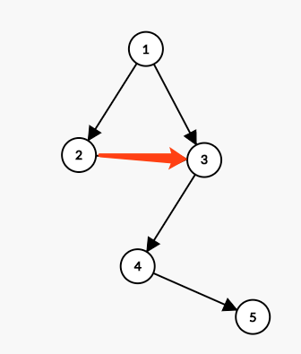
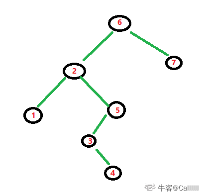

## 1.遍历

## 1.1 重建二叉树
[题目来源剑指offer](https://www.nowcoder.com/practice/8a19cbe657394eeaac2f6ea9b0f6fcf6?tpId=13&tqId=11157&rp=1&ru=%2Fta%2Fcoding-interviews&qru=%2Fta%2Fcoding-interviews%2Fquestion-ranking&tab=answerKey)

输入某二叉树的前序遍历和中序遍历的结果，请重建出该二叉树。假设输入的前序遍历和中序遍历的结果中都不含重复的数字。例如输入前序遍历序列`{1,2,4,7,3,5,6,8}`和中序遍历序列`{4,7,2,1,5,3,8,6}`，则重建二叉树并返回.

示例：

```
输入
[1,2,3,4,5,6,7],[3,2,4,1,6,5,7]

返回值
{1,2,5,3,4,6,7}
```

题解：递归

首先用一个数组保存中序遍历的位置

找出根节点在中序遍历中的位置

找到根节点，左子树长度(跟节点的左边)，右子树长度(根节点的右边)

递归建立左子树和右子树


```cpp
/**
 * Definition for binary tree
 * struct TreeNode {
 *     int val;
 *     TreeNode *left;
 *     TreeNode *right;
 *     TreeNode(int x) : val(x), left(NULL), right(NULL) {}
 * };
 */
class Solution {
public:
    //记录中序遍历的位置,卸载这里就不用传了
    unordered_map<int,int> pos;
    TreeNode* reConstructBinaryTree(vector<int> pre,vector<int> vin) {
//         unordered_map<int,int> pos;
        for(int i=0;i<vin.size();++i) {
            pos[vin[i]] = i;
        }
//         return build(pos,pre,0,pre.size() - 1,vin,0,vin.size() - 1) ;
        return build(pre,0,pre.size() - 1,vin,0,vin.size() - 1);
    }
    TreeNode* build(vector<int>& preorder, int preLeft, int preRight, vector<int>& inorder, int inLeft, int inRight){
        // preLeft和preRight表示子树在前序遍历中的范围，inLeft和inRight表示子树在中序遍历中的范围
        if(preLeft > preRight){
            return nullptr;
        }
        //前序遍历的第一个位置为根节点
        TreeNode* root = new TreeNode(preorder[preLeft]);
        // 找到root在中序遍历中的位置
        int inRoot = pos[preorder[preLeft]];
        //左子树的长度
        int leftTreeLen = inRoot - inLeft;
        //右子树的长度
        int rightTreeLen = inRight - inRoot;

        root->left = build(preorder, preLeft + 1, preLeft + leftTreeLen, inorder, inLeft, inRoot - 1);
        root->right = build(preorder, preRight - rightTreeLen + 1, preRight, inorder, inRoot + 1, inRight);

        return root;
    }
};
```

### 1.2二叉树的下一个节点

[题目来源剑指offer](https://www.nowcoder.com/practice/9023a0c988684a53960365b889ceaf5e?tpId=13&tqId=11210&tPage=3&rp=3&ru=%2Fta%2Fcoding-interviews&qru=%2Fta%2Fcoding-interviews%2Fquestion-ranking&tab=answerKey)

给定一个二叉树和其中的一个结点，请找出中序遍历顺序的下一个结点并且返回。注意，树中的结点不仅包含左右子结点，同时包含指向父结点的指针。

在`TreeNode`的基础上，额外横向增加一个链接节点，数据的序列化格式在`TreeNode`的基础上，额外增加`next`节点的数据，图中红色链路为`next`。



上图中2节点的next为3节点，以上链接二叉树会被序列化为 `{[1,2,3,#,#,4,#,#,5],[#,3,#,#,#]}`

题解：



红色数字是中序遍历的顺序。接下来，我们就假设，如果当前结点分别是`1, 2 3，4，5，6，7`，下一结点看有什么规律没？

```
1 => 2 // 显然下一结点是 1 的父亲结点
2 => 3 // 下一节点是当前结点右孩子的左孩子结点，其实你也应该想到了，应该是一直到左孩子为空的那个结点
3 => 4 // 跟 2 的情况相似，当前结点右孩子结点的左孩子为空的那个结点
4 => 5 // 5 是父亲结点 3 的父亲结点，发现和1有点像，因为 1，3,同样是父亲结点的左孩子
5 => 6 // 跟 4=>5 一样的道理
6 => 7 // 跟 3=>4 一样的道理
7 => null // 因为属于最尾结点
```

此时，可以总结一下：

[1] 是一类：特点：当前结点是父亲结点的左孩子
[2 3 6] 是一类，特点：当前结点右孩子结点，那么下一节点就是：右孩子结点的最左孩子结点,如果右孩子结点没有左孩子就是自己

[4 5]是一类，特点：当前结点为父亲结点的右孩子结点，本质还是[1]那一类

[7]是一类，特点：最尾结点

```cpp
/*
struct TreeLinkNode {
    int val;
    struct TreeLinkNode *left;
    struct TreeLinkNode *right;
    struct TreeLinkNode *next;
    TreeLinkNode(int x) :val(x), left(NULL), right(NULL), next(NULL) {
        
    }
};
*/
class Solution {
public:
    TreeLinkNode* GetNext(TreeLinkNode* pNode) {
        if(!pNode) {
            return pNode;
        }
        //属于【1，2，3】类
        if(pNode->right) {
            pNode = pNode->right;
            //找到右子树的最左节点
            while(pNode->left) {
                pNode = pNode->left;
            }
            return pNode;
        }
        // 属于 [1] 和 [4 5],当前节点在父亲节点的左子树上
        while(pNode->next) {
            TreeLinkNode *root = pNode->next;
            if(root->left == pNode) {
                return root;
            }
            pNode = pNode->next;
        }
        //属于[7]
        return nullptr;
    }
};
```

时间复杂度：最坏情况下为`O(N)`

空间复杂度：`O(1)`

### 1.3 数的子结构

输入两棵二叉树`A`，`B`，判断`B`是不是A的子结构。（`ps`：我们约定空树不是任意一个树的子结构）

示例：
```
输入：
{8,8,#,9,#,2,#,5},{8,9,#,2}

输出：
true
```

题解：


```cpp
 /*
struct TreeNode {
	int val;
	struct TreeNode *left;
	struct TreeNode *right;
	TreeNode(int x) :
			val(x), left(NULL), right(NULL) {
	}
};*/
class Solution {
public:
    bool HasSubtree(TreeNode* pRoot1, TreeNode* pRoot2) {
        if(pRoot1 == nullptr || pRoot2 == nullptr) return false;
        //写一个函数判断p2是不是p1的子结构
        if(isPart(pRoot1,pRoot2)) return true;
        
        //否则就判断p2是不是p1左子树的子树 或者 p2是不是p1右子树的子树
        return HasSubtree(pRoot1->left, pRoot2) || HasSubtree(pRoot1->right, pRoot2);
    }
    bool isPart(TreeNode* pRoot1, TreeNode* pRoot2) {
        //如果p2已经遍历完了说明就是p2的子结构
        if(!pRoot2) return true;
        //如果p1已经遍历结束了p2还没结束或者 p1的值不等于p2的值，就返回false
        if(!pRoot1 || pRoot1->val != pRoot2->val) return false;
        
        //继续比较p1的左子树和p2的左子树 以及 p1的右子树和p2的右子树 
        return isPart(pRoot1->left, pRoot2->left) && isPart(pRoot1->right, pRoot2->right);
    }
};
```

### 1.4 二叉树的序列化与反序列化


请实现两个函数，分别用来序列化和反序列化二叉树

二叉树的序列化是指：把一棵二叉树按照某种遍历方式的结果以某种格式保存为字符串，从而使得内存中建立起来的二叉树可以持久保存。序列化可以基于先序、中序、后序、层序的二叉树遍历方式来进行修改，序列化的结果是一个字符串，序列化时通过 某种符号表示空节点（#），以 ！ 表示一个结点值的结束（value!）。

二叉树的反序列化是指：根据某种遍历顺序得到的序列化字符串结果`str`，重构二叉树。

例如，我们可以把一个只有根节点为1的二叉树序列化为"1,"，然后通过自己的函数来解析回这个二叉树


```
输入：
{8,6,10,5,7,9,11}
输出：
{8,6,10,5,7,9,11}
```

题解一：

方法一
可以先把一棵二叉树序列化成一个前序遍历和一个中序遍历的序列，然后在反序列化时通过这两个序列重构出原二叉树

这种思路有两个缺点：

该方法要求二叉树中不能有数值重复的节点；
只有当两个序列中所有数据都读出后才能开始反序列化。如果两个遍历序列的数据是从一个流里读出来的，那么可能需要等待较长的时间

方法二

如果二叉树序列化是从根节点开始的，那么相应的反序列化在根节点的数值读出来的时候就可以开始了。因此，可以根据前序遍历的顺序来序列化二叉树，因为前序遍历是从根节点开始的。在遍历二叉树碰到nullptr指针时，这些nullptr指针序列化为一个特殊的字符（如'#'）

对于如下二叉树，被序列化成字符串“1,2,4,#,#,#,3,5,#,#,6,#,#”

```
      1
     / \
    2   3
   /   / \
  4   5   6
```
反序列化时，第一个读出的数字是1。由于前序遍历是从根节点开始的，这是根节点的值。接下来读出的数字是2，根据前序遍历的规则，这是根节点的左子节点的值。同样，接下来的数字4是值为2的节点的左子节点。接着从序列化字符串里读出两个字符'#'，这表明值为4的节点的左、右子节点均为nullptr指针，因此它是一个叶节点。接下来回到值为2的节点，重建它的右子节点。由于下一个字符是'#'，这表明值为2的节点的右子节点为nullptr指针。这个节点的左、右子树都已经构建完毕，接下来回到根节点，反序列化根节点的右子树

下一个序列化字符串中的数字是3，因此右子树的根节点的值为3。它的左子节点是一个值为5的叶节点，因为接下来的三个字符是“5,#,#”。同样，它的右子节点是值为6的叶节点，因为最后3个字符是“6,#,#”

总结前面的过程，我们都是把二叉树分解成3部分：根节点、左子树和右子树。在处理（序列化或反序列化）它的根节点之后再分别处理它的左、右子树

```cpp
/**
 * Definition for a binary tree node.
 * struct TreeNode {
 *     int val;
 *     TreeNode *left;
 *     TreeNode *right;
 *     TreeNode(int x) : val(x), left(NULL), right(NULL) {}
 * };
 */
class Codec {
public:

    // Encodes a tree to a single string.
    //序列化
    string serialize(TreeNode* root) {
        if(root == nullptr) {
            return "#";
        }
        //转成字符串
        return to_string(root->val) + "," + serialize(root->left) + "," + serialize(root->right);
        
    }

    // Decodes your encoded data to tree.
    TreeNode* deserialize(string data) {
        return deserializeCore(data);
    }

    //反序列化核心代码，将字符串构建成二叉树
    TreeNode* deserializeCore(string &data) {
        //如果已经到字符串末尾了就结束
        if(data == "") return nullptr;

        if(data[0] == '#'){
            data = data.substr(data.find(',') + 1);  //找到#的下一位
            return NULL;
        }

        size_t idx;
        int val = stoi(data,&idx); //取出idx位置宇哥节点的值
        // substr返回一个字符串，从指定位置开始
        data = data.substr(idx + 1);

        //新建一个节点
        TreeNode *node = new TreeNode(val);
        
        node->left = deserializeCore(data);
        node->right = deserializeCore(data);
        

        return node;
    }
};

```

题解二：

广度优先 + 迭代法。其实题目的意思就是写一个函数将二叉树转成字符串（字符串的形式随你定，可以是题目所给的"`[1,2,3,null,null,4,5]`"，也可以是本文代码中"`1 2 3 null null 4 5`"的形式）。然后再写一个函数将字符串成功转回一开始的二叉树，此时最后返回的二叉树必须与题目给的一模一样。<br>
先放C++代码，思路清晰明了，基本注释已写好在代码中。


```cpp
/**
 * Definition for a binary tree node.
 * struct TreeNode {
 *     int val;
 *     TreeNode *left;
 *     TreeNode *right;
 *     TreeNode(int x) : val(x), left(NULL), right(NULL) {}
 * };
 */
class Codec {
public:

    // Encodes a tree to a single string.
    string serialize(TreeNode* root) {
        if(!root){
            return ""; // 判空
        }
        ostringstream out;
        queue<TreeNode*> bfs;
        bfs.push(root);
        while(!bfs.empty()){
            // 迭代法
            TreeNode* temp = bfs.front();
            bfs.pop();
            if(temp){
                out<< temp -> val << " ";
                bfs.push(temp -> left);
                bfs.push(temp -> right);
            }
            else{
                out<< "null "; // 注意 null 后面有空格
            }
        }
        return out.str(); // out 用来将树转成字符串，元素之间用空格分隔
    }

    // Decodes your encoded data to tree.
    TreeNode* deserialize(string data) {
        if(data.empty()){
            return nullptr; // 判空
        }
        istringstream input(data);
        string info;
        vector<TreeNode*> res; // res 用来将字符串里每个元素转成 TreeNode* 形式的元素
        while(input >> info){
            if(info == "null"){ // 注意 null 后面没空格（因为空格是用来分隔字符串的，不属于字符串）
                res.push_back(nullptr);
            }
            else{
                res.push_back(new TreeNode(stoi(info)));
            }
        }
        int pos = 1;
        for(int i = 0; pos < res.size(); ++i){
            // 本循环将 res 中的所有元素连起来，变成一棵二叉树
            if(!res[i]){
                continue;
            }
            res[i] -> left = res[pos++]; // pos 此时指向左子树，++后指向右子树
            if(pos < res.size()){
                res[i] -> right = res[pos++]; // pos 此时指向右子树，++后指向下一个节点的左子树
            }
        }
        return res[0];
    }
};

```

## 1.5二叉树的中序遍历

给定一个二叉树的根节点 root ，返回它的 中序 遍历。

示例 :


```
输入：root = [1,null,2,3]
输出：[1,3,2]

输入：root = []
输出：[]

输入：root = [1]
输出：[1]
```

题解：

```cpp
/**
 * Definition for a binary tree node.
 * struct TreeNode {
 *     int val;
 *     TreeNode *left;
 *     TreeNode *right;
 *     TreeNode(int x) : val(x), left(NULL), right(NULL) {}
 * };
 */
class Solution {
public:
    vector<int> inorderTraversal(TreeNode* root) {
        vector<int> res;
        inorderTraversal(root,res);
        return res;
    }
private:
    void inorderTraversal(TreeNode *root,vector<int> &res){
        if(!root)   return;
        
        inorderTraversal(root->left,res);
        res.push_back(root->val);
        inorderTraversal(root->right,res);
        
        return;
    }
};
```

## 1.6 验证二叉搜索树

给定一个二叉树，判断其是否是一个有效的二叉搜索树。

假设一个二叉搜索树具有如下特征：

节点的左子树只包含小于当前节点的数。
节点的右子树只包含大于当前节点的数。
所有左子树和右子树自身必须也是二叉搜索树。

示例：

```
输入:
    2
   / \
  1   3
输出: true

输入:
    5
   / \
  1   4
     / \
    3   6
输出: false
解释: 输入为: [5,1,4,null,null,3,6]。
     根节点的值为 5 ，但是其右子节点值为 4 。
```

