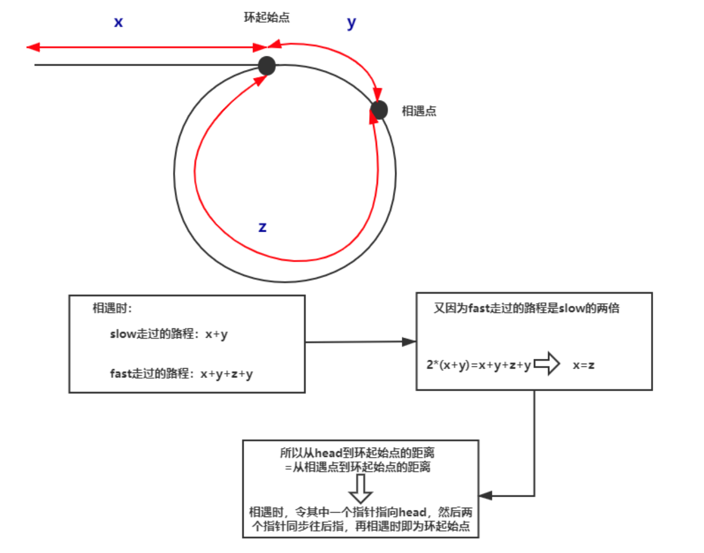

 ## 两数之和 II - 输入有序数组
 [题目来源](https://leetcode-cn.com/problems/two-sum-ii-input-array-is-sorted/)

 给定一个已按照升序排列 的有序数组，找到两个数使得它们相加之和等于目标数。

函数应该返回这两个下标值 index1 和 index2，其中 index1 必须小于 index2。

说明:

- 返回的下标值（index1 和 index2）不是从零开始的。
- 你可以假设每个输入只对应唯一的答案，而且你不可以重复使用相同的元素。
  
示例:
```
输入: numbers = [2, 7, 11, 15], target = 9
输出: [1,2]
解释: 2 与 7 之和等于目标数 9 。因此 index1 = 1, index2 = 2 。
```

**思路**：因为数组已经排好序，我们可以采用方向相反的双指针来寻找这两个数字，一个初始指向最 小的元素，即数组最左边，向右遍历;一个初始指向最大的元素，即数组最右边，向左遍历。
如果两个指针指向元素的和等于给定值，那么它们就是我们要的结果。如果两个指针指向元 素的和小于给定值，我们把左边的指针右移一位，使得当前的和增加一点。如果两个指针指向元 素的和大于给定值，我们把右边的指针左移一位，使得当前的和减少一点。

```cpp
class Solution {
public:
    vector<int> twoSum(vector<int>& numbers, int target) {
        int left = 0,right = numbers.size() - 1,sum;
        while(left < right) {
           sum = numbers[left] + numbers[right];
           if(sum == target) break;
           if(sum < target) ++left;
           else --right; 
        }
        
        return vector<int> {left+1,right+1};
    }
};
```

## 归并两个有序数组
[题目来源](https://leetcode-cn.com/problems/merge-sorted-array/)


给你两个有序整数数组 nums1 和 nums2，请你将 nums2 合并到 nums1 中，使 nums1 成为一个有序数组。

 

说明：

初始化 nums1 和 nums2 的元素数量分别为 m 和 n 。
你可以假设 nums1 有足够的空间（空间大小大于或等于 m + n）来保存 nums2 中的元素。

示例：
```
输入：
nums1 = [1,2,3,0,0,0], m = 3
nums2 = [2,5,6],       n = 3

输出：[1,2,2,3,5,6]
```

**思路：**

- 因为这两个数组已经排好序，我们可以把两个指针分别放在两个数组的末尾，即 nums1 的 m − 1 位和 nums2 的 n − 1 位。每次将较大的那个数字复制到 nums1 的后边，然后向前移动一位。 因为我们也要定位 nums1 的末尾，所以我们还需要第三个指针，以便复制。
- 在以下的代码里，我们直接利用 m 和 n 当作两个数组的指针，再额外创立一个 pos 指针，起 始位置为 m + n − 1。每次向前移动 m 或 n 的时候，也要向前移动 pos。这里需要注意，如果 nums1 的数字已经复制完，不要忘记把 nums2 的数字继续复制;如果 nums2 的数字已经复制完，剩余 nums1 的数字不需要改变，因为它们已经被排好序。、
```cpp
class Solution {
public:
    void merge(vector<int>& nums1, int m, vector<int>& nums2, int n) {
        int pos = m + n -1;
        --m;
        --n;
        while(m >=0 && n >= 0) {
            if(nums1[m] >= nums2[n]) {
                nums1[pos--] = nums1[m--];
            }else {
                nums1[pos--] = nums2[n--];
            }
        }
        while(n >= 0) {
            nums1[pos--] = nums2[n--];
        }
    }
};
```

对代码进行简化
```cpp
class Solution {
public:
    void merge(vector<int>& nums1, int m, vector<int>& nums2, int n) {
        int pos = m-- + n-- -1;
        while(m >=0 && n >= 0) {
            nums1[pos--] = nums1[m] >= nums2[n] ? nums1[m--] : nums2[n--];
        }
        while(n >= 0) {
            nums1[pos--] = nums2[n--];
        }
    }
};
```

## 快慢指针
[环形链表 II](https://leetcode-cn.com/problems/merge-sorted-array/submissions/)

给定一个链表，返回链表开始入环的第一个节点。 如果链表无环，则返回 null。

为了表示给定链表中的环，我们使用整数 pos 来表示链表尾连接到链表中的位置（索引从 0 开始）。 如果 pos 是 -1，则在该链表中没有环。注意，pos 仅仅是用于标识环的情况，并不会作为参数传递到函数中。

说明：不允许修改给定的链表。

进阶：

> 你是否可以使用 O(1) 空间解决此题？

示例：


```
输入：head = [3,2,0,-4], pos = 1
输出：返回索引为 1 的链表节点
解释：链表中有一个环，其尾部连接到第二个节点。
```
思路：

对于链表找环路的问题，有一个通用的解法——快慢指针(Floyd 判圈法)。给定两个指针，
分别命名为 slow 和 fast，起始位置在链表的开头。每次 fast 前进两步，slow 前进一步。如果 fast 可以走到尽头，那么说明没有环路;如果 fast 可以无限走下去，那么说明一定有环路，且一定存 在一个时刻 slow 和 fast 相遇。当 slow 和 fast 第一次相遇时，我们将 fast 重新移动到链表开头，并 让 slow 和 fast 每次都前进一步。当 slow 和 fast 第二次相遇时，相遇的节点即为环路的开始点。



```cpp
/**
 * Definition for singly-linked list.
 * struct ListNode {
 *     int val;
 *     ListNode *next;
 *     ListNode(int x) : val(x), next(NULL) {}
 * };
 */
class Solution {
public:
    ListNode *detectCycle(ListNode *head) {
        ListNode *slow = head,*fast = head;  //声明快指针和慢指针
        do {
            if(!fast || !fast->next) return nullptr;  //如果快指针或者快指针的下一个节点为空了说明无环
            fast = fast->next->next;
            slow = slow->next;
        } while(fast != slow);
        //如果存在环
        fast = head;
        while (fast != slow){
        slow = slow->next;
        fast = fast->next;
        }
        return fast;
    }
}
```
改一下：
```cpp
/**
 * Definition for singly-linked list.
 * struct ListNode {
 *     int val;
 *     ListNode *next;
 *     ListNode(int x) : val(x), next(NULL) {}
 * };
 */
class Solution {
public:
    ListNode *detectCycle(ListNode *head) {
        ListNode* fast=head;
        ListNode* slow=head;
        while (fast!=nullptr) {
            slow=slow->next;
            if (slow==nullptr) return nullptr;
            fast=fast->next;
            if (fast!=nullptr) fast=fast->next;
            if (fast==slow) {
                ListNode* ptr=head;
                while (ptr!=slow) {
                    ptr=ptr->next;
                    slow=slow->next;
                }
                return ptr;
            }
        }
        return nullptr;
    }
}

```

**哈希表方方法：**
```cpp
class Solution {
public:
    ListNode *detectCycle(ListNode *head) {
        unordered_set<ListNode*> visited;
        while (head != nullptr) {
            if (visited.count(head)) {
                return head;
            }
            visited.insert(head);
            head = head->next;
        }
        return nullptr;
    }
};
```

## 平方数之和
[题目来源](https://leetcode-cn.com/problems/sum-of-square-numbers/)

给定一个非负整数 c ，你要判断是否存在两个整数 a 和 b，使得 a2 + b2 = c 。

示例1：
```
输入：c = 5
输出：true
解释：1 * 1 + 2 * 2 = 5
```

```cpp
class Solution {
public:
    bool judgeSquareSum(int c) {
        long left = 0,right = sqrt(c);
        while(left <= right) {
            if(left * left + right * right == c) return true;
            else if(left * left + right * right > c) --right;
            else {
                ++left;
            }
        }
        return false;
    }
};
```


