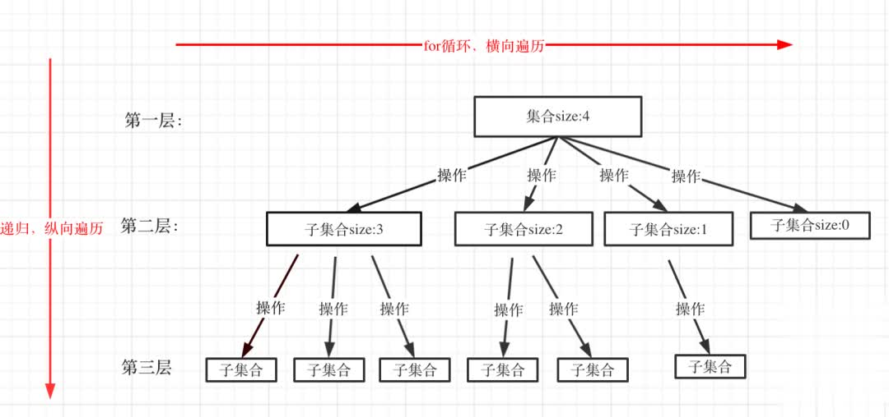
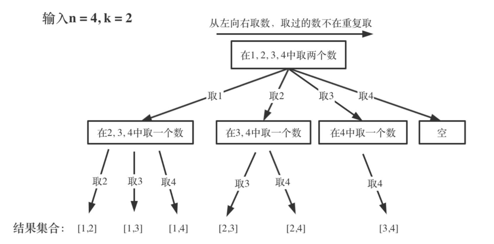
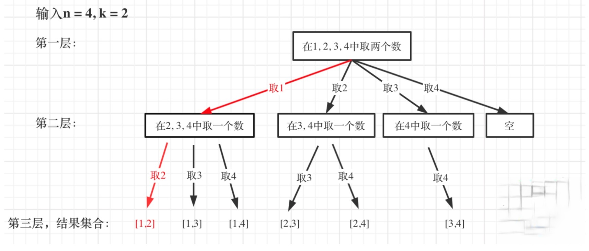
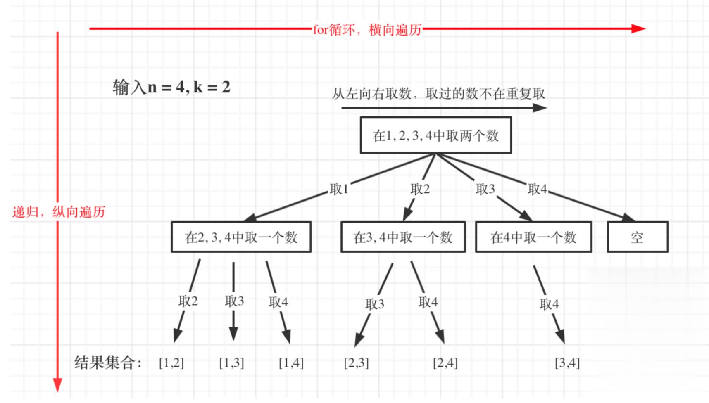
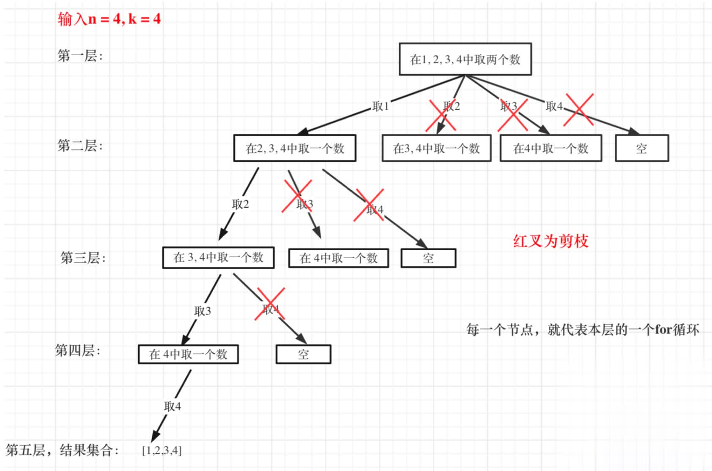
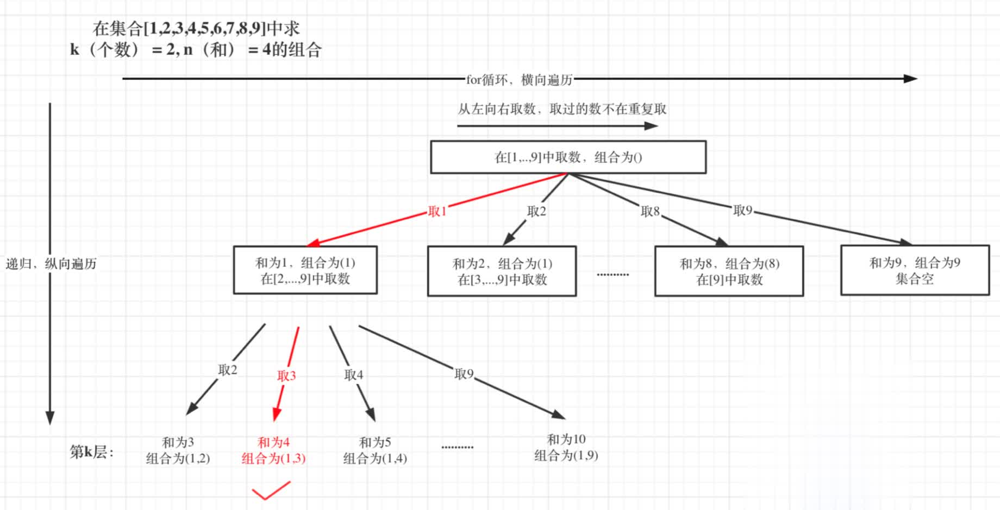
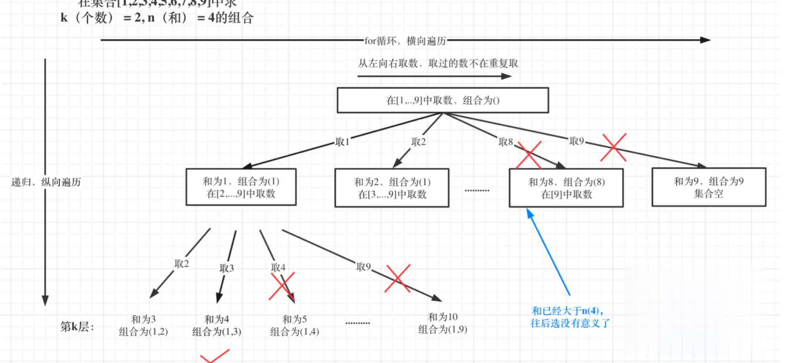
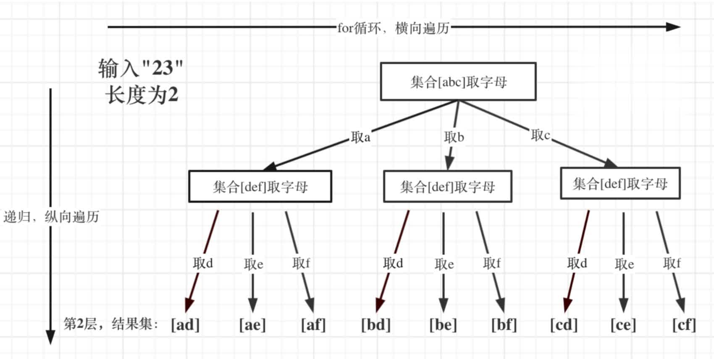
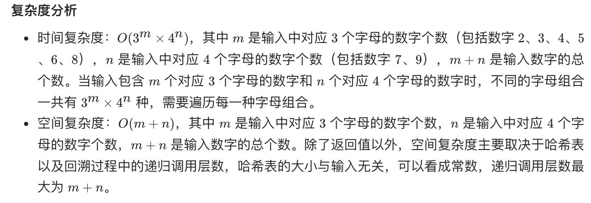

> 参考代码随想录


## 回溯算法概述

回溯法也可以叫做回溯搜索法，它是一种搜索的方式。

回溯是递归的副产品，只要有递归就会有回溯。

### 回溯算法的效率

虽然回溯法很难，很不好理解，但是回溯法并不是什么高效的算法，因为回溯的本质是穷举，穷举所有可能，然后选出我们想要的答案，如果想让回溯法高效一些，可以加一些剪枝的操作，但也改不了回溯法就是穷举的本质。

### 理解回溯算法

回溯法，一般可以解决如下几种问题：

- 组合问题：`N`个数里面按一定规则找出`k`个数的集合
- 排列问题：`N`个数按一定规则全排列，有几种排列方式
- 切割问题：一个字符串按一定规则有几种切割方式
- 子集问题：一个`N`个数的集合里有多少符合条件的子集
- 棋盘问题：`N`皇后，解数独等等

> 组合和排序的区别：<br>
>「组合是不强调元素顺序的，排列是强调元素顺序」。

例如：`{1, 2}` 和 `{2, 1}` 在组合上，就是**一个**集合，因为不强调顺序，而要是排列的话，`{1, 2}` 和 `{2, 1}` 就是**两个**集合了。

记住组合无序，排列有序，就可以了。

「**回溯法解决的问题都可以抽象为树形结构**」，是的，我指的是所有回溯法的问题都可以抽象为树形结构！

因为回溯法解决的都是在集合中递归查找子集，「**集合的大小就构成了树的宽度，递归的深度，构成的树的深度**」。

递归就要有终止条件，所以必然是一颗高度有限的树（`N`叉树）。

#### 回溯三部曲

- 回溯函数模板返回值以及参数

> 在回溯算法中，以下函数起名字为`backtracking`

回溯算法中函数返回值一般为`void`。再来看一下参数，因为回溯算法需要的参数可不像二叉树递归的时候那么容易一次性确定下来，所以一般是先写逻辑，然后需要什么参数，就填什么参数。

回溯函数伪代码如下：
```cpp
void backtracking(参数) 
```

- 回溯函数终止条件

什么时候达到了终止条件，树中就可以看出，一般来说搜到叶子节点了，也就找到了满足条件的一条答案，把这个答案存放起来，并结束本层递归。

所以回溯函数终止条件伪代码如下：
```cpp
if (终止条件) {
    存放结果;
    return;
}
```

- 回溯搜索的遍历过程

在上面我们提到了，回溯法一般是在集合中递归搜索，集合的大小构成了树的宽度，递归的深度构成的树的深度。



注意图中，我特意举例集合大小和孩子的数量是相等的！

回溯函数遍历过程伪代码如下：
```cpp
for (选择：本层集合中元素（树中节点孩子的数量就是集合的大小）) {
    处理节点;
    backtracking(路径，选择列表); // 递归
    回溯，撤销处理结果
}
```
`for`循环就是遍历集合区间，可以理解一个节点有多少个孩子，这个`for`循环就执行多少次。

`backtracking`这里自己调用自己，实现递归。

大家可以从图中看出「`for`循环可以理解是横向遍历，`backtracking`（递归）就是纵向遍历」，这样就把这棵树全遍历完了，一般来说，搜索叶子节点就是找的其中一个结果了。

### 回溯算法模板框架

```cpp
void backtracking(参数) {
    if (终止条件) {
        存放结果;
        return;
    }

    for (选择：本层集合中元素（树中节点孩子的数量就是集合的大小）) {
        处理节点;
        backtracking(路径，选择列表); // 递归
        回溯，撤销处理结果
    }
}
```

**这份模板很重要，后面做回溯法的题目都靠它了！**

## 77.组合

[题目来源](https://leetcode-cn.com/problems/combinations/)

给定两个整数 `n` 和 `k`，返回 `1 ... n` 中所有可能的 `k` 个数的组合。

示例:
```
输入: n = 4, k = 2
输出:
[
  [2,4],
  [3,4],
  [2,3],
  [1,2],
  [1,3],
  [1,4],
]
```

思路：

直接的解法当然是使用`for`循环，例如示例中`k`为`2`，很容易想到用两个`for`循环，这样就可以输出 和示例中一样的结果。

代码如下

```cpp
int n = 4;
for (int i = 1; i <= n; i++) {
    for (int j = i + 1; j <= n; j++) {
        cout << i << " " << j << endl;
    }
}
```

输入：`n = 100`,`k = 3 `那么就三层`for`循环，代码如下：

```cpp
int n = 100;
for (int i = 1; i <= n; i++) {
    for (int j = i + 1; j <= n; j++) {
        for (int u = j + 1; u <= n; n++) {
            cout << i << " " << j << " " << u << endl;
        }
    }
}
```

如果`n`为`100`，`k`为`50`呢，那就`50`层`for`循环，是不是开始窒息

虽然回溯法也是暴力，但至少能写出来，不像`for`循环嵌套`k`层让人绝望

要解决 `n`为`100`，`k`为`50`的情况，暴力写法需要嵌套`50`层`for`循环，那么回溯法就用递归来解决嵌套层数的问题

递归来做层叠嵌套（可以理解是开`k`层`for`循环），「每一次的递归中嵌套一个`for`循环，那么递归就可以用于解决多层嵌套循环的问题了」。



可以看出这个棵树，一开始集合是 `1，2，3，4`， 从左向右取数，取过的数，不在重复取。 第一次取`1`，集合变为`2，3，4` ，因为`k`为`2`，我们只需要再取一个数就可以了，分别取`2，3，4`，得到集合`[1,2] [1,3] [1,4]`，以此类推。 

每次从集合中选取元素，可选择的范围随着选择的进行而收缩，调整可选择的范围。 

图中可以发现`n`相当于树的宽度，`k`相当于树的深度。

**图中每次搜索到了叶子节点，我们就找到了一个结果**。

相当于只需要把达到叶子节点的结果收集起来，就可以求得 `n`个数中`k`个数的组合集合

**回溯算法三部曲**

- **递归函数的返回值以及参数**

在这里要定义两个全局变量，一个用来存放符合条件单一结果，一个用来存放符合条件结果的集合。

然后还需要一个参数，为int型变量`startIndex`，这个参数用来记录本层递归的中，集合从哪里开始遍历(集合就是`[1,...,n]` )。 为什么要有这个`startIndex`呢?

每次从集合中选取元素，可选择的范围随着选择的进行而收缩，调整可选择的范围，就是要靠`startIndex`。

```cpp
vector<vector<int>> result; // 存放符合条件结果的集合 
vector<int> path; // 用来存放符合条件单一结果
void backtracking(int n, int k, int startIndex)
```

- **回溯函数终止条件**

什么时候到达所谓的叶子节点了呢?

`path`这个数组的大小如果达到`k`，说明我们找到了一个子集大小为`k`的组合了，在图中`path`存的就是根节 点到叶子节点的路径。

如图红色部分




此时用`result`二维数组，把`path`保存起来，并终止本层递归。

> 也就是已经找到了一个满足条件的组合了，如[1,2],就可以返回了。`path.size() == k`，所以就要用`result`把这个结果收集起来。

所以终止条件的代码：

```cpp
 
if (path.size() == k) {
    result.push_back(path);
    return;
}
```

- **单层搜索的过程**

回溯法的搜索过程就是一个树型结构的遍历过程，在如下图中，可以看出for循环用来横向遍历，递归的 过程是纵向遍历。



如此我们才遍历完图中的这棵树。 `for`循环每次从`startIndex`开始遍历，然后用path保存取到的节点`i`。

```cpp
 
for (int i = startIndex; i <= n; i++) { // 控制树的横向遍历
    path.push_back(i); // 处理节点
    backtracking(n, k, i + 1); // 递归:控制树的纵向遍历，注意下一层搜索要从i+1开始 
    path.pop_back(); // 回溯，撤销处理的节点
}
```
可以看出`backtracking`(递归函数)通过不断调用自己一直往深处遍历，总会遇到叶子节点，遇到了叶 子节点就要返回。

`backtracking`的下面部分就是回溯的操作了，撤销本次处理的结果。

```cpp
class Solution {
public:
    vector<vector<int>> result;  //存放结果的集合
    vector<int> path; //存放符合条件的结果
    vector<vector<int>> combine(int n, int k) {
        //确定参数和返回值，回溯的返回值一般都是void
        backtracking(n,k,1); //第三个参数是从哪里开始,一开始是从1开始
        return result;
    }
    void backtracking(int n,int k,int startIndex) {
        //确定终止条件,已经找到了一个满足条件的组合了，如[1,2],就可以返回了
        if(path.size() == k) {
            result.push_back(path);
            return ;
        }
        //确定单层的逻辑
        for(int i=startIndex;i<=n;++i) {  //记住这里有 = 号
            // 处理节点
            path.push_back(i);
            backtracking(n,k,i+1);  //取了i，剩下从i+1开始
            //回溯，撤销处理的节点
            path.pop_back();
        }
    }
};
```

### 组合问题再剪剪枝

在遍历的过程中有如下代码:

```cpp
for (int i = startIndex; i <= n; i++) {
    path.push_back(i);
    backtracking(n, k, i + 1);
    path.pop_back();
}
```

这个遍历的范围是可以剪枝优化的，怎么优化呢?

来举一个例子，`n = 4，k = 4`的话，那么第一层`for`循环的时候，从元素`2`开始的遍历都没有意义了。 在第二层`for`循环，从元素3开始的遍历都没有意义了。



图中每一个节点(图中为矩形)，就代表本层的一个`for`循环，那么每一层的`for`循环从第二个数开始遍 历的话，都没有意义，都是无效遍历。

所以，可以剪枝的地方就在递归中每一层的`for`循环所选择的起始位置。 如果`for`循环选择的起始位置之后的元素个数 已经不足 我们需要的元素个数了，那么就没有必要搜索
了。

注意代码中i，就是for循环里选择的起始位置。
  for (int i = startIndex; i <= n; i++) {
接下来看一下优化过程如下:

1. 已经选择的元素个数:path.size();
2. 还需要的元素个数为: k - path.size();
3. 在集合n中至多要从该起始位置 : n - (k - path.size()) + 1，开始遍历


为什么有个+1呢，因为包括起始位置，我们要是一个左闭的集合。
举个例子，`n = 4`，`k = 3`， 目前已经选取的元素为0(path.size为0)，`n - (k - 0) + 1 `即 `4 - ( 3 - 0) + 1 =
2`。

从`2`开始搜索都是合理的，可以是组合`[2, 3, 4]`。 这里大家想不懂的话，建议也举一个例子，就知道是不是要`+1`了。 

所以优化之后的`for`循环是:

```cpp
 for (int i = startIndex; i <= n - (k - path.size()) + 1; i++) // i为本次搜索的起 始位置
```

```cpp
class Solution {
public:
    vector<vector<int>> result;
    vector<int> path;
    vector<vector<int>> combine(int n, int k) {
        backtracking(n,k,1);
        return  result;
    }
    void backtracking(int n,int k,int startIndex) {
        if(path.size() == k) {
            result.push_back(path);
            return ;
        }
        //剪枝
        for(int i=startIndex;i<= n - (k-path.size() ) + 1;++i) {
            //处理节点
            path.push_back(i);
            backtracking(n,k,i+1);
            path.pop_back();
        }
    }
};
```

## 216.组合总和 III

[题目来源](https://leetcode-cn.com/problems/combination-sum-iii/)

找出所有相加之和为 `n` 的 `k` 个数的组合。组合中只允许含有 `1 - 9` 的正整数，并且每种组合中不存在重复的数字。

说明：

所有数字都是正整数。<br>
解集不能包含重复的组合。 

示例 
```
输入: k = 3, n = 7
输出: [[1,2,4]]

输入: k = 3, n = 9
输出: [[1,2,6], [1,3,5], [2,3,4]]
```

思路：

相对于「回溯算法:求组合问题」!，无非就是多了一个限制，本题是要找到和为`n`的`k`个数的组合，而整个集合已经是固定的了[1,...,9]。

本题`k`相当于了树的深度，`9`(因为整个集合就是`9`个数)就是树的宽度。

例如 `k = 2，n = 4`的话，就是在集合`[1,2,3,4,5,6,7,8,9]`中求 `k(个数) = 2`, n`(和) = 4`的组合。



图中，可以看出，只有最后取到集合`(1，3)`和为`4` 符合条件。

**回溯三部曲**

- 确认递归函数参数和返回值

这里我依然定义`path` 和 `result`为全局变量。 

至于为什么取名为`path`? 从上面树形结构中，可以看出，结果其实就是一条根节点到叶子节点的路径。

```cpp
 vector<vector<int>> result; // 存放结果集 vector<int> path; // 符合条件的结果
```


接下来还需要如下参数:

- `targetSum(int)`目标和，也就是题目中的n。 
- `k(int)`就是题目中要求k个数的集合。 
- `sum(int)`为已经收集的元素的总和，也就是path里元素的总和。 
- `startIndex(int)`为下一层for循环搜索的起始位置。

```cpp
void backtracking(int targetSum,int k,int sum,int startIndex);
```
其实这里`sum`这个参数也可以省略，每次`targetSum`减去选取的元素数值，然后判断如果`targetSum`为`0` 了，说明收集到符合条件的结果了，我这里为了直观便于理解，还是加一个sum参数。

还要强调一下，回溯法中递归函数参数很难一次性确定下来，一般先写逻辑，需要啥参数了，填什么参数。

- 确定终止条件

在上面已经说了，`k`其实就已经限制树的深度，因为就取`k`个元素，树再往下深了没有意义。

所以如果`path.size()` 和`k`相等了，就终止。

如果此时`path`里收集到的元素和`(sum)` 和`targetSum`(就是题目描述的`n`)相同了，就用`result`收集当前的结果。

```cpp
if(path.size() == k) {
    result.push_back(path);
    return;
}
```

- 单层搜索过程

本题和「回溯算法:求组合问题」!区别之一就是集合固定的就是`9`个数`[1,...,9]`，所以`for`循环固定`i<=9` 如图:


处理过程就是，`path`收集每次选取的元素，相当于树型结构里的边，`sum`来统计`path`里元素的总和。

```cpp
for(int i=startIndex;i<=9;++1) {
    //处理节点
    sum += i;
    path.push_back(i);
    //递归
    backtracking(targetSum,k,sum,i+1);
    //回溯
    sum -= i;
    path.pop_back();
}
```
**别忘了处理过程 和 回溯过程是一一对应的，处理有加，回溯就要有减!**

```cpp
class Solution {
public:
    vector<vector<int>> result;
    vector<int> path;
    vector<vector<int>> combinationSum3(int k, int n) {
        backtacking(n,k,0,1);
        return result;
    }
        // targetSum:目标和，也就是题目中的n。
        // k:题目中要求k个数的集合。
        // sum:已经收集的元素的总和，也就是path里元素的总和。
        // startIndex:下一层for循环搜索的起始位置。
    void backtacking(int targetSum,int k,int sum,int startIndex) {
        //终止条件
        if(path.size() == k) {
            if(sum == targetSum) 
                result.push_back(path);
            return;
        }
        for(int i=startIndex;i<=9;++i) {
            //处理节点
            sum += i;
            path.push_back(i);
            //递归
            backtacking(targetSum,k,sum,i+1);
            //回溯
            sum -= i;
            path.pop_back();
        }
    }
};
```

### 剪枝



已选元素总和如果已经大于n(图中数值为4)了，那么往后遍历就没有意义了，直接剪掉。 

那么剪枝的地方一定是在递归终止的地方剪，剪枝代码如下:

```cpp
if (sum > targetSum) { // 剪枝操作 
    return;
}
```

for循环的范围也可以剪枝，`i <= 9 - (k - path.size()) + 1`就可以 了。

## 17.电话号码的字母组合

[题目来源](https://leetcode-cn.com/problems/letter-combinations-of-a-phone-number/)

给定一个仅包含数字 2-9 的字符串，返回所有它能表示的字母组合。答案可以按 任意顺序 返回。

给出数字到字母的映射如下（与电话按键相同）。注意 1 不对应任何字母。


```
输入：digits = "23"
输出：["ad","ae","af","bd","be","bf","cd","ce","cf"]

入：digits = ""
输出：[]

输入：digits = "2"
输出：["a","b","c"]
```

思路：

理解本题后，要解决如下三个问题:
1. 数字和字母如何映射
2. 两个字母就两个for循环，三个字符我就三个for循环，以此类推，然后发现代码根本写不出来 3. 输入1 * #按键等等异常情况

**数字和字母如何映射**

可以使用map或者定义一个二位数组，例如:`string letterMap[10]`，来做映射，我这里定义一个二维数 组，代码如下:

```cpp
const string letterMap[10] = {
    "", // 0
    "", // 1
    "abc", // 2
    "def", // 3
    "ghi", // 4
    "jkl", // 5
    "mno", // 6
    "pqrs", // 7
    "tuv", // 8
    "wxyz", // 9
};
```
    
例如:输入:"`23`"，抽象为树形结构，如图所示:



图中可以看出遍历的深度，就是输入"`23`"的⻓度，而叶子节点就是我们要收集的结果，输出`["ad", "ae", "af", "bd", "be", "bf", "cd", "ce", "cf"]`。

- 确定回溯函数参数

首先需要一个字符串`s`来收集叶子节点的结果，然后用一个字符串数组`result`保存起来，这两个变量我依 然定义为全局。

再来看参数，参数指定是有题目中给的`string digits`，然后还要有一个参数就是`int`型的`index`。 

注意这个`index`可不是 回溯算法:求组合问题!和回溯算法:求组合总和!中的`startIndex`了。

这个`index`是记录遍历第几个数字了，就是用来遍历`digits`的(题目中给出数字字符串)，同时`index`也表示树的深度。

```cpp
vector<string> result;
string s;
void backtracking(const string& digits, int index)
```
- 确定终止条件 

例如输入用例"`23`"，两个数字，那么根节点往下递归两层就可以了，叶子节点就是要收集的结果集。

那么终止条件就是如果`index` 等于输入的数字个数(`digits.size`)了(本来`index`就是用来遍历`digits` 的)。

然后收集结果，结束本层递归。

```cpp
if(index == digits.size()) {
    result.push_back(s);
    return ;
}
```
- 确定单层遍历逻辑 

首先要取index指向的数字，并找到对应的字符集(手机键盘的字符集)。 

然后for循环来处理这个字符集，代码如下:

```cpp
int digit = digits[index] - '0';  // 将index指向的数字转为int
string letters = letterMap[digit];
for(int i=0;i<=letters.size();++i) {
    s.push_back(letters[i]);
    backtracking(digits,index + 1); //递归，注意index+ 1，下一层要处理下一个数字
    s.pop();  //回溯
}
```

注意这里`for`循环，可不像是在回溯算法:求组合问题!和回溯算法:求组合总和!中从`startIndex`开始 遍历的。

因为本题每一个数字代表的是不同集合，也就是求不同集合之间的组合，而『77. 组合』和『216.组合总和III』都 是是求同一个集合中的组合!

注意:输入`1 * #`按键等等异常情况 代码中最好考虑这些异常情况，但题目的测试数据中应该没有异常情况的数据，所以我就没有加了。

但是要知道会有这些异常，如果是现场面试中，一定要考虑到!

```cpp
class Solution {
private:
        const string letterMap[10] = {
            "", // 0
            "", // 1
            "abc", // 2
            "def", // 3
            "ghi", // 4
            "jkl", // 5
            "mno", // 6
            "pqrs", // 7
            "tuv", // 8
            "wxyz", // 9
        };
public:
    vector<string> result;
    string s;
    vector<string> letterCombinations(string digits) {
        if(digits == "") return result;

        backtracking(digits,0);
        return result;

    }
    void backtracking(const string & digits,int index) {
        if(index == digits.size()) {
            result.push_back(s);
            return;
        }
        int digit = digits[index] - '0'; //// 将index指向的数字转为int
        string letters = letterMap[digit];
        for(int i=0;i<letters.size();++i) {
            s.push_back(letters[i]);
            backtracking(digits,index + 1);
            s.pop_back();
        }
            
        }
};
```




