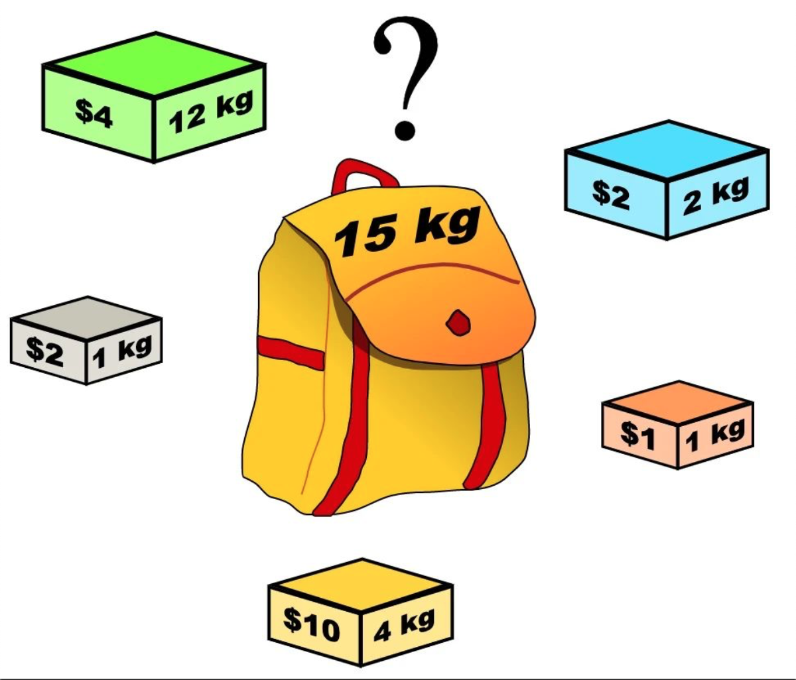
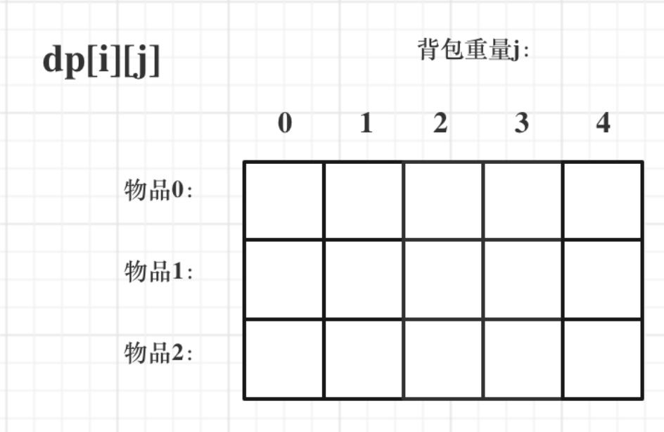
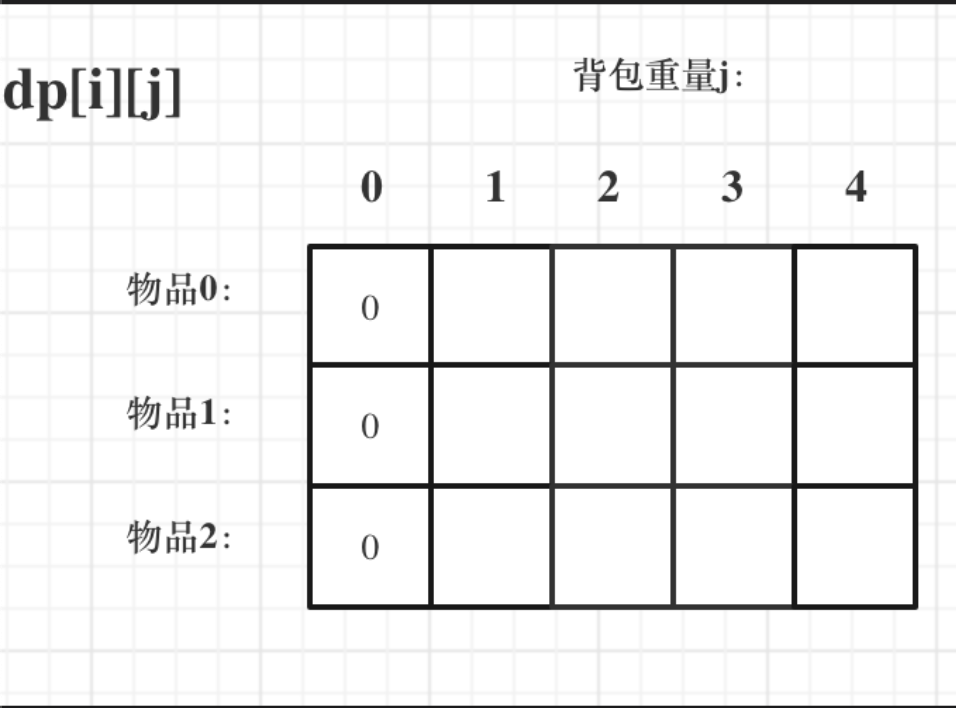
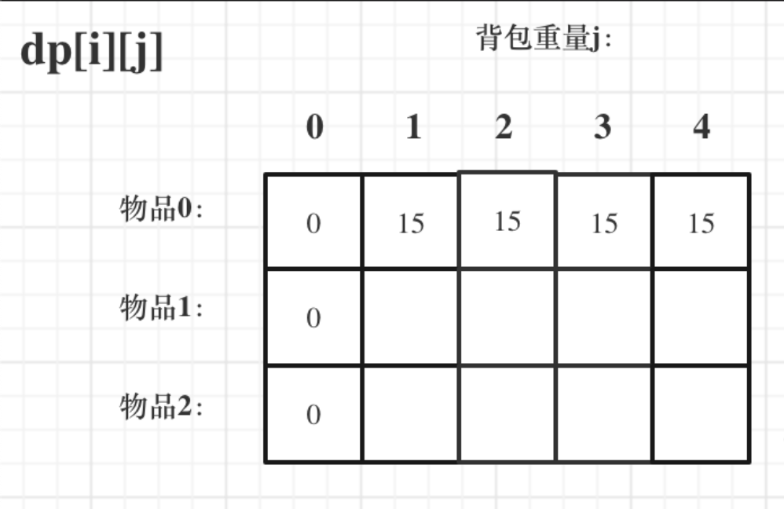
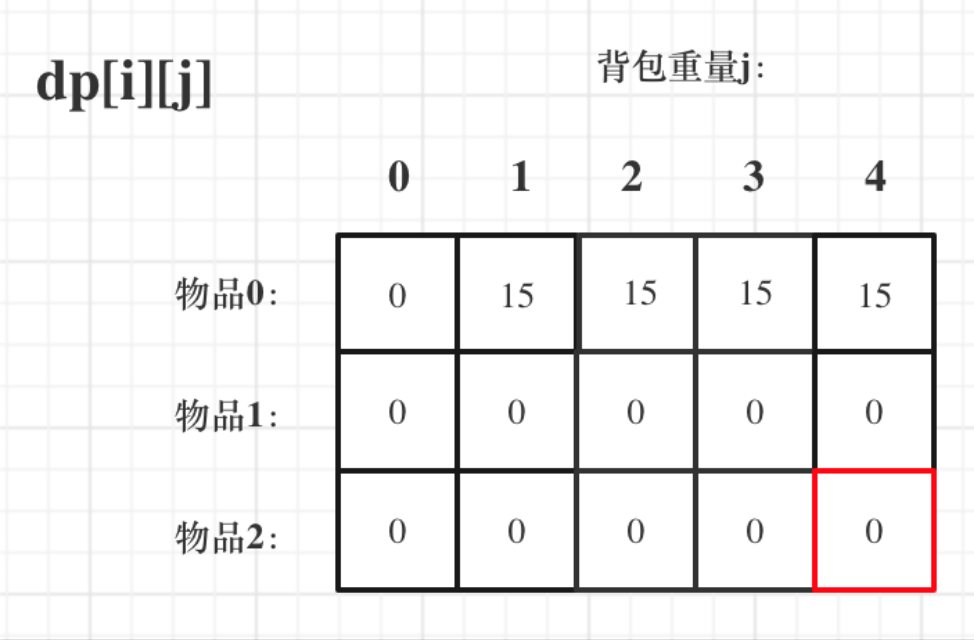
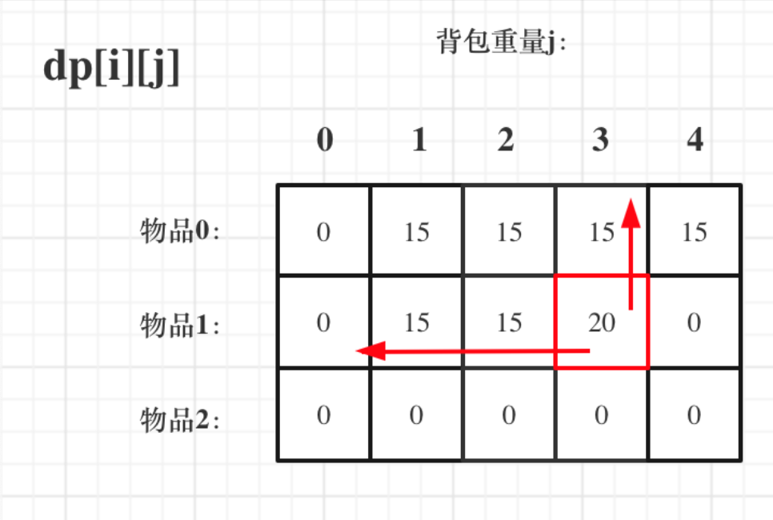
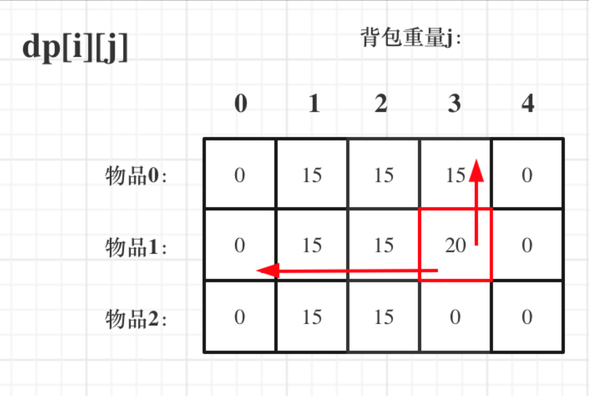
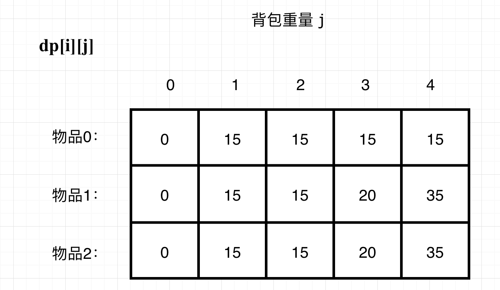

> 参考代码随想录

## 背包问题

在讲解背包问题的时候，都是围绕着动态五部曲进行讲解，把这五部都搞透才算是对动规理解深入了。

动规五部曲如下:

1. 确定dp数组(dp table)以及下标的含义 
2. 确定递推公式
3. dp数组如何初始化
4. 确定遍历顺序
5. 举例推导dp数组(重要)

### 01背包--二维数组

有N件物品和一个最多能被重量为W 的背包。第`i`件物品的重量是`weight[i]`，得到的价值是`value[i]` 。**每件物品只能用一次**，求解将哪些物品装入背包里物品价值总和最大。




每一件物品其实只有两个状态，取或者不取，所以可以使用回溯法搜索出所有的情况，那么时间复杂度就是$O$($2$<sup>n</sup>)，这里的n表示物品数量。

所以暴力的解法是指数级别的时间复杂度。进而才需要动态规划的解法来进行优化！

在下面的讲解中，我举一个例子：

背包最大重量为4。

物品为：

|     | 重量  |  价值  |
|  ----  | ----  | --- |
| 物品0  | 1 | 15  |
| 物品1  | 3 |  20  |
| 物品2  | 4 |  30  |

问背包能背的物品最大价值是多少？

以下讲解和图示中出现的数字都是以这个例子为例。

### 二维`dp`数组`01`背包

**依据动态规划五部曲**

- 1.**确定dp数组以及下标的含义**

对于背包问题，有一种写法， 是使用二维数组，即`dp[i][j]` 表示从下标为`[0-i]`的物品里任意取，放进容量为`j`的背包，价值总和最大是多少。

只看这个二维数组的定义，大家一定会有点懵，看下面这个图：



要时刻记着这个`dp`数组的含义，下面的一些步骤都围绕这`dp`数组的含义进行的，如果哪里看懵了，就来回顾一下`i`代表什么，`j`又代表什么。

- 2.**确定递推公式**

再回顾一下`dp[i][j]`的含义：从下标为`[0-i]`的物品里任意取，放进容量为`j`的背包，价值总和最大是多少。

那么可以有两个方向推出来`dp[i][j]`，

* 由`dp[i - 1][j]`推出，即背包容量为`j`，里面不放物品`i`的最大价值，此时`dp[i][j]`就是`dp[i - 1][j]`

> 在还没有放入第`i`个物品时背包的容量为`j`

*  由`dp[i - 1][j - weight[i]]`推出，`dp[i - 1][j - weight[i]]` 为背包容量为`j - weight[i]`的时候不放物品`i`的最大价值，那么`dp[i - 1][j - weight[i]] + value[i] `（物品`i`的价值），就是背包放物品`i`得到的最大价值

所以递归公式：`dp[i][j] = max(dp[i - 1][j], dp[i - 1][j - weight[i]] + value[i]);`
> `i`物品之前的价值和放上`i`物品的时候的价值中取最大值

- 3.**dp数组如何初始化**

关于初始化，一定要和`dp`数组的定义吻合，否则到递推公式的时候就会越来越乱。

首先从`dp[i][j]`的定义出发，如果背包容量`j`为`0`的话，即`dp[i][0]`，无论是选取哪些物品，背包价值总和一定为`0`。如图：



再看其他情况。

状态转移方程 `dp[i][j] = max(dp[i - 1][j], dp[i - 1][j - weight[i]] + value[i]);` 可以看出`i` 是由 `i-1`推导出来，那么`i`为`0`的时候就一定要初始化。

`dp[0][j]`，即：`i`为`0`，存放编号`0`的物品的时候，各个容量的背包所能存放的最大价值。

代码如下：

```cpp
// 倒叙遍历
for (int j = bagWeight; j >= weight[0]; j--) {
    dp[0][j] = dp[0][j - weight[0]] + value[0]; // 初始化i为0时候的情况
    //这时候背包的容量为j，所以没有放入物品0时背包的容量为j - weight[0]。
```

这个初始化为什么是倒叙的遍历的？正序遍历就不行么？

正序遍历还真就不行，`dp[0][j]`表示容量为`j`的背包存放物品`0`时候的最大价值，物品`0`的价值就是`15`，因为题目中说了**每个物品只有一个**！所以`dp[0][j]`如果不是初始值的话，就应该都是物品`0`的价值，也就是`15`。

但如果一旦正序遍历了，那么物品`0`就会被重复加入多次！例如代码如下：

```cpp
// 正序遍历
for (int j = weight[0]; j <= bagWeight; j++) {
    dp[0][j] = dp[0][j - weight[0]] + value[0];
}
```

例如`dp[0][1]` 是`15`，到了`dp[0][2] = dp[0][2 - 1] + 15;` 也就是`dp[0][2] = 30` 了，那么就是物品`0`被重复放入了。

**所以一定要倒叙遍历，保证物品`0`只被放入一次！这一点对`01`背包很重要，后面在讲解滚动数组的时候，还会用到倒叙遍历来保证物品使用一次！**

此时`dp`数组初始化情况如图所示：



`dp[i][j]`在推导的时候一定是取价值最大的数，如果题目给的价值都是正整数那么非`0`下标都初始化为`0`就可以了，因为`0`就是最小的了，不会影响取最大价值的结果。

如果题目给的价值有负数，那么非0下标就要初始化为负无穷了。例如：一个物品的价值是`-2`，但对应的位置依然初始化为`0`，那么取最大值的时候，就会取`0`而不是`-2`了，所以要初始化为负无穷。

这样才能让`dp`数组在递归公式的过程中取最大的价值，而不是被初始值覆盖了。

最后初始化代码如下：
```cpp
// 初始化 dp
vector<vector<int>> dp(weight.size() + 1, vector<int>(bagWeight + 1, 0));
for (int j = bagWeight; j >= weight[0]; j--) {
    dp[0][j] = dp[0][j - weight[0]] + value[0];
}
```
费了这么大的功夫，才把如何初始化讲清楚，相信不少同学平时初始化`dp`数组是凭感觉来的，但有时候感觉是不靠谱的。

- 4.**确定遍历顺序**

在如下图中，可以看出，有两个遍历的维度：物品与背包重量。



那么问题来了，先遍历 物品还是先遍历背包重量呢？

其实都可以！！但是先遍历物品更好理解。

那么我先给出先遍历物品，然后遍历背包重量的代码。

```cpp
// weight数组的大小 就是物品个数
for(int i = 1; i < weight.size(); i++) { // 遍历物品
    for(int j = 0; j <= bagWeight; j++) { // 遍历背包容量 
        if (j < weight[i]) dp[i][j] = dp[i - 1][j]; // 这个是为了展现dp数组里元素的变化
        else dp[i][j] = max(dp[i - 1][j], dp[i - 1][j - weight[i]] + value[i]);
        
    }
}
```
先遍历背包，再遍历物品，也是可以的！（注意我这里使用的二维dp数组）

例如这样：
```cpp
// weight数组的大小 就是物品个数
for(int j = 0; j <= bagWeight; j++) { // 遍历背包容量
    for(int i = 1; i < weight.size(); i++) { // 遍历物品
        if (j < weight[i]) dp[i][j] = dp[i - 1][j];
        else dp[i][j] = max(dp[i - 1][j], dp[i - 1][j - weight[i]] + value[i]);
    }
}
```
为什么也是可以的呢？

要理解递归的本质和递推的方向。

`dp[i][j] = max(dp[i - 1][j]`, `dp[i - 1][j - weight[i]] + value[i]); `递归公式中可以看出`dp[i][j]`是靠`dp[i-1][j]`和`dp[i - 1][j - weight[i]]`推导出来的。

`dp[i-1][j]`和`dp[i - 1][j - weight[i]] `都在`dp[i][j]`的左上角方向（包括正左和正上两个方向），那么先遍历物品，再遍历背包的过程如图所示：



再来看看先遍历背包，再遍历物品呢，如图：



大家可以看出，虽然两个`for`循环遍历的次序不同，但是`dp[i][j]`所需要的数据就是左上角，根本不影响`dp[i][j]`公式的推导！

但先遍历物品再遍历背包这个顺序更好理解。

其实背包问题里，两个`for`循环的先后循序是非常有讲究的，理解遍历顺序其实比理解推导公式难多了。

- 5.**举例推导dp数组**

来看一下对应的dp数组的数值，如图：



最终结果就是`dp[2][4]`。

建议大家此时自己在纸上推导一遍，看看dp数组里每一个数值是不是这样的。

做动态规划的题目，最好的过程就是自己在纸上举一个例子把对应的dp数组的数值推导一下，然后在动手写代码！

很多同学做dp题目，遇到各种问题，然后凭感觉东改改西改改，怎么改都不对，或者稀里糊涂就改过了。

主要就是自己没有动手推导一下dp数组的演变过程，如果推导明白了，代码写出来就算有问题，只要把dp数组打印出来，对比一下和自己推导的有什么差异，很快就可以发现问题了。

- **完整代码**

```cpp
void test_2_wei_bag_problem1() {
    vector<int> weight = {1, 3, 4};
    vector<int> value = {15, 20, 30};
    int bagWeight = 4;

    // 二维数组
    vector<vector<int>> dp(weight.size() + 1, vector<int>(bagWeight + 1, 0));

    // 初始化 
    for (int j = bagWeight; j >= weight[0]; j--) {
        dp[0][j] = dp[0][j - weight[0]] + value[0];
    }

    // weight数组的大小 就是物品个数
    for(int i = 1; i < weight.size(); i++) { // 遍历物品
        for(int j = 0; j <= bagWeight; j++) { // 遍历背包容量
            if (j < weight[i]) dp[i][j] = dp[i - 1][j];
            else dp[i][j] = max(dp[i - 1][j], dp[i - 1][j - weight[i]] + value[i]);

        }
    }

    cout << dp[weight.size() - 1][bagWeight] << endl;
}

int main() {
    test_2_wei_bag_problem1();
}
```

以上遍历的过程也可以这么写：
```
// 遍历过程
for(int i = 1; i < weight.size(); i++) { // 遍历物品
    for(int j = 0; j <= bagWeight; j++) { // 遍历背包容量
        if (j - weight[i] >= 0) {
            dp[i][j] = max(dp[i - 1][j], dp[i - 1][j - weight[i]] + value[i]);
        }
    }
}

```

这么写打印出来的dp数据这就是这样：


空出来的`0`其实是用不上的，版本一 能把完整的dp数组打印出来，出来我用版本一来讲解。

### 01背包--滚动数组


## 416.分割等和子集

[题目来源](https://leetcode-cn.com/problems/partition-equal-subset-sum/)

给定一个**只包含正整数**的**非空**数组。是否可以将这个数组分割成两个子集，使得两个子集的元素和相等。

注意:

每个数组中的元素不会超过 100
数组的大小不会超过 200

示例 
```

输入: [1, 5, 11, 5]

输出: true

解释: 数组可以分割成 [1, 5, 5] 和 [11].


输入: [1, 2, 3, 5]

输出: false

解释: 数组不能分割成两个元素和相等的子集.
```

题解：

这道题目初步看，是如下两题几乎是一样的，大家可以用回溯法，解决如下两题：

[698.划分为k个相等的子集](https://leetcode-cn.com/problems/partition-to-k-equal-sum-subsets/) 

[473.火柴拼正方形](https://leetcode-cn.com/problems/matchsticks-to-square)

这道题目是要找是否可以将这个数组分割成两个子集，使得两个子集的元素和相等。 那么只要找到集合里能够出现 `sum / 2` 的子集总和，就算是可以分割成两个相同元素和子集了。

本题是可以用回溯暴力搜索出所有答案的，但最后超时了，也不想再优化了，放弃回溯，直接上`01`背包 吧。

**背包问题**，大家都知道，有`N`件物品和一个最多能被重量为W 的背包。第`i`件物品的重量是`weight[i]`，得到的价值是`value[i]` 。每件物品只能用一次，求解将哪些物品装入背包里物品价值总和最大。

要注意题目**描述中商品是不是可以重复放入**。

本题 元素我们只能用一次。

只有确定了如下四点，才能把01背包问题套到本题上来。

- 背包的体积为`sum / 2`
- 背包要放入的商品（集合里的元素）重量为 元素的数值，价值也为元素的数值
- 背包如何正好装满，说明找到了总和为 `sum / 2` 的子集。
- 背包中每一个元素是不可重复放入。

**动规五部曲分析如下**：

- 确定dp数组以及下标的含义

`dp[i]`表示 背包总容量是`i`，最大可以凑成`i`的子集总和为`dp[i]`。

- 确定递推公式

01背包的递推公式为：`dp[j] = max(dp[j], dp[j - weight[i]] + value[i])`;

本题，相当于背包里放入数值，那么物品`i`的重量是`nums[i]`，其价值也是`nums[i]`。

所以递推公式：`dp[j] = max(dp[j], dp[j - nums[i]] + nums[i])`;

- dp数组如何初始化

在01背包，一维dp如何初始化，已经讲过，

从`dp[j]`的定义来看，首先`dp[0]`一定是0。

如果如果题目给的价值都是正整数那么非0下标都初始化为0就可以了，如果题目给的价值有负数，那么非0下标就要初始化为负无穷。

这样才能让dp数组在递归公式的过程中取的最大的价值，而不是被初始值覆盖了。

本题题目中 只包含正整数的非空数组，所以非0下标的元素初始化为0就可以了。

代码如下：
```cpp
// 题目中说：每个数组中的元素不会超过 100，数组的大小不会超过 200
// 那么背包内总和不会大于20000，所以定义一个20000大的数组。
vector<int> dp(20001, 0); 
```
- 确定遍历顺序

在动态规划：关于01背包问题，你该了解这些！（滚动数组）中就已经说明：如果使用一维dp数组，物品遍历的for循环放在外层，遍历背包的for循环放在内层，且内层for循环倒叙遍历！

代码如下：
```cpp
// 开始 01背包 
for(int i = 0; i < nums.size(); i++) {
    for(int j = target; j >= nums[i]; j--) { // 每一个元素一定是不可重复放入，所以从大到小遍历
        dp[j] = max(dp[j], dp[j - nums[i]] + nums[i]);
    }
}
```
举例推导dp数组
dp[i]的数值一定是小于等于i的。

如果dp[i] == i 说明，集合中的子集总和正好可以凑成总和i，理解这一点很重要。

用例1，输入[1,5,11,5] 为例，如图：


最后`dp[11] == 11`，说明可以将这个数组分割成两个子集，使得两个子集的元素和相等。

综上分析完毕，C++代码如下：
```cpp
class Solution {
public:
    bool canPartition(vector<int>& nums) {
        int sum = 0;

        // dp[i]中的i表示背包内总和
        // 题目中说：每个数组中的元素不会超过 100，数组的大小不会超过 200
        // 那么背包内总和不会大于20000，所以定义一个20000大的数组。
        vector<int> dp(20001, 0); 
        for (int i = 0; i < nums.size(); i++) {
            sum += nums[i];
        }
        if (sum % 2 == 1) return false;
        int target = sum / 2;

        // 开始 01背包 
        for(int i = 0; i < nums.size(); i++) {
            for(int j = target; j >= nums[i]; j--) { // 每一个元素一定是不可重复放入，所以从大到小遍历
                dp[j] = max(dp[j], dp[j - nums[i]] + nums[i]);
            }
        }
        // 集合中的元素正好可以凑成总和target 
        if (dp[target] == target) return true;
        return false;      
    }
};
```
时间复杂度：O(n)

空间复杂度：O(n)，虽然dp数组大小为一个常数，但是大常数

**看代码的话，就可以发现，基本就是按照01背包的写法来的。**


----
## 背包问题

现在有物件商品w[0,1,2,3,4],放入总容量为20的背包。具体价格和实现如下图。


假如：`B(2, 20)` 表示偷了`[0~2]`件商品后，背包中剩余的容量时`20`。

背包问题主要是围绕着下面这个公式进行：


举例子：


代码实现：

```cpp
#include <iostream>
#include <vector>

using namespace std;

#define N 6  //物件物品，定义成6
#define M 21  //总的容量，定义成20

// 动态规划数组,价值
int B[N][M] = {0};  //全部初始化成0

//物件商品，设置成6，第一件空出来，方便实现
int w[6] = {0,2,3,4,5,9}; //每件商品的重量
int v[6] = {0,3,4,5,8,10};  //每件商品的价格

//实现背包
void knpack() {
    int k,C;  //K表示第K个商品，C表示最大容量
    for(k=1;k<N;++k) {
        for(C=1;C<M;++C) {
            //如果第k件商品该种，装不下
            if(w[k] > C) {
                B[k][C] = B[k-1][C];
            }
            else {
                //偷
                int value1 = B[k-1][C-w[k]] + v[k];
                //不偷
                int value2 = B[k-1][C];
                // 然后再比较这两个大小
                if(value1 > value2) {
                    //更新最大价值
                    B[k][C] = value1;
                }
                else {
                    B[k][C] = value2;
                }
            }
        }
    }
}

int main() {
    knpack();
    cout << B[5][20] << endl;;  //5个商品，背包总容量是20的时候，最大价值
}

//输出：26
```