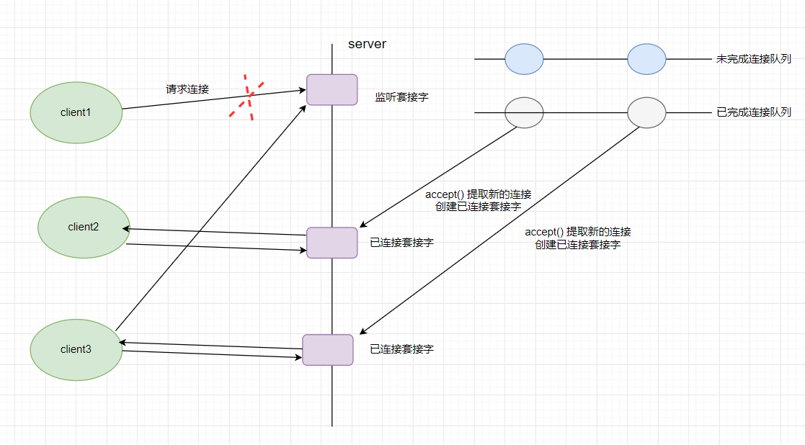

## 1 Tcp和Socket
### 1.1 字节序
计算机有两种存储数据的方式:**大端字节序** （big endian）和**小段字节序**（little endian）。

比如：数值0x2211使用两个字节储存：高位字节是0x22，低位字节是0x11

>- 大端字节序：高位字节在前面，低位字节在后面,这符合人类的读写数值方法
>- 小端字节序：地位字节在前面，高位字节在后面。

比如：`0x1234567`的大端字节序和小端字节序的写法如下图


**为什么会有小端字节序？**

计算机都是从低位开始处理字节效率比较高，因为计算都是从低位开始的，因此计算机内部都是小端字节序。            
但是人类比较习惯大端字节序，所以除了计算机内部处理，其他场合一般都用大端字节序，比如网络参数，文件存储。

计算机在处理字节序的时候是按照顺序读取字节的，**如果是大端字节序，先读到的就是高位字节，后读到的就是低位字节。小端字节序正好相反。**

> 注意：**只有读取的时候，才必须区分字节序，其他情况都不用考虑。**          
> 处理器读取外部数据的时候，必须知道数据的字节序，将其转成正确的值。然后，就正常使用这个值，完全不用再考虑字节序。      
> 即使是向外部设备写入数据，也不用考虑字节序，正常写入一个值即可。外部设备会自己处理字节序的问题。

- 网络字节序和主机字节序的转换函数

```c
#include <arpa/inet.h>

uint32_t htonl(uint32_t hostlong);
uint16_t htons(uint16_t hostshort);
uint32_t ntohl(uint32_t netlong);
uint16_t ntohs(uint16_t netshort);
```

h表示host，n表示network，l表示32位长整数，s表示16位短整数。

> [参考](http://www.ruanyifeng.com/blog/2016/11/byte-order.html)

### 1.2 socket模型创建

- 基于TCP创建的socket模型流程图


#### 1.2.1 socket函数

这个函数有三个参数，第一个是指定协议族，第二个是指定`socket`的类型，第三个是指定具体的协议。

```c
#include <sys/types.h> /* See NOTES */
#include <sys/socket.h>
int socket(int domain, int type, int protocol);
```

- domain：哪个底层协议族？
  * `AF_INET` 这是大多数用来产生`socket`的协议，使用`TCP`或`UDP`来传输，用`IPv4`的地址
  * `AF_INET6`与上面类似，不过是来用`IPv6`的地址
  * `AF_UNIX `本地协议，使用在`Unix`和`Linux`系统上，一般都是当客户端和服务器在同一台及其上的时候使用

- type：指定`socket`的类型,也就是哪个服务？
  * `SOCK_STREAM`:（数据流，`TCP`）)这个协议是按照顺序的、可靠的、数据完整的基于字节流的连接。这是一个使用最多的`socket`类型，这个`socket`是使用`TCP`来进行传输。
  * `SOCK_DGRAM` :（数据报，UDP）这个协议是无连接的、固定长度的传输调用。该协议是不可靠的，使用UDP来进行它的连接。
  * `SOCK_SEQPACKET`:该协议是双线路的、可靠的连接，发送固定长度的数据包进行传输。必须把这个包完整的接受才能进行读取。
  * `SOCK_RAW`: `socket`类型提供单一的网络访问，这个`socket`类型使用ICMP公共协议。（ping、traceroute使用该协议）
  * `SOCK_RDM` 这个类型是很少使用的，在大部分的操作系统上没有实现，它是提供给数据链路层使用，不保证数据包的顺序

- `protocol`：指定具体的协议，也就是指定本次通信能接受的数据包的类型和发送数据包的类型,常见的值有：

	`IPPROTO_TCP`，`TCP`协议

	I`PPROTO_UDP`，`UPD`协议

	如果调用者不希望特别指定使用的协议，则置为`0`，使用默认的连接模式。
- 成功：返回指向新创建的`socket`的文件描述符，失败：返回`-1`。

#### 1.2.2 bind函数

```c
#include <sys/types.h> /* See NOTES */
#include <sys/socket.h>
int bind(int sockfd, const struct sockaddr *addr, socklen_t addrlen);
```
- `sockfd`：
	* `socket`文件描述符
- `addr`:
	* 构造出IP地址加端口号
- `addrlen`:
	* `sizeof(addr)`长度
- 返回值：
	* 成功返回`0`，失败返回`-1`。

服务器程序所监听的网络地址和端口号通常是固定不变的，客户端程序得知服务器程序的地址和端口号后就可以向服务器发起连接，因此服务器需要调用`bind`绑定一个固定的网络地址和端口号。

`bind()`的作用是将参数`sockfd`和`addr`绑定在一起，使`sockfd`这个用于网络通讯的文件描述符监听`addr`所描述的地址和端口号。

#### 1.2.3 connect函数

```c
#include <sys/types.h> 					/* See NOTES */
#include <sys/socket.h>
int connect(int sockfd, const struct sockaddr *addr, socklen_t addrlen);
```

```cpp
sockdf:
	socket文件描述符
addr:
	传入参数，指定服务器端地址信息，含IP地址和端口号
addrlen:
	传入参数,传入sizeof(addr)大小
返回值：
	成功返回0，失败返回-1，设置errno
```

客户端需要调用`connect()`连接服务器，用来与服务器建立一个`TCP`连接，实际是发起`3`次握手过程，`connect`和`bind`的参数形式一致，区别在于`bind`的参数是自己的地址，而`connect`的参数是对方的地址。`connect()`成功返回`0`，出错返回`-1`。

#### 1.2.4 listen函数

```c
#include <sys/types.h> /* See NOTES */
#include <sys/socket.h>
int listen(int sockfd, int backlog);
```

```
sockfd:
	socket文件描述符
backlog:
	排队建立3次握手队列和刚刚建立3次握手队列的链接数和
```

可以通过命令查看默认的`backlog`:

```bash
$ cat /proc/sys/net/ipv4/tcp_max_syn_backlog
128
```
典型的服务器程序可以同时服务于多个客户端，当有客户端发起连接时，服务器调用的`accept()`返回并接受这个连接，如果有大量的客户端发起连接而服务器来不及处理，尚未`accept`的客户端就处于连接等待状态，`listen()`声明`sockfd`处于监听状态，并且最多允许有`backlog`个客户端处于连接待状态，如果接收到更多的连接请求就忽略。`listen()`成功返回`0`，失败返回`-1`。

#### 1.2.5 accept函数

```c
#include <sys/types.h> 		/* See NOTES */
#include <sys/socket.h>
int accept(int sockfd, struct sockaddr *addr, socklen_t *addrlen);
```

```
sockdf:
	socket文件描述符
addr:
	传出参数，返回链接客户端地址信息，含IP地址和端口号
addrlen:
	传入传出参数（值-结果）,传入sizeof(addr)大小，函数返回时返回真正接收到地址结构体的大小
返回值：
	成功返回一个新的socket文件描述符，用于和客户端通信，失败返回-1，设置errno
```

三次握手完成后，服务器调用`accept()`接受连接，如果服务器调用`accept()`时还没有客户端的连接请求，就阻塞等待直到有客户端连接上来。`addr`是一个传出参数，`accept()`返回时传出客户端的**地址**和**端口号**。`addrlen`参数是一个传入传出参数`（value-result argument）`，传入的是调用者提供的缓冲区`addr`的长度以避免缓冲区溢出问题，传出的是客户端地址结构体的实际长度（有可能没有占满调用者提供的缓冲区）。如果给`addr`参数传`NULL`，表示不关心客户端的地址。

> TCP服务端通信的简单流程:
> **创建套接字** --> **绑定端口和IP** --> **监听套接字** (创建两个连接队列，一个未完成连接队列，经过三次握手成功后到已完成连接队列)--> **提取连接**（从已完成队列提取，提取连接的得到一个新的连接套接字，接下来用这个已连接套接字和客户端通信）--> **读写数据** --> **关闭**

客户端`client1`向`server`的监听套接字建立连接，然后通过调用`accept()`函数从已完成连接队列中提取新的连接，创建已连接套接字，然后用已连接套接字和`client1`进行通信，这时候监听套接字和`client1`的连接就可以断开了，如果有新的`client2`来请求同样和监听套接字建立请求连接。



### 1.3 server和client通信示例（TCP）

#### 1.3.1 client

`client.c`的作用是从命令行参数中获得一个字符串发给服务器，然后接收服务器返回的字符串并打印。

[client.c](/计算机网络/code/client.md)

#### 1.3.2 server

`server.c`的作用是从客户端读字符，然后将每个字符转换为大写并回送给客户端。

[server.c](/计算机网络/code/server.md)    


测试：
```bash
gcc tcp-server.c -o server
gcc tcp-client.c -o client
两个窗口
./server

./client
```

> 上面的服务器只能处理一个客户端，下面将介绍使用多线程方式实现服务器可以处理多个客户端

## 2.高并发服务器

### 2.1 多进程并发服务器

使用多进程并发服务器时要考虑以下几点：
1.	父进程最大文件描述个数(父进程中需要close关闭accept返回的新文件描述符)
2.	系统内创建进程个数(与内存大小相关)
3.	进程创建过多是否降低整体服务性能(进程调度)

流程：
```
创建套接字
绑定
监听
while(1)  //因为有多个客户端
{
	提取连接
	fork创建子进程
	子进程中关闭lfd,服务客户端
	父进程关闭cfd，回收子进程资源
}
关闭
```
使用包裹`wrap`函数实现
 
[process-sever](/计算机网络/code/process-sever.md)		

[wrap.c](/计算机网络/code/wrapc.md)
[wrap.h](/计算机网络/code/wraph.md)

### 2.2 多线程并发服务器

在使用线程模型开发服务器时需考虑以下问题：
1.	调整进程内最大文件描述符上限
2.	线程如有共享数据，考虑线程同步
3.	服务于客户端线程退出时，退出处理。（退出值，分离态）
4.	系统负载，随着链接客户端增加，导致其它线程不能及时得到CPU

[pthread_server](/计算机网络/code/pthread_server.md)

### 2.3 多路I/O转接服务器

多路IO转接服务器也叫做多任务IO服务器。该类服务器实现的主旨思想是，不再由应用程序自己监视客户端连接，取而代之由内核替应用程序监视文件。
主要使用的方法有三种

#### select
1.	select能监听的文件描述符个数受限于FD_SETSIZE，一般为1024，单纯改变进程打开的文件描述符个数并不能改变select监听文件个数

2.	解决1024以下客户端时使用select是很合适的，但如果链接客户端过多，select采用的是轮询模型，会大大降低服务器响应效率，不应在select上投入更多精力。

- select函数的API
  
```c
#include <sys/select.h>
 /* According to earlier standards */
       #include <sys/time.h>
       #include <sys/types.h>
       #include <unistd.h>

       int select(int nfds, fd_set *readfds, fd_set *writefds,
                  fd_set *exceptfds, struct timeval *timeout);
```

- 功能: 监听多个文件描述符的属性变化(读,写,异常)

```c
       void FD_CLR(int fd, fd_set *set);
       int  FD_ISSET(int fd, fd_set *set);
       void FD_SET(int fd, fd_set *set);
       void FD_ZERO(fd_set *set);
```

- 参数:

```c
    nfds  : 最大文件描述符+1
    readfds : 需要监听的读的文件描述符存放集合
    writefds :需要监听的写的文件描述符存放集合   NULL
    exceptfds : 需要监听的异常的文件描述符存放集合  NULL
    timeout: 多长时间监听一次   固定的时间,限时等待   NULL 永久监听
    struct timeval {
               long    tv_sec;         /* seconds */ 秒
               long    tv_usec;        /* microseconds */微妙
           };

```

- 返回值: 返回的是变化的文件描述符的个数

注意: 变化的文件描述符会存在监听的集合中,未变化的文件描述符会从集合中删除

[select.c](/计算机网络/code/select.md)		

[wrap.c](/计算机网络/code/wrapc.md)
[wrap.h](/计算机网络/code/wraph.md)

#### poll

相较于select而言，poll的优势：
- 1.传入、传出事件分离。无需每次调用时，重新设定监听事件。
- 2.文件描述符上限，可突破1024限制。能监控的最大上限数可使用配置文件调整。

缺点和select一样:
- 每次都需要将需要监听的文件描述符从应用层拷贝到内核
- 每次都需要将数组中的元素遍历一遍才知道哪个变化了
- 大量并发,少量活跃效率低

#### epoll

特点：

- 没有文件描述符1024的限制
- 以后每次监听都不要再监听的文件描述符拷贝到内核
- 返回的是已经变化的文件描述符，不需要遍历树

流程：
- 创建一个红黑树
- 将需要监听的文件描述符上树
- 监听

具体API：

- 创建红黑树
  
```c
    #include <sys/epoll.h>
      int epoll_create(int size);
    参数:
    size :  监听的文件描述符的上限,  2.6版本之后写1即可,
    返回:  返回树的句柄
```

- 上树  下树 修改节点
  
```c
    epoll_ctl
#include <sys/epoll.h>
int epoll_ctl(int epfd, int op, int fd, struct epoll_event *event);
参数:
    epfd : 树的句柄
    op : EPOLL_CTL_ADD 上树   EPOLL_CTL_DEL 下树 EPOLL_CTL_MOD 修改
    fd : 上树,下树的文件描述符
    event :   上树的节点
    typedef union epoll_data {
               void        *ptr;
               int          fd;
               uint32_t     u32;
               uint64_t     u64;
           } epoll_data_t;

           struct epoll_event {
               uint32_t     events;      /* Epoll events */  需要监听的事件
               epoll_data_t data;        /* User data variable */ 需要监听的文件描述符
           };

将cfd上树
   int epfd =  epoll_create(1);
struct epoll_event ev;
ev. data.fd = cfd;
ev.events = EPOLLIN;
epoll_ctl(epfd, EPOLL_CTL_ADD,cfd, &ev);
```

- 监听

```c
    #include <sys/epoll.h>

       int epoll_wait(int epfd, struct epoll_event *events,
                      int maxevents, int timeout);
    功能: 监听树上文件描述符的变化
    epfd : 数的句柄
    events : 接收变化的节点的数组的首地址
    maxevents :  数组元素的个数
    timeout : -1 永久监听  大于等于0 限时等待
返回值: 返回的是变化的文件描述符个数
```

**示例**：

父进程：
	用`epoll`去监听管道，如果监听到有fd[0]有变化就去读
	
子进程：
	每5s向管道写数据

```c
#include <stdio.h>
#include <unistd.h>
#include <string.h>
#include <sys/epoll.h>
int main(int argc, char *argv[])
{
	int fd[2];
	pipe(fd);
	//创建子进程
	pid_t pid;
	pid = fork();
	if(pid < 0)
		perror("");
	else if(pid == 0)
	{
		close(fd[0]);
		char buf[5];
		char ch='a';
		while(1)
		{
			sleep(3);
			memset(buf,ch++,sizeof(buf));
			write(fd[1],buf,5);

		
		}

	}
	else
	{
		close(fd[1]);
		//创建树
		int epfd = epoll_create(1);
		struct epoll_event ev,evs[1];
		ev.data.fd = fd[0];
		ev.events = EPOLLIN;
		epoll_ctl(epfd,EPOLL_CTL_ADD,fd[0],&ev);//上树
		//监听
		while(1)
		{
			int n = epoll_wait(epfd,evs,1,-1);
			if(n == 1)
			{
				char buf[128]="";
				int ret  = read(fd[0],buf,sizeof(buf));
				if(ret <= 0)
				{
					close(fd[0]);
					epoll_ctl(epfd,EPOLL_CTL_DEL,fd[0],&ev);
					break;
				}
				else
				{
					printf("%s\n",buf);
				}
			
			}
		}
	}
	return 0;
}
```
运行结果：
```bash
$ gcc pipe-epoll.c 
$ ./a.out 
aaaaa
bbbbb
...
```

- epoll-server

[select.c](/计算机网络/code/select.md)
