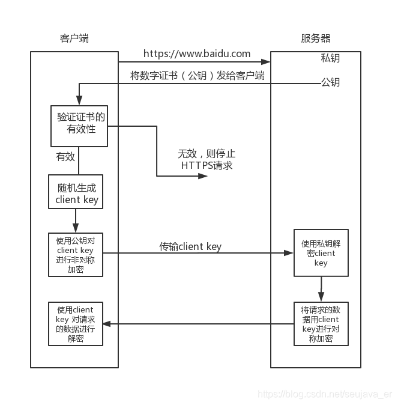

## 1.HTTPS介绍

HTTPS是一种应用层协议，本质上来说它是HTTP协议的一种变种。HTTPS比HTTP协议安全，因为HTTP是明文传输，而HTTPS是加密传输，加密过程中使用了三种加密手段，分别是证书，对称加密和非对称加密。HTTPS相比于HTTP多了一层SSL/TSL，其构造如下：

- 证书加密    
    
服务器在使用证书加密之前需要去证书颁发机构申请该服务器的证书，在HTTPS的请求过程服务器端将会把本服务器的证书发送给客户端，客户端进行证书验证，以此来验证服务器的身份。

- 对称加密 
     
HTTPS的请求中，客户端和服务器之间的通信的数据是通过对称加密算法进行加密的。对称加密，也就是在加密和解密的过程使用同一个私钥进行加密以及解密，而且对称加密算法是公开的，所以该私钥是不能够泄漏的，一旦泄漏，对称加密形同虚设。

上述私钥是可能泄漏的，原因是上述私钥是需要在网络中进行传输的。      
**流程**: 在A端生成私钥，传递给B端（传递过程需要是安全的），后面A端使用该私钥加密，传递数据报文到B端，B端使用接受到的私钥解密。

(1)加密过程：加密算法+明文+私钥------> 密文

(2)解密过程：解密算法+密文+私钥-----> 明文

适用场景：上述过程是不复杂的，对大量数据进行加密时，对称加密是适用的，速度快

- 非对称加密算法

HTTPS的请求中也使用了非对称加密算法。非对称加密，加密和解密过程使用不同的密钥，一个公钥，对外公开，一个私钥，仅是解密端拥有。由于公钥和私钥是分开的，非对称加密算法安全级别高，加密密文长度有限制，适用于对少量数据进行加密，速度较慢。

case1：使用公钥加密，私钥解密

加密过程：加密算法+明文+共钥------> 密文

解密过程：解密算法+密文+私钥------> 明文

流程：A端向B端请求，B端返回公钥给A端，然后A端使用公钥加密，传递给数据报文给B端，B端使用自己的私钥进行解密。

case2：使用私钥加密，公钥解密

加密过程：加密算法+明文+私钥------> 密文

解密过程：解密算法+密文+共钥------> 明文

## HTTPS进行的流程
HTTPS作为一种安全的应用层协议，它使用了以上三种加密手段，我们现在尝试分析其加密的思想。

首先，数据正文一般数据量较大，适用于对称加密，因为对称加密速度快，适应于大量数据加密，但是安全级别低，其中对称加密的私钥需要在网络中传输，容易被盗取；

其次，正因为非对称机密私钥易被盗取，所以我们需要对这个私钥进行加密，而且安全级别要求高，所以这个可以用非对称加密进行加密，原因是对称加密的私钥数据量小，非对称加密可以提供高安全级别和高响应速度。

最后，由于非对称加密的公钥可以在网络中传输，如何保证公钥传送到给正确的一方，这个时候使用了证书来验证。证书不是保证公钥的安全性，而是验证正确的交互方。可以使用下图进行说明：

上述过程就是两次HTTP请求，其详细过程如下：

1.客户端想服务器发起HTTPS的请求，连接到服务器的443端口；

2.服务器将非对称加密的公钥传递给客户端，以证书的形式回传到客户端

3.服务器接受到该公钥进行验证，就是验证2中证书，如果有问题，则HTTPS请求无法继续；如果没有问题，则上述公钥是合格的。（第一次HTTP请求）客户端这个时候随机生成一个私钥，成为client key,客户端私钥，用于对称加密数据的。使用前面的公钥对client key进行非对称加密；

4.进行二次HTTP请求，将加密之后的client key传递给服务器；

5.服务器使用私钥进行解密，得到client key,使用client key对数据进行对称加密

6.将对称加密的数据传递给客户端，客户端使用非对称解密，得到服务器发送的数据，完成第二次HTTP请求。

[参考](https://www.jianshu.com/p/14cd2c9d2cd2)